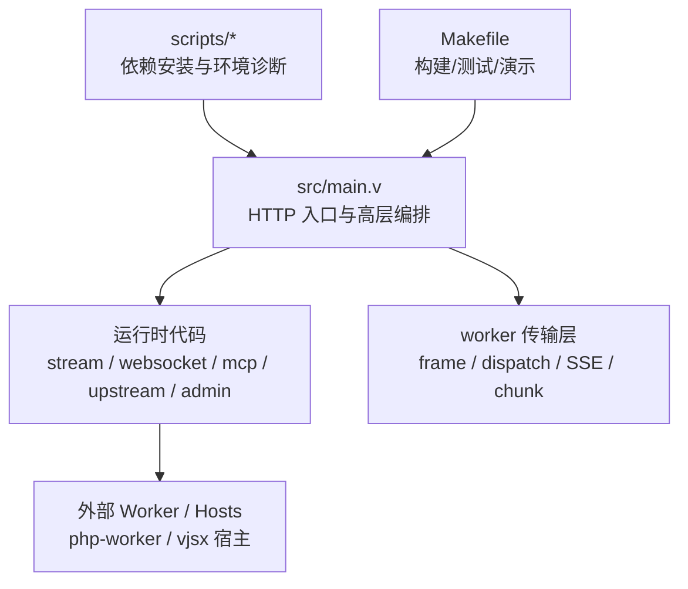
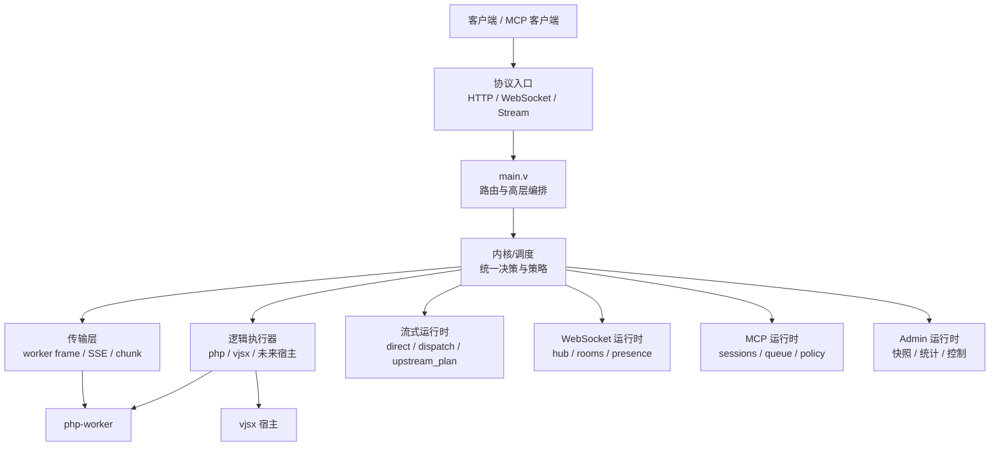
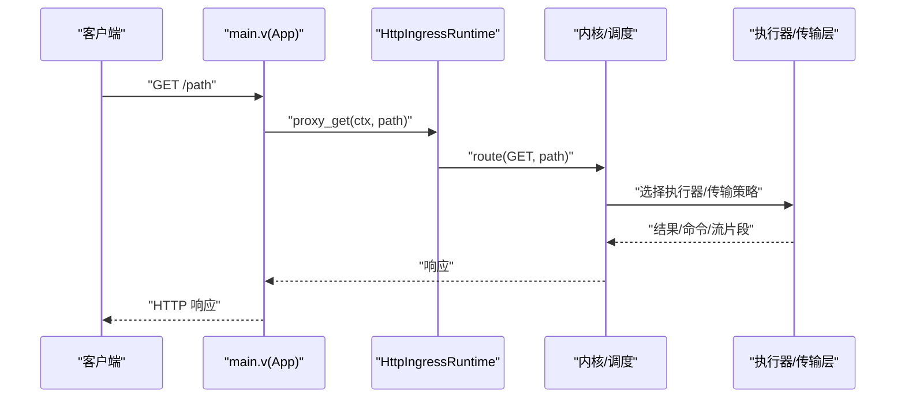
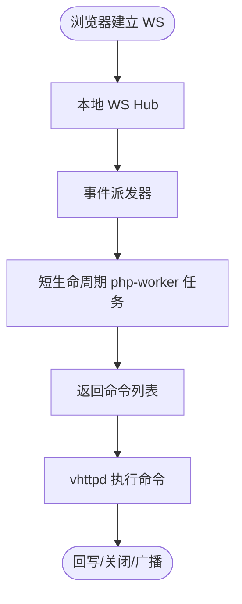

# 开发指南

<cite>
**本文引用的文件**   
- [README.md](file://README.md)
- [Makefile](file://Makefile)
- [scripts/install_deps.sh](file://scripts/install_deps.sh)
- [scripts/doctor.sh](file://scripts/doctor.sh)
- [src/main.v](file://src/main.v)
- [v.mod](file://v.mod)
- [docs/OVERVIEW.md](file://docs/OVERVIEW.md)
- [docs/RUNTIME_MODULE_MAP.md](file://docs/RUNTIME_MODULE_MAP.md)
- [docs/ARCHITECTURE_REFACTOR_BASELINE.md](file://docs/ARCHITECTURE_REFACTOR_BASELINE.md)
- [docs/PROTOCOL_PIPELINE_RELAY_ARCHITECTURE.md](file://docs/PROTOCOL_PIPELINE_RELAY_ARCHITECTURE.md)
- [docs/WEBSOCKET_PHASE2_IMPLEMENTATION_PLAN.md](file://docs/WEBSOCKET_PHASE2_IMPLEMENTATION_PLAN.md)
- [examples/codexbot-app/phpunit.xml](file://examples/codexbot-app/phpunit.xml)
</cite>

## 目录
1. [简介](#简介)
2. [项目结构](#项目结构)
3. [核心组件](#核心组件)
4. [架构总览](#架构总览)
5. [详细组件分析](#详细组件分析)
6. [依赖与构建](#依赖与构建)
7. [测试与质量](#测试与质量)
8. [贡献规范](#贡献规范)
9. [调试与可观测性](#调试与可观测性)
10. [性能分析与优化建议](#性能分析与优化建议)
11. [故障排查](#故障排查)
12. [结论与路线图](#结论与路线图)

## 简介
本指南面向开发者，覆盖从环境搭建、源码编译、依赖安装到单测与集成测试运行的完整流程；同时解释 vhttpd 的架构设计原则、代码组织方式、核心模块职责与相互关系；并提供贡献代码的规范、调试技巧、性能分析与优化建议以及未来发展方向。

vhttpd 是一个基于 V 和 veb 的高性能协议与执行宿主：统一承载 HTTP/WebSocket/Stream/MCP 等协议入口，调度 PHP worker、嵌入式 vjsx 以及其他上游流式执行体，并通过 admin plane 暴露运行时状态与运维能力。

**章节来源**
- [README.md:1-150](file://README.md#L1-L150)
- [docs/OVERVIEW.md:1-120](file://docs/OVERVIEW.md#L1-L120)

## 项目结构
仓库采用“按主题/角色”逐步演进的组织方式，当前仍以实现为中心分布，但已有明确的重构计划。顶层关键目录与文件：
- src：V 语言实现的运行时核心（HTTP 入口、调度、worker 传输、stream/websocket/mcp 运行时、admin 等）
- php/package：PHP 侧包与测试
- examples：示例应用与配置
- docs：架构与设计文档
- scripts：依赖安装与环境检查脚本
- Makefile：构建、测试与演示目标

**图表来源**
- [src/main.v:1-117](file://src/main.v#L1-L117)
- [docs/RUNTIME_MODULE_MAP.md:33-77](file://docs/RUNTIME_MODULE_MAP.md#L33-L77)

**章节来源**
- [docs/RUNTIME_MODULE_MAP.md:1-77](file://docs/RUNTIME_MODULE_MAP.md#L1-L77)
- [docs/PROTOCOL_PIPELINE_RELAY_ARCHITECTURE.md:370-439](file://docs/PROTOCOL_PIPELINE_RELAY_ARCHITECTURE.md#L370-L439)

## 核心组件
- 主入口与路由
  - main.v 定义 App 结构体，组合 veb 中间件与静态资源处理器，并将所有通用 HTTP 方法路由到数据平面运行时进行分发。
- 协议与传输
  - 负责 worker frame 读写、SSE/text chunk 写出、MCP 与 WebSocket 的 transport 辅助。
- 运行时代码
  - stream_runtime、websocket_runtime、mcp_runtime、upstream_runtime、admin_runtime 等分别承担不同协议面与运行时能力。
- 控制面与数据面
  - 控制面提供 /admin/* 接口与内部 socket；数据面处理外部请求并委派给内核与后端执行器。

**章节来源**
- [src/main.v:10-117](file://src/main.v#L10-L117)
- [docs/RUNTIME_MODULE_MAP.md:33-77](file://docs/RUNTIME_MODULE_MAP.md#L33-L77)
- [docs/ARCHITECTURE_REFACTOR_BASELINE.md:160-214](file://docs/ARCHITECTURE_REFACTOR_BASELINE.md#L160-L214)

## 架构总览
vhttpd 将协议入口、传输编排、运行时状态与 PHP worker 桥接分层解耦，遵循“veb 为 HTTP 事实来源”的设计约束，保持核心轻量，聚焦传输、worker 编排、流式生命周期与可观测性。

**图表来源**
- [src/main.v:83-117](file://src/main.v#L83-L117)
- [docs/ARCHITECTURE_REFACTOR_BASELINE.md:187-214](file://docs/ARCHITECTURE_REFACTOR_BASELINE.md#L187-L214)

## 详细组件分析

### 主入口与路由（main.v）
- 职责
  - 声明 App 结构体，组合 veb.Context 与 request_id 上下文。
  - 将所有通用 HTTP 方法映射到 HttpIngressRuntime.route，完成高层分发。
  - 提供 trace_id/request_id 解析与事件发射钩子。
- 关键点
  - 不持有具体 feature 的状态机，仅做 ingress 与编排。
  - 通过 emit 将关键事件上报至控制面。

**图表来源**
- [src/main.v:83-117](file://src/main.v#L83-L117)

**章节来源**
- [src/main.v:1-117](file://src/main.v#L1-L117)
- [docs/PROTOCOL_PIPELINE_RELAY_ARCHITECTURE.md:370-439](file://docs/PROTOCOL_PIPELINE_RELAY_ARCHITECTURE.md#L370-L439)

### 协议与传输层
- 职责
  - 定义 worker frame 编码/解码、SSE/text chunk 写出、dispatch 辅助函数。
  - 对错误进行分类与超时处理。
- 适用场景
  - 修改 worker 通信协议、调整读/写超时行为、扩展新的 stream 写出模式。

**章节来源**
- [docs/RUNTIME_MODULE_MAP.md:58-77](file://docs/RUNTIME_MODULE_MAP.md#L58-L77)

### WebSocket Phase 2 模型
- 职责
  - vhttpd 拥有连接与会话元数据，worker 仅处理短任务并返回命令列表（send/close/join/broadcast 等）。
- 优势
  - 连接与 worker 生命周期解耦，提升可扩展性与稳定性。

**图表来源**
- [docs/WEBSOCKET_PHASE2_IMPLEMENTATION_PLAN.md:74-121](file://docs/WEBSOCKET_PHASE2_IMPLEMENTATION_PLAN.md#L74-L121)

**章节来源**
- [docs/WEBSOCKET_PHASE2_IMPLEMENTATION_PLAN.md:51-121](file://docs/WEBSOCKET_PHASE2_IMPLEMENTATION_PLAN.md#L51-L121)

### 控制面与数据面
- 控制面
  - 提供 /admin/* 接口、内部 admin socket、运行时快照、worker/provider 控制。
- 数据面
  - 外部 HTTP/WebSocket/MCP/stream 入口、路由归一化、移交内核。

**章节来源**
- [docs/ARCHITECTURE_REFACTOR_BASELINE.md:171-214](file://docs/ARCHITECTURE_REFACTOR_BASELINE.md#L171-L214)

## 依赖与构建

### 环境准备
- 使用 make 提供的依赖安装目标：
  - core：基础构建依赖（OpenSSL、Boehm GC、pkg-config、SQLite/MySQL/PostgreSQL 开发库等）
  - vjsx：嵌入式 JS/TS 运行时支持（包含受管理的 QuickJS 源码检出）
  - db：默认 DB 能力依赖别名
  - full：以上全部
- 推荐步骤
  - 安装依赖：make deps-core / make deps-vjsx / make deps-db / make deps-full
  - 环境自检：make doctor

**章节来源**
- [Makefile:109-122](file://Makefile#L109-L122)
- [scripts/install_deps.sh:1-138](file://scripts/install_deps.sh#L1-L138)
- [scripts/doctor.sh:1-108](file://scripts/doctor.sh#L1-L108)
- [README.md:210-254](file://README.md#L210-L254)

### 编译与产物
- 常用目标
  - build/vhttpd：开发构建（默认启用 OpenSSL 与 DB 支持）
  - prod/build-prod：生产构建（开启 -prod，日志级别默认 warn）
  - build-db：显式启用 DB 支持
- 可选开关
  - WITH_DB=0：关闭 DB 支持
  - V_TLS_BACKEND=mbedtls：切换 TLS 后端（默认 openssl）
- 产物说明
  - 发布包会重写二进制 RPATH/@loader_path，优先加载 runtime/libs 下的捆绑库（libmysqlclient/libpq/libssl/libcrypto/libgc 等），降低部署依赖复杂度。

**章节来源**
- [Makefile:96-107](file://Makefile#L96-L107)
- [README.md:256-271](file://README.md#L256-L271)
- [README.md:300-366](file://README.md#L300-L366)

### 运行与多监听
- 基本运行
  - 通过 --config 或命令行参数启动，支持变量展开与多监听站点配置。
- 多监听模式
  - 一个进程绑定多个 host:port，每个站点独立 executor 与 app 配置。
- 服务管理
  - 推荐使用 systemd/launchd 前台运行，配合实例单元与配置文件路径。

**章节来源**
- [README.md:428-617](file://README.md#L428-L617)
- [README.md:367-411](file://README.md#L367-L411)

## 测试与质量

### 单元测试（V）
- 快速测试
  - test-fast：自动发现 src 下非 inproc 且非 db 的 *_test.v 与模块目录
- 指定文件/目录
  - 直接传入 .v 文件或目录作为目标，例如 make test src/foo_test.v
- 全量测试
  - test-all：编译并运行 src 下所有测试（含重型 inproc 与 db 相关）

**章节来源**
- [Makefile:37-67](file://Makefile#L37-L67)
- [Makefile:163-171](file://Makefile#L163-L171)
- [Makefile:198-199](file://Makefile#L198-L199)

### 单元测试（PHP）
- 运行方式
  - test-php：遍历 php/package/tests 下 *_test.php 并执行
- 示例工程测试
  - examples/codexbot-app 使用 PHPUnit，可通过其 phpunit.xml 配置运行

**章节来源**
- [Makefile:49-64](file://Makefile#L49-L64)
- [Makefile:173-177](file://Makefile#L173-L177)
- [examples/codexbot-app/phpunit.xml:1-18](file://examples/codexbot-app/phpunit.xml#L1-L18)

### 端到端测试
- 目标
  - test-e2e：调用 tests/e2e/run.sh 执行冒烟/验收类测试

**章节来源**
- [Makefile:160-161](file://Makefile#L160-L161)

## 贡献规范

### 代码风格与可读性
- 以“主题/角色”为导向组织新增代码，避免按实现语言/协议分散。
- 在涉及并发与锁的代码中，明确锁层级顺序并在注释中标注，避免逆序加锁。
- 谨慎使用静默错误处理（如 or {}），对 I/O 操作至少补充日志记录。

**章节来源**
- [docs/THEME_REFACTORING_PLAN.md:1-21](file://docs/THEME_REFACTORING_PLAN.md#L1-L21)
- [docs/refactor_0601.md:239-249](file://docs/refactor_0601.md#L239-L249)

### 提交信息格式
- 建议采用“类型 + 范围 + 简述”的结构，例如：
  - feat(worker): 增加队列容量上限配置
  - fix(stream): 修复 SSE 写出超时边界条件
  - refactor(admin): 拆分 admin 运行时为更细粒度模块
- 变更影响面较大时，附带迁移说明与兼容性备注。

[本节为通用实践建议，无需特定文件引用]

### Pull Request 流程
- 分支策略
  - 功能分支命名：feature/<描述>、fix/<描述>、refactor/<描述>
- 合并前检查
  - 确保 make test-fast 与 make test-php 通过
  - 如涉及协议/传输变更，补充最小用例或回归测试
- 文档同步
  - 对外部可见行为变更，更新 README/docs 对应章节

[本节为通用实践建议，无需特定文件引用]

## 调试与可观测性

### 运行时追踪
- 事件追踪
  - 关键事件（server.started/failed/stopped、admin.started/failed、internal_admin.error、worker.select.failed）会写入 /tmp/vhttpd_runtime_trace.log，便于定位启动与异常路径。
- Trace/Request ID
  - 支持从查询参数、请求头或 veb.request_id 中间件解析 trace_id/request_id，用于跨层关联。

**章节来源**
- [src/main.v:25-81](file://src/main.v#L25-L81)

### Admin 面板与 API
- 典型路径
  - /admin/runtime、/admin/workers、/admin/stats、/admin/runtime/upstreams/websocket 等
- 用途
  - 查看运行时快照、worker 活动、WebSocket 上游事件与发送调试

**章节来源**
- [docs/OVERVIEW.md:199-228](file://docs/OVERVIEW.md#L199-L228)

### 日志与事件
- 事件日志
  - 通过 --event-log 输出 NDJSON 事件，便于离线分析
- 结构化日志
  - 建议在后续阶段引入 JSON 模式与模块级日志级别控制

**章节来源**
- [README.md:428-435](file://README.md#L428-L435)
- [docs/refactor_0601.md:366-376](file://docs/refactor_0601.md#L366-L376)

## 性能分析与优化建议

### 构建与运行时优化
- 生产构建
  - 使用 prod/build-prod 目标，开启 -prod 与 -nocache，减少调试开销
- 内存与 GC
  - 根据平台自动选择 Boehm GC，必要时通过 VPHP_V_GC 显式指定
- 数据库支持
  - 默认启用 enable_db；若不需要可关闭以减少链接体积与依赖

**章节来源**
- [Makefile:17-26](file://Makefile#L17-L26)
- [Makefile:31-35](file://Makefile#L31-L35)
- [README.md:256-271](file://README.md#L256-L271)

### 并发与锁
- 建议
  - 统一锁层级并文档化，读多写少场景考虑 RwMutex
  - 对于 lane/task slot 通信，评估使用 chan 替代 Mutex+ready 标志
- 风险
  - 移除 unsafe 后需基准验证性能回退

**章节来源**
- [docs/refactor_0601.md:46-52](file://docs/refactor_0601.md#L46-L52)
- [docs/refactor_0601.md:425-431](file://docs/refactor_0601.md#L425-L431)

### 流式与队列
- 流式
  - 合理设置 read_timeout_ms、queue_capacity、queue_timeout_ms，避免长连接阻塞与队列溢出
- 队列语义
  - 队列满返回 503（x-vhttpd-error-class: worker_queue_full），等待超时返回 504（worker_queue_timeout）

**章节来源**
- [README.md:229-252](file://README.md#L229-L252)

## 故障排查

### 常见构建问题
- 缺少系统依赖
  - 使用 make deps-* 安装必要包，再用 make doctor 校验
- QuickJS 源未就绪
  - 确保 vjsx 已检出且 ensure-quickjs.sh 可用；本地 ../quickjs 优先匹配

**章节来源**
- [scripts/install_deps.sh:86-115](file://scripts/install_deps.sh#L86-L115)
- [scripts/doctor.sh:54-81](file://scripts/doctor.sh#L54-L81)

### 运行时问题
- 启动失败/崩溃
  - 检查 /tmp/vhttpd_runtime_trace.log 中的 server.* 事件
  - 关注 provider_registry 废弃函数 panic 风险，替换为 error 返回
- 队列拥塞
  - 观察 /admin/runtime 与 /admin/stats，适当增大 pool_size 或队列容量

**章节来源**
- [src/main.v:75-81](file://src/main.v#L75-L81)
- [docs/refactor_0601.md:239-249](file://docs/refactor_0601.md#L239-L249)
- [README.md:229-252](file://README.md#L229-L252)

## 结论与路线图
- 结论
  - vhttpd 以 veb 为 HTTP 事实来源，围绕协议入口、传输编排、运行时状态与 worker 桥接形成清晰分层；通过 admin plane 提供可观测与运维能力。
- 路线图要点
  - 止血与稳定性：消除 panic、审计静默错误、清理硬编码路径
  - 测试与重组：完善 CI 测试、按主题重组目录
  - 架构重构：子模块拆分、App 结构体拆分、契约稳定化
  - 安全与并发：移除 unsafe、优化锁顺序与粒度
  - 可观测性：Prometheus 指标、结构化日志、模块级日志级别
  - 工程化：依赖锁定、Docker 镜像、配置校验

**章节来源**
- [docs/refactor_0601.md:239-433](file://docs/refactor_0601.md#L239-L433)