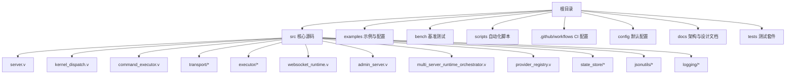
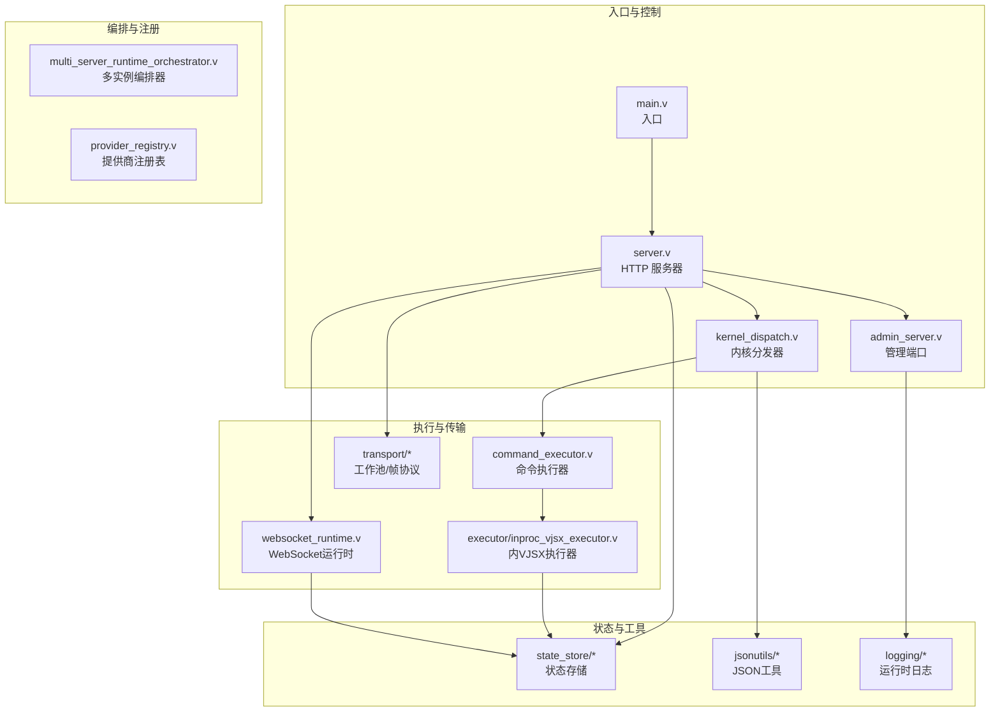
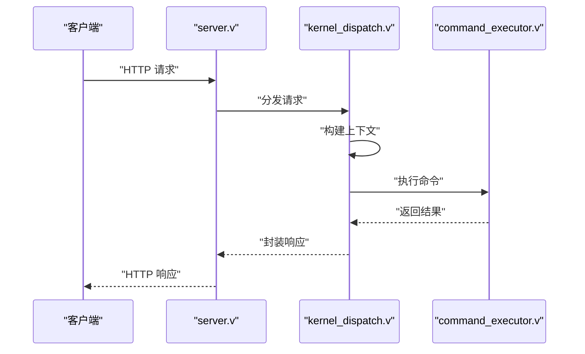
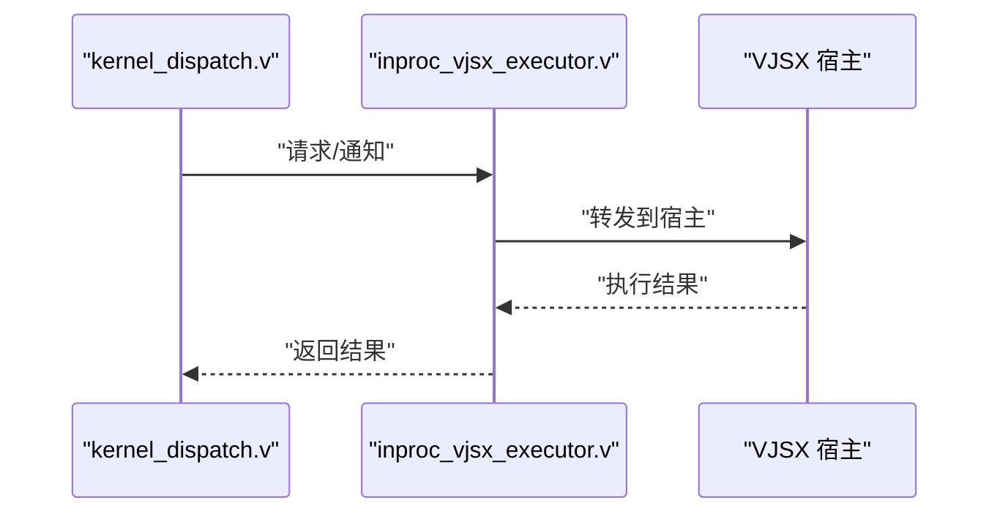
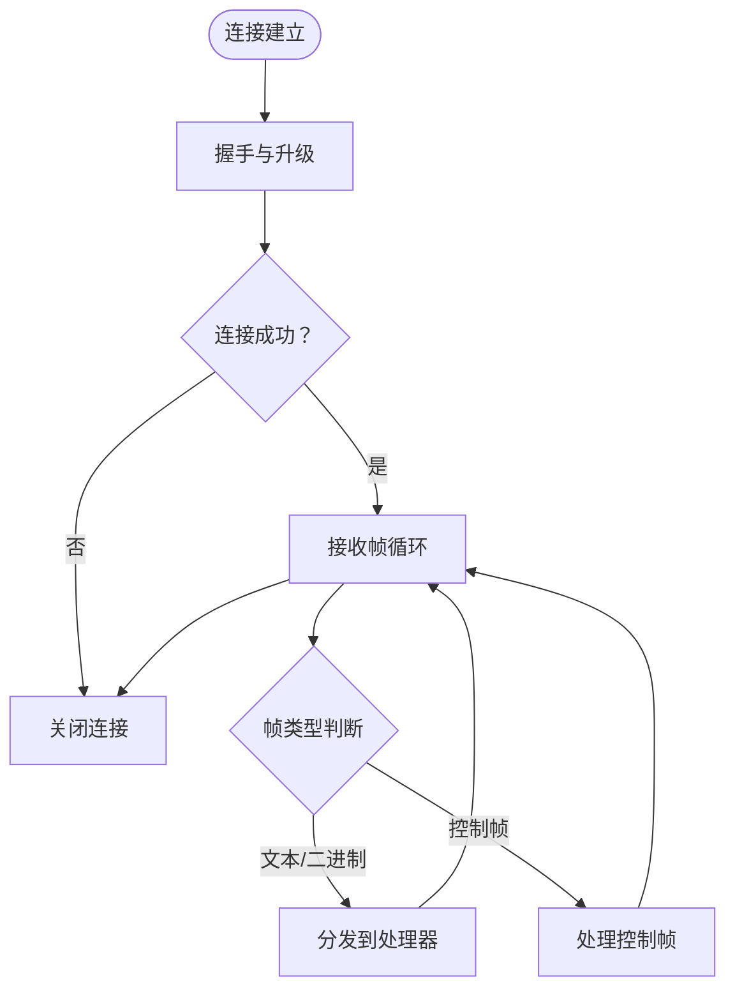
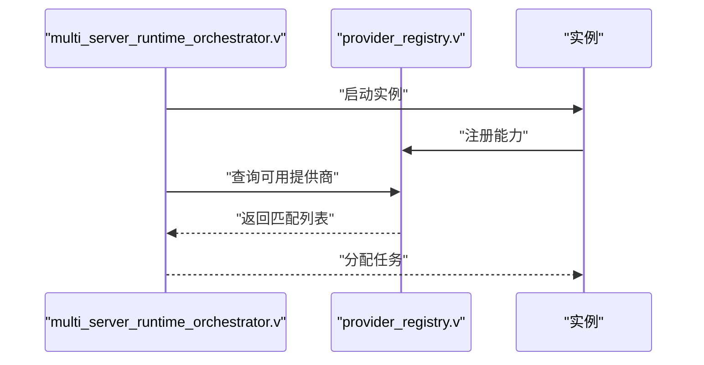
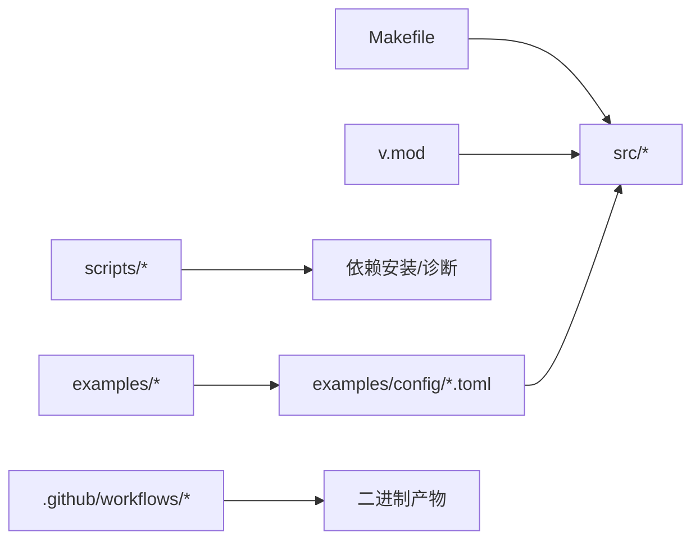

# 开发指南

<cite>
**本文引用的文件**
- [README.md](file://README.md)
- [Makefile](file://Makefile)
- [bench/README.md](file://bench/README.md)
- [bench/k6_short.js](file://bench/k6_short.js)
- [bench/k6_stream.js](file://bench/k6_stream.js)
- [bench/run_host_regression.sh](file://bench/run_host_regression.sh)
- [.github/workflows/sync-vphp-package.yml](file://.github/workflows/sync-vphp-package.yml)
- [.github/workflows/vhttpd-binaries.yml](file://.github/workflows/vhttpd-binaries.yml)
- [scripts/install_deps.sh](file://scripts/install_deps.sh)
- [scripts/doctor.sh](file://scripts/doctor.sh)
- [scripts/runtime_doctor.sh](file://scripts/runtime_doctor.sh)
- [src/main.v](file://src/main.v)
- [src/server.v](file://src/server.v)
- [src/command_executor.v](file://src/command_executor.v)
- [src/kernel_dispatch.v](file://src/kernel_dispatch.v)
- [src/transport/worker_pool.v](file://src/transport/worker_pool.v)
- [src/executor/inproc_vjsx_executor.v](file://src/executor/inproc_vjsx_executor.v)
- [src/websocket_runtime.v](file://src/websocket_runtime.v)
- [src/admin_server.v](file://src/admin_server.v)
- [src/multi_server_runtime_orchestrator.v](file://src/multi_server_runtime_orchestrator.v)
- [src/provider_registry.v](file://src/provider_registry.v)
- [src/state_store/state_store.v](file://src/state_store/state_store.v)
- [src/jsonutils/json_utils.v](file://src/jsonutils/json_utils.v)
- [src/logging/runtime_logger.v](file://src/logging/runtime_logger.v)
- [tests/e2e/smoke_test.sh](file://tests/e2e/smoke_test.sh)
- [tests/README.md](file://tests/README.md)
- [examples/config/hello.toml](file://examples/config/hello.toml)
- [examples/config/stream-bench.toml](file://examples/config/stream-bench.toml)
- [examples/public/websocket_echo_app.js](file://examples/public/websocket_echo_app.js)
- [examples/laravel/app.php](file://examples/laravel/app.php)
- [examples/symfony/app.php](file://examples/symfony/app.php)
- [examples/wordpress/app.php](file://examples/wordpress/app.php)
- [examples/vjsx/openai-gateway-plugin.mts](file://examples/vjsx/openai-gateway-plugin.mts)
- [examples/vjsx/openai-executor-app.mts](file://examples/vjsx/openai-executor-app.mts)
- [examples/codexbot-app/app.php](file://examples/codexbot-app/app.php)
- [examples/codexbot-app-ts/app.mts](file://examples/codexbot-app-ts/app.mts)
- [v.mod](file://v.mod)
- [config/vhttpd.example.toml](file://config/vhttpd.example.toml)
</cite>

## 目录
1. [简介](#简介)
2. [项目结构](#项目结构)
3. [核心组件](#核心组件)
4. [架构总览](#架构总览)
5. [详细组件分析](#详细组件分析)
6. [依赖分析](#依赖分析)
7. [性能考虑](#性能考虑)
8. [故障排查指南](#故障排查指南)
9. [结论](#结论)
10. [附录](#附录)

## 简介
本开发指南面向开源贡献者与内部开发者，提供 vhttpd 的完整开发工作流程：从开发环境搭建、依赖安装、编译配置、调试工具设置，到测试策略（单元、集成、端到端）、性能基准测试（k6）、代码质量保障（静态分析、覆盖率、CI）、调试技巧与工具使用，以及贡献规范（提交规范、分支管理、发布流程）。文档以仓库现有脚本、示例与配置为依据，确保可操作性与一致性。

## 项目结构
vhttpd 是一个基于 V 语言实现的高性能 HTTP/WebSocket 网关与运行时系统，支持多后端、多执行器、多协议桥接与可观测性。项目采用模块化设计，核心源码位于 src/，示例应用与配置位于 examples/，基准测试位于 bench/，自动化脚本位于 scripts/，CI 配置位于 .github/workflows/。

图示来源
- [src/server.v](file://src/server.v)
- [src/kernel_dispatch.v](file://src/kernel_dispatch.v)
- [src/command_executor.v](file://src/command_executor.v)
- [src/transport/worker_pool.v](file://src/transport/worker_pool.v)
- [src/executor/inproc_vjsx_executor.v](file://src/executor/inproc_vjsx_executor.v)
- [src/websocket_runtime.v](file://src/websocket_runtime.v)
- [src/admin_server.v](file://src/admin_server.v)
- [src/multi_server_runtime_orchestrator.v](file://src/multi_server_runtime_orchestrator.v)
- [src/provider_registry.v](file://src/provider_registry.v)
- [src/state_store/state_store.v](file://src/state_store/state_store.v)
- [src/jsonutils/json_utils.v](file://src/jsonutils/json_utils.v)
- [src/logging/runtime_logger.v](file://src/logging/runtime_logger.v)

章节来源
- [README.md](file://README.md)
- [Makefile](file://Makefile)

## 核心组件
- 服务器与调度
  - 服务入口与启动：负责解析配置、初始化运行时、启动监听与后台任务。
  - 内核分发器：统一处理请求/命令分发、路由与上下文构建。
  - 命令执行器：执行业务命令、调用上游或执行器，并返回结果。
- 传输层
  - 工作池与帧协议：管理工作线程、消息帧格式与序列化。
- 执行器
  - 内部 VJSX 执行器：在进程内加载并执行 VJSX 应用，支持热启动与生命周期管理。
- 协议与桥接
  - WebSocket 运行时：支持双向流式通信与事件分发。
  - 管理/控制通道：提供管理端口与健康检查。
- 多实例编排
  - 多服务器编排器：协调多个实例的启动、停止与状态同步。
- 注册与状态
  - 提供商注册表：动态注册与发现上游/能力提供商。
  - 状态存储：持久化或内存态的状态管理。
- 工具与日志
  - JSON 工具：结构化数据处理与校验。
  - 运行时日志：统一日志输出与级别控制。

章节来源
- [src/server.v](file://src/server.v)
- [src/kernel_dispatch.v](file://src/kernel_dispatch.v)
- [src/command_executor.v](file://src/command_executor.v)
- [src/transport/worker_pool.v](file://src/transport/worker_pool.v)
- [src/executor/inproc_vjsx_executor.v](file://src/executor/inproc_vjsx_executor.v)
- [src/websocket_runtime.v](file://src/websocket_runtime.v)
- [src/admin_server.v](file://src/admin_server.v)
- [src/multi_server_runtime_orchestrator.v](file://src/multi_server_runtime_orchestrator.v)
- [src/provider_registry.v](file://src/provider_registry.v)
- [src/state_store/state_store.v](file://src/state_store/state_store.v)
- [src/jsonutils/json_utils.v](file://src/jsonutils/json_utils.v)
- [src/logging/runtime_logger.v](file://src/logging/runtime_logger.v)

## 架构总览
下图展示 vhttpd 的高层架构：入口通过服务器启动，经由内核分发器将请求/命令路由至执行器或上游；传输层负责连接与帧协议；WebSocket 运行时提供实时通信；管理端口用于运维与可观测性；多实例编排器支持横向扩展。

图示来源
- [src/main.v](file://src/main.v)
- [src/server.v](file://src/server.v)
- [src/kernel_dispatch.v](file://src/kernel_dispatch.v)
- [src/command_executor.v](file://src/command_executor.v)
- [src/executor/inproc_vjsx_executor.v](file://src/executor/inproc_vjsx_executor.v)
- [src/transport/worker_pool.v](file://src/transport/worker_pool.v)
- [src/websocket_runtime.v](file://src/websocket_runtime.v)
- [src/admin_server.v](file://src/admin_server.v)
- [src/multi_server_runtime_orchestrator.v](file://src/multi_server_runtime_orchestrator.v)
- [src/provider_registry.v](file://src/provider_registry.v)
- [src/state_store/state_store.v](file://src/state_store/state_store.v)
- [src/jsonutils/json_utils.v](file://src/jsonutils/json_utils.v)
- [src/logging/runtime_logger.v](file://src/logging/runtime_logger.v)

## 详细组件分析

### 组件：服务器与内核分发器
- 职责
  - 启动 HTTP 与管理端口监听，初始化传输层与执行器。
  - 将请求/命令分发到对应处理器，构建上下文并传递给执行器。
- 关键流程
  - 请求进入后，根据路径/方法选择处理器。
  - 对于命令型请求，交由命令执行器执行并返回响应。
- 性能要点
  - 使用工作池复用线程，减少频繁创建销毁开销。
  - 传输层采用帧协议，降低序列化成本。

图示来源
- [src/server.v](file://src/server.v)
- [src/kernel_dispatch.v](file://src/kernel_dispatch.v)
- [src/command_executor.v](file://src/command_executor.v)

章节来源
- [src/server.v](file://src/server.v)
- [src/kernel_dispatch.v](file://src/kernel_dispatch.v)
- [src/command_executor.v](file://src/command_executor.v)

### 组件：内VJSX执行器
- 职责
  - 在进程内加载 VJSX 应用，维护生命周期与热启动。
  - 与宿主通信，转发请求/通知并回传结果。
- 关键流程
  - 初始化宿主签名与加载器。
  - 接收来自内核的请求，执行应用逻辑并返回。
- 性能要点
  - 预热与缓存提升首次请求延迟。
  - 与宿主共享内存/通道，避免跨进程拷贝。

图示来源
- [src/kernel_dispatch.v](file://src/kernel_dispatch.v)
- [src/executor/inproc_vjsx_executor.v](file://src/executor/inproc_vjsx_executor.v)

章节来源
- [src/executor/inproc_vjsx_executor.v](file://src/executor/inproc_vjsx_executor.v)

### 组件：WebSocket 运行时
- 职责
  - 维护 WebSocket 连接，处理文本/二进制帧与事件分发。
  - 支持上游 WebSocket 连接桥接与多路复用。
- 关键流程
  - 握手与升级，建立会话句柄。
  - 按帧类型分发到相应处理器，如心跳、消息、关闭等。
- 性能要点
  - 帧协议最小化开销。
  - 会话句柄复用，避免重复握手。

图示来源
- [src/websocket_runtime.v](file://src/websocket_runtime.v)

章节来源
- [src/websocket_runtime.v](file://src/websocket_runtime.v)

### 组件：多服务器编排器与提供商注册表
- 职责
  - 编排多个实例的启动/停止与状态同步。
  - 动态注册/发现上游/能力提供商，支持热插拔。
- 关键流程
  - 实例启动时向注册表注册自身能力。
  - 分发器按需选择合适提供商执行命令。
- 性能要点
  - 注册表查询与更新采用高效数据结构。
  - 编排器最小化跨实例通信。

图示来源
- [src/multi_server_runtime_orchestrator.v](file://src/multi_server_runtime_orchestrator.v)
- [src/provider_registry.v](file://src/provider_registry.v)

章节来源
- [src/multi_server_runtime_orchestrator.v](file://src/multi_server_runtime_orchestrator.v)
- [src/provider_registry.v](file://src/provider_registry.v)

## 依赖分析
- 构建与运行
  - 使用 Makefile 组织构建流程，结合 V 模块系统与 v.mod。
  - 脚本 scripts/ 提供依赖安装、诊断与运行时安装辅助。
- 示例与配置
  - examples/ 包含多种应用示例与 TOML 配置，便于验证功能与性能。
  - config/ 提供默认配置模板，便于本地与生产部署。
- CI 与发布
  - .github/workflows/ 定义同步 PHP 包与二进制产物的流水线。

图示来源
- [Makefile](file://Makefile)
- [v.mod](file://v.mod)
- [scripts/install_deps.sh](file://scripts/install_deps.sh)
- [scripts/doctor.sh](file://scripts/doctor.sh)
- [scripts/runtime_doctor.sh](file://scripts/runtime_doctor.sh)
- [examples/config/hello.toml](file://examples/config/hello.toml)
- [.github/workflows/sync-vphp-package.yml](file://.github/workflows/sync-vphp-package.yml)
- [.github/workflows/vhttpd-binaries.yml](file://.github/workflows/vhttpd-binaries.yml)

章节来源
- [Makefile](file://Makefile)
- [v.mod](file://v.mod)
- [scripts/install_deps.sh](file://scripts/install_deps.sh)
- [scripts/doctor.sh](file://scripts/doctor.sh)
- [scripts/runtime_doctor.sh](file://scripts/runtime_doctor.sh)
- [examples/config/hello.toml](file://examples/config/hello.toml)
- [config/vhttpd.example.toml](file://config/vhttpd.example.toml)
- [.github/workflows/sync-vphp-package.yml](file://.github/workflows/sync-vphp-package.yml)
- [.github/workflows/vhttpd-binaries.yml](file://.github/workflows/vhttpd-binaries.yml)

## 性能考虑
- 基准测试
  - bench/ 提供 k6 脚本与回归脚本，覆盖短请求与流式场景。
  - 可通过 run_host_regression.sh 触发回归测试，评估性能变化。
- 场景建议
  - 端到端压力测试：使用 k6 脚本模拟并发请求与长连接。
  - 回归测试：定期运行回归脚本，对比吞吐量与延迟指标。
- 优化方向
  - 减少序列化/反序列化次数，优先使用帧协议。
  - 合理配置工作池大小与连接数，避免资源争用。
  - 利用内VJSX执行器的预热与缓存机制，降低首包延迟。

章节来源
- [bench/README.md](file://bench/README.md)
- [bench/k6_short.js](file://bench/k6_short.js)
- [bench/k6_stream.js](file://bench/k6_stream.js)
- [bench/run_host_regression.sh](file://bench/run_host_regression.sh)

## 故障排查指南
- 环境与依赖
  - 使用 scripts/install_deps.sh 安装依赖，确保编译环境一致。
  - 使用 scripts/doctor.sh 与 scripts/runtime_doctor.sh 进行诊断，定位问题。
- 日志与可观测性
  - 通过运行时日志定位错误堆栈与异常路径。
  - 管理端口可用于健康检查与状态查询。
- 示例验证
  - 使用 examples/ 中的简单应用（如 hello、websocket echo）快速复现问题。
- 回归测试
  - 运行 tests/e2e/smoke_test.sh 进行冒烟测试，确认基本功能正常。

章节来源
- [scripts/install_deps.sh](file://scripts/install_deps.sh)
- [scripts/doctor.sh](file://scripts/doctor.sh)
- [scripts/runtime_doctor.sh](file://scripts/runtime_doctor.sh)
- [src/logging/runtime_logger.v](file://src/logging/runtime_logger.v)
- [src/admin_server.v](file://src/admin_server.v)
- [tests/e2e/smoke_test.sh](file://tests/e2e/smoke_test.sh)
- [examples/public/websocket_echo_app.js](file://examples/public/websocket_echo_app.js)
- [examples/laravel/app.php](file://examples/laravel/app.php)
- [examples/symfony/app.php](file://examples/symfony/app.php)
- [examples/wordpress/app.php](file://examples/wordpress/app.php)

## 结论
本指南提供了 vhttpd 的完整开发工作流程：从环境搭建、编译配置、调试工具到测试与性能基准、代码质量与 CI、再到贡献规范与发布流程。建议在开发过程中遵循“先示例、再核心、后性能”的顺序推进，确保功能正确性与性能稳定性。

## 附录

### 开发环境搭建
- 依赖安装
  - 使用 scripts/install_deps.sh 安装编译与运行所需依赖。
- 编译配置
  - 使用 Makefile 组织构建，确保 v.mod 与模块依赖正确。
- 调试工具设置
  - 使用 scripts/doctor.sh 与 scripts/runtime_doctor.sh 进行环境诊断。
  - 通过 config/vhttpd.example.toml 与 examples/config/*.toml 快速验证配置。

章节来源
- [scripts/install_deps.sh](file://scripts/install_deps.sh)
- [Makefile](file://Makefile)
- [v.mod](file://v.mod)
- [config/vhttpd.example.toml](file://config/vhttpd.example.toml)
- [examples/config/hello.toml](file://examples/config/hello.toml)

### 测试策略
- 单元测试
  - 在 src/ 下的各模块中，围绕核心组件（如 JSON 工具、状态存储、日志）编写单元测试，确保边界条件与错误路径覆盖。
- 集成测试
  - 使用 examples/ 中的应用作为集成测试目标，验证端到端链路（HTTP/WebSocket/上游）。
- 端到端测试
  - 使用 tests/e2e/smoke_test.sh 进行冒烟测试，覆盖常见场景与关键路径。

章节来源
- [src/jsonutils/json_utils.v](file://src/jsonutils/json_utils.v)
- [src/state_store/state_store.v](file://src/state_store/state_store.v)
- [src/logging/runtime_logger.v](file://src/logging/runtime_logger.v)
- [tests/e2e/smoke_test.sh](file://tests/e2e/smoke_test.sh)
- [tests/README.md](file://tests/README.md)

### 性能基准测试（k6）
- 使用 bench/k6_short.js 与 bench/k6_stream.js 进行短请求与流式场景压测。
- 使用 bench/run_host_regression.sh 触发回归测试，对比历史指标。
- 建议在相同硬件与网络条件下进行对比，避免外部变量干扰。

章节来源
- [bench/k6_short.js](file://bench/k6_short.js)
- [bench/k6_stream.js](file://bench/k6_stream.js)
- [bench/run_host_regression.sh](file://bench/run_host_regression.sh)
- [bench/README.md](file://bench/README.md)

### 代码质量保证
- 静态分析
  - 使用 V 语言内置工具与社区推荐工具进行静态检查，确保语法与风格一致性。
- 代码覆盖率
  - 在 CI 中集成覆盖率统计，逐步提高关键路径覆盖率。
- 持续集成
  - .github/workflows/ 定义同步 PHP 包与二进制产物的流水线，建议新增测试与覆盖率步骤。

章节来源
- [.github/workflows/sync-vphp-package.yml](file://.github/workflows/sync-vphp-package.yml)
- [.github/workflows/vhttpd-binaries.yml](file://.github/workflows/vhttpd-binaries.yml)

### 调试技巧与工具使用
- 日志级别与输出
  - 通过运行时日志定位问题，必要时临时提升日志级别。
- 管理端口
  - 使用管理端口进行健康检查与状态查询，辅助定位连接/会话问题。
- 示例应用
  - 使用 examples/ 中的最小可用示例快速复现问题，缩小范围后再深入核心模块。

章节来源
- [src/logging/runtime_logger.v](file://src/logging/runtime_logger.v)
- [src/admin_server.v](file://src/admin_server.v)
- [examples/public/websocket_echo_app.js](file://examples/public/websocket_echo_app.js)

### 贡献指南
- 代码提交规范
  - 提交信息清晰描述变更目的与影响范围，附带相关测试与基准结果。
- 分支管理
  - 建议采用特性分支开发，合并前确保通过测试与基准回归。
- 发布流程
  - 通过 .github/workflows/vhttpd-binaries.yml 生成二进制产物，配合版本标签进行发布。

章节来源
- [.github/workflows/vhttpd-binaries.yml](file://.github/workflows/vhttpd-binaries.yml)