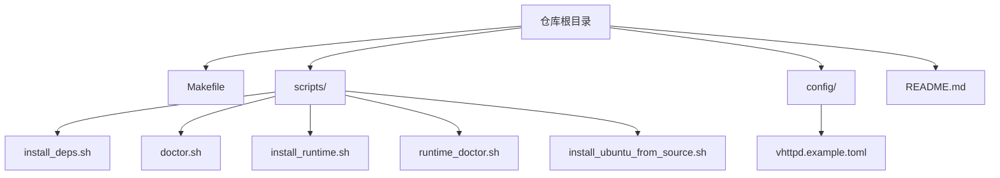
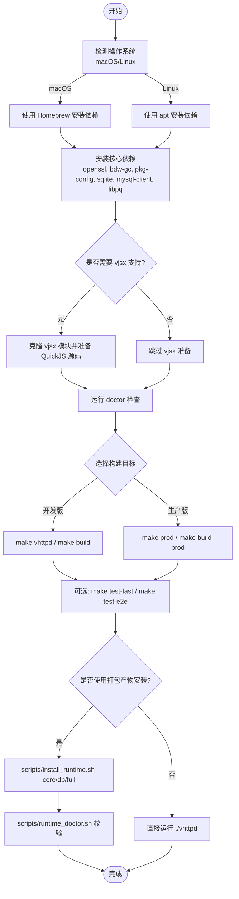
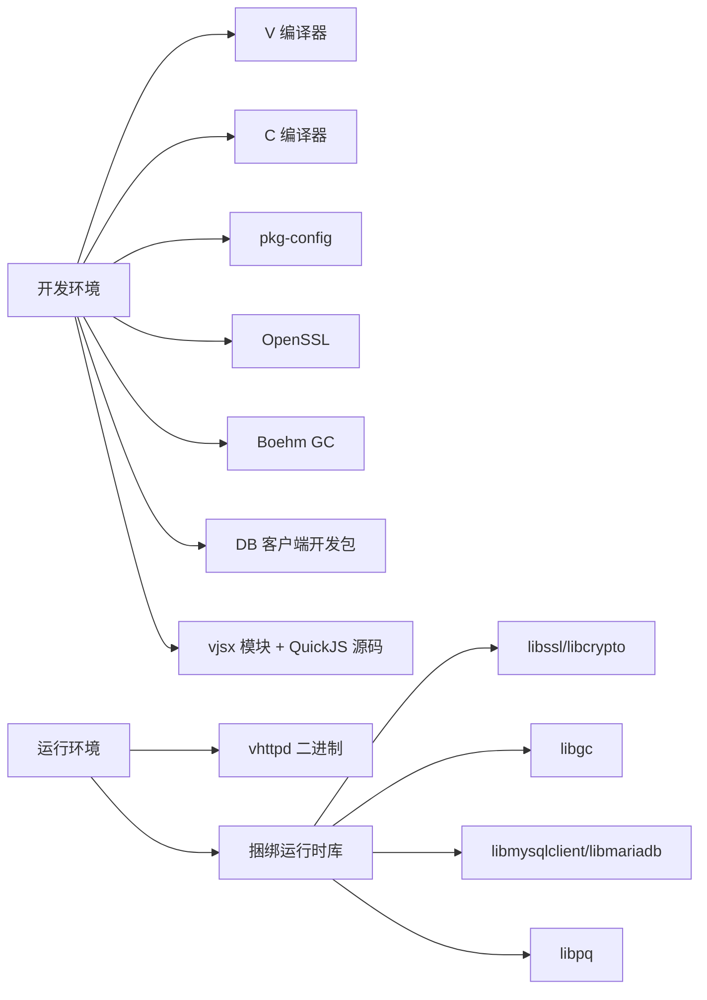

# 开发环境搭建

<cite>
**本文引用的文件列表**
- [README.md](file://README.md)
- [Makefile](file://Makefile)
- [scripts/install_deps.sh](file://scripts/install_deps.sh)
- [scripts/doctor.sh](file://scripts/doctor.sh)
- [scripts/install_runtime.sh](file://scripts/install_runtime.sh)
- [scripts/runtime_doctor.sh](file://scripts/runtime_doctor.sh)
- [scripts/install_ubuntu_from_source.sh](file://scripts/install_ubuntu_from_source.sh)
- [config/vhttpd.example.toml](file://config/vhttpd.example.toml)
</cite>

## 目录
1. [简介](#简介)
2. [项目结构](#项目结构)
3. [核心组件](#核心组件)
4. [架构总览](#架构总览)
5. [详细组件分析](#详细组件分析)
6. [依赖分析](#依赖分析)
7. [性能考虑](#性能考虑)
8. [故障排查指南](#故障排查指南)
9. [结论](#结论)
10. [附录](#附录)

## 简介
本指南面向首次接触 VHTTPD 的开发者，目标是帮助你在本地快速完成开发环境的搭建与验证。内容涵盖：
- 系统要求与必需组件（V 编译器、C 编译器、OpenSSL、数据库客户端库等）
- 源码获取与编译流程（开发版与生产版构建选项）
- 依赖安装脚本的使用说明（核心依赖、vjsx 依赖、数据库依赖）
- 环境诊断工具的使用方法
- 跨平台注意事项（Windows/Linux/macOS）

## 项目结构
仓库根目录包含构建与运行所需的关键脚本与配置：
- Makefile：定义构建目标、依赖安装入口、测试入口等
- scripts/*：依赖安装、运行时安装与环境诊断脚本
- config/*：示例 TOML 配置文件
- README.md：顶层文档，包含依赖、构建、分发与服务管理说明

图表来源
- [Makefile:1-120](file://Makefile#L1-L120)
- [scripts/install_deps.sh:1-138](file://scripts/install_deps.sh#L1-L138)
- [scripts/doctor.sh:1-108](file://scripts/doctor.sh#L1-L108)
- [scripts/install_runtime.sh:1-98](file://scripts/install_runtime.sh#L1-L98)
- [scripts/runtime_doctor.sh:1-126](file://scripts/runtime_doctor.sh#L1-L126)
- [scripts/install_ubuntu_from_source.sh:1-162](file://scripts/install_ubuntu_from_source.sh#L1-L162)
- [config/vhttpd.example.toml:1-67](file://config/vhttpd.example.toml#L1-L67)
- [README.md:210-271](file://README.md#L210-L271)

章节来源
- [README.md:210-271](file://README.md#L210-L271)
- [Makefile:1-120](file://Makefile#L1-L120)

## 核心组件
- 构建系统（Makefile）
  - 提供 build、prod、deps-core、deps-vjsx、deps-db、deps-full、doctor 等目标
  - 通过环境变量控制 TLS 后端、GC 策略、是否启用 DB 支持等
- 依赖安装脚本（install_deps.sh）
  - 按 profile 安装系统包与 vjsx 模块及 QuickJS 源码
- 环境诊断脚本（doctor.sh、runtime_doctor.sh）
  - 检查命令、pkg-config、QuickJS 源码、链接库解析情况
- 运行时安装脚本（install_runtime.sh）
  - 将二进制与捆绑的运行时库安装到用户目录，并执行 runtime_doctor 校验

章节来源
- [Makefile:1-120](file://Makefile#L1-L120)
- [scripts/install_deps.sh:1-138](file://scripts/install_deps.sh#L1-L138)
- [scripts/doctor.sh:1-108](file://scripts/doctor.sh#L1-L108)
- [scripts/runtime_doctor.sh:1-126](file://scripts/runtime_doctor.sh#L1-L126)
- [scripts/install_runtime.sh:1-98](file://scripts/install_runtime.sh#L1-L98)

## 架构总览
下图展示了从“准备环境”到“构建与运行”的整体流程，以及各脚本的职责边界。

图表来源
- [scripts/install_deps.sh:1-138](file://scripts/install_deps.sh#L1-L138)
- [scripts/doctor.sh:1-108](file://scripts/doctor.sh#L1-L108)
- [Makefile:96-122](file://Makefile#L96-L122)
- [scripts/install_runtime.sh:1-98](file://scripts/install_runtime.sh#L1-L98)
- [scripts/runtime_doctor.sh:1-126](file://scripts/runtime_doctor.sh#L1-L126)

## 详细组件分析

### 系统要求与依赖项
- 必需组件
  - V 编译器：用于编译 V 源码
  - C 编译器：默认 cc/gcc
  - OpenSSL：TLS 后端（默认启用）
  - Boehm GC：内存回收器（可自动探测或显式指定）
  - pkg-config：用于查找系统库（如 openssl、bdw-gc）
  - SQLite/MySQL/PostgreSQL 客户端开发包：默认开启 DB 支持时需要
- macOS 推荐方式
  - 使用 Homebrew 安装依赖
- Linux 推荐方式
  - 使用 apt 安装依赖

章节来源
- [README.md:210-271](file://README.md#L210-L271)
- [scripts/install_deps.sh:50-84](file://scripts/install_deps.sh#L50-L84)
- [scripts/doctor.sh:49-52](file://scripts/doctor.sh#L49-L52)

### 源码获取与编译过程
- 获取源码
  - 使用 git clone 拉取仓库到本地
- 安装依赖
  - 核心依赖：make deps-core
  - vjsx 依赖：make deps-vjsx
  - 数据库依赖：make deps-db
  - 全量依赖：make deps-full
- 构建目标
  - 开发版：make vhttpd 或 make build
  - 生产版：make prod 或 make build-prod
- 关键构建选项
  - TLS 后端：V_TLS_BACKEND=openssl（默认）或 mbedtls
  - 是否启用 DB：WITH_DB=1（默认）或 WITH_DB=0
  - GC 策略：VPHP_V_GC=auto/boehm/none
  - 其他：V_CC（指定 C 编译器）、V_FLAGS/V_PROD_FLAGS 等

章节来源
- [README.md:256-271](file://README.md#L256-L271)
- [Makefile:11-26](file://Makefile#L11-L26)
- [Makefile:96-107](file://Makefile#L96-L107)
- [Makefile:109-122](file://Makefile#L109-L122)

### 依赖安装脚本使用方法
- 核心依赖（core）
  - 作用：安装 OpenSSL、Boehm GC、pkg-config、SQLite/MySQL/PostgreSQL 客户端开发包等
  - 用法：make deps-core 或 bash scripts/install_deps.sh core
- vjsx 依赖（vjsx）
  - 作用：确保 vjsx 模块存在并准备受管 QuickJS 源码
  - 用法：make deps-vjsx 或 bash scripts/install_deps.sh vjsx
- 数据库依赖（db）
  - 作用：与 core 相同，作为 DB 能力依赖别名
  - 用法：make deps-db 或 bash scripts/install_deps.sh db
- 全量依赖（full）
  - 作用：同时安装 core 与 vjsx 依赖
  - 用法：make deps-full 或 bash scripts/install_deps.sh full

章节来源
- [README.md:210-255](file://README.md#L210-L255)
- [scripts/install_deps.sh:117-135](file://scripts/install_deps.sh#L117-L135)

### 环境诊断工具使用方法
- 构建期诊断（doctor.sh）
  - 检查 v、pkg-config、openssl、bdw-gc、vjsx 模块路径、QuickJS 源码等
  - 用法：make doctor 或 bash scripts/doctor.sh
- 运行期诊断（runtime_doctor.sh）
  - 检查二进制可执行权限、动态库解析（Linux ldd、macOS otool）、sqlite3/mysql_config/pg_config 可用性等
  - 用法：bash scripts/runtime_doctor.sh <vhttpd 二进制路径>
- 打包后安装与自检（install_runtime.sh + runtime_doctor.sh）
  - 将二进制与捆绑的运行时库安装到 $HOME/.local，并自动执行 runtime_doctor 校验
  - 用法：bash scripts/install_runtime.sh core/db/full

章节来源
- [scripts/doctor.sh:1-108](file://scripts/doctor.sh#L1-L108)
- [scripts/runtime_doctor.sh:1-126](file://scripts/runtime_doctor.sh#L1-L126)
- [scripts/install_runtime.sh:1-98](file://scripts/install_runtime.sh#L1-L98)

### 不同构建目标的编译选项
- 开发版（make vhttpd / make build）
  - 默认启用 use_openssl 与 DB 支持
  - 适合日常开发与调试
- 生产版（make prod / make build-prod）
  - 在开发版基础上启用 -prod 与 -nocache
  - 默认日志级别为 warn，可通过 VHTTPD_LOG_LEVEL 调整
- 关闭 DB 支持
  - make build WITH_DB=0
- 切换 TLS 后端
  - make vhttpd V_TLS_BACKEND=mbedtls（仍会添加长连接超时参数）

章节来源
- [README.md:256-271](file://README.md#L256-L271)
- [Makefile:11-20](file://Makefile#L11-L20)
- [Makefile:96-107](file://Makefile#L96-L107)

### 跨平台开发的注意事项
- macOS
  - 推荐使用 Homebrew 安装依赖；打包产物中已包含常见运行时库，便于分发
- Linux
  - 推荐使用 apt 安装依赖；打包产物同样包含常见运行时库，减少现场依赖
- Windows
  - 当前脚本未覆盖 Windows；建议通过 WSL2 或虚拟机进行开发
- 通用建议
  - 优先使用提供的依赖安装脚本与诊断脚本，避免手动遗漏依赖
  - 若需自定义 vjsx 资源，可使用 VJSX_ASSET_ROOT 覆盖

章节来源
- [README.md:210-271](file://README.md#L210-L271)
- [scripts/install_deps.sh:50-84](file://scripts/install_deps.sh#L50-L84)
- [scripts/runtime_doctor.sh:46-87](file://scripts/runtime_doctor.sh#L46-L87)

## 依赖分析
- 构建期依赖
  - V 编译器、C 编译器、pkg-config、OpenSSL、Boehm GC、SQLite/MySQL/PostgreSQL 客户端开发包
- 运行期依赖
  - 打包产物通常包含 libssl、libcrypto、libgc、libmysqlclient/libmariadb、libpq 等
  - 运行期诊断会检查这些库是否可被正确解析
- vjsx 依赖
  - 需要 vjsx 模块与受管 QuickJS 源码（构建期），运行时资源已嵌入，无需额外 vjsx 目录

图表来源
- [README.md:210-271](file://README.md#L210-L271)
- [scripts/install_deps.sh:50-84](file://scripts/install_deps.sh#L50-L84)
- [scripts/runtime_doctor.sh:46-87](file://scripts/runtime_doctor.sh#L46-L87)

章节来源
- [README.md:210-271](file://README.md#L210-L271)
- [scripts/install_deps.sh:50-84](file://scripts/install_deps.sh#L50-L84)
- [scripts/runtime_doctor.sh:46-87](file://scripts/runtime_doctor.sh#L46-L87)

## 性能考虑
- 生产构建启用 -prod 与 -nocache，有助于提升运行性能与减小体积
- 合理设置 GC 策略：在特定平台（如 ARM64 虚拟化）下，Boehm GC 可能引发信号/线程问题，可按需设置为 none
- 日志级别：生产环境默认 warn，可根据需要调整为 debug 以辅助定位问题

章节来源
- [README.md:256-271](file://README.md#L256-L271)
- [Makefile:11-20](file://Makefile#L11-L20)

## 故障排查指南
- 常见问题与解决思路
  - 缺少 V 编译器或 C 编译器：安装 V 与 gcc/cc，并确保 PATH 正确
  - pkg-config 不可用或未找到 openssl/bdw-gc：使用依赖安装脚本安装对应系统包
  - vjsx 模块缺失或 QuickJS 源码未就绪：运行 make deps-vjsx 或 bash scripts/install_deps.sh vjsx
  - 运行期动态库未解析：使用 runtime_doctor 检查，确认捆绑库是否正确安装且 RPATH/loader_path 有效
  - DB 客户端工具缺失（mysql_config/pg_config/sqlite3）：根据提示安装相应客户端工具或库
- 推荐诊断步骤
  - 构建前：make doctor
  - 安装后：bash scripts/runtime_doctor.sh $(which vhttpd)
  - 若使用打包产物：bash scripts/install_runtime.sh core/db/full 后再运行 runtime_doctor

章节来源
- [scripts/doctor.sh:1-108](file://scripts/doctor.sh#L1-L108)
- [scripts/runtime_doctor.sh:1-126](file://scripts/runtime_doctor.sh#L1-L126)
- [scripts/install_runtime.sh:1-98](file://scripts/install_runtime.sh#L1-L98)

## 结论
通过本指南，你可以：
- 在 macOS/Linux 上快速完成 VHTTPD 的开发环境搭建
- 理解不同构建目标与依赖安装脚本的作用
- 使用诊断工具定位并解决环境问题
- 了解跨平台注意事项与最佳实践

## 附录
- 示例配置
  - 参考 config/vhttpd.example.toml 中的基本字段与注释，结合 README 中的多监听与 vjsx 模式示例进行本地验证

章节来源
- [config/vhttpd.example.toml:1-67](file://config/vhttpd.example.toml#L1-L67)
- [README.md:437-525](file://README.md#L437-L525)