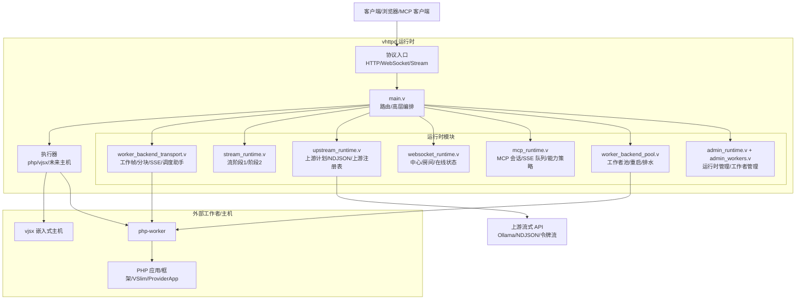

# 开发环境搭建

<cite>
**本文档引用的文件**
- [Makefile](file://Makefile)
- [README.md](file://README.md)
- [scripts/install_deps.sh](file://scripts/install_deps.sh)
- [scripts/install_runtime.sh](file://scripts/install_runtime.sh)
- [scripts/doctor.sh](file://scripts/doctor.sh)
- [scripts/runtime_doctor.sh](file://scripts/runtime_doctor.sh)
- [config/vhttpd.example.toml](file://config/vhttpd.example.toml)
- [v.mod](file://v.mod)
- [articles/02-getting-started.md](file://articles/02-getting-started.md)
- [docs/OVERVIEW.md](file://docs/OVERVIEW.md)
</cite>

## 目录
1. [简介](#简介)
2. [系统要求与依赖](#系统要求与依赖)
3. [安装步骤](#安装步骤)
4. [构建目标详解](#构建目标详解)
5. [开发工具链配置](#开发工具链配置)
6. [环境验证](#环境验证)
7. [常见问题排查](#常见问题排查)
8. [架构概览](#架构概览)
9. [性能考虑](#性能考虑)
10. [故障排除指南](#故障排除指南)
11. [结论](#结论)

## 简介
本指南面向 vhttpd 项目的开发者，提供从零开始搭建开发环境的完整流程。vhttpd 是基于 V 语言构建的 HTTP 守护进程与运行时工具包，支持多种执行器（php-worker、vjsx、WebSocket 上游等），并提供统一的传输层与可观测性接口。本指南涵盖系统要求、依赖安装、编译配置、环境变量设置、构建目标使用方法、开发工具链配置以及常见问题排查。

## 系统要求与依赖
- 操作系统：Unix-like 系统（Linux 或 macOS）
- V 语言编译器：用于编译 vhttpd 二进制
- 构建工具：make、pkg-config、编译器工具链
- TLS 后端：OpenSSL 或 mbedTLS（默认 OpenSSL）
- 垃圾回收：Boehm GC（用于 V 运行时）
- 数据库客户端：SQLite、MySQL/MariaDB、PostgreSQL（可选，默认启用 DB 支持）
- vjsx 嵌入式运行时：QuickJS 源码（可选，用于 vjsx 嵌入式执行）

上述依赖通过脚本自动检测与安装，推荐使用提供的安装脚本进行依赖管理。

**章节来源**
- [README.md: 210-270:210-270](file://README.md#L210-L270)
- [scripts/install_deps.sh: 50-84:50-84](file://scripts/install_deps.sh#L50-L84)

## 安装步骤
### 步骤一：获取源码
```bash
git clone https://github.com/guweigang/vhttpd.git
cd vhttpd
```

### 步骤二：安装核心依赖
```bash
make deps-core
make doctor
```
- `deps-core`：安装基础构建依赖（OpenSSL、Boehm GC、pkg-config、SQLite、MySQL/PG 客户端开发包等）
- `doctor`：检查系统环境是否满足构建条件

### 步骤三：可选 - 安装 vjsx 依赖
```bash
make deps-vjsx
make doctor
```
- `deps-vjsx`：确保本地 vjsx 模块存在，并准备受管的 QuickJS 源码

### 步骤四：可选 - 安装数据库支持
```bash
make deps-db
# 或一次性安装全部依赖
make deps-full
```

### 步骤五：编译 vhttpd
```bash
make vhttpd
# 或构建生产版本
make prod
```
- `vhttpd`：默认启用 OpenSSL 与 DB 支持
- `prod`：启用生产优化标志（-prod）与缓存禁用（-nocache）

### 步骤六：运行示例（vjsx）
```bash
./vhttpd --config config/vhttpd.vjsx.example.toml
```

**章节来源**
- [articles/02-getting-started.md: 30-55:30-55](file://articles/02-getting-started.md#L30-L55)
- [README.md: 256-278:256-278](file://README.md#L256-L278)

## 构建目标详解
Makefile 提供了丰富的构建目标，覆盖依赖安装、编译、测试与演示等场景：

- 通用构建
  - `build`：准备构建源码并编译
  - `vhttpd`：默认构建（启用 OpenSSL 与 DB 支持）
  - `prod`：生产构建（启用 -prod 与 -nocache）
  - `build-prod`：别名，等同于 prod

- 依赖安装
  - `deps-core`：安装核心依赖（OpenSSL、Boehm GC、pkg-config、SQLite、MySQL/PG 客户端开发包）
  - `deps-vjsx`：安装 vjsx 依赖（确保 vjsx 模块与 QuickJS 源码）
  - `deps-db`：安装数据库相关依赖（别名，等同 deps-core）
  - `deps-full`：安装全部依赖（核心 + vjsx）

- 环境诊断
  - `doctor`：检查命令、pkg-config、vjsx QuickJS 源码、数据库客户端工具等
  - `runtime_doctor.sh`：检查已打包二进制的运行时依赖（链接库、命令可用性）

- 测试与演示
  - `test`：默认快速测试（排除重型测试）
  - `test-fast`：快速单元测试
  - `test-inproc`：内部 vjsx 测试（非 codexbot）
  - `test-codexbot`：Codexbot 内部测试（启用 vjsx_sqlite）
  - `test-codexbot-fast`：Codexbot 快速测试（排除生命周期）
  - `test-codexbot-lifecycle`：Codexbot 生命周期测试
  - `test-profile-codexbot`：Codexbot 性能测试脚本
  - `test-all`：全量测试（包含所有 *_test.v 文件）

- 示例演示
  - `demo-vslim`、`demo-ai`、`demo-symfony`、`demo-laravel`、`demo-wordpress`：一键运行示例应用

- 其他
  - `psr-matrix`：生成 PSR-7/15 支持矩阵
  - `prepare-build-src`：准备构建源码（复制 src，排除测试文件）

构建目标的实现细节与环境变量控制如下：
- 环境变量
  - `VHTTPD_BIN`：输出二进制文件路径（默认 vhttpd）
  - `V_CC`：C 编译器（默认 cc）
  - `VPHP_V_GC`：V 垃圾回收后端（auto/boehm/none；auto 时根据 pkg-config 检测）
  - `V_TLS_BACKEND`：TLS 后端（openssl/mbedtls；默认 openssl）
  - `WITH_DB`：是否启用数据库支持（1/0；默认 1）
  - `VJSX_DIR`：vjsx 模块路径（优先使用兄弟仓库 quickjs）
  - `LOCAL_QUICKJS`：本地 QuickJS 源码路径
  - `VJS_QUICKJS_PATH`：QuickJS 源码实际路径（本地或受管）
  - `V_ENV`：构建时注入的环境变量（VJS_QUICKJS_PATH）

- 构建标志
  - `V_FLAGS`：TLS 相关标志（OpenSSL 或 mbedTLS）
  - `V_PROD_FLAGS`：生产构建标志（-prod）
  - `V_NOCACHE_FLAGS`：禁用缓存（-nocache）
  - `V_DB_FLAGS`：启用数据库支持（-d enable_db）
  - `VJSX_FLAGS`：启用 QuickJS 构建（-d build_quickjs）

**章节来源**
- [Makefile: 1-142:1-142](file://Makefile#L1-L142)
- [scripts/install_deps.sh: 117-135:117-135](file://scripts/install_deps.sh#L117-L135)

## 开发工具链配置
- IDE 设置
  - V 语言：推荐使用支持 V 语言的 IDE（如 VSCode + V 插件），确保语法高亮与智能提示
  - TypeScript/JavaScript：vjsx 嵌入式运行时使用 QuickJS，无需外部 Node.js 环境
  - PHP：若需 PHP worker 开发，确保 PHP CLI 可用，并安装 vslim 扩展

- 调试器配置
  - V 语言：使用 V 编译器自带的调试支持，或在 IDE 中配置断点调试
  - PHP：通过 php-worker 进程调试，结合 vhttpd 的 admin 平台查看运行状态

- 代码格式化工具
  - V 语言：使用 V 官方格式化工具（v fmt）保持代码风格一致
  - TypeScript/JavaScript：使用标准格式化工具（如 Prettier）配合编辑器自动格式化

- 环境变量建议
  - `VHTTPD_LOG_LEVEL`：设置运行日志级别（debug/info/warn/error/fatal）
  - `VHTTPD_CONFIG`：指定配置文件路径（TOML）
  - `VJSX_ASSET_ROOT`：覆盖 vjsx 运行时资产根目录（开发时使用）
  - `VHTTPD_SOCKET_PREFIX`：设置 PHP worker 套接字前缀（默认 tmp/vslim_worker）

**章节来源**
- [README.md: 428-526:428-526](file://README.md#L428-L526)
- [docs/OVERVIEW.md: 192-245:192-245](file://docs/OVERVIEW.md#L192-L245)

## 环境验证
- 构建验证
  - 成功生成 vhttpd 二进制文件
  - `make doctor` 输出无缺失项

- 运行时验证
  - 使用 `scripts/runtime_doctor.sh` 检查二进制链接库与命令可用性
  - 运行示例配置（vjsx）验证 HTTP/WS/MCP 功能

- 配置验证
  - 使用示例 TOML 配置文件启动 vhttpd
  - 访问 admin 平台（/admin/runtime）确认运行状态

**章节来源**
- [scripts/runtime_doctor.sh: 1-126:1-126](file://scripts/runtime_doctor.sh#L1-L126)
- [config/vhttpd.example.toml: 1-67:1-67](file://config/vhttpd.example.toml#L1-L67)

## 常见问题排查
- 依赖缺失
  - 现象：doctor 报告缺少命令或 pkg-config 项
  - 处理：运行 `make deps-core` 或 `make deps-full` 安装缺失依赖

- vjsx 源码问题
  - 现象：vjsx QuickJS 源码未找到或版本不匹配
  - 处理：运行 `make deps-vjsx`，或手动准备 QuickJS 源码（本地 ../quickjs 或受管 .deps/quickjs）

- 数据库客户端工具缺失
  - 现象：mysql_config/pg_config 不存在
  - 处理：安装 MySQL/MariaDB 或 PostgreSQL 客户端开发包

- 生产构建失败
  - 现象：prod 构建报错
  - 处理：确认 V 编译器版本与依赖安装完整，必要时清理构建缓存后重试

- 运行时链接库缺失
  - 现象：runtime_doctor 报告未解析的链接库
  - 处理：使用打包脚本安装运行时库，或调整 RPATH/@loader_path

**章节来源**
- [scripts/doctor.sh: 1-108:1-108](file://scripts/doctor.sh#L1-L108)
- [scripts/install_deps.sh: 104-115:104-115](file://scripts/install_deps.sh#L104-L115)

## 架构概览
vhttpd 的开发环境与运行时架构围绕“协议终止 + 运行时 + 工作者编排”的设计原则展开。其核心模块包括：
- 协议入口：HTTP、WebSocket、Stream
- 运行时模块：worker 后端传输、流运行时、上游运行时、WebSocket 运行时、MCP 运行时、管理员运行时
- 执行器：php（外部 worker）、vjsx（嵌入式主机）
- 工作者：php-worker（外部进程）、vjsx 嵌入式执行



**图表来源**
- [README.md: 84-126:84-126](file://README.md#L84-L126)

**章节来源**
- [README.md: 84-126:84-126](file://README.md#L84-L126)

## 性能考虑
- 构建优化
  - 生产构建启用 -prod 与 -nocache，减少运行时开销
  - 合理设置 worker 池大小与队列容量，避免过载导致 503/504 错误

- 运行时优化
  - vjsx 线程数（thread_count）影响并发处理能力，按负载调整
  - 启用合适的日志级别（默认 prod 为 warn），避免过多日志 I/O

- 网络与 TLS
  - OpenSSL 后端通常具有更好的性能与兼容性
  - 长连接（如 Feishu WebSocket）需合理设置超时与重连策略

**章节来源**
- [README.md: 268-271:268-271](file://README.md#L268-L271)
- [docs/OVERVIEW.md: 222-245:222-245](file://docs/OVERVIEW.md#L222-L245)

## 故障排除指南
- 构建失败
  - 检查依赖安装：`make deps-core` / `make deps-full`
  - 清理构建缓存后重试：删除构建中间产物并重新编译

- 运行时错误
  - 使用 `scripts/runtime_doctor.sh` 检查二进制依赖
  - 查看 admin 平台（/admin/runtime）获取运行时快照与统计信息

- PHP worker 启动问题
  - 确认 php-worker 可执行文件路径与权限
  - 检查 PHP CLI 可用性与 vslim 扩展加载

- vjsx 嵌入式执行问题
  - 确认 vjsx 源码路径与 QuickJS 版本
  - 检查线程数与模块根目录配置

**章节来源**
- [scripts/doctor.sh: 1-108:1-108](file://scripts/doctor.sh#L1-L108)
- [scripts/runtime_doctor.sh: 1-126:1-126](file://scripts/runtime_doctor.sh#L1-L126)

## 结论
通过本指南，您可以在 Unix-like 系统上完成 vhttpd 的开发环境搭建，掌握依赖安装、编译配置、环境变量设置与构建目标使用方法。建议在开发过程中结合 doctor 与 runtime_doctor 脚本进行环境验证，并利用示例配置快速验证核心功能。随着项目演进，持续关注 Makefile 与脚本的更新，确保开发环境与构建流程保持一致。