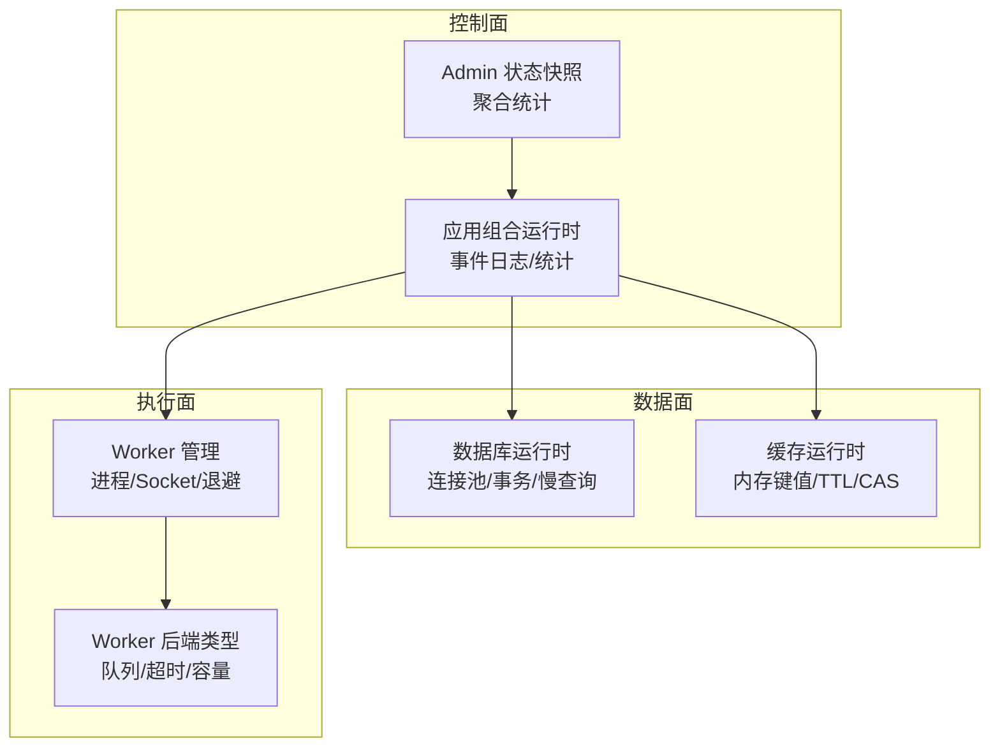
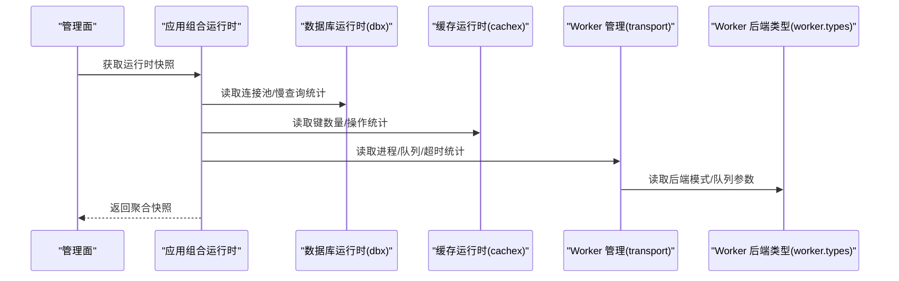
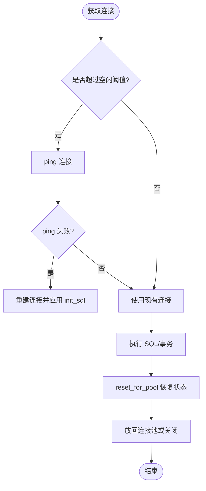
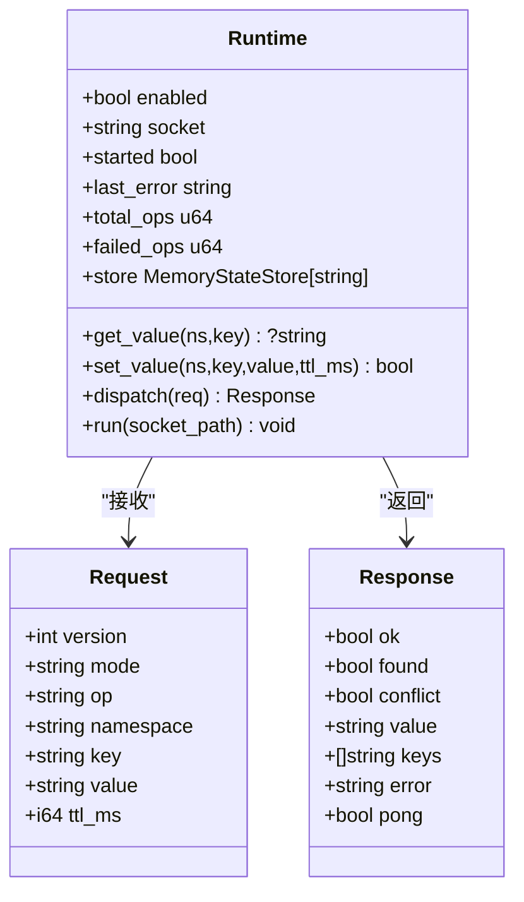
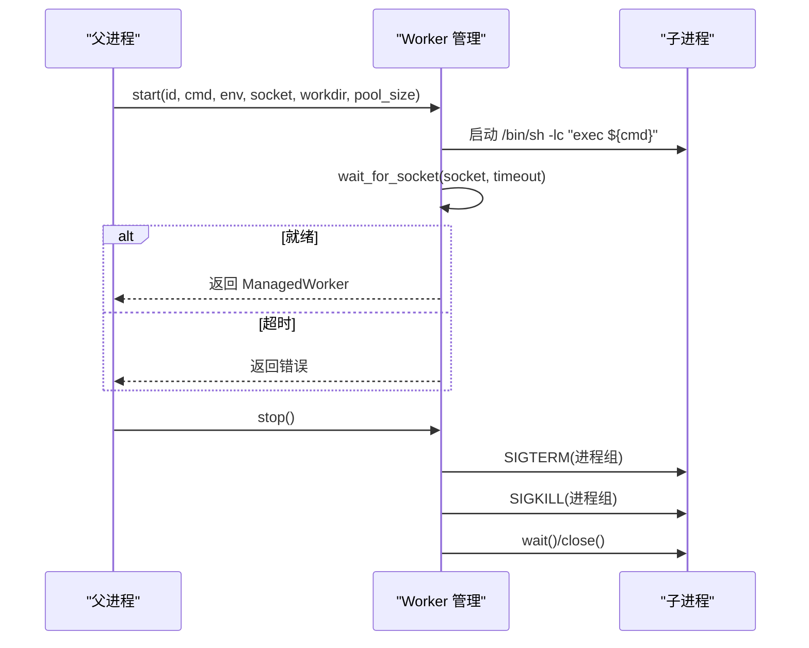
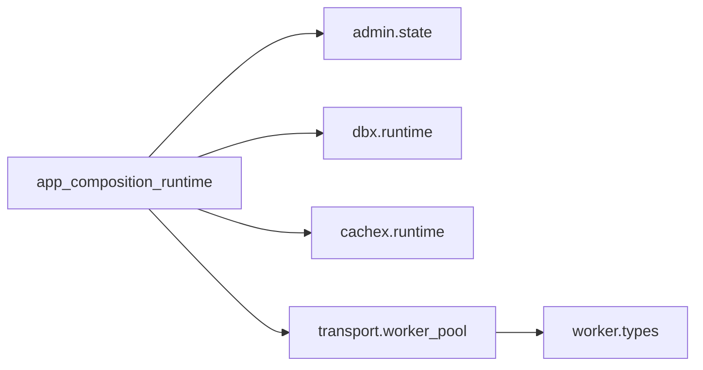

# 内存与CPU优化

<cite>
**本文引用的文件**   
- [src/dbx/runtime.v](file://src/dbx/runtime.v)
- [src/cachex/runtime.v](file://src/cachex/runtime.v)
- [src/upstream/transport/worker_pool.v](file://src/upstream/transport/worker_pool.v)
- [src/admin/state.v](file://src/admin/state.v)
- [src/worker/types.v](file://src/worker/types.v)
- [src/app_composition_runtime.v](file://src/app_composition_runtime.v)
- [articles/11-observability.md](file://articles/11-observability.md)
- [docs/refactor_0601.md](file://docs/refactor_0601.md)
- [php/package/src/VHttpd/WordPress/Profiler.php](file://php/package/src/VHttpd/WordPress/Profiler.php)
</cite>

## 目录
1. [引言](#引言)
2. [项目结构](#项目结构)
3. [核心组件](#核心组件)
4. [架构总览](#架构总览)
5. [详细组件分析](#详细组件分析)
6. [依赖分析](#依赖分析)
7. [性能考虑](#性能考虑)
8. [故障排查指南](#故障排查指南)
9. [结论](#结论)
10. [附录](#附录)

## 引言
本指南聚焦于 VHTTPD 的内存与 CPU 使用优化，覆盖以下主题：
- 内存管理机制：对象生命周期、垃圾回收策略、内存泄漏检测与预防
- CPU 密集型任务优化：异步处理、任务队列、计算结果缓存
- 数据库连接池与查询优化最佳实践
- 缓存策略设计与实施（内存缓存、分布式缓存）
- 内存与 CPU 性能分析的实用工具与技巧

## 项目结构
VHTTPD 在运行时通过多进程 Worker 模型承载业务逻辑，并提供内嵌的数据库与缓存服务。关键路径包括：
- 数据库运行时：提供连接池、事务、慢查询统计等能力
- 缓存运行时：基于内存的状态存储，支持命名空间、TTL、CAS 操作
- Worker 管理：子进程启动、优雅停止、退避重启、请求计数与 draining
- 管理面快照：聚合 HTTP、Worker、上游、MCP 等指标，用于监控与诊断

图表来源
- [src/admin/state.v:1-103](file://src/admin/state.v#L1-L103)
- [src/app_composition_runtime.v:43-87](file://src/app_composition_runtime.v#L43-L87)
- [src/dbx/runtime.v:1-120](file://src/dbx/runtime.v#L1-L120)
- [src/cachex/runtime.v:1-120](file://src/cachex/runtime.v#L1-L120)
- [src/upstream/transport/worker_pool.v:1-120](file://src/upstream/transport/worker_pool.v#L1-L120)
- [src/worker/types.v:1-62](file://src/worker/types.v#L1-L62)

章节来源
- [src/admin/state.v:1-103](file://src/admin/state.v#L1-L103)
- [src/app_composition_runtime.v:43-87](file://src/app_composition_runtime.v#L43-L87)
- [src/dbx/runtime.v:1-120](file://src/dbx/runtime.v#L1-L120)
- [src/cachex/runtime.v:1-120](file://src/cachex/runtime.v#L1-L120)
- [src/upstream/transport/worker_pool.v:1-120](file://src/upstream/transport/worker_pool.v#L1-L120)
- [src/worker/types.v:1-62](file://src/worker/types.v#L1-L62)

## 核心组件
- 数据库运行时（dbx）
  - 连接池：MySQL 使用通道维护固定大小连接；PostgreSQL 使用库级连接池
  - 会话与事务：begin/commit/rollback/reset_for_pool
  - 慢查询观测：记录最近 N 条 SQL、耗时、错误信息
  - 空闲保活：按 idle_ping_ms 对 MySQL 连接进行 ping 并重建
- 缓存运行时（cachex）
  - 内存状态存储：命名空间 + key 前缀、TTL、CAS（compare-and-swap）
  - Unix Socket 协议：长度头 + JSON 帧编解码
  - 统计：总操作数、失败数、键数量
- Worker 管理（transport.worker_pool）
  - 子进程生命周期：启动、等待 socket 就绪、优雅终止（SIGTERM+SIGKILL）、进程组清理
  - 退避重启：指数退避上限
  - 全局子进程注册：便于外部观察与管理
- Worker 后端类型（worker.types）
  - 后端抽象：PHP 后端实现
  - 运行时配置：队列容量、超时、轮询间隔、最大请求数、draining 标志
- 管理面快照（admin.state）
  - 聚合 HTTP、Worker 队列、上游、MCP、飞书等统计
  - 能力与活跃连接数快照

章节来源
- [src/dbx/runtime.v:484-706](file://src/dbx/runtime.v#L484-L706)
- [src/cachex/runtime.v:194-276](file://src/cachex/runtime.v#L194-L276)
- [src/upstream/transport/worker_pool.v:103-176](file://src/upstream/transport/worker_pool.v#L103-L176)
- [src/worker/types.v:20-62](file://src/worker/types.v#L20-L62)
- [src/admin/state.v:10-103](file://src/admin/state.v#L10-L103)

## 架构总览
下图展示了从管理面到数据面与执行面的交互关系，以及关键运行时的职责边界。

图表来源
- [src/admin/state.v:10-103](file://src/admin/state.v#L10-L103)
- [src/app_composition_runtime.v:43-87](file://src/app_composition_runtime.v#L43-L87)
- [src/dbx/runtime.v:188-227](file://src/dbx/runtime.v#L188-L227)
- [src/cachex/runtime.v:79-96](file://src/cachex/runtime.v#L79-L96)
- [src/upstream/transport/worker_pool.v:178-202](file://src/upstream/transport/worker_pool.v#L178-L202)
- [src/worker/types.v:20-62](file://src/worker/types.v#L20-L62)

## 详细组件分析

### 数据库运行时（dbx）内存与并发优化
- 连接池设计
  - MySQL：以固定容量 channel 持有连接，acquire/release 复用，避免频繁创建销毁
  - PostgreSQL：使用库级连接池，max_open_conns 控制并发
- 空闲保活与健壮性
  - idle_ping_ms > 0 时，取连接前检查空闲时间，必要时 ping 并重建连接
  - reset_for_pool 重置 autocommit 与应用 init_sql，确保连接回到稳定状态
- 慢查询观测与内存占用控制
  - recent_queries 固定上限，超出后裁剪，避免无限增长
  - compact_sql 压缩 SQL 文本，限制长度，降低内存峰值
- 事务与会话
  - begin/commit/rollback 封装，统一驱动差异
  - SessionHandle 持有具体驱动句柄，release/close 保证资源释放

图表来源
- [src/dbx/runtime.v:556-607](file://src/dbx/runtime.v#L556-L607)
- [src/dbx/runtime.v:681-706](file://src/dbx/runtime.v#L681-L706)
- [src/dbx/runtime.v:188-227](file://src/dbx/runtime.v#L188-L227)
- [src/dbx/runtime.v:156-177](file://src/dbx/runtime.v#L156-L177)

章节来源
- [src/dbx/runtime.v:484-706](file://src/dbx/runtime.v#L484-L706)
- [src/dbx/runtime.v:188-227](file://src/dbx/runtime.v#L188-L227)
- [src/dbx/runtime.v:156-177](file://src/dbx/runtime.v#L156-L177)

### 缓存运行时（cachex）内存与并发优化
- 内存状态存储
  - 基于 state_store.MemoryStateStore[string]，单锁保护，适合高并发读写的简单场景
  - 命名空间隔离：full_key(namespace, key) 生成唯一键
- TTL 与 CAS
  - set_with_ttl 支持过期时间
  - compare_and_swap_set_with_ttl / compare_and_swap_delete 提供原子更新/删除，避免竞态
- 协议与帧编码
  - 长度头 + JSON 体，限制最大帧大小，防止恶意大包导致 OOM
- 统计与可观测性
  - total_ops/failed_ops/keys 快照，便于监控与告警

图表来源
- [src/cachex/runtime.v:24-37](file://src/cachex/runtime.v#L24-37)
- [src/cachex/runtime.v:39-62](file://src/cachex/runtime.v#L39-62)
- [src/cachex/runtime.v:194-276](file://src/cachex/runtime.v#L194-L276)
- [src/cachex/runtime.v:299-341](file://src/cachex/runtime.v#L299-L341)

章节来源
- [src/cachex/runtime.v:194-276](file://src/cachex/runtime.v#L194-L276)
- [src/cachex/runtime.v:299-341](file://src/cachex/runtime.v#L299-L341)

### Worker 管理与进程生命周期
- 子进程启动与等待
  - 注入 --socket 或 {socket} 占位符，自动拼接命令
  - wait_for_socket 轮询直到 worker 暴露 socket
- 优雅停止与进程组清理
  - SIGTERM 给整个进程组，随后 SIGKILL 强制清理，wait/close 回收资源
- 退避重启
  - restart_backoff_ms 指数退避，上限 max_ms，避免雪崩
- 全局子进程注册
  - 全局注册表收集 child_pids，便于外部监控

图表来源
- [src/upstream/transport/worker_pool.v:103-136](file://src/upstream/transport/worker_pool.v#L103-L136)
- [src/upstream/transport/worker_pool.v:155-176](file://src/upstream/transport/worker_pool.v#L155-L176)
- [src/upstream/transport/worker_pool.v:204-218](file://src/upstream/transport/worker_pool.v#L204-L218)

章节来源
- [src/upstream/transport/worker_pool.v:103-176](file://src/upstream/transport/worker_pool.v#L103-L176)
- [src/upstream/transport/worker_pool.v:204-218](file://src/upstream/transport/worker_pool.v#L204-L218)

### Worker 后端类型与队列参数
- 后端抽象
  - PhpWorkerBackend 标识 PHP 后端
- 运行时配置
  - queue_capacity、queue_timeout_ms、queue_poll_ms、max_requests、draining
  - managed_workers 列表与轮询索引 rr_index

章节来源
- [src/worker/types.v:1-62](file://src/worker/types.v#L1-L62)

### 管理面快照与统计聚合
- 统计项
  - HTTP：请求总数、错误数、超时数、流式响应数
  - Worker 队列：等待、拒绝、超时
  - 上游计划：成功与错误
  - MCP：会话过期、驱逐、丢弃、采样警告/错误
  - 飞书：连接尝试/成功、收发帧/消息、发送错误
- 能力与活跃连接
  - WebSocket、Upstreams、MCP 会话、网关数量

章节来源
- [src/admin/state.v:10-103](file://src/admin/state.v#L10-L103)

## 依赖分析
- 组件耦合
  - app_composition_runtime 聚合 admin、executor、provider、runtime_plan 等模块，负责事件日志与统计
  - dbx 与 cachex 作为独立运行时，通过 Unix Socket 提供服务
  - transport.worker_pool 管理子进程，worker.types 定义后端与队列参数
- 外部依赖
  - MySQL/PostgreSQL 驱动
  - Unix Stream 网络接口
  - 系统信号与进程管理

图表来源
- [src/app_composition_runtime.v:43-87](file://src/app_composition_runtime.v#L43-L87)
- [src/admin/state.v:10-103](file://src/admin/state.v#L10-L103)
- [src/dbx/runtime.v:1-120](file://src/dbx/runtime.v#L1-L120)
- [src/cachex/runtime.v:1-120](file://src/cachex/runtime.v#L1-L120)
- [src/upstream/transport/worker_pool.v:1-120](file://src/upstream/transport/worker_pool.v#L1-L120)
- [src/worker/types.v:1-62](file://src/worker/types.v#L1-L62)

章节来源
- [src/app_composition_runtime.v:43-87](file://src/app_composition_runtime.v#L43-L87)
- [src/admin/state.v:10-103](file://src/admin/state.v#L10-L103)
- [src/dbx/runtime.v:1-120](file://src/dbx/runtime.v#L1-L120)
- [src/cachex/runtime.v:1-120](file://src/cachex/runtime.v#L1-L120)
- [src/upstream/transport/worker_pool.v:1-120](file://src/upstream/transport/worker_pool.v#L1-L120)
- [src/worker/types.v:1-62](file://src/worker/types.v#L1-L62)

## 性能考虑
- 内存管理建议
  - 合理设置数据库连接池大小，避免过多连接导致内存膨胀
  - 使用缓存运行时进行热点数据缓存，减少重复计算与 IO
  - 定期重启 Worker（max_requests），缓解长期运行的内存泄漏风险
- CPU 优化建议
  - 将 CPU 密集型任务放入后台队列，避免阻塞主循环
  - 利用缓存运行时 CAS 操作实现幂等更新，减少竞争与重试
  - 调整队列容量与超时，平衡吞吐与延迟
- 数据库优化
  - 启用 prepared statements 与参数化查询，减少解析开销
  - 使用慢查询观测定位热点 SQL，结合索引与分页优化
  - 合理设置 idle_ping_ms，保持连接健康
- 缓存策略
  - 短 TTL 用于高频变化数据，长 TTL 用于静态或低频数据
  - 使用命名空间隔离不同业务域，避免键冲突
  - 结合 CAS 实现乐观锁，避免写放大

[本节为通用指导，不直接分析具体文件]

## 故障排查指南
- 内存泄漏与进程驻留
  - 监控 Worker 内存与请求数，设置 max_requests 定期重启
  - 使用管理面快照查看活跃连接与队列深度
- 数据库连接问题
  - 关注 last_error 与 failed_queries，检查 idle_ping_ms 与连接池大小
  - 使用 is_connection_lost_error 判断断连并触发重连
- 缓存异常
  - 检查 total_ops/failed_ops 与 last_error，确认命名空间与 key 合法性
  - 使用 keys 操作验证键集合与 TTL 生效情况
- 性能分析与工具
  - 使用 v-Profiler 提供的 WordPress 性能报告，对比传统架构与 vhttpd 的内存峰值与延迟
  - 参考 observability 文档中的监控命令，持续跟踪内存与队列指标

章节来源
- [articles/11-observability.md:602-666](file://articles/11-observability.md#L602-L666)
- [php/package/src/VHttpd/WordPress/Profiler.php:670-679](file://php/package/src/VHttpd/WordPress/Profiler.php#L670-L679)
- [src/dbx/runtime.v:179-186](file://src/dbx/runtime.v#L179-L186)
- [src/cachex/runtime.v:79-96](file://src/cachex/runtime.v#L79-L96)

## 结论
VHTTPD 通过内嵌数据库与缓存运行时、稳定的 Worker 管理、完善的管理面快照，提供了高性能与可观测的基础设施。结合合理的连接池与缓存策略、异步与队列机制、以及定期的进程重启与监控，可有效提升内存与 CPU 使用效率，降低泄漏与抖动风险。

[本节为总结，不直接分析具体文件]

## 附录
- 安全与并发重构建议
  - 逐步替换 unsafe 与裸指针，采用 shared 或 chan 传递受保护引用
  - 统一锁层级并文档化，引入读锁优化只读聚合场景
  - 对 vjsx lane 通信引入无锁队列，减少竞态与锁竞争

章节来源
- [docs/refactor_0601.md:351-365](file://docs/refactor_0601.md#L351-L365)