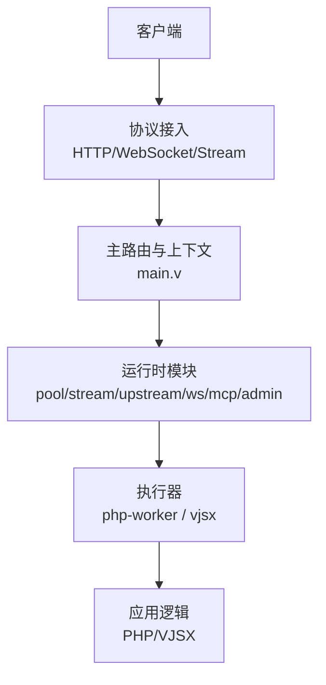
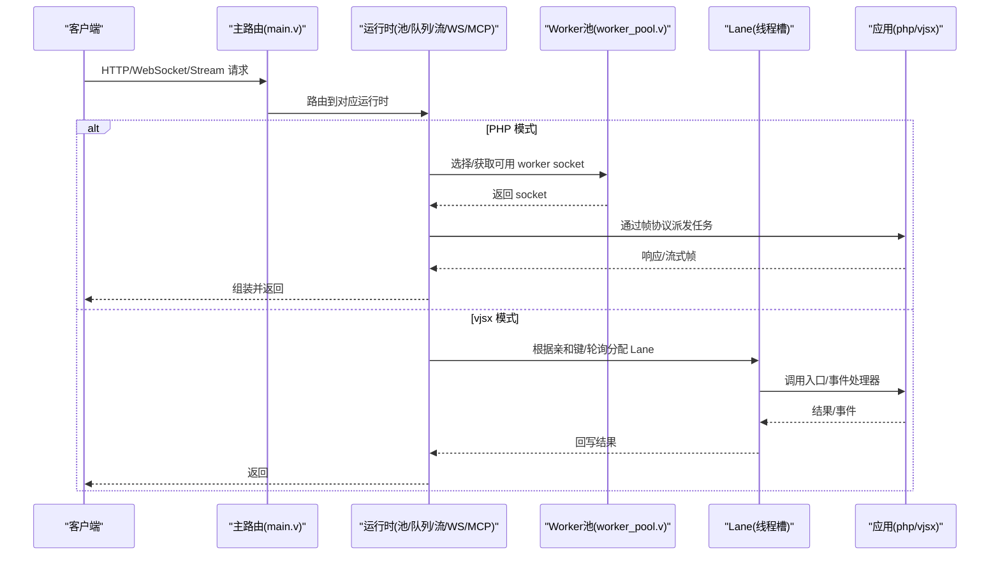
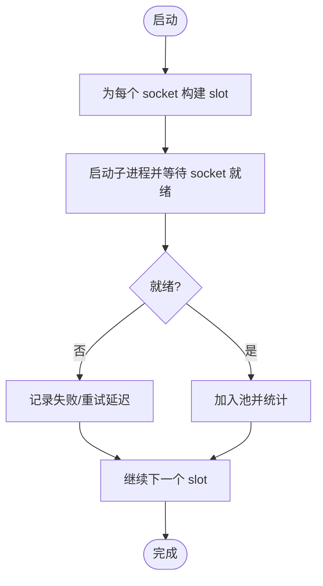
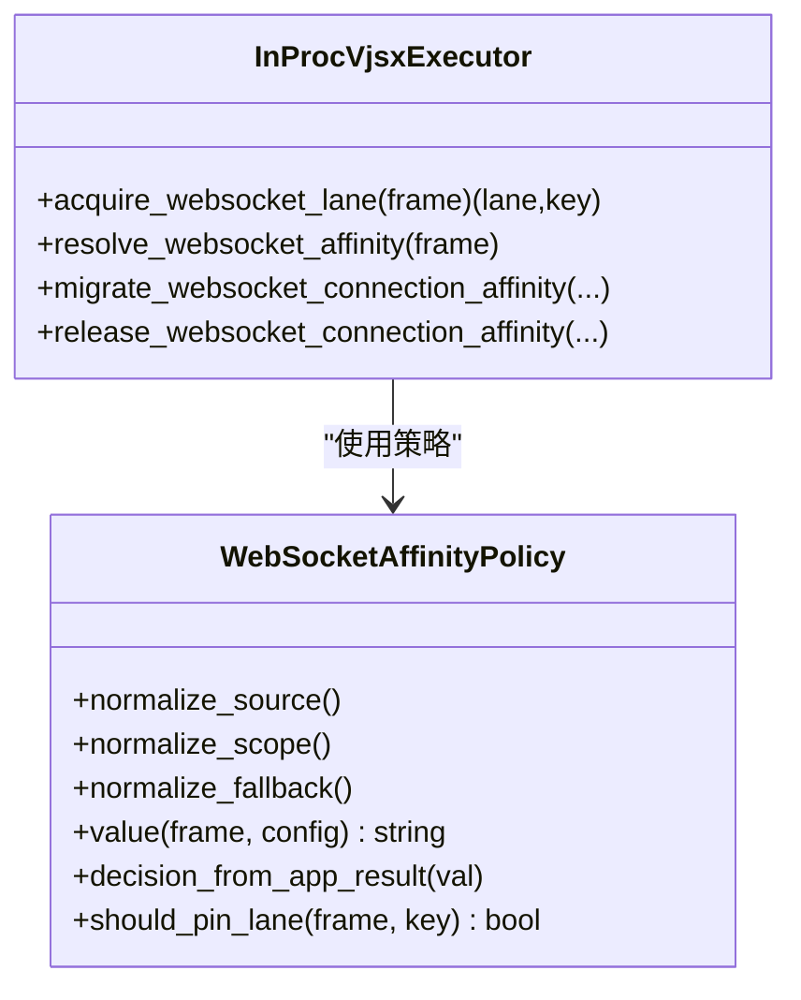
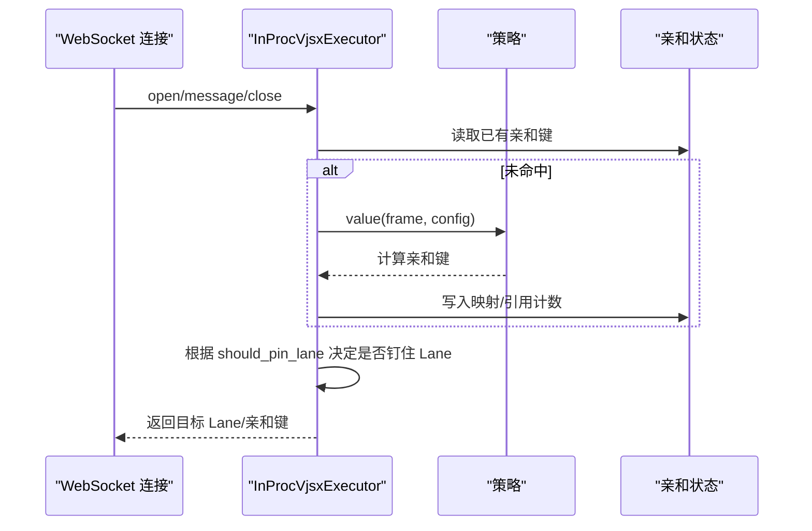
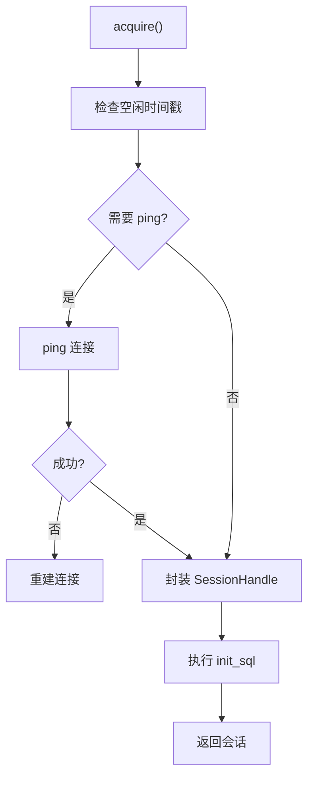
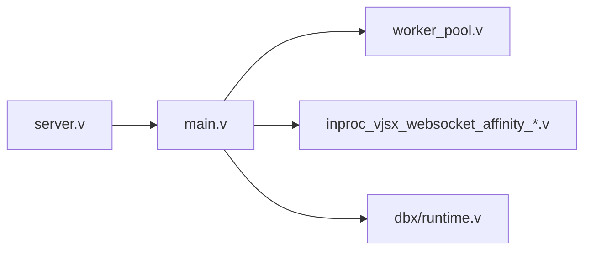

# 并发与扩展优化

<cite>
**本文引用的文件**   
- [README.md](file://README.md)
- [main.v](file://src/main.v)
- [server.v](file://src/server.v)
- [worker_pool.v](file://src/upstream/transport/worker_pool.v)
- [inproc_vjsx_websocket_affinity_runtime.v](file://src/executor/inproc_vjsx_websocket_affinity_runtime.v)
- [inproc_vjsx_websocket_policy.v](file://src/executor/inproc_vjsx_websocket_policy.v)
- [inproc_vjsx_websocket_lane_query_runtime.v](file://src/executor/inproc_vjsx_websocket_lane_query_runtime.v)
- [inproc_vjsx_websocket_affinity_state.v](file://src/executor/inproc_vjsx_websocket_affinity_state.v)
- [runtime_config.v](file://src/server_lifecycle/runtime_config.v)
- [dbx/runtime.v](file://src/dbx/runtime.v)
- [PROTOCOL_PIPELINE_IMPLEMENTATION_PLAN.md](file://docs/PROTOCOL_PIPELINE_IMPLEMENTATION_PLAN.md)
- [WEBSOCKET_PHASE2_IMPLEMENTATION_PLAN.md](file://docs/WEBSOCKET_PHASE2_IMPLEMENTATION_PLAN.md)
- [bench/README.md](file://bench/README.md)
</cite>

## 目录
1. [引言](#引言)
2. [项目结构](#项目结构)
3. [核心组件](#核心组件)
4. [架构总览](#架构总览)
5. [详细组件分析](#详细组件分析)
6. [依赖关系分析](#依赖关系分析)
7. [性能考量](#性能考量)
8. [故障排查指南](#故障排查指南)
9. [结论](#结论)
10. [附录](#附录)

## 引言
本文件聚焦 vhttpd 的并发处理与水平扩展优化策略，围绕多进程 Worker 池、线程模型（Lane）、任务分发与负载均衡、WebSocket 亲和性与会话保持、无状态设计与共享状态管理、分布式缓存策略、高并发调优（连接池、资源隔离、背压）以及基准测试方法展开。目标是帮助读者在理解代码实现的基础上，形成可落地的生产级优化方案。

## 项目结构
vhttpd 以“协议接入 + 运行时编排 + 执行器”的分层组织为核心：
- 协议接入：HTTP/WebSocket/Stream 统一入口，路由到数据面运行时
- 运行时编排：Worker 池、队列、流式阶段、上游集成、MCP、Admin 等
- 执行器：php-worker（外部进程）、vjsx（内嵌进程/Lane）

图表来源
- [main.v:1-117](file://src/main.v#L1-L117)
- [README.md:84-126](file://README.md#L84-L126)

章节来源
- [README.md:84-126](file://README.md#L84-L126)
- [main.v:1-117](file://src/main.v#L1-L117)

## 核心组件
- 进程与信号治理：全局注册运行期实例，统一 SIGINT/SIGTERM 清理子进程组与临时文件
- Worker 池管理：按 socket 列表启动/重启，指数退避，优雅停止，统计存活与请求计数
- 任务分发与负载均衡：基于轮询/亲和键选择 Lane 或 Worker；支持拒绝回退
- WebSocket 亲和性：从 header/query/app 计算亲和键，支持 lane 级别钉住与迁移
- 数据库连接池：MySQL/PostgreSQL 连接复用、空闲探测、初始化 SQL 注入
- 管道与背压：引擎/队列/通道/缓冲均有界，观测排队与执行耗时

章节来源
- [server.v:1-120](file://src/server.v#L1-L120)
- [worker_pool.v:1-219](file://src/upstream/transport/worker_pool.v#L1-L219)
- [inproc_vjsx_websocket_affinity_runtime.v:1-186](file://src/executor/inproc_vjsx_websocket_affinity_runtime.v#L1-L186)
- [inproc_vjsx_websocket_policy.v:1-112](file://src/executor/inproc_vjsx_websocket_policy.v#L1-L112)
- [dbx/runtime.v:518-588](file://src/dbx/runtime.v#L518-L588)
- [PROTOCOL_PIPELINE_IMPLEMENTATION_PLAN.md:638-686](file://docs/PROTOCOL_PIPELINE_IMPLEMENTATION_PLAN.md#L638-L686)

## 架构总览
下图展示 vhttpd 在多进程/多线程（Lane）下的整体并发模型与关键路径。

图表来源
- [main.v:83-116](file://src/main.v#L83-L116)
- [worker_pool.v:178-202](file://src/upstream/transport/worker_pool.v#L178-L202)
- [inproc_vjsx_websocket_affinity_runtime.v:80-146](file://src/executor/inproc_vjsx_websocket_affinity_runtime.v#L80-L146)

## 详细组件分析

### 多进程 Worker 池与生命周期
- 进程组管理：统一注册子进程 PID，退出时向整个进程组发送 SIGTERM/SIGKILL，避免僵尸进程
- 启动流程：为每个 socket 构建 slot，等待 socket 就绪后返回；失败记录重启次数与下次重试时间
- 优雅停止：先 SIGTERM，短暂等待后再 SIGKILL，确保子进程有机会收尾
- 配置注入：自动拼接 --socket 参数，支持 {socket} 占位符；合并环境变量并注入父进程 PID

图表来源
- [worker_pool.v:138-202](file://src/upstream/transport/worker_pool.v#L138-L202)
- [worker_pool.v:155-176](file://src/upstream/transport/worker_pool.v#L155-L176)
- [worker_pool.v:204-218](file://src/upstream/transport/worker_pool.v#L204-L218)

章节来源
- [worker_pool.v:1-219](file://src/upstream/transport/worker_pool.v#L1-L219)
- [server.v:116-135](file://src/server.v#L116-L135)

### 任务分发与负载均衡
- PHP 模式：由运行时将请求投递到 Worker 池中的某个 socket，结合队列容量与超时进行限流与降级
- vjsx 模式：使用 Lane（线程槽）作为执行单元，支持亲和键映射与钉住策略
- 亲和键来源：header、query、app 动态计算；支持优先级与是否钉住决策
- 回退策略：当亲和键缺失且配置为 reject 时直接拒绝，否则走轮询

图表来源
- [inproc_vjsx_websocket_policy.v:1-112](file://src/executor/inproc_vjsx_websocket_policy.v#L1-L112)
- [inproc_vjsx_websocket_affinity_runtime.v:45-186](file://src/executor/inproc_vjsx_websocket_affinity_runtime.v#L45-L186)
- [inproc_vjsx_websocket_affinity_state.v:1-115](file://src/executor/inproc_vjsx_websocket_affinity_state.v#L1-L115)

章节来源
- [inproc_vjsx_websocket_affinity_runtime.v:1-186](file://src/executor/inproc_vjsx_websocket_affinity_runtime.v#L1-L186)
- [inproc_vjsx_websocket_policy.v:1-112](file://src/executor/inproc_vjsx_websocket_policy.v#L1-L112)
- [inproc_vjsx_websocket_affinity_state.v:1-115](file://src/executor/inproc_vjsx_websocket_affinity_state.v#L1-L115)

### WebSocket 亲和性与会话保持
- 亲和键解析：优先复用已绑定键；若为空则按 source 规则从 header/query/app 计算
- 钉住策略：当 should_pin_lane 为真时，后续消息尽量复用同一 Lane，降低跨线程切换成本
- 迁移与释放：支持连接亲和键迁移，保留原 Lane；连接关闭时清理引用计数与邮箱
- 应用参与：可通过 app 钩子动态决定亲和键与优先级，增强业务可控性

图表来源
- [inproc_vjsx_websocket_affinity_runtime.v:80-146](file://src/executor/inproc_vjsx_websocket_affinity_runtime.v#L80-L146)
- [inproc_vjsx_websocket_policy.v:51-111](file://src/executor/inproc_vjsx_websocket_policy.v#L51-L111)
- [inproc_vjsx_websocket_affinity_state.v:6-41](file://src/executor/inproc_vjsx_websocket_affinity_state.v#L6-L41)

章节来源
- [inproc_vjsx_websocket_affinity_runtime.v:1-186](file://src/executor/inproc_vjsx_websocket_affinity_runtime.v#L1-L186)
- [inproc_vjsx_websocket_lane_query_runtime.v:1-75](file://src/executor/inproc_vjsx_websocket_lane_query_runtime.v#L1-L75)
- [inproc_vjsx_websocket_affinity_state.v:1-115](file://src/executor/inproc_vjsx_websocket_affinity_state.v#L1-L115)

### 线程模型（Lane）与调度
- Lane 即线程槽，用于承载 vjsx 执行上下文，避免为每个请求创建新线程
- 亲和键命中时优先复用已分配 Lane；未命中时按策略选择新 Lane
- 支持通过 app 钩子查询亲和键，便于业务自定义路由策略

章节来源
- [inproc_vjsx_websocket_lane_query_runtime.v:1-75](file://src/executor/inproc_vjsx_websocket_lane_query_runtime.v#L1-L75)
- [inproc_vjsx_websocket_affinity_runtime.v:1-186](file://src/executor/inproc_vjsx_websocket_affinity_runtime.v#L1-L186)

### 数据库连接池与资源隔离
- MySQL/PostgreSQL 连接复用，减少握手开销
- 空闲探测：对长时间未使用的连接执行 ping，失败则重建
- 初始化 SQL：每次获取会话前执行 init_sql，保证环境一致
- 最大连接数：通过 pool_size 控制并发上限，防止下游过载

图表来源
- [dbx/runtime.v:556-588](file://src/dbx/runtime.v#L556-L588)

章节来源
- [dbx/runtime.v:518-588](file://src/dbx/runtime.v#L518-L588)

### 水平扩展最佳实践
- 无状态设计：应用侧不持有长连接状态，必要时通过外部存储（Redis/DB）持久化
- 共享状态管理：使用 vhttpd 提供的缓存/数据库服务，避免进程间共享内存
- 分布式缓存策略：本地缓存 + 远端缓存分层，热点数据就近命中，降低跨节点访问
- 多监听/多站点：单进程多监听，站点级隔离 executor 与 worker 池，便于按业务扩缩容

章节来源
- [README.md:533-603](file://README.md#L533-L603)
- [runtime_config.v:146-171](file://src/server_lifecycle/runtime_config.v#L146-L171)

### 高并发场景调优要点
- 连接池优化：合理设置 pool_size、idle_ping_ms、init_sql，避免连接风暴
- 资源隔离：不同站点/业务使用独立 worker 池与 Lane 集合，互不影响
- 背压处理：队列容量与超时限制，保护后端不被瞬时流量打爆
- 管道边界：引擎、队列、通道、缓冲均设上限，观测排队与执行耗时，定位瓶颈

章节来源
- [PROTOCOL_PIPELINE_IMPLEMENTATION_PLAN.md:638-686](file://docs/PROTOCOL_PIPELINE_IMPLEMENTATION_PLAN.md#L638-L686)
- [worker_pool.v:204-218](file://src/upstream/transport/worker_pool.v#L204-L218)

## 依赖关系分析
- server.v 负责进程生命周期、信号处理、运行时注册与关闭
- main.v 提供协议接入与统一路由，将请求交给 HttpIngressRuntime
- worker_pool.v 管理外部 php-worker 进程的生命周期与通信 socket
- vjsx 亲和性相关模块负责 Lane 选择、亲和键计算与状态维护
- dbx/runtime.v 提供数据库连接池能力

图表来源
- [server.v:1-120](file://src/server.v#L1-L120)
- [main.v:1-117](file://src/main.v#L1-L117)
- [worker_pool.v:1-219](file://src/upstream/transport/worker_pool.v#L1-L219)
- [inproc_vjsx_websocket_affinity_runtime.v:1-186](file://src/executor/inproc_vjsx_websocket_affinity_runtime.v#L1-L186)
- [dbx/runtime.v:518-588](file://src/dbx/runtime.v#L518-L588)

章节来源
- [server.v:1-120](file://src/server.v#L1-L120)
- [main.v:1-117](file://src/main.v#L1-L117)

## 性能考量
- 进程/线程模型：外部 php-worker 多进程并行，vjsx 使用 Lane 线程槽，避免频繁创建销毁
- 亲和性：通过 header/query/app 计算亲和键，减少跨线程/跨进程切换，提升局部性
- 连接复用：数据库连接池显著降低握手与认证开销
- 背压与限流：队列容量与超时保护系统稳定性，避免雪崩
- 可观测性：管道各阶段指标采集，便于定位排队与执行瓶颈

[本节为通用指导，无需源码引用]

## 故障排查指南
- 进程异常退出：检查子进程组清理与日志输出路径，确认 socket 就绪等待是否超时
- Worker 启动失败：核对 --socket 注入与 {socket} 占位符，确认权限与工作目录
- 亲和键缺失：当配置为 reject 时，缺少 key 会直接拒绝，需检查 header/query/app 字段
- 数据库连接不稳定：关注 idle_ping_ms 与 init_sql 执行情况，必要时增大 pool_size
- 背压触发：观察队列容量与超时，适当扩容或优化应用处理时长

章节来源
- [worker_pool.v:103-136](file://src/upstream/transport/worker_pool.v#L103-L136)
- [inproc_vjsx_websocket_affinity_runtime.v:73-78](file://src/executor/inproc_vjsx_websocket_affinity_runtime.v#L73-L78)
- [dbx/runtime.v:556-588](file://src/dbx/runtime.v#L556-L588)

## 结论
vhttpd 通过“多进程 Worker 池 + Lane 线程槽 + 亲和性路由 + 连接池 + 背压”的组合，实现了高吞吐、低延迟与强稳定性的并发处理能力。在生产环境中，建议遵循无状态设计、显式共享状态、分层缓存与严格的资源隔离策略，并结合基准测试持续验证优化效果。

[本节为总结，无需源码引用]

## 附录

### WebSocket Phase 2 演进与可扩展性
- 目标：将长连接留在 vhttpd，仅活跃事件派发到 worker，显著提升可扩展性
- MVP：文本 WS，open/message/close，基础命令集，无二进制与集群总线
- 收益：大量连接常驻，仅事件占用 worker，解决核心扩展问题

章节来源
- [WEBSOCKET_PHASE2_IMPLEMENTATION_PLAN.md:378-431](file://docs/WEBSOCKET_PHASE2_IMPLEMENTATION_PLAN.md#L378-L431)

### 基准测试方法与对比分析
- 短连接与流式基准：使用 k6 脚本，固定 tokens 与可变 interval/tokens，评估传输开销与可扩展性
- 推荐矩阵：SSE/Text 两种模式，分别做区间扫描与令牌规模扫描，便于横向对比
- 报告生成：结合 v-profiler 的 A/B 对比工具，导出可视化报告

章节来源
- [bench/README.md:79-141](file://bench/README.md#L79-L141)