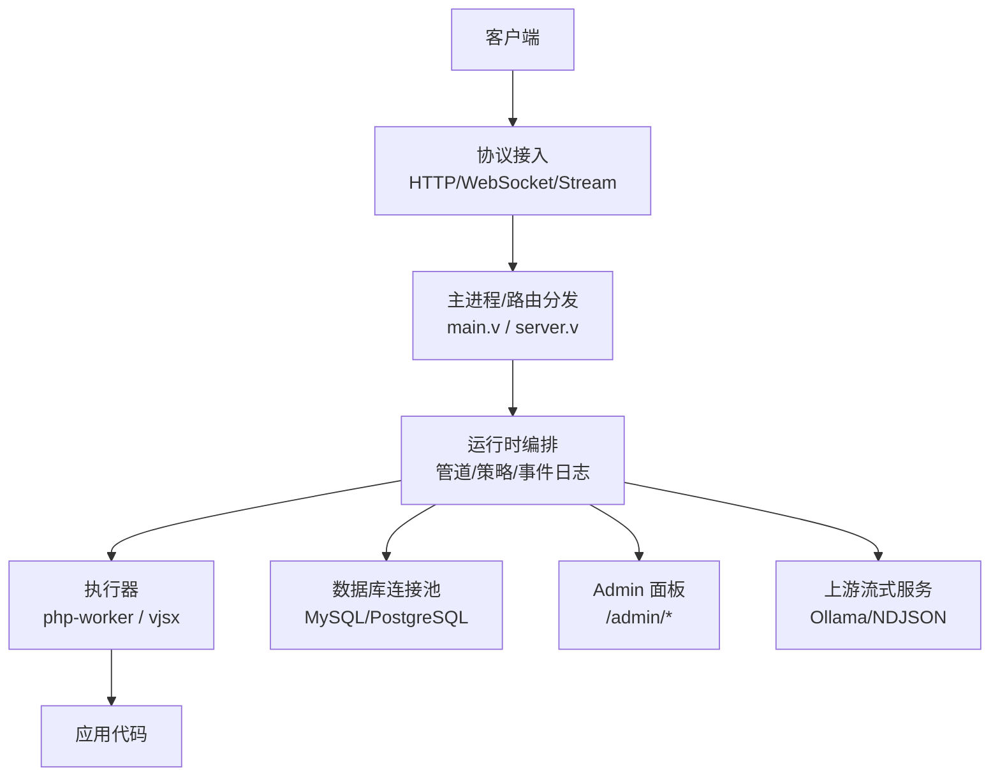
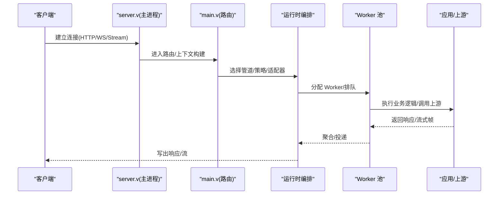
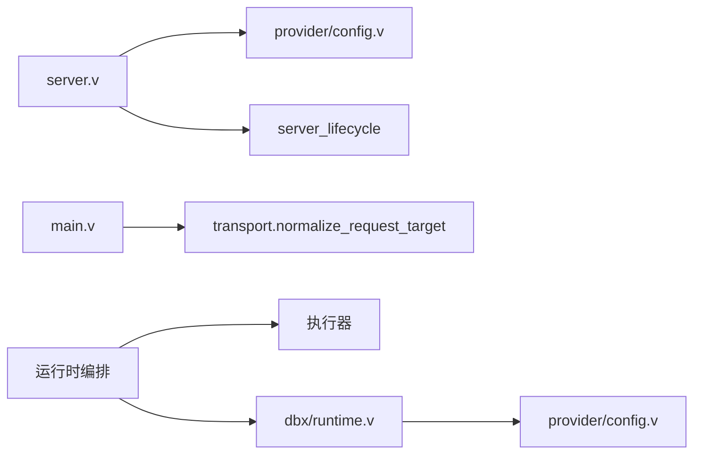

# 性能优化指南

<cite>
**本文引用的文件列表**
- [README.md](file://README.md)
- [vhttpd.example.toml](file://config/vhttpd.example.toml)
- [server.v](file://src/server.v)
- [main.v](file://src/main.v)
- [dbx/runtime.v](file://src/dbx/runtime.v)
- [provider/config.v](file://src/provider/config.v)
- [11-observability.md](file://articles/11-observability.md)
- [PROTOCOL_PIPELINE_IMPLEMENTATION_PLAN.md](file://docs/PROTOCOL_PIPELINE_IMPLEMENTATION_PLAN.md)
- [refactor_0601.md](file://docs/refactor_0601.md)
- [bench/README.md](file://bench/README.md)
- [worker_backend_admin_runtime.v](file://src/worker_backend_admin_runtime.v)
</cite>

## 目录
1. [引言](#引言)
2. [项目结构](#项目结构)
3. [核心组件](#核心组件)
4. [架构总览](#架构总览)
5. [详细组件分析](#详细组件分析)
6. [依赖关系分析](#依赖关系分析)
7. [性能考虑与调优参数](#性能考虑与调优参数)
8. [监控与可观测性](#监控与可观测性)
9. [场景化优化策略](#场景化优化策略)
10. [负载均衡与水平扩展](#负载均衡与水平扩展)
11. [基准测试方法与结果分析](#基准测试方法与结果分析)
12. [故障排查指南](#故障排查指南)
13. [结论](#结论)

## 引言
本指南聚焦 vhttpd 在生产环境中的性能优化，覆盖内存管理、并发控制、连接池配置、监控与分析工具、不同业务场景的优化策略、负载均衡与水平扩展实践，以及基准测试方法。文档基于仓库源码与示例配置进行提炼，确保建议与实现一致。

## 项目结构
vhttpd 采用“协议接入 + 运行时编排 + 执行器”的分层设计：
- 协议接入层：HTTP/WebSocket/Stream 统一入口
- 运行时编排层：管道、策略、调度、事件日志、Admin 面板
- 执行器层：php-worker、vjsx 等逻辑执行后端
- 外部集成：数据库连接池、上游流式 API（如 Ollama）、飞书等

图表来源
- [main.v:1-117](file://src/main.v#L1-L117)
- [server.v:1-372](file://src/server.v#L1-L372)

章节来源
- [README.md:1-200](file://README.md#L1-L200)
- [server.v:1-120](file://src/server.v#L1-L120)
- [main.v:1-117](file://src/main.v#L1-L117)

## 核心组件
- 服务器生命周期与信号处理：负责启动、多监听模式、优雅退出、子进程清理
- 请求路由与上下文：统一解析 trace_id/request_id，转发到数据面路由
- 工作进程池与队列：pool_size、queue_capacity、queue_timeout_ms、max_requests 等
- 数据库连接池：MySQL/PostgreSQL 池化、空闲探测、初始化 SQL
- 可观测性：事件日志 NDJSON、Admin 快照、Prometheus 指标端点规划

章节来源
- [server.v:120-372](file://src/server.v#L120-L372)
- [main.v:40-82](file://src/main.v#L40-L82)
- [dbx/runtime.v:484-588](file://src/dbx/runtime.v#L484-L588)
- [11-observability.md:406-468](file://articles/11-observability.md#L406-L468)

## 架构总览
vhttpd 将 HTTP 作为事实来源，复用底层 HTTP 栈，自身专注于传输、Worker 编排、流式能力与可观测性。

图表来源
- [main.v:83-116](file://src/main.v#L83-L116)
- [server.v:276-319](file://src/server.v#L276-L319)

## 详细组件分析

### 服务器与生命周期
- 支持单实例与多监听模式；通过命令行与 TOML 合并加载配置
- 信号处理：SIGINT/SIGTERM 触发优雅关闭，清理子进程组与临时文件
- 锁层级规范：明确 L0..L7 获取顺序，避免死锁

章节来源
- [server.v:1-120](file://src/server.v#L1-L120)
- [server.v:276-319](file://src/server.v#L276-L319)

### 请求路由与追踪
- 统一解析 trace_id/request_id，优先从查询参数或请求头提取，否则生成
- 所有数据面请求经 main.v 路由到 HttpIngressRuntime

章节来源
- [main.v:40-82](file://src/main.v#L40-L82)
- [main.v:83-116](file://src/main.v#L83-L116)

### 工作进程池与队列
- 关键参数：pool_size、queue_capacity、queue_timeout_ms、read_timeout_ms、max_requests、restart_backoff_*
- 当 pool_size > 1 时自动注入 worker socket 前缀，支持显式 sockets 列表
- 队列满直接拒绝（503），等待超时返回（504）

章节来源
- [server.v:223-248](file://src/server.v#L223-L248)
- [README.md:1065-1089](file://README.md#L1065-L1089)
- [vhttpd.example.toml:19-27](file://config/vhttpd.example.toml#L19-L27)

### 数据库连接池
- MySQL：使用通道容量模拟池大小，空闲时间超过阈值则 ping 并重建连接
- PostgreSQL：使用 pg.PoolConfig.max_open_conns 限制最大连接数
- 支持 init_sql 在每次会话获取后执行

章节来源
- [dbx/runtime.v:484-588](file://src/dbx/runtime.v#L484-L588)
- [provider/config.v:74-129](file://src/provider/config.v#L74-L129)
- [provider/config.v:205-229](file://src/provider/config.v#L205-L229)

### 可观测性与事件日志
- 事件日志：event_log 输出 NDJSON，包含 pipeline、transform、ingress/egress 等字段
- Admin 快照：/admin/runtime/* 暴露运行态信息
- Prometheus 指标端点：/admin/metrics（text format），需鉴权 token

章节来源
- [11-observability.md:406-468](file://articles/11-observability.md#L406-L468)
- [PROTOCOL_PIPELINE_IMPLEMENTATION_PLAN.md:638-686](file://docs/PROTOCOL_PIPELINE_IMPLEMENTATION_PLAN.md#L638-L686)

## 依赖关系分析
- 主进程依赖配置加载、生命周期管理、信号处理
- 路由依赖上下文与 transport 规范化
- 运行时编排依赖管道、策略、适配器与执行器
- 数据库模块依赖 provider 配置解析与驱动差异处理

图表来源
- [server.v:276-319](file://src/server.v#L276-L319)
- [main.v:40-82](file://src/main.v#L40-L82)
- [dbx/runtime.v:484-588](file://src/dbx/runtime.v#L484-L588)
- [provider/config.v:74-129](file://src/provider/config.v#L74-L129)

## 性能考虑与调优参数

### 内存管理与泄漏防护
- 设置 max_requests 定期重启 Worker，缓解 PHP 侧内存增长
- 观察 Admin 面板中每个 Worker 的 RSS 与 inflight/served 计数，定位异常进程
- 结合事件日志与 trace_id 关联问题链路

章节来源
- [worker_backend_admin_runtime.v:1-40](file://src/worker_backend_admin_runtime.v#L1-L40)
- [11-observability.md:602-666](file://articles/11-observability.md#L602-L666)

### 并发控制与工作进程池
- pool_size 建议为 CPU 核数的 1~2 倍，I/O 密集可适当提高
- queue_capacity 与 queue_timeout_ms 配合限流与快速失败，避免雪崩
- read_timeout_ms 根据业务类型调整：普通请求短、AI 流式长

章节来源
- [vhttpd.example.toml:19-27](file://config/vhttpd.example.toml#L19-L27)
- [11-observability.md:622-666](file://articles/11-observability.md#L622-L666)

### 连接池配置（数据库）
- MySQL：合理设置 pool_size，启用 idle_ping_ms 保持连接健康
- PostgreSQL：通过 max_open_conns 限制并发连接，避免数据库过载
- init_sql 用于会话级初始化（如 SET NAMES、SET TIME ZONE）

章节来源
- [dbx/runtime.v:484-588](file://src/dbx/runtime.v#L484-L588)
- [provider/config.v:205-229](file://src/provider/config.v#L205-L229)

### 管道与拷贝预算
- 管道各阶段有界并发，避免无界线程
- 初始实现尽量避免中间拷贝，仅在所有权边界复制
- 静态响应路径独立于应用执行，缓存命中不触发转换器

章节来源
- [PROTOCOL_PIPELINE_IMPLEMENTATION_PLAN.md:638-686](file://docs/PROTOCOL_PIPELINE_IMPLEMENTATION_PLAN.md#L638-L686)

### 安全与并发重构
- 逐步替换 unsafe 与裸指针，采用 shared/RwMutex/chan 提升并发安全性
- 读锁优化：只读聚合使用读写锁降低竞争

章节来源
- [refactor_0601.md:351-365](file://docs/refactor_0601.md#L351-L365)

## 监控与可观测性

### 内置指标与端点
- Admin 快照：/admin/runtime/* 提供运行时状态
- Prometheus 指标：/admin/metrics（text format），需 x-vhttpd-admin-token 鉴权
- 事件日志：event_log 输出结构化 NDJSON，便于集中采集

章节来源
- [11-observability.md:406-468](file://articles/11-observability.md#L406-L468)

### 外部系统集成
- Prometheus 抓取配置示例：job_name、metrics_path、headers
- 自定义指标：在应用中通过 Metrics API 上报计数器、仪表盘、直方图

章节来源
- [11-observability.md:406-468](file://articles/11-observability.md#L406-L468)

### 性能瓶颈定位技术
- 使用 trace_id/request_id 串联全链路
- 关注队列深度、等待时长、执行时长、字节/帧统计
- 结合 Admin 面板与事件日志交叉验证

章节来源
- [PROTOCOL_PIPELINE_IMPLEMENTATION_PLAN.md:638-686](file://docs/PROTOCOL_PIPELINE_IMPLEMENTATION_PLAN.md#L638-L686)

## 场景化优化策略

### 高并发处理
- 增大 pool_size 与 queue_capacity，缩短 queue_timeout_ms 以快速失败
- 开启 max_requests 定期重启 Worker，防止内存泄漏累积
- 对热点接口启用缓存或降级策略

章节来源
- [vhttpd.example.toml:19-27](file://config/vhttpd.example.toml#L19-L27)
- [11-observability.md:622-666](file://articles/11-observability.md#L622-L666)

### 大文件传输
- 使用流式响应，避免整包缓冲
- 调整 read_timeout_ms 与网络层超时，确保长时间传输稳定
- 利用静态资源路径与缓存控制头减少动态处理开销

章节来源
- [PROTOCOL_PIPELINE_IMPLEMENTATION_PLAN.md:638-686](file://docs/PROTOCOL_PIPELINE_IMPLEMENTATION_PLAN.md#L638-L686)

### 流式数据处理（SSE/text）
- 固定 tokens 变 interval 评估传输开销
- 固定 interval 变 tokens 评估可扩展性
- 使用 k6 脚本进行回归与对比矩阵测试

章节来源
- [bench/README.md:79-158](file://bench/README.md#L79-L158)

## 负载均衡与水平扩展

### 多监听与多站点
- 一个进程可绑定多个 host:port，每个站点隔离执行器与运行时
- 通过 sites.<id> 定义站点，listeners.<id> 映射到站点

章节来源
- [README.md:533-603](file://README.md#L533-L603)

### 横向扩展
- 多实例部署：每个实例独立端口与站点，前端反向代理做负载均衡
- 使用 systemd/launchd 模板管理服务，便于多实例并行运行

章节来源
- [README.md:367-411](file://README.md#L367-L411)

## 基准测试方法与结果分析

### 主机回归测试
- 一键脚本：build -> start -> run short/stream benchmarks -> stop -> verify no leftover workers
- 环境变量：VHTTPD_PORT、VHTTPD_WORKER_POOL_SIZE、VHTTPD_BENCH_RUN_K6

章节来源
- [bench/README.md:24-58](file://bench/README.md#L24-L58)

### 短请求基准
- 默认目标路径：/laravel/hello/guweigang
- 自定义路径：VHTTPD_BENCH_PATH=/health

章节来源
- [bench/README.md:59-78](file://bench/README.md#L59-L78)

### 流式基准（SSE/text）
- 启动确定性基准应用，分别测试 SSE 与 text 模式
- 推荐对比矩阵：Group A（固定 tokens，变 interval）与 Group B（固定 interval，变 tokens）

章节来源
- [bench/README.md:79-158](file://bench/README.md#L79-L158)

### 结果分析方法
- 关注吞吐、延迟分布、错误率、CPU/内存占用
- 对比不同 pool_size、queue_capacity、interval/tokens 组合下的表现
- 结合事件日志与 trace_id 定位瓶颈环节

章节来源
- [PROTOCOL_PIPELINE_IMPLEMENTATION_PLAN.md:638-686](file://docs/PROTOCOL_PIPELINE_IMPLEMENTATION_PLAN.md#L638-L686)

## 故障排查指南

### 常见症状与定位
- 队列积压：检查 queue_capacity 与 queue_timeout_ms，必要时扩容 pool_size
- Worker 内存增长：设置 max_requests，结合 Admin 面板观察 RSS
- 连接不稳定：检查数据库 idle_ping_ms 与 init_sql，确认连接健康

章节来源
- [worker_backend_admin_runtime.v:1-40](file://src/worker_backend_admin_runtime.v#L1-L40)
- [dbx/runtime.v:556-588](file://src/dbx/runtime.v#L556-L588)
- [11-observability.md:602-666](file://articles/11-observability.md#L602-L666)

### 日志与事件
- 事件日志：event_log 输出 NDJSON，按 trace_id 过滤
- Admin 快照：/admin/runtime/* 查看实时状态

章节来源
- [11-observability.md:406-468](file://articles/11-observability.md#L406-L468)

## 结论
vhttpd 通过统一的协议接入、可编排的运行时与灵活的执行器模型，提供了高性能、可扩展的服务承载能力。生产环境中应重点关注工作进程池与队列参数、数据库连接池健康、流式传输的稳定性与可观测性建设。借助基准测试与监控体系，持续迭代优化，确保在高并发与大流量场景下保持稳定与高效。