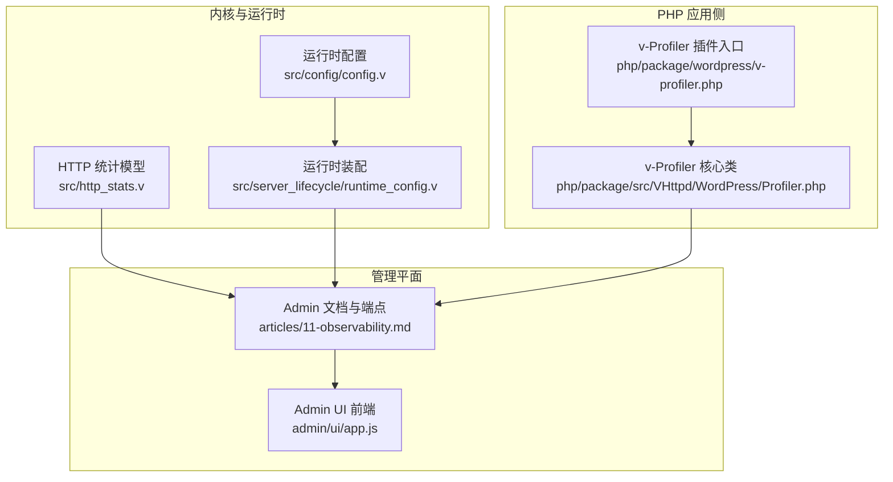
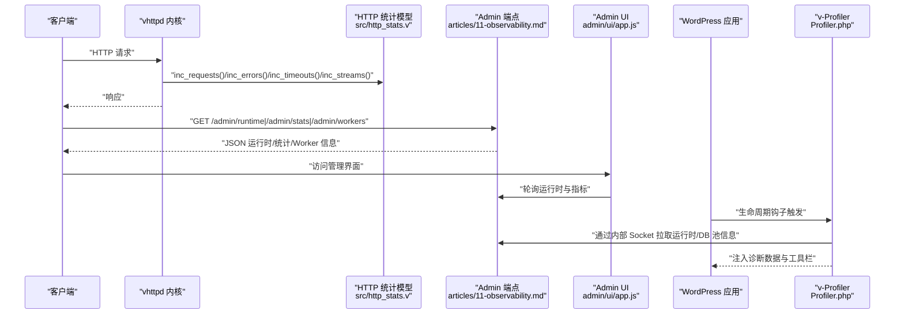
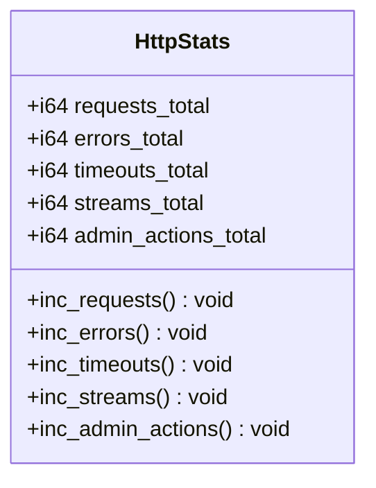
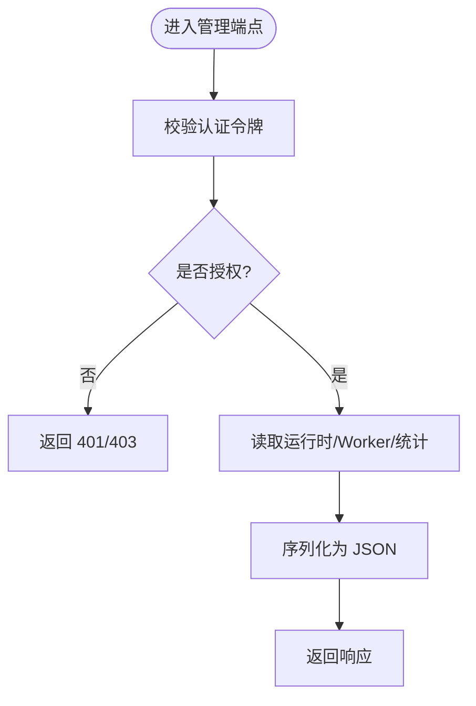
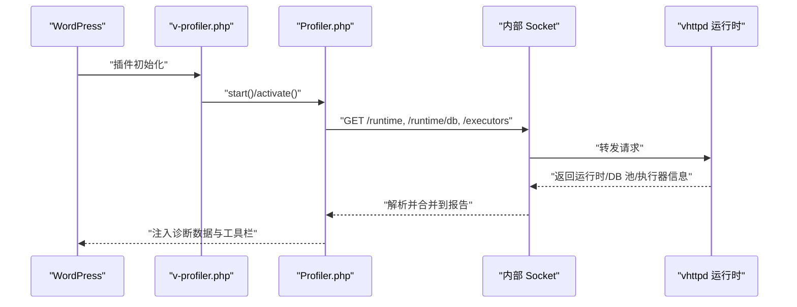
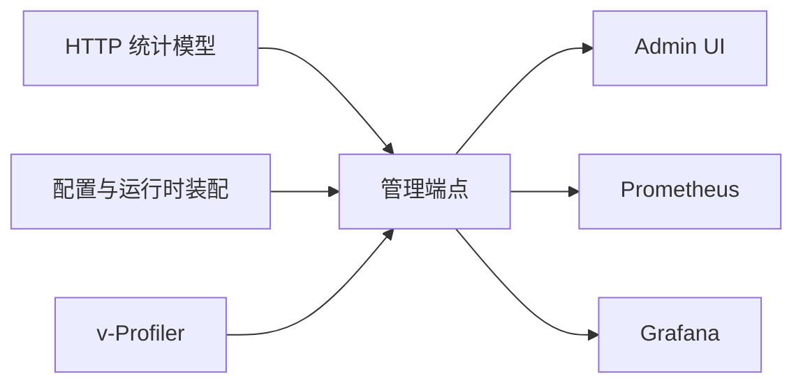

# 性能监控与分析

<cite>
**本文引用的文件**   
- [src/http_stats.v](file://src/http_stats.v)
- [articles/11-observability.md](file://articles/11-observability.md)
- [php/package/src/VHttpd/WordPress/Profiler.php](file://php/package/src/VHttpd/WordPress/Profiler.php)
- [php/package/wordpress/v-profiler.php](file://php/package/wordpress/v-profiler.php)
- [admin/ui/app.js](file://admin/ui/app.js)
- [src/config/config.v](file://src/config/config.v)
- [src/server_lifecycle/runtime_config.v](file://src/server_lifecycle/runtime_config.v)
</cite>

## 目录
1. [简介](#简介)
2. [项目结构](#项目结构)
3. [核心组件](#核心组件)
4. [架构总览](#架构总览)
5. [详细组件分析](#详细组件分析)
6. [依赖关系分析](#依赖关系分析)
7. [性能考量](#性能考量)
8. [故障排查指南](#故障排查指南)
9. [结论](#结论)
10. [附录](#附录)

## 简介
本文件面向生产环境的可观测性与性能调优，聚焦以下目标：
- 说明 vhttpd 内置的 HTTP 统计指标收集机制（请求总数、错误数、超时数、流式连接数等）
- 介绍 PHP Profiler（v-Profiler）的配置与使用方式
- 提供与 Prometheus/Grafana 等外部监控系统的集成方案
- 给出定位性能瓶颈的方法（CPU、内存、慢查询等）
- 提供仪表板配置示例与告警规则建议

## 项目结构
围绕“指标采集—管理平面—可视化—外部系统”的主线，关键位置如下：
- 指标计数模型：HTTP 层计数器定义与自增方法
- 管理平面与运行时信息：Admin Plane 端点、运行时摘要、Worker 状态、事件日志
- PHP 侧性能剖析：v-Profiler 插件在 WordPress 生命周期中采集 SQL、Hook、外部请求、缓存命中率等
- Admin UI：前端聚合展示运行态与可观测性指标
- 配置项：Admin 服务、资源静态化、执行器与 Worker 相关参数

图示来源
- [src/http_stats.v:1-32](file://src/http_stats.v#L1-L32)
- [src/config/config.v:132-171](file://src/config/config.v#L132-L171)
- [src/server_lifecycle/runtime_config.v:146-171](file://src/server_lifecycle/runtime_config.v#L146-L171)
- [articles/11-observability.md:1-120](file://articles/11-observability.md#L1-L120)
- [admin/ui/app.js:656-675](file://admin/ui/app.js#L656-L675)
- [php/package/wordpress/v-profiler.php:62-127](file://php/package/wordpress/v-profiler.php#L62-L127)
- [php/package/src/VHttpd/WordPress/Profiler.php:54-114](file://php/package/src/VHttpd/WordPress/Profiler.php#L54-L114)

章节来源
- [src/http_stats.v:1-32](file://src/http_stats.v#L1-L32)
- [articles/11-observability.md:1-120](file://articles/11-observability.md#L1-L120)
- [php/package/wordpress/v-profiler.php:62-127](file://php/package/wordpress/v-profiler.php#L62-L127)
- [php/package/src/VHttpd/WordPress/Profiler.php:54-114](file://php/package/src/VHttpd/WordPress/Profiler.php#L54-L114)
- [admin/ui/app.js:656-675](file://admin/ui/app.js#L656-L675)
- [src/config/config.v:132-171](file://src/config/config.v#L132-L171)
- [src/server_lifecycle/runtime_config.v:146-171](file://src/server_lifecycle/runtime_config.v#L146-L171)

## 核心组件
- HTTP 统计模型
  - 提供请求总数、错误数、超时数、流式连接数、管理操作数等计数器及自增方法
  - 用于上层统计聚合与对外暴露
- 管理平面（Admin Plane）
  - 提供运行时摘要、Worker 状态、统计数据、上游连接、MCP 会话等端点
  - 支持 NDJSON 事件日志输出，便于外部采集
- PHP Profiler（v-Profiler）
  - 在 WordPress 生命周期早期启动，采集时间线、SQL、Hook、外部 HTTP、缓存命中、安全头、WooCommerce 上下文等
  - 通过内部 Socket 拉取 vhttpd 运行时与数据库池信息，形成统一报告
- Admin UI
  - 聚合展示 HTTP 请求、错误率、路由、WebSockets、Uptime 等关键指标

章节来源
- [src/http_stats.v:1-32](file://src/http_stats.v#L1-L32)
- [articles/11-observability.md:35-140](file://articles/11-observability.md#L35-L140)
- [php/package/src/VHttpd/WordPress/Profiler.php:54-114](file://php/package/src/VHttpd/WordPress/Profiler.php#L54-L114)
- [admin/ui/app.js:656-675](file://admin/ui/app.js#L656-L675)

## 架构总览
下图展示了从请求进入、指标采集、到管理与可视化的整体流程。

图示来源
- [src/http_stats.v:1-32](file://src/http_stats.v#L1-L32)
- [articles/11-observability.md:35-140](file://articles/11-observability.md#L35-L140)
- [admin/ui/app.js:656-675](file://admin/ui/app.js#L656-L675)
- [php/package/src/VHttpd/WordPress/Profiler.php:489-528](file://php/package/src/VHttpd/WordPress/Profiler.php#L489-L528)

## 详细组件分析

### HTTP 统计模型（请求/错误/超时/流式连接）
- 数据结构与方法
  - 字段：requests_total、errors_total、timeouts_total、streams_total、admin_actions_total
  - 方法：inc_requests()、inc_errors()、inc_timeouts()、inc_streams()、inc_admin_actions()
- 使用场景
  - 在 HTTP 处理路径的关键节点调用对应自增方法，实现无侵入的指标采集
  - 上层将累计值导出为管理端点或外部监控系统格式

图示来源
- [src/http_stats.v:1-32](file://src/http_stats.v#L1-L32)

章节来源
- [src/http_stats.v:1-32](file://src/http_stats.v#L1-L32)

### 管理平面与运行时统计
- 核心端点
  - 运行时摘要：包含 Worker 池、HTTP 请求/错误、流式/WebSocket 连接、MCP 会话、内存与运行时长等
  - Worker 状态：每个 Worker 的 ID、PID、状态、请求计数、内存占用等
  - 运行时统计：请求速率、延迟分位、错误分类（如 worker_timeout、worker_queue_full、upstream_error）
- 事件日志
  - NDJSON 格式，记录 http.request、worker.request、upstream.*、error 等事件
  - 便于外部采集与离线分析

图示来源
- [articles/11-observability.md:35-140](file://articles/11-observability.md#L35-L140)

章节来源
- [articles/11-observability.md:35-140](file://articles/11-observability.md#L35-L140)

### PHP Profiler（v-Profiler）配置与使用
- 启用时机
  - 在 WordPress 极早期过滤器与动作中启动，确保捕获插件加载阶段错误与耗时
  - 支持管理员 Cookie 鉴权与调试开关控制
- 采集内容
  - 时间线检查点、SQL 语句与调用栈、Hook 调用次数与回调位置、外部 HTTP 请求耗时、对象缓存命中率、安全头检测、WooCommerce 上下文与优化建议
- 与 vhttpd 集成
  - 通过内部 Socket 拉取 vhttpd 运行时与数据库池信息，合并到诊断报告中

图示来源
- [php/package/wordpress/v-profiler.php:62-127](file://php/package/wordpress/v-profiler.php#L62-L127)
- [php/package/src/VHttpd/WordPress/Profiler.php:489-528](file://php/package/src/VHttpd/WordPress/Profiler.php#L489-L528)

章节来源
- [php/package/wordpress/v-profiler.php:62-127](file://php/package/wordpress/v-profiler.php#L62-L127)
- [php/package/src/VHttpd/WordPress/Profiler.php:54-114](file://php/package/src/VHttpd/WordPress/Profiler.php#L54-L114)
- [php/package/src/VHttpd/WordPress/Profiler.php:489-528](file://php/package/src/VHttpd/WordPress/Profiler.php#L489-L528)

### Admin UI 仪表板
- 展示维度
  - HTTP 请求总量与错误率、路由数量、开放通道、活跃 WebSockets、进程运行时长
  - 健康状态与关键异常汇总
- 数据来源
  - 轮询管理端点获取运行时与统计信息，渲染拓扑与指标卡片

章节来源
- [admin/ui/app.js:656-675](file://admin/ui/app.js#L656-L675)

### 配置项与运行时装配
- Admin 服务
  - host/port/token 控制管理平面监听与鉴权
- 资源静态化
  - assets.enabled/prefix/root/cache_control 控制静态资源服务策略
- 运行时装配
  - 将 Admin、Assets、Worker 超时与队列容量等参数注入 AppRuntimeBuildConfig，供运行时使用

章节来源
- [src/config/config.v:132-171](file://src/config/config.v#L132-L171)
- [src/server_lifecycle/runtime_config.v:146-171](file://src/server_lifecycle/runtime_config.v#L146-L171)

## 依赖关系分析
- 低耦合高内聚
  - HTTP 统计模型独立于业务逻辑，仅负责计数
  - 管理平面通过配置驱动，聚合运行时与统计信息
  - v-Profiler 通过内部 Socket 与 vhttpd 通信，避免强耦合
- 外部依赖
  - Prometheus/Grafana 通过管理端点抓取指标
  - 事件日志以 NDJSON 形式输出，便于外部采集

图示来源
- [src/http_stats.v:1-32](file://src/http_stats.v#L1-L32)
- [articles/11-observability.md:406-433](file://articles/11-observability.md#L406-L433)
- [admin/ui/app.js:656-675](file://admin/ui/app.js#L656-L675)

章节来源
- [src/http_stats.v:1-32](file://src/http_stats.v#L1-L32)
- [articles/11-observability.md:406-433](file://articles/11-observability.md#L406-L433)
- [admin/ui/app.js:656-675](file://admin/ui/app.js#L656-L675)

## 性能考量
- 指标采集开销
  - 计数器自增为 O(1)，对主路径影响极低
  - 建议在热点路径按需开启更细粒度统计
- 管理端点负载
  - 高频轮询可能带来额外压力，建议合理设置轮询间隔
- v-Profiler 开销
  - 仅在调试模式或管理员 Cookie 下激活，避免生产环境常驻开销
  - 外部 HTTP 与 SQL 调用栈采集会引入少量 CPU/内存消耗，按需开启

[本节为通用指导，不直接分析具体文件]

## 故障排查指南
- 常见症状与步骤
  - Worker 无响应：查看 Worker 状态、事件日志中的 worker.error、必要时重启问题 Worker
  - 上游连接频繁断开：查看上游连接状态与事件、测试上游连通性
  - MCP 会话无法创建：检查 MCP 状态与 Worker 繁忙情况、查看 MCP 错误日志
  - 内存持续增长：监控 memory_mb、限制 max_requests、优化代码与增加池大小
- 慢查询与外部请求
  - 使用 v-Profiler 的 SQL 列表与外部 HTTP 列表，结合调用栈定位慢点
  - 关注 WooCommerce 相关 SQL 与第三方 API 耗时，结合 HPOS 与缓存策略优化

章节来源
- [articles/11-observability.md:530-619](file://articles/11-observability.md#L530-L619)
- [php/package/src/VHttpd/WordPress/Profiler.php:610-704](file://php/package/src/VHttpd/WordPress/Profiler.php#L610-L704)
- [php/package/src/VHttpd/WordPress/Profiler.php:706-750](file://php/package/src/VHttpd/WordPress/Profiler.php#L706-L750)

## 结论
- vhttpd 提供了轻量且可扩展的可观测性基础：HTTP 统计模型、管理端点、NDJSON 事件日志
- v-Profiler 在 PHP 侧补齐了 SQL/Hook/外部请求/缓存与安全头的深度诊断能力
- 通过 Admin UI 与外部系统（Prometheus/Grafana）可实现端到端的监控与告警闭环
- 在生产环境中应谨慎开启高开销采集，结合阈值与告警快速定位瓶颈

[本节为总结，不直接分析具体文件]

## 附录

### Prometheus 集成与告警规则
- 抓取配置
  - 在 prometheus.yml 中添加 job，指向 vhttpd 管理端点的 metrics_path 与认证头
- 自定义指标
  - 在 PHP Worker 中通过 Metrics API 上报自定义指标（增量、度量、直方图）
- 推荐告警规则
  - Worker 空闲数为 0 持续一段时间
  - Worker 队列积压超过阈值
  - 错误率高于阈值
  - 上游连接断开
  - MCP 会话接近上限

章节来源
- [articles/11-observability.md:406-433](file://articles/11-observability.md#L406-L433)
- [articles/11-observability.md:469-526](file://articles/11-observability.md#L469-L526)

### 性能调优要点
- Worker 池与超时
  - pool_size 建议按 CPU 核心数调整；read_timeout_ms 区分普通与 AI 流式请求
- 队列与重连退避
  - queue_capacity/queue_timeout_ms 控制背压；restart_backoff_* 控制重试节奏
- MCP 与会话
  - max_sessions/session_ttl_seconds/max_pending_messages 控制并发与清理策略

章节来源
- [articles/11-observability.md:622-666](file://articles/11-observability.md#L622-L666)