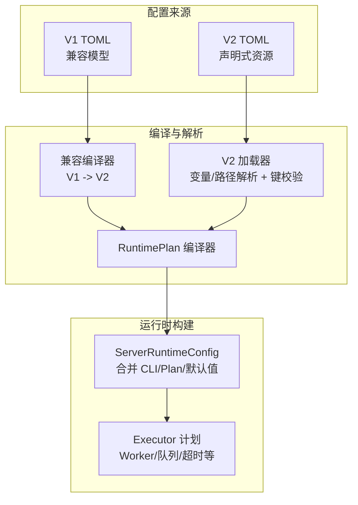
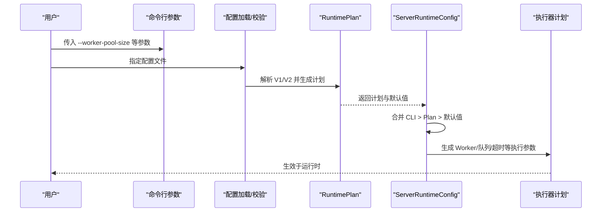
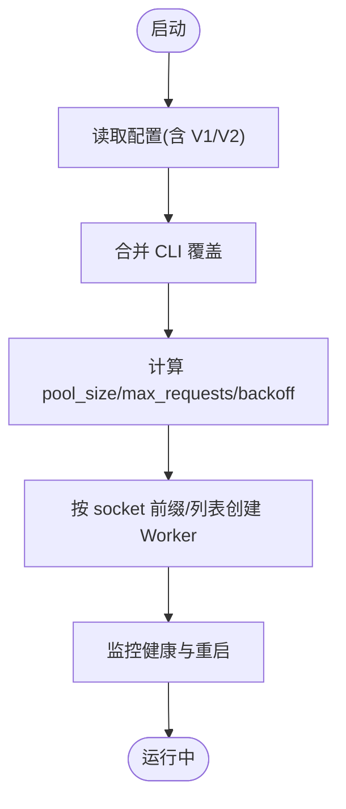
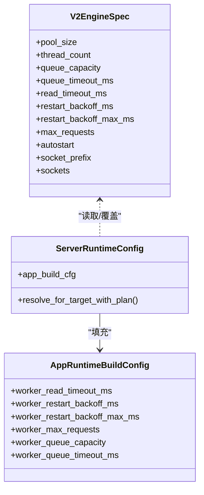

# 配置调优参数

<cite>
**本文引用的文件列表**
- [config/vhttpd.example.toml](file://config/vhttpd.example.toml)
- [config/vhttpd.multi.example.toml](file://config/vhttpd.multi.example.toml)
- [config/vhttpd.vjsx.example.toml](file://config/vhttpd.vjsx.example.toml)
- [src/config/v2_config.v](file://src/config/v2_config.v)
- [src/server_lifecycle/runtime_config.v](file://src/server_lifecycle/runtime_config.v)
- [src/config/args.v](file://src/config/args.v)
- [README.md](file://README.md)
- [articles/11-observability.md](file://articles/11-observability.md)
- [src/config/runtime_plan_loader.v](file://src/config/runtime_plan_loader.v)
- [src/config/v1_plan_compat.v](file://src/config/v1_plan_compat.v)
- [src/provider/config.v](file://src/provider/config.v)
- [src/dbx/runtime.v](file://src/dbx/runtime.v)
</cite>

## 目录
1. [简介](#简介)
2. [项目结构](#项目结构)
3. [核心组件](#核心组件)
4. [架构总览](#架构总览)
5. [详细组件分析](#详细组件分析)
6. [依赖关系分析](#依赖关系分析)
7. [性能考虑](#性能考虑)
8. [故障排查指南](#故障排查指南)
9. [结论](#结论)
10. [附录](#附录)

## 简介
本指南聚焦 VHTTPD 的关键性能参数与优化方法，覆盖工作进程池大小、连接超时、队列与缓冲、内存限制等核心配置项；给出开发、测试、生产环境的差异化策略；说明动态配置热更新方法与注意事项；提供配置校验与最佳实践检查工具的使用建议；并总结常见问题诊断与解决方案。

## 项目结构
VHTTPD 的配置体系包含两套模型：
- V1 兼容模型（legacy）：通过兼容性编译层转换为 V2 声明式资源计划
- V2 声明式模型：以 listeners、engines、adapters、transforms、pipelines、relays 等资源描述运行时行为

示例配置文件位于 config 目录，涵盖单站点、多站点以及 VJSX 运行时的典型用法。

图表来源
- [src/config/v1_plan_compat.v:1-47](file://src/config/v1_plan_compat.v#L1-L47)
- [src/config/runtime_plan_loader.v:505-583](file://src/config/runtime_plan_loader.v#L505-L583)
- [src/server_lifecycle/runtime_config.v:54-171](file://src/server_lifecycle/runtime_config.v#L54-L171)

章节来源
- [config/vhttpd.example.toml:1-67](file://config/vhttpd.example.toml#L1-L67)
- [config/vhttpd.multi.example.toml:1-73](file://config/vhttpd.multi.example.toml#L1-L73)
- [config/vhttpd.vjsx.example.toml:1-37](file://config/vhttpd.vjsx.example.toml#L1-L37)
- [src/config/v2_config.v:1-318](file://src/config/v2_config.v#L1-L318)
- [src/config/v1_plan_compat.v:1-47](file://src/config/v1_plan_compat.v#L1-L47)
- [src/config/runtime_plan_loader.v:505-583](file://src/config/runtime_plan_loader.v#L505-L583)
- [src/server_lifecycle/runtime_config.v:54-171](file://src/server_lifecycle/runtime_config.v#L54-L171)

## 核心组件
本节梳理关键性能相关配置项及其生效路径。

- 工作进程池与生命周期
  - pool_size：工作进程数量，直接影响并发能力
  - max_requests：每个 Worker 最大请求数后重启，避免内存泄漏
  - restart_backoff_ms / restart_backoff_max_ms：重启退避时间范围
  - autostart：是否自动启动 Worker
  - socket_prefix / sockets：进程间通信套接字前缀或显式列表

- 超时与队列
  - read_timeout_ms：Worker 读取超时
  - queue_capacity：队列容量
  - queue_timeout_ms：入队等待超时

- 静态资源与缓存控制
  - assets.enabled/prefix/root/cache_control：静态资源开关、前缀、根目录与缓存头

- 数据库连接池
  - db.pool_size/idle_ping_ms/init_sql：连接池大小、空闲心跳、初始化 SQL

- 线程与引擎
  - vjsx.thread_count：VJSX 引擎线程数
  - engines.*.thread_count/pool_size：通用引擎线程/池大小

- 管理面与可观测性
  - admin.host/port/token：管理面监听与鉴权
  - observability.event_log/log_level：事件日志与日志级别

章节来源
- [config/vhttpd.example.toml:19-27](file://config/vhttpd.example.toml#L19-L27)
- [config/vhttpd.multi.example.toml:44-73](file://config/vhttpd.multi.example.toml#L44-L73)
- [config/vhttpd.vjsx.example.toml:21-26](file://config/vhttpd.vjsx.example.toml#L21-L26)
- [src/config/v2_config.v:120-155](file://src/config/v2_config.v#L120-L155)
- [src/server_lifecycle/runtime_config.v:84-95](file://src/server_lifecycle/runtime_config.v#L84-L95)
- [src/provider/config.v:101-105](file://src/provider/config.v#L101-L105)
- [src/dbx/runtime.v:967-982](file://src/dbx/runtime.v#L967-L982)
- [README.md:1065-1089](file://README.md#L1065-L1089)

## 架构总览
下图展示从配置到运行时参数的关键路径，包括 CLI 覆盖、计划合并与最终应用。

图表来源
- [src/config/runtime_plan_loader.v:505-583](file://src/config/runtime_plan_loader.v#L505-L583)
- [src/server_lifecycle/runtime_config.v:54-171](file://src/server_lifecycle/runtime_config.v#L54-L171)
- [src/config/args.v:1-90](file://src/config/args.v#L1-L90)

## 详细组件分析

### 工作进程池与生命周期
- 关键参数
  - worker.pool_size：决定并发度，推荐按 CPU 核数 * 2 起步
  - worker.max_requests：定期重启 Worker，缓解内存增长
  - worker.restart_backoff_ms / restart_backoff_max_ms：平滑重启间隔
  - worker.autostart：按需启用自动拉起
  - worker.socket_prefix / worker.sockets：进程间通信方式
- 生效路径
  - 来自 V1/V2 配置的 engines.* 字段
  - 可通过 CLI 覆盖：--worker-pool-size、--worker-max-requests、--worker-restart-backoff-ms、--worker-restart-backoff-max-ms、--worker-socket/--worker-sockets
- 注意事项
  - 当 pool_size > 1 时，vhttpd 会自动注入 --socket 到子进程命令（若未显式设置）
  - 使用 sockets 显式列表可完全接管套接字命名

图表来源
- [src/server_lifecycle/runtime_config.v:84-95](file://src/server_lifecycle/runtime_config.v#L84-L95)
- [README.md:1065-1089](file://README.md#L1065-L1089)

章节来源
- [config/vhttpd.example.toml:19-27](file://config/vhttpd.example.toml#L19-L27)
- [config/vhttpd.multi.example.toml:44-73](file://config/vhttpd.multi.example.toml#L44-L73)
- [src/config/v2_config.v:120-155](file://src/config/v2_config.v#L120-L155)
- [src/server_lifecycle/runtime_config.v:84-95](file://src/server_lifecycle/runtime_config.v#L84-L95)
- [README.md:1065-1089](file://README.md#L1065-L1089)

### 连接与读取超时
- 关键参数
  - worker.read_timeout_ms：普通请求的读取超时
  - AI 流式场景建议增大该值以避免长连接被误断
- 生效路径
  - 由 ServerRuntimeConfig 从 CLI/Plan/默认值合并得到，并传递给执行器后端

章节来源
- [src/server_lifecycle/runtime_config.v:84-85](file://src/server_lifecycle/runtime_config.v#L84-L85)
- [articles/11-observability.md:634-646](file://articles/11-observability.md#L634-L646)

### 队列容量与等待超时
- 关键参数
  - worker.queue_capacity：入队缓冲上限
  - worker.queue_timeout_ms：入队等待超时
- 适用场景
  - 突发流量下保护后端，避免瞬时过载导致雪崩

章节来源
- [src/server_lifecycle/runtime_config.v:92-95](file://src/server_lifecycle/runtime_config.v#L92-L95)
- [articles/11-observability.md:648-654](file://articles/11-observability.md#L648-L654)

### 静态资源与缓存控制
- 关键参数
  - assets.enabled/prefix/root/cache_control
- 作用
  - 开启静态资源服务，统一 Cache-Control 响应头，提升前端加载性能

章节来源
- [config/vhttpd.example.toml:43-48](file://config/vhttpd.example.toml#L43-L48)
- [config/vhttpd.multi.example.toml:18-22](file://config/vhttpd.multi.example.toml#L18-L22)
- [src/server_lifecycle/runtime_config.v:96-101](file://src/server_lifecycle/runtime_config.v#L96-L101)

### 数据库连接池
- 关键参数
  - db.pool_size：连接池大小
  - db.idle_ping_ms：空闲心跳间隔
  - db.init_sql：初始化 SQL
- 生效路径
  - ProviderRuntimeSettings 根据驱动类型选择 MySQL/PostgreSQL 默认值与覆盖

章节来源
- [src/provider/config.v:101-105](file://src/provider/config.v#L101-L105)
- [src/dbx/runtime.v:967-982](file://src/dbx/runtime.v#L967-L982)

### VJSX 引擎线程与构建
- 关键参数
  - vjsx.thread_count：VJSX 引擎线程数
  - vjsx.build_root：构建产物目录
- 适用场景
  - 高并发 I/O 型 VJSX 应用可适当增加线程数

章节来源
- [config/vhttpd.vjsx.example.toml:21-26](file://config/vhttpd.vjsx.example.toml#L21-L26)
- [config/vhttpd.multi.example.toml:57-68](file://config/vhttpd.multi.example.toml#L57-L68)

### 管理面与可观测性
- 关键参数
  - admin.host/port/token：管理面监听与鉴权
  - observability.event_log/log_level：事件日志与日志级别
- 用途
  - 暴露运行时状态、计划替换预览/应用、指标采集入口

章节来源
- [config/vhttpd.example.toml:38-42](file://config/vhttpd.example.toml#L38-L42)
- [src/server_lifecycle/runtime_config.v:103-108](file://src/server_lifecycle/runtime_config.v#L103-L108)
- [src/config/v2_config.v:59-72](file://src/config/v2_config.v#L59-L72)

## 依赖关系分析
- 配置优先级
  - CLI 参数 > RuntimePlan（由 V1/V2 编译而来）> 默认值
- 关键字段来源
  - worker 相关：server_lifecycle.runtime_config 中的合并逻辑
  - 引擎/资源：src/config/v2_config.v 定义的结构体
  - 校验与诊断：src/config/runtime_plan_loader.v 的键白名单与错误信息
  - 兼容层：src/config/v1_plan_compat.v 将 V1 转为 V2

图表来源
- [src/config/v2_config.v:120-155](file://src/config/v2_config.v#L120-L155)
- [src/server_lifecycle/runtime_config.v:11-29](file://src/server_lifecycle/runtime_config.v#L11-L29)
- [src/server_lifecycle/runtime_config.v:73-171](file://src/server_lifecycle/runtime_config.v#L73-L171)

章节来源
- [src/config/v2_config.v:120-155](file://src/config/v2_config.v#L120-L155)
- [src/server_lifecycle/runtime_config.v:73-171](file://src/server_lifecycle/runtime_config.v#L73-L171)
- [src/config/runtime_plan_loader.v:505-583](file://src/config/runtime_plan_loader.v#L505-L583)
- [src/config/v1_plan_compat.v:1-47](file://src/config/v1_plan_compat.v#L1-L47)

## 性能考虑
- 工作进程池
  - 建议初始值为 CPU 核心数 * 2，结合压测逐步上调
  - 对 CPU 密集型任务适当降低线程数，I/O 密集可适当提高
- 超时与队列
  - 普通业务 read_timeout_ms 在毫秒级即可；AI 流式需显著增大
  - queue_capacity 与 queue_timeout_ms 用于削峰填谷，防止后端过载
- 内存与重启
  - 设置合理的 max_requests 定期重启 Worker，避免长期运行的内存泄漏累积
  - 结合观察指标（如内存占用）调整阈值
- 静态资源
  - 合理设置 cache_control，减少重复传输
- 数据库连接池
  - 根据 QPS 与慢查询情况调整 pool_size，配合 idle_ping_ms 保持连接活性

章节来源
- [articles/11-observability.md:622-666](file://articles/11-observability.md#L622-L666)
- [src/server_lifecycle/runtime_config.v:84-95](file://src/server_lifecycle/runtime_config.v#L84-L95)

## 故障排查指南
- 常见症状与定位
  - 频繁 Worker 重启：检查 max_requests 与崩溃日志
  - 请求超时：核对 read_timeout_ms 与上游处理耗时
  - 队列堆积：评估 queue_capacity 与 queue_timeout_ms
  - 内存持续增长：结合监控接口观察峰值，必要时缩短 max_requests
- 常用诊断手段
  - 通过管理面查看运行时状态与指标
  - 关注事件日志，定位异常上下文
- 参考步骤
  - 监控内存使用、Worker 内存分布
  - 调整 max_requests 与池大小进行对比验证

章节来源
- [articles/11-observability.md:602-618](file://articles/11-observability.md#L602-L618)
- [src/server_lifecycle/runtime_config.v:103-108](file://src/server_lifecycle/runtime_config.v#L103-L108)

## 结论
通过对工作进程池、超时、队列、内存与静态资源等关键参数的系统调优，并结合环境差异化的策略与可观测手段，可在保证稳定性的前提下显著提升 VHTTPD 的性能与可用性。建议在上线前完成压测与基线建立，持续跟踪指标并迭代优化。

## 附录

### 不同部署环境的推荐配置策略
- 开发环境
  - 目标：快速反馈与最小开销
  - 建议：较小的 pool_size（如 2），较短的 max_requests，适度超时
- 测试环境
  - 目标：接近生产的行为与稳定性
  - 建议：中等 pool_size，合理 max_requests，开启完整可观测性
- 生产环境
  - 目标：高可用与高性能
  - 建议：按 CPU 核数估算 pool_size，严格超时与队列限流，定期重启 Worker，精细化静态资源缓存

[本节为概念性指导，不直接分析具体文件]

### 动态配置热更新方法与注意事项
- 支持能力
  - 通过内部管理面进行“计划替换”预览与应用，部分变更可实现轻量热更新
  - 某些变更需要重载特定组件（如 relays、providers），甚至需要监听器重启
- 注意事项
  - 非热更变更会触发必要的重启流程，注意灰度与回滚策略
  - 预览阶段应充分验证，避免引入破坏性变更

章节来源
- [src/config/runtime_plan_loader.v:505-583](file://src/config/runtime_plan_loader.v#L505-L583)
- [src/config/v1_plan_compat.v:1-47](file://src/config/v1_plan_compat.v#L1-L47)

### 配置校验与最佳实践检查工具
- 内置校验
  - V2 配置键白名单校验，缺失引用会在启动时报错并给出资源路径
  - 兼容层会输出诊断信息，提示迁移点
- 建议做法
  - 在 CI 中加入配置校验步骤，提前发现拼写错误与非法组合
  - 使用管理面暴露的计划视图核对实际生效的资源与策略

章节来源
- [src/config/runtime_plan_loader.v:505-583](file://src/config/runtime_plan_loader.v#L505-L583)
- [src/config/v1_plan_compat.v:1-47](file://src/config/v1_plan_compat.v#L1-L47)