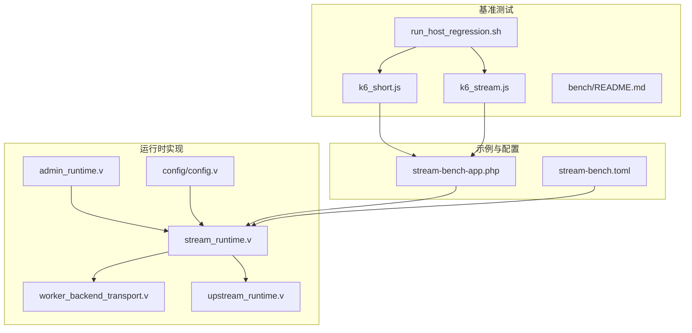
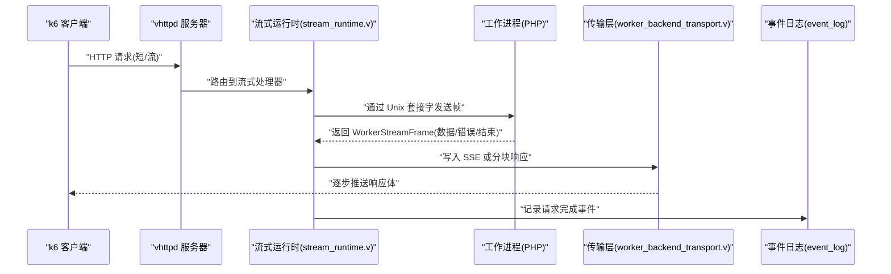
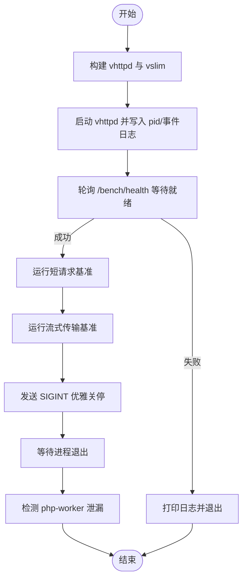
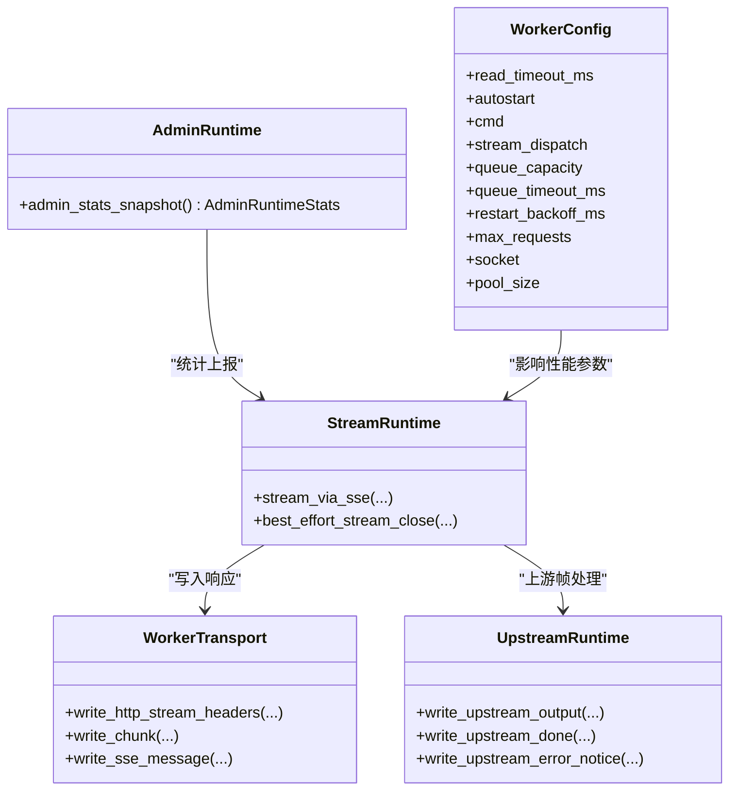
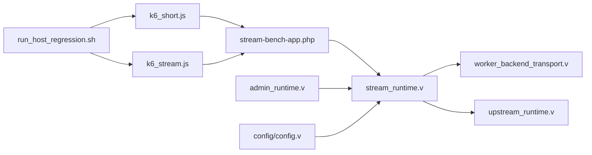

# 性能基准测试

<cite>
**本文引用的文件**
- [bench/README.md](file://bench/README.md)
- [bench/k6_short.js](file://bench/k6_short.js)
- [bench/k6_stream.js](file://bench/k6_stream.js)
- [bench/run_host_regression.sh](file://bench/run_host_regression.sh)
- [examples/stream-bench-app.php](file://examples/stream-bench-app.php)
- [examples/config/stream-bench.toml](file://examples/config/stream-bench.toml)
- [src/stream_runtime.v](file://src/stream_runtime.v)
- [src/worker_backend_transport.v](file://src/worker_backend_transport.v)
- [src/upstream_runtime.v](file://src/upstream_runtime.v)
- [src/admin_runtime.v](file://src/admin_runtime.v)
- [src/config/config.v](file://src/config/config.v)
</cite>

## 目录
1. [简介](#简介)
2. [项目结构](#项目结构)
3. [核心组件](#核心组件)
4. [架构总览](#架构总览)
5. [详细组件分析](#详细组件分析)
6. [依赖关系分析](#依赖关系分析)
7. [性能考量](#性能考量)
8. [故障排查指南](#故障排查指南)
9. [结论](#结论)
10. [附录](#附录)

## 简介
本指南面向 vhttpd 的性能基准测试与回归自动化，覆盖以下目标：
- 使用 k6 编写并执行短请求与流式传输两类基准脚本
- 基于统一变量约定与一键主机回归脚本，实现可重复的端到端验证
- 提供压力测试、负载测试与稳定性测试的策略与步骤
- 解释关键监控指标与事件日志，帮助定位瓶颈与优化方向
- 给出最佳实践与工具推荐

## 项目结构
与性能基准测试直接相关的核心目录与文件：
- bench：包含 k6 脚本、一键回归脚本与使用说明
- examples：包含确定性流式基准应用与配置样例
- src：包含流式传输、上游处理与管理统计等运行时代码

图表来源
- [bench/README.md](file://bench/README.md)
- [bench/k6_short.js](file://bench/k6_short.js)
- [bench/k6_stream.js](file://bench/k6_stream.js)
- [bench/run_host_regression.sh](file://bench/run_host_regression.sh)
- [examples/stream-bench-app.php](file://examples/stream-bench-app.php)
- [examples/config/stream-bench.toml](file://examples/config/stream-bench.toml)
- [src/stream_runtime.v](file://src/stream_runtime.v)
- [src/worker_backend_transport.v](file://src/worker_backend_transport.v)
- [src/upstream_runtime.v](file://src/upstream_runtime.v)
- [src/admin_runtime.v](file://src/admin_runtime.v)
- [src/config/config.v](file://src/config/config.v)

章节来源
- [bench/README.md](file://bench/README.md)
- [bench/k6_short.js](file://bench/k6_short.js)
- [bench/k6_stream.js](file://bench/k6_stream.js)
- [bench/run_host_regression.sh](file://bench/run_host_regression.sh)
- [examples/stream-bench-app.php](file://examples/stream-bench-app.php)
- [examples/config/stream-bench.toml](file://examples/config/stream-bench.toml)

## 核心组件
- k6 短请求脚本：用于评估短连接请求的吞吐与延迟阈值
- k6 流式传输脚本：用于评估 SSE 与文本流的传输质量与稳定性
- 主机回归脚本：一键构建、启动 vhttpd、运行两类基准、健康检查与进程清理
- 确定性流式基准应用：提供固定参数的流式输出，便于对比不同传输模式与参数组合
- 运行时实现：流式分发、SSE/分块写入、上游帧处理与统计上报

章节来源
- [bench/k6_short.js](file://bench/k6_short.js)
- [bench/k6_stream.js](file://bench/k6_stream.js)
- [bench/run_host_regression.sh](file://bench/run_host_regression.sh)
- [examples/stream-bench-app.php](file://examples/stream-bench-app.php)
- [src/stream_runtime.v](file://src/stream_runtime.v)
- [src/worker_backend_transport.v](file://src/worker_backend_transport.v)
- [src/upstream_runtime.v](file://src/upstream_runtime.v)
- [src/admin_runtime.v](file://src/admin_runtime.v)

## 架构总览
下图展示从 k6 到 vhttpd 的请求路径、流式分发与事件日志采集。

图表来源
- [bench/k6_short.js](file://bench/k6_short.js)
- [bench/k6_stream.js](file://bench/k6_stream.js)
- [src/stream_runtime.v](file://src/stream_runtime.v)
- [src/worker_backend_transport.v](file://src/worker_backend_transport.v)

## 详细组件分析

### k6 短请求脚本（k6_short.js）
- 场景与阶段：采用 ramping-vus 分阶段提升并发，包含上升、峰值、下降与优雅关停
- 阈值：失败率、P95/P99 延迟、检查通过率
- 可配置项：基础 URL 与基准路径，支持环境变量覆盖
- 典型用途：评估热身后的稳定吞吐与尾延迟

章节来源
- [bench/k6_short.js](file://bench/k6_short.js)

### k6 流式传输脚本（k6_stream.js）
- 场景与阶段：较低并发的 ramping-vus，更关注稳定性与完整性
- 模式：SSE 与 text 两种模式，分别校验事件头或非空体
- 参数：超时、标签（endpoint/profile/mode），便于聚合分析
- 典型用途：验证 SSE 事件格式与文本流完整性

章节来源
- [bench/k6_stream.js](file://bench/k6_stream.js)

### 主机回归脚本（run_host_regression.sh）
- 自动化流程：构建 vhttpd 与 vslim、启动服务、等待健康、运行两类基准、优雅关停、检测 worker 泄漏
- 关键变量：主机、端口、工作池大小、是否运行 k6、是否先构建、应用引导路径
- 健康检查：轮询 /bench/health，失败时打印最近日志与提示
- 清理与验证：发送 SIGINT 后等待退出，扫描残留 php-worker 进程

图表来源
- [bench/run_host_regression.sh](file://bench/run_host_regression.sh)

章节来源
- [bench/run_host_regression.sh](file://bench/run_host_regression.sh)

### 确定性流式基准应用（stream-bench-app.php）
- 路由：/bench/health（健康检查）、/bench/stream（SSE/text 流）
- 参数：mode（sse/text）、tokens（令牌数）、interval_ms（间隔 ms）、chunk_size（每块字节数）
- 行为：按参数生成固定数量的事件/文本块，支持可变间隔模拟真实场景
- 用途：作为流式传输的“金标准”，避免模型依赖导致的波动

章节来源
- [examples/stream-bench-app.php](file://examples/stream-bench-app.php)

### 流式运行时与传输实现
- 流式运行时（stream_runtime.v）：负责接管连接、写入 SSE 头、逐帧写入、结束与关闭、事件上报
- 传输层（worker_backend_transport.v）：实现 HTTP 分块写入与 SSE 消息写入
- 上游运行时（upstream_runtime.v）：将上游返回的片段转换为 SSE 或分块帧，并处理 done/error 通知
- 管理统计（admin_runtime.v）：提供运行时统计快照，包含 HTTP/Worker/Upstream 等指标
- 工作池配置（config/config.v）：读取 worker 配置，如队列容量、超时、重启退避等

图表来源
- [src/stream_runtime.v](file://src/stream_runtime.v)
- [src/worker_backend_transport.v](file://src/worker_backend_transport.v)
- [src/upstream_runtime.v](file://src/upstream_runtime.v)
- [src/admin_runtime.v](file://src/admin_runtime.v)
- [src/config/config.v](file://src/config/config.v)

章节来源
- [src/stream_runtime.v](file://src/stream_runtime.v)
- [src/worker_backend_transport.v](file://src/worker_backend_transport.v)
- [src/upstream_runtime.v](file://src/upstream_runtime.v)
- [src/admin_runtime.v](file://src/admin_runtime.v)
- [src/config/config.v](file://src/config/config.v)

### 配置样例（stream-bench.toml）
- 服务器监听地址与端口
- PID 文件与事件日志路径
- 工作进程自动启动、读超时、Unix 套接字与命令
- 管理端口与令牌
- 通过环境变量注入扩展路径

章节来源
- [examples/config/stream-bench.toml](file://examples/config/stream-bench.toml)

## 依赖关系分析
- k6 脚本依赖 vhttpd 提供的基准路径与健康接口
- 回归脚本依赖构建产物与 vslim 扩展加载 PHP 工作进程
- 流式传输依赖流式运行时与传输层实现，受工作池配置影响
- 管理统计为性能观测提供指标来源

图表来源
- [bench/k6_short.js](file://bench/k6_short.js)
- [bench/k6_stream.js](file://bench/k6_stream.js)
- [bench/run_host_regression.sh](file://bench/run_host_regression.sh)
- [examples/stream-bench-app.php](file://examples/stream-bench-app.php)
- [src/stream_runtime.v](file://src/stream_runtime.v)
- [src/worker_backend_transport.v](file://src/worker_backend_transport.v)
- [src/upstream_runtime.v](file://src/upstream_runtime.v)
- [src/admin_runtime.v](file://src/admin_runtime.v)
- [src/config/config.v](file://src/config/config.v)

章节来源
- [bench/README.md](file://bench/README.md)
- [bench/k6_short.js](file://bench/k6_short.js)
- [bench/k6_stream.js](file://bench/k6_stream.js)
- [bench/run_host_regression.sh](file://bench/run_host_regression.sh)
- [examples/stream-bench-app.php](file://examples/stream-bench-app.php)
- [src/stream_runtime.v](file://src/stream_runtime.v)
- [src/worker_backend_transport.v](file://src/worker_backend_transport.v)
- [src/upstream_runtime.v](file://src/upstream_runtime.v)
- [src/admin_runtime.v](file://src/admin_runtime.v)
- [src/config/config.v](file://src/config/config.v)

## 性能考量
- 短请求测试
  - 关注 P95/P99 延迟与失败率阈值，结合 ramping-vus 的阶段设计评估系统弹性
  - 建议在不同 CPU/内存资源下重复测试，观察尾延迟变化
- 流式传输测试
  - 通过改变 tokens 与 interval_ms，区分“传输开销隔离”与“可扩展性验证”
  - SSE 与 text 两种模式对比，评估头部与分块写入的差异
- 工作池与队列
  - 调整 worker-pool-size、queue_capacity、queue_timeout_ms、read_timeout_ms 等参数，观察对并发与延迟的影响
- 事件日志与统计
  - 结合 event_log 与管理统计快照，定位异常（如上游计划错误、队列拒绝、超时等）

章节来源
- [bench/README.md](file://bench/README.md)
- [bench/k6_short.js](file://bench/k6_short.js)
- [bench/k6_stream.js](file://bench/k6_stream.js)
- [src/config/config.v](file://src/config/config.v)
- [src/admin_runtime.v](file://src/admin_runtime.v)

## 故障排查指南
- k6 未安装
  - 回归脚本会检测并提示安装方式或跳过 k6 步骤
- 服务器未就绪
  - 回归脚本轮询健康接口，失败时打印最近日志；若出现 worker_start_failed，检查 Unix 套接字权限与工作进程路径
- 进程泄漏
  - 回归脚本在关停后扫描残留 php-worker 进程，发现则报错并列出进程信息
- 事件日志与统计
  - 查看 event_log 与管理统计快照，定位异常事件与错误计数

章节来源
- [bench/run_host_regression.sh](file://bench/run_host_regression.sh)
- [src/admin_runtime.v](file://src/admin_runtime.v)

## 结论
通过统一的变量约定、确定性的基准应用与一键回归脚本，vhttpd 的性能基准测试具备可重复性与可观测性。结合 k6 场景与运行时实现细节，可以系统地开展压力、负载与稳定性测试，并基于事件日志与管理统计进行瓶颈定位与优化。

## 附录

### 基准测试策略与场景矩阵
- 短请求测试
  - 目标：评估稳定吞吐与尾延迟
  - 方法：ramping-vus 阶段化并发，设置 P95/P99 延迟阈值
- 流式传输测试
  - 目标：评估 SSE 与文本流的稳定性与完整性
  - 方法：固定 tokens 变 interval（组 A：隔离传输开销），固定 interval 变 tokens（组 B：验证可扩展性）
- 回归测试
  - 目标：端到端验证，确保生命周期与资源清理正确
  - 方法：一键脚本自动构建、启动、运行基准、关停与泄漏检测

章节来源
- [bench/README.md](file://bench/README.md)
- [bench/k6_short.js](file://bench/k6_short.js)
- [bench/k6_stream.js](file://bench/k6_stream.js)
- [bench/run_host_regression.sh](file://bench/run_host_regression.sh)

### 监控指标与事件日志
- 事件日志（event_log）
  - 记录请求完成、流式错误、状态码与耗时等
- 管理统计快照（admin_stats_snapshot）
  - HTTP 请求总数/错误/超时/流总数
  - Worker 队列等待/拒绝/超时
  - Upstream 计划总数/错误
- 建议
  - 将事件日志与统计快照纳入 CI 归档，形成趋势对比

章节来源
- [src/admin_runtime.v](file://src/admin_runtime.v)
- [bench/run_host_regression.sh](file://bench/run_host_regression.sh)

### 最佳实践与工具推荐
- 工具
  - k6：官方推荐的负载测试工具
  - curl：健康检查与快速验证
- 变量约定
  - 使用 VHTTPD_* 前缀的统一变量名，兼容历史名称
- 参数调优
  - 从较小并发起步，逐步放大，观察 P95/P99 与错误率变化
  - 对比 SSE 与 text 模式，选择适合业务的传输方式
- 自动化
  - 在 CI 中集成一键回归脚本，定期执行以发现回归

章节来源
- [bench/README.md](file://bench/README.md)
- [bench/run_host_regression.sh](file://bench/run_host_regression.sh)