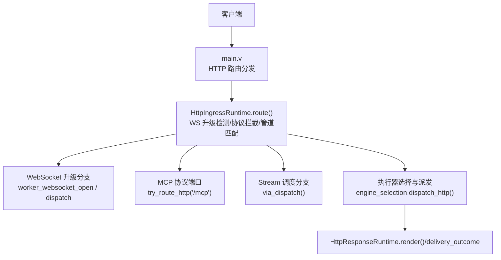
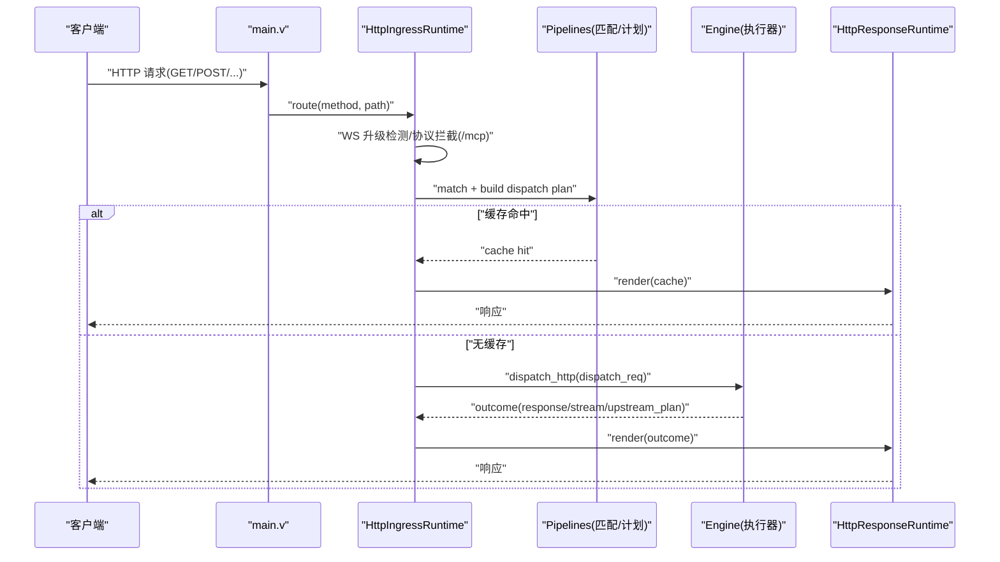
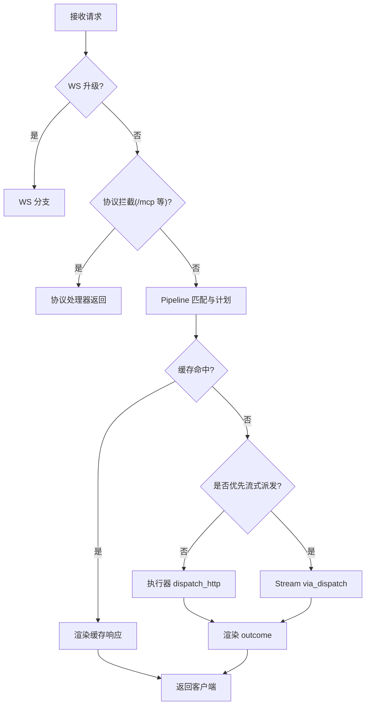
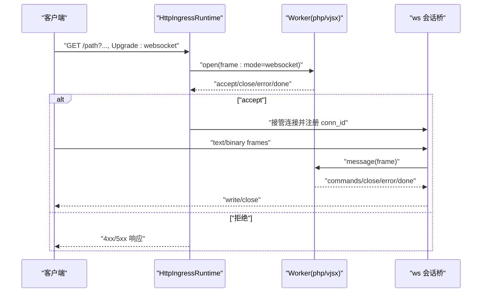
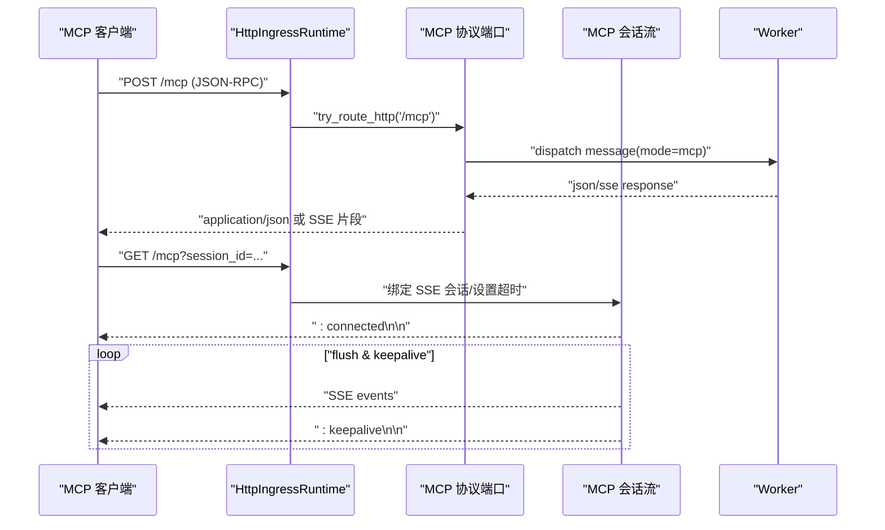
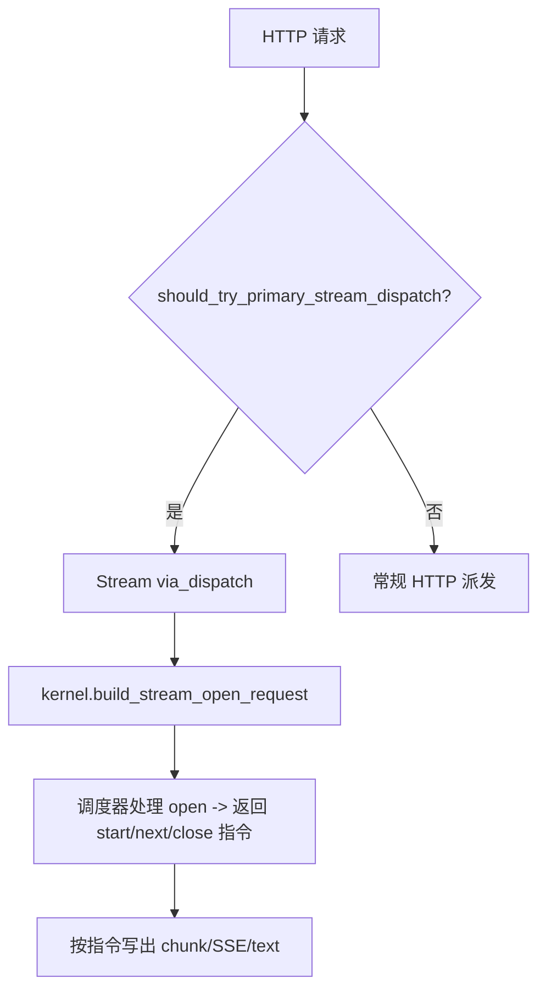
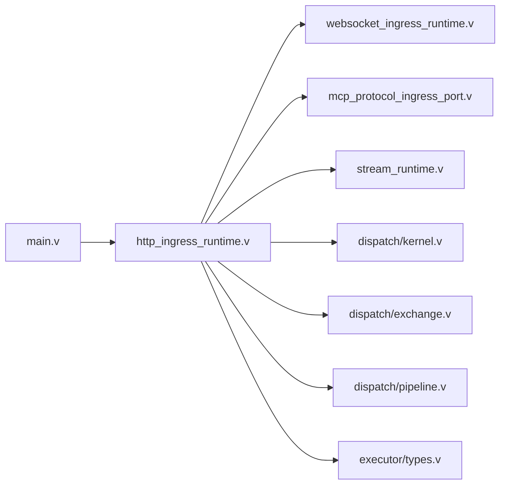

# 数据流设计

<cite>
**本文引用的文件**   
- [src/main.v](file://src/main.v)
- [src/http_ingress_runtime.v](file://src/http_ingress_runtime.v)
- [src/websocket_ingress_runtime.v](file://src/websocket_ingress_runtime.v)
- [src/mcp_protocol_ingress_port.v](file://src/mcp_protocol_ingress_port.v)
- [src/mcp_session_stream_runtime.v](file://src/mcp_session_stream_runtime.v)
- [src/stream_runtime.v](file://src/stream_runtime.v)
- [src/dispatch/kernel.v](file://src/dispatch/kernel.v)
- [src/dispatch/exchange.v](file://src/dispatch/exchange.v)
- [src/dispatch/pipeline.v](file://src/dispatch/pipeline.v)
- [src/executor/types.v](file://src/executor/types.v)
</cite>

## 目录
1. [引言](#引言)
2. [项目结构](#项目结构)
3. [核心组件](#核心组件)
4. [架构总览](#架构总览)
5. [详细组件分析](#详细组件分析)
6. [依赖关系分析](#依赖关系分析)
7. [性能与背压](#性能与背压)
8. [故障排查指南](#故障排查指南)
9. [结论](#结论)
10. [附录](#附录)

## 引言
本文件聚焦 vhttpd 的数据流设计与处理链路，覆盖从请求进入到响应返回的完整流程：协议解析、请求转换、管道匹配与执行、执行器调用、响应组装与输出。同时对比 HTTP、WebSocket、MCP、Stream 四类请求的数据流差异与策略，解释上下文传递（request_id/trace_id）、会话状态管理、错误传播路径，并给出背压控制、流量管理与性能优化建议，辅以数据流图与时序图，帮助读者快速定位关键路径与问题点。

## 项目结构
vhttpd 以 veb 为 HTTP 事实来源，自身保持薄层，专注于传输、编排、流式与可观测性。HTTP 入口统一由 main 路由到 HttpIngressRuntime；WebSocket 升级在 HTTP 入口阶段识别并分流；MCP 通过专用协议端口拦截 /mcp；Stream 作为“调度型”长连接模式，由 StreamRuntime 驱动 open/next/close 生命周期。

图表来源
- [src/main.v:83-116](file://src/main.v#L83-L116)
- [src/http_ingress_runtime.v:31-139](file://src/http_ingress_runtime.v#L31-L139)
- [src/websocket_ingress_runtime.v:279-411](file://src/websocket_ingress_runtime.v#L279-L411)
- [src/mcp_protocol_ingress_port.v:7-17](file://src/mcp_protocol_ingress_port.v#L7-L17)
- [src/stream_runtime.v:30-47](file://src/stream_runtime.v#L30-L47)

章节来源
- [src/main.v:1-117](file://src/main.v#L1-L117)
- [src/http_ingress_runtime.v:1-146](file://src/http_ingress_runtime.v#L1-L146)

## 核心组件
- 入口与上下文
  - main.v 提供 Context 组合 ve b.Context 与 request_id 中间件上下文，统一 resolve_request_id/resolve_trace_id，并通过 veb 中间件注册所有 HTTP 方法路由。
- HTTP 入口与管道
  - http_ingress_runtime.v 负责 WebSocket 升级检测、协议拦截（如 MCP）、目录重定向、Pipeline 匹配、缓存命中、动态引擎选择、流式派发与最终渲染。
- WebSocket 入口
  - websocket_ingress_runtime.v 实现 WS 握手、消息转发、关闭语义、以及 phase-2 的 dispatch 模式（open 事件先派发到 worker，再接管连接）。
- MCP 协议端口
  - mcp_protocol_ingress_port.v 将 /mcp 的 GET/POST/DELETE 路由到 MCP 运行时；mcp_session_stream_runtime.v 维护 SSE 会话与 keepalive。
- Stream 调度
  - stream_runtime.v 定义 StreamRuntimeContext 与 open/next/close 调度接口，供上层通过 via_dispatch 进入。
- 分发内核与交换模型
  - dispatch/kernel.v 构造 stream/mcp/websocket_upstream/websocket_dispatch 等内核派发请求；dispatch/exchange.v 定义 Exchange、TransformAction、Capabilities 等通用契约；dispatch/pipeline.v 定义 PipelineDescriptor/TerminalDescriptor 及能力校验。
- 执行器类型
  - executor/types.v 定义 HTTP 逻辑派发结果（response/stream/upstream_plan）、WebSocket 会话打开结果、以及各类统计与上下文封装。

章节来源
- [src/main.v:10-73](file://src/main.v#L10-L73)
- [src/http_ingress_runtime.v:31-139](file://src/http_ingress_runtime.v#L31-L139)
- [src/websocket_ingress_runtime.v:279-411](file://src/websocket_ingress_runtime.v#L279-L411)
- [src/mcp_protocol_ingress_port.v:7-17](file://src/mcp_protocol_ingress_port.v#L7-L17)
- [src/mcp_session_stream_runtime.v:1-86](file://src/mcp_session_stream_runtime.v#L1-L86)
- [src/stream_runtime.v:1-48](file://src/stream_runtime.v#L1-L48)
- [src/dispatch/kernel.v:1-151](file://src/dispatch/kernel.v#L1-L151)
- [src/dispatch/exchange.v:1-160](file://src/dispatch/exchange.v#L1-L160)
- [src/dispatch/pipeline.v:1-119](file://src/dispatch/pipeline.v#L1-L119)
- [src/executor/types.v:1-449](file://src/executor/types.v#L1-L449)

## 架构总览
下图展示一次典型 HTTP 请求在 vhttpd 中的端到端数据流：从入口到管道匹配、执行器派发、响应渲染与回写。

图表来源
- [src/main.v:83-116](file://src/main.v#L83-L116)
- [src/http_ingress_runtime.v:31-139](file://src/http_ingress_runtime.v#L31-L139)

## 详细组件分析

### HTTP 请求处理链路
- 入口路由：main.v 将所有 HTTP 方法统一路由到 HttpIngressRuntime.route。
- 协议分流：
  - WebSocket 升级：is_websocket_upgrade 判断后走 WS 分支。
  - 协议拦截：app.protocols.try_route_http 优先尝试（例如 /mcp）。
- 管道匹配与计划：
  - 基于 normalized_target、query、headers、body 构建匹配请求，得到 pipeline 与 dispatch plan。
- 缓存与短路：
  - 若命中响应缓存，直接 render 返回。
- 执行器选择与派发：
  - 根据 dispatch plan 选择 engine，必要时先尝试 stream via_dispatch。
  - 否则构造 HttpLogicDispatchRequest 并调用 engine.dispatch_http。
- 响应渲染：
  - HttpResponseRuntime.render/delivery_outcome 统一写入状态码、头部与 body，并携带 trace/request 观察元数据。

图表来源
- [src/http_ingress_runtime.v:31-139](file://src/http_ingress_runtime.v#L31-L139)

章节来源
- [src/main.v:83-116](file://src/main.v#L83-L116)
- [src/http_ingress_runtime.v:31-139](file://src/http_ingress_runtime.v#L31-L139)

### WebSocket 数据流（Phase 1 与 Phase 2）
- Phase 1（直连 worker）：
  - 入口检测到 WS 升级后，建立与 worker 的 Unix 连接，发送 open 帧，等待 accept/close/error/done。
  - 成功后接管 TCP 连接，双向转发文本/二进制帧，并在 close 时同步通知 worker。
- Phase 2（dispatch 模式）：
  - 先向 worker 发送 open 事件，worker 返回 commands（如 join/broadcast/send），然后接管连接并执行命令。
  - 后续消息同样以 frame 形式派发至 worker，worker 返回 commands 或 close/error/done。

图表来源
- [src/websocket_ingress_runtime.v:279-411](file://src/websocket_ingress_runtime.v#L279-L411)
- [src/websocket_ingress_runtime.v:413-481](file://src/websocket_ingress_runtime.v#L413-L481)

章节来源
- [src/websocket_ingress_runtime.v:279-411](file://src/websocket_ingress_runtime.v#L279-L411)
- [src/websocket_ingress_runtime.v:413-481](file://src/websocket_ingress_runtime.v#L413-L481)

### MCP 数据流（Session + SSE）
- POST /mcp：
  - 校验 Origin、Protocol-Version、JSON-RPC Body，构造 WorkerMcpDispatchRequest 派发至 worker。
  - 根据 worker 返回决定 JSON 响应或 SSE 模式。
- GET /mcp：
  - 绑定 SSE 会话，设置无限读写超时，循环 flush 队列并周期性 keepalive。
- DELETE /mcp：
  - 终止指定 Mcp-Session-Id 的会话。

图表来源
- [src/mcp_protocol_ingress_port.v:7-17](file://src/mcp_protocol_ingress_port.v#L7-L17)
- [src/mcp_session_stream_runtime.v:1-86](file://src/mcp_session_stream_runtime.v#L1-L86)

章节来源
- [src/mcp_protocol_ingress_port.v:7-17](file://src/mcp_protocol_ingress_port.v#L7-L17)
- [src/mcp_session_stream_runtime.v:1-86](file://src/mcp_session_stream_runtime.v#L1-L86)

### Stream 数据流（调度型 open/next/close）
- 当引擎支持且命中 stream 策略时，HttpIngressRuntime 调用 via_dispatch，进入 StreamRuntimeContext。
- 通过 kernel 构造 StreamDispatchRequest(open/next/close)，交由上层调度器（如 PHP worker）处理。
- 适合需要 vhttpd 拥有下游连接、而 worker 仅处理业务片段的场景。

图表来源
- [src/http_ingress_runtime.v:125-131](file://src/http_ingress_runtime.v#L125-L131)
- [src/stream_runtime.v:30-47](file://src/stream_runtime.v#L30-L47)
- [src/dispatch/kernel.v:30-77](file://src/dispatch/kernel.v#L30-L77)

章节来源
- [src/http_ingress_runtime.v:125-131](file://src/http_ingress_runtime.v#L125-L131)
- [src/stream_runtime.v:30-47](file://src/stream_runtime.v#L30-L47)
- [src/dispatch/kernel.v:30-77](file://src/dispatch/kernel.v#L30-L77)

### 上下文传递与会话状态
- 上下文标识：
  - request_id/trace_id 在入口处解析（优先 query/header/veb.request_id），贯穿整个处理链。
- 会话状态（WebSocket/MCP）：
  - WebSocket：conn_id 与 rooms/presence 在 runtime 中维护，消息派发时附带 presence 信息。
  - MCP：session_id 与协议版本、SSE 连接绑定，队列 flush 与 keepalive 由会话流管理。
- 错误传播：
  - 后端错误经 transport.classify_worker_backend_error 分类为 status+error_class，统一通过 delivery_outcome 渲染。

章节来源
- [src/main.v:40-73](file://src/main.v#L40-L73)
- [src/websocket_ingress_runtime.v:103-221](file://src/websocket_ingress_runtime.v#L103-L221)
- [src/mcp_session_stream_runtime.v:56-86](file://src/mcp_session_stream_runtime.v#L56-L86)
- [src/dispatch/kernel.v:22-28](file://src/dispatch/kernel.v#L22-L28)

## 依赖关系分析
- 模块耦合
  - main.v 依赖 HttpIngressRuntime 进行实际路由；HttpIngressRuntime 依赖 pipelines、engines、HttpResponseRuntime。
  - WebSocket 入口依赖 ws 模块与 worker 帧编解码；MCP 入口依赖 mcp 协议端口与会话流。
  - Stream 依赖 dispatch.kernel 构造派发请求。
- 外部依赖
  - 复用 veb 的 Context、Request、Cookie、SSE 等能力；底层使用 net/http、net/unix、net.websocket。

图表来源
- [src/main.v:83-116](file://src/main.v#L83-L116)
- [src/http_ingress_runtime.v:31-139](file://src/http_ingress_runtime.v#L31-L139)
- [src/websocket_ingress_runtime.v:279-411](file://src/websocket_ingress_runtime.v#L279-L411)
- [src/mcp_protocol_ingress_port.v:7-17](file://src/mcp_protocol_ingress_port.v#L7-L17)
- [src/stream_runtime.v:30-47](file://src/stream_runtime.v#L30-L47)
- [src/dispatch/kernel.v:1-151](file://src/dispatch/kernel.v#L1-L151)
- [src/dispatch/exchange.v:1-160](file://src/dispatch/exchange.v#L1-L160)
- [src/dispatch/pipeline.v:1-119](file://src/dispatch/pipeline.v#L1-L119)
- [src/executor/types.v:1-449](file://src/executor/types.v#L1-L449)

章节来源
- [src/main.v:83-116](file://src/main.v#L83-L116)
- [src/http_ingress_runtime.v:31-139](file://src/http_ingress_runtime.v#L31-L139)

## 性能与背压
- 背压控制
  - WebSocket：消息转发采用阻塞写 + 错误分类，失败时主动关闭连接并清理资源，避免堆积。
  - Stream：调度型模式由上层调度器控制 next/close，vhttpd 侧只负责 IO 转发与超时控制。
  - MCP：SSE 会话带 keepalive 与 flush 循环，避免长时间空闲占用。
- 流量管理
  - 管道能力校验（capabilities_satisfy）确保 ingress 与 egress 能力匹配，减少无效派发。
  - 响应缓存命中短路，降低重复计算与后端压力。
- 性能优化建议
  - 合理配置 worker 池大小与队列容量，避免排队超时。
  - 对热点静态资源启用缓存策略，减少动态派发。
  - 针对长连接（WS/MCP）设置合适的超时与心跳间隔，及时回收空闲连接。
  - 利用 trace_id/request_id 全链路追踪，定位慢路径与瓶颈。

[本节为通用指导，不直接分析具体文件]

## 故障排查指南
- 常见问题定位
  - 426 Upgrade Required：非 WS 升级请求误入 WS 分支。
  - 403 Forbidden Origin：MCP/WS 未通过 Origin 校验。
  - 502 Bad Gateway：worker 不可用或握手失败。
  - 404 Not Found：无逻辑执行器或路由未命中。
- 日志与追踪
  - 使用 resolve_request_id/resolve_trace_id 生成的标识，结合 event log 与运行时 trace 文件定位问题。
  - 关注 error_class 字段，便于区分上游/后端/传输错误。
- 调试技巧
  - 开启 debug 级别日志，观察 pipeline 匹配与引擎选择。
  - 检查 WS 帧收发与 MCP SSE 队列 flush 情况。
  - 验证缓存命中路径，确认是否被短路。

章节来源
- [src/websocket_ingress_runtime.v:279-339](file://src/websocket_ingress_runtime.v#L279-L339)
- [src/mcp_session_stream_runtime.v:15-54](file://src/mcp_session_stream_runtime.v#L15-L54)
- [src/http_ingress_runtime.v:42-50](file://src/http_ingress_runtime.v#L42-L50)
- [src/main.v:25-38](file://src/main.v#L25-L38)

## 结论
vhttpd 以 veb 为事实来源，围绕 HTTP/WebSocket/Stream/MCP 构建了统一的协议入口与管道化分发体系。通过 Exchange/Pipeline/Capabilities 抽象，实现了跨协议的统一处理能力；借助 worker 编排与流式调度，兼顾了短请求与长连接场景。配合完善的上下文传递、错误分类与可观测性，形成了稳定高效的数据流闭环。

[本节为总结性内容，不直接分析具体文件]

## 附录
- 关键数据结构速览
  - Exchange：承载身份、种类、负载与元数据，贯穿管道。
  - TransformAction：continue/respond/reject/forward/fanout/drop。
  - Capabilities：描述 ingress/egress 的能力集合，用于匹配校验。
  - HttpLogicDispatchOutcome：response/stream/upstream_plan 三种结果形态。

章节来源
- [src/dispatch/exchange.v:78-160](file://src/dispatch/exchange.v#L78-L160)
- [src/dispatch/pipeline.v:3-55](file://src/dispatch/pipeline.v#L3-L55)
- [src/executor/types.v:15-42](file://src/executor/types.v#L15-L42)