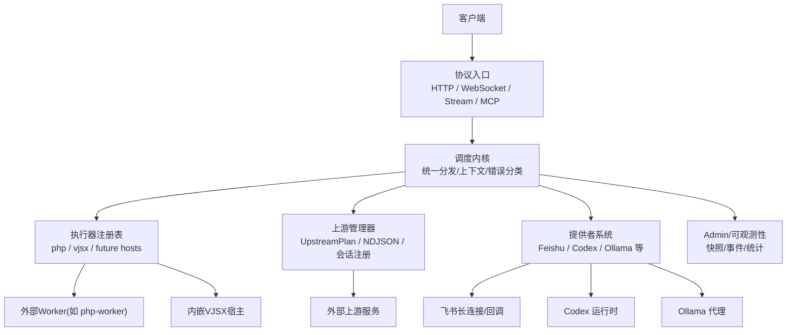
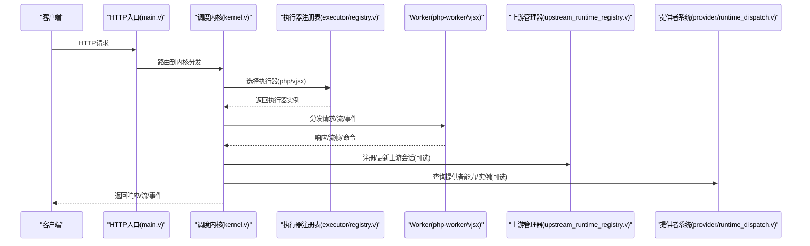
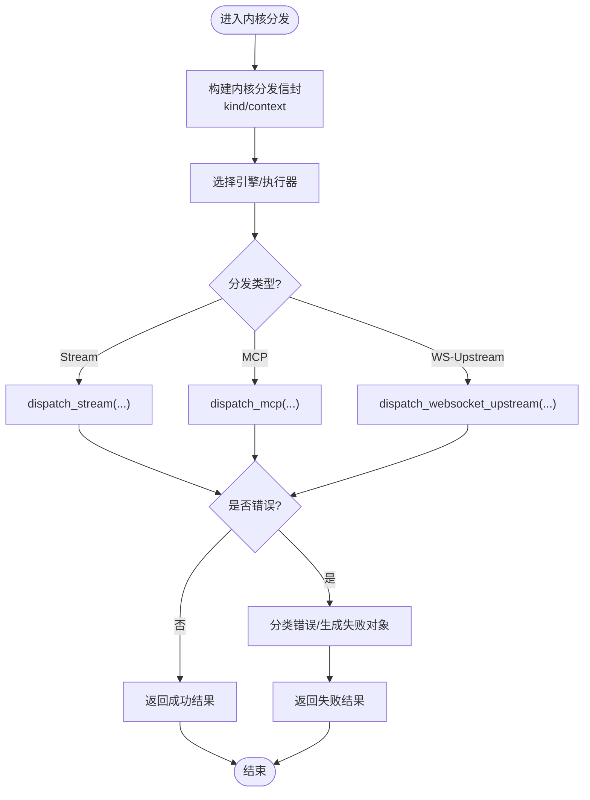
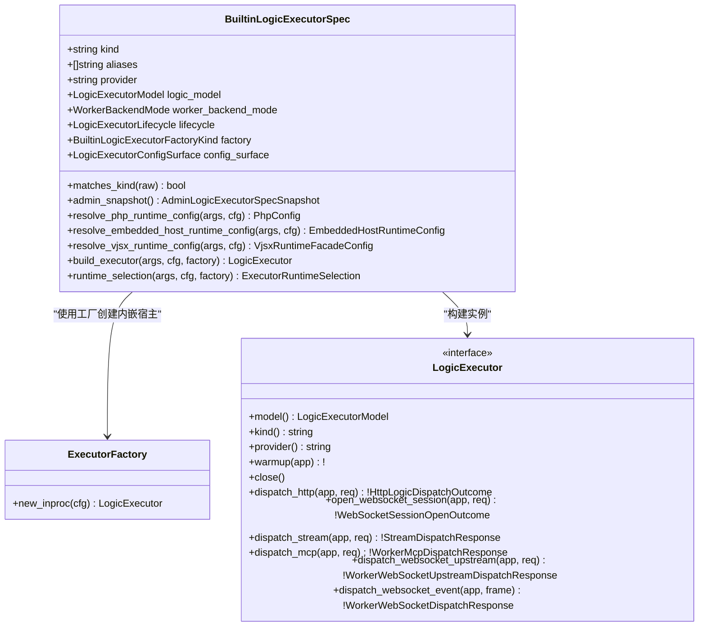
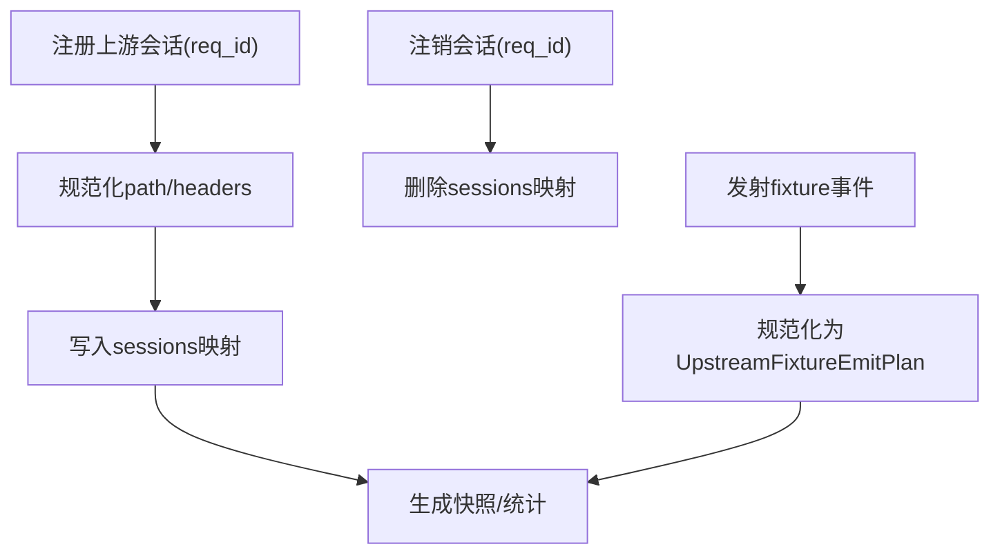
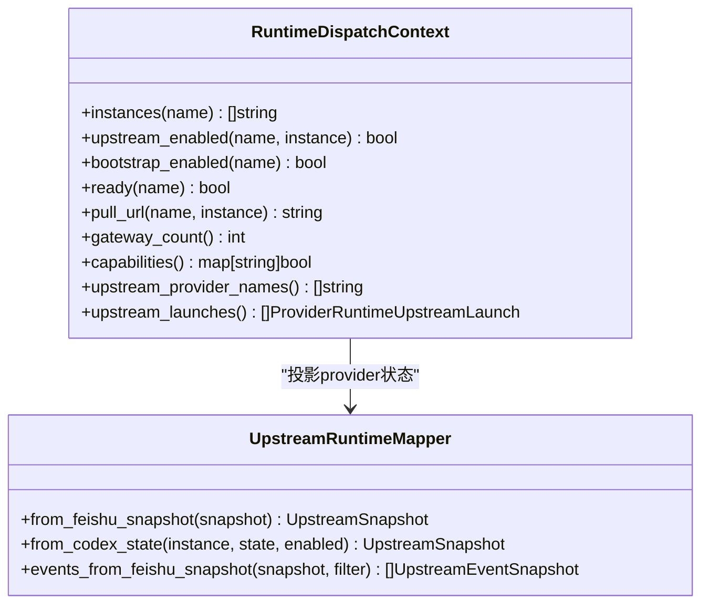
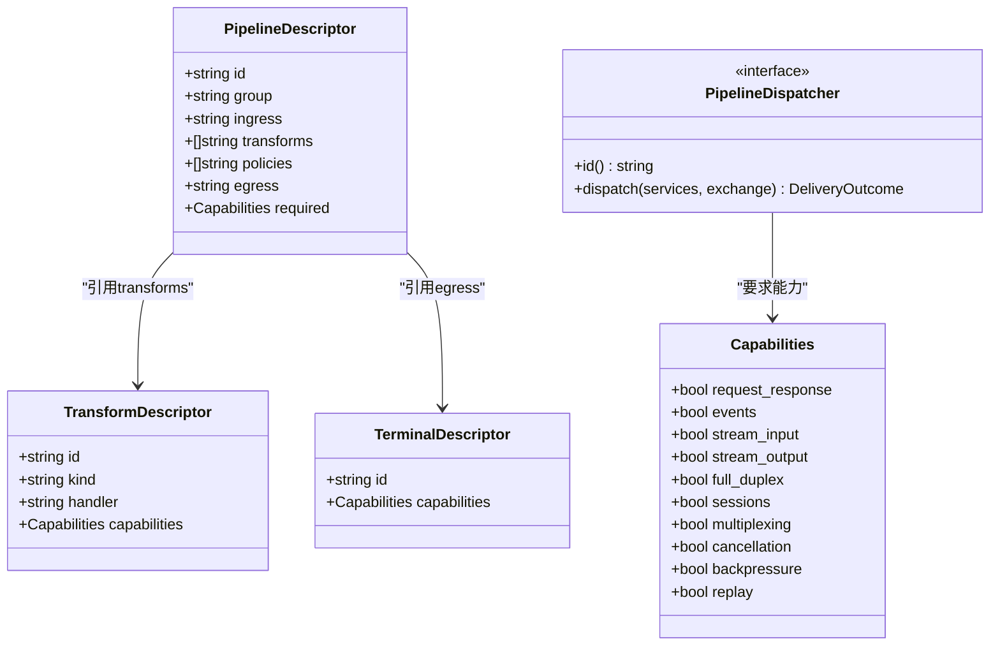
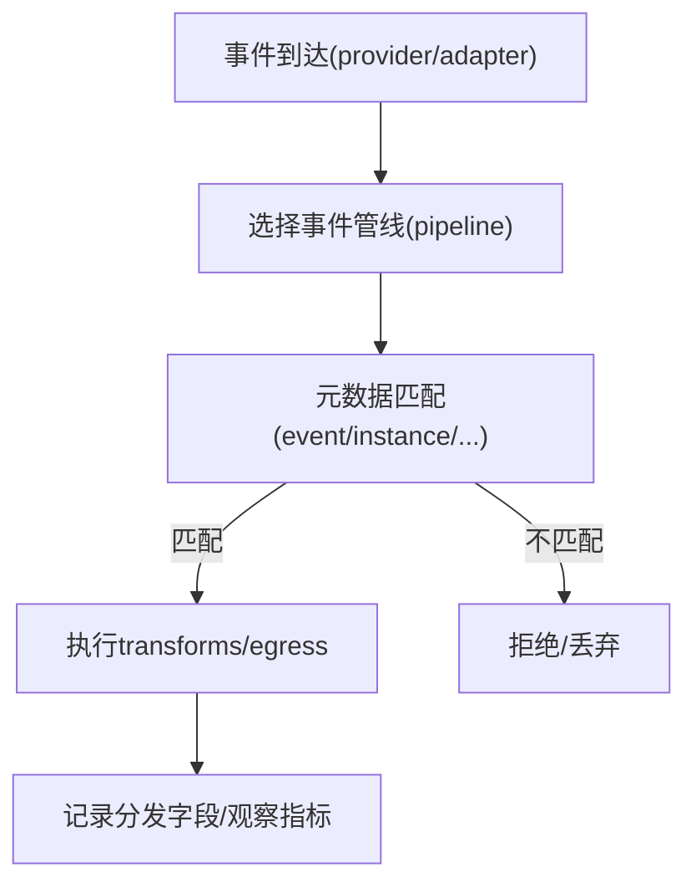
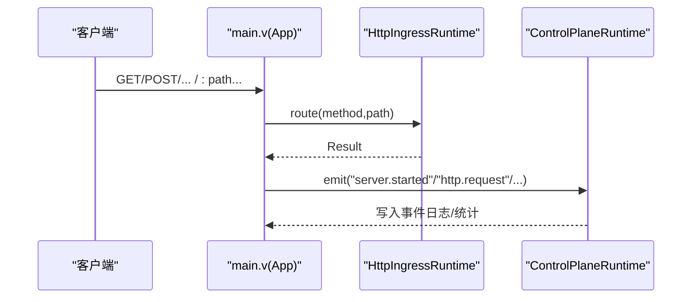
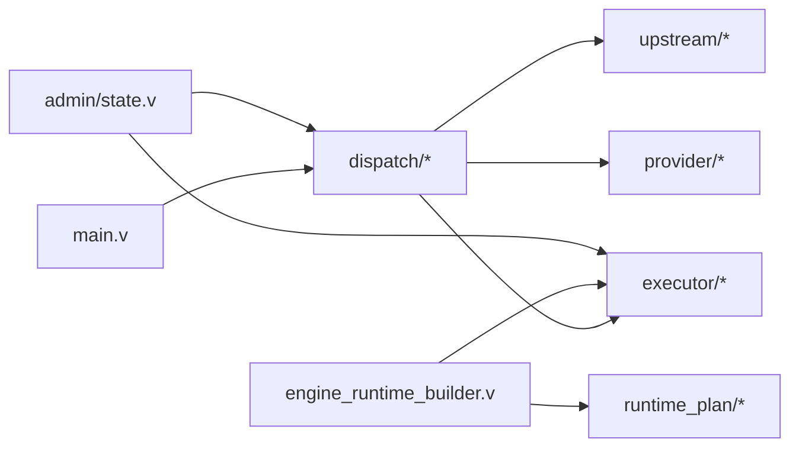

# 架构设计详解

<cite>
**本文引用的文件列表**
- [README.md](file://README.md)
- [src/main.v](file://src/main.v)
- [src/dispatch/kernel.v](file://src/dispatch/kernel.v)
- [src/executor/registry.v](file://src/executor/registry.v)
- [src/provider/runtime_dispatch.v](file://src/provider/runtime_dispatch.v)
- [src/upstream/types.v](file://src/upstream/types.v)
- [src/upstream_runtime_registry.v](file://src/upstream_runtime_registry.v)
- [src/ws/types.v](file://src/ws/types.v)
- [src/admin/state.v](file://src/admin/state.v)
- [src/app_composition_runtime.v](file://src/app_composition_runtime.v)
- [src/engine_runtime_builder.v](file://src/engine_runtime_builder.v)
- [src/dispatch/pipeline.v](file://src/dispatch/pipeline.v)
- [src/generic_event_runtime.v](file://src/generic_event_runtime.v)
- [src/kernel_dispatch.v](file://src/kernel_dispatch.v)
- [src/upstream/transport/worker_protocol.v](file://src/upstream/transport/worker_protocol.v)
- [docs/PROTOCOL_PIPELINE_RELAY_ARCHITECTURE.md](file://docs/PROTOCOL_PIPELINE_RELAY_ARCHITECTURE.md)
- [docs/CONFIGURATION_MODEL_V2.md](file://docs/CONFIGURATION_MODEL_V2.md)
- [docs/ARCHITECTURE_REFACTOR_BASELINE.md](file://docs/ARCHITECTURE_REFACTOR_BASELINE.md)
</cite>

## 目录
1. [引言](#引言)
2. [项目结构](#项目结构)
3. [核心组件](#核心组件)
4. [架构总览](#架构总览)
5. [详细组件分析](#详细组件分析)
6. [依赖关系分析](#依赖关系分析)
7. [性能与可扩展性](#性能与可扩展性)
8. [故障排查指南](#故障排查指南)
9. [结论](#结论)
10. [附录](#附录)

## 引言
本文件深入解析 vhttpd 的核心架构设计，围绕执行器模式、管道处理模型与事件驱动架构三大理念展开。文档将说明调度内核、执行器注册表、上游管理器、提供者系统等关键组件的职责与交互，并给出从请求进入到响应返回的完整数据流与控制流路径。同时提供架构图与交互图，帮助开发者理解内部工作机制与设计决策。

## 项目结构
vhttpd 以“协议入口 + 统一调度内核 + 可插拔执行器 + 运行时能力”为组织原则：
- 协议入口层：HTTP/WebSocket/Stream/MCP 等协议接入与标准化
- 调度内核：统一的分发、上下文构建、错误分类与生命周期管理
- 执行器系统：PHP worker、vjsx 内嵌宿主等逻辑执行器
- 运行时能力：上游流式执行、外部 worker 编排、admin/observability、MCP 适配等

图表来源
- [README.md:84-126](file://README.md#L84-L126)
- [src/main.v:83-116](file://src/main.v#L83-L116)
- [src/dispatch/kernel.v:1-151](file://src/dispatch/kernel.v#L1-L151)
- [src/executor/registry.v:65-127](file://src/executor/registry.v#L65-L127)
- [src/upstream_runtime_registry.v:47-90](file://src/upstream_runtime_registry.v#L47-L90)
- [src/provider/runtime_dispatch.v:42-153](file://src/provider/runtime_dispatch.v#L42-L153)

章节来源
- [README.md:1-126](file://README.md#L1-L126)
- [src/main.v:1-117](file://src/main.v#L1-L117)

## 核心组件
- 调度内核（Kernel）
  - 职责：统一接收来自各协议的请求/事件，构建内核分发信封，选择执行器并调用引擎进行分发；负责错误分类、失败映射与观察指标上报。
  - 关键实现：内核分发封装、流式/MCP/WebSocket 上游事件构造、传输失败分类。
- 执行器注册表（Executor Registry）
  - 职责：声明内置执行器规格（kind/aliases/provider/logic_model/worker_backend_mode/lifecycle/factory），按配置与 CLI 覆盖解析具体执行器实例，支持 PHP worker、PHP-CGI、vjsx 内嵌等。
  - 关键实现：规格枚举、工厂函数指针注入、运行时选择与构建。
- 上游管理器（Upstream Manager）
  - 职责：维护上游计划与会话注册，暴露最近事件与活动快照，支持测试夹具发射事件。
  - 关键实现：会话注册/注销、事件规范化与快照导出。
- 提供者系统（Provider System）
  - 职责：聚合多提供者（Feishu/Codex/Ollama）的能力、实例、启动与状态投影，提供网关计数、能力探测、事件投影与指标汇总。
  - 关键实现：RuntimeDispatchContext、upstream_enabled/capabilities/snapshot/metrics。
- 管道与交换（Pipeline & Exchange）
  - 职责：定义管道描述符、变换器描述符、终端描述符及能力校验；在运行时将入站适配器产出标准化 Exchange，经 transforms 后由 egress 输出。
  - 关键实现：能力满足判定、缺失能力诊断、PipelineDispatcher 接口。
- 事件驱动（Event-driven）
  - 职责：基于 RuntimePlan 的事件管线匹配与分发，支持 provider ingress 与 adapter ingress 两类事件源。
  - 关键实现：事件管线选择、元数据匹配、字段组装。

章节来源
- [src/dispatch/kernel.v:1-151](file://src/dispatch/kernel.v#L1-L151)
- [src/executor/registry.v:1-387](file://src/executor/registry.v#L1-L387)
- [src/upstream/types.v:166-221](file://src/upstream/types.v#L166-L221)
- [src/upstream_runtime_registry.v:47-90](file://src/upstream_runtime_registry.v#L47-L90)
- [src/provider/runtime_dispatch.v:1-271](file://src/provider/runtime_dispatch.v#L1-L271)
- [src/dispatch/pipeline.v:1-119](file://src/dispatch/pipeline.v#L1-L119)
- [src/generic_event_runtime.v:132-175](file://src/generic_event_runtime.v#L132-L175)

## 架构总览
vhttpd 采用“协议对等 + 统一交换 + 管道化 + 事件驱动”的总体架构：
- 协议对等：HTTP、WebSocket、Stream、MCP 作为平等入口，通过适配器转换为标准 Exchange。
- 统一交换：Exchange 携带通用身份与生命周期字段，承载协议特定负载。
- 管道化：Ingress -> Transforms -> Egress 的流水线，具备能力校验与策略控制。
- 事件驱动：基于 RuntimePlan 的事件管线，支持 provider ingress 与 adapter ingress。

图表来源
- [src/main.v:83-116](file://src/main.v#L83-L116)
- [src/dispatch/kernel.v:1-151](file://src/dispatch/kernel.v#L1-L151)
- [src/executor/registry.v:65-127](file://src/executor/registry.v#L65-L127)
- [src/upstream_runtime_registry.v:47-90](file://src/upstream_runtime_registry.v#L47-L90)
- [src/provider/runtime_dispatch.v:42-153](file://src/provider/runtime_dispatch.v#L42-L153)

## 详细组件分析

### 调度内核（Kernel Dispatch）
- 职责
  - 构建内核分发信封（stream/mcp/websocket_upstream），封装上下文与执行器提供者信息。
  - 调用引擎分发方法（dispatch_stream/dispatch_mcp）。
  - 将传输层错误分类为内核失败类型，便于上层统一处理。
- 关键流程
  - 流式分发：open/next/close 三阶段，携带 trace_id/request_id 与状态。
  - MCP 分发：封装 JSON-RPC 消息、会话与能力信息。
  - WebSocket 上游事件：封装 provider/instance/event_type/target 等元数据。
- 错误处理
  - 将 transport.StreamDispatchResponse.event='error' 映射为内核失败对象，包含 error_class。
  - 统一使用 classify_worker_backend_error 进行分类。

图表来源
- [src/kernel_dispatch.v:1-37](file://src/kernel_dispatch.v#L1-L37)
- [src/dispatch/kernel.v:1-151](file://src/dispatch/kernel.v#L1-L151)

章节来源
- [src/kernel_dispatch.v:1-37](file://src/kernel_dispatch.v#L1-L37)
- [src/dispatch/kernel.v:1-151](file://src/dispatch/kernel.v#L1-L151)

### 执行器注册表（Executor Registry）
- 职责
  - 声明内置执行器规格（none/php/php-cgi/vjsx），包括 kind、aliases、provider、logic_model、worker_backend_mode、lifecycle、factory、config_surface。
  - 根据配置与 CLI 覆盖解析具体执行器实例，支持工厂函数指针注入以打破循环依赖。
  - 提供运行时选择（runtime_selection）与构建（build_executor）。
- 关键特性
  - 配置面（config_surface）：不同执行器的 CLI 标志映射。
  - 构建命令与环境：针对 PHP worker 与 PHP-CGI 的命令拼接与环境变量注入。
  - 内嵌宿主（vjsx）：通过 ExecutorFactory.new_inproc 创建。

图表来源
- [src/executor/registry.v:1-387](file://src/executor/registry.v#L1-L387)
- [src/executor/logic_executor_interfaces.v:1-50](file://src/executor/logic_executor_interfaces.v#L1-L50)

章节来源
- [src/executor/registry.v:1-387](file://src/executor/registry.v#L1-L387)
- [src/executor/logic_executor_interfaces.v:1-50](file://src/executor/logic_executor_interfaces.v#L1-L50)

### 上游管理器（Upstream Manager）
- 职责
  - 注册上游计划与会话（req_id -> session），记录 method/path/codec/stream_type/source 等元数据。
  - 注销会话与错误计数，暴露最近事件快照与活动统计。
  - 支持测试夹具发射事件，用于无真实上游的集成验证。
- 数据结构
  - UpstreamFixtureEmitRequest/Plan：规范化 fixture 事件，生成 UpstreamEventSnapshot。
  - UpstreamEventSnapshot/UpstreamEventListSnapshot：事件快照与列表视图。
  - FixtureRuntime：连接/发送/错误/近期事件等运行态统计。

图表来源
- [src/upstream_runtime_registry.v:47-90](file://src/upstream_runtime_registry.v#L47-L90)
- [src/upstream/types.v:166-221](file://src/upstream/types.v#L166-L221)
- [src/ws/types.v:261-309](file://src/ws/types.v#L261-L309)

章节来源
- [src/upstream_runtime_registry.v:47-90](file://src/upstream_runtime_registry.v#L47-L90)
- [src/upstream/types.v:166-221](file://src/upstream/types.v#L166-L221)
- [src/ws/types.v:261-309](file://src/ws/types.v#L261-L309)

### 提供者系统（Provider System）
- 职责
  - 提供 RuntimeDispatchContext：实例枚举、启用检查、就绪状态、拉取 URL 等。
  - 计算网关数量、能力集合、上游提供者名称与启动清单。
  - 将 Feishu/Codex 的运行态投影为统一的 upstream.UpstreamSnapshot 与事件快照。
  - 汇总 ProviderRuntimeMetrics（连接尝试/成功、收到帧数、已确认事件、发送消息/错误等）。
- 关键点
  - 默认实例名（main）与 provider 名称（feishu/codex/ollama/db）。
  - 事件投影：将 provider 内部事件结构映射为标准 UpstreamEventSnapshot。

图表来源
- [src/provider/runtime_dispatch.v:1-271](file://src/provider/runtime_dispatch.v#L1-L271)

章节来源
- [src/provider/runtime_dispatch.v:1-271](file://src/provider/runtime_dispatch.v#L1-L271)

### 管道与交换（Pipeline & Exchange）
- 职责
  - 定义 PipelineDescriptor/TransformDescriptor/TerminalDescriptor，明确入站、变换、出站与所需能力。
  - 提供能力满足判定与缺失能力诊断，确保 pipeline 与 ingress 能力兼容。
  - 定义 PipelineDispatcher 接口，供运行时执行管道分发。
- 能力维度
  - request_response/events/stream_input/stream_output/full_duplex/sessions/multiplexing/cancellation/backpressure/replay。

图表来源
- [src/dispatch/pipeline.v:1-119](file://src/dispatch/pipeline.v#L1-L119)

章节来源
- [src/dispatch/pipeline.v:1-119](file://src/dispatch/pipeline.v#L1-L119)

### 事件驱动（Event-driven）
- 职责
  - 基于 RuntimePlan 的事件管线选择与匹配，支持 provider ingress 与 adapter ingress。
  - 元数据匹配：event/instance 等键值对的模式匹配。
  - 事件分发字段组装：request_id/trace_id/ingress/pipeline/event/topic/transform 等。
- 典型用例
  - 飞书事件 im.message.receive_v1 匹配 provider.feishu.events 管线，最终 ack。

图表来源
- [src/generic_event_runtime.v:132-175](file://src/generic_event_runtime.v#L132-L175)
- [src/engine_runtime_builder.v:109-136](file://src/engine_runtime_builder.v#L109-L136)

章节来源
- [src/generic_event_runtime.v:132-175](file://src/generic_event_runtime.v#L132-L175)
- [src/engine_runtime_builder.v:109-136](file://src/engine_runtime_builder.v#L109-L136)

### 协议入口与主进程（Main & Ingress）
- 职责
  - 主进程 App 组合 veb.Middleware、StaticHandler、DataPlaneRuntime 与控制平面 ControlPlaneRuntime。
  - 所有 HTTP 动词统一路由到 HttpIngressRuntime.route，完成协议入口与内核分发的衔接。
  - 追踪 ID 与请求 ID 解析：优先 query/header，其次 veb.request_id，最后生成唯一标识。
- 控制面事件
  - 统一 emit(kind, fields)，记录 server/admin/worker 相关事件，并持久化为事件日志。

图表来源
- [src/main.v:1-117](file://src/main.v#L1-L117)
- [src/app_composition_runtime.v:43-87](file://src/app_composition_runtime.v#L43-L87)

章节来源
- [src/main.v:1-117](file://src/main.v#L1-L117)
- [src/app_composition_runtime.v:43-87](file://src/app_composition_runtime.v#L43-L87)

## 依赖关系分析
- 模块耦合与内聚
  - dispatch 与 executor 解耦：通过纯契约（Envelope/TransportFailure/Outcome）传递，避免直接依赖 veb/http 对象。
  - engine_runtime_builder 从 RuntimePlan 推导额外引擎与 worker 状态，降低硬编码依赖。
  - provider/runtime_dispatch 抽象出 RuntimeDispatchContext，屏蔽具体 provider 实现细节。
- 外部依赖与集成点
  - veb 作为 HTTP 事实来源，veb.request_id 中间件提供请求 ID。
  - upstream.transport 提供 worker 帧/流协议结构与错误分类。
  - admin/state 聚合执行器、pipeline、listener、relay 等运行时快照。

图表来源
- [src/main.v:1-117](file://src/main.v#L1-L117)
- [src/dispatch/kernel.v:1-151](file://src/dispatch/kernel.v#L1-L151)
- [src/executor/registry.v:1-387](file://src/executor/registry.v#L1-L387)
- [src/upstream/types.v:166-221](file://src/upstream/types.v#L166-L221)
- [src/provider/runtime_dispatch.v:1-271](file://src/provider/runtime_dispatch.v#L1-L271)
- [src/engine_runtime_builder.v:1-244](file://src/engine_runtime_builder.v#L1-L244)
- [src/admin/state.v:86-102](file://src/admin/state.v#L86-L102)

章节来源
- [src/dispatch/kernel.v:1-151](file://src/dispatch/kernel.v#L1-L151)
- [src/executor/registry.v:1-387](file://src/executor/registry.v#L1-L387)
- [src/engine_runtime_builder.v:1-244](file://src/engine_runtime_builder.v#L1-L244)
- [src/admin/state.v:86-102](file://src/admin/state.v#L86-L102)

## 性能与可扩展性
- 执行器模式扩展
  - 新增执行器只需在注册表中声明规格并提供工厂函数，即可无缝接入统一分发。
- 管道能力校验
  - 通过 Capabilities 提前发现不兼容的 transform/egress，减少运行时错误与回退。
- 事件管线与额外引擎
  - 基于 RuntimePlan 自动推导额外引擎与 worker 状态，提升多场景复用能力。
- 上游管理与测试夹具
  - 通过 fixture 发射事件，无需真实上游即可完成端到端验证，缩短调试周期。

[本节为通用指导，不直接分析具体文件]

## 故障排查指南
- 错误分类与失败映射
  - 使用 transport.classify_worker_backend_error 将底层错误映射为内核失败对象，关注 error_class 定位问题域。
- 事件日志与统计
  - ControlPlaneRuntime.emit 会记录 server/admin/worker 事件，结合 http_stats 统计请求/错误/超时/流式响应。
- 上游会话与事件快照
  - 通过 UpstreamRuntimeRegistry 查看会话注册/注销与错误计数；使用 UpstreamEventSnapshot 列表定位最近事件。
- 提供者能力与实例
  - 使用 provider.RuntimeDispatchContext.capabilities/upstream_enabled 判断功能可用性；通过 upstream_launches 获取启动清单。

章节来源
- [src/dispatch/kernel.v:12-28](file://src/dispatch/kernel.v#L12-L28)
- [src/app_composition_runtime.v:43-87](file://src/app_composition_runtime.v#L43-L87)
- [src/upstream_runtime_registry.v:47-90](file://src/upstream_runtime_registry.v#L47-L90)
- [src/provider/runtime_dispatch.v:42-153](file://src/provider/runtime_dispatch.v#L42-L153)

## 结论
vhttpd 以“协议对等 + 统一交换 + 管道化 + 事件驱动”为核心设计理念，通过调度内核统一分发、执行器注册表灵活扩展、上游管理器统一管理、提供者系统抽象聚合，实现了高性能、可扩展且可观测的运行时网关。模块化设计与接口契约使系统具备良好的演进能力，能够平滑引入新协议与新执行器。

[本节为总结性内容，不直接分析具体文件]

## 附录

### 架构蓝图与目标形态
- 目标形态强调 Server/Control Plane/Data Plane/Kernel 的分层与职责边界，以及资源生命周期的清晰归属。

章节来源
- [docs/ARCHITECTURE_REFACTOR_BASELINE.md:293-346](file://docs/ARCHITECTURE_REFACTOR_BASELINE.md#L293-L346)

### 协议管道与中继架构
- Surface/Carrier/Canonical Exchange/Adapter/Relay 的概念与职责划分，明确了跨节点中继与本地管道的协作方式。

章节来源
- [docs/PROTOCOL_PIPELINE_RELAY_ARCHITECTURE.md:90-303](file://docs/PROTOCOL_PIPELINE_RELAY_ARCHITECTURE.md#L90-L303)

### V2 配置模型设计规则
- “一个概念一个家”的设计原则，顶层领域包括 server/listeners/control/observability/resources/engines/adapters/transforms/policies/pipelines/relays。

章节来源
- [docs/CONFIGURATION_MODEL_V2.md:22-40](file://docs/CONFIGURATION_MODEL_V2.md#L22-L40)

### Worker 协议结构
- WorkerResponse/WorkerStreamFrame/StreamDispatchRequest/StreamDispatchChunk 等结构定义了 worker 与内核之间的帧与流协议。

章节来源
- [src/upstream/transport/worker_protocol.v:1-55](file://src/upstream/transport/worker_protocol.v#L1-L55)