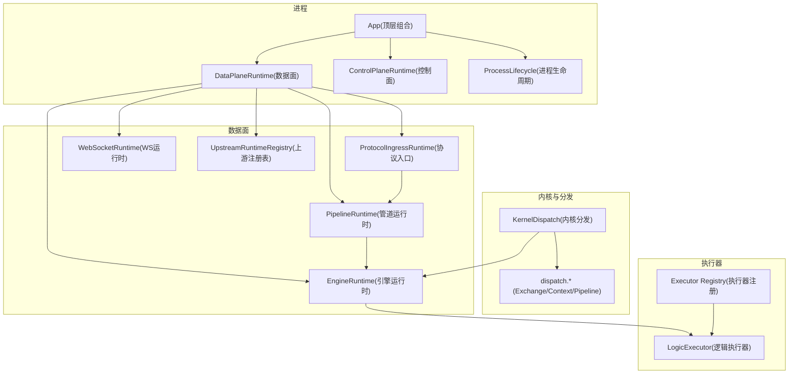
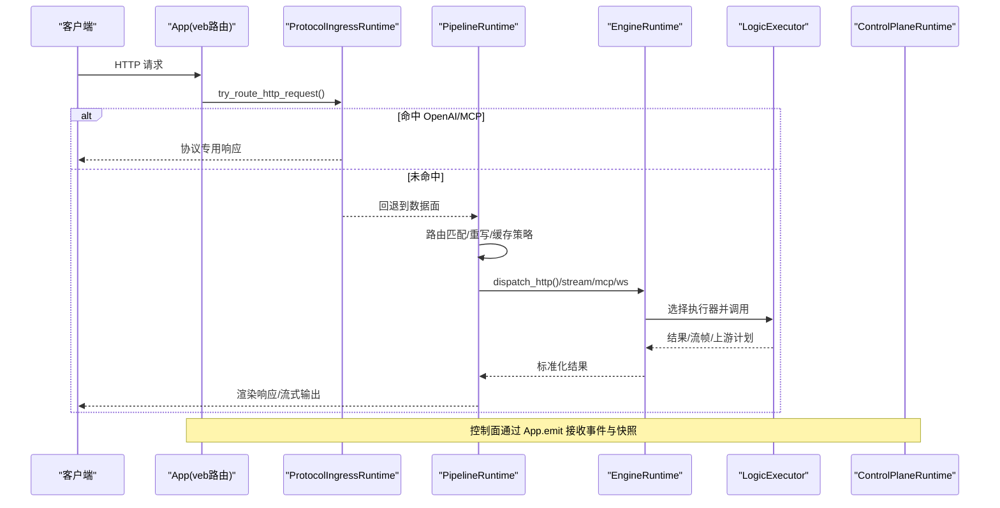
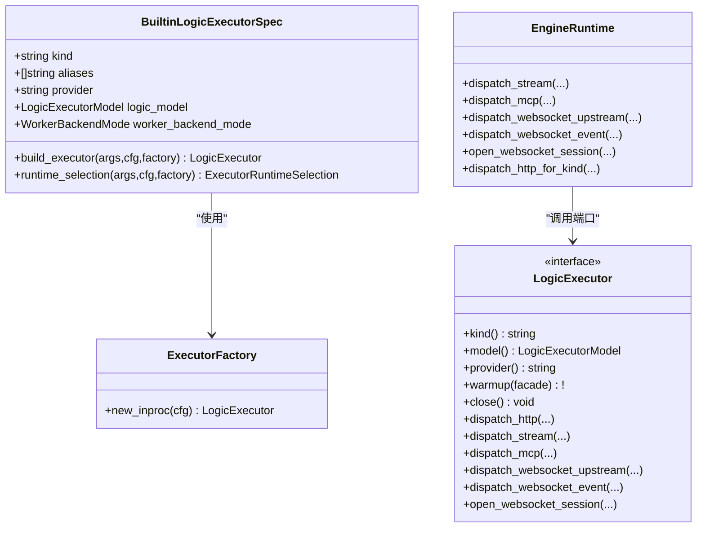
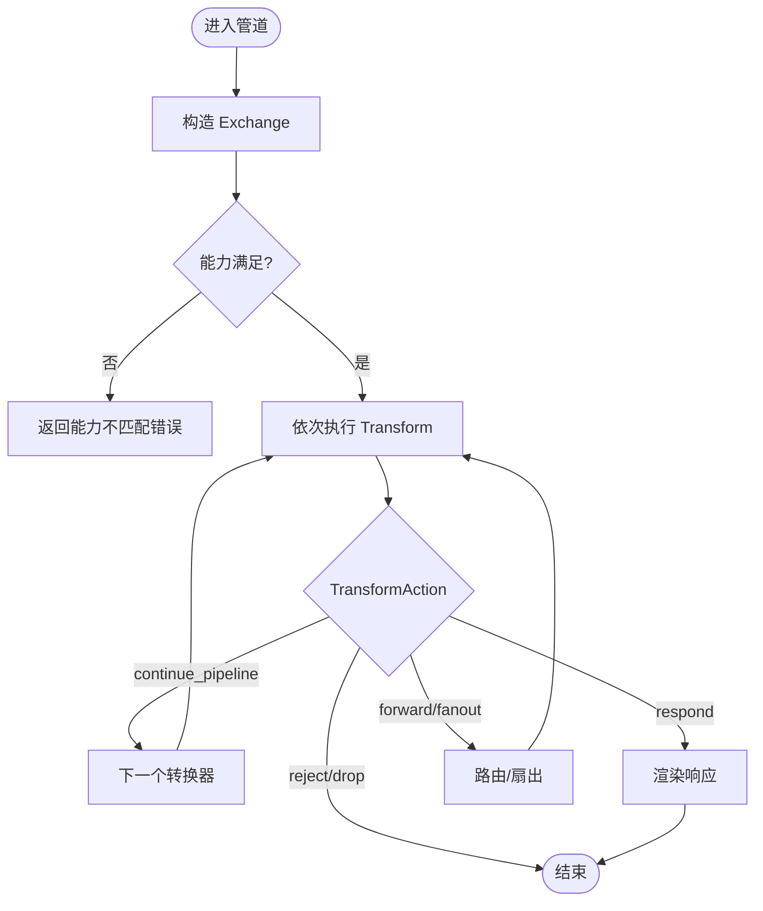
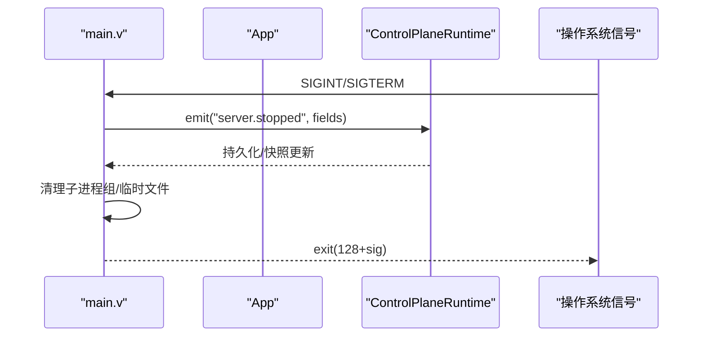
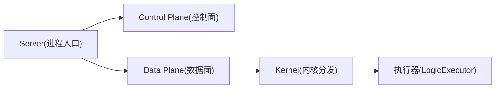
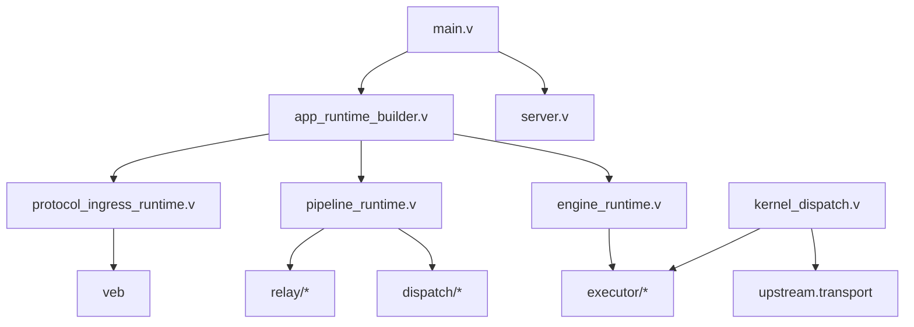

# 核心架构模式

<cite>
**本文引用的文件**   
- [src/main.v](file://src/main.v)
- [src/server.v](file://src/server.v)
- [src/app_runtime_builder.v](file://src/app_runtime_builder.v)
- [src/engine_runtime.v](file://src/engine_runtime.v)
- [src/pipeline_runtime.v](file://src/pipeline_runtime.v)
- [src/protocol_ingress_runtime.v](file://src/protocol_ingress_runtime.v)
- [src/kernel_dispatch.v](file://src/kernel_dispatch.v)
- [src/dispatch/kernel.v](file://src/dispatch/kernel.v)
- [src/dispatch/exchange.v](file://src/dispatch/exchange.v)
- [src/dispatch/context.v](file://src/dispatch/context.v)
- [src/dispatch/pipeline.v](file://src/dispatch/pipeline.v)
- [src/executor/types.v](file://src/executor/types.v)
- [src/executor/registry.v](file://src/executor/registry.v)
- [docs/ADMIN_CONTROL_PLANE_PLAN.md](file://docs/ADMIN_CONTROL_PLANE_PLAN.md)
- [docs/CONFIGURATION_MODEL_V2.md](file://docs/CONFIGURATION_MODEL_V2.md)
- [docs/PROTOCOL_PIPELINE_IMPLEMENTATION_PLAN.md](file://docs/PROTOCOL_PIPELINE_IMPLEMENTATION_PLAN.md)
</cite>

## 目录
1. [引言](#引言)
2. [项目结构](#项目结构)
3. [核心组件](#核心组件)
4. [架构总览](#架构总览)
5. [详细组件分析](#详细组件分析)
6. [依赖关系分析](#依赖关系分析)
7. [性能考量](#性能考量)
8. [故障排查指南](#故障排查指南)
9. [结论](#结论)
10. [附录](#附录)

## 引言
本文件聚焦于 VHTTPD 的核心架构模式设计，围绕执行器模式、管道处理模型与事件驱动架构三大理念展开，系统阐述 Server、Control Plane、Data Plane、Kernel 等关键抽象的职责划分与交互关系。同时，从模块化设计原则（组件解耦、接口规范、依赖注入）和分层架构（协议层到业务层职责分离）角度进行深度解析，并辅以架构图与交互图帮助开发者理解整体设计与扩展点。

## 项目结构
VHTTPD 采用“进程内运行时 + 可插拔执行器 + 管道化分发”的混合架构：
- 进程入口与生命周期管理集中在主模块与服务器启动逻辑中；
- 数据面负责请求接入、路由匹配、缓存策略、引擎选择与响应渲染；
- 控制面提供配置编辑、计划预览/应用、运行态快照与审计；
- 内核层统一封装跨协议的分发信封与上下文构造；
- 执行器层以工厂+规格注册的方式支持多种后端（PHP Worker、PHP-CGI、In-Proc VJSX 等）。

图表来源
- [src/main.v:15-23](file://src/main.v#L15-L23)
- [src/app_runtime_builder.v:10-56](file://src/app_runtime_builder.v#L10-L56)
- [src/engine_runtime.v:177-208](file://src/engine_runtime.v#L177-L208)
- [src/pipeline_runtime.v:40-56](file://src/pipeline_runtime.v#L40-L56)
- [src/protocol_ingress_runtime.v:10-26](file://src/protocol_ingress_runtime.v#L10-L26)
- [src/kernel_dispatch.v:9-91](file://src/kernel_dispatch.v#L9-L91)
- [src/dispatch/exchange.v:78-104](file://src/dispatch/exchange.v#L78-L104)
- [src/executor/registry.v:65-127](file://src/executor/registry.v#L65-L127)

章节来源
- [src/main.v:15-23](file://src/main.v#L15-L23)
- [src/server.v:276-319](file://src/server.v#L276-L319)
- [src/app_runtime_builder.v:10-56](file://src/app_runtime_builder.v#L10-L56)

## 核心组件
- App 顶层组合体：聚合 DataPlaneRuntime、ControlPlaneRuntime、ProcessLifecycle，并通过 veb 中间件与静态资源处理器暴露 HTTP 路由。
- DataPlaneRuntime：包含协议入口、管道运行时、引擎运行时、WebSocket 运行时与上游注册表，承担数据面全部职责。
- ControlPlaneRuntime：面向管理员的控制平面，提供运行时快照、替换预览/应用、事件日志等能力。
- ProcessLifecycle：进程级生命周期钩子与优雅关停。
- EngineRuntime：维护主/附加执行器池、队列与套接字选择、请求计数、重启/排空策略、指标与管理员摘要。
- PipelineRuntime：HTTP 路由匹配、重写、静态根选择、响应缓存策略、Relay 管道描述符装配。
- ProtocolIngressRuntime：OpenAI/MCP 等协议的优先路由拦截，未命中则回退到通用数据面。
- KernelDispatch：将不同协议请求包装为统一的分发信封与上下文，交由引擎执行。
- Executor Registry：内置执行器规格（none/php/php-cgi/vjsx），通过工厂方法构建具体执行器实例。

章节来源
- [src/main.v:15-23](file://src/main.v#L15-L23)
- [src/app_runtime_builder.v:10-56](file://src/app_runtime_builder.v#L10-L56)
- [src/engine_runtime.v:177-208](file://src/engine_runtime.v#L177-L208)
- [src/pipeline_runtime.v:40-56](file://src/pipeline_runtime.v#L40-L56)
- [src/protocol_ingress_runtime.v:10-26](file://src/protocol_ingress_runtime.v#L10-L26)
- [src/kernel_dispatch.v:9-91](file://src/kernel_dispatch.v#L9-L91)
- [src/executor/registry.v:65-127](file://src/executor/registry.v#L65-L127)

## 架构总览
下图展示从 HTTP 请求进入，到协议入口、管道匹配、引擎选择与执行器调用的完整链路，以及控制面与内核分发的协作方式。

图表来源
- [src/main.v:83-116](file://src/main.v#L83-L116)
- [src/protocol_ingress_runtime.v:10-26](file://src/protocol_ingress_runtime.v#L10-L26)
- [src/pipeline_runtime.v:91-143](file://src/pipeline_runtime.v#L91-L143)
- [src/engine_runtime.v:177-208](file://src/engine_runtime.v#L177-L208)
- [src/kernel_dispatch.v:9-91](file://src/kernel_dispatch.v#L9-L91)

## 详细组件分析

### 执行器模式（Executor Pattern）
- 规格与工厂：通过内置执行器规格（none/php/php-cgi/vjsx）声明生命周期、模型（worker/embedded）、工作后端模式与配置表面，并由工厂方法按需构建具体执行器。
- 运行时选择：根据监听器与计划投影，选择主或附加执行器池，暴露 HTTP/Stream/MCP/WebSocket 端口。
- 生命周期：start/warmup/close 贯穿主/附加执行器，配合工作后端自动启停、最大请求数排空与重启。

图表来源
- [src/executor/registry.v:65-127](file://src/executor/registry.v#L65-L127)
- [src/executor/registry.v:263-286](file://src/executor/registry.v#L263-L286)
- [src/engine_runtime.v:177-208](file://src/engine_runtime.v#L177-L208)

章节来源
- [src/executor/registry.v:65-127](file://src/executor/registry.v#L65-L127)
- [src/executor/registry.v:263-286](file://src/executor/registry.v#L263-L286)
- [src/engine_runtime.v:177-208](file://src/engine_runtime.v#L177-L208)

### 管道处理模型（Pipeline Model）
- 交换对象：Exchange 承载身份、类型、入站、管道、时间戳、头/元数据与负载，支持请求/响应/事件/流/会话/错误等多种载荷。
- 转换动作：TransformAction 定义继续管道、直接响应、转发、扇出、拒绝、丢弃等行为。
- 能力校验：Capabilities 描述入站/出站/全双工/会话/复用/取消/背压/回放等能力，用于管道与入站能力匹配校验。
- 管道描述：PipelineDescriptor 由 ingress、transforms、policies、egress 组成，并在运行时按 Relay/HTTP 场景装配。

图表来源
- [src/dispatch/exchange.v:78-104](file://src/dispatch/exchange.v#L78-L104)
- [src/dispatch/exchange.v:106-145](file://src/dispatch/exchange.v#L106-L145)
- [src/dispatch/pipeline.v:3-12](file://src/dispatch/pipeline.v#L3-L12)
- [src/dispatch/pipeline.v:44-55](file://src/dispatch/pipeline.v#L44-L55)

章节来源
- [src/dispatch/exchange.v:78-104](file://src/dispatch/exchange.v#L78-L104)
- [src/dispatch/exchange.v:106-145](file://src/dispatch/exchange.v#L106-L145)
- [src/dispatch/pipeline.v:3-12](file://src/dispatch/pipeline.v#L3-L12)
- [src/dispatch/pipeline.v:44-55](file://src/dispatch/pipeline.v#L44-L55)

### 事件驱动架构（Event-driven Architecture）
- 事件发射：App.emit 将 server.started/failed/stopped、admin.started/failed/internal_admin.error、worker.select.failed 等事件写入追踪日志并透传到控制面。
- 控制面订阅：ControlPlaneRuntime 接收事件，结合运行时快照与审计记录，支撑在线编辑、预览与应用。
- 进程信号：server.v 注册 SIGINT/SIGTERM 处理器，触发优雅关停、清理子进程组与临时文件。

图表来源
- [src/main.v:75-81](file://src/main.v#L75-L81)
- [src/server.v:116-135](file://src/server.v#L116-L135)
- [docs/ADMIN_CONTROL_PLANE_PLAN.md:39-67](file://docs/ADMIN_CONTROL_PLANE_PLAN.md#L39-L67)

章节来源
- [src/main.v:75-81](file://src/main.v#L75-L81)
- [src/server.v:116-135](file://src/server.v#L116-L135)
- [docs/ADMIN_CONTROL_PLANE_PLAN.md:39-67](file://docs/ADMIN_CONTROL_PLANE_PLAN.md#L39-L67)

### 关键抽象：Server、Control Plane、Data Plane、Kernel
- Server：进程入口与多监听器编排，负责参数解析、时区配置、单/多服务模式切换、优雅关停。
- Control Plane：基于 V2 配置域（listeners/control/observability 等）提供运行时对象的可视化与热替换。
- Data Plane：协议入口、管道匹配、引擎调度、响应渲染与缓存策略。
- Kernel：统一分发信封与上下文构造，屏蔽底层协议差异，向上游提供一致的执行语义。

图表来源
- [src/server.v:276-319](file://src/server.v#L276-L319)
- [docs/CONFIGURATION_MODEL_V2.md:218-275](file://docs/CONFIGURATION_MODEL_V2.md#L218-L275)
- [src/kernel_dispatch.v:9-91](file://src/kernel_dispatch.v#L9-L91)

章节来源
- [src/server.v:276-319](file://src/server.v#L276-L319)
- [docs/CONFIGURATION_MODEL_V2.md:218-275](file://docs/CONFIGURATION_MODEL_V2.md#L218-L275)
- [src/kernel_dispatch.v:9-91](file://src/kernel_dispatch.v#L9-L91)

### 模块化设计原则
- 组件解耦：App 仅持有顶层运行时所有者字段，具体行为下沉至独立运行时（EngineRuntime、PipelineRuntime、ProtocolIngressRuntime 等）。
- 接口定义规范：ExecutorFactory 以函数指针打破循环依赖；LogicExecutor 暴露统一端口；Exchange/TransformAction/Capabilities 定义清晰的数据契约。
- 依赖注入机制：App 构建阶段通过 build_app_runtime 注入运行时计划、路由规则、资产与额外工作进程环境，形成“计划驱动”的装配。

章节来源
- [src/app_runtime_builder.v:10-56](file://src/app_runtime_builder.v#L10-L56)
- [src/executor/registry.v:29-40](file://src/executor/registry.v#L29-L40)
- [src/dispatch/exchange.v:78-104](file://src/dispatch/exchange.v#L78-L104)

### 分层架构决策
- 协议层：ProtocolIngressRuntime 优先拦截 OpenAI/MCP 等协议，未命中则回退到通用数据面。
- 路由与管道层：PipelineRuntime 负责匹配、重写、静态根选择与响应缓存策略，并将请求转换为执行器可调度的形式。
- 引擎层：EngineRuntime 管理执行器池、队列、套接字选择、请求计数与重启策略，并对外暴露统一分发接口。
- 执行器层：LogicExecutor 实现具体业务逻辑（PHP Worker、PHP-CGI、In-Proc VJSX 等），支持流式与命令式两种模式。

章节来源
- [src/protocol_ingress_runtime.v:10-26](file://src/protocol_ingress_runtime.v#L10-L26)
- [src/pipeline_runtime.v:91-143](file://src/pipeline_runtime.v#L91-L143)
- [src/engine_runtime.v:177-208](file://src/engine_runtime.v#L177-L208)
- [src/executor/registry.v:65-127](file://src/executor/registry.v#L65-L127)

## 依赖关系分析
- 低耦合高内聚：各运行时模块职责单一，通过明确接口与数据结构交互，避免在 App 中堆积状态与逻辑。
- 直接依赖：
  - main.v 依赖 server.v 的启动流程与信号处理；
  - app_runtime_builder.v 依赖 executor、provider、runtime_plan 与 server_lifecycle；
  - engine_runtime.v 依赖 executor 与 worker 后端；
  - pipeline_runtime.v 依赖 dispatch、executor、relay、runtime_plan；
  - protocol_ingress_runtime.v 依赖 veb 与上层协议端口；
  - kernel_dispatch.v 依赖 upstream.transport 与 executor。
- 潜在环依赖规避：通过 ExecutorFactory 函数指针与运行时计划投影降低循环依赖风险。

图表来源
- [src/main.v:15-23](file://src/main.v#L15-L23)
- [src/server.v:276-319](file://src/server.v#L276-L319)
- [src/app_runtime_builder.v:10-56](file://src/app_runtime_builder.v#L10-L56)
- [src/engine_runtime.v:177-208](file://src/engine_runtime.v#L177-L208)
- [src/pipeline_runtime.v:40-56](file://src/pipeline_runtime.v#L40-L56)
- [src/protocol_ingress_runtime.v:10-26](file://src/protocol_ingress_runtime.v#L10-L26)
- [src/kernel_dispatch.v:9-91](file://src/kernel_dispatch.v#L9-L91)

章节来源
- [src/main.v:15-23](file://src/main.v#L15-L23)
- [src/server.v:276-319](file://src/server.v#L276-L319)
- [src/app_runtime_builder.v:10-56](file://src/app_runtime_builder.v#L10-L56)
- [src/engine_runtime.v:177-208](file://src/engine_runtime.v#L177-L208)
- [src/pipeline_runtime.v:40-56](file://src/pipeline_runtime.v#L40-L56)
- [src/protocol_ingress_runtime.v:10-26](file://src/protocol_ingress_runtime.v#L10-L26)
- [src/kernel_dispatch.v:9-91](file://src/kernel_dispatch.v#L9-L91)

## 性能考量
- 队列与超时：EngineRuntime 暴露队列等待、拒绝、超时统计与深度监控，便于容量规划与限流策略调整。
- 套接字选择：按执行器种类选择对应 socket，减少跨池开销；支持按 kind 定向调度。
- 响应缓存：PipelineRuntime 对 GET 等可缓存请求实施 TTL 与 bypass 策略，降低下游压力。
- 流式处理：内核分发支持 open/next/close 三段式流，适合长连接与 SSE/WS 场景。
- 优雅关停：信号处理与最大请求数排空确保零丢失下线。

章节来源
- [src/engine_runtime.v:234-249](file://src/engine_runtime.v#L234-L249)
- [src/pipeline_runtime.v:174-223](file://src/pipeline_runtime.v#L174-L223)
- [src/kernel_dispatch.v:97-127](file://src/kernel_dispatch.v#L97-L127)
- [src/server.v:116-135](file://src/server.v#L116-L135)

## 故障排查指南
- 事件追踪：通过 runtime_trace 与 emit 输出 server/admin/worker 相关事件，定位启动失败、内部错误与工作节点选择失败。
- 传输错误分类：dispatch.kernel 提供 transport_failure 与 stream_failure 映射，快速识别后端错误类别与状态码。
- 执行器健康：EngineRuntime.metrics 与 admin snapshots 暴露队列深度、池大小、后端模式与生命周期状态。
- 优雅关停：检查信号处理是否生效、子进程组是否被正确终止、临时文件是否清理。

章节来源
- [src/main.v:25-81](file://src/main.v#L25-L81)
- [src/dispatch/kernel.v:12-28](file://src/dispatch/kernel.v#L12-L28)
- [src/engine_runtime.v:234-249](file://src/engine_runtime.v#L234-L249)
- [src/server.v:116-135](file://src/server.v#L116-L135)

## 结论
VHTTPD 通过“执行器模式 + 管道模型 + 事件驱动”的组合，实现了高内聚、低耦合、可扩展的进程内运行时架构。Server/Control Plane/Data Plane/Kernel 的职责边界清晰，配合 V2 配置模型与计划驱动的装配机制，既保证了生产稳定性，又提供了强大的在线治理能力。建议在扩展新协议或执行器时遵循现有接口与能力校验规范，充分利用管道与事件体系，保持系统的可观测性与可演进性。

## 附录
- 重构与迁移计划参考：Protocol Pipeline 实现计划明确了 P1-P7 阶段的拆分目标与验收标准，有助于理解当前代码的组织与后续演进方向。

章节来源
- [docs/PROTOCOL_PIPELINE_IMPLEMENTATION_PLAN.md:752-892](file://docs/PROTOCOL_PIPELINE_IMPLEMENTATION_PLAN.md#L752-L892)