# 生命周期管理

<cite>
**本文引用的文件**   
- [src/main.v](file://src/main.v)
- [src/server.v](file://src/server.v)
- [src/app_runtime_builder.v](file://src/app_runtime_builder.v)
- [src/engine_runtime_builder.v](file://src/engine_runtime_builder.v)
- [src/relay_runtime_builder.v](file://src/relay_runtime_builder.v)
- [src/provider_runtime_builder.v](file://src/provider_runtime_builder.v)
- [src/config/v2_config.v](file://src/config/v2_config.v)
- [src/config/runtime_plan_loader.v](file://src/config/runtime_plan_loader.v)
- [src/config/v2_plan_compiler.v](file://src/config/v2_plan_compiler.v)
- [src/config/v1_plan_compat.v](file://src/config/v1_plan_compat.v)
- [src/config/args.v](file://src/config/args.v)
- [src/config/embedded_host.v](file://src/config/embedded_host.v)
- [src/config/runtime_config.v](file://src/config/runtime_config.v)
- [src/server_lifecycle/runtime_config.v](file://src/server_lifecycle/runtime_config.v)
- [src/server_lifecycle/multi_config.v](file://src/server_lifecycle/multi_config.v)
</cite>

## 目录
1. [简介](#简介)
2. [项目结构](#项目结构)
3. [核心组件](#核心组件)
4. [架构总览](#架构总览)
5. [详细组件分析](#详细组件分析)
6. [依赖关系分析](#依赖关系分析)
7. [性能考量](#性能考量)
8. [故障排查指南](#故障排查指南)
9. [结论](#结论)
10. [附录](#附录)

## 简介
本文件系统性解析 VHTTPD 的生命周期管理机制，覆盖从进程启动、配置加载与计划编译、运行时构建、监听器与服务启动、运行期 Worker 管理、到优雅关闭的完整流程。同时深入说明提供者运行时（Provider Runtime）的状态管理与连接维护机制，资源（Socket、数据库连接池、缓存实例等）的创建、使用与释放策略，以及生命周期钩子与扩展点设计，并给出生产环境部署与运维最佳实践。

## 项目结构
VHTTPD 采用“配置驱动 + 运行时计划”的架构：
- 配置层：支持 v1 兼容与 v2 新配置，经编译器生成统一的运行时计划（RuntimePlan）。
- 运行时构建层：根据计划构建引擎（Engine）、适配器（Adapter）、转换器（Transform）、管道（Pipeline）、中继（Relay）、协议栈与提供者运行时。
- 服务层：注册全局活跃运行时，处理信号与多监听器编排，提供数据面与控制面。
- 执行层：Worker 后端（如 PHP/C++/vjsx 等）通过队列与套接字进行请求分发与结果回传。

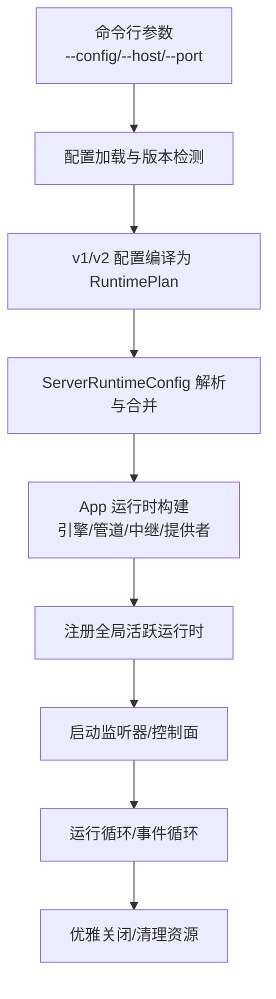

**图示来源**
- [src/server.v:276-319](file://src/server.v#L276-L319)
- [src/config/runtime_plan_loader.v:18-46](file://src/config/runtime_plan_loader.v#L18-L46)
- [src/config/v2_plan_compiler.v:7-203](file://src/config/v2_plan_compiler.v#L7-L203)
- [src/server_lifecycle/runtime_config.v:54-171](file://src/server_lifecycle/runtime_config.v#L54-L171)
- [src/app_runtime_builder.v:10-56](file://src/app_runtime_builder.v#L10-L56)

**章节来源**
- [src/server.v:276-319](file://src/server.v#L276-L319)
- [src/config/runtime_plan_loader.v:18-46](file://src/config/runtime_plan_loader.v#L18-L46)
- [src/config/v2_plan_compiler.v:7-203](file://src/config/v2_plan_compiler.v#L7-L203)
- [src/server_lifecycle/runtime_config.v:54-171](file://src/server_lifecycle/runtime_config.v#L54-L171)
- [src/app_runtime_builder.v:10-56](file://src/app_runtime_builder.v#L10-L56)

## 核心组件
- 应用主入口与路由代理：定义 App 结构体，挂载 HTTP 方法处理器，统一转发至 HttpIngressRuntime 路由。
- 服务器主控：负责参数校验、时区设置、信号处理、单/多监听模式选择、运行时构建与启动、优雅退出。
- 运行时构建器：按监听器维度构建 App 运行时，包括引擎、管道、中继、协议栈、提供者运行时。
- 引擎构建器：基于计划与路由规则构建主引擎与附加引擎（事件/提供者入站），封装 Worker 后端状态。
- 中继构建器：根据计划初始化中继运行时。
- 提供者运行时构建器：初始化 ProviderRuntimeHub，聚合驱动、插件、协议、能力、钩子与选项。
- 配置与计划：v1/v2 配置加载、包含与变量替换、严格键校验、语义验证；最终产出 RuntimePlan。
- 服务器生命周期配置：将计划与 CLI 参数融合为 ServerRuntimeConfig，准备 PID/事件日志/内部管理 Socket 等文件。

**章节来源**
- [src/main.v:10-23](file://src/main.v#L10-L23)
- [src/main.v:83-116](file://src/main.v#L83-L116)
- [src/server.v:139-252](file://src/server.v#L139-L252)
- [src/server.v:276-319](file://src/server.v#L276-L319)
- [src/app_runtime_builder.v:10-56](file://src/app_runtime_builder.v#L10-L56)
- [src/engine_runtime_builder.v:29-41](file://src/engine_runtime_builder.v#L29-L41)
- [src/relay_runtime_builder.v:11-28](file://src/relay_runtime_builder.v#L11-L28)
- [src/provider_runtime_builder.v:7-25](file://src/provider_runtime_builder.v#L7-L25)
- [src/config/v2_config.v:3-19](file://src/config/v2_config.v#L3-L19)
- [src/config/runtime_plan_loader.v:18-46](file://src/config/runtime_plan_loader.v#L18-L46)
- [src/config/v2_plan_compiler.v:7-203](file://src/config/v2_plan_compiler.v#L7-L203)
- [src/server_lifecycle/runtime_config.v:54-171](file://src/server_lifecycle/runtime_config.v#L54-L171)

## 架构总览
下图展示从进程启动到服务运行的关键阶段与模块交互。

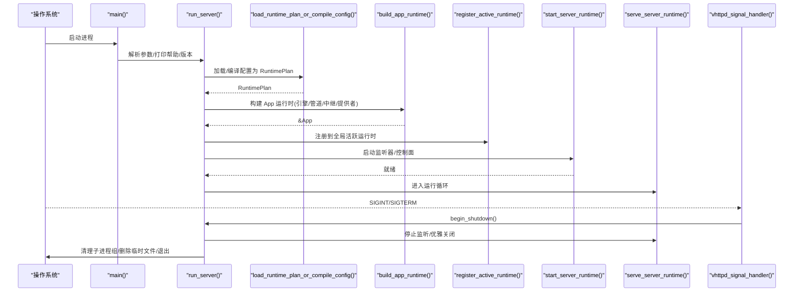

**图示来源**
- [src/server.v:355-371](file://src/server.v#L355-L371)
- [src/server.v:298-319](file://src/server.v#L298-L319)
- [src/config/runtime_plan_loader.v:26-46](file://src/config/runtime_plan_loader.v#L26-L46)
- [src/app_runtime_builder.v:10-56](file://src/app_runtime_builder.v#L10-L56)
- [src/server.v:86-114](file://src/server.v#L86-L114)
- [src/server.v:116-135](file://src/server.v#L116-L135)

## 详细组件分析

### 服务器启动与运行流程
- 参数解析与校验：识别 --help/--version/--config 等已知长选项，拒绝未知参数。
- 时区配置：优先 plan.server.timezone，其次环境变量 VHTTPD_TZ/TZ，默认 Asia/Shanghai，并刷新日志系统。
- 信号处理：注册 SIGINT/SIGTERM 回调，触发优雅关闭。
- 单/多监听模式：若配置含多个监听或 plan.listeners > 1，则进入多监听模式；否则单监听。
- 构建与注册：调用 build_app_runtime 构建 App，注册到全局 ActiveRuntimeRegistry。
- 启动与运行：start_server_runtime 启动监听器/控制面，serve_server_runtime 进入运行循环。

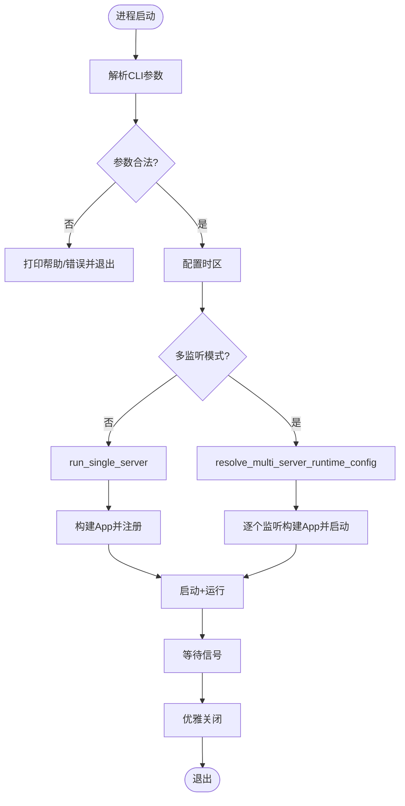

**图示来源**
- [src/server.v:139-252](file://src/server.v#L139-L252)
- [src/server.v:329-353](file://src/server.v#L329-L353)
- [src/server.v:321-327](file://src/server.v#L321-L327)
- [src/server.v:276-296](file://src/server.v#L276-L296)
- [src/server_lifecycle/multi_config.v:20-94](file://src/server_lifecycle/multi_config.v#L20-L94)

**章节来源**
- [src/server.v:139-252](file://src/server.v#L139-L252)
- [src/server.v:329-353](file://src/server.v#L329-L353)
- [src/server.v:321-327](file://src/server.v#L321-L327)
- [src/server.v:276-296](file://src/server.v#L276-L296)
- [src/server_lifecycle/multi_config.v:20-94](file://src/server_lifecycle/multi_config.v#L20-L94)

### 配置加载与计划编译
- 版本检测：读取 TOML 的 version 字段，区分 v1 与 v2。
- v2 配置：支持 include 合并、路径与环境变量替换、严格键校验、类型化解码。
- v1 兼容：将 v1 配置转换为 v2 中间表示，再经由 v2 编译器生成 RuntimePlan，附带诊断信息。
- 语义验证：检查引用存在性、适配器/引擎/转换器语义约束、监听器管道覆盖等。

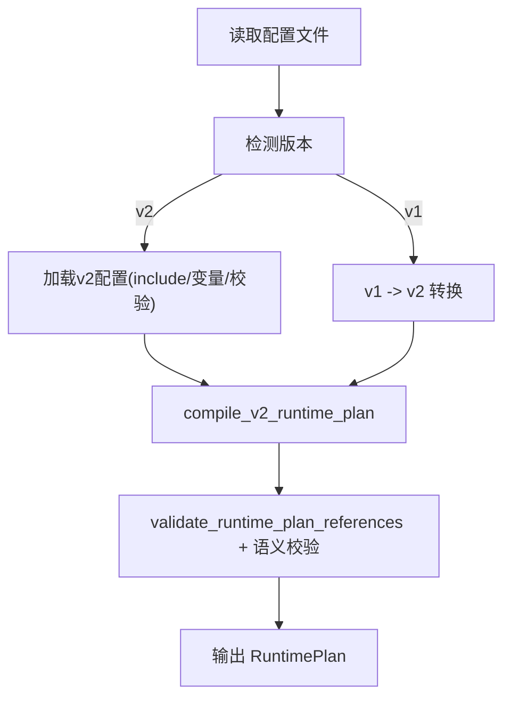

**图示来源**
- [src/config/runtime_plan_loader.v:18-46](file://src/config/runtime_plan_loader.v#L18-L46)
- [src/config/runtime_plan_loader.v:61-117](file://src/config/runtime_plan_loader.v#L61-L117)
- [src/config/v2_plan_compiler.v:7-203](file://src/config/v2_plan_compiler.v#L7-L203)
- [src/config/v2_plan_compiler.v:638-682](file://src/config/v2_plan_compiler.v#L638-L682)
- [src/config/v1_plan_compat.v:5-9](file://src/config/v1_plan_compat.v#L5-L9)

**章节来源**
- [src/config/runtime_plan_loader.v:18-46](file://src/config/runtime_plan_loader.v#L18-L46)
- [src/config/runtime_plan_loader.v:61-117](file://src/config/runtime_plan_loader.v#L61-L117)
- [src/config/v2_plan_compiler.v:7-203](file://src/config/v2_plan_compiler.v#L7-L203)
- [src/config/v2_plan_compiler.v:638-682](file://src/config/v2_plan_compiler.v#L638-L682)
- [src/config/v1_plan_compat.v:5-9](file://src/config/v1_plan_compat.v#L5-L9)

### 运行时构建（App/Runtime Hub）
- 按监听器维度提取路由与协议诊断，生成 runtime_routes。
- 构建 EngineRuntime（主引擎 + 附加引擎），RelayRuntime，ProtocolRuntimeHub，TransportRuntimeHub，WebSocketRuntime，UpstreamRuntimeRegistry，TransformerRuntimeHub，ProviderRuntimeHub，PipelineRuntime。
- 注入 AssetsRuntime、ControlPlaneRuntime、ProcessLifecycle 等基础设施。

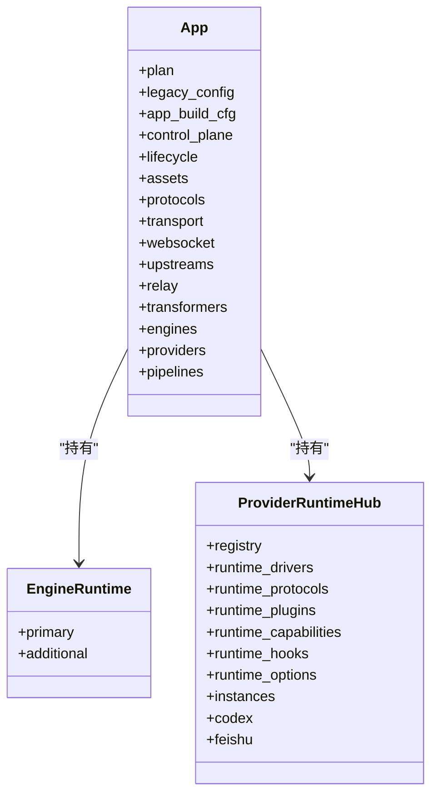

**图示来源**
- [src/app_runtime_builder.v:10-56](file://src/app_runtime_builder.v#L10-L56)
- [src/provider_runtime_builder.v:7-25](file://src/provider_runtime_builder.v#L7-L25)

**章节来源**
- [src/app_runtime_builder.v:10-56](file://src/app_runtime_builder.v#L10-L56)
- [src/provider_runtime_builder.v:7-25](file://src/provider_runtime_builder.v#L7-L25)

### 引擎与 Worker 生命周期
- 主引擎：由 executor.LogicExecutorRuntimePlan 解析得到，封装 worker.WorkerBackendRuntime 与逻辑执行器。
- 附加引擎：依据路由与事件/提供者入站管道，按需构建独立 Worker 后端实例，避免与主引擎耦合。
- Worker 后端：支持 autostart、cmd、sockets、read_timeout、queue_capacity/timeout、restart_backoff/max、max_requests 等。
- 健康检查与自动重启：通过 backoff 退避与最大请求数限制实现自愈；队列满返回 503，超时返回 504。

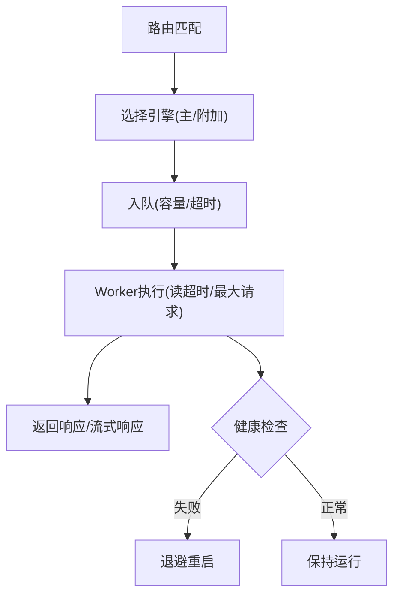

**图示来源**
- [src/engine_runtime_builder.v:29-41](file://src/engine_runtime_builder.v#L29-L41)
- [src/engine_runtime_builder.v:221-243](file://src/engine_runtime_builder.v#L221-L243)
- [src/engine_runtime_builder.v:43-67](file://src/engine_runtime_builder.v#L43-L67)

**章节来源**
- [src/engine_runtime_builder.v:29-41](file://src/engine_runtime_builder.v#L29-L41)
- [src/engine_runtime_builder.v:221-243](file://src/engine_runtime_builder.v#L221-L243)
- [src/engine_runtime_builder.v:43-67](file://src/engine_runtime_builder.v#L43-L67)

### 提供者运行时（Provider Runtime）状态与连接
- ProviderRuntimeHub 集中管理驱动、协议、插件、能力、钩子与选项，并提供快照与动态应用设置。
- 内置 Codex 与 Feishu 状态从设置中初始化，支持重连延迟、令牌刷新倾斜、最近事件限制等。
- 运行时能力映射：action -> capability 名称，便于扩展与替换。

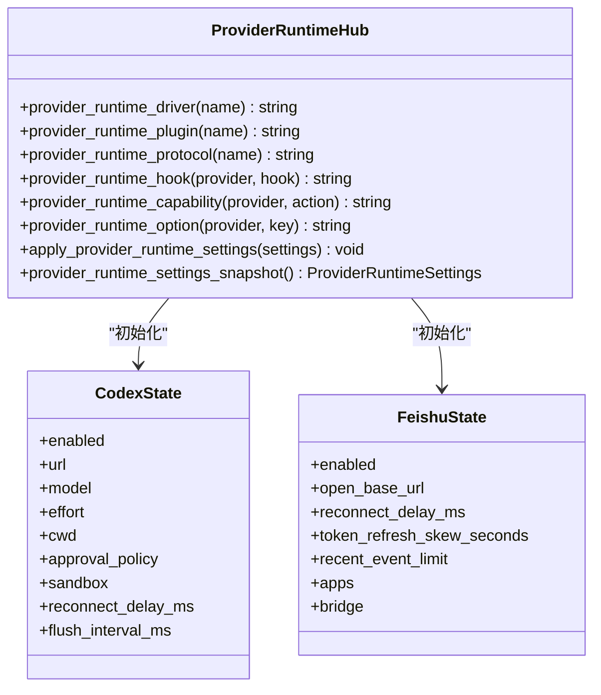

**图示来源**
- [src/provider_runtime_builder.v:7-25](file://src/provider_runtime_builder.v#L7-L25)
- [src/provider_runtime_builder.v:27-65](file://src/provider_runtime_builder.v#L27-L65)
- [src/provider_runtime_builder.v:101-132](file://src/provider_runtime_builder.v#L101-L132)

**章节来源**
- [src/provider_runtime_builder.v:7-25](file://src/provider_runtime_builder.v#L7-L25)
- [src/provider_runtime_builder.v:27-65](file://src/provider_runtime_builder.v#L27-L65)
- [src/provider_runtime_builder.v:101-132](file://src/provider_runtime_builder.v#L101-L132)

### 资源生命周期管理
- 数据库资源：在 v2 配置中声明 db 资源（kind/host/port/database/username/password/pool_size/idle_ping_ms/init_sql/options），经编译后作为 resource:db/* 引用供引擎使用。
- 缓存资源：cache 资源（kind/socket/url/namespace/options），内存或外部缓存均可。
- 存储与密钥：storage/secret 资源用于静态/上传与敏感信息访问。
- 资源创建与释放：由具体资源运行时负责连接池建立、空闲探测、定时 ping、优雅关闭；引擎在 shutdown 时释放句柄与连接。

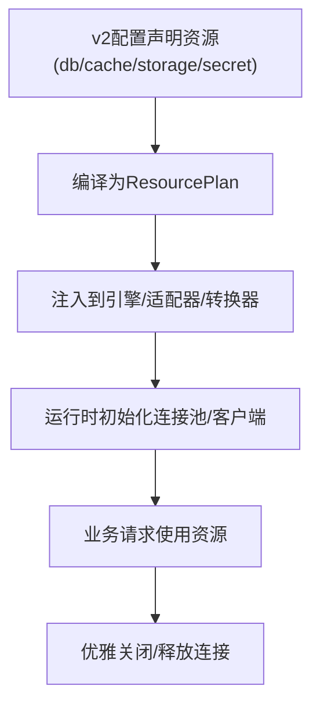

**图示来源**
- [src/config/v2_config.v:74-118](file://src/config/v2_config.v#L74-L118)
- [src/config/v2_plan_compiler.v:383-455](file://src/config/v2_plan_compiler.v#L383-L455)

**章节来源**
- [src/config/v2_config.v:74-118](file://src/config/v2_config.v#L74-L118)
- [src/config/v2_plan_compiler.v:383-455](file://src/config/v2_plan_compiler.v#L383-L455)

### 生命周期钩子与扩展点
- 提供者钩子：通过 providers.*.hooks 映射 action -> handler，结合 runtime_driver/runtime_plugin/runtime_engine 实现扩展。
- 能力映射：providers.*.capabilities 将 action 映射到具体 capability 名称，便于策略与路由控制。
- 运行时选项：providers.*.options 与 runtime_options 提供细粒度行为开关。
- 扩展点位置：ProviderRuntimeHub 提供 provider_runtime_* 查询接口，便于在运行时动态调整。

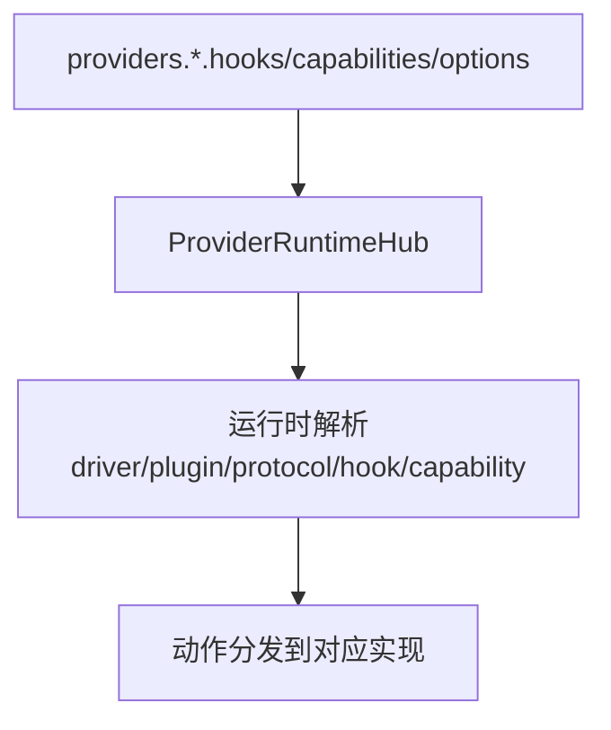

**图示来源**
- [src/config/v2_config.v:261-277](file://src/config/v2_config.v#L261-L277)
- [src/provider_runtime_builder.v:27-65](file://src/provider_runtime_builder.v#L27-L65)

**章节来源**
- [src/config/v2_config.v:261-277](file://src/config/v2_config.v#L261-L277)
- [src/provider_runtime_builder.v:27-65](file://src/provider_runtime_builder.v#L27-L65)

### 优雅关闭与信号处理
- 信号注册：SIGINT/SIGTERM 触发 vhttpd_signal_handler。
- 关闭流程：begin_active_runtime_shutdown 标记关闭，终止子进程组，删除内部管理 Socket 与 PID 文件，记录日志并退出。
- 多监听场景：每个监听器的 ServerRuntimeConfig 均包含 pid_file/internal_admin_socket，关闭时逐一清理。

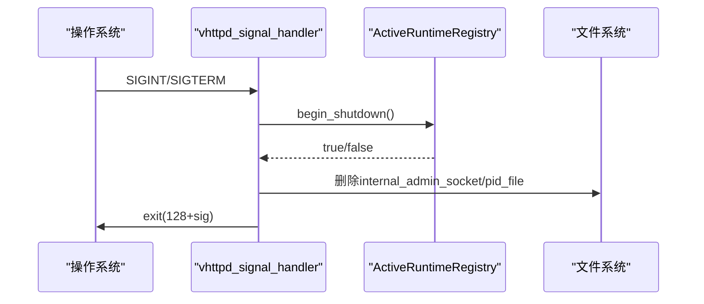

**图示来源**
- [src/server.v:116-135](file://src/server.v#L116-L135)
- [src/server.v:55-65](file://src/server.v#L55-L65)
- [src/server_lifecycle/runtime_config.v:299-304](file://src/server_lifecycle/runtime_config.v#L299-L304)

**章节来源**
- [src/server.v:116-135](file://src/server.v#L116-L135)
- [src/server.v:55-65](file://src/server.v#L55-L65)
- [src/server_lifecycle/runtime_config.v:299-304](file://src/server_lifecycle/runtime_config.v#L299-L304)

## 依赖关系分析
- 配置到计划：runtime_plan_loader 负责版本检测与加载，v2_plan_compiler 完成结构化编译与校验，v1_plan_compat 提供兼容桥接。
- 计划到运行时：server_lifecycle.runtime_config 将计划与 CLI 参数融合为 ServerRuntimeConfig；app_runtime_builder 据此构建 App。
- 运行时到执行：engine_runtime_builder 解析 executor_plan 并构造 Worker 后端；relay_runtime_builder 初始化中继；provider_runtime_builder 初始化提供者运行时。
- 全局协调：server.v 中的 ActiveRuntimeRegistry 统一管理多监听器实例，确保关闭顺序与资源清理。

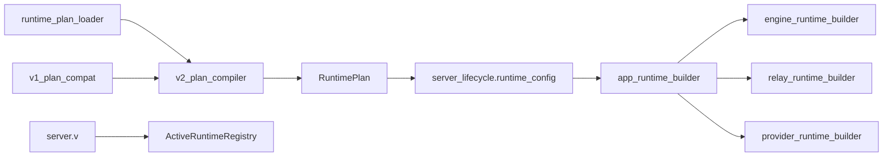

**图示来源**
- [src/config/runtime_plan_loader.v:18-46](file://src/config/runtime_plan_loader.v#L18-L46)
- [src/config/v2_plan_compiler.v:7-203](file://src/config/v2_plan_compiler.v#L7-L203)
- [src/config/v1_plan_compat.v:5-9](file://src/config/v1_plan_compat.v#L5-L9)
- [src/server_lifecycle/runtime_config.v:54-171](file://src/server_lifecycle/runtime_config.v#L54-L171)
- [src/app_runtime_builder.v:10-56](file://src/app_runtime_builder.v#L10-L56)
- [src/engine_runtime_builder.v:29-41](file://src/engine_runtime_builder.v#L29-L41)
- [src/relay_runtime_builder.v:11-28](file://src/relay_runtime_builder.v#L11-L28)
- [src/provider_runtime_builder.v:7-25](file://src/provider_runtime_builder.v#L7-L25)
- [src/server.v:86-114](file://src/server.v#L86-L114)

**章节来源**
- [src/config/runtime_plan_loader.v:18-46](file://src/config/runtime_plan_loader.v#L18-L46)
- [src/config/v2_plan_compiler.v:7-203](file://src/config/v2_plan_compiler.v#L7-L203)
- [src/config/v1_plan_compat.v:5-9](file://src/config/v1_plan_compat.v#L5-L9)
- [src/server_lifecycle/runtime_config.v:54-171](file://src/server_lifecycle/runtime_config.v#L54-L171)
- [src/app_runtime_builder.v:10-56](file://src/app_runtime_builder.v#L10-L56)
- [src/engine_runtime_builder.v:29-41](file://src/engine_runtime_builder.v#L29-L41)
- [src/relay_runtime_builder.v:11-28](file://src/relay_runtime_builder.v#L11-L28)
- [src/provider_runtime_builder.v:7-25](file://src/provider_runtime_builder.v#L7-L25)
- [src/server.v:86-114](file://src/server.v#L86-L114)

## 性能考量
- 队列与超时：合理设置 queue_capacity 与 queue_timeout_ms，避免 503/504 激增；read_timeout_ms 需与上游处理时长匹配。
- 重启退避：restart_backoff_ms/restart_backoff_max_ms 防止雪崩；max_requests 控制 Worker 生命周期，降低内存泄漏风险。
- 线程与并发：vjsx thread_count 与 WebSocket actor/affinity 策略影响吞吐与粘性；注意锁层级与序列化发送以避免竞争。
- 资源池：DB pool_size 与 idle_ping_ms 平衡连接复用与存活探测；缓存 namespace 隔离不同站点/租户。

[本节为通用指导，不直接分析具体文件]

## 故障排查指南
- 配置错误：
  - 未知字段/引用未解析：查看 compile_v2_runtime_plan 与 validate_runtime_plan_references 的诊断信息。
  - v1 兼容告警：留意 legacy_schema 与 magic executor 提示，建议迁移到 v2。
- 启动失败：
  - 端口冲突/权限不足：检查 host/port/ssl cert/key 与 internal_admin_socket/pid_file 路径。
  - 时区问题：确认 VHTTPD_TZ/TZ 与 plan.server.timezone。
- 运行异常：
  - 503/504：检查队列容量与超时；观察 Worker 重启日志与 backoff。
  - 提供者连接不稳定：调整 reconnect_delay_ms、token_refresh_skew_seconds。
- 优雅关闭：
  - 子进程未退出：检查信号处理与进程组清理；确认 internal_admin_socket/pid_file 是否被删除。

**章节来源**
- [src/config/v2_plan_compiler.v:638-682](file://src/config/v2_plan_compiler.v#L638-L682)
- [src/config/v1_plan_compat.v:11-47](file://src/config/v1_plan_compat.v#L11-L47)
- [src/server_lifecycle/runtime_config.v:299-304](file://src/server_lifecycle/runtime_config.v#L299-L304)
- [src/server.v:116-135](file://src/server.v#L116-L135)

## 结论
VHTTPD 以“配置即计划”为核心，通过严格的编译与校验保障运行时稳定性；以监听器为边界构建 App 运行时，解耦引擎、管道、中继与提供者；借助 Worker 后端与队列机制实现弹性伸缩与自愈；配合完善的信号处理与资源清理，达成生产级的高可用与可观测性。建议在部署中充分使用 v2 配置、合理调优队列与资源池、启用事件日志与追踪，并结合提供者钩子与能力映射实现灵活扩展。

[本节为总结，不直接分析具体文件]

## 附录
- 常用 CLI 选项：--config/--host/--port/--admin-host/--admin-port/--admin-token/--event-log/--pid-file/--worker-* 等。
- 多监听器：支持按 site 与 listener 组合，自动分配 admin 所有者监听器，避免端口冲突。
- 内嵌主机（vjsx）：EmbeddedHostRuntimeConfig 支持 entry/module_root/build_root/signature_root/profile/lane_count 等参数。

**章节来源**
- [src/server.v:139-252](file://src/server.v#L139-L252)
- [src/server_lifecycle/multi_config.v:20-94](file://src/server_lifecycle/multi_config.v#L20-L94)
- [src/config/embedded_host.v:33-85](file://src/config/embedded_host.v#L33-L85)