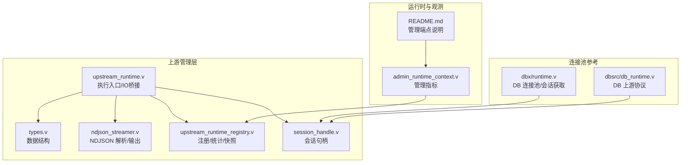
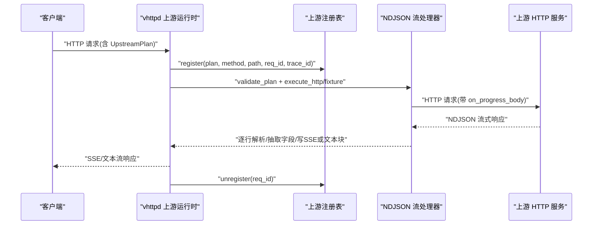
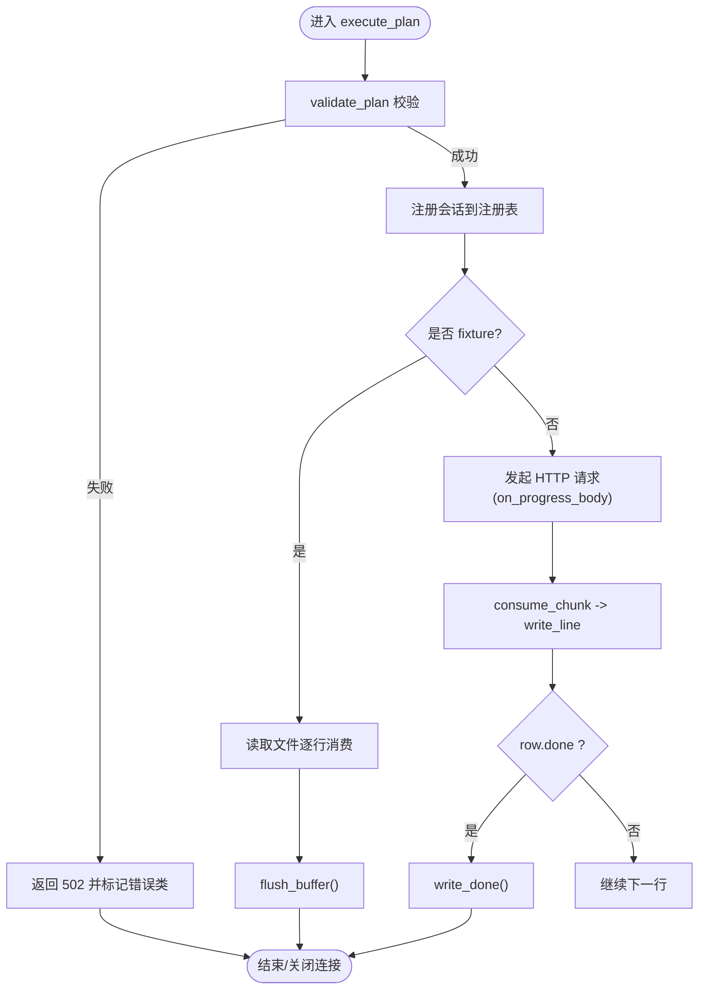
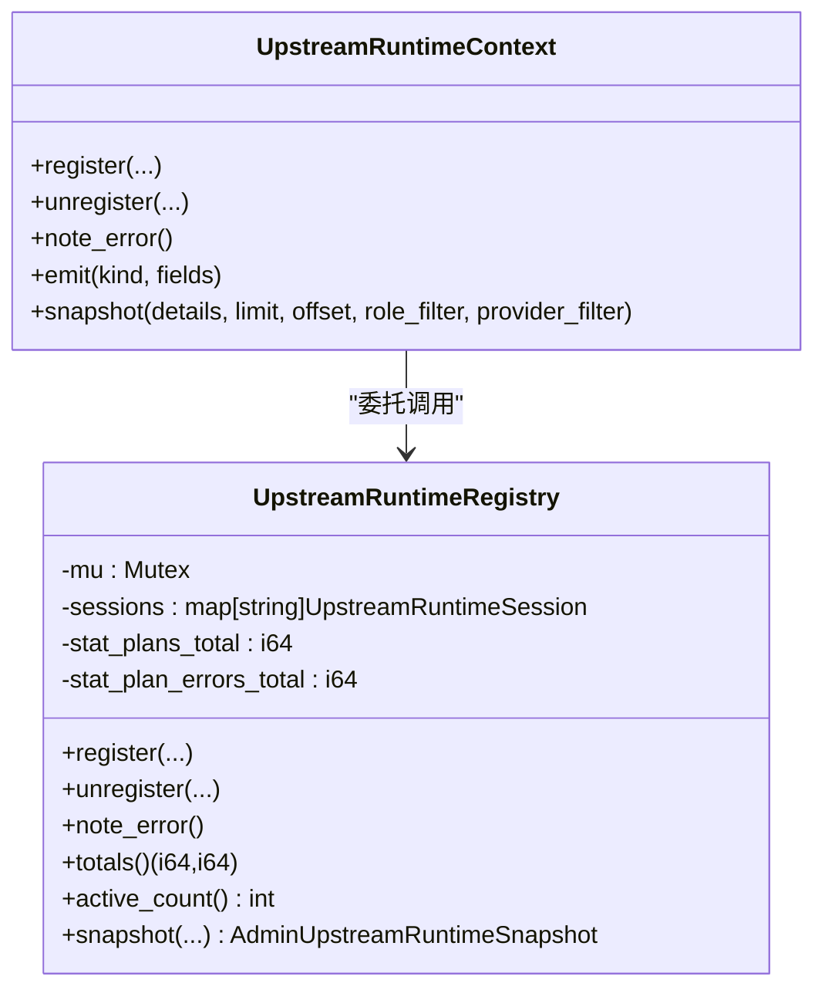
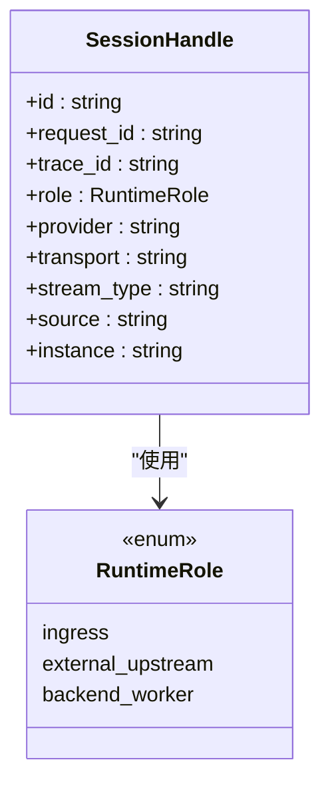
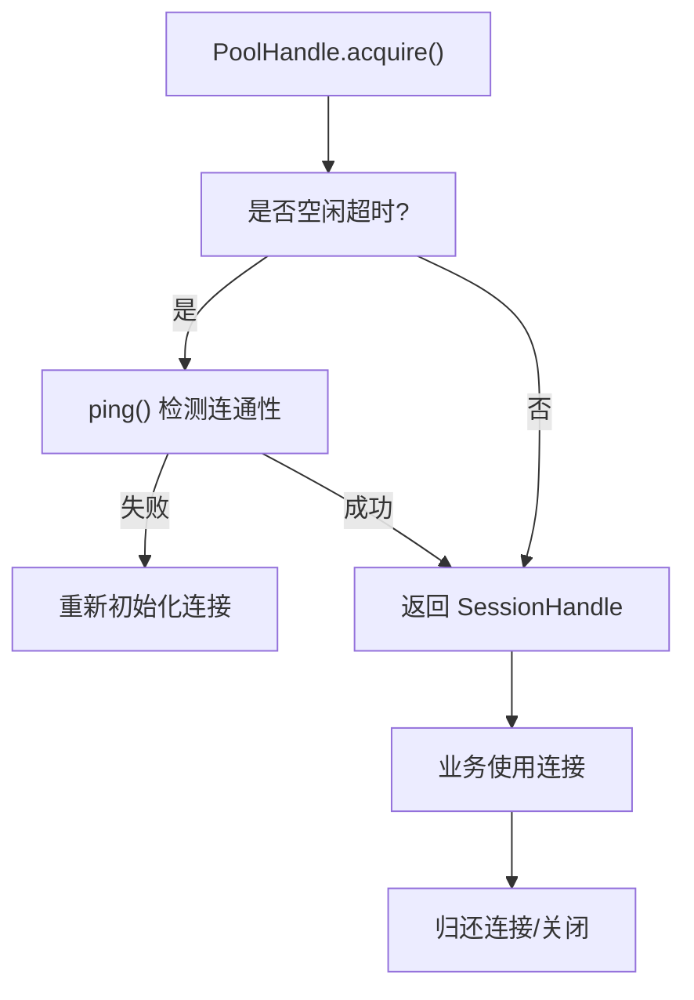
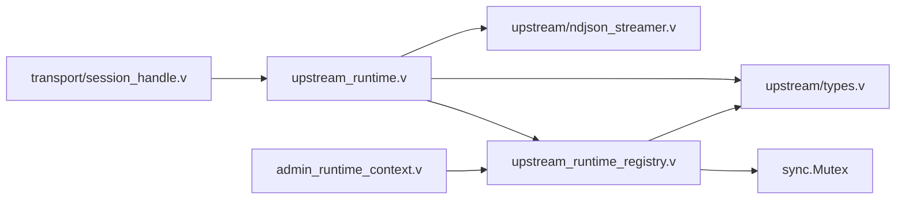

# 上游管理器设计

<cite>
**本文引用的文件**   
- [src/upstream/types.v](file://src/upstream/types.v)
- [src/upstream/ndjson_streamer.v](file://src/upstream/ndjson_streamer.v)
- [src/upstream_runtime.v](file://src/upstream_runtime.v)
- [src/upstream_runtime_registry.v](file://src/upstream_runtime_registry.v)
- [src/admin_runtime_context.v](file://src/admin_runtime_context.v)
- [README.md](file://README.md)
- [src/upstream/transport/session_handle.v](file://src/upstream/transport/session_handle.v)
- [src/dbx/runtime.v](file://src/dbx/runtime.v)
- [dbsrc/db_runtime.v](file://dbsrc/db_runtime.v)
- [tests/e2e/config_acceptance_test.sh](file://tests/e2e/config_acceptance_test.sh)
</cite>

## 目录
1. [引言](#引言)
2. [项目结构](#项目结构)
3. [核心组件](#核心组件)
4. [架构总览](#架构总览)
5. [详细组件分析](#详细组件分析)
6. [依赖关系分析](#依赖关系分析)
7. [性能考量](#性能考量)
8. [故障排查指南](#故障排查指南)
9. [结论](#结论)
10. [附录](#附录)

## 引言
本文件聚焦 vhttpd 的“上游管理器（Upstream Manager）”设计与实现，围绕以下目标展开：
- 连接池与复用：解析上游 HTTP 流式调用中的连接管理、空闲回收与容量控制。
- 负载均衡策略：说明轮询、加权、一致性哈希等策略在现有代码中的现状与扩展点。
- 故障转移机制：健康检查、自动重试、降级处理的设计与实践。
- 会话句柄（Session Handle）：状态管理与持久化方案。
- 配置与监控：上游服务配置示例、连接管理、性能监控与告警集成。
- 高可用与灾难恢复：最佳实践建议。

## 项目结构
vhttpd 的上游管理器主要位于 upstream 模块及其运行时上下文与注册表：
- upstream/types.v：定义上游快照、事件、活动、执行状态 ExecState 等核心数据结构。
- upstream/ndjson_streamer.v：NDJSON 流式解析与输出（SSE/文本），以及 HTTP 进度回调。
- upstream_runtime.v：上游计划执行入口、错误处理、IO 桥接、请求生命周期。
- upstream_runtime_registry.v：上游会话注册/注销、统计与快照。
- admin_runtime_context.v：暴露上游运行态指标到管理端点。
- transport/session_handle.v：统一会话句柄抽象，贯穿不同传输模式。
- dbx/runtime.v 与 dbsrc/db_runtime.v：数据库连接池与会话获取示例，用于理解连接复用与空闲探测。
- README.md：管理端点与运行模式说明，包含 /admin/runtime/upstreams 等。

图表来源
- [src/upstream/types.v:1-328](file://src/upstream/types.v#L1-L328)
- [src/upstream/ndjson_streamer.v:1-186](file://src/upstream/ndjson_streamer.v#L1-L186)
- [src/upstream_runtime_registry.v:1-168](file://src/upstream_runtime_registry.v#L1-L168)
- [src/upstream_runtime.v:1-187](file://src/upstream_runtime.v#L1-L187)
- [src/upstream/transport/session_handle.v:1-90](file://src/upstream/transport/session_handle.v#L1-L90)
- [src/admin_runtime_context.v:36-104](file://src/admin_runtime_context.v#L36-L104)
- [README.md:1091-1120](file://README.md#L1091-L1120)
- [src/dbx/runtime.v:518-588](file://src/dbx/runtime.v#L518-L588)
- [dbsrc/db_runtime.v:64-108](file://dbsrc/db_runtime.v#L64-L108)

章节来源
- [src/upstream/types.v:1-328](file://src/upstream/types.v#L1-L328)
- [src/upstream/ndjson_streamer.v:1-186](file://src/upstream/ndjson_streamer.v#L1-L186)
- [src/upstream_runtime_registry.v:1-168](file://src/upstream_runtime_registry.v#L1-L168)
- [src/upstream_runtime.v:1-187](file://src/upstream_runtime.v#L1-L187)
- [src/upstream/transport/session_handle.v:1-90](file://src/upstream/transport/session_handle.v#L1-L90)
- [src/admin_runtime_context.v:36-104](file://src/admin_runtime_context.v#L36-L104)
- [README.md:1091-1120](file://README.md#L1091-L1120)
- [src/dbx/runtime.v:518-588](file://src/dbx/runtime.v#L518-L588)
- [dbsrc/db_runtime.v:64-108](file://dbsrc/db_runtime.v#L64-L108)

## 核心组件
- 上游执行状态 ExecState：封装一次上游流式执行的上下文，包括 IO 桥接、HTTP 方法、流类型、字段路径、响应头、缓冲与 token 序号等。
- NDJSON 流处理器：按行消费上游返回体，解析并抽取字段，支持 SSE 或文本流两种输出模式；提供 ensure_headers_written、write_output、write_done、write_error_notice 等方法。
- 上游运行时上下文 UpstreamRuntimeContext：负责注册/注销上游会话、记录错误、发射事件、生成快照。
- 上游运行时注册表 UpstreamRuntimeRegistry：线程安全地维护活跃会话、统计总数与错误数、分页排序快照。
- 会话句柄 SessionHandle：统一表示不同传输模式的会话元信息，便于观测与诊断。
- 管理面指标：通过 admin_runtime_context 暴露上游计划总数、错误总数、活跃会话数等。

章节来源
- [src/upstream/types.v:309-328](file://src/upstream/types.v#L309-L328)
- [src/upstream/ndjson_streamer.v:22-119](file://src/upstream/ndjson_streamer.v#L22-L119)
- [src/upstream_runtime.v:11-56](file://src/upstream_runtime.v#L11-L56)
- [src/upstream_runtime_registry.v:8-168](file://src/upstream_runtime_registry.v#L8-L168)
- [src/upstream/transport/session_handle.v:10-21](file://src/upstream/transport/session_handle.v#L10-L21)
- [src/admin_runtime_context.v:36-71](file://src/admin_runtime_context.v#L36-L71)

## 架构总览
上游管理器在 vhttpd 中承担“Phase 3 Upstream Plan”的职责：由 vhttpd 拥有下游连接与上游流的生命周期，将上游流数据实时映射为 SSE 或文本流返回客户端。

图表来源
- [src/upstream_runtime.v:58-162](file://src/upstream_runtime.v#L58-L162)
- [src/upstream/ndjson_streamer.v:168-186](file://src/upstream/ndjson_streamer.v#L168-L186)
- [src/upstream_runtime_registry.v:42-85](file://src/upstream_runtime_registry.v#L42-L85)

## 详细组件分析

### 组件A：上游执行与NDJSON流处理
- 执行入口 validate_plan 校验 transport=‘http’、codec=‘ndjson’、mapper 白名单。
- 若 fixture_path 非空，则从文件读取模拟数据；否则发起真实 HTTP 请求，使用 on_progress_body 回调增量消费响应体。
- 每行解析 OllamaNdjsonRow，优先取 field_path，回退 fallback_field_path；根据 stream_type 选择 SSE 或文本块输出。
- 确保首次写入时设置正确的响应头与流标志；结束时发送 done 帧或关闭连接。

图表来源
- [src/upstream_runtime.v:58-162](file://src/upstream_runtime.v#L58-L162)
- [src/upstream/ndjson_streamer.v:78-119](file://src/upstream/ndjson_streamer.v#L78-L119)
- [src/upstream/ndjson_streamer.v:160-186](file://src/upstream/ndjson_streamer.v#L160-L186)

章节来源
- [src/upstream_runtime.v:58-162](file://src/upstream_runtime.v#L58-L162)
- [src/upstream/ndjson_streamer.v:12-18](file://src/upstream/ndjson_streamer.v#L12-L18)
- [src/upstream/ndjson_streamer.v:22-60](file://src/upstream/ndjson_streamer.v#L22-L60)
- [src/upstream/ndjson_streamer.v:78-119](file://src/upstream/ndjson_streamer.v#L78-L119)
- [src/upstream/ndjson_streamer.v:160-186](file://src/upstream/ndjson_streamer.v#L160-L186)

### 组件B：上游运行时上下文与注册表
- UpstreamRuntimeContext 将 register/unregister/note_error/emit/snapshot 委托给 App 上的 UpstreamRuntimeRegistry。
- UpstreamRuntimeRegistry 以互斥锁保护活跃会话 map，记录 plan 总数与错误总数，支持分页与过滤的快照。
- 管理端通过 admin_runtime_context 暴露 ws_hub_upstream_plans_total、ws_hub_upstream_plan_errors_total、ws_hub_active_upstreams 等指标。

图表来源
- [src/upstream_runtime.v:11-56](file://src/upstream_runtime.v#L11-L56)
- [src/upstream_runtime_registry.v:8-168](file://src/upstream_runtime_registry.v#L8-L168)
- [src/admin_runtime_context.v:36-71](file://src/admin_runtime_context.v#L36-L71)

章节来源
- [src/upstream_runtime_registry.v:42-168](file://src/upstream_runtime_registry.v#L42-L168)
- [src/admin_runtime_context.v:36-71](file://src/admin_runtime_context.v#L36-L71)

### 组件C：会话句柄（Session Handle）
- SessionHandle 统一描述会话角色（ingress/external_upstream/backend_worker）、provider、transport、stream_type、source、instance 等元信息。
- 可从 WebSocket 上游、Stream Dispatch、MCP Dispatch、WebSocket Dispatch 等不同来源构造，便于统一观测。

图表来源
- [src/upstream/transport/session_handle.v:10-21](file://src/upstream/transport/session_handle.v#L10-L21)
- [src/upstream/transport/session_handle.v:23-89](file://src/upstream/transport/session_handle.v#L23-L89)

章节来源
- [src/upstream/transport/session_handle.v:10-21](file://src/upstream/transport/session_handle.v#L10-L21)
- [src/upstream/transport/session_handle.v:23-89](file://src/upstream/transport/session_handle.v#L23-L89)

### 组件D：连接池与复用（参考数据库连接池）
虽然当前上游 HTTP 流采用标准库 http.fetch 的 on_progress_body 回调进行流式消费，但项目中存在成熟的连接池与会话获取示例，可用于理解连接复用、空闲探测与容量控制的通用模式：
- PoolHandle.acquire：从池中获取连接，必要时 ping 保活并重建；返回 SessionHandle。
- PoolHandle.close：遍历释放底层连接或调用驱动提供的 close。
- DB 上游协议 DbUpstreamRequest/DbUpstreamResponse：展示内部上游通信的数据结构。

图表来源
- [src/dbx/runtime.v:556-588](file://src/dbx/runtime.v#L556-L588)
- [src/dbx/runtime.v:541-554](file://src/dbx/runtime.v#L541-L554)
- [dbsrc/db_runtime.v:64-108](file://dbsrc/db_runtime.v#L64-L108)

章节来源
- [src/dbx/runtime.v:518-588](file://src/dbx/runtime.v#L518-L588)
- [dbsrc/db_runtime.v:64-108](file://dbsrc/db_runtime.v#L64-L108)

## 依赖关系分析
- upstream_runtime.v 依赖 upstream.types 与 upstream.transport，并通过 UpstreamIoBridge 桥接到 worker 的 HTTP 流写出能力。
- upstream_runtime_registry.v 依赖 sync.Mutex 保证并发安全，并提供 totals/active_count/snapshot 接口供 admin_runtime_context 使用。
- ndjson_streamer.v 依赖 json、net.http、os，实现流式解析与文件 fixture 回放。
- session_handle.v 被多个子系统引用，作为统一的会话元信息载体。

图表来源
- [src/upstream_runtime.v:1-187](file://src/upstream_runtime.v#L1-L187)
- [src/upstream/types.v:1-328](file://src/upstream/types.v#L1-L328)
- [src/upstream/ndjson_streamer.v:1-186](file://src/upstream/ndjson_streamer.v#L1-L186)
- [src/upstream_runtime_registry.v:1-168](file://src/upstream_runtime_registry.v#L1-L168)
- [src/admin_runtime_context.v:36-104](file://src/admin_runtime_context.v#L36-L104)
- [src/upstream/transport/session_handle.v:1-90](file://src/upstream/transport/session_handle.v#L1-L90)

章节来源
- [src/upstream_runtime.v:1-187](file://src/upstream_runtime.v#L1-L187)
- [src/upstream_runtime_registry.v:1-168](file://src/upstream_runtime_registry.v#L1-L168)
- [src/admin_runtime_context.v:36-104](file://src/admin_runtime_context.v#L36-L104)

## 性能考量
- 流式消费：通过 on_progress_body 增量处理上游响应体，避免整包缓存，降低内存占用与延迟。
- 头部惰性写入：ensure_headers_written 仅在首次输出时写入响应头，减少不必要的 I/O。
- SSE 优化：SSE 模式下设置 x-accel-buffering=no，避免反向代理层缓冲导致延迟。
- 并发安全：注册表使用互斥锁保护活跃会话与统计计数，避免竞态条件。
- 连接复用参考：数据库连接池展示了空闲探测与重连逻辑，可作为上游 HTTP 连接池化的参考模式。

[本节为通用指导，不直接分析具体文件]

## 故障排查指南
- 管理端点：
  - GET /admin/runtime/upstreams：返回活跃的 Phase 3 上游会话列表。
  - GET /admin/stats：返回运行时计数器（total/error/timeout/stream/admin actions）。
  - GET /admin/runtime：返回能力标志与活跃 websocket/upstream/MCP 计数。
- 关键指标：
  - ws_hub_upstream_plans_total：上游计划总数。
  - ws_hub_upstream_plan_errors_total：上游计划错误总数。
  - ws_hub_active_upstreams：活跃上游会话数。
- 常见错误：
  - validate_plan 失败会返回 502，并附带 x-vhttpd-error-class 标识错误类别。
  - 上游网络错误或解析异常会通过 emit('http.stream.error', ...) 上报，并在 SSE 模式下发送 error 事件与 done 帧。

章节来源
- [README.md:1091-1120](file://README.md#L1091-L1120)
- [src/admin_runtime_context.v:36-71](file://src/admin_runtime_context.v#L36-L71)
- [src/upstream_runtime.v:58-73](file://src/upstream_runtime.v#L58-L73)
- [src/upstream_runtime.v:164-186](file://src/upstream_runtime.v#L164-L186)

## 结论
vhttpd 的上游管理器以“计划驱动”的方式组织上游流式执行，结合注册表与 IO 桥接，实现了可观测、可扩展的 Phase 3 Upstream Plan 模型。当前实现专注于 HTTP+NDJSON 场景，具备完善的错误处理与 SSE/文本流输出能力。连接复用与容量控制可参考数据库连接池的实现思路进行扩展。负载均衡与健康检查可在上层调度器中实现，配合注册表的统计与快照接口形成闭环。

[本节为总结，不直接分析具体文件]

## 附录

### 上游服务配置与连接管理示例
- 端到端测试脚本展示了如何启动一个 WebSocket 上游探针、生成配置并验证 /provider-health 端点，可作为上游健康检查与配置的参考。
- 管理端点 /admin/runtime/upstreams 可用于查看活跃上游会话，辅助定位问题。

章节来源
- [tests/e2e/config_acceptance_test.sh:2836-2857](file://tests/e2e/config_acceptance_test.sh#L2836-L2857)
- [README.md:1091-1120](file://README.md#L1091-L1120)

### 负载均衡算法现状与建议
- 当前代码未内置轮询、加权、一致性哈希等上游选择算法。
- 建议在“上游计划分发层”引入策略：
  - 轮询：基于全局计数器对实例列表循环选择。
  - 加权：依据权重比例分配流量。
  - 一致性哈希：基于请求键（如 request_id 或用户标识）稳定路由到同一实例。
- 结合注册表的 active_count 与 totals 指标，动态调整权重或剔除异常实例。

[本节为概念性内容，不直接分析具体文件]

### 故障转移机制：健康检查、自动重试、降级处理
- 健康检查：可通过外部探针或 /provider-health 端点周期性探测上游可用性。
- 自动重试：在上游计划执行前增加重试层，针对瞬时错误（如 5xx、网络抖动）进行有限次重试。
- 降级处理：当主上游不可用时，切换到备用上游或返回固定响应（fixture 模式已支持本地回放）。

[本节为概念性内容，不直接分析具体文件]

### 会话句柄的状态管理与持久化方案
- 状态管理：SessionHandle 承载会话元信息，注册表维护活跃会话集合，支持分页与过滤。
- 持久化建议：
  - 短期：内存快照（当前实现）满足调试与观测需求。
  - 长期：可将活跃会话与统计指标落盘（例如 SQLite/Redis），以便进程重启后恢复观测视图。
  - 审计：将关键事件（注册、注销、错误）写入事件日志，便于回溯。

章节来源
- [src/upstream/transport/session_handle.v:10-21](file://src/upstream/transport/session_handle.v#L10-L21)
- [src/upstream_runtime_registry.v:103-155](file://src/upstream_runtime_registry.v#L103-L155)

### 性能监控与告警集成
- 指标采集：
  - ws_hub_upstream_plans_total、ws_hub_upstream_plan_errors_total、ws_hub_active_upstreams。
  - 结合 /admin/stats 与 /admin/runtime 聚合多模块指标。
- 告警规则建议：
  - 错误率突增：plan_errors_total 增速超过阈值。
  - 活跃会话堆积：active_upstreams 持续增长且无下降趋势。
  - 上游延迟：结合 duration_ms 指标（http.request 事件）评估 P95/P99。

章节来源
- [src/admin_runtime_context.v:36-71](file://src/admin_runtime_context.v#L36-L71)
- [src/upstream_runtime.v:145-161](file://src/upstream_runtime.v#L145-L161)

### 高可用架构设计与灾难恢复最佳实践
- 多实例部署：上游服务多副本，结合负载均衡策略分散流量。
- 快速熔断：检测到连续失败后快速熔断，避免雪崩。
- 优雅降级：主上游不可用时切换至备用上游或静态响应。
- 数据恢复：会话与事件日志持久化，支持进程重启后的观测与审计。
- 演练与回滚：定期演练故障转移流程，确保预案有效。

[本节为概念性内容，不直接分析具体文件]