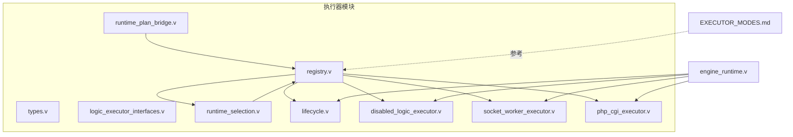
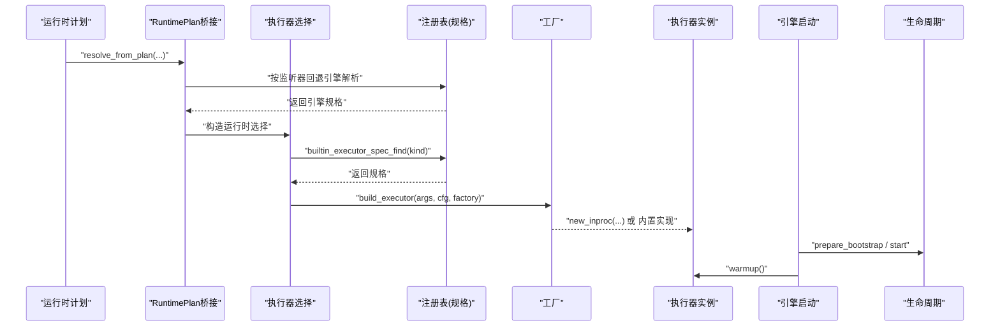
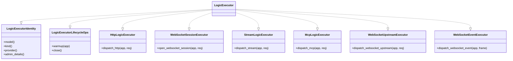
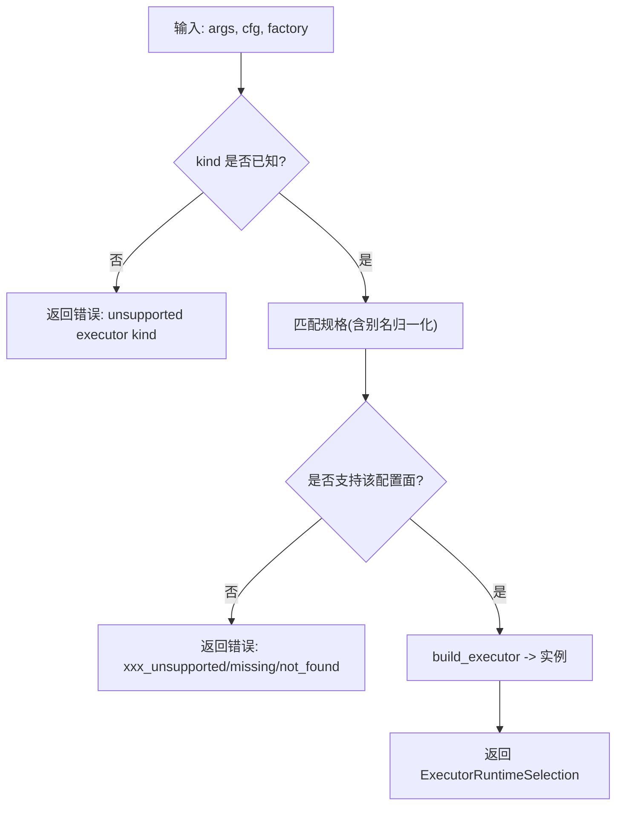
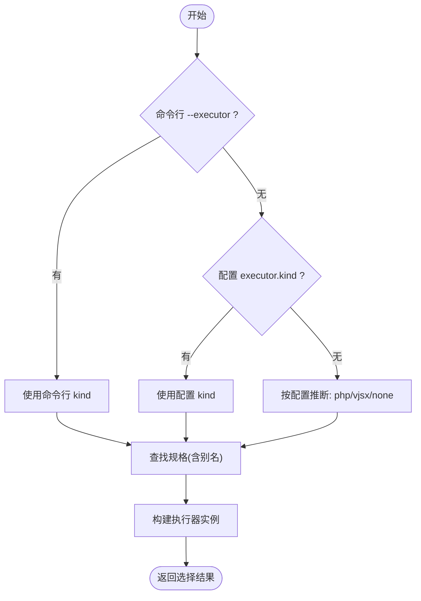
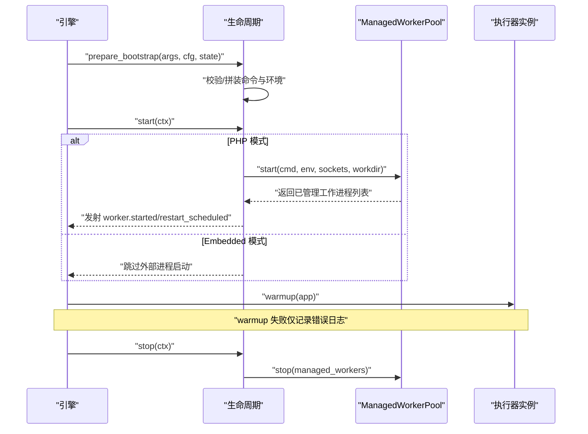
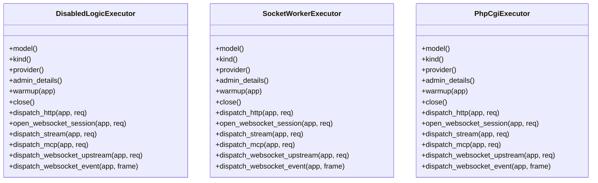
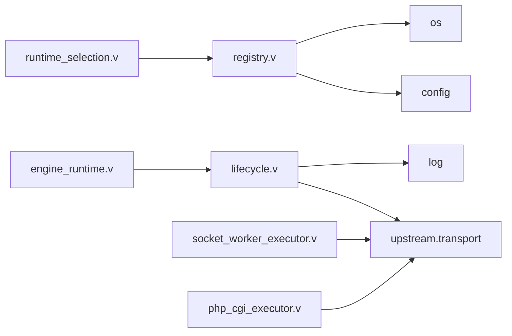

# 执行器框架设计

<cite>
**本文引用的文件**   
- [src/executor/types.v](file://src/executor/types.v)
- [src/executor/logic_executor_interfaces.v](file://src/executor/logic_executor_interfaces.v)
- [src/executor/registry.v](file://src/executor/registry.v)
- [src/executor/runtime_selection.v](file://src/executor/runtime_selection.v)
- [src/executor/lifecycle.v](file://src/executor/lifecycle.v)
- [src/executor/disabled_logic_executor.v](file://src/executor/disabled_logic_executor.v)
- [src/executor/socket_worker_executor.v](file://src/executor/socket_worker_executor.v)
- [src/executor/php_cgi_executor.v](file://src/executor/php_cgi_executor.v)
- [src/engine_runtime.v](file://src/engine_runtime.v)
- [src/executor/runtime_plan_bridge.v](file://src/executor/runtime_plan_bridge.v)
- [docs/EXECUTOR_MODES.md](file://docs/EXECUTOR_MODES.md)
</cite>

## 目录
1. [引言](#引言)
2. [项目结构](#项目结构)
3. [核心组件](#核心组件)
4. [架构总览](#架构总览)
5. [详细组件分析](#详细组件分析)
6. [依赖分析](#依赖分析)
7. [性能考虑](#性能考虑)
8. [故障排查指南](#故障排查指南)
9. [结论](#结论)
10. [附录](#附录)

## 引言
本文件系统性解析 VHTTPD 执行器框架（Executor Framework）的设计与实现，重点覆盖：
- 执行器注册表的动态管理机制（插件式加载、依赖解析、冲突检测）
- 执行器选择算法（基于配置的匹配、负载均衡策略、健康检查集成）
- 执行器生命周期管理（预热、热重载、优雅退出）
- 执行器接口定义与抽象基类的设计模式
- 自定义执行器开发示例、性能调优与监控集成
- 最佳实践与常见问题解决方案

## 项目结构
执行器相关代码集中在 src/executor 模块，配合运行时引擎与配置系统完成从“声明式计划”到“可运行执行器实例”的构建。关键文件职责如下：
- types.v：统一的数据模型与分发上下文类型
- logic_executor_interfaces.v：执行器能力接口集合
- registry.v：内置执行器规格、工厂与配置面映射
- runtime_selection.v：按命令行与配置推断并选择具体执行器
- lifecycle.v：执行器生命周期钩子（准备、启动、停止）
- disabled/socket_worker/php_cgi_executor.v：内置执行器实现
- engine_runtime.v：引擎启动流程中的预热与附加执行器启动
- runtime_plan_bridge.v：将运行时计划投影为执行器运行时配置
- EXECUTOR_MODES.md：执行器模式说明文档

图表来源
- [src/executor/registry.v:1-128](file://src/executor/registry.v#L1-L128)
- [src/executor/runtime_selection.v:1-31](file://src/executor/runtime_selection.v#L1-L31)
- [src/executor/lifecycle.v:1-179](file://src/executor/lifecycle.v#L1-L179)
- [src/executor/disabled_logic_executor.v:1-81](file://src/executor/disabled_logic_executor.v#L1-L81)
- [src/executor/socket_worker_executor.v:1-157](file://src/executor/socket_worker_executor.v#L1-L157)
- [src/executor/php_cgi_executor.v:1-118](file://src/executor/php_cgi_executor.v#L1-L118)
- [src/executor/runtime_plan_bridge.v:1-18](file://src/executor/runtime_plan_bridge.v#L1-L18)
- [src/engine_runtime.v:32-51](file://src/engine_runtime.v#L32-L51)
- [docs/EXECUTOR_MODES.md:1-56](file://docs/EXECUTOR_MODES.md#L1-L56)

章节来源
- [src/executor/types.v:1-449](file://src/executor/types.v#L1-L449)
- [src/executor/logic_executor_interfaces.v:1-51](file://src/executor/logic_executor_interfaces.v#L1-L51)
- [src/executor/registry.v:1-387](file://src/executor/registry.v#L1-L387)
- [src/executor/runtime_selection.v:1-31](file://src/executor/runtime_selection.v#L1-L31)
- [src/executor/lifecycle.v:1-179](file://src/executor/lifecycle.v#L1-L179)
- [src/executor/disabled_logic_executor.v:1-81](file://src/executor/disabled_logic_executor.v#L1-L81)
- [src/executor/socket_worker_executor.v:1-157](file://src/executor/socket_worker_executor.v#L1-L157)
- [src/executor/php_cgi_executor.v:1-118](file://src/executor/php_cgi_executor.v#L1-L118)
- [src/engine_runtime.v:32-51](file://src/engine_runtime.v#L32-L51)
- [src/executor/runtime_plan_bridge.v:1-18](file://src/executor/runtime_plan_bridge.v#L1-L18)
- [docs/EXECUTOR_MODES.md:1-56](file://docs/EXECUTOR_MODES.md#L1-L56)

## 核心组件
- 执行器接口族：通过组合多个能力接口（HTTP、WebSocket、流式、MCP、事件等）形成统一的 LogicExecutor 聚合接口，屏蔽不同宿主差异。
- 执行器规格与注册表：以 BuiltinLogicExecutorSpec 描述 kind、别名、provider、模型、后端模式、生命周期、工厂与配置面；提供查找、构建、运行时选择等方法。
- 运行时选择：根据命令行参数与配置推断 kind，再查表得到具体执行器实例与生命周期。
- 生命周期：prepare_bootstrap/start/stop 三段式，负责工作进程池初始化、命令拼装、事件发射与优雅关闭。
- 内置实现：Disabled、SocketWorker（PHP Worker）、PhpCgi（FastCGI），以及通过工厂注入的 In-Process Vjsx。

章节来源
- [src/executor/logic_executor_interfaces.v:1-51](file://src/executor/logic_executor_interfaces.v#L1-L51)
- [src/executor/registry.v:42-128](file://src/executor/registry.v#L42-L128)
- [src/executor/runtime_selection.v:12-31](file://src/executor/runtime_selection.v#L12-L31)
- [src/executor/lifecycle.v:20-42](file://src/executor/lifecycle.v#L20-L42)
- [src/executor/disabled_logic_executor.v:1-81](file://src/executor/disabled_logic_executor.v#L1-L81)
- [src/executor/socket_worker_executor.v:1-157](file://src/executor/socket_worker_executor.v#L1-L157)
- [src/executor/php_cgi_executor.v:1-118](file://src/executor/php_cgi_executor.v#L1-L118)

## 架构总览
下图展示从“运行时计划”到“执行器实例”的选择与构建路径，以及引擎启动时的预热流程。

图表来源
- [src/executor/runtime_plan_bridge.v:1-18](file://src/executor/runtime_plan_bridge.v#L1-L18)
- [src/executor/registry.v:138-145](file://src/executor/registry.v#L138-L145)
- [src/executor/registry.v:263-286](file://src/executor/registry.v#L263-L286)
- [src/executor/runtime_selection.v:23-31](file://src/executor/runtime_selection.v#L23-L31)
- [src/engine_runtime.v:32-51](file://src/engine_runtime.v#L32-L51)

## 详细组件分析

### 执行器接口与数据模型
- 接口族：
  - LogicExecutorIdentity：标识（model/kind/provider/admin_details）
  - LogicExecutorLifecycleOps：warmup/close
  - HttpLogicExecutor：HTTP 请求分发
  - WebSocketSessionExecutor：WS 会话建立
  - StreamLogicExecutor/McpLogicExecutor/WebSocketUpstreamExecutor/WebSocketEventExecutor：其他协议分发
  - LogicExecutor：以上所有能力的组合
- 数据模型：
  - HTTP/WS 分发请求与结果封装
  - 内核分发信封与失败分类
  - 管理统计摘要（HTTP/Worker/Upstream/MCP/Feishu 等）

图表来源
- [src/executor/logic_executor_interfaces.v:1-51](file://src/executor/logic_executor_interfaces.v#L1-L51)
- [src/executor/types.v:1-134](file://src/executor/types.v#L1-L134)

章节来源
- [src/executor/logic_executor_interfaces.v:1-51](file://src/executor/logic_executor_interfaces.v#L1-L51)
- [src/executor/types.v:1-449](file://src/executor/types.v#L1-L449)

### 执行器注册表与动态管理
- 规格清单：内置 none、php、php-cgi、vjsx 四类，分别标注 provider、逻辑模型、worker_backend_mode、生命周期与工厂。
- 别名归一化：支持连字符/下划线混用与大小写不敏感匹配。
- 配置面映射：每种执行器暴露一组 CLI 标志与配置段，用于解析运行时参数。
- 构建与选择：
  - build_executor：按工厂创建具体执行器实例
  - runtime_selection：组装 ExecutorRuntimeSelection（含 executor、worker_backend_mode、lifecycle）
- 冲突检测与错误传播：
  - 不支持的配置面会返回明确错误码（如 embedded_host_missing_app_entry 等）
  - 未知 kind 直接报错，阻止非法选择

图表来源
- [src/executor/registry.v:138-145](file://src/executor/registry.v#L138-L145)
- [src/executor/registry.v:147-162](file://src/executor/registry.v#L147-L162)
- [src/executor/registry.v:263-286](file://src/executor/registry.v#L263-L286)
- [src/executor/registry.v:197-261](file://src/executor/registry.v#L197-L261)

章节来源
- [src/executor/registry.v:65-128](file://src/executor/registry.v#L65-L128)
- [src/executor/registry.v:138-162](file://src/executor/registry.v#L138-L162)
- [src/executor/registry.v:176-261](file://src/executor/registry.v#L176-L261)
- [src/executor/registry.v:263-286](file://src/executor/registry.v#L263-L286)

### 执行器选择算法
- 优先级：命令行 --executor > 配置 executor.kind > 自动推断（依据 php/vjsx 配置项是否存在）
- 自动推断规则：
  - 若存在 php.worker_entry 或 php.app_entry，则选择 php
  - 若存在 vjsx.app_entry/module_root/build_root 任一，则选择 vjsx
  - 否则回退 none
- 选择结果包含：
  - executor：具体执行器实例
  - worker_backend_mode：required/disabled
  - lifecycle：对应宿主的生命周期对象

图表来源
- [src/executor/runtime_selection.v:12-31](file://src/executor/runtime_selection.v#L12-L31)
- [src/executor/registry.v:138-145](file://src/executor/registry.v#L138-L145)

章节来源
- [src/executor/runtime_selection.v:12-31](file://src/executor/runtime_selection.v#L12-L31)

### 生命周期管理（预热、热重载、优雅退出）
- prepare_bootstrap：
  - PHP 系列：拼装 worker 命令与环境变量，校验入口与扩展路径
  - Embedded/Vjsx：清空 worker 相关状态
- start：
  - PHP 系列：按需启动 ManagedWorkerPool，发射 worker.started/restart_scheduled 等事件
  - Embedded/Vjsx：无外部进程启动
- stop：
  - 统一调用 ManagedWorkerPool.stop 进行优雅关闭
- 引擎启动预热：
  - 主执行器与附加执行器均会调用 warmup，失败仅记录日志，不影响整体存活

图表来源
- [src/executor/lifecycle.v:84-135](file://src/executor/lifecycle.v#L84-L135)
- [src/executor/lifecycle.v:158-178](file://src/executor/lifecycle.v#L158-L178)
- [src/engine_runtime.v:32-51](file://src/engine_runtime.v#L32-L51)

章节来源
- [src/executor/lifecycle.v:20-42](file://src/executor/lifecycle.v#L20-L42)
- [src/executor/lifecycle.v:84-135](file://src/executor/lifecycle.v#L84-L135)
- [src/executor/lifecycle.v:158-178](file://src/executor/lifecycle.v#L158-L178)
- [src/engine_runtime.v:32-51](file://src/engine_runtime.v#L32-L51)

### 内置执行器实现要点
- DisabledLogicExecutor：占位实现，所有分发方法返回禁用错误，便于测试与灰度。
- SocketWorkerExecutor：
  - HTTP：通过 Unix Socket 与 PHP Worker 通信，支持响应/流/上游计划三种结果
  - WS：建立会话后返回 socket_path 与连接句柄
  - 其他协议：委托给对应的 dispatch 端口
- PhpCgiExecutor：
  - HTTP：通过 FastCGI 协议与 php-cgi 交互，不支持 WS/Stream/MCP 等高级特性

图表来源
- [src/executor/disabled_logic_executor.v:1-81](file://src/executor/disabled_logic_executor.v#L1-L81)
- [src/executor/socket_worker_executor.v:1-157](file://src/executor/socket_worker_executor.v#L1-L157)
- [src/executor/php_cgi_executor.v:1-118](file://src/executor/php_cgi_executor.v#L1-L118)

章节来源
- [src/executor/disabled_logic_executor.v:1-81](file://src/executor/disabled_logic_executor.v#L1-L81)
- [src/executor/socket_worker_executor.v:1-157](file://src/executor/socket_worker_executor.v#L1-L157)
- [src/executor/php_cgi_executor.v:1-118](file://src/executor/php_cgi_executor.v#L1-L118)

### 自定义执行器开发指南（示例路径）
- 步骤概览
  1) 实现接口族：在自定义模块中实现 LogicExecutor 及其能力接口
  2) 注册规格：在注册表中新增 BuiltinLogicExecutorSpec，指定 kind、aliases、provider、模型、后端模式、生命周期与工厂
  3) 实现生命周期：在 lifecycle 中提供 prepare_bootstrap/start/stop 钩子
  4) 暴露配置面：在 config_surface 中声明 CLI 标志与配置段映射
  5) 构建工厂：在 ExecutorFactory 中注入 new_inproc 或其他构建函数
- 参考路径（不含代码内容）
  - 接口定义与组合：[src/executor/logic_executor_interfaces.v:1-51](file://src/executor/logic_executor_interfaces.v#L1-L51)
  - 规格与工厂：[src/executor/registry.v:27-40](file://src/executor/registry.v#L27-L40), [src/executor/registry.v:42-128](file://src/executor/registry.v#L42-L128)
  - 生命周期钩子：[src/executor/lifecycle.v:20-42](file://src/executor/lifecycle.v#L20-L42)
  - 配置面解析：[src/executor/registry.v:176-261](file://src/executor/registry.v#L176-L261)
  - 选择与构建：[src/executor/runtime_selection.v:23-31](file://src/executor/runtime_selection.v#L23-L31), [src/executor/registry.v:263-286](file://src/executor/registry.v#L263-L286)

章节来源
- [src/executor/logic_executor_interfaces.v:1-51](file://src/executor/logic_executor_interfaces.v#L1-L51)
- [src/executor/registry.v:27-40](file://src/executor/registry.v#L27-L40)
- [src/executor/registry.v:42-128](file://src/executor/registry.v#L42-L128)
- [src/executor/registry.v:176-261](file://src/executor/registry.v#L176-L261)
- [src/executor/registry.v:263-286](file://src/executor/registry.v#L263-L286)
- [src/executor/runtime_selection.v:23-31](file://src/executor/runtime_selection.v#L23-L31)
- [src/executor/lifecycle.v:20-42](file://src/executor/lifecycle.v#L20-L42)

## 依赖分析
- 模块耦合
  - registry 依赖 config/os，并通过工厂解耦 main 循环引用
  - runtime_selection 依赖 registry 与 config
  - lifecycle 依赖 upstream.transport 与 log
  - 各执行器实现依赖 transport 编解码与 unix socket
- 外部依赖点
  - ManagedWorkerPool：工作进程池管理与重启策略
  - FastCGI/WorkerFrameCodec：协议编解码
  - 事件发射：生命周期中通过 emit 上报 worker 状态

图表来源
- [src/executor/registry.v:1-10](file://src/executor/registry.v#L1-L10)
- [src/executor/runtime_selection.v:1-4](file://src/executor/runtime_selection.v#L1-L4)
- [src/executor/lifecycle.v:1-6](file://src/executor/lifecycle.v#L1-L6)
- [src/executor/socket_worker_executor.v:1-7](file://src/executor/socket_worker_executor.v#L1-L7)
- [src/executor/php_cgi_executor.v:1-6](file://src/executor/php_cgi_executor.v#L1-L6)
- [src/engine_runtime.v:32-51](file://src/engine_runtime.v#L32-L51)

章节来源
- [src/executor/registry.v:1-10](file://src/executor/registry.v#L1-L10)
- [src/executor/runtime_selection.v:1-4](file://src/executor/runtime_selection.v#L1-L4)
- [src/executor/lifecycle.v:1-6](file://src/executor/lifecycle.v#L1-L6)
- [src/executor/socket_worker_executor.v:1-7](file://src/executor/socket_worker_executor.v#L1-L7)
- [src/executor/php_cgi_executor.v:1-6](file://src/executor/php_cgi_executor.v#L1-L6)
- [src/engine_runtime.v:32-51](file://src/engine_runtime.v#L32-L51)

## 性能考虑
- 工作进程池
  - 合理设置 pool_size、read_timeout_ms、max_requests、restart_backoff_* 等参数，避免频繁重启与拥塞
  - 观察 worker.started/restart_scheduled 事件，定位不稳定节点
- 流式与长连接
  - SocketWorkerExecutor 支持流式响应与上游计划，注意超时与背压
  - 对高并发场景建议启用 lane/thread 并行（Vjsx 线程数）
- 资源隔离
  - 通过 enable_fs/enable_process/enable_network 控制沙箱能力，降低越权风险
- 监控指标
  - AdminRuntimeStats/AdminWorkerPoolSummary 等结构可用于导出 Prometheus/Grafana 指标

章节来源
- [docs/EXECUTOR_MODES.md:25-56](file://docs/EXECUTOR_MODES.md#L25-L56)
- [src/executor/types.v:95-164](file://src/executor/types.v#L95-L164)
- [src/executor/socket_worker_executor.v:43-95](file://src/executor/socket_worker_executor.v#L43-L95)

## 故障排查指南
- 常见错误与定位
  - unsupported executor kind：检查 kind 与别名是否正确
  - embedded_host_missing_app_entry/inproc_vjsx_executor_app_entry_not_found：确认 vjsx.app_entry 路径有效
  - php_worker_entry_missing/php_app_entry_not_found/php_extension_not_found：核对 PHP 入口与扩展路径
  - logic_executor_disabled：确认未误选 none/disabled
- 诊断手段
  - 查看 admin 端点的执行器规格快照与运行时摘要
  - 关注生命周期事件：worker.started、worker.restart_scheduled、server.stopped 等
  - 结合日志中 warmup failed 的错误信息定位应用侧问题

章节来源
- [src/executor/registry.v:138-145](file://src/executor/registry.v#L138-L145)
- [src/executor/registry.v:197-261](file://src/executor/registry.v#L197-L261)
- [src/executor/lifecycle.v:97-135](file://src/executor/lifecycle.v#L97-L135)
- [src/engine_runtime.v:32-51](file://src/engine_runtime.v#L32-L51)

## 结论
VHTTPD 执行器框架通过“规格+工厂+生命周期”的清晰分层，实现了多宿主执行器的统一接入与灵活编排。注册表提供别名归一化与配置面映射，选择算法兼顾命令行与配置推断，生命周期贯穿预热与优雅退出。内置实现覆盖了 PHP Worker、FastCGI 与嵌入式 Vjsx 三大典型模式，满足从传统 Web 到现代流式/事件驱动场景的需求。

## 附录
- 执行器模式速览
  - PHP 模式：适合现有 PHP 生态，通过 Unix Socket 与独立进程通信
  - Vjsx 模式：嵌入式执行，低延迟、易调试，适合 JS/TS 应用
  - 参考文档：[docs/EXECUTOR_MODES.md:1-56](file://docs/EXECUTOR_MODES.md#L1-L56)

章节来源
- [docs/EXECUTOR_MODES.md:1-56](file://docs/EXECUTOR_MODES.md#L1-L56)