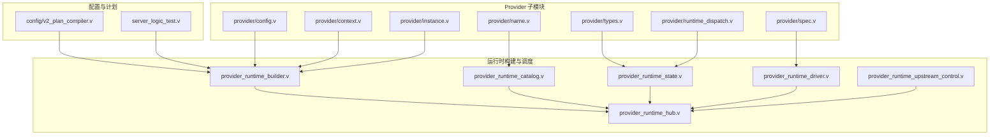
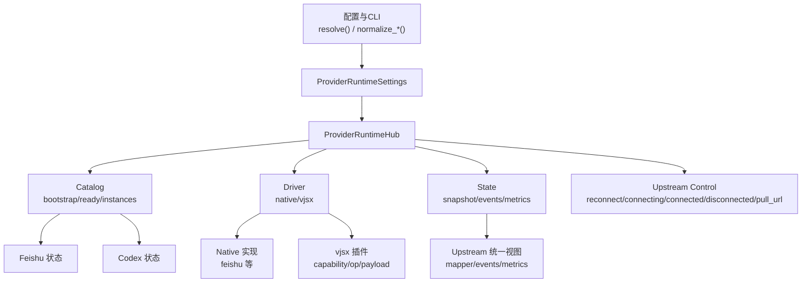
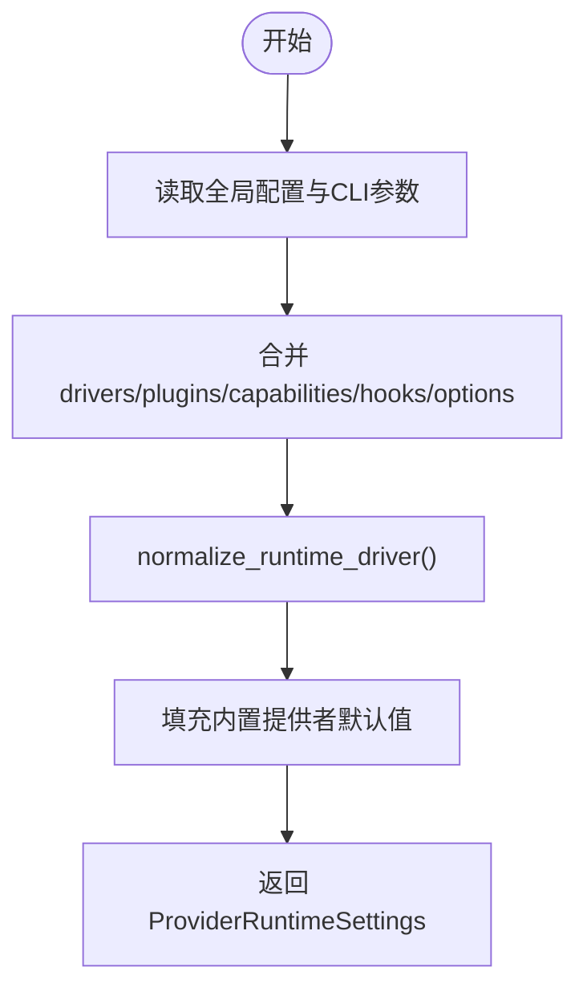
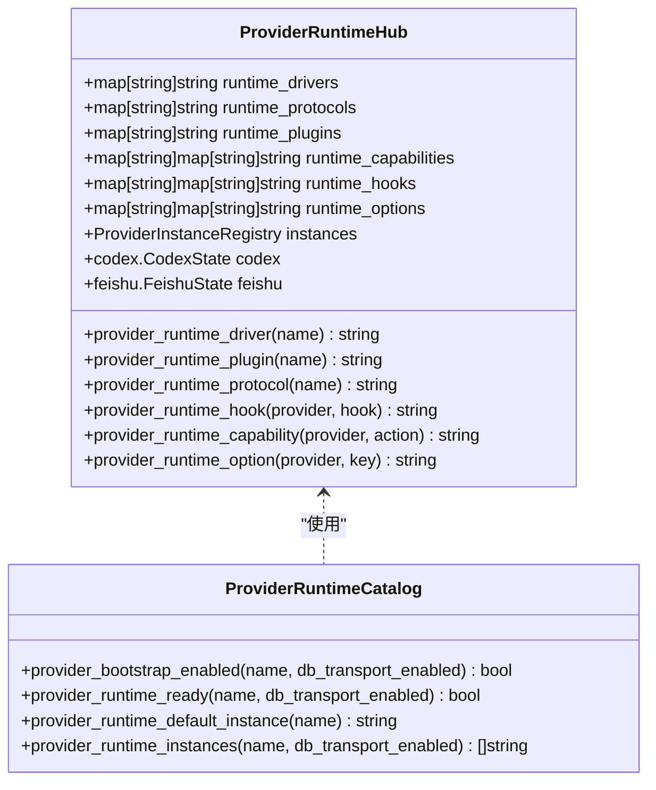
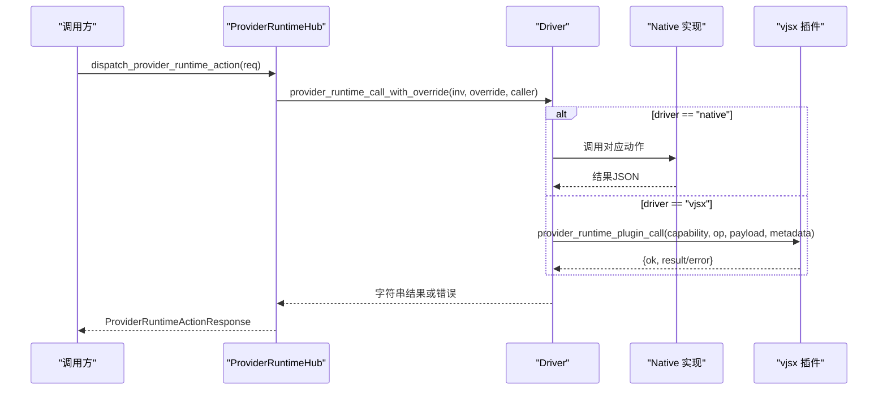
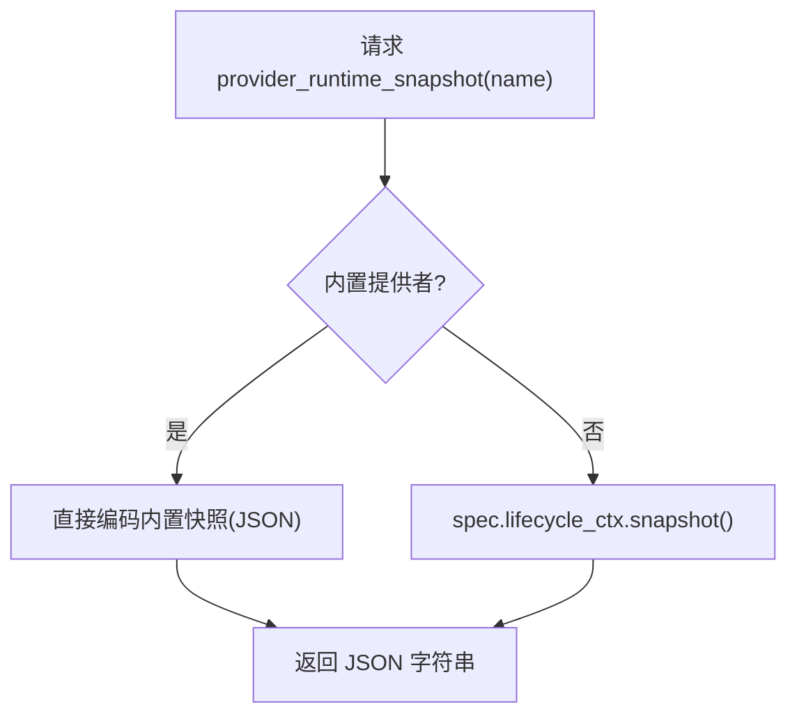
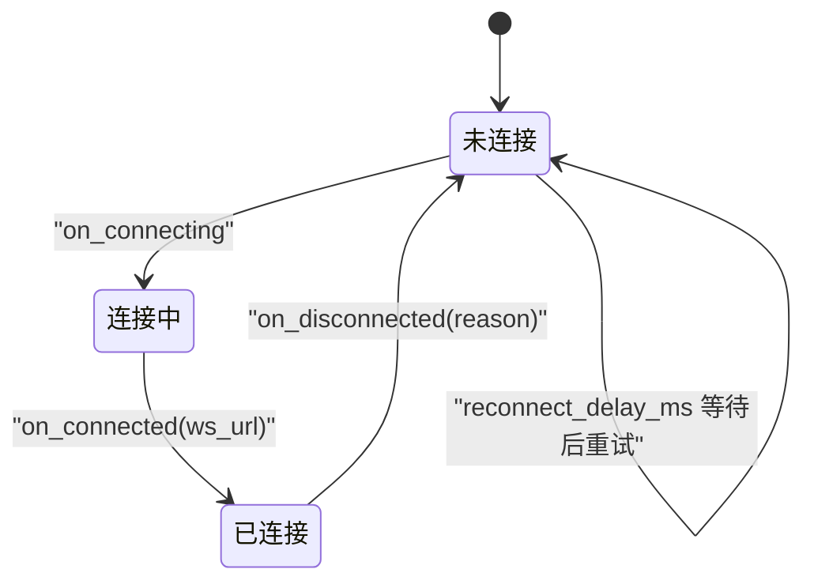
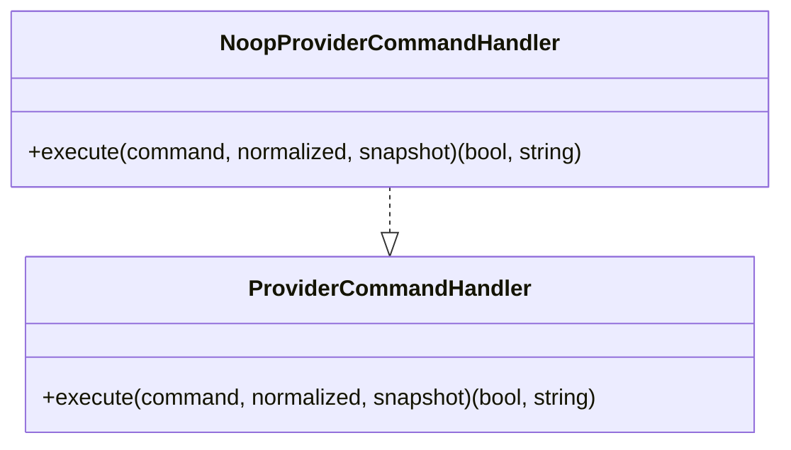
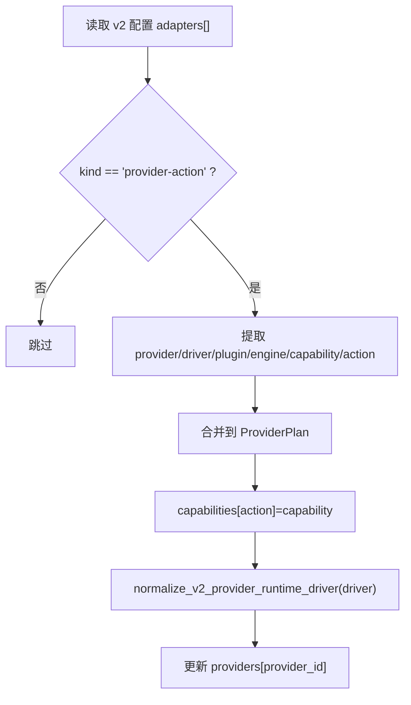
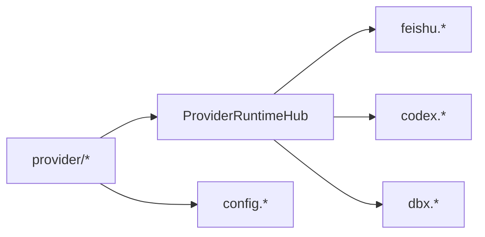

# 提供者系统设计

<cite>
**本文引用的文件**   
- [README.md](file://README.md)
- [src/provider/config.v](file://src/provider/config.v)
- [src/provider/context.v](file://src/provider/context.v)
- [src/provider/instance.v](file://src/provider/instance.v)
- [src/provider/name.v](file://src/provider/name.v)
- [src/provider/runtime_dispatch.v](file://src/provider/runtime_dispatch.v)
- [src/provider/types.v](file://src/provider/types.v)
- [src/provider/spec.v](file://src/provider/spec.v)
- [src/provider_runtime_builder.v](file://src/provider_runtime_builder.v)
- [src/provider_runtime_catalog.v](file://src/provider_runtime_catalog.v)
- [src/provider_runtime_driver.v](file://src/provider_runtime_driver.v)
- [src/provider_runtime_hub.v](file://src/provider_runtime_hub.v)
- [src/provider_runtime_state.v](file://src/provider_runtime_state.v)
- [src/provider_runtime_upstream_control.v](file://src/provider_runtime_upstream_control.v)
- [src/config/v2_plan_compiler.v](file://src/config/v2_plan_compiler.v)
- [src/server_logic_test.v](file://src/server_logic_test.v)
</cite>

## 目录
1. [引言](#引言)
2. [项目结构](#项目结构)
3. [核心组件](#核心组件)
4. [架构总览](#架构总览)
5. [详细组件分析](#详细组件分析)
6. [依赖关系分析](#依赖关系分析)
7. [性能与可扩展性](#性能与可扩展性)
8. [故障排查指南](#故障排查指南)
9. [结论](#结论)
10. [附录：自定义提供者开发与实践](#附录自定义提供者开发与实践)

## 引言
本文件系统性解析 VHTTPD 的“提供者系统(Provider)”设计与实现，覆盖以下关键主题：
- 提供者注册与发现机制（动态加载、能力声明、版本兼容性）
- 提供者生命周期管理（启动初始化、运行监控、优雅关闭）
- 提供者规格定义(Spec)与 DSL 语法及验证规则
- 运行时构建器(Runtime Builder)的配置驱动创建过程
- 自定义提供者开发示例、错误处理与故障恢复
- 扩展点使用指南与最佳实践

VHTTPD 将“提供者”视为对外部或内嵌能力的统一抽象，通过运行时 Hub 进行调度、编排与观测。当前内置提供者包括飞书(feishu)、Codex、数据库(db)、缓存(cache)等，并通过原生(native)与 vjsx 两种驱动执行动作。

## 项目结构
围绕 Provider 的核心代码主要分布在 provider 子模块与运行时构建/调度相关文件中：
- provider 子模块：配置、上下文、实例、名称常量、类型、分发映射、Spec 接口
- 运行时构建与目录：Hub、Builder、Catalog、Driver、State、Upstream Control
- 配置编译：v2 Plan 编译器对 provider-action 适配器的合并与能力注入
- 测试用例：验证运行时能力、协议、插件、钩子的装配结果

图表来源
- [src/provider/config.v:1-315](file://src/provider/config.v#L1-L315)
- [src/provider/context.v:1-20](file://src/provider/context.v#L1-L20)
- [src/provider/instance.v:1-66](file://src/provider/instance.v#L1-L66)
- [src/provider/name.v:1-31](file://src/provider/name.v#L1-L31)
- [src/provider/types.v:1-118](file://src/provider/types.v#L1-L118)
- [src/provider/runtime_dispatch.v:1-271](file://src/provider/runtime_dispatch.v#L1-L271)
- [src/provider/spec.v:1-40](file://src/provider/spec.v#L1-L40)
- [src/provider_runtime_hub.v:1-22](file://src/provider_runtime_hub.v#L1-L22)
- [src/provider_runtime_builder.v:1-133](file://src/provider_runtime_builder.v#L1-L133)
- [src/provider_runtime_catalog.v:1-124](file://src/provider_runtime_catalog.v#L1-L124)
- [src/provider_runtime_driver.v:1-195](file://src/provider_runtime_driver.v#L1-L195)
- [src/provider_runtime_state.v:1-128](file://src/provider_runtime_state.v#L1-L128)
- [src/provider_runtime_upstream_control.v:1-92](file://src/provider_runtime_upstream_control.v#L1-L92)
- [src/config/v2_plan_compiler.v:227-270](file://src/config/v2_plan_compiler.v#L227-L270)
- [src/server_logic_test.v:2515-2553](file://src/server_logic_test.v#L2515-L2553)

章节来源
- [README.md:1-800](file://README.md#L1-L800)

## 核心组件
- 运行时设置与归一化
  - ProviderRuntimeSettings 聚合各提供者的运行时开关、驱动、协议、插件、能力、钩子与选项；并提供 resolve() 从全局配置与 CLI 参数合成最终设置。
  - normalize_runtime_driver() 将多种别名归一为 native 或 vjsx。
- 运行时 Hub
  - ProviderRuntimeHub 持有驱动/协议/插件/能力/钩子/选项映射、实例注册表以及内置状态(feishu/codex)。
  - 提供查询方法：driver、plugin、protocol、hook、capability、option。
- 运行时目录(Catalog)
  - 根据配置与实例决定某提供者是否可引导、是否就绪、默认实例与实例列表。
- 运行时驱动(Driver)
  - 基于 driver 选择 native 或 vjsx 路径；native 直接调用内部实现，vjsx 通过插件能力调用。
- 运行时状态(State)
  - 暴露快照、上游连接状态、事件、指标等观测面。
- 上游控制(Upstream Control)
  - 重连延迟、连接/断开回调、拉取 URL 等。
- 分发映射(RunTime Dispatch)
  - 将具体提供者的快照/事件映射到统一的 upstream 视图，便于通用 API 消费。
- 实例管理(Instance)
  - 以 provider/instance 为键维护期望配置与时间戳，支持 upsert/get/list。
- 名称常量(Name)
  - 提供 feishu/codex/ollama/db/cache 等常量与默认实例名。
- 规格接口(Spec)
  - ProviderCommandHandler 接口用于桥接提供者命令执行；NoopProviderCommandHandler 提供安全默认行为。

章节来源
- [src/provider/config.v:74-229](file://src/provider/config.v#L74-L229)
- [src/provider/config.v:298-314](file://src/provider/config.v#L298-L314)
- [src/provider_runtime_hub.v:7-22](file://src/provider_runtime_hub.v#L1-L22)
- [src/provider_runtime_builder.v:7-99](file://src/provider_runtime_builder.v#L1-L99)
- [src/provider_runtime_catalog.v:6-124](file://src/provider_runtime_catalog.v#L1-L124)
- [src/provider_runtime_driver.v:48-195](file://src/provider_runtime_driver.v#L1-L195)
- [src/provider_runtime_state.v:8-128](file://src/provider_runtime_state.v#L1-L128)
- [src/provider_runtime_upstream_control.v:5-92](file://src/provider_runtime_upstream_control.v#L1-L92)
- [src/provider/runtime_dispatch.v:1-271](file://src/provider/runtime_dispatch.v#L1-L271)
- [src/provider/instance.v:1-66](file://src/provider/instance.v#L1-L66)
- [src/provider/name.v:1-31](file://src/provider/name.v#L1-L31)
- [src/provider/spec.v:1-40](file://src/provider/spec.v#L1-L40)

## 架构总览
下图展示了 Provider 在应用中的位置与交互：配置层生成运行时设置，Hub 作为中枢协调驱动、插件与状态；Driver 负责按驱动类型路由到 native 或 vjsx；Catalog 提供引导/就绪/实例决策；State 提供观测面；Upstream Control 管理长连接生命周期。

图表来源
- [src/provider/config.v:74-229](file://src/provider/config.v#L74-L229)
- [src/provider_runtime_builder.v:7-99](file://src/provider_runtime_builder.v#L1-L99)
- [src/provider_runtime_catalog.v:6-124](file://src/provider_runtime_catalog.v#L1-L124)
- [src/provider_runtime_driver.v:48-195](file://src/provider_runtime_driver.v#L1-L195)
- [src/provider_runtime_state.v:8-128](file://src/provider_runtime_state.v#L1-L128)
- [src/provider_runtime_upstream_control.v:5-92](file://src/provider_runtime_upstream_control.v#L1-L92)
- [src/provider/runtime_dispatch.v:155-271](file://src/provider/runtime_dispatch.v#L155-L271)

## 详细组件分析

### 运行时设置与归一化（配置驱动）
- 作用：从全局配置与 CLI 参数合成 ProviderRuntimeSettings，并归一化驱动名、数据库驱动、默认值等。
- 关键点：
  - runtime_drivers/runtime_plugins/runtime_capabilities/runtime_hooks/runtime_options 由配置与适配器合并而来。
  - normalize_runtime_driver() 将 'native'/'v'/'builtin' 归一为 'native'，将 'vjsx'/'js'/'javascript'/'typescript'/'ts' 归一为 'vjsx'。
  - 针对 feishu/codex/db 等内置提供者填充默认值与可选覆盖。

图表来源
- [src/provider/config.v:74-229](file://src/provider/config.v#L74-L229)
- [src/provider/config.v:298-314](file://src/provider/config.v#L298-L314)

章节来源
- [src/provider/config.v:74-229](file://src/provider/config.v#L74-L229)
- [src/provider/config.v:298-314](file://src/provider/config.v#L298-L314)

### 运行时构建器与目录（注册与发现）
- 构建器(Builder)
  - 基于 ProviderRuntimeSettings 初始化 Hub，拷贝驱动/协议/插件/能力/钩子/选项映射，并准备实例注册表与内置状态。
  - 提供查询方法：driver/plugin/protocol/hook/capability/option。
- 目录(Catalog)
  - bootstrap_enabled(name): 判断是否应引导该提供者（如 feishu 有 app 或实例；codex 启用或有实例；db 需传输层与编译支持）。
  - runtime_ready(name): 进一步检查实例集合与启用状态。
  - instances(name): 返回可用实例列表（含默认 main）。

图表来源
- [src/provider_runtime_hub.v:7-22](file://src/provider_runtime_hub.v#L1-L22)
- [src/provider_runtime_builder.v:7-99](file://src/provider_runtime_builder.v#L1-L99)
- [src/provider_runtime_catalog.v:6-124](file://src/provider_runtime_catalog.v#L1-L124)

章节来源
- [src/provider_runtime_builder.v:7-99](file://src/provider_runtime_builder.v#L1-L99)
- [src/provider_runtime_catalog.v:6-124](file://src/provider_runtime_catalog.v#L1-L124)

### 运行时驱动（动作分发与能力映射）
- 入口：dispatch_provider_runtime_action(req, caller) -> provider_runtime_call_with_override(inv, override, caller)
- 驱动选择：
  - 若 override 指定 driver 且满足约束则优先使用，否则回退到 hub 中配置的 driver。
  - native：直接调用内部实现（例如 feishu 的 send/update/upload）。
  - vjsx：通过插件能力调用，capability 由 capability 映射或默认 'provider.${name}.${action}'。
- 错误处理：
  - 缺失 provider/action、未知 driver、vjsx 插件缺失或失败均返回结构化错误。

图表来源
- [src/provider_runtime_driver.v:48-195](file://src/provider_runtime_driver.v#L1-L195)

章节来源
- [src/provider_runtime_driver.v:48-195](file://src/provider_runtime_driver.v#L1-L195)

### 运行时状态与上游视图（观测与诊断）
- 快照：provider_runtime_snapshot(name) 返回 JSON 字符串（内置提供者直接编码，其他提供者通过 spec.lifecycle_ctx.snapshot）。
- 上游视图：provider_runtime_upstream_snapshot(snapshots/events/metrics) 将不同提供者的状态映射为统一的 upstream 视图，便于通用 API 消费。
- 指标：聚合连接尝试、成功、接收帧、已确认事件、发送消息数、发送错误等。

图表来源
- [src/provider_runtime_state.v:8-31](file://src/provider_runtime_state.v#L1-L31)
- [src/provider/runtime_dispatch.v:155-271](file://src/provider/runtime_dispatch.v#L155-L271)

章节来源
- [src/provider_runtime_state.v:8-128](file://src/provider_runtime_state.v#L1-L128)
- [src/provider/runtime_dispatch.v:155-271](file://src/provider/runtime_dispatch.v#L155-L271)

### 上游控制（连接生命周期）
- 重连延迟：provider_runtime_reconnect_delay_ms(name, instance) 返回不同提供者的重连间隔。
- 连接事件：on_connecting/on_connected/on_disconnected 记录状态与原因。
- 拉取URL：provider_runtime_pull_url(name, instance) 返回 WebSocket 端点或上游地址。

图表来源
- [src/provider_runtime_upstream_control.v:5-92](file://src/provider_runtime_upstream_control.v#L1-L92)

章节来源
- [src/provider_runtime_upstream_control.v:5-92](file://src/provider_runtime_upstream_control.v#L1-L92)

### 规格定义(Spec)与命令处理器
- Spec 接口：ProviderCommandHandler.execute(command, normalized, snapshot) 用于桥接提供者特定的命令执行。
- NoopProviderCommandHandler：提供无操作默认实现，保证构造安全与稳定行为。

图表来源
- [src/provider/spec.v:1-40](file://src/provider/spec.v#L1-L40)

章节来源
- [src/provider/spec.v:1-40](file://src/provider/spec.v#L1-L40)

### 配置驱动的 DSL 与能力注入（v2 Plan 编译器）
- 适配器 kind=provider-action 时，会从配置中提取 provider、runtime_driver、runtime_plugin、runtime_engine、capability、action 等字段。
- 将 action 与 capability 映射写入 ProviderPlan.capabilities，供运行时查询。
- 驱动名通过 normalize_v2_provider_runtime_driver 规范化。

图表来源
- [src/config/v2_plan_compiler.v:227-270](file://src/config/v2_plan_compiler.v#L227-L270)

章节来源
- [src/config/v2_plan_compiler.v:227-270](file://src/config/v2_plan_compiler.v#L227-L270)

### 运行时装配验证（测试用例）
- 测试断言了 provider 的 driver、protocol、plugin、capability、hook 等装配结果，确保配置到运行的正确性。

章节来源
- [src/server_logic_test.v:2515-2553](file://src/server_logic_test.v#L2515-L2553)

## 依赖关系分析
- 低耦合高内聚：
  - provider 子模块仅关注数据模型、名称、实例管理与分发映射，不直接依赖主应用。
  - 运行时 Hub 集中管理映射与状态，Driver/Catalog/State/UpstreamControl 各司其职。
- 外部依赖：
  - 内置提供者状态：feishu、codex、dbx 等。
  - 配置模块：config.VhttpdConfig 与 CLI 参数。
- 潜在循环依赖规避：
  - RuntimeContext 通过闭包桥接到主应用，避免 provider 子模块直接导入 main。

图表来源
- [src/provider/context.v:1-20](file://src/provider/context.v#L1-L20)
- [src/provider_runtime_hub.v:7-22](file://src/provider_runtime_hub.v#L1-L22)

章节来源
- [src/provider/context.v:1-20](file://src/provider/context.v#L1-L20)
- [src/provider_runtime_hub.v:7-22](file://src/provider_runtime_hub.v#L1-L22)

## 性能与可扩展性
- 驱动选择开销极低（字符串匹配），native 路径零序列化/反序列化额外成本；vjsx 路径通过插件能力调用，具备跨语言扩展能力。
- 指标聚合采用增量计数，适合高频上报。
- 建议：
  - 对于高频动作，优先 native 驱动以减少序列化与插件调用开销。
  - 合理设置 reconnect_delay_ms，避免雪崩式重连。
  - 使用 capability 映射明确能力边界，便于权限与限流策略落地。

## 故障排查指南
- 常见错误码与定位
  - provider_runtime_missing_provider：缺少 provider 名称。
  - provider_runtime_missing_action:${provider_name}：缺少 action。
  - provider_runtime_unknown_driver:${provider_name}:${driver}：未知驱动。
  - provider_runtime_native_driver_unavailable:${inv.provider}:${inv.action}：native 不可用。
  - provider_runtime_native_action_unavailable:${provider}:${action}：native 不支持的动作。
  - provider_runtime_vjsx_plugin_missing:${provider}：vjsx 插件缺失。
  - provider_runtime_vjsx_driver_failed:${provider}:${action}:${resp.error}：vjsx 插件调用失败。
- 排查步骤
  - 检查配置中的 runtime_drivers/runtime_plugins/runtime_capabilities。
  - 使用 provider_runtime_snapshot 与 provider_runtime_upstream_snapshots 获取状态。
  - 观察 on_connecting/on_connected/on_disconnected 回调日志，结合 reconnect_delay_ms 调整。
  - 校验 v2 Plan 中 provider-action 适配器的 action 与 capability 映射是否正确。

章节来源
- [src/provider_runtime_driver.v:48-195](file://src/provider_runtime_driver.v#L1-L195)
- [src/provider_runtime_state.v:8-128](file://src/provider_runtime_state.v#L1-L128)
- [src/provider_runtime_upstream_control.v:5-92](file://src/provider_runtime_upstream_control.v#L1-L92)

## 结论
VHTTPD 的提供者系统通过“配置驱动 + 运行时 Hub + 多驱动分发 + 统一观测面”的设计，实现了灵活、可扩展、可观测的外部能力集成。当前内置提供者覆盖了即时通讯、AI 会话、数据库与缓存等场景，并通过 v2 Plan 的适配器机制将能力声明与运行时装配解耦，便于后续新增提供者与能力。

## 附录：自定义提供者开发与实践

### 开发步骤概览
- 定义提供者名称与默认实例
  - 在 provider/name.v 中添加名称常量与默认实例名。
- 提供运行时设置
  - 在 provider/config.v 的 ProviderRuntimeSettings 中增加字段，并在 resolve() 中合并默认值与覆盖。
- 注册能力与钩子
  - 通过 v2 Plan 的 provider-action 适配器将 action 映射到 capability，或在配置中直接声明 runtime_capabilities。
- 实现驱动逻辑
  - 若为 native：在 provider_runtime_driver.v 的 native 分支添加新动作处理。
  - 若为 vjsx：编写插件并注册 capability，确保 plugin 名称与 capability 映射一致。
- 接入生命周期与观测
  - 在 provider_runtime_state.v 中补充快照/事件/指标。
  - 在 provider_runtime_upstream_control.v 中补充连接事件与重连策略。
- 验证装配
  - 参考 server_logic_test.v 的断言方式，验证 driver/protocol/plugin/capability/hook 的正确性。

### 错误处理与恢复
- 在 Driver 层捕获并返回结构化错误，便于上层统一处理。
- 使用 on_connecting/on_connected/on_disconnected 记录连接状态与原因，配合 reconnect_delay_ms 实现指数退避或固定间隔重试。
- 通过 provider_runtime_snapshot 与 upstream snapshots/events/metrics 快速定位问题。

### 最佳实践
- 优先使用 capability 映射显式声明能力，避免隐式约定。
- 对高频路径使用 native 驱动，减少序列化与插件调用开销。
- 保持 Spec 接口的最小必要方法集，必要时提供 Noop 实现以保证稳定性。
- 在 v2 Plan 中使用 provider-action 适配器集中管理 action-capability 映射，提升可维护性。