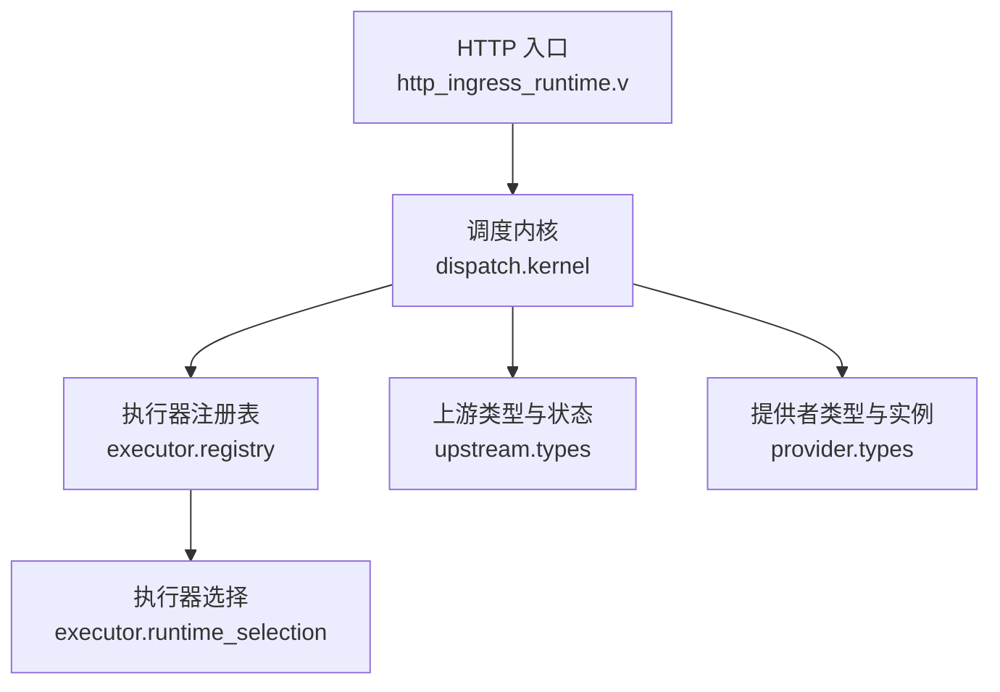
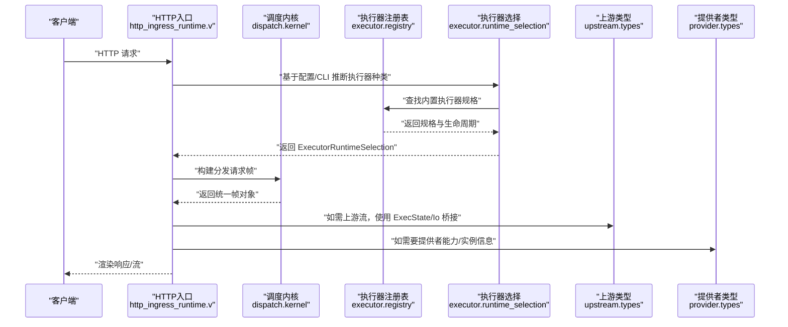
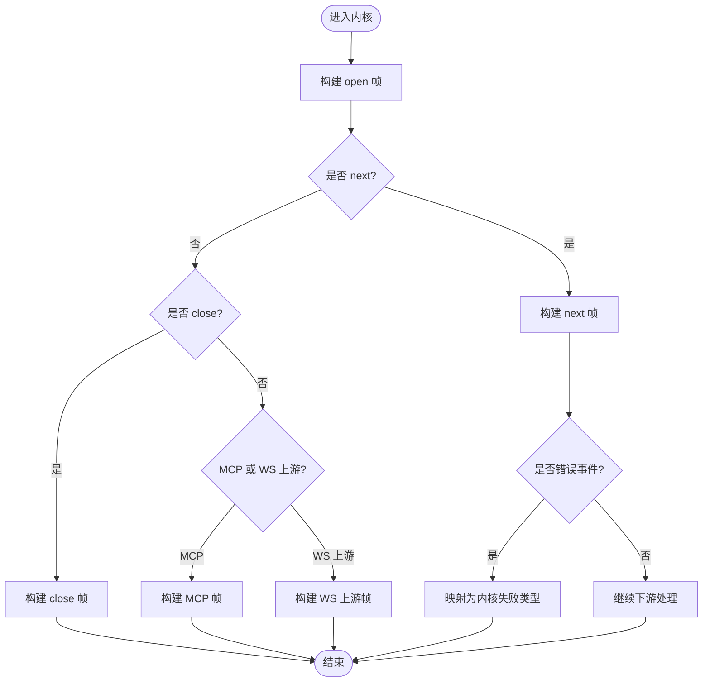
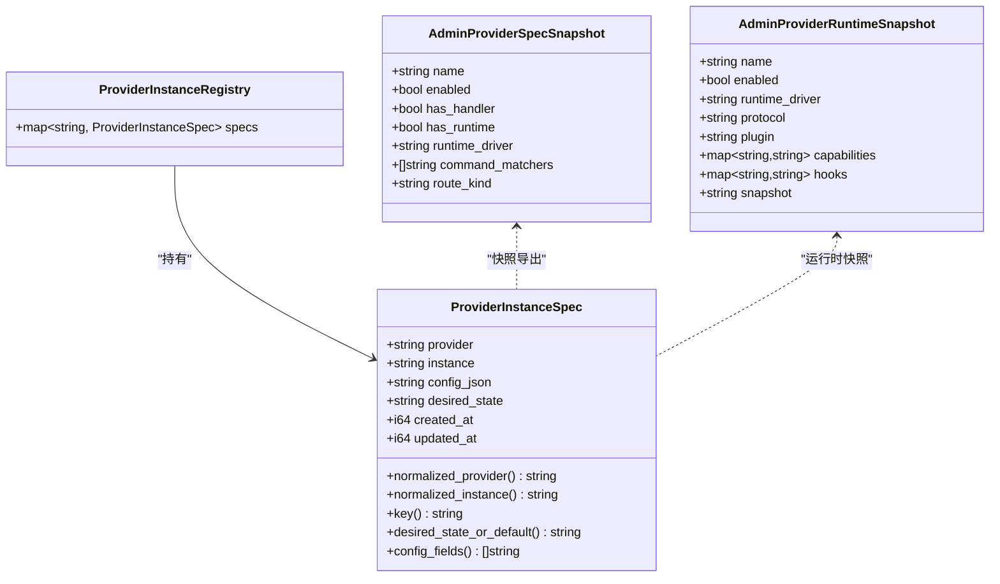
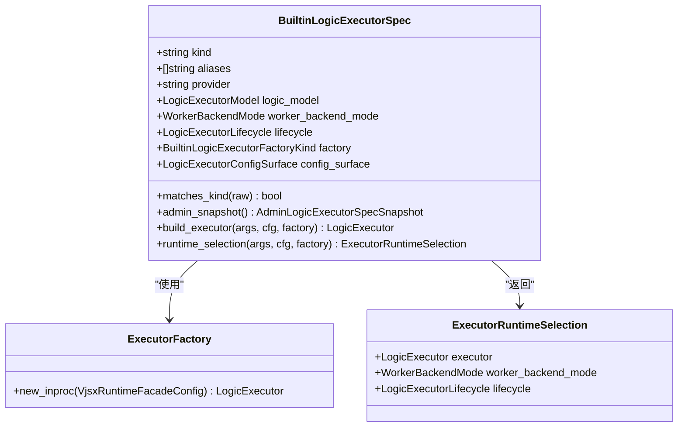
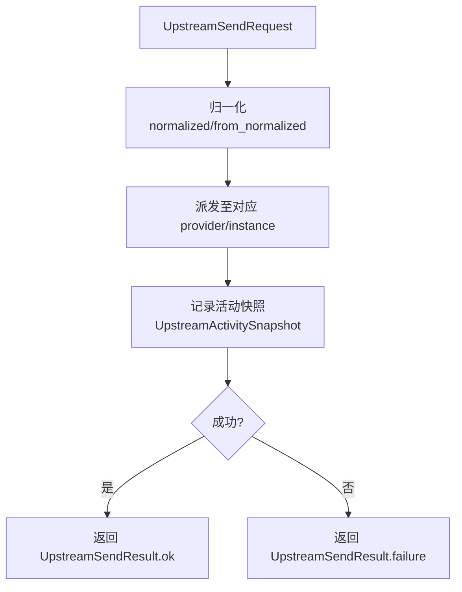
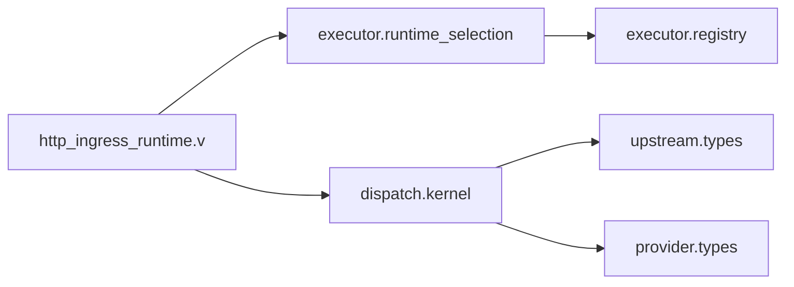

# 组件设计详解

<cite>
**本文引用的文件**   
- [src/dispatch/kernel.v](file://src/dispatch/kernel.v)
- [src/executor/registry.v](file://src/executor/registry.v)
- [src/upstream/types.v](file://src/upstream/types.v)
- [src/provider/types.v](file://src/provider/types.v)
- [src/http_ingress_runtime.v](file://src/http_ingress_runtime.v)
- [src/executor/runtime_selection.v](file://src/executor/runtime_selection.v)
</cite>

## 目录
1. [引言](#引言)
2. [项目结构](#项目结构)
3. [核心组件](#核心组件)
4. [架构总览](#架构总览)
5. [详细组件分析](#详细组件分析)
6. [依赖关系分析](#依赖关系分析)
7. [性能考量](#性能考量)
8. [故障排查指南](#故障排查指南)
9. [结论](#结论)
10. [附录](#附录)

## 引言
本文件聚焦 vhttpd 的核心组件设计与实现，围绕以下目标展开：
- 调度内核（Kernel）的统一分发决策机制：请求路由、模式选择、策略应用
- 提供者系统（Provider）的注册发现、能力协商与生命周期管理
- 执行器注册表（Executor Registry）的动态加载与执行器选择算法
- 上游管理器（Upstream Manager）的连接池、负载均衡与故障转移
- 组件接口定义、数据结构与状态管理
- 结合源码路径的代码示例与最佳实践指导

vhttpd 作为协议与执行宿主，统一承载 HTTP/WebSocket/流式响应与上游流，将 PHP、嵌入式 vjsx、WebSocket 上游等逻辑模型纳入同一运行时。

## 项目结构
从代码组织看，核心模块按职责分层：
- 调度内核与分发：位于 dispatch 子模块，负责构建统一的分发请求帧、错误分类与模式封装
- 执行器注册与选择：位于 executor 子模块，提供内置执行器规格、工厂与运行时选择
- 上游类型与状态：位于 upstream 子模块，定义上游事件、活动快照、发送请求与执行状态
- 提供者类型与实例：位于 provider 子模块，定义提供者规格快照、运行时快照与实例规范
- HTTP 入口与引擎编排：位于 http_ingress_runtime.v，串联管道、缓存、执行器选择与渲染

图表来源
- [src/http_ingress_runtime.v:111-139](file://src/http_ingress_runtime.v#L111-L139)
- [src/dispatch/kernel.v:1-151](file://src/dispatch/kernel.v#L1-L151)
- [src/executor/registry.v:1-128](file://src/executor/registry.v#L1-L128)
- [src/executor/runtime_selection.v:1-30](file://src/executor/runtime_selection.v#L1-L30)
- [src/upstream/types.v:1-128](file://src/upstream/types.v#L1-L128)
- [src/provider/types.v:1-118](file://src/provider/types.v#L1-L118)

章节来源
- [src/http_ingress_runtime.v:111-139](file://src/http_ingress_runtime.v#L111-L139)
- [src/dispatch/kernel.v:1-151](file://src/dispatch/kernel.v#L1-L151)
- [src/executor/registry.v:1-128](file://src/executor/registry.v#L1-L128)
- [src/executor/runtime_selection.v:1-30](file://src/executor/runtime_selection.v#L1-L30)
- [src/upstream/types.v:1-128](file://src/upstream/types.v#L1-L128)
- [src/provider/types.v:1-118](file://src/provider/types.v#L1-L118)

## 核心组件
- 调度内核（Kernel）
  - 职责：统一构建 stream/mcp/websocket_upstream/websocket_dispatch 的分发请求帧；对传输层错误进行分类并映射为内核失败类型；暴露 stream_failure/transport_failure 等辅助函数
  - 关键输出：StreamDispatchRequest、WorkerMcpDispatchRequest、WorkerWebSocketUpstreamDispatchRequest、WorkerWebSocketFrame
- 执行器注册表（Executor Registry）
  - 职责：声明内置执行器规格（none/php/php-cgi/vjsx），提供配置面、工厂构造、运行时选择与生命周期描述
  - 关键输出：BuiltinLogicExecutorSpec、ExecutorRuntimeSelection、AdminLogicExecutorSpecSnapshot
- 上游管理器（Upstream Manager）
  - 职责：定义上游事件/活动/发送请求的数据结构与分页快照；提供标准化归一化与 fixture 发射计划；维护 ExecState 跟踪单次上游流执行
- 提供者系统（Provider）
  - 职责：定义提供者规格快照、运行时快照与实例规范；提供实例键生成、期望状态默认值与配置字段提取

章节来源
- [src/dispatch/kernel.v:1-151](file://src/dispatch/kernel.v#L1-L151)
- [src/executor/registry.v:1-128](file://src/executor/registry.v#L1-L128)
- [src/upstream/types.v:1-128](file://src/upstream/types.v#L1-L128)
- [src/provider/types.v:1-118](file://src/provider/types.v#L1-L118)

## 架构总览
下图展示一次典型 HTTP 请求在 vhttpd 中的流转：入口解析后进入管道，根据执行器选择决定由哪种执行器处理；内核负责将请求转换为统一的分发帧，交由执行器或上游子系统完成实际处理。

图表来源
- [src/http_ingress_runtime.v:111-139](file://src/http_ingress_runtime.v#L111-L139)
- [src/executor/runtime_selection.v:1-30](file://src/executor/runtime_selection.v#L1-L30)
- [src/executor/registry.v:1-128](file://src/executor/registry.v#L1-L128)
- [src/dispatch/kernel.v:1-151](file://src/dispatch/kernel.v#L1-L151)
- [src/upstream/types.v:1-128](file://src/upstream/types.v#L1-L128)
- [src/provider/types.v:1-118](file://src/provider/types.v#L1-L118)

## 详细组件分析

### 调度内核（Kernel）统一分发决策机制
- 请求路由与模式选择
  - 通过 build_stream_open_request/build_stream_next_request/build_stream_close_request 构建流式分发的 open/next/close 三阶段帧
  - 通过 build_mcp_message_request 构建 MCP 消息帧，携带协议版本、accept/content-type、session_id 与 client_capabilities_json
  - 通过 build_websocket_upstream_request_with_event 构建 WebSocket 上游事件帧，包含 provider/instance/event_type/target/target_type/payload/received_at/metadata
  - 通过 build_websocket_dispatch_frame 构建 websocket_dispatch 帧，携带 rooms/member_metadata/room_counts/presence_users 等会话上下文
- 策略应用与错误分类
  - stream_failure 将 transport.StreamDispatchResponse 的错误事件包装为内核失败类型
  - transport_failure 调用底层 classify_worker_backend_error，将错误映射为 status + error_class，便于上层策略判断与重试/降级
- 数据流与状态
  - 所有帧均携带 trace_id/request_id，贯穿整个分发链路，保证可观测性
  - state 字段用于跨 next 调用的上下文传递

图表来源
- [src/dispatch/kernel.v:30-77](file://src/dispatch/kernel.v#L30-L77)
- [src/dispatch/kernel.v:79-98](file://src/dispatch/kernel.v#L79-L98)
- [src/dispatch/kernel.v:100-121](file://src/dispatch/kernel.v#L100-L121)
- [src/dispatch/kernel.v:123-146](file://src/dispatch/kernel.v#L123-L146)
- [src/dispatch/kernel.v:12-28](file://src/dispatch/kernel.v#L12-L28)

章节来源
- [src/dispatch/kernel.v:1-151](file://src/dispatch/kernel.v#L1-L151)

### 提供者系统（Provider）注册发现、能力协商与生命周期
- 注册与发现
  - AdminProviderSpecSnapshot 暴露提供者名称、启用状态、是否具备 handler/runtime、运行时驱动、命令匹配器与路由类型
  - ProviderInstanceRegistry 以 map[string]ProviderInstanceSpec 存储实例规范，key 由 provider_name/instance 规范化生成
- 能力协商
  - AdminProviderRuntimeSnapshot 包含 protocol/plugin/capabilities/hooks/snapshot，用于对外暴露运行时能力与钩子
  - 能力协商在 MCP 场景下体现为 initialize 时保存 client_capabilities_json，并在 admin 详情中可见
- 生命周期管理
  - ProviderInstanceSpec 提供 desired_state_or_default() 默认期望状态为 connected，支持持久化 created_at/updated_at
  - config_fields() 解析 JSON 配置并返回字段列表，便于 UI 展示与校验

图表来源
- [src/provider/types.v:37-100](file://src/provider/types.v#L37-L100)
- [src/provider/types.v:14-35](file://src/provider/types.v#L14-L35)

章节来源
- [src/provider/types.v:1-118](file://src/provider/types.v#L1-L118)

### 执行器注册表（Executor Registry）动态加载与选择算法
- 内置执行器规格
  - none/noop：禁用模式，worker_backend_mode=disabled
  - php/php-worker：外部 PHP worker，worker_backend_mode=required
  - php-cgi：CGI 模式，worker_backend_mode=required
  - vjsx：嵌入式 TS/JS 宿主，worker_backend_mode=disabled
- 动态加载与工厂
  - ExecutorFactory 通过 new_inproc 回调创建 inproc_vjsx 执行器，避免循环依赖
  - build_executor 根据 spec.factory 分支构造具体执行器实例
- 选择算法
  - ExecutorRuntimeSelection.resolve 优先 CLI --executor，其次从配置推断（php 或 vjsx），再查 builtin_executor_spec_find
  - runtime_selection 返回包含 executor、worker_backend_mode、lifecycle 的选择结果

图表来源
- [src/executor/registry.v:42-128](file://src/executor/registry.v#L42-L128)
- [src/executor/registry.v:263-286](file://src/executor/registry.v#L263-L286)
- [src/executor/runtime_selection.v:1-30](file://src/executor/runtime_selection.v#L1-L30)

章节来源
- [src/executor/registry.v:1-128](file://src/executor/registry.v#L1-L128)
- [src/executor/registry.v:263-286](file://src/executor/registry.v#L263-L286)
- [src/executor/runtime_selection.v:1-30](file://src/executor/runtime_selection.v#L1-L30)

### 上游管理器（Upstream Manager）连接池、负载均衡与故障转移
- 数据结构与状态
  - UpstreamSnapshot/UpstreamRuntimeSession 记录上游连接与会话元信息（provider/instance/method/path/transport/codec/mapper/stream_type/source）
  - UpstreamActivitySnapshot 记录活动级处理结果（worker_handled/worker_error/error_class/command_error/commands）
  - ExecState 跟踪单次上游流执行的 IO 桥接、状态码、内容类型、响应头、SSE 事件名、行缓冲与 token 索引
- 发送与归一化
  - UpstreamSendRequest.normalized/from_normalized/from_feishu_command 提供多来源命令到统一发送请求的转换
  - UpstreamFixtureEmitRequest/Plan 提供测试夹具的事件发射计划，便于无真实上游时的端到端验证
- 连接池与负载均衡
  - 当前 types 层未直接实现连接池与负载均衡，更多由上游 transport 与运行时代码负责；types 层提供快照聚合与分页方法（from_sessions/from_events）
- 故障转移
  - 通过 activity 快照中的 worker_error/error_class 与 send/update 结果的 ok/error 字段进行错误诊断与重试策略判定

图表来源
- [src/upstream/types.v:267-299](file://src/upstream/types.v#L267-L299)
- [src/upstream/types.v:239-265](file://src/upstream/types.v#L239-L265)
- [src/upstream/types.v:309-328](file://src/upstream/types.v#L309-L328)

章节来源
- [src/upstream/types.v:1-128](file://src/upstream/types.v#L1-L128)
- [src/upstream/types.v:267-299](file://src/upstream/types.v#L267-L299)
- [src/upstream/types.v:309-328](file://src/upstream/types.v#L309-L328)

### 概念总览
- 统一分发：内核将不同协议与模式的请求抽象为统一帧，屏蔽差异，提升复用性与可观测性
- 执行器解耦：注册表与选择器分离，新增执行器只需扩展规格与工厂即可接入
- 上游可观测：活动与事件快照提供端到端追踪，便于定位问题与优化策略

[本节为概念性说明，不直接分析具体文件]

## 依赖关系分析
- HTTP 入口依赖执行器选择与内核构建
- 执行器选择依赖注册表规格与工厂
- 内核依赖上游与提供者类型以构建相应帧
- 上游与提供者类型被内核与入口共同消费

图表来源
- [src/http_ingress_runtime.v:111-139](file://src/http_ingress_runtime.v#L111-L139)
- [src/executor/runtime_selection.v:1-30](file://src/executor/runtime_selection.v#L1-L30)
- [src/executor/registry.v:1-128](file://src/executor/registry.v#L1-L128)
- [src/dispatch/kernel.v:1-151](file://src/dispatch/kernel.v#L1-L151)
- [src/upstream/types.v:1-128](file://src/upstream/types.v#L1-L128)
- [src/provider/types.v:1-118](file://src/provider/types.v#L1-L118)

章节来源
- [src/http_ingress_runtime.v:111-139](file://src/http_ingress_runtime.v#L111-L139)
- [src/executor/runtime_selection.v:1-30](file://src/executor/runtime_selection.v#L1-L30)
- [src/executor/registry.v:1-128](file://src/executor/registry.v#L1-L128)
- [src/dispatch/kernel.v:1-151](file://src/dispatch/kernel.v#L1-L151)
- [src/upstream/types.v:1-128](file://src/upstream/types.v#L1-L128)
- [src/provider/types.v:1-118](file://src/provider/types.v#L1-L118)

## 性能考量
- 内核帧构建应尽量避免不必要的拷贝，query/headers/state/metadata 已采用 clone 语义，注意在大体负载下的内存分配
- 上游 ExecState 使用堆分配，适合长生命周期流式处理；IO 桥接函数指针需确保零拷贝写入路径
- 执行器选择应在启动期完成，避免热路径重复解析；CLI 与配置的合并仅在初始化阶段生效
- 提供者实例键规范化与配置字段解析在管理面使用，避免在热路径频繁解析 JSON

[本节提供通用指导，不直接分析具体文件]

## 故障排查指南
- 传输层错误分类
  - 使用 transport_failure 将底层错误映射为 status 与 error_class，便于上层策略判断与告警
- 流式错误处理
  - stream_failure 仅对 event='error' 的响应进行包装，其他事件正常透传
- 上游活动诊断
  - 通过 UpstreamActivitySnapshot 的 worker_handled/worker_error/error_class/command_error 快速定位失败阶段
- 执行器选择异常
  - 检查 CLI --executor 与配置推断逻辑，确认 BuiltinLogicExecutorSpec.matches_kind 是否命中预期

章节来源
- [src/dispatch/kernel.v:12-28](file://src/dispatch/kernel.v#L12-L28)
- [src/upstream/types.v:239-265](file://src/upstream/types.v#L239-L265)
- [src/executor/registry.v:147-162](file://src/executor/registry.v#L147-L162)

## 结论
vhttpd 通过内核统一分发、执行器注册与选择、上游与提供者类型抽象，实现了协议与执行宿主的解耦与可扩展。内核将复杂的多模式请求收敛为统一帧，执行器注册表提供稳定的扩展点，上游与提供者类型则提供了丰富的可观测性与管理能力。建议在实际部署中：
- 明确执行器选择策略，避免热路径重复计算
- 利用内核错误分类与上游活动快照建立完善的监控与告警
- 在提供者侧完善能力协商与钩子，确保协议边界清晰

[本节为总结性内容，不直接分析具体文件]

## 附录
- 代码片段路径参考
  - 内核帧构建与错误分类：[src/dispatch/kernel.v:30-146](file://src/dispatch/kernel.v#L30-L146)
  - 执行器规格与选择：[src/executor/registry.v:42-128](file://src/executor/registry.v#L42-L128), [src/executor/runtime_selection.v:12-30](file://src/executor/runtime_selection.v#L12-L30)
  - 上游发送与活动快照：[src/upstream/types.v:267-299](file://src/upstream/types.v#L267-L299), [src/upstream/types.v:239-265](file://src/upstream/types.v#L239-L265)
  - 提供者实例与运行时快照：[src/provider/types.v:37-100](file://src/provider/types.v#L37-L100), [src/provider/types.v:14-35](file://src/provider/types.v#L14-L35)
  - HTTP 入口与执行器选择集成：[src/http_ingress_runtime.v:111-139](file://src/http_ingress_runtime.v#L111-L139)