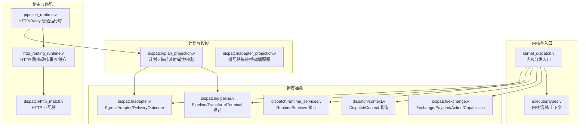
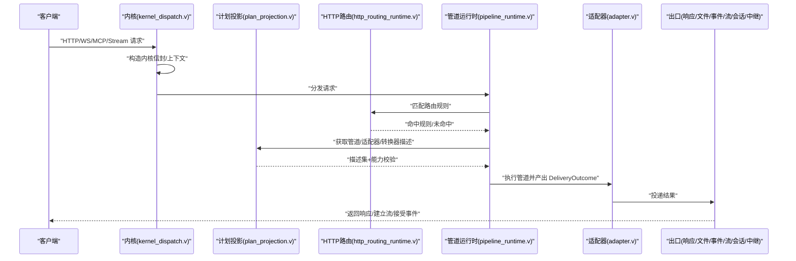
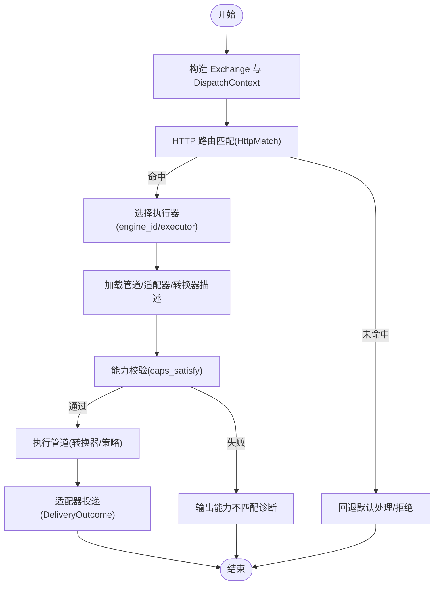
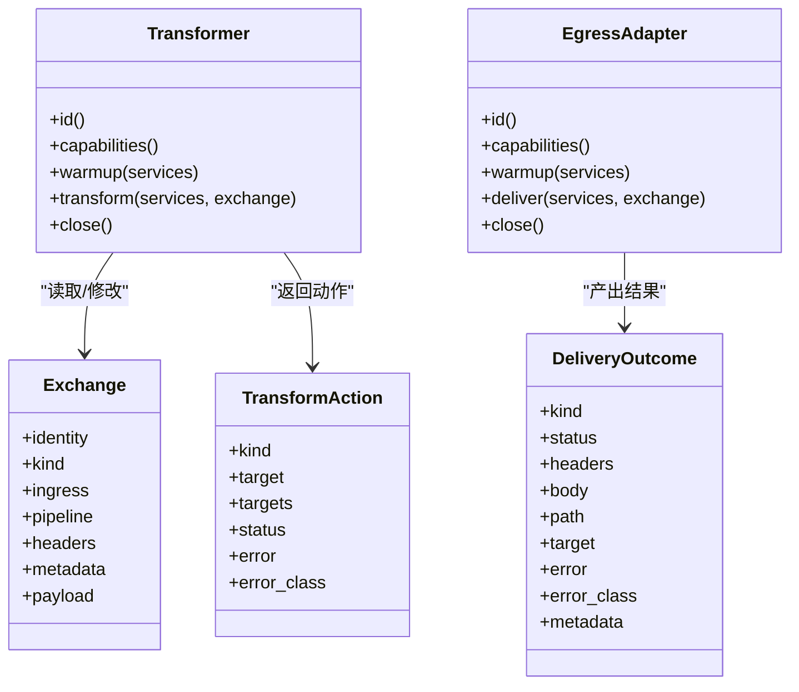
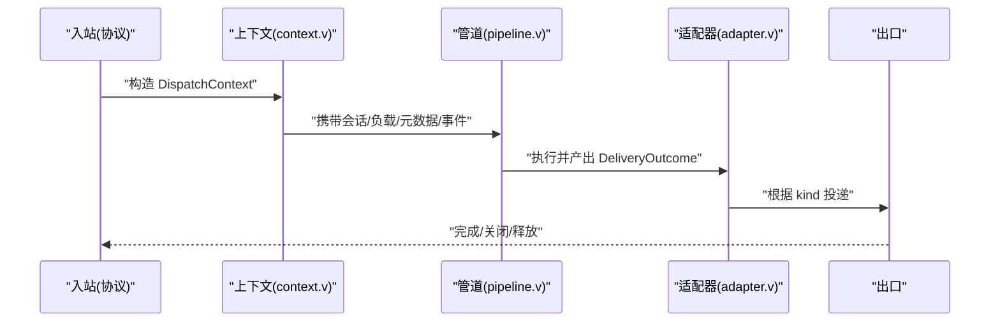
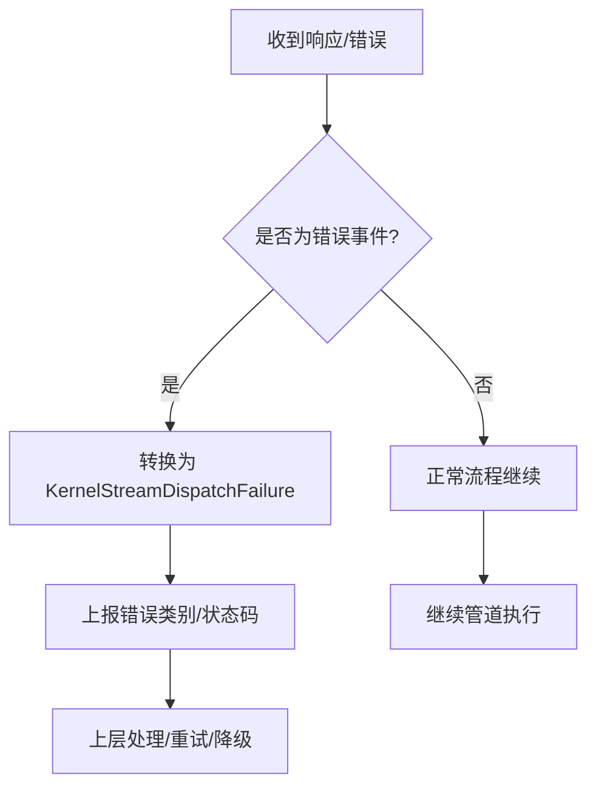
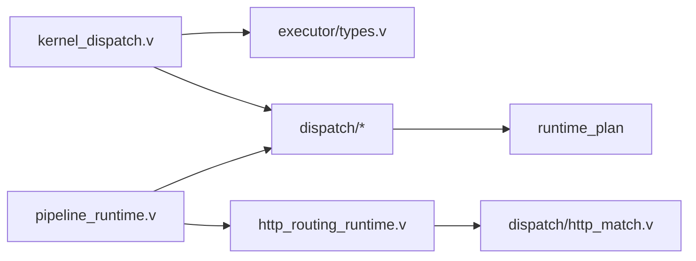

# 调度内核设计

<cite>
**本文引用的文件**
- [src/dispatch/kernel.v](file://src/dispatch/kernel.v)
- [src/dispatch/pipeline.v](file://src/dispatch/pipeline.v)
- [src/dispatch/context.v](file://src/dispatch/context.v)
- [src/dispatch/adapter.v](file://src/dispatch/adapter.v)
- [src/dispatch/http_match.v](file://src/dispatch/http_match.v)
- [src/dispatch/exchange.v](file://src/dispatch/exchange.v)
- [src/dispatch/runtime_services.v](file://src/dispatch/runtime_services.v)
- [src/dispatch/plan_projection.v](file://src/dispatch/plan_projection.v)
- [src/dispatch/adapter_projection.v](file://src/dispatch/adapter_projection.v)
- [src/kernel_dispatch.v](file://src/kernel_dispatch.v)
- [src/executor/types.v](file://src/executor/types.v)
- [src/upstream/transport/transport_handle.v](file://src/upstream/transport/transport_handle.v)
- [src/http_routing_runtime.v](file://src/http_routing_runtime.v)
- [src/pipeline_runtime.v](file://src/pipeline_runtime.v)
</cite>

## 目录
1. [引言](#引言)
2. [项目结构](#项目结构)
3. [核心组件](#核心组件)
4. [架构总览](#架构总览)
5. [详细组件分析](#详细组件分析)
6. [依赖关系分析](#依赖关系分析)
7. [性能考量](#性能考量)
8. [故障排查指南](#故障排查指南)
9. [结论](#结论)
10. [附录](#附录)

## 引言
本文件系统性解析 VHTTPD 调度内核（Kernel）的设计与实现，重点覆盖：
- 统一分发决策机制：请求路由匹配、执行器模式选择、策略应用流程
- 管道处理架构的分层设计：中间件链、转换器、适配器的协作机制
- 上下文管理系统的状态传递与生命周期控制
- 具体代码示例路径展示请求处理流程、错误分类与异常处理机制
- 性能优化建议与最佳实践指导

## 项目结构
调度内核围绕“交换模型 + 管道描述 + 适配器/转换器 + 运行时服务”展开。关键模块职责如下：
- 交换与上下文：定义统一的 Exchange、Payload、TransformAction、Capabilities 等抽象，以及从不同协议构造 DispatchContext 的工厂方法
- 管道与能力校验：PipelineDescriptor、TransformDescriptor、TerminalDescriptor 及其能力匹配与诊断
- 适配器与出口：EgressAdapter 接口与多种 DeliveryOutcome 类型，用于将处理结果投递到 HTTP、文件、事件、流、会话或中继
- 路由匹配：基于 HTTP 方法的简单匹配与路径/查询/头匹配，支持通配符与前缀/后缀匹配
- 计划投影：将运行时计划（RuntimePlan）映射为管道/适配器/转换器的描述集合，并生成能力校验问题
- 内核入口：将上游传输请求转换为内核信封，委派引擎进行分发；同时提供构建各类请求帧的工具函数
- 运行时管道：HTTP 路由规则编译与匹配、静态资源根、响应缓存、重写目标、策略注入等

图表来源
- [src/kernel_dispatch.v:1-154](file://src/kernel_dispatch.v#L1-L154)
- [src/executor/types.v:266-449](file://src/executor/types.v#L266-L449)
- [src/dispatch/exchange.v:78-160](file://src/dispatch/exchange.v#L78-L160)
- [src/dispatch/context.v:1-66](file://src/dispatch/context.v#L1-L66)
- [src/dispatch/pipeline.v:1-119](file://src/dispatch/pipeline.v#L1-L119)
- [src/dispatch/adapter.v:1-137](file://src/dispatch/adapter.v#L1-L137)
- [src/dispatch/runtime_services.v:1-17](file://src/dispatch/runtime_services.v#L1-L17)
- [src/dispatch/plan_projection.v:1-314](file://src/dispatch/plan_projection.v#L1-L314)
- [src/dispatch/adapter_projection.v:1-124](file://src/dispatch/adapter_projection.v#L1-L124)
- [src/dispatch/http_match.v:1-113](file://src/dispatch/http_match.v#L1-L113)
- [src/http_routing_runtime.v:1-483](file://src/http_routing_runtime.v#L1-L483)
- [src/pipeline_runtime.v:1-224](file://src/pipeline_runtime.v#L1-L224)

章节来源
- [src/kernel_dispatch.v:1-154](file://src/kernel_dispatch.v#L1-L154)
- [src/dispatch/exchange.v:78-160](file://src/dispatch/exchange.v#L78-L160)
- [src/dispatch/pipeline.v:1-119](file://src/dispatch/pipeline.v#L1-L119)
- [src/dispatch/adapter.v:1-137](file://src/dispatch/adapter.v#L1-L137)
- [src/dispatch/http_match.v:1-113](file://src/dispatch/http_match.v#L1-L113)
- [src/dispatch/plan_projection.v:1-314](file://src/dispatch/plan_projection.v#L1-L314)
- [src/dispatch/adapter_projection.v:1-124](file://src/dispatch/adapter_projection.v#L1-L124)
- [src/http_routing_runtime.v:1-483](file://src/http_routing_runtime.v#L1-L483)
- [src/pipeline_runtime.v:1-224](file://src/pipeline_runtime.v#L1-L224)

## 核心组件
- 交换模型与动作
  - Exchange 承载身份、种类、入站/管道标识、时间戳、头部、元数据与负载
  - TransformAction 表达继续管道、直接响应、转发、扇出、拒绝、丢弃等动作
  - Capabilities 描述系统对请求/事件/流/会话/多路复用/取消/背压/回放的支持
- 管道与能力约束
  - PipelineDescriptor 指定入站、转换器序列、策略、出站及所需能力
  - TransformDescriptor/TerminalDescriptor 描述转换器与终结节点的能力需求
  - capabilities_satisfy/missing_capabilities 用于能力匹配与缺失诊断
- 适配器与交付结果
  - EgressAdapter 负责将 DeliveryOutcome 投递到具体出口（HTTP 响应、文件、事件、流、会话、中继）
  - DeliveryOutcome 统一封装状态码、头部、主体、目标、错误与元数据
- 上下文与运行时服务
  - DispatchContext 封装会话句柄、负载、元数据与事件类型
  - RuntimeServices 提供 trace_id 与 emit 事件能力，NoOpRuntimeServices 作为默认实现
- 计划投影与能力校验
  - 将 Listener/Relay/Provider/Adapter/Transform 的计划项映射为描述集
  - 校验管道与入站/转换器的能力一致性，输出诊断信息
- HTTP 路由匹配
  - HttpMatch 支持方法、Host、路径、Query、Header 的多条件匹配
  - http_exchange_matches 将 Exchange 中的 RequestPayload 与匹配器比对
- 运行时管道
  - PipelineRuntime 组合 HTTP 路由与 Relay 管道
  - HttpRoutingRuntime 提供规则匹配、路径重写、静态根、响应缓存、必要头检查、禁用查询参数检查等

章节来源
- [src/dispatch/exchange.v:78-160](file://src/dispatch/exchange.v#L78-L160)
- [src/dispatch/pipeline.v:1-119](file://src/dispatch/pipeline.v#L1-L119)
- [src/dispatch/adapter.v:1-137](file://src/dispatch/adapter.v#L1-L137)
- [src/dispatch/context.v:1-66](file://src/dispatch/context.v#L1-L66)
- [src/dispatch/runtime_services.v:1-17](file://src/dispatch/runtime_services.v#L1-L17)
- [src/dispatch/plan_projection.v:1-314](file://src/dispatch/plan_projection.v#L1-L314)
- [src/dispatch/http_match.v:1-113](file://src/dispatch/http_match.v#L1-L113)
- [src/http_routing_runtime.v:1-483](file://src/http_routing_runtime.v#L1-L483)
- [src/pipeline_runtime.v:1-224](file://src/pipeline_runtime.v#L1-L224)

## 架构总览
调度内核以“请求进入 -> 路由匹配 -> 管道编排 -> 适配器投递”为主线，结合能力校验确保链路正确性。

图表来源
- [src/kernel_dispatch.v:1-154](file://src/kernel_dispatch.v#L1-L154)
- [src/dispatch/plan_projection.v:1-314](file://src/dispatch/plan_projection.v#L1-L314)
- [src/http_routing_runtime.v:1-483](file://src/http_routing_runtime.v#L1-L483)
- [src/pipeline_runtime.v:1-224](file://src/pipeline_runtime.v#L1-L224)
- [src/dispatch/adapter.v:1-137](file://src/dispatch/adapter.v#L1-L137)

## 详细组件分析

### 统一分发决策机制
- 请求路由匹配
  - 使用 HttpMatch 对 Exchange 的 RequestPayload 进行方法、Host、路径、Query、Header 匹配
  - 支持通配符、前缀/后缀路径匹配与大小写不敏感的方法匹配
- 执行器模式选择
  - 通过运行时规则决定 executor/engine_id，并在管道计划中绑定对应执行器
  - 当存在协议级覆盖时，优先采用规则指定的执行器
- 策略应用流程
  - 在管道描述中声明 policies，由运行时在执行前/后按序应用
  - 能力校验确保入站、转换器、出站均满足所需能力

图表来源
- [src/dispatch/http_match.v:1-113](file://src/dispatch/http_match.v#L1-L113)
- [src/dispatch/plan_projection.v:1-314](file://src/dispatch/plan_projection.v#L1-L314)
- [src/pipeline_runtime.v:1-224](file://src/pipeline_runtime.v#L1-L224)
- [src/http_routing_runtime.v:1-483](file://src/http_routing_runtime.v#L1-L483)

章节来源
- [src/dispatch/http_match.v:1-113](file://src/dispatch/http_match.v#L1-L113)
- [src/dispatch/plan_projection.v:1-314](file://src/dispatch/plan_projection.v#L1-L314)
- [src/pipeline_runtime.v:1-224](file://src/pipeline_runtime.v#L1-L224)
- [src/http_routing_runtime.v:1-483](file://src/http_routing_runtime.v#L1-L483)

### 管道处理架构的分层设计
- 中间件链（Transformers）
  - 每个 Transformer 具备 id、capabilities、warmup/transform/close 生命周期
  - transform 返回 TransformAction，驱动继续、响应、转发、扇出、拒绝、丢弃等行为
- 转换器与适配器协作
  - 转换器关注请求/事件的变换与策略应用
  - 适配器关注最终结果的投递（HTTP 响应、文件、事件、流、会话、中继）
- 能力契约
  - 入站、转换器、出站均需满足 Capabilities，否则产生 pipeline_capability_mismatch 类问题

图表来源
- [src/dispatch/exchange.v:78-160](file://src/dispatch/exchange.v#L78-L160)
- [src/dispatch/pipeline.v:1-119](file://src/dispatch/pipeline.v#L1-L119)
- [src/dispatch/adapter.v:1-137](file://src/dispatch/adapter.v#L1-L137)

章节来源
- [src/dispatch/exchange.v:78-160](file://src/dispatch/exchange.v#L78-L160)
- [src/dispatch/pipeline.v:1-119](file://src/dispatch/pipeline.v#L1-L119)
- [src/dispatch/adapter.v:1-137](file://src/dispatch/adapter.v#L1-L137)

### 上下文管理系统
- 上下文构造
  - 从 WebSocket Upstream、Stream、MCP、WebSocket Frame 等不同协议源构造 DispatchContext
  - 包含 SessionHandle、payload、metadata、event 字段，贯穿整个管道
- 生命周期控制
  - 通过 TransportHandle 记录协议、提供者、实例、连接状态与端点
  - 在 close 阶段可清理资源与状态

图表来源
- [src/dispatch/context.v:1-66](file://src/dispatch/context.v#L1-L66)
- [src/upstream/transport/transport_handle.v:1-21](file://src/upstream/transport/transport_handle.v#L1-L21)
- [src/dispatch/adapter.v:1-137](file://src/dispatch/adapter.v#L1-L137)

章节来源
- [src/dispatch/context.v:1-66](file://src/dispatch/context.v#L1-L66)
- [src/upstream/transport/transport_handle.v:1-21](file://src/upstream/transport/transport_handle.v#L1-L21)

### 错误分类与异常处理
- 传输层错误分类
  - transport_failure/classify_transport_error 将后端错误分类为状态码与错误类别
- 流式分发失败
  - stream_failure 将 StreamDispatchResponse 的错误事件转换为内核失败对象
- 管道能力不匹配
  - pipeline_capability_issues 输出结构化问题，便于诊断与告警

图表来源
- [src/dispatch/kernel.v:12-28](file://src/dispatch/kernel.v#L12-L28)
- [src/dispatch/plan_projection.v:133-166](file://src/dispatch/plan_projection.v#L133-L166)

章节来源
- [src/dispatch/kernel.v:12-28](file://src/dispatch/kernel.v#L12-L28)
- [src/dispatch/plan_projection.v:133-166](file://src/dispatch/plan_projection.v#L133-L166)

### 请求处理流程示例（路径参考）
- 内核入口与信封构造
  - [src/kernel_dispatch.v:9-16](file://src/kernel_dispatch.v#L9-L16)
  - [src/kernel_dispatch.v:30-37](file://src/kernel_dispatch.v#L30-L37)
  - [src/kernel_dispatch.v:58-62](file://src/kernel_dispatch.v#L58-L62)
  - [src/kernel_dispatch.v:83-91](file://src/kernel_dispatch.v#L83-L91)
- 上下文构造
  - [src/dispatch/context.v:17-32](file://src/dispatch/context.v#L17-L32)
  - [src/dispatch/context.v:34-49](file://src/dispatch/context.v#L34-L49)
  - [src/dispatch/context.v:51-65](file://src/dispatch/context.v#L51-L65)
- 路由匹配与计划投影
  - [src/dispatch/http_match.v:12-39](file://src/dispatch/http_match.v#L12-L39)
  - [src/dispatch/plan_projection.v:270-278](file://src/dispatch/plan_projection.v#L270-L278)
  - [src/http_routing_runtime.v:112-122](file://src/http_routing_runtime.v#L112-L122)
- 管道运行时与适配器
  - [src/pipeline_runtime.v:91-106](file://src/pipeline_runtime.v#L91-L106)
  - [src/dispatch/adapter.v:129-137](file://src/dispatch/adapter.v#L129-L137)

章节来源
- [src/kernel_dispatch.v:9-91](file://src/kernel_dispatch.v#L9-L91)
- [src/dispatch/context.v:17-65](file://src/dispatch/context.v#L17-L65)
- [src/dispatch/http_match.v:12-39](file://src/dispatch/http_match.v#L12-L39)
- [src/dispatch/plan_projection.v:270-278](file://src/dispatch/plan_projection.v#L270-L278)
- [src/http_routing_runtime.v:112-122](file://src/http_routing_runtime.v#L112-L122)
- [src/pipeline_runtime.v:91-106](file://src/pipeline_runtime.v#L91-L106)
- [src/dispatch/adapter.v:129-137](file://src/dispatch/adapter.v#L129-L137)

## 依赖关系分析
- 内核依赖 executor 与 upstream.transport 的类型与工具
- 调度抽象依赖 runtime_plan 进行计划投影与能力校验
- HTTP 路由依赖 regex 与 transport 工具进行规范化与匹配
- 管道运行时组合 HTTP 路由与 Relay 管道，协调适配器与转换器

图表来源
- [src/kernel_dispatch.v:1-154](file://src/kernel_dispatch.v#L1-L154)
- [src/executor/types.v:1-449](file://src/executor/types.v#L1-L449)
- [src/dispatch/plan_projection.v:1-314](file://src/dispatch/plan_projection.v#L1-L314)
- [src/http_routing_runtime.v:1-483](file://src/http_routing_runtime.v#L1-L483)
- [src/pipeline_runtime.v:1-224](file://src/pipeline_runtime.v#L1-L224)

章节来源
- [src/kernel_dispatch.v:1-154](file://src/kernel_dispatch.v#L1-L154)
- [src/executor/types.v:1-449](file://src/executor/types.v#L1-L449)
- [src/dispatch/plan_projection.v:1-314](file://src/dispatch/plan_projection.v#L1-L314)
- [src/http_routing_runtime.v:1-483](file://src/http_routing_runtime.v#L1-L483)
- [src/pipeline_runtime.v:1-224](file://src/pipeline_runtime.v#L1-L224)

## 性能考量
- 路由匹配优化
  - 预编译正则表达式，避免重复编译开销
  - 优先使用精确匹配与通配符匹配，减少复杂正则的使用
- 响应缓存
  - 启用边缘响应缓存，合理设置 TTL 与 bypass 规则（如 Cookie、Authorization、Cache-Control）
  - 针对 GET/HEAD 且无敏感头的请求进行缓存存储
- 管道能力校验
  - 启动时完成能力校验与诊断，避免运行期失败
- 适配器与转换器
  - 尽量保持转换器幂等与轻量，避免阻塞操作
  - 使用扇出与并行策略时需考虑背压与限流

[本节为通用指导，无需特定文件引用]

## 故障排查指南
- 能力不匹配
  - 检查 pipeline_capability_errors/pipeline_transform_capability_errors 的输出，定位缺失能力字段
- 传输错误分类
  - 查看 transport_failure/classify_transport_error 的分类结果，确认状态码与错误类别
- 流式分发失败
  - 检查 stream_failure 的错误事件与 error_class，必要时进行重试或降级
- 路由未命中
  - 核对 HttpMatch 的条件与方法/路径/查询/头是否一致，必要时调整规则或增加通配符

章节来源
- [src/dispatch/plan_projection.v:133-166](file://src/dispatch/plan_projection.v#L133-L166)
- [src/dispatch/kernel.v:12-28](file://src/dispatch/kernel.v#L12-L28)
- [src/dispatch/http_match.v:12-39](file://src/dispatch/http_match.v#L12-L39)

## 结论
VHTTPD 调度内核通过统一的交换模型与能力契约，实现了跨协议（HTTP/WS/MCP/Stream）的统一分发与管道化编排。计划投影与能力校验保障了链路正确性，HTTP 路由与响应缓存提升了性能，适配器与转换器分层清晰，便于扩展与维护。建议在部署前完成能力校验与路由规则优化，并结合业务场景配置合适的缓存与策略。

[本节为总结，无需特定文件引用]

## 附录
- 关键数据结构与复杂度
  - Exchange 与 Payload：O(1) 访问，适合高频分发
  - TransformAction：常量级判断，驱动管道流转
  - Capabilities 匹配：线性比较各布尔位，整体 O(n)
- 最佳实践
  - 明确入站能力与转换器能力边界，避免过度耦合
  - 使用策略进行横切关注点（鉴权、限流、审计）的解耦
  - 对长连接与流式处理，重视背压与会话状态管理

[本节为补充说明，无需特定文件引用]