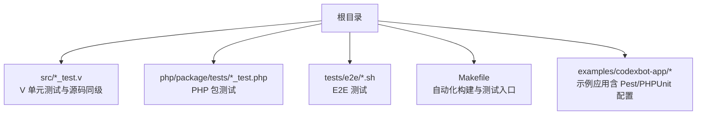
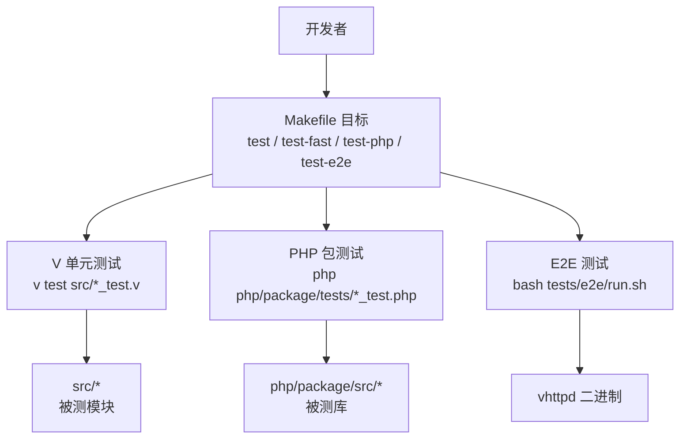
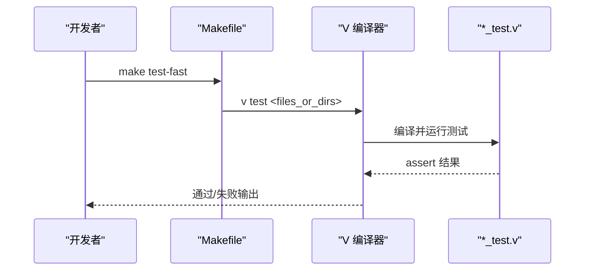
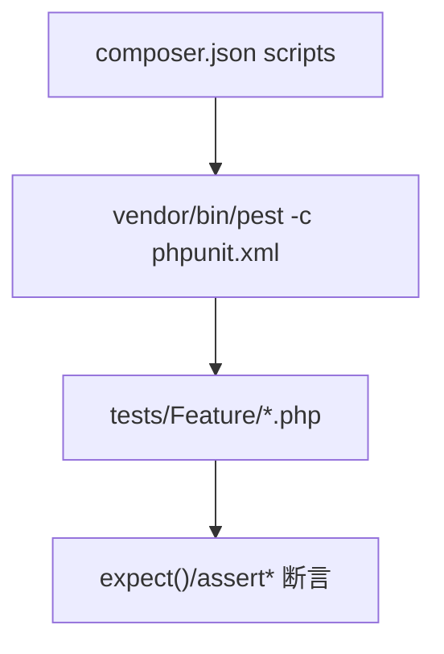
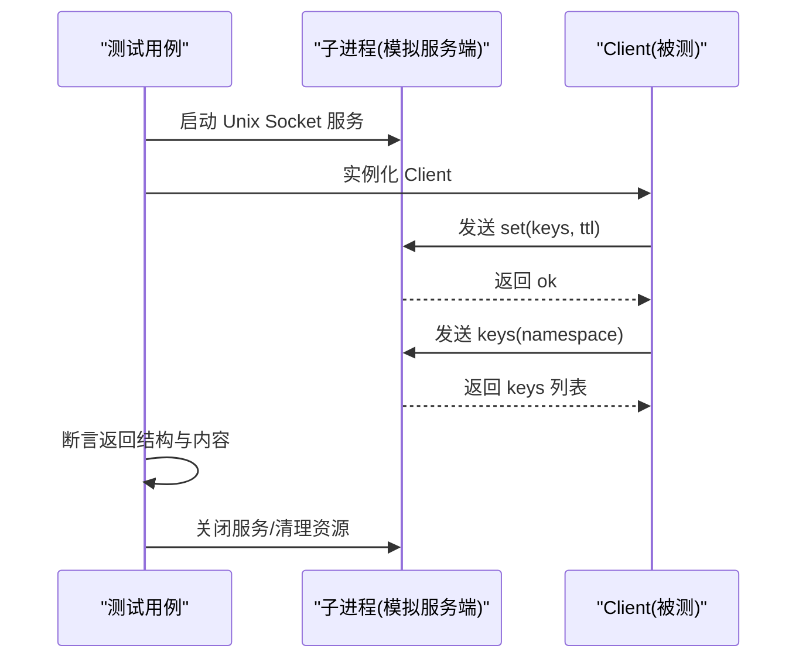
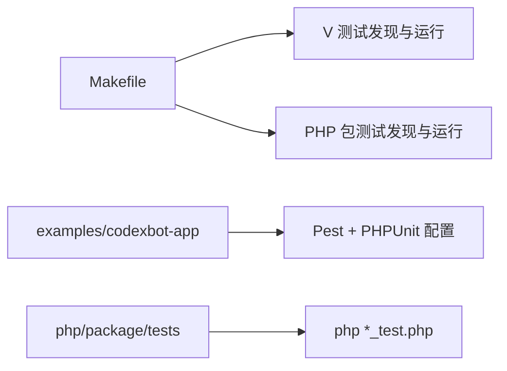

# 单元测试

<cite>
**本文引用的文件**   
- [README.md](file://README.md)
- [Makefile](file://Makefile)
- [tests/README.md](file://tests/README.md)
- [src/admin_apps_runtime_test.v](file://src/admin_apps_runtime_test.v)
- [examples/codexbot-app/phpunit.xml](file://examples/codexbot-app/phpunit.xml)
- [examples/codexbot-app/composer.json](file://examples/codexbot-app/composer.json)
- [examples/codexbot-app/tests/Feature/CodexBotAppFlowTest.php](file://examples/codexbot-app/tests/Feature/CodexBotAppFlowTest.php)
- [php/package/composer.json](file://php/package/composer.json)
- [php/package/tests/cache_client_protocol_test.php](file://php/package/tests/cache_client_protocol_test.php)
</cite>

## 目录
1. [简介](#简介)
2. [项目结构](#项目结构)
3. [核心组件](#核心组件)
4. [架构总览](#架构总览)
5. [详细组件分析](#详细组件分析)
6. [依赖分析](#依赖分析)
7. [性能考虑](#性能考虑)
8. [故障排查指南](#故障排查指南)
9. [结论](#结论)
10. [附录](#附录)

## 简介
本指南面向 VHTTPD 项目的测试实践，覆盖以下范围：
- V 语言单元测试的编写规范、组织方式与断言使用
- PHP 包（VPhp/VHttpd）的测试框架配置与用例编写（PHPUnit/Pest）
- 异步代码（协程/事件循环）的测试策略
- 测试数据准备与管理（模拟对象、测试夹具）
- 覆盖率统计的配置与报告生成建议

## 项目结构
VHTTPD 的测试分为三层：
- V 单元/集成测试：与源码同目录，按模块组织，通过 Makefile 自动发现并运行
- PHP 包测试：位于 php/package/tests，直接以脚本形式执行
- E2E 测试：位于 tests/e2e，基于 shell 脚本对编译产物进行端到端验证

**章节来源**
- [tests/README.md:1-38](file://tests/README.md#L1-L38)
- [Makefile:37-71](file://Makefile#L37-L71)

## 核心组件
- V 测试驱动与发现
  - 通过 Makefile 的 test-fast/test-inproc/test-codexbot 等目标，自动发现 src 下的 *_test.v 并按需按文件或目录运行
  - 子模块测试需要按目录运行，以便 V 编译器包含同目录的其他模块文件
- PHP 包测试
  - php/package/tests 下的 *_test.php 由 Makefile 的 test-php 目标逐一执行
  - 示例应用 examples/codexbot-app 提供 Pest/PHPUnit 配置与脚本命令
- E2E 测试
  - tests/e2e/run.sh 和 smoke_test.sh 用于在构建后对 vhttpd 二进制进行冒烟与集成验证

**章节来源**
- [Makefile:163-177](file://Makefile#L163-L177)
- [tests/README.md:13-22](file://tests/README.md#L13-L22)

## 架构总览
下图展示了测试在整体工程中的位置与调用关系。

**图表来源**
- [Makefile:163-177](file://Makefile#L163-L177)
- [tests/README.md:23-38](file://tests/README.md#L23-L38)

## 详细组件分析

### V 语言单元测试指南
- 命名规范
  - 文件名：*_test.v
  - 模块声明：module main（必须与被测模块同目录）
- 组织结构
  - 顶层函数式测试：src/*_test.v
  - 子模块测试：放在对应子目录下，并通过目录方式运行
- 断言使用
  - 使用 assert 进行条件断言；失败时测试立即失败
- 运行方式
  - 快速单测：make test-fast
  - 指定文件：make test src/foo_test.v
  - 子模块目录：make test-fast（自动发现并按目录运行）

**图表来源**
- [Makefile:163-171](file://Makefile#L163-L171)
- [tests/README.md:13-22](file://tests/README.md#L13-L22)

**章节来源**
- [src/admin_apps_runtime_test.v:1-77](file://src/admin_apps_runtime_test.v#L1-L77)
- [tests/README.md:13-22](file://tests/README.md#L13-L22)
- [Makefile:37-71](file://Makefile#L37-L71)

### PHP 包单元测试（PHPUnit/Pest）
- 配置与入口
  - 示例应用使用 Pest 作为主测试框架，同时兼容 PHPUnit 配置
  - composer.json 中定义 dev 依赖与脚本命令，便于一键运行
  - phpunit.xml 定义测试套件目录与源码覆盖范围
- 测试组织
  - 用例位于 examples/codexbot-app/tests/Feature/*.php
  - 使用 it('...') 风格描述行为，结合 expect() 断言
- 运行方式
  - 通过 Composer 脚本 pest 或 test 运行
  - 也可通过 phpunit.xml 直接运行 PHPUnit

**图表来源**
- [examples/codexbot-app/composer.json:22-36](file://examples/codexbot-app/composer.json#L22-L36)
- [examples/codexbot-app/phpunit.xml:1-18](file://examples/codexbot-app/phpunit.xml#L1-L18)

**章节来源**
- [examples/codexbot-app/composer.json:1-43](file://examples/codexbot-app/composer.json#L1-L43)
- [examples/codexbot-app/phpunit.xml:1-18](file://examples/codexbot-app/phpunit.xml#L1-L18)
- [examples/codexbot-app/tests/Feature/CodexBotAppFlowTest.php:1-120](file://examples/codexbot-app/tests/Feature/CodexBotAppFlowTest.php#L1-L120)

### 异步代码测试策略（协程/事件循环）
- 原则
  - 避免阻塞事件循环：尽量使用非阻塞 I/O 与超时控制
  - 明确生命周期：为每个测试设置启动/清理钩子，确保资源释放
  - 可确定性：固定时间源、随机种子与外部依赖注入，保证可重复性
- 推荐模式
  - 使用轻量级“测试运行时”封装事件循环，提供 runUntilDone/waitForEvent 等辅助方法
  - 将外部依赖（网络、数据库、文件系统）替换为内存/内存套接字/临时文件
  - 针对回调/事件流，采用“等待完成信号”而非 sleep
- 参考实现思路
  - 进程内协程：以任务队列+调度器为核心，测试中注入 mock 任务与期望输出
  - 事件总线：测试订阅关键事件，断言事件序列与载荷

[本节为通用方法论，不直接分析具体文件]

### 测试数据准备与管理（模拟对象与测试夹具）
- 测试夹具
  - 使用工厂函数创建最小可用环境（如临时目录、内存数据库、Unix Socket）
  - 在 setUp/tearDown 或 beforeAll/afterAll 中集中管理资源
- 模拟对象
  - 对外部系统（网络、DB、FS）提供接口抽象，测试中注入 Mock/Fixture
  - 对于协议层（如帧编解码），构造最小合法报文进行端到端校验
- 示例参考
  - 缓存客户端协议测试通过 fork 子进程模拟服务端，验证请求/响应帧格式与业务字段

**图表来源**
- [php/package/tests/cache_client_protocol_test.php:1-80](file://php/package/tests/cache_client_protocol_test.php#L1-L80)

**章节来源**
- [php/package/tests/cache_client_protocol_test.php:1-80](file://php/package/tests/cache_client_protocol_test.php#L1-L80)

### 覆盖率统计与报告生成
- V 语言
  - 当前仓库未内置覆盖率门禁与报告生成步骤
  - 建议在 CI 中引入 V 支持的覆盖率选项（若可用）或在 Makefile 中扩展 test 目标
- PHP
  - 示例应用已包含 PHPUnit 配置，可通过扩展 phpunit.xml 启用 coverage 输出（例如 HTML/XML）
  - 可在 composer.json 中新增脚本命令，统一生成与归档覆盖率报告

[本节为通用建议，不直接分析具体文件]

## 依赖分析
- 构建与测试入口
  - Makefile 负责自动发现 V 与 PHP 测试文件，并提供多组测试目标
- 示例应用测试依赖
  - Pest 作为开发依赖，配合 phpunit.xml 运行
- PHP 包测试
  - 直接以 php 命令执行 *_test.php，无需额外框架

**图表来源**
- [Makefile:163-177](file://Makefile#L163-L177)
- [examples/codexbot-app/composer.json:11-16](file://examples/codexbot-app/composer.json#L11-L16)
- [examples/codexbot-app/phpunit.xml:7-11](file://examples/codexbot-app/phpunit.xml#L7-L11)

**章节来源**
- [Makefile:163-177](file://Makefile#L163-L177)
- [examples/codexbot-app/composer.json:1-43](file://examples/codexbot-app/composer.json#L1-L43)
- [examples/codexbot-app/phpunit.xml:1-18](file://examples/codexbot-app/phpunit.xml#L1-L18)

## 性能考虑
- 测试隔离与并行
  - 将重型 in-proc 测试与快速单测分离，减少 CI 时长
  - 对无状态测试可考虑并行执行（注意共享资源竞争）
- 资源复用
  - 复用临时数据库/套接字/文件句柄，避免频繁创建销毁
- 外部依赖
  - 尽可能使用内存或本地回退实现，降低网络/磁盘抖动影响

[本节为通用建议，不直接分析具体文件]

## 故障排查指南
- V 测试
  - 确认 *_test.v 与源码同目录且 module main 正确
  - 子模块测试请通过目录运行，避免裸文件编译缺失依赖
- PHP 包测试
  - 检查 phpunit.xml 的 bootstrap 与 testsuite 目录是否正确
  - 确认 composer 依赖安装成功，脚本命令可执行
- E2E 测试
  - 先执行 make build 生成二进制，再运行 tests/e2e/run.sh

**章节来源**
- [tests/README.md:13-38](file://tests/README.md#L13-L38)
- [Makefile:163-177](file://Makefile#L163-L177)

## 结论
- V 测试遵循“与源码同级、按模块组织、自动发现”的原则，适合快速迭代
- PHP 包测试以独立脚本为主，示例应用提供了 Pest/PHPUnit 的完整配置范式
- 异步测试应围绕“非阻塞、可确定性、资源可控”展开
- 覆盖率目前未内置门禁，可按需扩展至 Makefile 与 CI 流程

[本节为总结，不直接分析具体文件]

## 附录
- 常用命令
  - V 快速单测：make test-fast
  - 指定 V 测试文件：make test src/foo_test.v
  - PHP 包测试：make test-php
  - E2E 测试：bash tests/e2e/run.sh
- 参考文档
  - 项目概览与运行说明见 README.md

**章节来源**
- [README.md:1-150](file://README.md#L1-L150)
- [tests/README.md:23-38](file://tests/README.md#L23-L38)