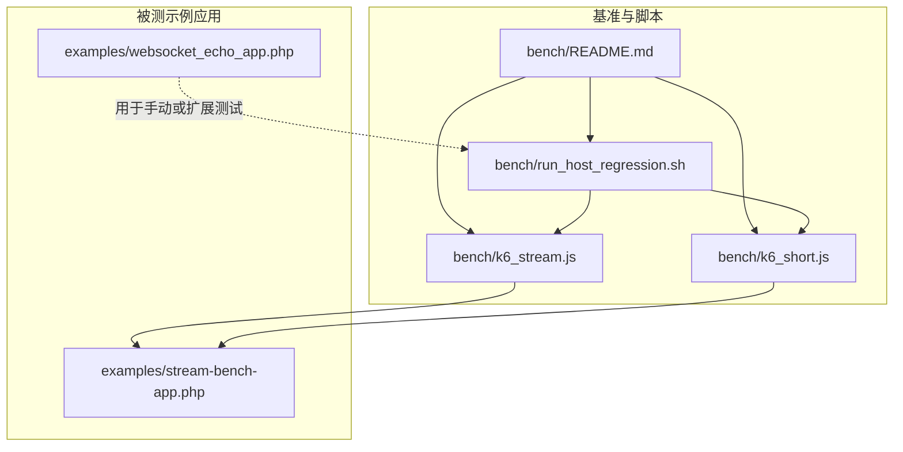
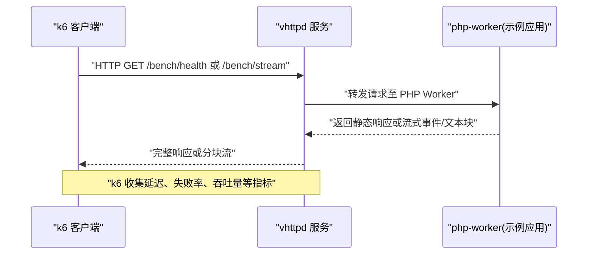
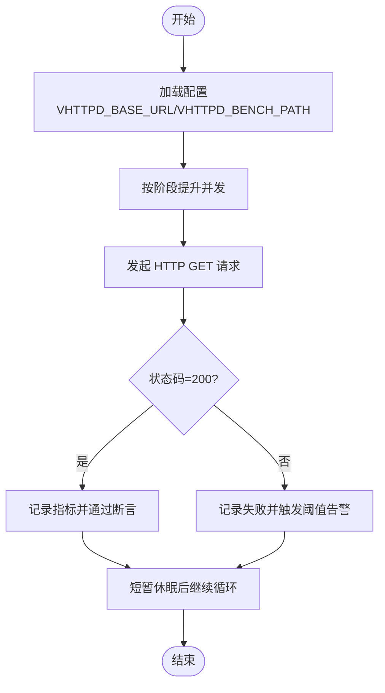
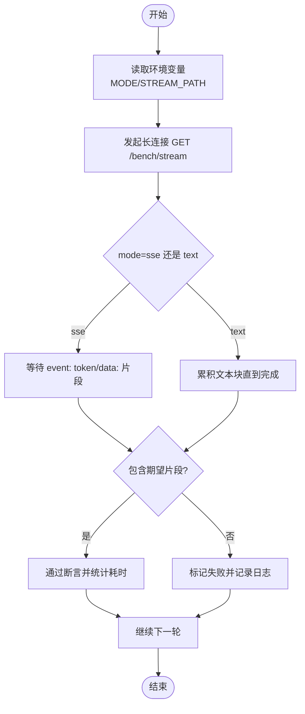
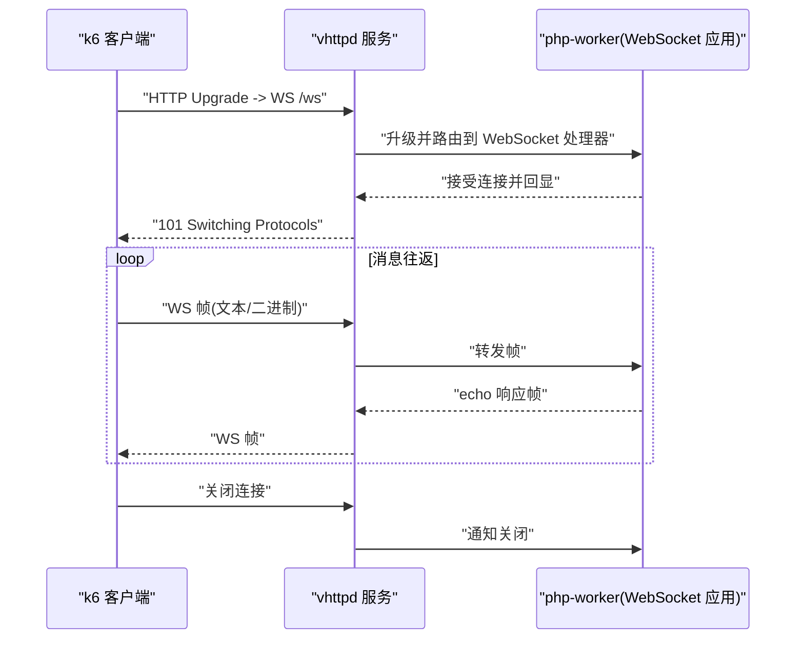
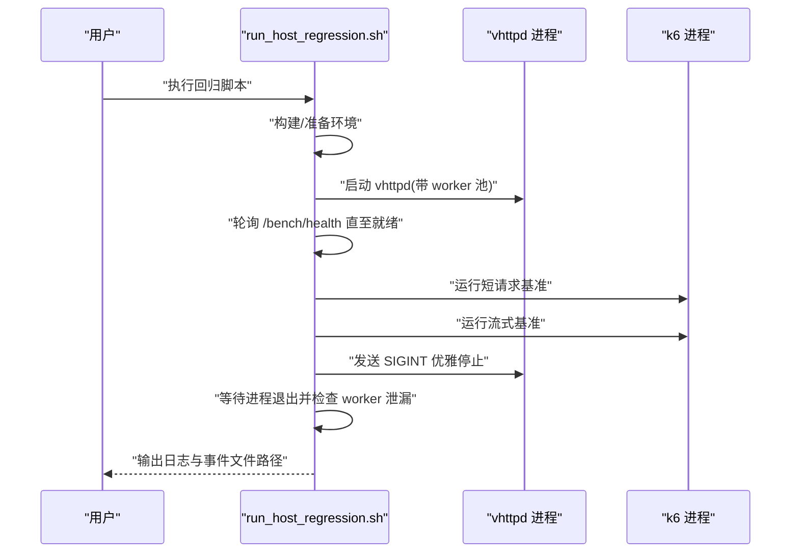
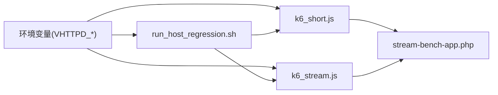

# 性能测试

<cite>
**本文引用的文件**   
- [bench/README.md](file://bench/README.md)
- [bench/k6_short.js](file://bench/k6_short.js)
- [bench/k6_stream.js](file://bench/k6_stream.js)
- [bench/run_host_regression.sh](file://bench/run_host_regression.sh)
- [examples/stream-bench-app.php](file://examples/stream-bench-app.php)
- [examples/websocket_echo_app.php](file://examples/websocket_echo_app.php)
</cite>

## 目录
1. [简介](#简介)
2. [项目结构](#项目结构)
3. [核心组件](#核心组件)
4. [架构总览](#架构总览)
5. [详细组件分析](#详细组件分析)
6. [依赖关系分析](#依赖关系分析)
7. [性能考量与优化建议](#性能考量与优化建议)
8. [故障排查指南](#故障排查指南)
9. [结论](#结论)
10. [附录](#附录)

## 简介
本指南面向使用 k6 对 VHTTPD 进行 HTTP、WebSocket、流式响应（SSE/文本流）的性能测试与基准测试。文档覆盖：
- HTTP 短请求并发、响应时间监控与吞吐评估
- WebSocket 连接建立、消息往返与资源清理验证
- SSE 与文本流的稳定性与可扩展性评估
- 回归脚本的一键执行流程与结果对比方法
- 结果分析与优化建议

## 项目结构
与性能测试直接相关的代码位于 bench 目录，以及示例应用 examples 下的流式与 WebSocket 演示应用。

图表来源
- [bench/README.md:1-158](file://bench/README.md#L1-L158)
- [bench/k6_short.js:1-44](file://bench/k6_short.js#L1-L44)
- [bench/k6_stream.js:1-52](file://bench/k6_stream.js#L1-L52)
- [bench/run_host_regression.sh:1-130](file://bench/run_host_regression.sh#L1-L130)
- [examples/stream-bench-app.php:1-88](file://examples/stream-bench-app.php#L1-L88)
- [examples/websocket_echo_app.php:1-240](file://examples/websocket_echo_app.php#L1-L240)

章节来源
- [bench/README.md:1-158](file://bench/README.md#L1-L158)

## 核心组件
- k6 短请求基准脚本：定义场景、阈值与断言，适合压测常规 HTTP 接口。
- k6 流式基准脚本：针对 SSE 与文本流，设置较长超时与数据完整性检查。
- 一键回归脚本：构建并启动 vhttpd，运行短请求与流式基准，校验进程生命周期与 worker 清理。
- 流式基准应用：提供 /bench/health 与 /bench/stream（支持 sse/text），参数化 tokens、interval_ms、chunk_size。
- WebSocket 回声示例：提供 /ws 端点与 echo 逻辑，可用于扩展 WebSocket 性能测试。

章节来源
- [bench/k6_short.js:1-44](file://bench/k6_short.js#L1-L44)
- [bench/k6_stream.js:1-52](file://bench/k6_stream.js#L1-L52)
- [bench/run_host_regression.sh:1-130](file://bench/run_host_regression.sh#L1-L130)
- [examples/stream-bench-app.php:1-88](file://examples/stream-bench-app.php#L1-L88)
- [examples/websocket_echo_app.php:1-240](file://examples/websocket_echo_app.php#L1-L240)

## 架构总览
下图展示从 k6 到 vhttpd 再到 PHP Worker 的端到端调用路径，适用于 HTTP 与流式场景；WebSocket 场景可参考“详细组件分析”中的时序图。

图表来源
- [bench/k6_short.js:32-43](file://bench/k6_short.js#L32-L43)
- [bench/k6_stream.js:33-51](file://bench/k6_stream.js#L33-L51)
- [examples/stream-bench-app.php:11-87](file://examples/stream-bench-app.php#L11-L87)

## 详细组件分析

### HTTP 短请求基准（k6）
- 场景与并发：使用 ramping-vus 逐步提升并发，模拟真实流量爬坡与回落。
- 阈值与断言：限制失败率、P95/P99 延迟，确保可用性。
- 标签与追踪：为不同端点与 profile 打标签，便于聚合分析。
- 环境变量：通过 VHTTPD_BASE_URL 与 VHTTPD_BENCH_PATH 控制目标地址与路径。

图表来源
- [bench/k6_short.js:11-30](file://bench/k6_short.js#L11-L30)
- [bench/k6_short.js:32-43](file://bench/k6_short.js#L32-L43)

章节来源
- [bench/k6_short.js:1-44](file://bench/k6_short.js#L1-L44)
- [bench/README.md:59-77](file://bench/README.md#L59-L77)

### 流式响应基准（SSE/文本流）
- 模式选择：通过 VHTTPD_STREAM_MODE 切换 sse 或 text。
- 路径参数：tokens、interval_ms、chunk_size 控制流长度、间隔与块大小。
- 超时与断言：更长超时，校验响应体包含预期事件或数据片段。
- 推荐矩阵：固定 tokens 变 interval 评估传输开销；固定 interval 变 tokens 评估可扩展性。

图表来源
- [bench/k6_stream.js:12-31](file://bench/k6_stream.js#L12-L31)
- [bench/k6_stream.js:33-51](file://bench/k6_stream.js#L33-L51)
- [examples/stream-bench-app.php:42-86](file://examples/stream-bench-app.php#L42-L86)

章节来源
- [bench/k6_stream.js:1-52](file://bench/k6_stream.js#L1-L52)
- [bench/README.md:79-152](file://bench/README.md#L79-L152)
- [examples/stream-bench-app.php:1-88](file://examples/stream-bench-app.php#L1-L88)

### WebSocket 性能测试方案
仓库提供了 WebSocket 回声示例应用，可作为基线能力验证与扩展点。当前未提供专用 k6 WebSocket 脚本，但可基于现有 echo 应用快速实现：
- 连接建立：在 k6 中通过自定义模块或外部工具创建 ws 连接，测量握手时延。
- 消息往返：发送固定大小消息，统计往返时延与吞吐。
- 资源清理：关闭连接后确认服务端无泄漏（可复用回归脚本的进程检查思路）。

图表来源
- [examples/websocket_echo_app.php:224-239](file://examples/websocket_echo_app.php#L224-L239)

章节来源
- [examples/websocket_echo_app.php:1-240](file://examples/websocket_echo_app.php#L1-L240)

### 一键主机回归与基准流水线
该脚本负责：
- 构建 vhttpd 与相关依赖
- 启动 vhttpd 并等待健康检查就绪
- 依次运行短请求与流式基准
- 优雅停止并验证 worker 进程清理

图表来源
- [bench/run_host_regression.sh:18-88](file://bench/run_host_regression.sh#L18-L88)
- [bench/run_host_regression.sh:90-129](file://bench/run_host_regression.sh#L90-L129)

章节来源
- [bench/run_host_regression.sh:1-130](file://bench/run_host_regression.sh#L1-L130)
- [bench/README.md:24-57](file://bench/README.md#L24-L57)

## 依赖关系分析
- 环境变量约定：统一以 VHTTPD_* 前缀命名，兼容旧名。
- 关键变量：
  - VHTTPD_BASE_URL：基准目标地址
  - VHTTPD_BENCH_PATH：短请求路径
  - VHTTPD_STREAM_PATH：流式路径（含 mode/tokens/interval_ms/chunk_size）
  - VHTTPD_STREAM_MODE：sse 或 text
  - VHTTPD_WORKER_POOL_SIZE：worker 池大小
  - VHTTPD_BENCH_RUN_K6：是否运行 k6
  - VHTTPD_APP_BOOTSTRAP：示例应用入口
  - VHTTPD_HOST/VHTTPD_PORT：服务监听地址与端口

图表来源
- [bench/README.md:4-14](file://bench/README.md#L4-L14)
- [bench/k6_short.js:4-9](file://bench/k6_short.js#L4-L9)
- [bench/k6_stream.js:4-10](file://bench/k6_stream.js#L4-L10)
- [bench/run_host_regression.sh:12-16](file://bench/run_host_regression.sh#L12-L16)

章节来源
- [bench/README.md:4-14](file://bench/README.md#L4-L14)

## 性能考量与优化建议
- 并发模型
  - 短请求：使用 ramping-vus 模拟爬坡，关注 P95/P99 延迟与失败率阈值。
  - 流式：合理设置 timeout，避免长时间阻塞导致 VU 耗尽；根据 tokens 与 interval_ms 调整并发规模。
- 传输开销与可扩展性
  - 固定 tokens 变化 interval_ms：评估运行时与网络开销。
  - 固定 interval_ms 变化 tokens：评估线性增长与内存占用。
- 资源清理
  - 回归脚本在停止后检查 php-worker 进程残留，避免长期运行的资源泄漏影响后续基准。
- 指标采集
  - 利用 k6 内置指标（http_req_duration、http_req_failed、checks）与 tags 维度进行聚合分析。
- 环境与隔离
  - 使用独立端口与临时目录，避免与其他服务冲突；必要时禁用代理以提升稳定性。

[本节为通用指导，不直接分析具体文件]

## 故障排查指南
- 服务未就绪
  - 现象：健康检查多次失败。
  - 处理：查看 stdout 日志，确认 worker 命令路径与 Unix domain socket 支持。
- 进程未正常退出
  - 现象：SIGINT 后 vhttpd 未在限定时间内退出。
  - 处理：检查信号处理与优雅关闭逻辑，必要时强制终止并排查僵尸进程。
- Worker 泄漏
  - 现象：存在遗留的 php-worker 进程。
  - 处理：定位 worker 启动参数与 socket 前缀，确认清理逻辑是否生效。
- 流式断言失败
  - 现象：响应体不包含期望片段。
  - 处理：核对 stream 路径参数（mode/tokens/interval_ms/chunk_size）与应用实现一致性。

章节来源
- [bench/run_host_regression.sh:72-88](file://bench/run_host_regression.sh#L72-L88)
- [bench/run_host_regression.sh:104-129](file://bench/run_host_regression.sh#L104-L129)

## 结论
通过统一的 k6 脚本与一键回归流程，可对 VHTTPD 的 HTTP、SSE/文本流进行稳定、可复现的基准测试。结合推荐的对比矩阵，能够系统评估传输开销与可扩展性。对于 WebSocket，可基于现有回声示例快速扩展压测脚本，完善连接建立、消息往返与资源清理的度量。

[本节为总结性内容，不直接分析具体文件]

## 附录

### 常用命令速查
- 安装 k6：参见 README 前置条件。
- 运行短请求基准：参考 README 第 1 节。
- 运行流式基准：参考 README 第 2 节与推荐矩阵。
- 一键回归：参考 README 第 0 节与 run_host_regression.sh。

章节来源
- [bench/README.md:16-22](file://bench/README.md#L16-L22)
- [bench/README.md:59-152](file://bench/README.md#L59-L152)
- [bench/run_host_regression.sh:1-130](file://bench/run_host_regression.sh#L1-L130)