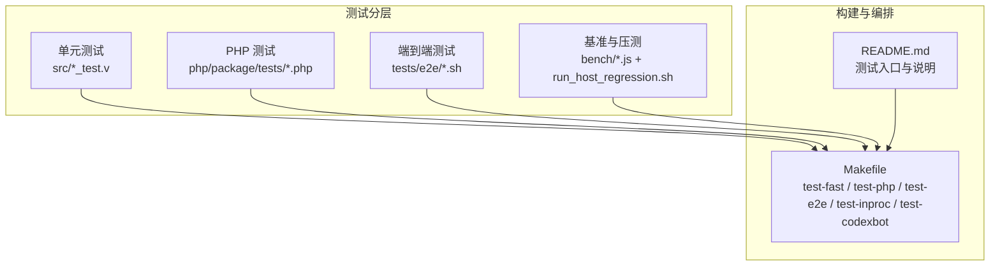
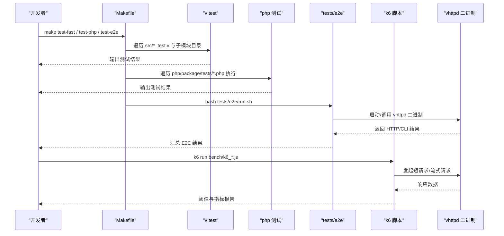
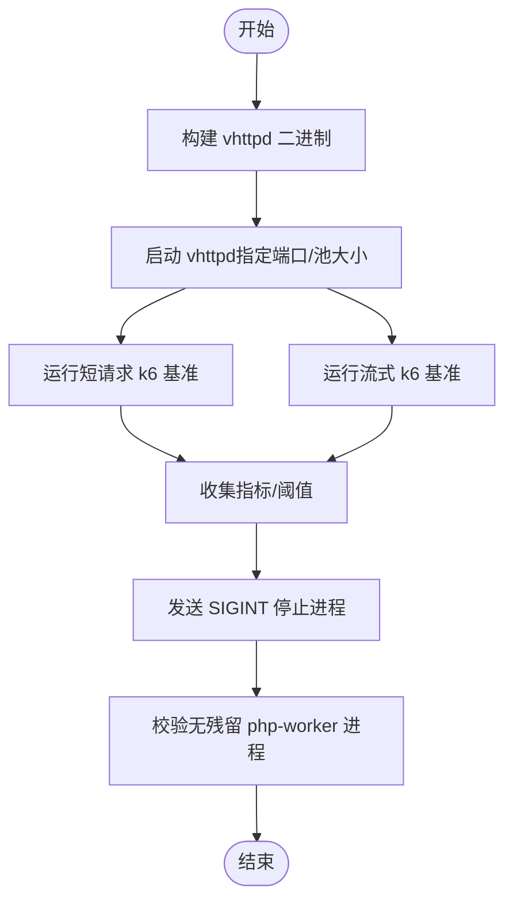
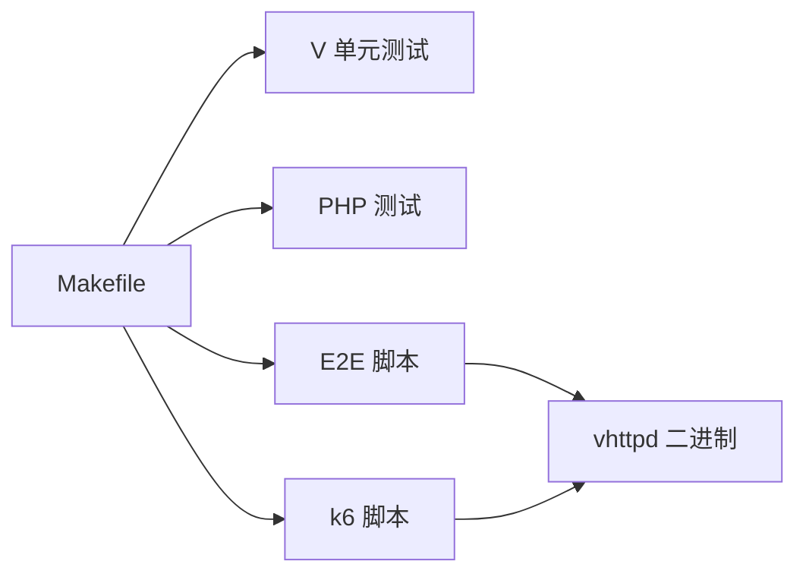

# 测试指南

<cite>
**本文引用的文件**
- [README.md](file://README.md)
- [Makefile](file://Makefile)
- [tests/README.md](file://tests/README.md)
- [tests/e2e/run.sh](file://tests/e2e/run.sh)
- [tests/e2e/smoke_test.sh](file://tests/e2e/smoke_test.sh)
- [bench/README.md](file://bench/README.md)
- [bench/k6_short.js](file://bench/k6_short.js)
- [bench/k6_stream.js](file://bench/k6_stream.js)
- [php/package/tests/cache_client_protocol_test.php](file://php/package/tests/cache_client_protocol_test.php)
- [php/package/tests/db_gateway_protocol_test.php](file://php/package/tests/db_gateway_protocol_test.php)
- [php/package/tests/php_worker_client_protocol_test.php](file://php/package/tests/php_worker_client_protocol_test.php)
- [php/package/tests/php_worker_stream_dispatch_test.php](file://php/package/tests/php_worker_stream_dispatch_test.php)
- [php/package/tests/php_worker_stream_response_test.php](file://php/package/tests/php_worker_stream_response_test.php)
- [php/package/tests/profiler_test.php](file://php/package/tests/profiler_test.php)
- [php/package/tests/wordpress_lifecycle_test.php](file://php/package/tests/wordpress_lifecycle_test.php)
- [src/admin_apps_runtime_test.v](file://src/admin_apps_runtime_test.v)
- [src/app_composition_runtime_test.v](file://src/app_composition_runtime_test.v)
- [src/command_executor_test.v](file://src/command_executor_test.v)
- [src/kernel_dispatch_test.v](file://src/kernel_dispatch_test.v)
- [src/pipeline_runtime_test.v](file://src/pipeline_runtime_test.v)
- [src/server_logic_test.v](file://src/server_logic_test.v)
- [src/sqlite_test_support.v](file://src/sqlite_test_support.v)
</cite>

## 目录
1. [简介](#简介)
2. [项目结构](#项目结构)
3. [核心组件](#核心组件)
4. [架构总览](#架构总览)
5. [详细组件分析](#详细组件分析)
6. [依赖关系分析](#依赖关系分析)
7. [性能考虑](#性能考虑)
8. [故障排查指南](#故障排查指南)
9. [结论](#结论)
10. [附录](#附录)

## 简介
本指南面向 VHTTPD 项目的测试体系，覆盖单元测试、集成测试与端到端（E2E）的分层设计；说明 V 语言测试框架与 PHP 测试的编写方法、异步场景处理策略；给出测试数据准备与管理（测试数据库、模拟服务、测试配置）的最佳实践；提供本地运行与持续集成的执行方式；并介绍性能与压力测试实施方案以及覆盖率统计和质量门禁建议。

## 项目结构
VHTTPD 的测试按分层组织：
- 单元测试：与源码同目录，遵循 V 模块系统约定，通过 Makefile 自动发现与分类执行。
- PHP 包测试：位于 php/package/tests，使用 PHP 直接执行或 PHPUnit/Pest 等工具链。
- E2E 测试：位于 tests/e2e，基于 shell 脚本驱动已编译的二进制进行冒烟与配置验收。
- 基准与压测：位于 bench，提供 k6 脚本与一键回归脚本。

图表来源
- [Makefile:145-199](file://Makefile#L145-L199)
- [tests/README.md:1-38](file://tests/README.md#L1-L38)
- [README.md:1-150](file://README.md#L1-L150)

章节来源
- [tests/README.md:1-38](file://tests/README.md#L1-L38)
- [Makefile:145-199](file://Makefile#L145-L199)

## 核心组件
- 测试发现与执行
  - 通过 Makefile 自动发现 src 下的 *_test.v 与 php/package/tests 下的 *_test.php。
  - 提供多目标：test-fast、test-php、test-e2e、test-inproc、test-codexbot、test-all。
- 测试分类
  - 快速单元：排除 inproc_* 与 db_* 等重型或需网络的用例。
  - In-process vjsx：inproc_*_test.v（非 codexbot）。
  - CodexBot 套件：全量、仅生命周期、快速子集。
- E2E 与冒烟
  - tests/e2e/run.sh 作为统一入口；smoke_test.sh 为无外部依赖的 CLI 冒烟。
- 基准与压测
  - k6 短请求与流式请求脚本；run_host_regression.sh 提供“构建-启动-压测-清理”的一体化流程。

章节来源
- [Makefile:37-82](file://Makefile#L37-L82)
- [Makefile:145-199](file://Makefile#L145-L199)
- [tests/README.md:13-38](file://tests/README.md#L13-L38)
- [bench/README.md:1-58](file://bench/README.md#L1-L58)

## 架构总览
下图展示从开发者到 CI 的测试执行路径，涵盖 V 单测、PHP 测试、E2E 与 k6 压测。

图表来源
- [Makefile:145-199](file://Makefile#L145-L199)
- [tests/e2e/run.sh](file://tests/e2e/run.sh)
- [bench/k6_short.js:1-44](file://bench/k6_short.js#L1-L44)
- [bench/k6_stream.js:1-52](file://bench/k6_stream.js#L1-L52)

## 详细组件分析

### 单元测试（V 语言）
- 组织方式
  - 与源码同目录，命名 *_test.v；子模块测试以目录为单位运行，确保包含同级模块文件。
  - 通过 find 自动发现，避免手动维护列表。
- 分类与过滤
  - test-fast：排除 inproc_* 与 db_*，适合频繁运行。
  - test-inproc：inproc_*_test.v（不含 codexbot）。
  - test-codexbot / test-codexbot-fast / test-codexbot-lifecycle：针对特定子系统。
- 典型测试文件示例（路径）
  - [src/admin_apps_runtime_test.v](file://src/admin_apps_runtime_test.v)
  - [src/app_composition_runtime_test.v](file://src/app_composition_runtime_test.v)
  - [src/command_executor_test.v](file://src/command_executor_test.v)
  - [src/kernel_dispatch_test.v](file://src/kernel_dispatch_test.v)
  - [src/pipeline_runtime_test.v](file://src/pipeline_runtime_test.v)
  - [src/server_logic_test.v](file://src/server_logic_test.v)
  - [src/sqlite_test_support.v](file://src/sqlite_test_support.v)
- 最佳实践
  - 将重型或网络依赖的用例放入 inproc_* 或 db_* 前缀，以便被 test-fast 排除。
  - 使用 sqlite_test_support.v 提供的辅助能力构造轻量测试数据。
  - 对复杂逻辑采用小粒度断言，便于定位失败原因。

章节来源
- [Makefile:37-82](file://Makefile#L37-L82)
- [Makefile:163-171](file://Makefile#L163-L171)
- [Makefile:182-192](file://Makefile#L182-L192)
- [src/sqlite_test_support.v](file://src/sqlite_test_support.v)

### PHP 测试（包级）
- 位置与发现
  - php/package/tests 下 *_test.php 由 Makefile 自动发现并逐个执行。
- 常见测试类型（路径）
  - 缓存客户端协议：[php/package/tests/cache_client_protocol_test.php](file://php/package/tests/cache_client_protocol_test.php)
  - DB 网关协议：[php/package/tests/db_gateway_protocol_test.php](file://php/package/tests/db_gateway_protocol_test.php)
  - PHP Worker 客户端协议：[php/package/tests/php_worker_client_protocol_test.php](file://php/package/tests/php_worker_client_protocol_test.php)
  - Worker 流分发与响应：[php/package/tests/php_worker_stream_dispatch_test.php](file://php/package/tests/php_worker_stream_dispatch_test.php)、[php/package/tests/php_worker_stream_response_test.php](file://php/package/tests/php_worker_stream_response_test.php)
  - 性能剖析：[php/package/tests/profiler_test.php](file://php/package/tests/profiler_test.php)
  - WordPress 生命周期：[php/package/tests/wordpress_lifecycle_test.php](file://php/package/tests/wordpress_lifecycle_test.php)
- 编写要点
  - 每个 *_test.php 应自包含环境准备与清理，避免相互污染。
  - 对外部依赖（DB、Worker、文件系统）建议使用可替换实现或临时资源。
  - 若引入 PHPUnit/Pest，请在对应子项目内配置，并通过 Makefile 目标统一触发。

章节来源
- [Makefile:49-64](file://Makefile#L49-L64)
- [Makefile:173-177](file://Makefile#L173-L177)

### 端到端测试（E2E）
- 入口与脚本
  - 统一入口：[tests/e2e/run.sh](file://tests/e2e/run.sh)
  - 冒烟测试：[tests/e2e/smoke_test.sh](file://tests/e2e/smoke_test.sh)
- 特点
  - 无需 PHP、vslim 或 QuickJS，仅依赖已编译的 vhttpd 二进制。
  - 适合在 CI 中验证构建产物与基础功能。
- 建议
  - 将需要真实外部服务的场景放在独立脚本中，避免阻塞主流程。
  - 使用固定端口与隔离工作目录，保证并行稳定。

章节来源
- [tests/README.md:23-38](file://tests/README.md#L23-L38)
- [tests/e2e/run.sh](file://tests/e2e/run.sh)
- [tests/e2e/smoke_test.sh](file://tests/e2e/smoke_test.sh)

### 基准与压力测试（k6）
- 短请求基准
  - 脚本：[bench/k6_short.js](file://bench/k6_short.js)
  - 关键变量：VHTTPD_BASE_URL、VHTTPD_BENCH_PATH
  - 阈值：失败率、P95/P99 延迟、检查通过率
- 流式基准（SSE/text）
  - 脚本：[bench/k6_stream.js](file://bench/k6_stream.js)
  - 关键变量：VHTTPD_STREAM_PATH、VHTTPD_STREAM_MODE
- 主机回归一体化
  - 脚本：[bench/run_host_regression.sh](file://bench/run_host_regression.sh)
  - 功能：构建 -> 启动 -> 压测 -> 停止 -> 进程清理校验
- 推荐对比矩阵
  - 见 [bench/README.md](file://bench/README.md) 中的分组 A/B 方案，用于隔离传输开销与可扩展性。

图表来源
- [bench/README.md:24-58](file://bench/README.md#L24-L58)
- [bench/k6_short.js:1-44](file://bench/k6_short.js#L1-L44)
- [bench/k6_stream.js:1-52](file://bench/k6_stream.js#L1-L52)

章节来源
- [bench/README.md:1-158](file://bench/README.md#L1-L158)

### 异步测试处理
- 流式与长连接
  - 使用 E2E 与 k6 脚本验证 SSE/text 流与 WebSocket 上游连通性。
  - 在 PHP 侧的 worker 流分发/响应测试中，关注 open/next/close 契约。
- 建议
  - 为异步场景设置合理超时与重试上限。
  - 使用固定时间窗口与 token 数量参数化，便于回归对比。

章节来源
- [bench/k6_stream.js:1-52](file://bench/k6_stream.js#L1-L52)
- [php/package/tests/php_worker_stream_dispatch_test.php](file://php/package/tests/php_worker_stream_dispatch_test.php)
- [php/package/tests/php_worker_stream_response_test.php](file://php/package/tests/php_worker_stream_response_test.php)

### 测试数据与环境管理
- 测试数据库
  - 使用 SQLite 作为轻量存储，配合 [src/sqlite_test_support.v](file://src/sqlite_test_support.v) 提供的辅助能力。
  - 对于 PHP 侧 DB 网关测试，建议在测试初始化时创建临时库并在结束后清理。
- 模拟服务
  - 优先使用内存态或文件态替代；必要时通过内部 fixture 接口注入事件（参考 README 中关于 admin 与 upstream fixture 的描述）。
- 测试配置
  - 使用 TOML 配置片段与环境变量组合，避免硬编码；在 E2E 中通过不同实例隔离端口与根目录。

章节来源
- [src/sqlite_test_support.v](file://src/sqlite_test_support.v)
- [README.md:674-731](file://README.md#L674-L731)

### 测试运行与持续集成
- 本地运行
  - 全部测试：make test
  - 快速单元：make test-fast
  - PHP 测试：make test-php
  - E2E：make test-e2e
  - In-process/vjsx：make test-inproc
  - CodexBot 套件：make test-codexbot / test-codexbot-fast / test-codexbot-lifecycle
- 持续集成建议
  - 在 GitHub Actions 中增加覆盖率步骤（如 v -coverage test），并对核心模块设定最低覆盖率门槛。
  - 将 E2E 与 k6 基准纳入 PR 门禁，失败则阻断合并。

章节来源
- [Makefile:158-199](file://Makefile#L158-L199)
- [README.md:279-290](file://README.md#L279-L290)

### 覆盖率统计与质量门禁
- 覆盖率
  - 建议在 CI 中使用 v -coverage test 生成报告，并按模块聚合。
- 质量门禁
  - 核心模块（kernel_dispatch、worker_backend、logic_executor 等）覆盖率不低于 60%。
  - 新增 API/协议变更需补充契约测试与 E2E 用例。

章节来源
- [docs/refactor_0601.md:87-101](file://docs/refactor_0601.md#L87-L101)

## 依赖关系分析
- 测试与构建
  - Makefile 负责发现与调度所有测试目标，屏蔽底层差异。
- 测试与运行时
  - E2E 依赖已编译的 vhttpd 二进制；k6 依赖外部 k6 工具。
- 外部依赖
  - PHP 测试可能依赖 DB、文件系统与 Worker 进程；建议在测试中显式准备与清理。

图表来源
- [Makefile:145-199](file://Makefile#L145-L199)
- [tests/e2e/run.sh](file://tests/e2e/run.sh)
- [bench/k6_short.js:1-44](file://bench/k6_short.js#L1-L44)

章节来源
- [Makefile:145-199](file://Makefile#L145-L199)

## 性能考虑
- 基准维度
  - 短请求：RPS、P95/P99 延迟、错误率。
  - 流式：吞吐、延迟抖动、背压表现。
- 对比矩阵
  - 固定 tokens 变间隔（Group A）评估传输开销。
  - 固定间隔变 tokens（Group B）评估线性扩展性。
- 建议
  - 在 CI 中保留历史基线，出现退化时告警。
  - 结合系统监控（CPU/内存/IO）定位瓶颈。

章节来源
- [bench/README.md:102-158](file://bench/README.md#L102-L158)

## 故障排查指南
- 常见问题
  - 端口冲突：E2E 与 k6 默认端口不一致会导致失败，请确认环境变量与配置。
  - Worker 残留：回归脚本会校验无残留 php-worker 进程，若失败需检查优雅退出逻辑。
  - 依赖缺失：缺少 k6 或 PHP 环境会导致相应目标失败。
- 定位手段
  - 使用事件日志与 Admin API 快照辅助定位。
  - 缩小范围：先跑 test-fast，再逐步加入 inproc/codexbot/E2E。

章节来源
- [bench/README.md:24-58](file://bench/README.md#L24-L58)
- [README.md:674-731](file://README.md#L674-L731)

## 结论
VHTTPD 的测试体系以 Makefile 为中心，串联起 V 单元测试、PHP 包测试、E2E 与 k6 压测，形成从开发到 CI 的闭环。建议进一步完善覆盖率门禁与契约测试，并将更多外部依赖场景纳入自动化，以提升稳定性与可回归性。

## 附录
- 常用命令速查
  - make test-fast：快速单元
  - make test-php：PHP 测试
  - make test-e2e：端到端
  - make test-inproc：In-process vjsx
  - make test-codexbot：CodexBot 全量
  - k6 run bench/k6_short.js：短请求压测
  - k6 run bench/k6_stream.js：流式压测

章节来源
- [Makefile:158-199](file://Makefile#L158-L199)
- [bench/README.md:59-101](file://bench/README.md#L59-L101)