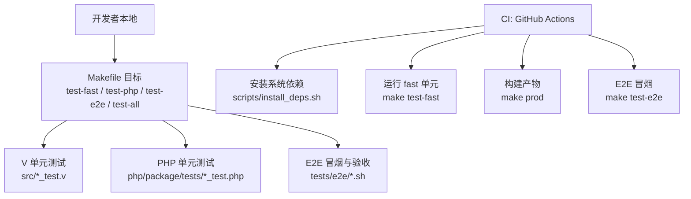
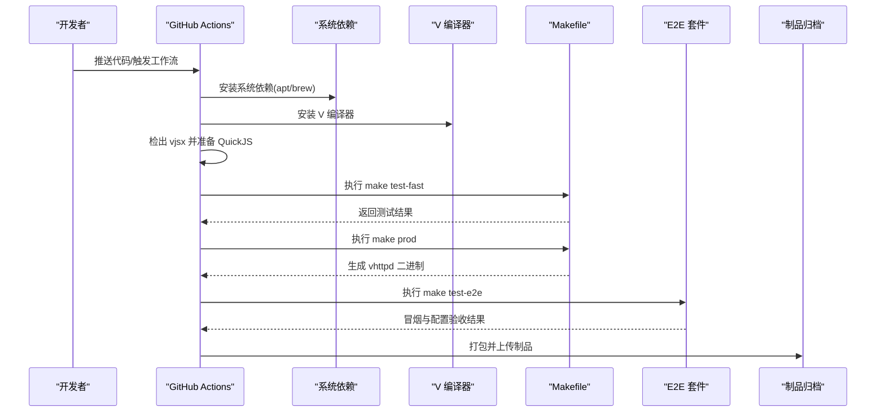
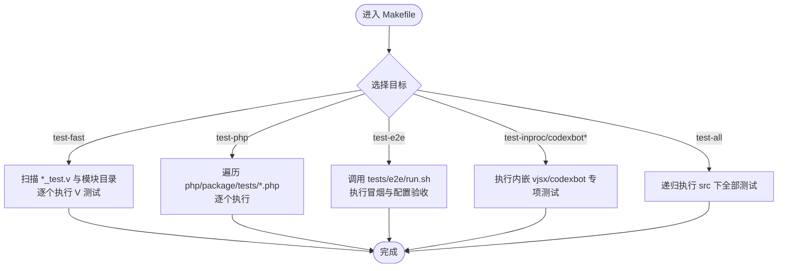
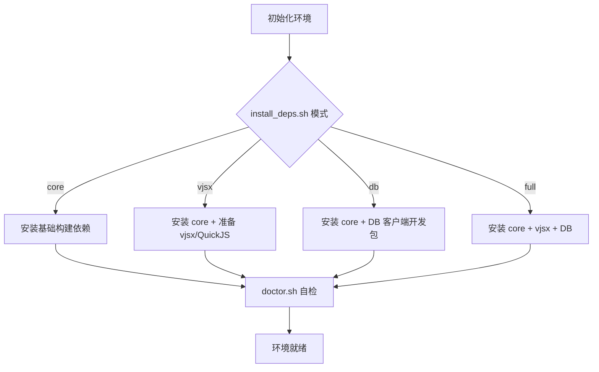
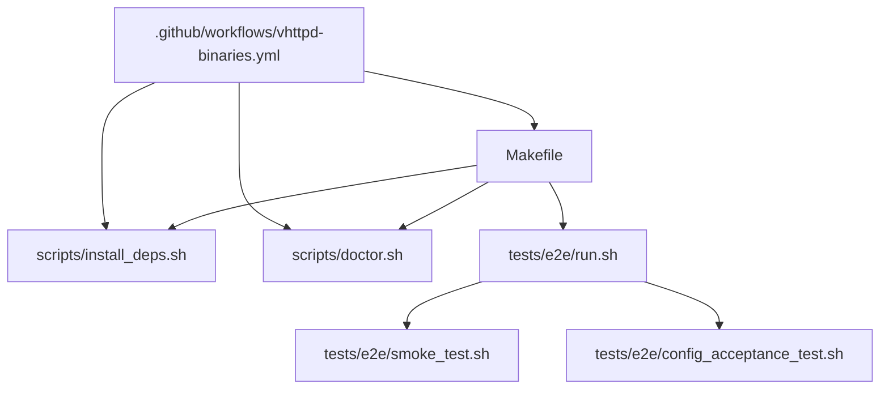

# 测试自动化

<cite>
**本文引用的文件列表**
- [Makefile](file://Makefile)
- [.github/workflows/vhttpd-binaries.yml](file://.github/workflows/vhttpd-binaries.yml)
- [tests/e2e/run.sh](file://tests/e2e/run.sh)
- [tests/e2e/smoke_test.sh](file://tests/e2e/smoke_test.sh)
- [tests/e2e/config_acceptance_test.sh](file://tests/e2e/config_acceptance_test.sh)
- [scripts/install_deps.sh](file://scripts/install_deps.sh)
- [scripts/doctor.sh](file://scripts/doctor.sh)
- [README.md](file://README.md)
</cite>

## 目录
1. [简介](#简介)
2. [项目结构](#项目结构)
3. [核心组件](#核心组件)
4. [架构总览](#架构总览)
5. [详细组件分析](#详细组件分析)
6. [依赖关系分析](#依赖关系分析)
7. [性能与稳定性考虑](#性能与稳定性考虑)
8. [故障排查指南](#故障排查指南)
9. [结论](#结论)
10. [附录](#附录)

## 简介
本指南聚焦于 vhttpd 项目的“测试自动化”能力，覆盖以下内容：
- 持续集成流水线配置与使用（GitHub Actions）
- Makefile 中测试目标的定义与执行流程
- 测试环境的自动搭建与清理机制（依赖安装、服务启动、数据准备）
- 测试报告自动生成与发布方法（HTML 报告与覆盖率统计）
- 测试失败时的告警与通知机制
- 多环境测试的配置与执行策略

## 项目结构
仓库中与测试自动化直接相关的顶层结构与关键位置如下：
- 构建与测试入口：根目录 Makefile
- CI 流水线：.github/workflows/vhttpd-binaries.yml
- E2E 套件：tests/e2e/*.sh
- 依赖与环境检查：scripts/install_deps.sh、scripts/doctor.sh
- 文档与说明：README.md

图表来源
- [Makefile:145-199](file://Makefile#L145-L199)
- [.github/workflows/vhttpd-binaries.yml:127-149](file://.github/workflows/vhttpd-binaries.yml#L127-L149)
- [tests/e2e/run.sh:1-15](file://tests/e2e/run.sh#L1-L15)

章节来源
- [Makefile:1-199](file://Makefile#L1-L199)
- [.github/workflows/vhttpd-binaries.yml:1-171](file://.github/workflows/vhttpd-binaries.yml#L1-L171)
- [tests/e2e/run.sh:1-15](file://tests/e2e/run.sh#L1-L15)

## 核心组件
本节从“可执行性”角度梳理测试自动化中的关键构件。

- Makefile 测试目标
  - test-fast：按文件与模块目录并行扫描并逐个执行 V 单元测试（排除重型 inproc 与 db 相关用例）
  - test-php：遍历 php/package/tests 下的 *_test.php 并逐一执行
  - test-e2e：调用 tests/e2e/run.sh，依次执行冒烟与配置验收测试
  - test-inproc / test-codexbot / test-codexbot-fast / test-codexbot-lifecycle：针对内嵌 vjsx 与 codexbot 的专项测试
  - test-all：递归对 src 下所有测试执行（包含重型用例）
  - deps-core / deps-vjsx / deps-db / deps-full：通过 scripts/install_deps.sh 安装不同依赖面
  - doctor：通过 scripts/doctor.sh 校验工具链与依赖可用性

- GitHub Actions 流水线
  - 触发条件：push/PR 到 main，或手动触发
  - 矩阵构建：Linux amd64、macOS Intel、macOS ARM64
  - 步骤要点：
    - 安装系统依赖（Linux apt、macOS brew）
    - 安装 V 编译器
    - 检出 vjsx 模块并确保 QuickJS 源码
    - 运行 make test-fast
    - 构建生产二进制 make prod
    - 运行 E2E 冒烟 make test-e2e
    - 打包制品并上传

- E2E 套件
  - run.sh：统一入口，顺序执行 smoke_test.sh 与 config_acceptance_test.sh
  - smoke_test.sh：零外部依赖的冒烟验证（--help/--version/未知参数等）
  - config_acceptance_test.sh：基于 TOML 配置的端到端验收（含诊断、relay、WebSocket 等场景）

- 环境与依赖脚本
  - install_deps.sh：按 core/vjsx/db/full 模式安装系统包与 vjsx/QuickJS 源码
  - doctor.sh：检测 v、pkg-config、openssl、bdw-gc、vjsx、sqlite3、mysql_config/pg_config 等

章节来源
- [Makefile:145-199](file://Makefile#L145-L199)
- [.github/workflows/vhttpd-binaries.yml:127-149](file://.github/workflows/vhttpd-binaries.yml#L127-L149)
- [tests/e2e/run.sh:1-15](file://tests/e2e/run.sh#L1-L15)
- [tests/e2e/smoke_test.sh:1-62](file://tests/e2e/smoke_test.sh#L1-L62)
- [tests/e2e/config_acceptance_test.sh:2598-2634](file://tests/e2e/config_acceptance_test.sh#L2598-L2634)
- [scripts/install_deps.sh:1-138](file://scripts/install_deps.sh#L1-L138)
- [scripts/doctor.sh:1-108](file://scripts/doctor.sh#L1-L108)

## 架构总览
下图展示从代码变更到测试产出与制品发布的端到端流程。

图表来源
- [.github/workflows/vhttpd-binaries.yml:47-171](file://.github/workflows/vhttpd-binaries.yml#L47-L171)
- [Makefile:96-104](file://Makefile#L96-L104)
- [tests/e2e/run.sh:1-15](file://tests/e2e/run.sh#L1-L15)

## 详细组件分析

### Makefile 测试目标与执行流程
- 目标组织
  - 快速路径：test-fast、test-php、test-e2e
  - 专项路径：test-inproc、test-codexbot、test-codexbot-fast、test-codexbot-lifecycle
  - 全量路径：test-all
- 执行策略
  - test-fast：先按文件再按目录执行，避免重型 inproc 与 db 测试；支持通过命令行传入具体 *.v 或 *.php 文件进行定向执行
  - test-php：遍历 php/package/tests 下 *_test.php 并逐一执行
  - test-e2e：调用 tests/e2e/run.sh，内部顺序执行冒烟与配置验收
- 依赖与构建前置
  - deps-* 系列目标封装 scripts/install_deps.sh 的不同依赖面
  - doctor 用于在本地快速自检工具链与依赖

图表来源
- [Makefile:145-199](file://Makefile#L145-L199)

章节来源
- [Makefile:1-199](file://Makefile#L1-L199)

### GitHub Actions 流水线配置与使用
- 触发与矩阵
  - push/PR 到 main，或 workflow_dispatch 手动触发
  - 矩阵覆盖 linux-amd64、macos-amd64、macos-arm64
- 关键步骤
  - 安装系统依赖（Linux apt、macOS brew）
  - 安装 V 编译器
  - 检出 vjsx 并准备 QuickJS 源码
  - 运行 make test-fast
  - 构建生产二进制 make prod
  - 运行 E2E 冒烟 make test-e2e
  - 打包制品并上传
- 环境变量与工具链
  - 设置 VHTTPD_VJSX_ROOT 指向 vjsx 模块
  - 指定 V_REPO 以克隆特定 V 版本
  - macOS 下通过 pkg-config 与头文件/库路径注入确保编译正确

图表来源
- [.github/workflows/vhttpd-binaries.yml:1-171](file://.github/workflows/vhttpd-binaries.yml#L1-L171)

章节来源
- [.github/workflows/vhttpd-binaries.yml:1-171](file://.github/workflows/vhttpd-binaries.yml#L1-L171)

### 测试环境自动搭建与清理机制
- 依赖安装
  - install_deps.sh 提供 core/vjsx/db/full 四种模式，分别安装基础构建依赖、vjsx 与 QuickJS 源码、数据库客户端开发包等
  - 在 Linux 上通过 apt-get 安装，macOS 上通过 brew 安装
- 环境自检
  - doctor.sh 检测 v、pkg-config、openssl、bdw-gc、vjsx、sqlite3、mysql_config/pg_config 等是否可用
- 清理策略
  - prepare-build-src 目标会清理并重建临时构建目录，仅拷贝非测试源文件，避免污染构建产物
  - E2E 脚本在各自用例中管理临时目录与端口分配，并在结束时退出码反映成功/失败

图表来源
- [scripts/install_deps.sh:1-138](file://scripts/install_deps.sh#L1-L138)
- [scripts/doctor.sh:1-108](file://scripts/doctor.sh#L1-L108)
- [Makefile:83-94](file://Makefile#L83-L94)

章节来源
- [scripts/install_deps.sh:1-138](file://scripts/install_deps.sh#L1-L138)
- [scripts/doctor.sh:1-108](file://scripts/doctor.sh#L1-L108)
- [Makefile:83-94](file://Makefile#L83-L94)

### 测试报告的自动生成与发布方法
- 现状
  - 当前 Makefile 与 CI 未内置 HTML 测试报告或覆盖率统计输出
  - README 与重构计划文档中提出引入覆盖率门禁的建议（例如在 CI 中使用 V 的覆盖率选项），但尚未落地
- 建议方案（概念性）
  - 在 CI 中为 make test-fast 增加覆盖率开关，并将覆盖率数据保存为工件
  - 将 E2E 日志与关键断言输出作为工件上传，便于回溯
  - 可选：在 PR 阶段通过评论或任务状态反馈覆盖率阈值是否达标

章节来源
- [README.md:279-290](file://README.md#L279-L290)
- [docs/refactor_0601.md:94-109](file://docs/refactor_0601.md#L94-L109)

### 测试失败时的告警与通知机制
- 现状
  - 当前 CI 未配置 Slack、邮件或 Webhook 等外部通知渠道
  - 失败时可通过 GitHub Actions 的任务状态与日志进行查看
- 建议方案（概念性）
  - 在 workflow 中添加失败分支的 notify 步骤（如 Slack webhook、企业微信机器人、邮件等）
  - 结合 PR 状态与注释，自动回传失败摘要与链接

[本节为通用建议，不直接分析具体文件]

### 多环境测试的配置与执行策略
- 本地多环境
  - 通过 TOML 配置与 CLI 参数切换不同站点/监听器/执行器（php/vjsx）
  - 示例配置位于 examples/config 与 config 目录
- CI 多平台
  - 通过 matrix 同时构建与测试多个平台（Linux amd64、macOS Intel/ARM64）
- 多实例与服务
  - 通过 systemd/launchd 模板管理多实例（prod/staging），便于在不同环境中验证行为一致性

章节来源
- [README.md:540-603](file://README.md#L540-L603)
- [.github/workflows/vhttpd-binaries.yml:32-42](file://.github/workflows/vhttpd-binaries.yml#L32-L42)

## 依赖关系分析
- 组件耦合
  - Makefile 是测试编排中心，依赖 scripts/*.sh 与 tests/e2e/*.sh
  - CI 通过 steps 串联依赖安装、编译、测试与打包
- 外部依赖
  - 系统级：openssl、gc、sqlite、mysql-client、postgresql、pkg-config 等
  - 语言级：V 编译器、vjsx 模块与 QuickJS 源码
- 潜在循环与风险
  - vjsx 与 QuickJS 的准备逻辑需保证幂等与可缓存，避免每次构建重复下载
  - E2E 测试对端口与临时文件的占用需在并发场景下隔离

图表来源
- [Makefile:145-199](file://Makefile#L145-L199)
- [tests/e2e/run.sh:1-15](file://tests/e2e/run.sh#L1-L15)
- [.github/workflows/vhttpd-binaries.yml:127-149](file://.github/workflows/vhttpd-binaries.yml#L127-L149)

章节来源
- [Makefile:145-199](file://Makefile#L145-L199)
- [tests/e2e/run.sh:1-15](file://tests/e2e/run.sh#L1-L15)
- [.github/workflows/vhttpd-binaries.yml:127-149](file://.github/workflows/vhttpd-binaries.yml#L127-L149)

## 性能与稳定性考虑
- 测试分层
  - 快速路径优先：test-fast 与 test-php 应尽可能短平快，保障高频反馈
  - 重型测试后置：inproc/codexbot/lifecycle 等适合在 nightly 或合并前单独执行
- 资源隔离
  - E2E 测试应避免共享端口与临时文件，必要时使用随机端口与独立临时目录
- 缓存与复用
  - 利用 actions/cache 缓存 V 编译器、vjsx 与 QuickJS 源码，缩短构建时间
- 失败重试与超时
  - 对网络相关测试（如上游/回调）设置合理超时与重试策略

[本节为通用建议，不直接分析具体文件]

## 故障排查指南
- 常见错误定位
  - 依赖缺失：使用 make doctor 或 scripts/doctor.sh 检查工具链与依赖
  - 构建失败：确认 OpenSSL、GC、SQLite、MySQL/PostgreSQL 客户端开发包已安装
  - vjsx/QuickJS 问题：确保 vjsx 模块存在且 ensure-quickjs.sh 可执行
- E2E 失败
  - 查看 tests/e2e/run.sh 的执行顺序与输出
  - 关注 config_acceptance_test.sh 的诊断信息与事件日志
- CI 失败
  - 检查各 step 的日志，尤其是依赖安装与 make test-fast 的输出
  - 确认矩阵平台差异导致的依赖差异（apt vs brew）

章节来源
- [scripts/doctor.sh:1-108](file://scripts/doctor.sh#L1-L108)
- [tests/e2e/run.sh:1-15](file://tests/e2e/run.sh#L1-L15)
- [tests/e2e/config_acceptance_test.sh:2598-2634](file://tests/e2e/config_acceptance_test.sh#L2598-L2634)

## 结论
本项目已具备较为完善的测试自动化基础：
- Makefile 提供了清晰的测试分层与执行入口
- GitHub Actions 实现了跨平台的构建与冒烟验证
- E2E 套件覆盖了基本功能与配置验收
- 依赖安装与环境自检脚本提升了本地与 CI 的一致性

后续建议重点完善：
- 引入覆盖率门禁与 HTML 报告
- 配置失败告警与通知
- 优化缓存与并行度，提升流水线效率

[本节为总结性内容，不直接分析具体文件]

## 附录
- 参考文档
  - README.md 中关于构建、分发与多监听器的说明
  - 重构计划文档中关于测试与质量门禁的建议

章节来源
- [README.md:279-290](file://README.md#L279-L290)
- [docs/refactor_0601.md:94-109](file://docs/refactor_0601.md#L94-L109)