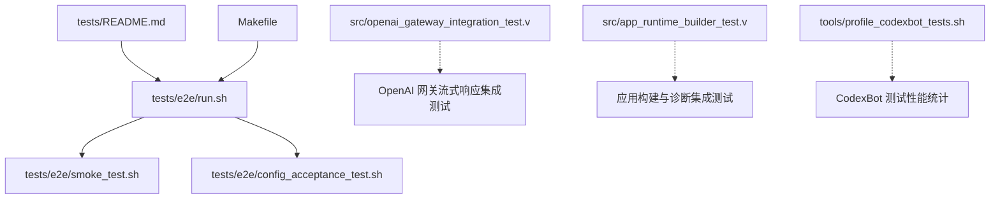
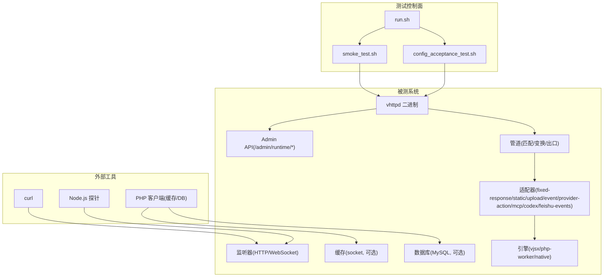
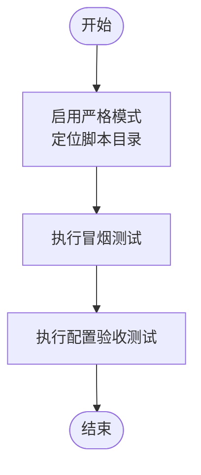
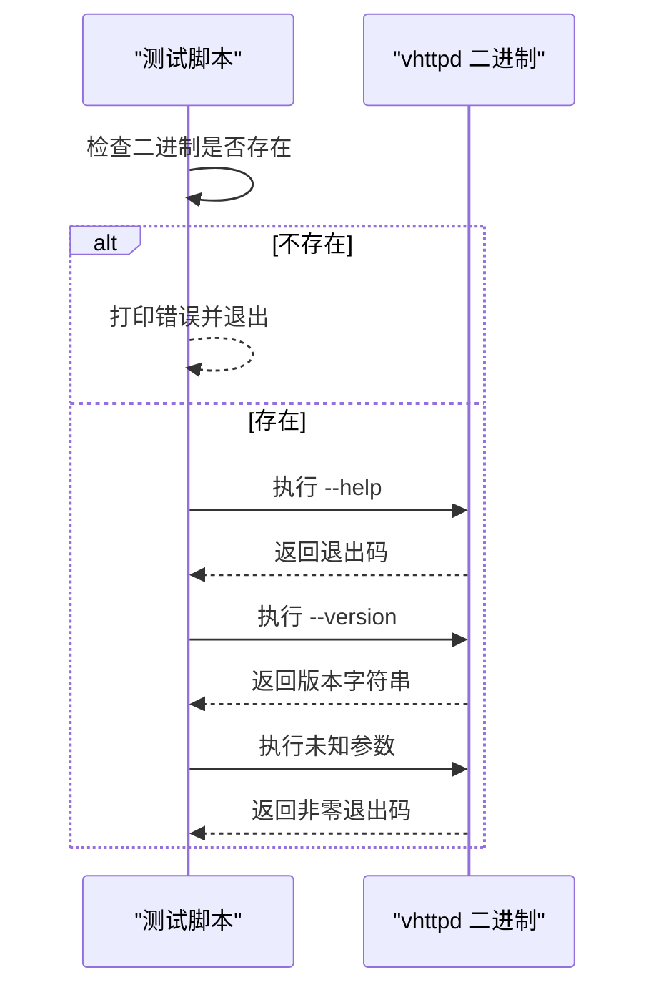
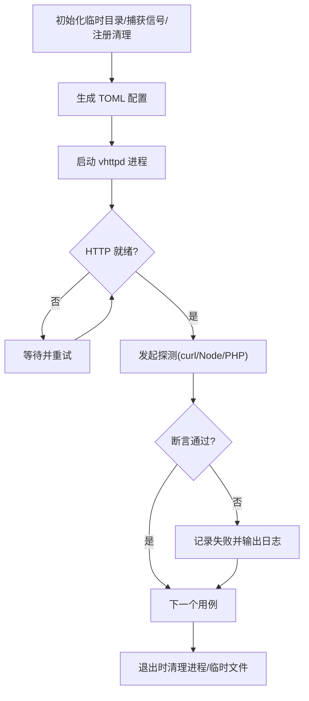
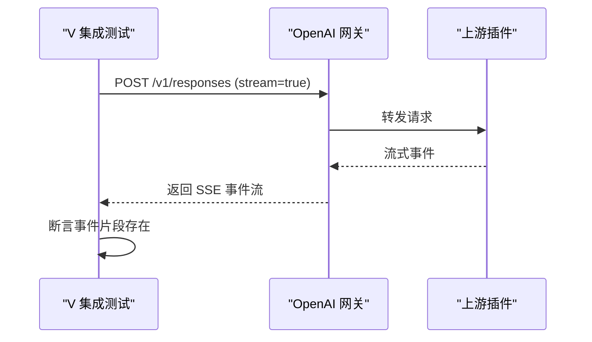
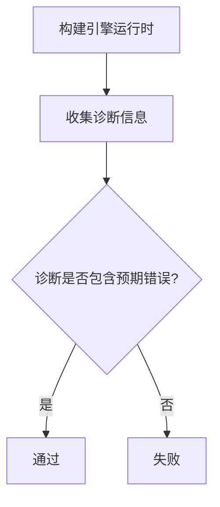
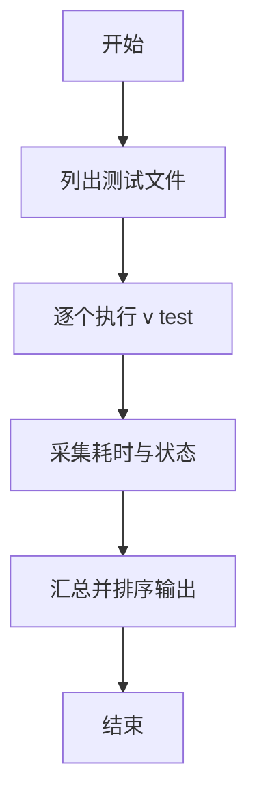
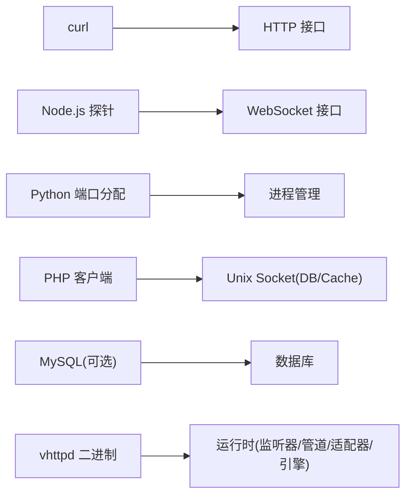

# 集成测试

<cite>
**本文引用的文件**   
- [tests/README.md](file://tests/README.md)
- [tests/e2e/run.sh](file://tests/e2e/run.sh)
- [tests/e2e/smoke_test.sh](file://tests/e2e/smoke_test.sh)
- [tests/e2e/config_acceptance_test.sh](file://tests/e2e/config_acceptance_test.sh)
- [Makefile](file://Makefile)
- [src/openai_gateway_integration_test.v](file://src/openai_gateway_integration_test.v)
- [src/app_runtime_builder_test.v](file://src/app_runtime_builder_test.v)
- [tools/profile_codexbot_tests.sh](file://tools/profile_codexbot_tests.sh)
</cite>

## 目录
1. [简介](#简介)
2. [项目结构](#项目结构)
3. [核心组件](#核心组件)
4. [架构总览](#架构总览)
5. [详细组件分析](#详细组件分析)
6. [依赖分析](#依赖分析)
7. [性能考虑](#性能考虑)
8. [故障排查指南](#故障排查指南)
9. [结论](#结论)
10. [附录](#附录)

## 简介
本指南面向希望为 vhttpd 编写端到端（E2E）集成测试的工程师，覆盖以下目标：
- HTTP 请求、WebSocket 连接与流式响应的端到端验证方法
- 测试环境搭建与管理：测试数据库初始化、外部服务模拟、配置文件管理
- 测试脚本编写：Shell 脚本与 Go/V 测试程序的实现要点
- 测试数据策略：准备、清理与隔离
- 并行执行与结果收集

vhttpd 的 E2E 套件以 Shell 脚本为主，通过启动编译后的二进制程序并调用 curl、Node.js 探针等工具对运行时进行黑盒验证；同时仓库内也包含若干 V 语言编写的集成测试，用于覆盖更细粒度的协议与运行时行为。

## 项目结构
E2E 测试位于 tests/e2e 目录，入口脚本统一编排子测试用例；单元测试与部分集成测试位于 src 目录下，遵循 V 语言的模块系统约定。

图表来源
- [tests/README.md:1-38](file://tests/README.md#L1-L38)
- [tests/e2e/run.sh:1-15](file://tests/e2e/run.sh#L1-L15)
- [tests/e2e/smoke_test.sh:1-62](file://tests/e2e/smoke_test.sh#L1-L62)
- [tests/e2e/config_acceptance_test.sh:1-800](file://tests/e2e/config_acceptance_test.sh#L1-L800)
- [Makefile:159-161](file://Makefile#L159-L161)
- [src/openai_gateway_integration_test.v:1156-1182](file://src/openai_gateway_integration_test.v#L1156-L1182)
- [src/app_runtime_builder_test.v:118-409](file://src/app_runtime_builder_test.v#L118-L409)
- [tools/profile_codexbot_tests.sh:1-39](file://tools/profile_codexbot_tests.sh#L1-L39)

章节来源
- [tests/README.md:1-38](file://tests/README.md#L1-L38)
- [tests/e2e/run.sh:1-15](file://tests/e2e/run.sh#L1-L15)
- [tests/e2e/smoke_test.sh:1-62](file://tests/e2e/smoke_test.sh#L1-L62)
- [tests/e2e/config_acceptance_test.sh:1-800](file://tests/e2e/config_acceptance_test.sh#L1-L800)
- [Makefile:159-161](file://Makefile#L159-L161)

## 核心组件
- E2E 入口与编排
  - run.sh：统一入口，顺序执行 smoke 与配置验收测试
  - smoke_test.sh：无外部依赖的二进制 CLI 冒烟测试（--help/--version/未知参数）
  - config_acceptance_test.sh：产品级配置验收，动态生成 TOML 配置、启动进程、HTTP/WebSocket/事件/上传/Provider 等场景断言

- Makefile 集成
  - test-e2e：调用 tests/e2e/run.sh 执行全部 E2E 用例

- V 集成测试
  - openai_gateway_integration_test.v：OpenAI 网关流式响应端到端验证
  - app_runtime_builder_test.v：应用构建与诊断路径的集成验证

- 性能统计
  - tools/profile_codexbot_tests.sh：对 CodexBot 相关测试逐个计时并汇总

章节来源
- [tests/e2e/run.sh:1-15](file://tests/e2e/run.sh#L1-L15)
- [tests/e2e/smoke_test.sh:1-62](file://tests/e2e/smoke_test.sh#L1-L62)
- [tests/e2e/config_acceptance_test.sh:1-800](file://tests/e2e/config_acceptance_test.sh#L1-L800)
- [Makefile:159-161](file://Makefile#L159-L161)
- [src/openai_gateway_integration_test.v:1156-1182](file://src/openai_gateway_integration_test.v#L1156-L1182)
- [src/app_runtime_builder_test.v:118-409](file://src/app_runtime_builder_test.v#L118-L409)
- [tools/profile_codexbot_tests.sh:1-39](file://tools/profile_codexbot_tests.sh#L1-L39)

## 架构总览
下图展示了 E2E 测试在运行时的整体交互：测试脚本作为控制面，启动 vhttpd 实例，并通过 HTTP/WebSocket/事件通道与运行中的适配器、引擎、管道和外部子系统交互。

图表来源
- [tests/e2e/run.sh:1-15](file://tests/e2e/run.sh#L1-L15)
- [tests/e2e/config_acceptance_test.sh:1-800](file://tests/e2e/config_acceptance_test.sh#L1-L800)
- [tests/e2e/config_acceptance_test.sh:800-1599](file://tests/e2e/config_acceptance_test.sh#L800-L1599)
- [tests/e2e/config_acceptance_test.sh:1600-2399](file://tests/e2e/config_acceptance_test.sh#L1600-L2399)

## 详细组件分析

### 组件A：E2E 入口与编排（run.sh）
- 职责
  - 设置严格模式，定位脚本目录
  - 依次执行冒烟测试与配置验收测试
- 关键点
  - 失败即终止（set -euo pipefail），保证流水线快速失败
  - 输出分隔便于 CI 日志解析

图表来源
- [tests/e2e/run.sh:1-15](file://tests/e2e/run.sh#L1-L15)

章节来源
- [tests/e2e/run.sh:1-15](file://tests/e2e/run.sh#L1-L15)

### 组件B：冒烟测试（smoke_test.sh）
- 职责
  - 校验 vhttpd 二进制存在且可执行
  - 验证 --help、--version 与未知参数的退出码
- 关键点
  - 使用本地临时变量记录 PASS/FAIL 计数
  - 失败时输出明确错误提示并返回非零退出码

图表来源
- [tests/e2e/smoke_test.sh:1-62](file://tests/e2e/smoke_test.sh#L1-L62)

章节来源
- [tests/e2e/smoke_test.sh:1-62](file://tests/e2e/smoke_test.sh#L1-L62)

### 组件C：配置验收测试（config_acceptance_test.sh）
- 职责
  - 动态生成 TOML 配置（V1/V2、多站点、WordPress、Relay、WebSocket、Provider、MCP、DB、Cache、Upload、Event、Stream 等）
  - 启动 vhttpd 进程，轮询等待就绪
  - 通过 curl/Node/PHP 探针发起 HTTP/WebSocket/事件/上传/缓存/数据库操作
  - 断言状态码、响应体、响应头、事件日志、Admin API 快照
- 关键能力
  - 端口分配：free_port() 基于 Python 随机绑定获取空闲端口
  - 进程管理：start_vhttpd() 启动并记录 PID/日志文件，EXIT 钩子统一清理
  - 健康等待：wait_http_contains/wait_http_header_contains 等封装，带超时与重试
  - 配置模板：write_*_config() 系列函数按需拼装配置片段
  - 外部依赖开关：通过环境变量控制是否启用真实数据库或 WordPress 根目录

图表来源
- [tests/e2e/config_acceptance_test.sh:1-800](file://tests/e2e/config_acceptance_test.sh#L1-L800)
- [tests/e2e/config_acceptance_test.sh:800-1599](file://tests/e2e/config_acceptance_test.sh#L800-L1599)
- [tests/e2e/config_acceptance_test.sh:1600-2399](file://tests/e2e/config_acceptance_test.sh#L1600-L2399)

章节来源
- [tests/e2e/config_acceptance_test.sh:1-800](file://tests/e2e/config_acceptance_test.sh#L1-L800)
- [tests/e2e/config_acceptance_test.sh:800-1599](file://tests/e2e/config_acceptance_test.sh#L800-L1599)
- [tests/e2e/config_acceptance_test.sh:1600-2399](file://tests/e2e/config_acceptance_test.sh#L1600-L2399)

### 组件D：OpenAI 网关流式响应集成测试（openai_gateway_integration_test.v）
- 职责
  - 启动 OpenAI 网关与上游插件，发送 POST /v1/responses 并开启 stream=true
  - 断言响应体包含 event: response.created、response.output_text.delta、executor stream、response.completed 等片段
- 关键点
  - 使用 V 内置 http.fetch 发起请求并读取 body
  - 适用于验证服务端 SSE 流式输出的完整性与时序

图表来源
- [src/openai_gateway_integration_test.v:1156-1182](file://src/openai_gateway_integration_test.v#L1156-L1182)

章节来源
- [src/openai_gateway_integration_test.v:1156-1182](file://src/openai_gateway_integration_test.v#L1156-L1182)

### 组件E：应用构建与诊断集成测试（app_runtime_builder_test.v）
- 职责
  - 构造不同 EnginePlan（相同 executor kind 但不同线程数/超时等），验证构建产物与诊断信息
  - 注入非法 executor kind，验证诊断错误码与路径
- 关键点
  - 通过 runtime_plan 描述资源与路由，再构建 AppRuntime
  - 断言 diagnostics 中包含 additional_engine_runtime_failed 等错误

图表来源
- [src/app_runtime_builder_test.v:118-409](file://src/app_runtime_builder_test.v#L118-L409)

章节来源
- [src/app_runtime_builder_test.v:118-409](file://src/app_runtime_builder_test.v#L118-L409)

### 组件F：CodexBot 测试性能统计（profile_codexbot_tests.sh）
- 职责
  - 遍历一组 CodexBot 测试文件，逐个执行并记录耗时
  - 汇总排序输出，便于识别慢用例
- 关键点
  - 使用 /usr/bin/time -p 采集 real 时间
  - 支持自定义 root_dir 参数

图表来源
- [tools/profile_codexbot_tests.sh:1-39](file://tools/profile_codexbot_tests.sh#L1-L39)

章节来源
- [tools/profile_codexbot_tests.sh:1-39](file://tools/profile_codexbot_tests.sh#L1-L39)

## 依赖分析
- 外部工具与环境
  - curl：HTTP 请求与头部断言
  - Node.js：WebSocket 探针与 Provider WebSocket 上游模拟
  - Python：端口分配（socket.bind("127.0.0.1", 0)）
  - PHP：缓存/数据库客户端探针（Unix Socket）
  - MySQL：可选的真实数据库（通过环境变量开关）
- 内部依赖
  - vhttpd 二进制：由 make build 产出
  - TOML 配置：由测试脚本动态生成，避免硬编码
  - Admin API：/admin/runtime/* 暴露运行时快照与计划

图表来源
- [tests/e2e/config_acceptance_test.sh:1-800](file://tests/e2e/config_acceptance_test.sh#L1-L800)
- [tests/e2e/config_acceptance_test.sh:800-1599](file://tests/e2e/config_acceptance_test.sh#L800-L1599)
- [tests/e2e/config_acceptance_test.sh:1600-2399](file://tests/e2e/config_acceptance_test.sh#L1600-L2399)

章节来源
- [tests/e2e/config_acceptance_test.sh:1-800](file://tests/e2e/config_acceptance_test.sh#L1-L800)
- [tests/e2e/config_acceptance_test.sh:800-1599](file://tests/e2e/config_acceptance_test.sh#L800-L1599)
- [tests/e2e/config_acceptance_test.sh:1600-2399](file://tests/e2e/config_acceptance_test.sh#L1600-L2399)

## 性能考虑
- 串行执行与快速失败
  - run.sh 顺序执行各子测试，任一失败立即停止，缩短反馈周期
- 并发建议
  - 当前未提供并行执行机制；可在上层 CI 将不同场景拆分为独立任务并行运行（例如按功能域拆分：HTTP、WebSocket、Provider、DB/Cache）
- 资源隔离
  - 每个测试使用独立临时目录与随机端口，避免进程/端口/文件冲突
- 观测性
  - 事件日志 NDJSON 与 Admin API 快照有助于定位瓶颈与异常

[本节为通用指导，不直接分析具体文件]

## 故障排查指南
- 常见失败点
  - 二进制缺失：确保先执行 make build
  - 端口占用：free_port() 会尝试绑定随机端口，若仍失败需检查系统端口范围或清理残留进程
  - 外部依赖未就绪：MySQL/WordPress 根目录需通过环境变量显式开启
  - 网络/权限：Unix Socket 路径需具备读写权限
- 定位手段
  - 查看测试生成的 .log/.events.ndjson 尾部日志
  - 访问 Admin API 快照（/admin/runtime/*）确认监听器/管道/适配器状态
  - 针对 WebSocket/Provider 场景，检查 Node 探针输出文件

章节来源
- [tests/e2e/config_acceptance_test.sh:1-800](file://tests/e2e/config_acceptance_test.sh#L1-L800)
- [tests/e2e/config_acceptance_test.sh:800-1599](file://tests/e2e/config_acceptance_test.sh#L800-L1599)
- [tests/e2e/config_acceptance_test.sh:1600-2399](file://tests/e2e/config_acceptance_test.sh#L1600-L2399)

## 结论
vhttpd 的集成测试体系以 Shell 驱动的 E2E 为主，辅以若干 V 集成测试覆盖协议与运行时细节。通过动态配置、进程隔离、外部工具探针与丰富的断言封装，能够高效验证 HTTP、WebSocket、事件、上传、Provider、MCP、DB/Cache 等复杂场景。建议在 CI 中按功能域拆分并行任务，并结合 Admin API 与事件日志完善可观测性与排障效率。

[本节为总结性内容，不直接分析具体文件]

## 附录

### 如何编写端到端测试（实践清单）
- 环境准备
  - 构建二进制：make build
  - 安装必要工具：curl、node、python3、php（如需 DB/Cache 探针）
  - 可选：本地 MySQL、WordPress 根目录（通过环境变量开启）
- 编写步骤
  - 定义配置：使用 write_*_config() 风格函数生成 TOML
  - 启动进程：start_vhttpd() 启动并记录 PID/日志
  - 等待就绪：使用 wait_http_contains* 系列函数轮询
  - 发起探测：curl/Node/PHP 探针发起请求
  - 断言结果：状态码、响应体、响应头、事件日志、Admin API
  - 清理资源：EXIT 钩子统一 kill 进程与删除临时文件
- 示例参考
  - HTTP 基础：smoke_test.sh
  - 配置与管道：config_acceptance_test.sh 的多站点/WordPress/Relay/WebSocket/Provider/MCP/DB/Cache/Upload/Event/Stream 场景
  - 流式响应：src/openai_gateway_integration_test.v
  - 构建与诊断：src/app_runtime_builder_test.v

章节来源
- [tests/README.md:1-38](file://tests/README.md#L1-L38)
- [tests/e2e/smoke_test.sh:1-62](file://tests/e2e/smoke_test.sh#L1-L62)
- [tests/e2e/config_acceptance_test.sh:1-800](file://tests/e2e/config_acceptance_test.sh#L1-L800)
- [tests/e2e/config_acceptance_test.sh:800-1599](file://tests/e2e/config_acceptance_test.sh#L800-L1599)
- [tests/e2e/config_acceptance_test.sh:1600-2399](file://tests/e2e/config_acceptance_test.sh#L1600-L2399)
- [src/openai_gateway_integration_test.v:1156-1182](file://src/openai_gateway_integration_test.v#L1156-L1182)
- [src/app_runtime_builder_test.v:118-409](file://src/app_runtime_builder_test.v#L118-L409)