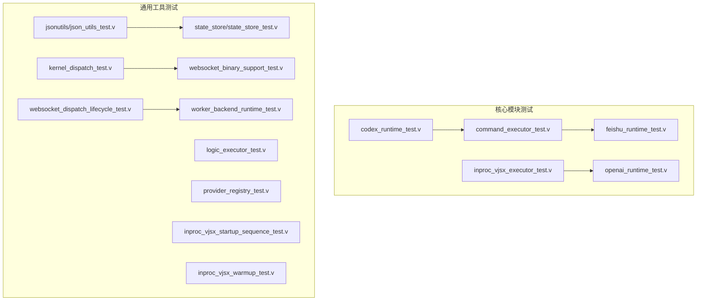
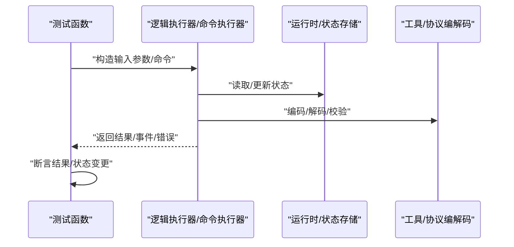
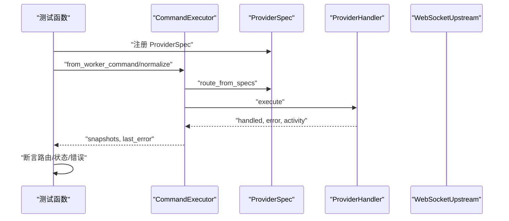
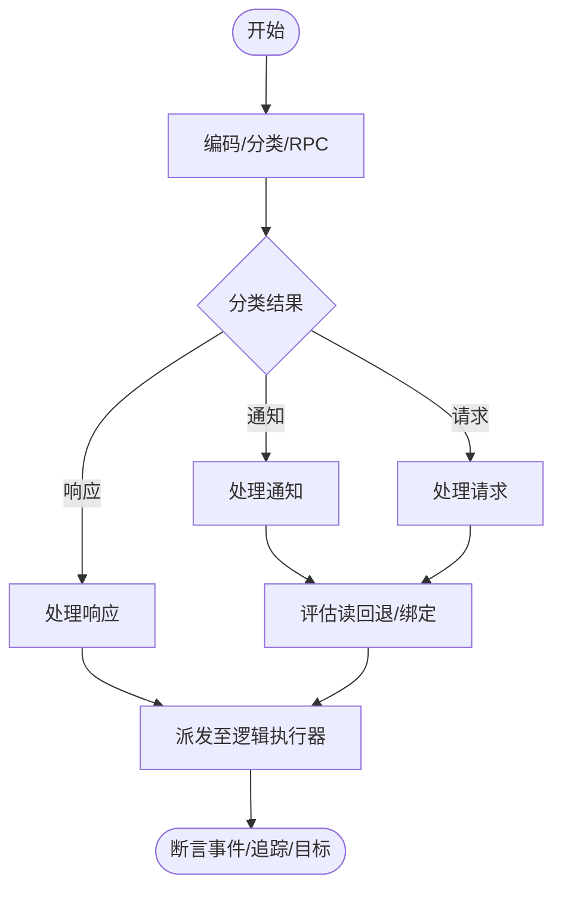
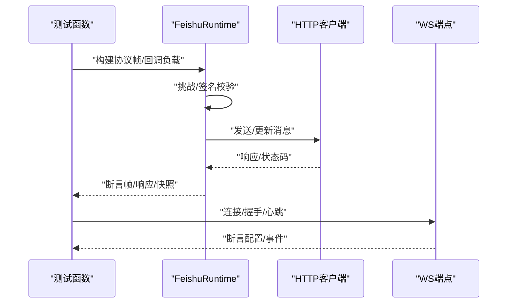
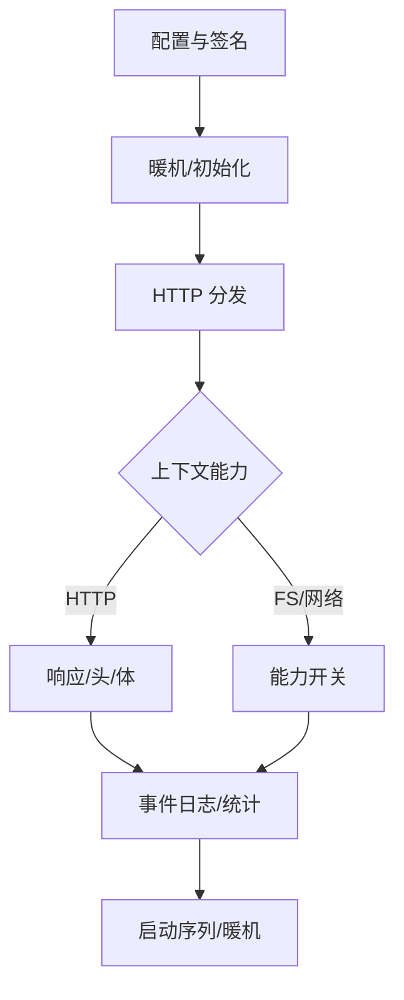
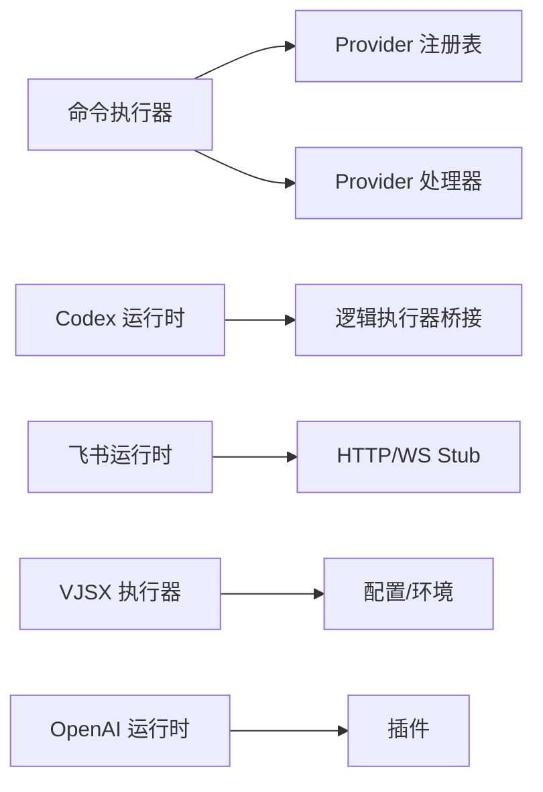

# 单元测试

<cite>
**本文引用的文件**
- [src/codex_runtime_test.v](file://src/codex_runtime_test.v)
- [src/command_executor_test.v](file://src/command_executor_test.v)
- [src/feishu_runtime_test.v](file://src/feishu_runtime_test.v)
- [src/jsonutils/json_utils_test.v](file://src/jsonutils/json_utils_test.v)
- [src/state_store/state_store_test.v](file://src/state_store/state_store_test.v)
- [src/kernel_dispatch_test.v](file://src/kernel_dispatch_test.v)
- [src/logic_executor_test.v](file://src/logic_executor_test.v)
- [src/provider_registry_test.v](file://src/provider_registry_test.v)
- [src/inproc_vjsx_executor_test.v](file://src/inproc_vjsx_executor_test.v)
- [src/websocket_dispatch_lifecycle_test.v](file://src/websocket_dispatch_lifecycle_test.v)
- [src/worker_backend_runtime_test.v](file://src/worker_backend_runtime_test.v)
- [src/inproc_vjsx_startup_sequence_test.v](file://src/inproc_vjsx_startup_sequence_test.v)
- [src/inproc_vjsx_warmup_test.v](file://src/inproc_vjsx_warmup_test.v)
- [src/websocket_binary_support_test.v](file://src/websocket_binary_support_test.v)
- [src/openai_runtime_test.v](file://src/openai_runtime_test.v)
</cite>

## 目录
1. [简介](#简介)
2. [项目结构](#项目结构)
3. [核心组件](#核心组件)
4. [架构总览](#架构总览)
5. [详细组件分析](#详细组件分析)
6. [依赖分析](#依赖分析)
7. [性能考虑](#性能考虑)
8. [故障排查指南](#故障排查指南)
9. [结论](#结论)
10. [附录](#附录)

## 简介
本文件系统性梳理 vhttpd 的单元测试实现，覆盖 V 语言的测试文件命名约定（以 *_test.v 结尾）、测试函数的组织结构与断言方法，并深入解析核心模块的测试策略，包括 codex_runtime、command_executor、feishu_runtime 等。同时提供测试数据准备、模拟对象与测试隔离的最佳实践，说明如何运行特定模块的测试及统计测试覆盖率的方法，并总结测试失败的常见原因与调试技巧。

## 项目结构
- 测试文件遵循 V 语言约定：以模块名作为包名，测试函数以小写开头，使用断言进行验证。
- 每个核心模块通常对应一个独立的 *_test.v 文件，便于按功能域隔离与并行执行。
- 部分测试通过构造最小化 App 或 Runtime 实例，注入必要的配置与状态，确保测试可重复且无副作用。

图表来源
- [src/codex_runtime_test.v:1-472](file://src/codex_runtime_test.v#L1-L472)
- [src/command_executor_test.v:1-767](file://src/command_executor_test.v#L1-L767)
- [src/feishu_runtime_test.v:1-964](file://src/feishu_runtime_test.v#L1-L964)
- [src/inproc_vjsx_executor_test.v:1-800](file://src/inproc_vjsx_executor_test.v#L1-L800)
- [src/openai_runtime_test.v:1-413](file://src/openai_runtime_test.v#L1-L413)
- [src/jsonutils/json_utils_test.v:1-55](file://src/jsonutils/json_utils_test.v#L1-L55)
- [src/state_store/state_store_test.v:1-82](file://src/state_store/state_store_test.v#L1-L82)
- [src/kernel_dispatch_test.v:1-38](file://src/kernel_dispatch_test.v#L1-L38)
- [src/logic_executor_test.v:1-85](file://src/logic_executor_test.v#L1-L85)
- [src/provider_registry_test.v:1-585](file://src/provider_registry_test.v#L1-L585)
- [src/websocket_binary_support_test.v:1-63](file://src/websocket_binary_support_test.v#L1-L63)
- [src/websocket_dispatch_lifecycle_test.v:1-84](file://src/websocket_dispatch_lifecycle_test.v#L1-L84)
- [src/worker_backend_runtime_test.v:1-17](file://src/worker_backend_runtime_test.v#L1-L17)
- [src/inproc_vjsx_startup_sequence_test.v:1-104](file://src/inproc_vjsx_startup_sequence_test.v#L1-L104)
- [src/inproc_vjsx_warmup_test.v:1-98](file://src/inproc_vjsx_warmup_test.v#L1-L98)

章节来源
- [src/codex_runtime_test.v:1-472](file://src/codex_runtime_test.v#L1-L472)
- [src/command_executor_test.v:1-767](file://src/command_executor_test.v#L1-L767)
- [src/feishu_runtime_test.v:1-964](file://src/feishu_runtime_test.v#L1-L964)

## 核心组件
- 断言与错误处理：多数测试使用断言进行条件判断；对可能抛错的路径，使用捕获错误并断言错误消息或错误码的方式验证异常分支。
- 测试隔离：通过在测试中构造最小化的 App、Runtime 或 Executor 实例，避免全局状态污染；必要时使用 defer 关闭资源或清理临时目录。
- 数据准备：对需要外部资源（如文件、网络）的测试，优先采用内存态或本地 stub；对真实依赖（如 HTTP、WS）使用并发与延迟控制保证可重复性。

章节来源
- [src/jsonutils/json_utils_test.v:1-55](file://src/jsonutils/json_utils_test.v#L1-L55)
- [src/state_store/state_store_test.v:1-82](file://src/state_store/state_store_test.v#L1-L82)
- [src/inproc_vjsx_executor_test.v:1-800](file://src/inproc_vjsx_executor_test.v#L1-L800)

## 架构总览
下图展示测试中常见的调用链路与断言点，体现“请求—处理—响应/事件”的闭环。

图表来源
- [src/command_executor_test.v:1-767](file://src/command_executor_test.v#L1-L767)
- [src/feishu_runtime_test.v:1-964](file://src/feishu_runtime_test.v#L1-L964)
- [src/codex_runtime_test.v:1-472](file://src/codex_runtime_test.v#L1-L472)

## 详细组件分析

### 命令执行器测试（command_executor_test.v）
- 职责：验证从上游 WebSocket 命令到规范化命令、路由匹配、处理器执行与活动快照的全流程。
- 关键断言点：
  - 规范化命令字段映射（版本、类型、提供方、关联信息等）。
  - 路由匹配行为（前缀匹配、启用/禁用开关、回退策略）。
  - 处理器执行结果（会话绑定/清除、流目标注册与移除、缓冲区管理）。
  - 上游命令执行的错误与跳过场景（未知提供方、不支持的事件）。
- 最佳实践：
  - 使用 ProviderSpec 注册最小化 Provider 与 Handler，避免真实网络依赖。
  - 对 Feishu/Codex/Ollama 等路由分别构造禁用/启用场景，覆盖默认值与回退。

图表来源
- [src/command_executor_test.v:1-767](file://src/command_executor_test.v#L1-L767)

章节来源
- [src/command_executor_test.v:1-767](file://src/command_executor_test.v#L1-L767)

### Codex 运行时测试（codex_runtime_test.v）
- 职责：验证 Codex RPC 编解码、分类、提取器、会话绑定、读回退调度、事件与响应分发等。
- 关键断言点：
  - RPC 请求/通知编码与分类（响应/通知/请求）。
  - 提取器对字符串/原始字段的正确性。
  - 读回退调度策略（活跃状态、delta、reasoning 等触发条件）。
  - 逻辑执行器桥接（无 Worker Socket 场景下的事件派发）。
- 最佳实践：
  - 使用最小化 App 与 CodexProviderRuntime，设置线程-流映射与 pending RPC。
  - 通过自定义逻辑执行器（占位实现）验证事件派发字段与追踪 ID。

图表来源
- [src/codex_runtime_test.v:95-472](file://src/codex_runtime_test.v#L95-L472)

章节来源
- [src/codex_runtime_test.v:1-472](file://src/codex_runtime_test.v#L1-L472)

### 飞书运行时测试（feishu_runtime_test.v）
- 职责：验证飞书协议帧编解码、回调校验（挑战/签名）、消息构建、HTTP 并发序列化、卡片更新、聊天快照与活动记录等。
- 关键断言点：
  - 协议帧 roundtrip、ACK/PONG 元数据保留。
  - 回调挑战与签名验证。
  - 消息内容构建（文本/图片/媒体）与 HTTP 方法选择。
  - 并发 HTTP 请求串行化与计数。
  - 流式预览与滚动截断。
  - 聊天快照去重与过滤。
- 最佳实践：
  - 使用 http_test_stub 与延迟参数，控制并发与时间窗口。
  - 构造多条事件，验证去重与计数逻辑。

图表来源
- [src/feishu_runtime_test.v:43-964](file://src/feishu_runtime_test.v#L43-L964)

章节来源
- [src/feishu_runtime_test.v:1-964](file://src/feishu_runtime_test.v#L1-L964)

### 内部 VJSX 执行器测试（inproc_vjsx_executor_test.v）
- 职责：验证 VJSX 逻辑执行器的签名计算、源文件范围、HTTP 分发、上下文能力、事件日志、启动序列与暖机等。
- 关键断言点：
  - 签名计算受包含/排除规则影响。
  - HTTP 请求上下文能力、头部/查询/Cookie/JSON 解析。
  - 语义化响应辅助方法（201/202/204/400/422/409/404）。
  - 事件日志 emit 行为。
  - 启动序列与暖机确保 app_startup 只执行一次、所有 Lane 初始化完成。
- 最佳实践：
  - 使用临时目录与最小化应用入口，避免磁盘污染。
  - 通过环境变量覆盖资产根目录，验证加载路径。

图表来源
- [src/inproc_vjsx_executor_test.v:1-800](file://src/inproc_vjsx_executor_test.v#L1-L800)
- [src/inproc_vjsx_startup_sequence_test.v:1-104](file://src/inproc_vjsx_startup_sequence_test.v#L1-L104)
- [src/inproc_vjsx_warmup_test.v:1-98](file://src/inproc_vjsx_warmup_test.v#L1-L98)

章节来源
- [src/inproc_vjsx_executor_test.v:1-800](file://src/inproc_vjsx_executor_test.v#L1-L800)
- [src/inproc_vjsx_startup_sequence_test.v:1-104](file://src/inproc_vjsx_startup_sequence_test.v#L1-L104)
- [src/inproc_vjsx_warmup_test.v:1-98](file://src/inproc_vjsx_warmup_test.v#L1-L98)

### OpenAI 运行时测试（openai_runtime_test.v）
- 职责：验证相对路径解析、路由映射、插件计划、模型替换、响应协议映射与 NDJSON 聚合。
- 关键断言点：
  - 相对路径与基础路径匹配。
  - 路由到上游模型映射。
  - 插件返回的上游计划与头部/路径/方法/流模式校验。
  - NDJSON 流聚合为标准 OpenAI 响应格式。
- 最佳实践：
  - 使用最小化插件与后端配置，覆盖“未处理”回退路径。
  - 对无效计划进行错误码断言。

章节来源
- [src/openai_runtime_test.v:1-413](file://src/openai_runtime_test.v#L1-L413)

### 通用工具与基础设施测试
- JSON 工具测试（json_utils_test.v）：验证顶层键存在性检测，处理转义、Unicode、嵌套数组等边界。
- 状态存储测试（state_store_test.v）：验证 TTL 过期、修剪、补丁更新与缺失键错误。
- 内核分发测试（kernel_dispatch_test.v）：验证从上游/流分发请求到内核信封的转换。
- 逻辑执行器测试（logic_executor_test.v）：验证不同执行器身份与运行时快照。
- Provider 注册与运行时测试（provider_registry_test.v）：验证注册、启用、动态实例、上游连接状态与度量。
- WebSocket 支持测试（websocket_*_test.v）：验证帧类型、二进制编码、生命周期状态机与 Hub 清理。
- Worker 后端运行时测试（worker_backend_runtime_test.v）：验证后端种类与启用条件。

章节来源
- [src/jsonutils/json_utils_test.v:1-55](file://src/jsonutils/json_utils_test.v#L1-L55)
- [src/state_store/state_store_test.v:1-82](file://src/state_store/state_store_test.v#L1-L82)
- [src/kernel_dispatch_test.v:1-38](file://src/kernel_dispatch_test.v#L1-L38)
- [src/logic_executor_test.v:1-85](file://src/logic_executor_test.v#L1-L85)
- [src/provider_registry_test.v:1-585](file://src/provider_registry_test.v#L1-L585)
- [src/websocket_dispatch_lifecycle_test.v:1-84](file://src/websocket_dispatch_lifecycle_test.v#L1-L84)
- [src/websocket_binary_support_test.v:1-63](file://src/websocket_binary_support_test.v#L1-L63)
- [src/worker_backend_runtime_test.v:1-17](file://src/worker_backend_runtime_test.v#L1-L17)

## 依赖分析
- 模块间耦合：
  - command_executor 依赖 provider 注册表与路由规则，测试中通过 ProviderSpec 注入最小化 Provider/Handler。
  - codex_runtime 与 feishu_runtime 依赖各自协议编解码与回调校验，测试中通过构造最小化 App 与 Runtime。
  - inproc_vjsx_executor 依赖配置与环境变量，测试中通过临时目录与环境覆盖。
- 外部依赖：
  - HTTP/WS stub 与并发控制用于保证可重复性。
  - 插件系统（OpenAI）通过最小化插件入口与后端配置进行验证。

图表来源
- [src/command_executor_test.v:1-767](file://src/command_executor_test.v#L1-L767)
- [src/codex_runtime_test.v:1-472](file://src/codex_runtime_test.v#L1-L472)
- [src/feishu_runtime_test.v:1-964](file://src/feishu_runtime_test.v#L1-L964)
- [src/inproc_vjsx_executor_test.v:1-800](file://src/inproc_vjsx_executor_test.v#L1-L800)
- [src/openai_runtime_test.v:1-413](file://src/openai_runtime_test.v#L1-L413)

章节来源
- [src/command_executor_test.v:1-767](file://src/command_executor_test.v#L1-L767)
- [src/provider_registry_test.v:1-585](file://src/provider_registry_test.v#L1-L585)

## 性能考虑
- 并发与串行化：飞书运行时测试通过并发 HTTP 请求与串行化策略验证吞吐与顺序一致性。
- 签名与缓存：VJSX 执行器测试覆盖签名范围与缓存根目录，减少不必要的重建。
- 生命周期与资源回收：WebSocket 生命周期测试确保清理阶段只执行一次，避免悬挂状态。

## 故障排查指南
- 断言失败定位：
  - 使用最小化输入与明确的断言消息，快速定位失败点。
  - 对错误路径断言错误码与消息，区分“未处理”“未知提供方”“不支持的事件”等。
- 资源泄漏与竞态：
  - 确保测试结束后关闭执行器、删除临时文件、释放锁。
  - 对并发场景使用固定延迟或信号量控制，避免竞态。
- 真实依赖问题：
  - 优先使用 http_test_stub 与本地端口，避免对外部服务的依赖。
  - 对 WS 握手与心跳，断言配置字段与事件顺序。

章节来源
- [src/feishu_runtime_test.v:300-334](file://src/feishu_runtime_test.v#L300-L334)
- [src/websocket_dispatch_lifecycle_test.v:23-60](file://src/websocket_dispatch_lifecycle_test.v#L23-L60)

## 结论
vhttpd 的单元测试体系以模块化与最小化为核心，通过规范的断言与严格的测试隔离，覆盖了命令路由、Codex/Feishu 协议、VJSX 执行器、OpenAI 插件与基础设施的关键路径。建议在新增功能时遵循现有测试模式：构造最小化上下文、明确断言点、关注错误与边界场景，并结合并发与资源回收的最佳实践，确保测试稳定可靠。

## 附录

### V 语言测试文件命名与组织
- 命名约定：以 *_test.v 结尾，模块名为 main 或具体包名。
- 组织结构：每个模块一个测试文件，测试函数以小写开头，使用断言进行验证。
- 断言方法：assert 用于布尔条件；对错误进行捕获并断言错误码/消息。

章节来源
- [src/codex_runtime_test.v:1-472](file://src/codex_runtime_test.v#L1-L472)
- [src/command_executor_test.v:1-767](file://src/command_executor_test.v#L1-L767)
- [src/feishu_runtime_test.v:1-964](file://src/feishu_runtime_test.v#L1-L964)

### 测试数据准备与模拟对象
- 最小化 App：仅注入所需状态（如 feishu/codex/openai 等），避免全局状态干扰。
- ProviderSpec：注册最小化 Provider 与 Handler，覆盖启用/禁用与前缀匹配。
- 环境与文件：使用临时目录与环境变量覆盖（如 VJSX_ASSET_ROOT），测试完成后清理。
- 并发与延迟：通过并发任务与固定延迟控制，保证可重复性。

章节来源
- [src/command_executor_test.v:42-73](file://src/command_executor_test.v#L42-L73)
- [src/inproc_vjsx_executor_test.v:54-77](file://src/inproc_vjsx_executor_test.v#L54-L77)
- [src/feishu_runtime_test.v:35-41](file://src/feishu_runtime_test.v#L35-L41)

### 测试隔离最佳实践
- 使用 defer 关闭执行器、删除临时文件、解锁互斥量。
- 在测试前后恢复环境变量与全局状态。
- 对共享资源（如 Hub、缓冲区）在测试中显式清理。

章节来源
- [src/websocket_dispatch_lifecycle_test.v:23-60](file://src/websocket_dispatch_lifecycle_test.v#L23-L60)
- [src/inproc_vjsx_executor_test.v:147-149](file://src/inproc_vjsx_executor_test.v#L147-L149)

### 如何运行特定模块的测试
- 基于模块：在仓库根目录使用 V 编译器运行单个测试文件，例如：
  - 运行命令执行器测试：v src/command_executor_test.v
  - 运行 Codex 运行时测试：v src/codex_runtime_test.v
  - 运行飞书运行时测试：v src/feishu_runtime_test.v
  - 运行 VJSX 执行器测试：v src/inproc_vjsx_executor_test.v
  - 运行 OpenAI 运行时测试：v src/openai_runtime_test.v
- 并行执行：多个 *_test.v 文件可并行运行，但需注意共享资源的互斥与清理。

### 测试覆盖率统计方法
- 使用 V 的内置覆盖率工具（如 v -cov）对指定模块或整个项目进行覆盖率统计，输出 HTML 报告以便查看未覆盖路径。
- 建议针对高风险路径（错误处理、并发、协议编解码）补充测试用例，提升关键路径覆盖率。