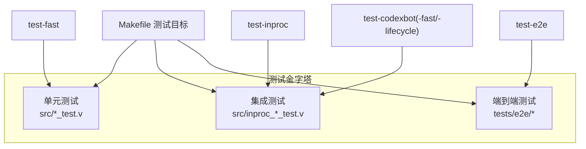
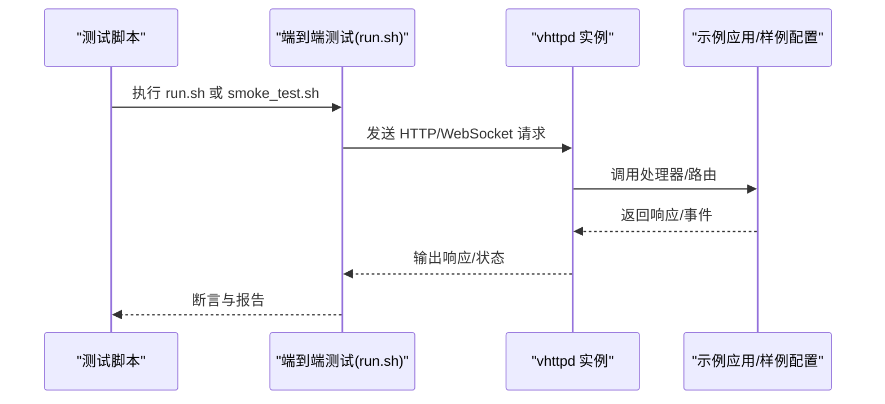
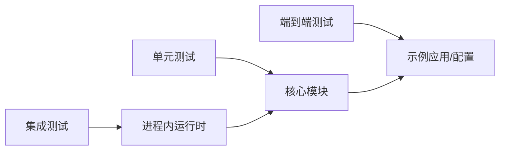

# 测试策略

<cite>
**本文引用的文件**
- [Makefile](file://Makefile)
- [README.md](file://README.md)
- [src/jsonutils/json_utils_test.v](file://src/jsonutils/json_utils_test.v)
- [src/state_store/state_store_test.v](file://src/state_store/state_store_test.v)
- [src/command_executor_test.v](file://src/command_executor_test.v)
- [src/kernel_dispatch_test.v](file://src/kernel_dispatch_test.v)
- [src/openai_runtime_test.v](file://src/openai_runtime_test.v)
- [src/feishu_runtime_test.v](file://src/feishu_runtime_test.v)
- [src/websocket_dispatch_lifecycle_test.v](file://src/websocket_dispatch_lifecycle_test.v)
- [src/websocket_upstream_runtime_test.v](file://src/websocket_upstream_runtime_test.v)
- [src/worker_backend_runtime_test.v](file://src/worker_backend_runtime_test.v)
- [src/inproc_vjsx_executor_test.v](file://src/inproc_vjsx_executor_test.v)
- [src/inproc_vjsx_executor_codexbot_core_test.v](file://src/inproc_vjsx_executor_codexbot_core_test.v)
- [src/inproc_vjsx_executor_codexbot_lifecycle_test.v](file://src/inproc_vjsx_executor_codexbot_lifecycle_test.v)
- [src/inproc_vjsx_executor_codexbot_projects_test.v](file://src/inproc_vjsx_executor_codexbot_projects_test.v)
- [src/inproc_vjsx_executor_codexbot_threads_test.v](file://src/inproc_vjsx_executor_codexbot_threads_test.v)
- [src/inproc_vjsx_executor_codexbot_read_rpc_test.v](file://src/inproc_vjsx_executor_codexbot_read_rpc_test.v)
- [src/inproc_vjsx_executor_codexbot_approval_test.v](file://src/inproc_vjsx_executor_codexbot_approval_test.v)
- [src/inproc_vjsx_executor_codexbot_semantics_test.v](file://src/inproc_vjsx_executor_codexbot_semantics_test.v)
- [src/inproc_vjsx_executor_codexbot_test_helpers.v](file://src/inproc_vjsx_executor_codexbot_test_helpers.v)
- [src/inproc_vjsx_host_api_test.v](file://src/inproc_vjsx_host_api_test.v)
- [src/inproc_vjsx_startup_sequence_test.v](file://src/inproc_vjsx_startup_sequence_test.v)
- [src/inproc_vjsx_warmup_test.v](file://src/inproc_vjsx_warmup_test.v)
- [src/inproc_vjsx_executor_http_fetch_test.v](file://src/inproc_vjsx_executor_http_fetch_test.v)
- [src/codex_runtime_test.v](file://src/codex_runtime_test.v)
- [src/vjsx_host_signature_test.v](file://src/vjsx_host_signature_test.v)
- [src/websocket_binary_support_test.v](file://src/websocket_binary_support_test.v)
- [src/test_sqlite_support.v](file://src/test_sqlite_support.v)
- [src/provider_bootstrap_test.v](file://src/provider_bootstrap_test.v)
- [src/provider_registry_test.v](file://src/provider_registry_test.v)
- [src/command_test.v](file://src/command_test.v)
- [src/server_logic_test.v](file://src/server_logic_test.v)
- [tests/e2e/run.sh](file://tests/e2e/run.sh)
- [tests/e2e/smoke_test.sh](file://tests/e2e/smoke_test.sh)
- [tests/README.md](file://tests/README.md)
- [tools/profile_codexbot_tests.sh](file://tools/profile_codexbot_tests.sh)
</cite>

## 目录
1. [引言](#引言)
2. [项目结构](#项目结构)
3. [核心组件](#核心组件)
4. [架构总览](#架构总览)
5. [详细组件分析](#详细组件分析)
6. [依赖分析](#依赖分析)
7. [性能考虑](#性能考虑)
8. [故障排查指南](#故障排查指南)
9. [结论](#结论)
10. [附录](#附录)

## 引言
本测试策略文档面向 vhttpd 项目的测试体系，系统阐述测试金字塔（单元测试、集成测试、端到端测试）的组织与实施策略；解释 V 语言的单元测试发现机制与测试文件命名约定；梳理 Makefile 中各类测试目标（如 test-fast、test-inproc、test-codexbot 等）的用法；给出端到端测试设计思路（含 shell 脚本测试与无外部依赖的烟雾测试）；并提供测试数据准备、测试环境配置与测试结果分析方法，以及测试覆盖率与质量门禁建议。

## 项目结构
vhttpd 的测试相关目录与文件分布如下：
- 单元测试：位于 src/ 下以 *_test.v 命名的文件，覆盖核心模块与功能子系统。
- 集成测试：以 inproc_*_test.v 命名的文件，聚焦进程内运行时与多模块协作。
- 端到端测试：位于 tests/e2e/，包含 run.sh 与 smoke_test.sh 等脚本。
- 工具与辅助：tools/ 下的性能分析脚本；tests/README.md 提供测试目录说明。

```mermaid
graph TB
A["根目录"] --> B["src/ 源码与单元/集成测试"]
A --> C["tests/ 端到端测试"]
A --> D["tools/ 性能分析工具"]
A --> E["Makefile 构建与测试目标"]
B --> B1["jsonutils/*_test.v"]
B --> B2["state_store/*_test.v"]
B --> B3["command_executor/*_test.v"]
B --> B4["kernel_dispatch/*_test.v"]
B --> B5["openai_runtime/*_test.v"]
B --> B6["feishu_runtime/*_test.v"]
B --> B7["websocket_*/*_test.v"]
B --> B8["worker_backend/*_test.v"]
B --> B9["inproc_*_test.v集成测试"]
B --> B10["codex_runtime/*_test.v"]
B --> B11["provider_*/*_test.v"]
B --> B12["command/*_test.v"]
B --> B13["server_logic/*_test.v"]
C --> C1["e2e/run.sh"]
C --> C2["e2e/smoke_test.sh"]
C --> C3["tests/README.md"]
D --> D1["profile_codexbot_tests.sh"]
```

图表来源
- [Makefile:37-56](file://Makefile#L37-L56)
- [tests/e2e/run.sh](file://tests/e2e/run.sh)
- [tests/e2e/smoke_test.sh](file://tests/e2e/smoke_test.sh)
- [tests/README.md](file://tests/README.md)

章节来源
- [Makefile:37-56](file://Makefile#L37-L56)
- [tests/README.md](file://tests/README.md)

## 核心组件
本节概述测试金字塔的三个层级及在 vhttpd 中的具体落点：

- 单元测试（Unit Tests）
  - 目标：验证最小可测单元（函数、结构体、模块内部逻辑）的正确性。
  - 覆盖范围：jsonutils、state_store、command_executor、kernel_dispatch、openai_runtime、feishu_runtime、websocket_runtime、worker_backend_runtime、provider_* 等。
  - 发现与执行：由 Makefile 自动发现 src/ 下的 *_test.v 文件（排除 heavy 与 db 相关测试），通过 v test 快速执行。

- 集成测试（Integration Tests）
  - 目标：验证模块间协作、进程内运行时行为与跨子系统的交互。
  - 覆盖范围：inproc_*_test.v 文件，涵盖 vjsx 主机 API、启动序列、预热、HTTP 请求处理等。
  - 特殊场景：codexbot 全量/快速/生命周期专用套件，配合 SQLite 开关编译条件。

- 端到端测试（End-to-End Tests）
  - 目标：模拟真实用户场景，验证从请求到响应的完整链路。
  - 形式：shell 脚本驱动，包含 smoke_test.sh 烟雾测试与 run.sh 综合测试。
  - 无外部依赖：优先使用本地资源与内置样例，避免对网络或外部服务的强依赖。

章节来源
- [Makefile:37-56](file://Makefile#L37-L56)
- [src/jsonutils/json_utils_test.v](file://src/jsonutils/json_utils_test.v)
- [src/state_store/state_store_test.v](file://src/state_store/state_store_test.v)
- [src/command_executor_test.v](file://src/command_executor_test.v)
- [src/kernel_dispatch_test.v](file://src/kernel_dispatch_test.v)
- [src/openai_runtime_test.v](file://src/openai_runtime_test.v)
- [src/feishu_runtime_test.v](file://src/feishu_runtime_test.v)
- [src/websocket_dispatch_lifecycle_test.v](file://src/websocket_dispatch_lifecycle_test.v)
- [src/websocket_upstream_runtime_test.v](file://src/websocket_upstream_runtime_test.v)
- [src/worker_backend_runtime_test.v](file://src/worker_backend_runtime_test.v)
- [src/inproc_vjsx_executor_test.v](file://src/inproc_vjsx_executor_test.v)
- [src/inproc_vjsx_executor_codexbot_core_test.v](file://src/inproc_vjsx_executor_codexbot_core_test.v)
- [src/inproc_vjsx_executor_codexbot_lifecycle_test.v](file://src/inproc_vjsx_executor_codexbot_lifecycle_test.v)
- [src/inproc_vjsx_executor_codexbot_projects_test.v](file://src/inproc_vjsx_executor_codexbot_projects_test.v)
- [src/inproc_vjsx_executor_codexbot_threads_test.v](file://src/inproc_vjsx_executor_codexbot_threads_test.v)
- [src/inproc_vjsx_executor_codexbot_read_rpc_test.v](file://src/inproc_vjsx_executor_codexbot_read_rpc_test.v)
- [src/inproc_vjsx_executor_codexbot_approval_test.v](file://src/inproc_vjsx_executor_codexbot_approval_test.v)
- [src/inproc_vjsx_executor_codexbot_semantics_test.v](file://src/inproc_vjsx_executor_codexbot_semantics_test.v)
- [src/inproc_vjsx_executor_codexbot_test_helpers.v](file://src/inproc_vjsx_executor_codexbot_test_helpers.v)
- [src/inproc_vjsx_host_api_test.v](file://src/inproc_vjsx_host_api_test.v)
- [src/inproc_vjsx_startup_sequence_test.v](file://src/inproc_vjsx_startup_sequence_test.v)
- [src/inproc_vjsx_warmup_test.v](file://src/inproc_vjsx_warmup_test.v)
- [src/inproc_vjsx_executor_http_fetch_test.v](file://src/inproc_vjsx_executor_http_fetch_test.v)
- [src/codex_runtime_test.v](file://src/codex_runtime_test.v)
- [src/vjsx_host_signature_test.v](file://src/vjsx_host_signature_test.v)
- [src/websocket_binary_support_test.v](file://src/websocket_binary_support_test.v)
- [src/test_sqlite_support.v](file://src/test_sqlite_support.v)
- [src/provider_bootstrap_test.v](file://src/provider_bootstrap_test.v)
- [src/provider_registry_test.v](file://src/provider_registry_test.v)
- [src/command_test.v](file://src/command_test.v)
- [src/server_logic_test.v](file://src/server_logic_test.v)
- [tests/e2e/run.sh](file://tests/e2e/run.sh)
- [tests/e2e/smoke_test.sh](file://tests/e2e/smoke_test.sh)

## 架构总览
下图展示测试金字塔在 vhttpd 中的层次关系与执行入口：

图表来源
- [Makefile:117-141](file://Makefile#L117-L141)
- [tests/e2e/run.sh](file://tests/e2e/run.sh)
- [tests/e2e/smoke_test.sh](file://tests/e2e/smoke_test.sh)

章节来源
- [Makefile:117-141](file://Makefile#L117-L141)

## 详细组件分析

### V 语言单元测试发现机制与命名约定
- 发现机制
  - Makefile 使用 find 自动扫描 src/ 下的 *_test.v 文件，并通过若干排除规则过滤掉 inproc 与 db 相关测试，形成 FAST_TEST_FILES。
  - 这确保新增的 *_test.v 文件无需手动维护清单即可被自动纳入“快速测试”集合。
- 命名约定
  - 单元测试文件统一采用 *_test.v 后缀，位于 src/ 对应模块目录下。
  - 集成测试文件采用 inproc_*_test.v 前缀，集中于 src/ 下。
  - Codexbot 相关集成测试进一步细分为 core、lifecycle、projects、threads、read_rpc、approval、semantics 等子套件，均以 inproc_*codexbot*_test.v 命名。
- 执行方式
  - 通过 v test 命令执行发现的测试集，支持按需选择不同套件。

章节来源
- [Makefile:37-56](file://Makefile#L37-L56)

### Makefile 测试目标详解
- 常用目标
  - test-fast：仅执行非 inproc 且非 db 的单元测试，适合快速回归。
  - test-inproc：执行所有 inproc_*_test.v 集合，验证进程内运行时。
  - test-codexbot：执行全部 codexbot 集成测试，启用 vjsx_sqlite 编译条件。
  - test-codexbot-fast：排除生命周期测试后的 codexbot 快速套件。
  - test-codexbot-lifecycle：仅执行生命周期相关测试。
  - test-e2e：执行 tests/e2e/run.sh，完成端到端流程。
  - test-all：对 src/ 全量执行 v test，包含所有 *_test.v。
- 编译条件
  - codexbot 系列测试通过 -d vjsx_sqlite 开启 SQLite 支持。
  - 可结合 WITH_DB=1 构建数据库能力，影响测试可用性与数据源。

章节来源
- [Makefile:117-141](file://Makefile#L117-L141)

### 单元测试组织与示例
- 覆盖模块
  - JSON 工具：jsonutils/*_test.v
  - 状态存储：state_store/*_test.v
  - 命令执行：command_executor/*_test.v、command/*_test.v
  - 分发与调度：kernel_dispatch/*_test.v、server_logic/*_test.v
  - 运行时：openai_runtime/*_test.v、feishu_runtime/*_test.v
  - WebSocket：websocket_dispatch_lifecycle/*_test.v、websocket_upstream/*_test.v、websocket_binary_support/*_test.v
  - Worker 后端：worker_backend/*_test.v
  - Provider：provider_bootstrap/*_test.v、provider_registry/*_test.v
- 设计原则
  - 小而精：每个测试聚焦单一职责或边界清晰的行为。
  - 可重复：不依赖外部状态，必要时使用桩/替身。
  - 可观测：断言明确，失败信息可定位问题。

章节来源
- [src/jsonutils/json_utils_test.v](file://src/jsonutils/json_utils_test.v)
- [src/state_store/state_store_test.v](file://src/state_store/state_store_test.v)
- [src/command_executor_test.v](file://src/command_executor_test.v)
- [src/kernel_dispatch_test.v](file://src/kernel_dispatch_test.v)
- [src/openai_runtime_test.v](file://src/openai_runtime_test.v)
- [src/feishu_runtime_test.v](file://src/feishu_runtime_test.v)
- [src/websocket_dispatch_lifecycle_test.v](file://src/websocket_dispatch_lifecycle_test.v)
- [src/websocket_upstream_runtime_test.v](file://src/websocket_upstream_runtime_test.v)
- [src/worker_backend_runtime_test.v](file://src/worker_backend_runtime_test.v)
- [src/provider_bootstrap_test.v](file://src/provider_bootstrap_test.v)
- [src/provider_registry_test.v](file://src/provider_registry_test.v)
- [src/command_test.v](file://src/command_test.v)
- [src/server_logic_test.v](file://src/server_logic_test.v)

### 集成测试组织与示例
- 进程内运行时
  - inproc_vjsx_executor/*_test.v：验证 vjsx 主机加载、执行器生命周期、HTTP 请求处理等。
  - inproc_vjsx_host_api_test.v：主机 API 行为验证。
  - inproc_vjsx_startup_sequence_test.v：启动序列正确性。
  - inproc_vjsx_warmup_test.v：预热流程与资源准备。
  - inproc_vjsx_executor_http_fetch_test.v：HTTP 获取与转发。
- Codexbot 套件
  - core：核心业务流程。
  - lifecycle：实例生命周期管理。
  - projects/threads/read_rpc/approval/semantics：功能域细分。
  - test_helpers.v：共享测试辅助。
- 设计原则
  - 以 inproc 为边界，隔离外部依赖，强调模块间协议与接口契约。
  - 使用 SQLite 条件编译，确保数据库相关行为可测试。

章节来源
- [src/inproc_vjsx_executor_test.v](file://src/inproc_vjsx_executor_test.v)
- [src/inproc_vjsx_host_api_test.v](file://src/inproc_vjsx_host_api_test.v)
- [src/inproc_vjsx_startup_sequence_test.v](file://src/inproc_vjsx_startup_sequence_test.v)
- [src/inproc_vjsx_warmup_test.v](file://src/inproc_vjsx_warmup_test.v)
- [src/inproc_vjsx_executor_http_fetch_test.v](file://src/inproc_vjsx_executor_http_fetch_test.v)
- [src/inproc_vjsx_executor_codexbot_core_test.v](file://src/inproc_vjsx_executor_codexbot_core_test.v)
- [src/inproc_vjsx_executor_codexbot_lifecycle_test.v](file://src/inproc_vjsx_executor_codexbot_lifecycle_test.v)
- [src/inproc_vjsx_executor_codexbot_projects_test.v](file://src/inproc_vjsx_executor_codexbot_projects_test.v)
- [src/inproc_vjsx_executor_codexbot_threads_test.v](file://src/inproc_vjsx_executor_codexbot_threads_test.v)
- [src/inproc_vjsx_executor_codexbot_read_rpc_test.v](file://src/inproc_vjsx_executor_codexbot_read_rpc_test.v)
- [src/inproc_vjsx_executor_codexbot_approval_test.v](file://src/inproc_vjsx_executor_codexbot_approval_test.v)
- [src/inproc_vjsx_executor_codexbot_semantics_test.v](file://src/inproc_vjsx_executor_codexbot_semantics_test.v)
- [src/inproc_vjsx_executor_codexbot_test_helpers.v](file://src/inproc_vjsx_executor_codexbot_test_helpers.v)

### 端到端测试设计思路
- 目标
  - 验证真实请求在 vhttpd 中的完整流转，包括解析、分发、执行与响应。
- 形式
  - tests/e2e/run.sh：综合型端到端脚本，覆盖多场景。
  - tests/e2e/smoke_test.sh：轻量烟雾测试，确保关键路径可用。
- 无外部依赖策略
  - 优先使用本地静态资源与内置样例配置，避免对外部网络或服务的强依赖。
  - 如需外部依赖，应提供降级方案或可选开关。

图表来源
- [tests/e2e/run.sh](file://tests/e2e/run.sh)
- [tests/e2e/smoke_test.sh](file://tests/e2e/smoke_test.sh)

章节来源
- [tests/e2e/run.sh](file://tests/e2e/run.sh)
- [tests/e2e/smoke_test.sh](file://tests/e2e/smoke_test.sh)
- [tests/README.md](file://tests/README.md)

### 测试数据准备与环境配置
- 数据准备
  - 单元测试：使用内联数据或小型样例，避免大体量数据。
  - 集成测试：利用 SQLite 条件编译与 inproc 运行时，准备最小化上下文。
  - 端到端测试：使用仓库内的示例配置与静态资源，减少外部依赖。
- 环境配置
  - Makefile 支持 WITH_DB=1 构建数据库能力；codexbot 测试需启用 vjsx_sqlite。
  - 通过 -d 编译条件注入测试所需的运行时能力。
- 结果分析
  - 使用 v test 的默认输出进行人工核验；必要时结合日志与断言细节定位问题。

章节来源
- [Makefile:31-35](file://Makefile#L31-L35)
- [Makefile:128-135](file://Makefile#L128-L135)
- [src/test_sqlite_support.v](file://src/test_sqlite_support.v)

### 覆盖率与质量门禁建议
- 覆盖率
  - 建议对核心模块（命令、分发、运行时、WebSocket、Worker 后端）达到中高覆盖率（例如 >80%）。
  - 集成测试与端到端测试作为补充，确保关键路径与跨模块交互被覆盖。
- 质量门禁
  - PR 必须通过 test-fast 与对应模块的集成测试。
  - Codexbot 相关变更必须通过 test-codexbot-fast 或全量套件。
  - 端到端测试在关键版本发布前必须通过 smoke_test.sh 与 run.sh。
- 可视化与持续改进
  - 结合 CI 系统记录测试结果与覆盖率趋势，定期回顾薄弱环节。

[本节为通用指导，不直接分析具体文件]

## 依赖分析
- 组件耦合
  - 单元测试与被测模块低耦合，通过公开接口与最小化依赖实现。
  - 集成测试依赖 inproc 运行时与编译条件（如 vjsx_sqlite），关注模块间协议一致性。
- 外部依赖
  - 数据库能力通过 WITH_DB 控制；codexbot 测试依赖 SQLite。
  - 端到端测试尽量无外部依赖，必要时提供替代方案。

图表来源
- [Makefile:31-35](file://Makefile#L31-L35)
- [Makefile:128-135](file://Makefile#L128-L135)

章节来源
- [Makefile:31-35](file://Makefile#L31-L35)
- [Makefile:128-135](file://Makefile#L128-L135)

## 性能考虑
- 快速反馈
  - 利用 test-fast 与 test-inproc 快速定位问题，缩短反馈周期。
- 资源控制
  - inproc 测试避免外部资源争用，降低并发与资源竞争带来的不确定性。
- 性能分析
  - 使用 tools/profile_codexbot_tests.sh 对 codexbot 测试进行性能剖析，识别热点路径。

章节来源
- [tools/profile_codexbot_tests.sh](file://tools/profile_codexbot_tests.sh)

## 故障排查指南
- 常见问题
  - 测试未发现新文件：确认 *_test.v 命名符合约定，位于 src/ 下。
  - codexbot 测试失败：检查是否启用 vjsx_sqlite 编译条件与 SQLite 可用性。
  - 端到端测试超时：确认本地资源与示例配置正确，避免外部依赖阻塞。
- 定位步骤
  - 逐步缩小范围：先运行 test-fast，再运行对应模块的集成测试，最后执行端到端脚本。
  - 查看断言与日志：结合测试输出与被测模块日志定位问题。

章节来源
- [Makefile:37-56](file://Makefile#L37-L56)
- [Makefile:128-135](file://Makefile#L128-L135)
- [tests/e2e/run.sh](file://tests/e2e/run.sh)
- [tests/e2e/smoke_test.sh](file://tests/e2e/smoke_test.sh)

## 结论
vhttpd 的测试策略以测试金字塔为核心，通过 V 语言的自动发现机制与 Makefile 的目标化组织，实现了从单元到集成再到端到端的分层保障。结合 SQLite 条件编译与无外部依赖的端到端烟雾测试，既能保证开发效率，又能覆盖关键路径与跨模块交互。建议在持续集成中引入覆盖率统计与质量门禁，确保代码质量稳步提升。

## 附录
- 相关参考
  - README.md：项目总体介绍与背景。
  - tests/README.md：测试目录说明与组织方式。

章节来源
- [README.md](file://README.md)
- [tests/README.md](file://tests/README.md)