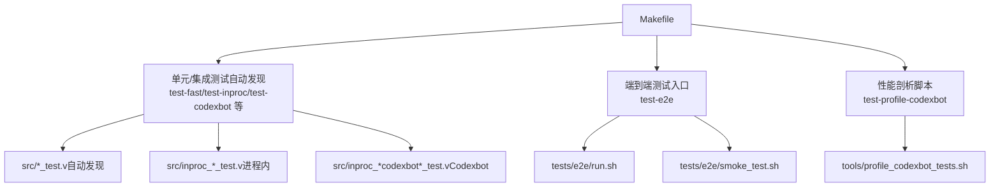
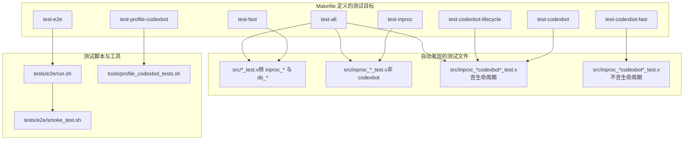
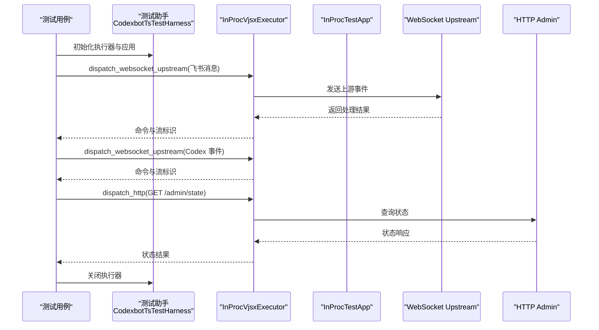
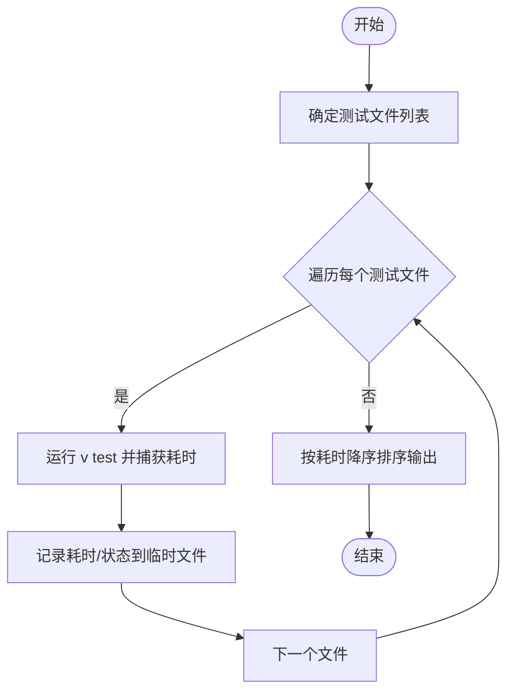
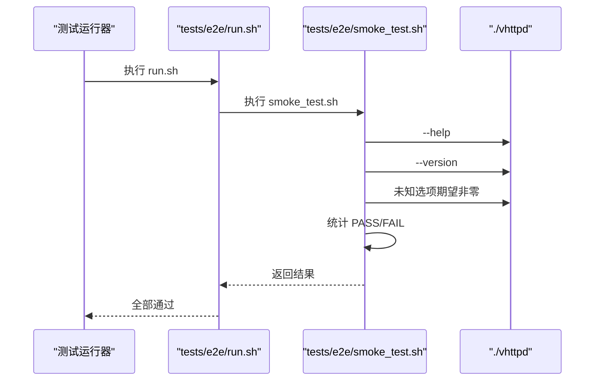
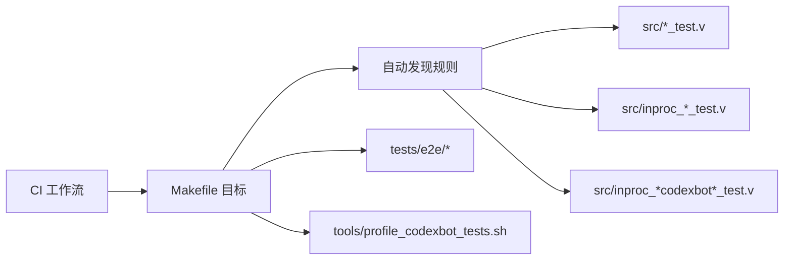

# 测试自动化

<cite>
**本文引用的文件**
- [Makefile](file://Makefile)
- [tests/README.md](file://tests/README.md)
- [tests/e2e/run.sh](file://tests/e2e/run.sh)
- [tests/e2e/smoke_test.sh](file://tests/e2e/smoke_test.sh)
- [tools/profile_codexbot_tests.sh](file://tools/profile_codexbot_tests.sh)
- [src/inproc_vjsx_executor_codexbot_core_test.v](file://src/inproc_vjsx_executor_codexbot_core_test.v)
- [src/inproc_vjsx_executor_codexbot_lifecycle_test.v](file://src/inproc_vjsx_executor_codexbot_lifecycle_test.v)
- [src/inproc_vjsx_executor_codexbot_helpers.v](file://src/inproc_vjsx_executor_codexbot_helpers.v)
- [.github/workflows/vhttpd-binaries.yml](file://.github/workflows/vhttpd-binaries.yml)
- [.github/workflows/sync-vphp-package.yml](file://.github/workflows/sync-vphp-package.yml)
</cite>

## 目录
1. [简介](#简介)
2. [项目结构](#项目结构)
3. [核心组件](#核心组件)
4. [架构总览](#架构总览)
5. [详细组件分析](#详细组件分析)
6. [依赖分析](#依赖分析)
7. [性能考虑](#性能考虑)
8. [故障排查指南](#故障排查指南)
9. [结论](#结论)
10. [附录](#附录)

## 简介
本文件面向 vhttpd 的测试自动化，系统性说明 Makefile 中各类测试目标的用法与适用场景，涵盖单元测试、集成/端到端测试、Codexbot 特定测试套件以及性能剖析脚本。同时提供测试脚本编写规范、测试环境自动配置与清理方法、测试结果分析与报告生成建议，以及在 CI/CD 中的集成方式与质量门禁设置思路。

## 项目结构
vhttpd 的测试体系主要由以下部分组成：
- Makefile：集中定义测试目标与自动发现规则，支持快速测试、进程内测试、Codexbot 测试与性能剖析。
- tests/README.md：测试布局与单元测试自动发现机制说明。
- tests/e2e：端到端/冒烟测试脚本，直接调用已编译二进制进行基础行为验证。
- tools/profile_codexbot_tests.sh：Codexbot 测试集的耗时剖析脚本，输出排序后的耗时与状态。
- src/ 下的 *_test.v 文件：按功能分层的单元/集成测试，其中 inproc_*_test.v 属于进程内测试，inproc_*codexbot*_test.v 属于 Codexbot 场景测试。
- .github/workflows：CI 工作流，包含二进制构建与测试门禁。

图表来源
- [Makefile:114-139](file://Makefile#L114-L139)
- [tests/README.md:13-38](file://tests/README.md#L13-L38)
- [tests/e2e/run.sh:1-14](file://tests/e2e/run.sh#L1-L14)
- [tests/e2e/smoke_test.sh:1-62](file://tests/e2e/smoke_test.sh#L1-L62)
- [tools/profile_codexbot_tests.sh:1-40](file://tools/profile_codexbot_tests.sh#L1-L40)

章节来源
- [Makefile:114-139](file://Makefile#L114-L139)
- [tests/README.md:13-38](file://tests/README.md#L13-L38)

## 核心组件
- 测试目标与自动发现
  - test-fast：排除 heavy 的 inproc 与需要网络的 db 测试，适合快速回归。
  - test-inproc：仅运行进程内测试（不含 codexbot）。
  - test-codexbot：运行所有 Codexbot 进程内测试，并启用 SQLite 支持。
  - test-codexbot-fast：排除生命周期测试的 Codexbot 快速套件。
  - test-codexbot-lifecycle：仅运行生命周期相关测试。
  - test-profile-codexbot：对一组核心 Codexbot 测试逐个计时并汇总排序。
  - test-e2e：运行端到端冒烟测试脚本。
  - test-all：对 src/ 下所有测试文件运行（包含被排除的 heavy/db 测试）。
- 测试脚本与辅助
  - tests/e2e/smoke_test.sh：验证二进制帮助、版本、参数解析等基础行为。
  - tools/profile_codexbot_tests.sh：对指定 Codexbot 测试文件逐一运行并记录耗时，最终按耗时降序输出。
- 测试数据与环境
  - Codexbot 测试通过 helpers 提供临时数据库路径、构造消息负载、启动执行器等能力，确保测试隔离与可重复。

章节来源
- [Makefile:114-139](file://Makefile#L114-L139)
- [tests/e2e/smoke_test.sh:1-62](file://tests/e2e/smoke_test.sh#L1-L62)
- [tools/profile_codexbot_tests.sh:1-40](file://tools/profile_codexbot_tests.sh#L1-L40)
- [src/inproc_vjsx_executor_codexbot_helpers.v:1-221](file://src/inproc_vjsx_executor_codexbot_helpers.v#L1-L221)

## 架构总览
下图展示测试目标与测试文件之间的关系，以及端到端测试与性能剖析脚本的位置。

图表来源
- [Makefile:36-55](file://Makefile#L36-L55)
- [Makefile:114-139](file://Makefile#L114-L139)
- [tests/e2e/run.sh:1-14](file://tests/e2e/run.sh#L1-L14)
- [tests/e2e/smoke_test.sh:1-62](file://tests/e2e/smoke_test.sh#L1-L62)
- [tools/profile_codexbot_tests.sh:9-16](file://tools/profile_codexbot_tests.sh#L9-L16)

## 详细组件分析

### Makefile 测试目标详解
- test-fast
  - 自动发现 src/ 下除 inproc_* 与 db_* 外的所有 *_test.v 文件，适合快速回归。
  - 适用于本地开发高频迭代与 PR 基线检查。
- test-inproc
  - 仅运行 src/inproc_*_test.v（排除 codexbot），用于验证进程内逻辑。
- test-codexbot
  - 运行 src/inproc_*codexbot*_test.v，并开启 vjsx_sqlite 编译宏，满足 Codexbot 场景的数据库需求。
- test-codexbot-fast
  - 在 Codexbot 全量套件基础上排除生命周期测试，聚焦核心功能。
- test-codexbot-lifecycle
  - 仅运行生命周期相关测试，便于专项回归。
- test-profile-codexbot
  - 对一组核心 Codexbot 测试文件逐一运行并记录 real 时间，最终按耗时降序输出，便于识别慢测试。
- test-e2e
  - 执行 tests/e2e/run.sh，再依次运行 smoke_test.sh，验证二进制基本可用性。
- test-all
  - 对 src/ 下所有测试文件运行，包含 heavy 与 db 测试，适合夜间或专用流水线。

章节来源
- [Makefile:114-139](file://Makefile#L114-L139)
- [Makefile:36-55](file://Makefile#L36-L55)

### Codexbot 测试套件与辅助
- 核心测试（示例）
  - src/inproc_vjsx_executor_codexbot_core_test.v：覆盖帮助命令、任务流程、回调处理、命令输出解码、活跃状态保持、消息去重、线程作用域、忙碌保护、过期流处理、线程内取消等。
- 生命周期测试（示例）
  - src/inproc_vjsx_executor_codexbot_lifecycle_test.v：覆盖取消与中断、复用线程、丢失线程恢复、草稿恢复、完成快照持久化、内容数组消息、用户消息不回显、Turn 完成回退、多项回显、丢失后续项恢复、Turn ID 持久化、实时推理卡片、原始响应完成、最终答案后注释不替换等。
- 测试辅助（helpers）
  - src/inproc_vjsx_executor_codexbot_helpers.v：提供临时数据库路径管理、构造飞书/卡片事件负载、启动执行器、发送消息与 Codex 事件、查询 /admin/state 等能力，确保测试隔离与可重复。

图表来源
- [src/inproc_vjsx_executor_codexbot_helpers.v:76-91](file://src/inproc_vjsx_executor_codexbot_helpers.v#L76-L91)
- [src/inproc_vjsx_executor_codexbot_helpers.v:93-143](file://src/inproc_vjsx_executor_codexbot_helpers.v#L93-L143)
- [src/inproc_vjsx_executor_codexbot_helpers.v:198-211](file://src/inproc_vjsx_executor_codexbot_helpers.v#L198-L211)

章节来源
- [src/inproc_vjsx_executor_codexbot_core_test.v:1-424](file://src/inproc_vjsx_executor_codexbot_core_test.v#L1-L424)
- [src/inproc_vjsx_executor_codexbot_lifecycle_test.v:1-800](file://src/inproc_vjsx_executor_codexbot_lifecycle_test.v#L1-L800)
- [src/inproc_vjsx_executor_codexbot_helpers.v:1-221](file://src/inproc_vjsx_executor_codexbot_helpers.v#L1-L221)

### 性能剖析脚本 profile_codexbot_tests.sh
- 功能概述
  - 固定一组 Codexbot 测试文件，逐个运行并使用 /usr/bin/time 记录 real 时间，收集结果到临时文件，最后按耗时降序输出。
- 使用建议
  - 可在 CI 中作为“慢测试识别”步骤，或在本地对比不同分支的回归时间。
  - 输出包含文件名、耗时与状态三列，便于人工审阅与自动化处理。

图表来源
- [tools/profile_codexbot_tests.sh:21-39](file://tools/profile_codexbot_tests.sh#L21-L39)

章节来源
- [tools/profile_codexbot_tests.sh:1-40](file://tools/profile_codexbot_tests.sh#L1-L40)

### 端到端冒烟测试
- 运行入口
  - tests/e2e/run.sh：顺序执行 smoke_test.sh。
- 冒烟检查点
  - 二进制存在且可执行；--help 返回成功；--version 符合语义化版本格式；未知选项返回非零；短选项错误拒绝。
- 结果判定
  - 若 FAIL 数大于 0，则整体失败退出。

图表来源
- [tests/e2e/run.sh:10-13](file://tests/e2e/run.sh#L10-L13)
- [tests/e2e/smoke_test.sh:24-53](file://tests/e2e/smoke_test.sh#L24-L53)

章节来源
- [tests/e2e/run.sh:1-14](file://tests/e2e/run.sh#L1-L14)
- [tests/e2e/smoke_test.sh:1-62](file://tests/e2e/smoke_test.sh#L1-L62)

## 依赖分析
- 测试目标与测试文件的映射
  - test-fast → src/*_test.v（排除 inproc_* 与 db_*）
  - test-inproc → src/inproc_*_test.v（排除 codexbot）
  - test-codexbot → src/inproc_*codexbot*_test.v（含生命周期）
  - test-codexbot-fast → src/inproc_*codexbot*_test.v（不含生命周期）
  - test-codexbot-lifecycle → src/*codexbot_lifecycle_test.v
  - test-all → src/ 下全部测试
- 测试脚本与工具的依赖
  - test-e2e 依赖 tests/e2e/run.sh 与 smoke_test.sh。
  - test-profile-codexbot 依赖 tools/profile_codexbot_tests.sh 与一组固定测试文件。
- CI 与测试门禁
  - .github/workflows/vhttpd-binaries.yml 在构建前执行 make test-fast 与 make test-inproc，确保基础测试通过后再继续。

图表来源
- [Makefile:36-55](file://Makefile#L36-L55)
- [Makefile:114-139](file://Makefile#L114-L139)
- [.github/workflows/vhttpd-binaries.yml:127-132](file://.github/workflows/vhttpd-binaries.yml#L127-L132)

章节来源
- [Makefile:36-55](file://Makefile#L36-L55)
- [Makefile:114-139](file://Makefile#L114-L139)
- [.github/workflows/vhttpd-binaries.yml:127-132](file://.github/workflows/vhttpd-binaries.yml#L127-L132)

## 性能考虑
- 选择合适的测试目标
  - 开发阶段优先使用 test-fast 与 test-inproc，快速反馈。
  - Codexbot 场景使用 test-codexbot-fast 或 test-codexbot-lifecycle 进行专项回归。
  - 使用 test-profile-codexbot 识别慢测试，优化测试设计或拆分大用例。
- 环境与资源
  - Codexbot 测试依赖 SQLite，确保编译宏 -d vjsx_sqlite 生效。
  - 辅助函数会为测试准备临时数据库路径，避免并发冲突与数据污染。
- CI 中的性能门禁
  - 可在 CI 中新增“慢测试告警”步骤，基于 test-profile-codexbot 的输出阈值触发通知。

## 故障排查指南
- 二进制缺失或不可执行
  - 现象：e2e 冒烟测试提示二进制不存在或不可执行。
  - 处理：先执行 make build 或 make prod，确保 ./vhttpd 存在且可执行。
- 参数错误未被拒绝
  - 现象：未知选项未返回非零。
  - 处理：检查二进制是否为最新构建；确认 smoke_test.sh 的断言逻辑。
- Codexbot 测试失败（数据库/线程/取消等）
  - 现象：生命周期或线程相关测试失败。
  - 处理：确认编译宏 -d vjsx_sqlite 已启用；检查 /admin/state 返回的状态字段；必要时缩短或调整超时条件。
- 性能剖析无输出
  - 现象：profile 脚本未输出排序结果。
  - 处理：确认 /usr/bin/time 可用；检查测试文件路径与权限；查看临时文件是否被提前清理。

章节来源
- [tests/e2e/smoke_test.sh:14-18](file://tests/e2e/smoke_test.sh#L14-L18)
- [tests/e2e/smoke_test.sh:40-53](file://tests/e2e/smoke_test.sh#L40-L53)
- [tools/profile_codexbot_tests.sh:25-32](file://tools/profile_codexbot_tests.sh#L25-L32)

## 结论
通过 Makefile 的自动发现与分类测试目标、端到端冒烟测试与性能剖析脚本，vhttpd 形成了从本地快速回归到 CI 质量门禁的完整测试闭环。结合 Codexbot 测试辅助工具，能够稳定地验证复杂交互与生命周期行为。建议在 CI 中保留 test-fast 与 test-inproc 作为必跑项，并在夜间流水线补充 test-all 与 test-e2e，持续提升发布质量与稳定性。

## 附录

### 测试脚本编写规范与最佳实践
- 单元测试
  - 用例命名清晰，覆盖正向与边界条件；尽量避免外部依赖（网络/文件系统）。
  - 如需临时数据，使用 helpers 提供的临时数据库路径与执行器生命周期管理。
- 集成/端到端测试
  - 优先使用 tests/e2e/smoke_test.sh 的断言模式，确保二进制基本可用。
  - 端到端脚本应独立于 PHP/vslim/QuickJS，仅依赖已编译二进制。
- 性能测试
  - 使用 tools/profile_codexbot_tests.sh 识别慢测试；对大用例进行拆分或并行化（在不破坏隔离的前提下）。
- 报告与可视化
  - 可将 profile 脚本输出导入表格或日志，配合 CI 的工件或度量系统进行趋势跟踪。

### 测试环境自动配置与清理
- 自动配置
  - helpers 会在临时目录下准备数据库文件，避免与宿主环境冲突。
  - 编译宏 -d vjsx_sqlite 由 Makefile 注入，确保 Codexbot 测试具备 SQLite 支持。
- 清理策略
  - 测试结束后关闭执行器，删除临时数据库文件，避免残留影响后续测试。

### CI/CD 集成与质量门禁
- 建议在 CI 中执行
  - make test-fast 与 make test-inproc 作为必跑项，失败即阻断后续构建。
  - 夜间流水线补充 make test-all 与 make test-e2e。
  - 可选：新增“慢测试告警”步骤，基于 test-profile-codexbot 的输出阈值触发通知。
- 参考工作流
  - .github/workflows/vhttpd-binaries.yml 已在构建前执行 make test-fast，可在此基础上扩展更多测试目标。

章节来源
- [.github/workflows/vhttpd-binaries.yml:127-149](file://.github/workflows/vhttpd-binaries.yml#L127-L149)
- [.github/workflows/sync-vphp-package.yml:1-48](file://.github/workflows/sync-vphp-package.yml#L1-48)