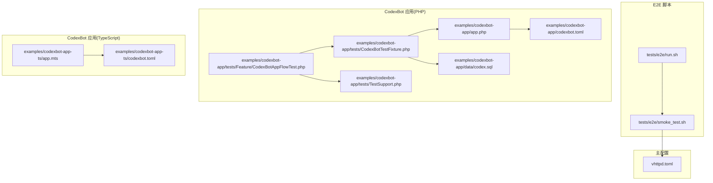
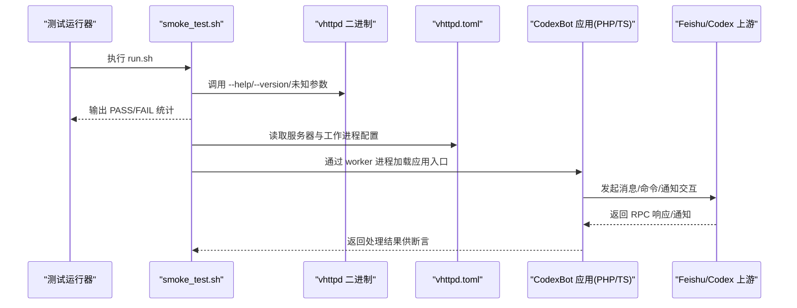
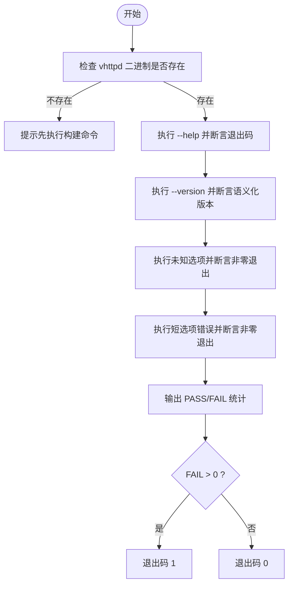
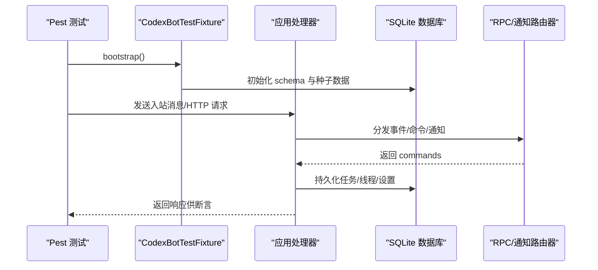
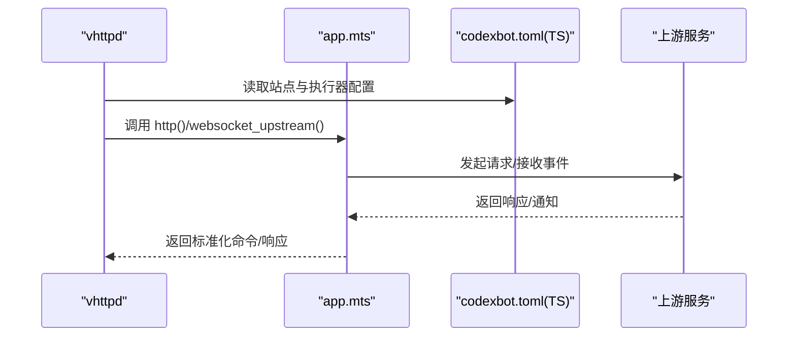
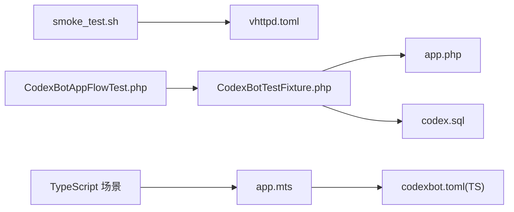

# 端到端测试

<cite>
**本文引用的文件**
- [run.sh](file://tests/e2e/run.sh)
- [smoke_test.sh](file://tests/e2e/smoke_test.sh)
- [CodexBotAppFlowTest.php](file://examples/codexbot-app/tests/Feature/CodexBotAppFlowTest.php)
- [CodexBotTestFixture.php](file://examples/codexbot-app/tests/CodexBotTestFixture.php)
- [TestSupport.php](file://examples/codexbot-app/tests/TestSupport.php)
- [app.php](file://examples/codexbot-app/app.php)
- [app.mts](file://examples/codexbot-app-ts/app.mts)
- [vhttpd.toml](file://vhttpd.toml)
- [codexbot.toml（PHP）](file://examples/codexbot-app/codexbot.toml)
- [codexbot.toml（TypeScript）](file://examples/codexbot-app-ts/codexbot.toml)
- [codex.sql](file://examples/codexbot-app/data/codex.sql)
</cite>

## 目录
1. [引言](#引言)
2. [项目结构](#项目结构)
3. [核心组件](#核心组件)
4. [架构总览](#架构总览)
5. [详细组件分析](#详细组件分析)
6. [依赖关系分析](#依赖关系分析)
7. [性能考量](#性能考量)
8. [故障排查指南](#故障排查指南)
9. [结论](#结论)
10. [附录](#附录)

## 引言
本文件面向 vhttpd 的端到端测试体系，系统性阐述测试架构与流程，覆盖以下要点：
- 整体测试策略：以最小外部依赖的冒烟测试为主，确保二进制可用性与基本行为正确。
- 运行入口与脚本：run.sh 作为统一入口，smoke_test.sh 执行核心冒烟检查。
- CodexBot 应用的端到端测试：涵盖 PHP 版本与 TypeScript 版本，从服务器启动到应用响应的完整链路验证。
- 测试环境搭建：配置文件、数据库初始化、测试数据准备与清理。
- 结果验证与自动化：通过断言与状态码校验，结合 CI 可执行的脚本化流程。

## 项目结构
vhttpd 的端到端测试由两部分组成：
- 顶层 E2E 脚本：tests/e2e/run.sh 与 tests/e2e/smoke_test.sh，负责二进制可用性与基础参数解析测试。
- 应用层 E2E 测试：examples/codexbot-app/tests 下的 PHP 功能测试与 TypeScript 应用适配，覆盖从入站消息到 RPC 响应、通知路由、视图渲染等完整链路。

图表来源
- [run.sh:1-14](file://tests/e2e/run.sh#L1-L14)
- [smoke_test.sh:1-62](file://tests/e2e/smoke_test.sh#L1-L62)
- [app.php:1-15](file://examples/codexbot-app/app.php#L1-L15)
- [CodexBotAppFlowTest.php:1-2131](file://examples/codexbot-app/tests/Feature/CodexBotAppFlowTest.php#L1-L2131)
- [CodexBotTestFixture.php:1-233](file://examples/codexbot-app/tests/CodexBotTestFixture.php#L1-L233)
- [TestSupport.php:1-108](file://examples/codexbot-app/tests/TestSupport.php#L1-L108)
- [codexbot.toml（PHP）:1-70](file://examples/codexbot-app/codexbot.toml#L1-L70)
- [codexbot.toml（TypeScript）:1-48](file://examples/codexbot-app-ts/codexbot.toml#L1-L48)
- [vhttpd.toml:1-32](file://vhttpd.toml#L1-L32)

章节来源
- [run.sh:1-14](file://tests/e2e/run.sh#L1-L14)
- [smoke_test.sh:1-62](file://tests/e2e/smoke_test.sh#L1-L62)

## 核心组件
- E2E 脚本套件
  - run.sh：统一入口，调用 smoke_test.sh 并输出汇总结果。
  - smoke_test.sh：对 vhttpd 二进制进行基础校验，包括帮助信息、版本号格式、未知参数处理与参数解析错误处理。
- CodexBot 应用测试
  - PHP 版本：基于 Pest 的功能测试，覆盖命令路由、RPC 响应、通知路由、视图渲染、错误处理、数据库迁移与自动建表等。
  - TypeScript 版本：通过 app.mts 暴露标准接口，配合 codexbot.toml（TypeScript）配置站点与执行器，形成可运行的端到端链路。
- 测试支撑
  - TestSupport.php：提供测试数据库路径、初始化、种子数据、入站消息构造等工具函数。
  - CodexBotTestFixture.php：封装应用上下文、事件路由器、命令路由器、RPC 路由器、通知路由、视图助手等组件，简化测试编写。
  - codex.sql：CodexBot 数据库模式定义与索引，用于测试数据准备与断言。

章节来源
- [run.sh:1-14](file://tests/e2e/run.sh#L1-L14)
- [smoke_test.sh:1-62](file://tests/e2e/smoke_test.sh#L1-L62)
- [CodexBotAppFlowTest.php:1-2131](file://examples/codexbot-app/tests/Feature/CodexBotAppFlowTest.php#L1-L2131)
- [CodexBotTestFixture.php:1-233](file://examples/codexbot-app/tests/CodexBotTestFixture.php#L1-L233)
- [TestSupport.php:1-108](file://examples/codexbot-app/tests/TestSupport.php#L1-L108)
- [codex.sql:1-122](file://examples/codexbot-app/data/codex.sql#L1-L122)

## 架构总览
下图展示了从脚本到应用再到上游服务的端到端链路：

图表来源
- [smoke_test.sh:1-62](file://tests/e2e/smoke_test.sh#L1-L62)
- [vhttpd.toml:1-32](file://vhttpd.toml#L1-L32)
- [app.php:1-15](file://examples/codexbot-app/app.php#L1-L15)
- [app.mts:1-35](file://examples/codexbot-app-ts/app.mts#L1-L35)

## 详细组件分析

### E2E 脚本：run.sh 与 smoke_test.sh
- run.sh
  - 作用：作为测试套件入口，顺序执行冒烟测试，并在完成后输出“全部通过”的汇总信息。
  - 关键点：使用 Bash 的严格模式，确保失败能及时暴露。
- smoke_test.sh
  - 作用：对 vhttpd 二进制进行最小依赖的冒烟测试，覆盖帮助信息、版本号格式、未知参数处理与参数解析错误处理。
  - 断言方式：通过退出码与输出内容匹配进行判断；统计 PASS/FAIL 并在失败时返回非零退出码。
  - 环境要求：需先构建二进制，否则提示执行构建命令。

图表来源
- [smoke_test.sh:1-62](file://tests/e2e/smoke_test.sh#L1-L62)

章节来源
- [run.sh:1-14](file://tests/e2e/run.sh#L1-L14)
- [smoke_test.sh:1-62](file://tests/e2e/smoke_test.sh#L1-L62)

### CodexBot 应用：PHP 版本端到端测试
- 测试组织
  - 使用 Pest 进行功能测试，集中在 Feature 目录，覆盖命令语义、HTTP 健康检查、管理员仪表盘渲染、RPC 响应处理、通知路由、错误辅助、JSON 解码、线程绑定持久化等。
  - 通过 CodexBotTestFixture 提供统一的引导与上下文访问，TestSupport.php 提供数据库初始化、种子数据、入站消息构造等工具。
- 测试数据与环境
  - 数据库：SQLite，schema 来自 codex.sql，包含 projects、project_channels、tasks、streams、command_contexts、settings 等表及索引。
  - 初始化：TestSupport.php 在每次测试前创建独立数据库文件，执行 schema 初始化与默认项目/频道种子数据插入。
  - 清理：测试后清空相关表，避免跨用例污染。
- 关键测试场景
  - 帮助命令与任务引导：断言命令数量、类型与 provider。
  - 命令语义渲染：断言帮助文本包含预期指令。
  - HTTP 健康与未找到响应：断言状态码与内容类型。
  - 管理员仪表盘：写入任务与流记录，断言 HTML 包含标题与关键字段。
  - 管理员变更：通过 AdminMutationService 写入设置与项目会话默认值，断言数据库更新。
  - 工作进程状态与重启：通过环境变量注入固定状态，断言渲染文本与后续命令。
  - 数据库迁移：自动建表与历史表迁移，断言表结构与列存在。
  - 事件与命令路由：断言事件分发与命令路由结果。
  - 飞书消息解析：断言多种消息内容结构下的提示提取。
  - 线程视图与错误辅助：断言标签、卡片渲染与错误分类。
  - 响应包装与命令总线：断言单/多命令封装与总线追加。
  - JSON 辅助：断言嵌套 JSON 解码与无效 JSON 处理。
  - RPC 响应处理与线程绑定持久化：断言会话启动命令与数据库中任务/项目线程 ID 更新。
  - 通知路由与额度不足渲染：断言消息更新与额度耗尽提示。
  - RPC 列表投影：断言模型列表渲染文本。

图表来源
- [CodexBotAppFlowTest.php:1-2131](file://examples/codexbot-app/tests/Feature/CodexBotAppFlowTest.php#L1-L2131)
- [CodexBotTestFixture.php:1-233](file://examples/codexbot-app/tests/CodexBotTestFixture.php#L1-L233)
- [TestSupport.php:1-108](file://examples/codexbot-app/tests/TestSupport.php#L1-L108)
- [codex.sql:1-122](file://examples/codexbot-app/data/codex.sql#L1-L122)

章节来源
- [CodexBotAppFlowTest.php:1-2131](file://examples/codexbot-app/tests/Feature/CodexBotAppFlowTest.php#L1-L2131)
- [CodexBotTestFixture.php:1-233](file://examples/codexbot-app/tests/CodexBotTestFixture.php#L1-L233)
- [TestSupport.php:1-108](file://examples/codexbot-app/tests/TestSupport.php#L1-L108)
- [codex.sql:1-122](file://examples/codexbot-app/data/codex.sql#L1-L122)

### CodexBot 应用：TypeScript 版本端到端测试
- 应用入口
  - app.mts 导出标准接口：startup、app_startup、http、websocket_upstream，兼容 vhttpd 的执行器调用约定。
- 配置
  - codexbot.toml（TypeScript）定义站点、执行器（vjsx）、应用入口、线程数、文件系统权限、Feishu 与 Codex 参数等。
- 测试思路
  - 通过 vhttpd 加载 TypeScript 应用，复用 PHP 版本中的测试场景设计（命令语义、RPC 响应、通知路由、视图渲染、错误处理等），以统一的断言方式验证响应一致性。
  - 重点验证：HTTP 路由、WebSocket 上游帧处理、RPC 方法映射、通知渲染、管理员命令与状态查询等。

图表来源
- [app.mts:1-35](file://examples/codexbot-app-ts/app.mts#L1-L35)
- [codexbot.toml（TypeScript）:1-48](file://examples/codexbot-app-ts/codexbot.toml#L1-L48)

章节来源
- [app.mts:1-35](file://examples/codexbot-app-ts/app.mts#L1-L35)
- [codexbot.toml（TypeScript）:1-48](file://examples/codexbot-app-ts/codexbot.toml#L1-L48)

### 测试环境搭建与数据准备
- 二进制与配置
  - 运行 smoke_test.sh 前需确保 vhttpd 二进制存在；如需自定义端口或工作进程，参考 vhttpd.toml 与各应用的 codexbot.toml。
- 数据库
  - 使用 SQLite，schema 定义于 codex.sql；TestSupport.php 提供初始化与种子数据插入，确保每个测试用例的隔离性。
- 应用入口
  - PHP：app.php 返回 AppRuntime::handlers()，供 vhttpd 通过 worker 进程加载。
  - TypeScript：app.mts 作为入口，配合 vjsx 执行器运行。

章节来源
- [vhttpd.toml:1-32](file://vhttpd.toml#L1-L32)
- [codexbot.toml（PHP）:1-70](file://examples/codexbot-app/codexbot.toml#L1-L70)
- [codexbot.toml（TypeScript）:1-48](file://examples/codexbot-app-ts/codexbot.toml#L1-L48)
- [codex.sql:1-122](file://examples/codexbot-app/data/codex.sql#L1-L122)
- [app.php:1-15](file://examples/codexbot-app/app.php#L1-L15)

## 依赖关系分析
- 组件耦合
  - smoke_test.sh 仅依赖 vhttpd 二进制与主配置 vhttpd.toml，耦合度低，便于快速验证。
  - PHP 应用测试依赖 TestFixture 与 TestSupport，形成高内聚的测试支撑层。
  - TypeScript 应用测试依赖 app.mts 与 codexbot.toml（TypeScript），与 PHP 版本共享测试场景设计。
- 外部依赖
  - PHP 版本：依赖 SQLite、PDO、PHP 扩展（由 vhttpd.toml 中 worker.env 注入）。
  - TypeScript 版本：依赖 Node 运行时与 vjsx 执行器。
- 循环依赖
  - 未发现直接循环依赖；测试支撑模块按工具函数形式被测试用例引用。

图表来源
- [smoke_test.sh:1-62](file://tests/e2e/smoke_test.sh#L1-L62)
- [vhttpd.toml:1-32](file://vhttpd.toml#L1-L32)
- [CodexBotAppFlowTest.php:1-2131](file://examples/codexbot-app/tests/Feature/CodexBotAppFlowTest.php#L1-L2131)
- [CodexBotTestFixture.php:1-233](file://examples/codexbot-app/tests/CodexBotTestFixture.php#L1-L233)
- [app.php:1-15](file://examples/codexbot-app/app.php#L1-L15)
- [codex.sql:1-122](file://examples/codexbot-app/data/codex.sql#L1-L122)
- [app.mts:1-35](file://examples/codexbot-app-ts/app.mts#L1-L35)
- [codexbot.toml（TypeScript）:1-48](file://examples/codexbot-app-ts/codexbot.toml#L1-L48)

章节来源
- [smoke_test.sh:1-62](file://tests/e2e/smoke_test.sh#L1-L62)
- [CodexBotAppFlowTest.php:1-2131](file://examples/codexbot-app/tests/Feature/CodexBotAppFlowTest.php#L1-L2131)
- [CodexBotTestFixture.php:1-233](file://examples/codexbot-app/tests/CodexBotTestFixture.php#L1-L233)
- [app.mts:1-35](file://examples/codexbot-app-ts/app.mts#L1-L35)

## 性能考量
- 冒烟测试规模小、无外部依赖，适合在 CI 快速反馈。
- PHP 应用测试涉及数据库读写与路由分发，建议在本地或 CI 中使用内存型 SQLite 或轻量容器以减少 IO 开销。
- TypeScript 应用测试需考虑 Node 进程启动与 vjsx 编译开销，可在 CI 中缓存构建产物以提升速度。
- 建议将数据库初始化与清理步骤并行化，减少测试间等待时间。

## 故障排查指南
- 二进制缺失
  - 现象：提示需要先构建二进制。
  - 处理：执行构建命令后再运行 smoke_test.sh。
- 参数错误
  - 现象：未知选项或短选项错误导致非零退出。
  - 处理：核对参数拼写与支持的选项集合。
- 数据库问题
  - 现象：测试间数据污染或 schema 不一致。
  - 处理：确认 TestSupport.php 的初始化与清理逻辑是否生效；检查 codex.sql 是否与期望一致。
- 上游服务不可达
  - 现象：RPC 响应或通知路由失败。
  - 处理：确认 Feishu/Codex 的连接参数与鉴权配置；在本地模拟上游服务或使用占位响应。
- 环境变量
  - 现象：时区、扩展路径、令牌不正确导致运行失败。
  - 处理：核对 vhttpd.toml 与各应用的 codexbot.toml 中的环境变量注入。

章节来源
- [smoke_test.sh:1-62](file://tests/e2e/smoke_test.sh#L1-L62)
- [TestSupport.php:1-108](file://examples/codexbot-app/tests/TestSupport.php#L1-L108)
- [codexbot.toml（PHP）:1-70](file://examples/codexbot-app/codexbot.toml#L1-L70)
- [codexbot.toml（TypeScript）:1-48](file://examples/codexbot-app-ts/codexbot.toml#L1-L48)

## 结论
vhttpd 的端到端测试以“最小外部依赖”的冒烟测试为基础，结合 CodexBot 应用的 PHP 与 TypeScript 实现，覆盖从服务器启动、应用加载、消息/命令/通知处理到数据库持久化的完整链路。通过清晰的测试脚本、可复用的测试支撑与规范的配置文件，能够稳定地验证核心功能与边界条件，为持续集成与发布提供可靠保障。

## 附录
- 测试自动化与 CI 实践建议
  - 将 run.sh 与 smoke_test.sh 作为 CI 的第一步，确保二进制可用性。
  - 在 PR 检查中运行 CodexBot PHP 功能测试，必要时在专用作业中运行 TypeScript 场景。
  - 使用缓存策略保存 SQLite 数据库与 vjsx 构建产物，缩短流水线时间。
  - 将测试结果与覆盖率导出到 CI 平台，便于追踪质量趋势。
- 报告生成
  - Bash 脚本输出 PASS/FAIL 统计，可在 CI 中收集并生成报告。
  - PHP Pest 支持多种输出格式，可配置生成 XML/JUnit 报告供 CI 平台消费。