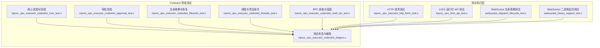
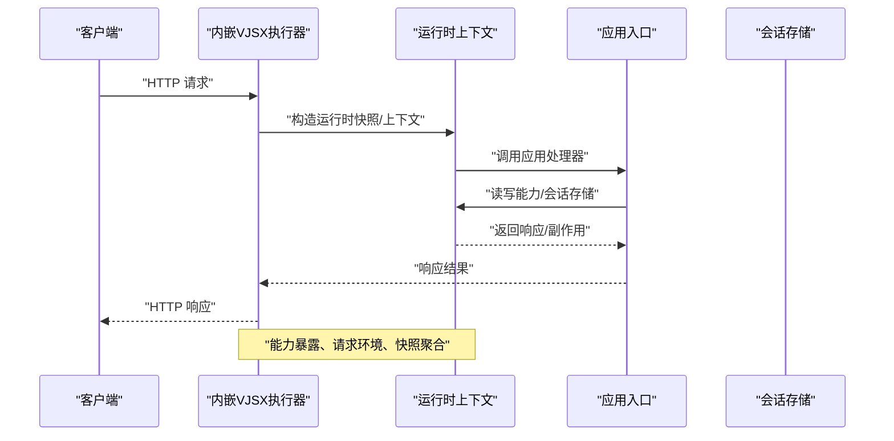
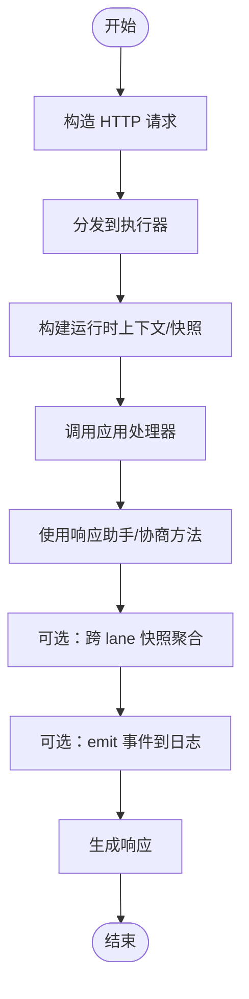
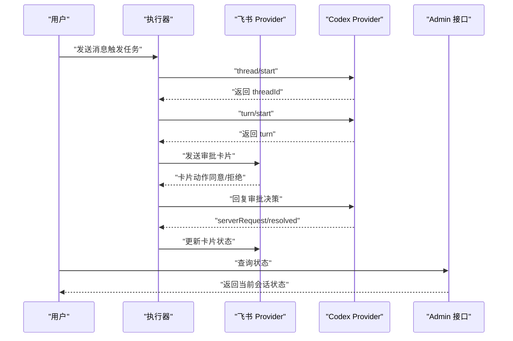
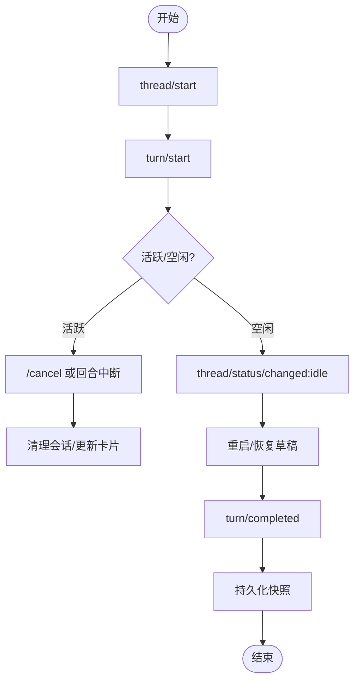
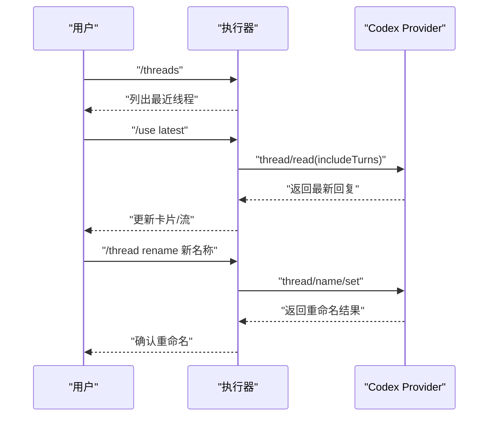
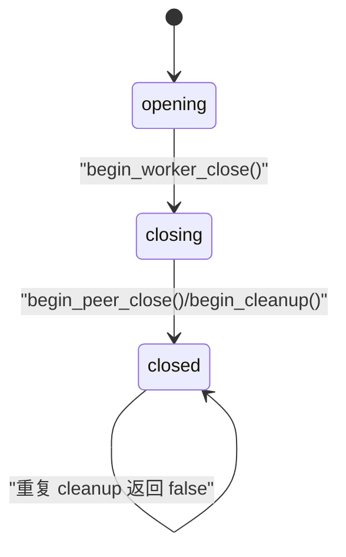
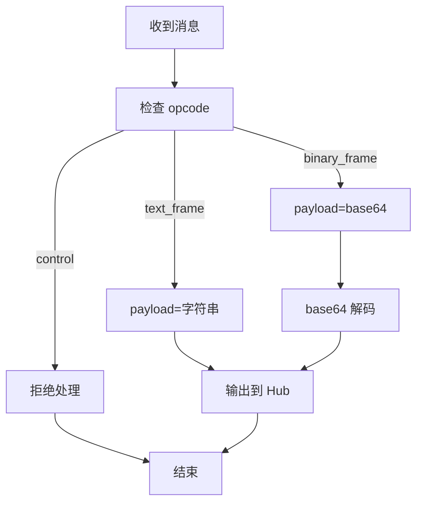
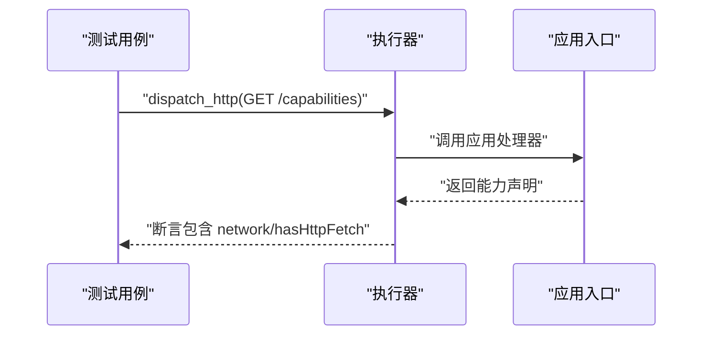
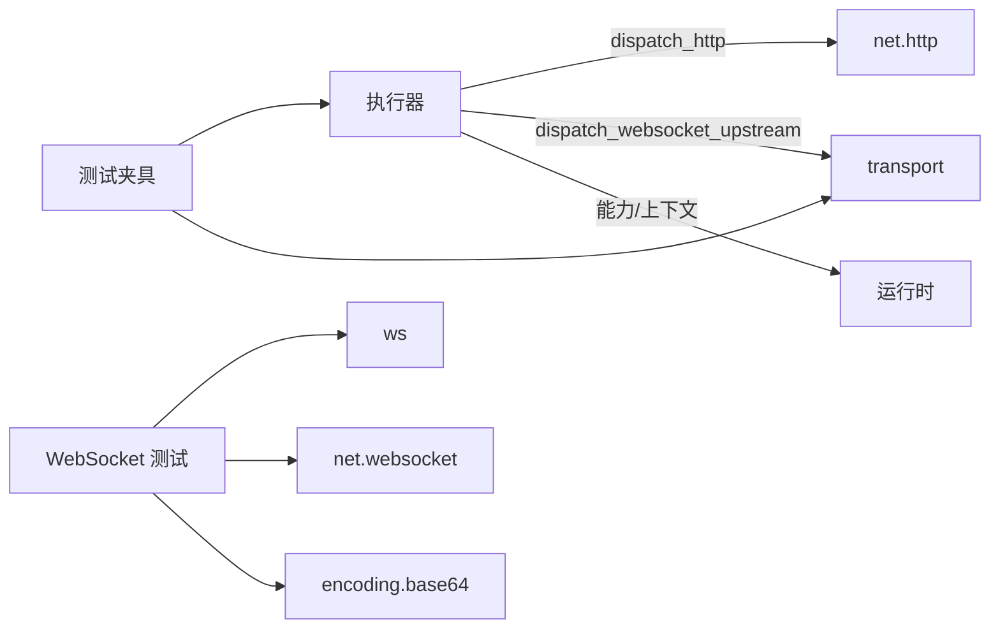

# 集成测试

<cite>
**本文引用的文件**
- [src/inproc_vjsx_executor_codexbot_approval_test.v](file://src/inproc_vjsx_executor_codexbot_approval_test.v)
- [src/inproc_vjsx_executor_codexbot_core_test.v](file://src/inproc_vjsx_executor_codexbot_core_test.v)
- [src/inproc_vjsx_executor_codexbot_lifecycle_test.v](file://src/inproc_vjsx_executor_codexbot_lifecycle_test.v)
- [src/inproc_vjsx_executor_codexbot_threads_test.v](file://src/inproc_vjsx_executor_codexbot_threads_test.v)
- [src/inproc_vjsx_executor_codexbot_read_rpc_test.v](file://src/inproc_vjsx_executor_codexbot_read_rpc_test.v)
- [src/inproc_vjsx_executor_codexbot_helpers.v](file://src/inproc_vjsx_executor_codexbot_helpers.v)
- [src/websocket_dispatch_lifecycle_test.v](file://src/websocket_dispatch_lifecycle_test.v)
- [src/websocket_binary_support_test.v](file://src/websocket_binary_support_test.v)
- [src/inproc_vjsx_executor_http_fetch_test.v](file://src/inproc_vjsx_executor_http_fetch_test.v)
- [src/inproc_vjsx_executor_test.v](file://src/inproc_vjsx_executor_test.v)
- [src/inproc_vjsx_host_api_test.v](file://src/inproc_vjsx_host_api_test.v)
</cite>

## 目录
1. [简介](#简介)
2. [项目结构](#项目结构)
3. [核心组件](#核心组件)
4. [架构总览](#架构总览)
5. [详细组件分析](#详细组件分析)
6. [依赖关系分析](#依赖关系分析)
7. [性能考虑](#性能考虑)
8. [故障排查指南](#故障排查指南)
9. [结论](#结论)
10. [附录](#附录)

## 简介
本文件系统化梳理 vhttpd 中“内嵌 VJSX 执行器”的集成测试设计与实现，覆盖以下主题：
- 内嵌 VJSX 执行器与运行时的集成测试模式
- codexbot 相关审批流程、线程管理、命令与状态持久化
- WebSocket 分发生命周期与二进制帧支持测试
- HTTP 请求测试（含能力暴露）
- 跨组件交互测试（执行器与运行时、上游 provider、会话存储等）
- 测试环境配置、依赖注入与测试数据管理
- 调试方法与性能测试策略

## 项目结构
围绕“内嵌 VJSX 执行器”的集成测试，主要涉及以下模块与文件：
- 执行器与运行时测试：在进程内启动 VJSX 执行器，模拟 HTTP/WebSocket 上游事件，验证逻辑分发与命令生成
- codexbot 场景测试：以 codexbot TS 应用为被测目标，覆盖审批、线程生命周期、消息去重、会话状态等
- WebSocket 测试：连接生命周期、Hub 清理、消息队列与二进制帧编解码
- HTTP 能力测试：暴露运行时能力、请求上下文、响应助手方法等
- 基础设施：测试夹具（Test Harness）、临时数据库、构建缓存根目录等

图表来源
- [src/inproc_vjsx_executor_http_fetch_test.v:1-46](file://src/inproc_vjsx_executor_http_fetch_test.v#L1-L46)
- [src/inproc_vjsx_host_api_test.v:1-217](file://src/inproc_vjsx_host_api_test.v#L1-L217)
- [src/websocket_dispatch_lifecycle_test.v:1-84](file://src/websocket_dispatch_lifecycle_test.v#L1-L84)
- [src/websocket_binary_support_test.v:1-63](file://src/websocket_binary_support_test.v#L1-L63)
- [src/inproc_vjsx_executor_codexbot_core_test.v:1-424](file://src/inproc_vjsx_executor_codexbot_core_test.v#L1-L424)
- [src/inproc_vjsx_executor_codexbot_approval_test.v:1-76](file://src/inproc_vjsx_executor_codexbot_approval_test.v#L1-L76)
- [src/inproc_vjsx_executor_codexbot_lifecycle_test.v:1-800](file://src/inproc_vjsx_executor_codexbot_lifecycle_test.v#L1-L800)
- [src/inproc_vjsx_executor_codexbot_threads_test.v:1-431](file://src/inproc_vjsx_executor_codexbot_threads_test.v#L1-L431)
- [src/inproc_vjsx_executor_codexbot_read_rpc_test.v:1-793](file://src/inproc_vjsx_executor_codexbot_read_rpc_test.v#L1-L793)
- [src/inproc_vjsx_executor_codexbot_helpers.v:1-221](file://src/inproc_vjsx_executor_codexbot_helpers.v#L1-L221)

章节来源
- [src/inproc_vjsx_executor_test.v:1-800](file://src/inproc_vjsx_executor_test.v#L1-L800)

## 核心组件
- 内嵌 VJSX 执行器：负责加载应用入口、维护 lane、分发 HTTP/WebSocket 事件、暴露运行时能力与上下文
- 测试夹具（CodexbotTsTestHarness）：封装执行器实例、InProcTestApp、常用事件派发与断言工具
- 临时数据库与构建缓存：通过环境变量与临时路径隔离不同测试场景
- WebSocket Hub 与生命周期：连接状态机、清理流程、消息队列与二进制帧编解码

章节来源
- [src/inproc_vjsx_executor_codexbot_helpers.v:1-221](file://src/inproc_vjsx_executor_codexbot_helpers.v#L1-L221)
- [src/inproc_vjsx_executor_test.v:1-800](file://src/inproc_vjsx_executor_test.v#L1-L800)

## 架构总览
下图展示一次典型的“HTTP 请求”在执行器中的端到端流转，以及与运行时、会话存储、能力暴露的关系。

图表来源
- [src/inproc_vjsx_executor_test.v:286-388](file://src/inproc_vjsx_executor_test.v#L286-L388)
- [src/inproc_vjsx_host_api_test.v:1-217](file://src/inproc_vjsx_host_api_test.v#L1-L217)

## 详细组件分析

### 内嵌 VJSX 执行器与运行时集成测试
- 能力暴露与请求上下文：验证运行时是否暴露网络、HTTP、流等能力，以及请求环境（协议、主机、端口、远程地址等）
- 响应助手与协商：测试语义化响应、类型化请求参数、内容协商等
- 跨 lane 快照：在同一执行器内多 lane 共享/聚合状态
- 事件日志：运行时 emit 的事件写入外部日志文件

图表来源
- [src/inproc_vjsx_executor_test.v:286-388](file://src/inproc_vjsx_executor_test.v#L286-L388)
- [src/inproc_vjsx_executor_test.v:509-593](file://src/inproc_vjsx_executor_test.v#L509-L593)
- [src/inproc_vjsx_executor_test.v:677-775](file://src/inproc_vjsx_executor_test.v#L677-L775)
- [src/inproc_vjsx_host_api_test.v:1-217](file://src/inproc_vjsx_host_api_test.v#L1-L217)

章节来源
- [src/inproc_vjsx_executor_test.v:1-800](file://src/inproc_vjsx_executor_test.v#L1-L800)
- [src/inproc_vjsx_host_api_test.v:1-217](file://src/inproc_vjsx_host_api_test.v#L1-L217)

### Codexbot 审批流程测试
- 从用户触发任务开始，到线程/回合启动、审批请求下发、飞书卡片动作、Codex 回调与最终通知的完整链路
- 断言命令类型（provider.rpc.call、provider.message.send、provider.rpc.reply 等），以及消息体内容与流 ID 关系

图表来源
- [src/inproc_vjsx_executor_codexbot_approval_test.v:1-76](file://src/inproc_vjsx_executor_codexbot_approval_test.v#L1-L76)
- [src/inproc_vjsx_executor_codexbot_core_test.v:17-38](file://src/inproc_vjsx_executor_codexbot_core_test.v#L17-L38)

章节来源
- [src/inproc_vjsx_executor_codexbot_approval_test.v:1-76](file://src/inproc_vjsx_executor_codexbot_approval_test.v#L1-L76)
- [src/inproc_vjsx_executor_codexbot_core_test.v:1-424](file://src/inproc_vjsx_executor_codexbot_core_test.v#L1-L424)

### Codexbot 线程生命周期与恢复测试
- 取消操作：按线程维度取消、中断回合、清理会话
- 重启与恢复：线程缺失时自动重启、恢复草稿、完成快照持久化
- 空闲与状态变更：空闲状态不阻塞后续消息、内容数组消息渲染

图表来源
- [src/inproc_vjsx_executor_codexbot_lifecycle_test.v:1-800](file://src/inproc_vjsx_executor_codexbot_lifecycle_test.v#L1-L800)

章节来源
- [src/inproc_vjsx_executor_codexbot_lifecycle_test.v:1-800](file://src/inproc_vjsx_executor_codexbot_lifecycle_test.v#L1-L800)

### Codexbot 线程与项目命令测试
- 线程命令：/thread 报告当前线程、最近流、状态；/threads 列出最近线程
- 项目绑定与切换：/bind 绑定工作区、/project 切换项目、/use latest 读取最新回复
- 线程重命名与选择：/thread rename、/thread <id> 选择线程

图表来源
- [src/inproc_vjsx_executor_codexbot_threads_test.v:1-431](file://src/inproc_vjsx_executor_codexbot_threads_test.v#L1-L431)
- [src/inproc_vjsx_executor_codexbot_read_rpc_test.v:1-793](file://src/inproc_vjsx_executor_codexbot_read_rpc_test.v#L1-L793)

章节来源
- [src/inproc_vjsx_executor_codexbot_threads_test.v:1-431](file://src/inproc_vjsx_executor_codexbot_threads_test.v#L1-L431)
- [src/inproc_vjsx_executor_codexbot_read_rpc_test.v:1-793](file://src/inproc_vjsx_executor_codexbot_read_rpc_test.v#L1-L793)

### WebSocket 分发生命周期测试
- 连接生命周期：opening → closing → closed，状态检查与行为约束
- Hub 清理：finalize 仅清理一次，移除连接、房间、元数据、待发消息
- 发送控制：opening 连接入队、closing 拒绝发送

图表来源
- [src/websocket_dispatch_lifecycle_test.v:1-84](file://src/websocket_dispatch_lifecycle_test.v#L1-L84)

章节来源
- [src/websocket_dispatch_lifecycle_test.v:1-84](file://src/websocket_dispatch_lifecycle_test.v#L1-L84)

### WebSocket 二进制支持测试
- 文本帧：opcode=text，payload=字符串
- 二进制帧：opcode=binary，payload=base64 编码
- 控制帧：ping 等拒绝处理
- Hub 待发消息：text/binary 映射到对应 opcode

图表来源
- [src/websocket_binary_support_test.v:1-63](file://src/websocket_binary_support_test.v#L1-L63)

章节来源
- [src/websocket_binary_support_test.v:1-63](file://src/websocket_binary_support_test.v#L1-L63)

### HTTP 请求测试（能力暴露）
- 在启用网络的情况下，验证运行时具备 httpFetch 能力，并能正确返回能力声明
- 使用临时应用文件与构建缓存根目录隔离测试

图表来源
- [src/inproc_vjsx_executor_http_fetch_test.v:1-46](file://src/inproc_vjsx_executor_http_fetch_test.v#L1-L46)

章节来源
- [src/inproc_vjsx_executor_http_fetch_test.v:1-46](file://src/inproc_vjsx_executor_http_fetch_test.v#L1-L46)

### 跨组件交互测试设计模式
- 依赖注入：通过 VjsxRuntimeFacadeConfig 注入 app_entry、module_root、build_root、thread_count、runtime_profile、能力开关等
- 测试夹具：CodexbotTsTestHarness 封装执行器、应用、常用事件派发与断言，统一数据库与构建缓存根目录
- 环境隔离：通过临时目录与环境变量（如 CODEXBOT_TS_DB_PATH、VHTTPD_VJSX_ENABLE_ITEM_RENDER_STREAMS）隔离不同测试场景
- 断言策略：对 commands 数组进行类型、字段、内容与流 ID 的一致性校验

章节来源
- [src/inproc_vjsx_executor_codexbot_helpers.v:1-221](file://src/inproc_vjsx_executor_codexbot_helpers.v#L1-L221)
- [src/inproc_vjsx_executor_test.v:1-800](file://src/inproc_vjsx_executor_test.v#L1-L800)

## 依赖关系分析
- 执行器依赖：executor、transport、net.http、os、time、ws、feishu、codex
- 测试夹具依赖：executor、transport、os、json、net.http
- WebSocket 测试依赖：ws、net.websocket、encoding.base64

图表来源
- [src/inproc_vjsx_executor_test.v:1-13](file://src/inproc_vjsx_executor_test.v#L1-L13)
- [src/inproc_vjsx_executor_codexbot_helpers.v:1-8](file://src/inproc_vjsx_executor_codexbot_helpers.v#L1-L8)
- [src/websocket_dispatch_lifecycle_test.v:1-5](file://src/websocket_dispatch_lifecycle_test.v#L1-L5)

章节来源
- [src/inproc_vjsx_executor_test.v:1-13](file://src/inproc_vjsx_executor_test.v#L1-L13)
- [src/inproc_vjsx_executor_codexbot_helpers.v:1-8](file://src/inproc_vjsx_executor_codexbot_helpers.v#L1-L8)
- [src/websocket_dispatch_lifecycle_test.v:1-5](file://src/websocket_dispatch_lifecycle_test.v#L1-L5)

## 性能考虑
- 多 lane 并发：通过 thread_count 配置 lane 数量，结合跨 lane 快照聚合评估负载分摊
- 构建缓存：自定义 build_root 与签名规则（include/exclude globs）减少重复编译
- 临时资源：使用临时目录与环境变量隔离，避免磁盘争用
- 日志与事件：emit 事件写入外部文件，注意 I/O 开销与轮转策略

章节来源
- [src/inproc_vjsx_executor_test.v:30-52](file://src/inproc_vjsx_executor_test.v#L30-L52)
- [src/inproc_vjsx_executor_test.v:79-113](file://src/inproc_vjsx_executor_test.v#L79-L113)

## 故障排查指南
- 执行器未就绪：在 lane 未初始化时调用 dispatch_http 会返回特定错误码，需确保执行器已启动
- WebSocket 发送失败：closing 状态或 opening 未 open 时拒绝发送或入队
- 二进制帧异常：非文本/二进制 opcode 的控制帧会被拒绝
- 数据库与缓存：临时数据库路径与构建缓存根目录需正确设置，避免跨测试污染
- 状态查询：通过 /admin/state 接口查看当前会话状态，定位取消、重启、恢复等事件轨迹

章节来源
- [src/inproc_vjsx_executor_test.v:188-200](file://src/inproc_vjsx_executor_test.v#L188-L200)
- [src/websocket_dispatch_lifecycle_test.v:62-83](file://src/websocket_dispatch_lifecycle_test.v#L62-L83)
- [src/websocket_binary_support_test.v:30-39](file://src/websocket_binary_support_test.v#L30-L39)

## 结论
本集成测试体系以“内嵌 VJSX 执行器”为核心，围绕 codexbot 的审批与线程生命周期、WebSocket 分发生命周期与二进制支持、HTTP 请求能力暴露等关键路径进行了系统化验证。通过测试夹具与环境隔离机制，确保各场景独立可控；借助断言与状态查询接口，快速定位问题并验证修复效果。建议在回归与性能测试中复用现有模式，持续完善边界条件与并发场景。

## 附录
- 测试数据管理：使用临时 SQLite 数据库与构建缓存根目录，配合环境变量实现隔离
- 调试技巧：利用 /admin/state 查看会话状态，结合 emit 事件日志定位执行路径
- 性能测试：结合多 lane 配置与跨 lane 快照聚合，评估高并发下的吞吐与延迟