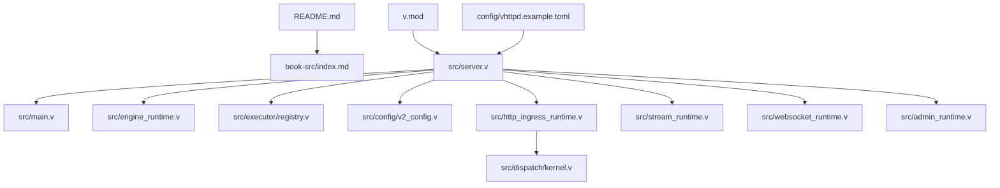
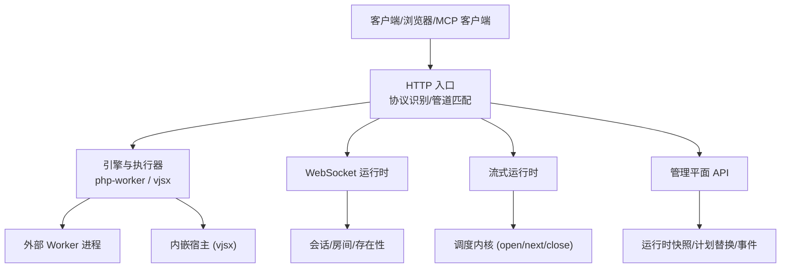
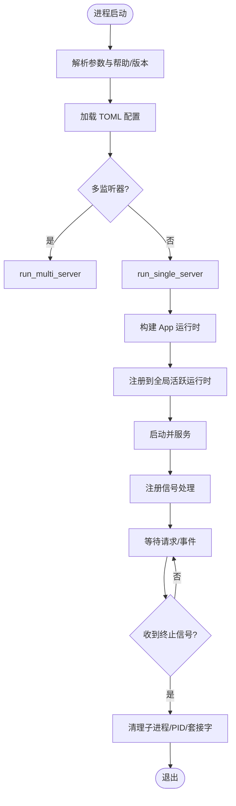
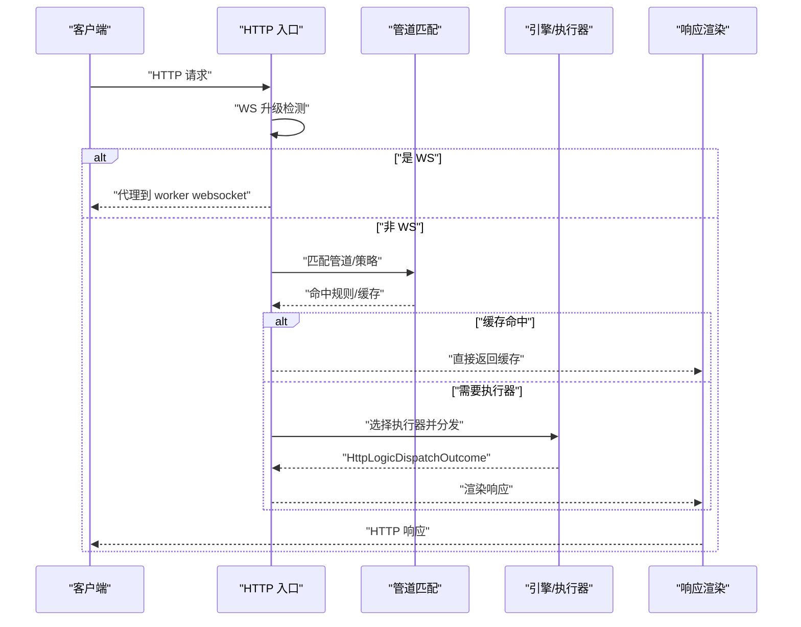
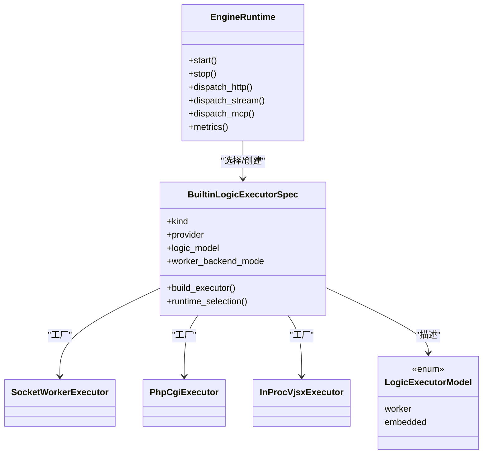
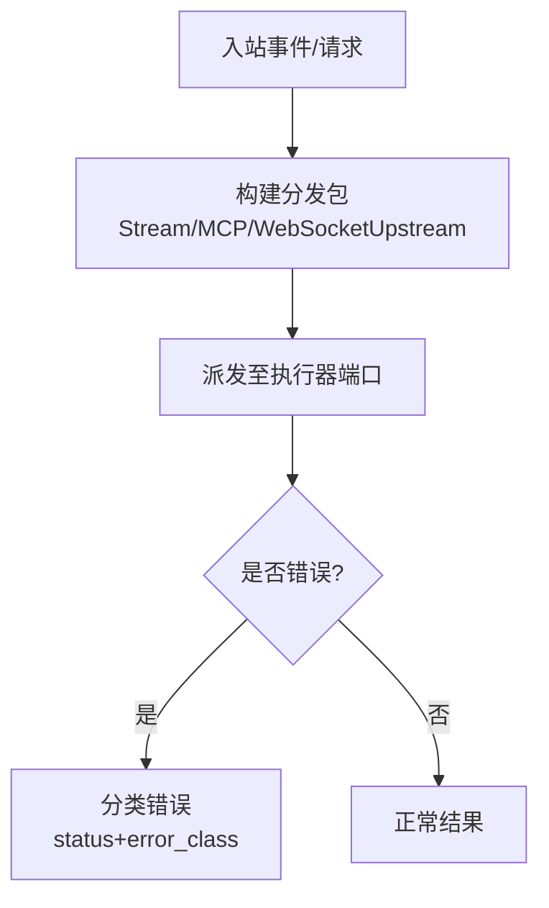
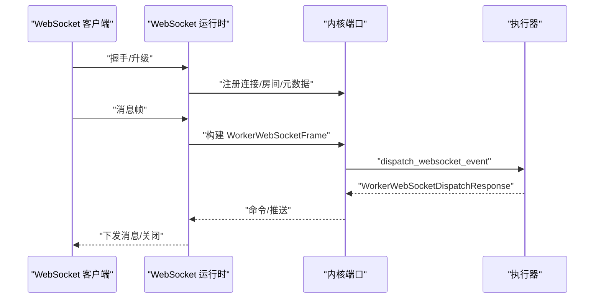
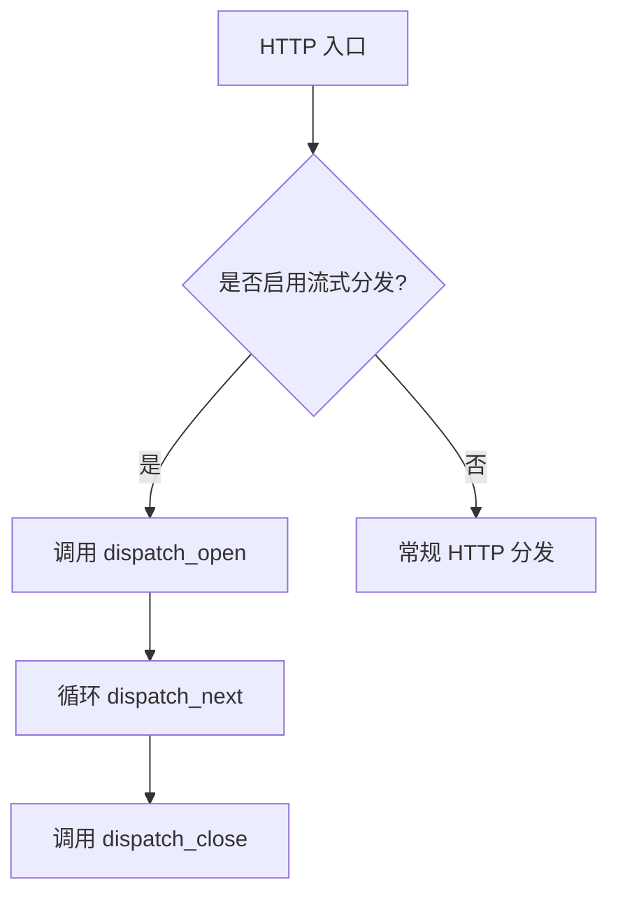
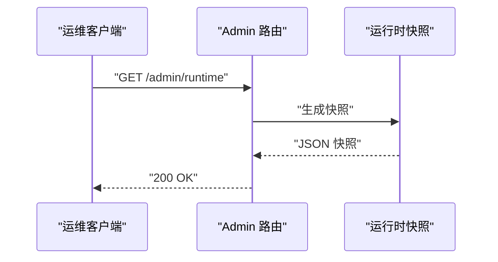
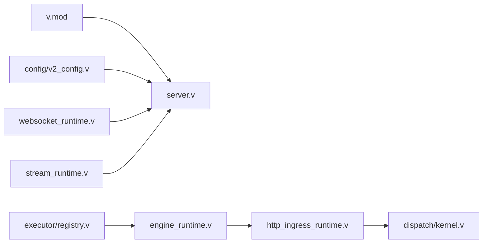

# 综合文章系列

<cite>
**本文引用的文件**   
- [README.md](file://README.md)
- [book-src/index.md](file://book-src/index.md)
- [v.mod](file://v.mod)
- [config/vhttpd.example.toml](file://config/vhttpd.example.toml)
- [src/main.v](file://src/main.v)
- [src/server.v](file://src/server.v)
- [src/engine_runtime.v](file://src/engine_runtime.v)
- [src/executor/types.v](file://src/executor/types.v)
- [src/executor/registry.v](file://src/executor/registry.v)
- [src/config/v2_config.v](file://src/config/v2_config.v)
- [src/dispatch/kernel.v](file://src/dispatch/kernel.v)
- [src/http_ingress_runtime.v](file://src/http_ingress_runtime.v)
- [src/stream_runtime.v](file://src/stream_runtime.v)
- [src/websocket_runtime.v](file://src/websocket_runtime.v)
- [src/admin_runtime.v](file://src/admin_runtime.v)
</cite>

## 目录
1. [引言](#引言)
2. [项目结构](#项目结构)
3. [核心组件](#核心组件)
4. [架构总览](#架构总览)
5. [详细组件分析](#详细组件分析)
6. [依赖关系分析](#依赖关系分析)
7. [性能考量](#性能考量)
8. [故障排查指南](#故障排查指南)
9. [结论](#结论)
10. [附录](#附录)

## 引言
本系列文档面向 vhttpd 的开发者与运维人员，系统性梳理其作为“多协议执行主机”的定位、运行时架构、请求处理流程、执行器模型、管理平面与可观测性。vhttpd 基于 V 语言与 veb 构建，统一承载 HTTP/WebSocket/流式响应（SSE/text）以及 MCP 等协议，并通过可插拔的执行器（php-worker、vjsx 嵌入式等）将业务逻辑委托给外部进程或内嵌宿主。

## 项目结构
仓库采用分层与按功能域组织的方式：
- src：核心运行时与协议处理（HTTP 入口、调度内核、引擎生命周期、执行器注册表、WebSocket/流式/MCP 支持、管理平面等）
- config：示例配置与 TOML 规范
- book-src：中文文档站点源码
- examples：应用示例与运行配置
- admin：管理面板前端资源与配置
- deploy：系统服务模板（systemd/launchd）
- scripts：安装与打包脚本
- design-docs：设计文档与契约说明

图表来源
- [README.md:1-150](file://README.md#L1-L150)
- [book-src/index.md:1-25](file://book-src/index.md#L1-L25)
- [v.mod:1-7](file://v.mod#L1-L7)
- [config/vhttpd.example.toml:1-67](file://config/vhttpd.example.toml#L1-L67)
- [src/server.v:1-120](file://src/server.v#L1-L120)
- [src/main.v:1-117](file://src/main.v#L1-L117)
- [src/engine_runtime.v:1-120](file://src/engine_runtime.v#L1-L120)
- [src/executor/registry.v:1-130](file://src/executor/registry.v#L1-L130)
- [src/config/v2_config.v:1-120](file://src/config/v2_config.v#L1-L120)
- [src/http_ingress_runtime.v:1-146](file://src/http_ingress_runtime.v#L1-L146)
- [src/stream_runtime.v:1-48](file://src/stream_runtime.v#L1-L48)
- [src/websocket_runtime.v:1-115](file://src/websocket_runtime.v#L1-L115)
- [src/admin_runtime.v:1-120](file://src/admin_runtime.v#L1-L120)
- [src/dispatch/kernel.v:1-151](file://src/dispatch/kernel.v#L1-L151)

章节来源
- [README.md:1-150](file://README.md#L1-L150)
- [book-src/index.md:1-25](file://book-src/index.md#L1-L25)
- [v.mod:1-7](file://v.mod#L1-L7)

## 核心组件
- 服务器启动与生命周期：负责参数解析、TOML 配置加载、时区设置、信号处理、单/多监听器模式选择、进程级清理与退出。
- 数据面入口：HTTP 路由与协议升级判断、管道匹配、缓存命中、执行器选择与分发、响应渲染。
- 引擎与执行器：统一抽象 LogicExecutor，内置 php-worker、php-cgi、vjsx 嵌入式；提供生命周期、HTTP/Stream/WebSocket/MCP 端口能力。
- 调度内核：为 Stream、MCP、WebSocket 上游事件等构造标准化分发包，并分类传输错误。
- WebSocket 运行时：连接注册、房间与会话状态、消息广播、命令执行与失败后续处理。
- 流式运行时：open/next/close 三阶段调度上下文封装，对接内核流式分发。
- 管理平面：运行时快照、计划替换工作流、事件投递、WebSocket/MCP/Provider 实例监控等。

章节来源
- [src/server.v:120-372](file://src/server.v#L120-L372)
- [src/http_ingress_runtime.v:1-146](file://src/http_ingress_runtime.v#L1-L146)
- [src/engine_runtime.v:1-200](file://src/engine_runtime.v#L1-L200)
- [src/executor/types.v:1-120](file://src/executor/types.v#L1-L120)
- [src/executor/registry.v:1-130](file://src/executor/registry.v#L1-L130)
- [src/dispatch/kernel.v:1-151](file://src/dispatch/kernel.v#L1-L151)
- [src/websocket_runtime.v:1-115](file://src/websocket_runtime.v#L1-L115)
- [src/stream_runtime.v:1-48](file://src/stream_runtime.v#L1-L48)
- [src/admin_runtime.v:1-120](file://src/admin_runtime.v#L1-L120)

## 架构总览
vhttpd 以 veb 为 HTTP 事实源，保持自身轻量，聚焦传输、Worker 编排、流式与可观测性。请求进入后由 HTTP 入口进行协议识别与管道匹配，随后根据执行器模型选择具体后端（外部进程或内嵌宿主），并对 WebSocket/流式/MCP 等协议提供专用运行时。

图表来源
- [README.md:84-126](file://README.md#L84-L126)
- [src/main.v:83-117](file://src/main.v#L83-L117)
- [src/http_ingress_runtime.v:31-139](file://src/http_ingress_runtime.v#L31-L139)
- [src/engine_runtime.v:1-120](file://src/engine_runtime.v#L1-L120)
- [src/websocket_runtime.v:1-115](file://src/websocket_runtime.v#L1-L115)
- [src/stream_runtime.v:1-48](file://src/stream_runtime.v#L1-L48)
- [src/admin_runtime.v:1-120](file://src/admin_runtime.v#L1-L120)

## 详细组件分析

### 服务器启动与生命周期
- 命令行参数校验与帮助输出，版本打印。
- 加载 TOML 配置，合并 CLI 覆盖项，决定单/多监听器模式。
- 设置运行时时区（优先级：plan > 配置 > 环境变量 > 默认 Asia/Shanghai）。
- 注册 SIGINT/SIGTERM 信号处理器，优雅终止子进程组、清理 PID/内部套接字文件。
- 构建 App 运行时，注册到全局活跃运行时注册表，启动并服务。

图表来源
- [src/server.v:137-372](file://src/server.v#L137-L372)

章节来源
- [src/server.v:137-372](file://src/server.v#L137-L372)

### HTTP 入口与管道匹配
- 统一代理方法映射至 HttpIngressRuntime.route。
- 检测 WebSocket 升级，走 worker websocket 代理。
- 尝试协议层路由（如 MCP/自定义协议），未命中则进入数据面处理。
- 规范化路径与查询，必要时返回目录斜杠重定向。
- 匹配 RuntimePlan 管道，优先缓存命中，再选择执行器（主/附加池），必要时走流式分发。
- 最终通过 HttpResponseRuntime 渲染结果。

图表来源
- [src/main.v:83-117](file://src/main.v#L83-L117)
- [src/http_ingress_runtime.v:31-139](file://src/http_ingress_runtime.v#L31-L139)

章节来源
- [src/main.v:83-117](file://src/main.v#L83-L117)
- [src/http_ingress_runtime.v:31-139](file://src/http_ingress_runtime.v#L31-L139)

### 引擎与执行器模型
- 引擎（EngineRuntime）统一管理主执行器与附加执行器，提供 HTTP/Stream/WebSocket/MCP 端口转发与指标收集。
- 执行器注册表（BuiltinLogicExecutorSpec）声明内置类型：none、php、php-cgi、vjsx，包含生命周期、工厂、配置表面与能力。
- 执行器模型分为 worker（外部进程）与 embedded（内嵌宿主），worker_backend_mode 区分 required/disabled。
- 针对 PHP 场景提供命令构建、环境注入与配置校验；vjsx 提供内嵌运行时配置与线程数控制。

图表来源
- [src/engine_runtime.v:1-200](file://src/engine_runtime.v#L1-L200)
- [src/executor/registry.v:1-130](file://src/executor/registry.v#L1-L130)
- [src/executor/types.v:65-92](file://src/executor/types.v#L65-L92)

章节来源
- [src/engine_runtime.v:1-200](file://src/engine_runtime.v#L1-L200)
- [src/executor/registry.v:1-130](file://src/executor/registry.v#L1-L130)
- [src/executor/types.v:65-92](file://src/executor/types.v#L65-L92)

### 调度内核与分发包
- 为 Stream、MCP、WebSocket 上游事件等构造标准化分发包，统一 request_id/trace_id、headers、query、state 等字段。
- 对传输错误进行分类，返回标准状态码与错误类，便于上层统一处理。

图表来源
- [src/dispatch/kernel.v:1-151](file://src/dispatch/kernel.v#L1-L151)

章节来源
- [src/dispatch/kernel.v:1-151](file://src/dispatch/kernel.v#L1-L151)

### WebSocket 运行时
- 构建内核端口，封装帧构造与事件派发。
- 维护连接注册、房间成员、元数据、广播、关闭目标等能力。
- 支持命令执行与失败后续处理（当前为桩实现）。

图表来源
- [src/websocket_runtime.v:1-115](file://src/websocket_runtime.v#L1-L115)
- [src/dispatch/kernel.v:123-146](file://src/dispatch/kernel.v#L123-L146)

章节来源
- [src/websocket_runtime.v:1-115](file://src/websocket_runtime.v#L1-L115)
- [src/dispatch/kernel.v:123-146](file://src/dispatch/kernel.v#L123-L146)

### 流式运行时
- 封装 open/next/close 三阶段调度上下文，向内核提交对应分发包。
- 在 HTTP 入口中，当引擎启用 stream_dispatch 且命中主池时，优先走流式分发路径。

图表来源
- [src/stream_runtime.v:1-48](file://src/stream_runtime.v#L1-L48)
- [src/http_ingress_runtime.v:122-131](file://src/http_ingress_runtime.v#L122-L131)

章节来源
- [src/stream_runtime.v:1-48](file://src/stream_runtime.v#L1-L48)
- [src/http_ingress_runtime.v:122-131](file://src/http_ingress_runtime.v#L122-L131)

### 管理平面 API
- 暴露运行时快照、计划替换工作流（预览/应用/完成/取消）、事件投递、WebSocket/MCP/Provider 实例监控等。
- 所有端点均通过统一的数据面鉴权与包装函数处理。

图表来源
- [src/admin_runtime.v:1-120](file://src/admin_runtime.v#L1-L120)

章节来源
- [src/admin_runtime.v:1-120](file://src/admin_runtime.v#L1-L120)

## 依赖关系分析
- 模块与包：v.mod 定义模块名与基础 URL，server.v 作为入口聚合各子系统。
- 配置模型：v2_config.v 提供 V2 配置结构体（服务器、监听器、TLS、观察性、资源、引擎、适配器、转换、策略、提供者、管道、中继等）。
- 执行器与引擎：engine_runtime.v 依赖 executor 接口与 registry 注册表，统一对外暴露分发能力。
- 协议与调度：http_ingress_runtime.v 与 dispatch/kernel.v 协作，形成从 HTTP 到执行器的完整链路。
- 运行时扩展：websocket_runtime.v 与 stream_runtime.v 分别扩展长连接与流式处理能力。

图表来源
- [v.mod:1-7](file://v.mod#L1-L7)
- [src/server.v:1-120](file://src/server.v#L1-L120)
- [src/config/v2_config.v:1-120](file://src/config/v2_config.v#L1-L120)
- [src/executor/registry.v:1-130](file://src/executor/registry.v#L1-L130)
- [src/engine_runtime.v:1-120](file://src/engine_runtime.v#L1-L120)
- [src/http_ingress_runtime.v:1-146](file://src/http_ingress_runtime.v#L1-L146)
- [src/dispatch/kernel.v:1-151](file://src/dispatch/kernel.v#L1-L151)
- [src/websocket_runtime.v:1-115](file://src/websocket_runtime.v#L1-L115)
- [src/stream_runtime.v:1-48](file://src/stream_runtime.v#L1-L48)

章节来源
- [v.mod:1-7](file://v.mod#L1-L7)
- [src/server.v:1-120](file://src/server.v#L1-L120)
- [src/config/v2_config.v:1-120](file://src/config/v2_config.v#L1-L120)
- [src/executor/registry.v:1-130](file://src/executor/registry.v#L1-L130)
- [src/engine_runtime.v:1-120](file://src/engine_runtime.v#L1-L120)
- [src/http_ingress_runtime.v:1-146](file://src/http_ingress_runtime.v#L1-L146)
- [src/dispatch/kernel.v:1-151](file://src/dispatch/kernel.v#L1-L151)
- [src/websocket_runtime.v:1-115](file://src/websocket_runtime.v#L1-L115)
- [src/stream_runtime.v:1-48](file://src/stream_runtime.v#L1-L48)

## 性能考量
- 锁层级与并发安全：server.v 明确定义了全局锁层次，避免死锁；建议遵循先高后低顺序获取，使用 defer 释放。
- 队列与超时：引擎指标暴露队列深度、容量、超时与拒绝计数，用于评估背压与扩容。
- 流式优化：在启用 stream_dispatch 的场景下，优先走流式分发路径，减少阻塞与缓冲。
- 资源限制：通过 V2 配置中的 limit/concurrency/response 策略控制最大请求体、超时、并发与队列上限。

[本节为通用指导，不直接分析具体文件]

## 故障排查指南
- 启动与配置
  - 检查 TOML 配置与 CLI 覆盖项是否正确，确认 paths/php/vjsx 相关路径存在。
  - 参考示例配置与 README 的运行方式验证基本可用性。
- 执行器问题
  - 若选择 php 执行器，确保 worker_entry/app_entry/extensions 存在且可加载。
  - 若选择 vjsx 执行器，确认 app_entry/module_root/build_root 与运行时 profile 正确。
- 管理与可观测
  - 通过 /admin/runtime 查看运行时快照与指标，定位队列积压、超时与拒绝情况。
  - 使用 /admin/events 与 /admin/runtime/graph 辅助诊断。
- 信号与优雅退出
  - 确认 SIGINT/SIGTERM 已注册，子进程组被正确终止，PID 与内部套接字文件被清理。

章节来源
- [config/vhttpd.example.toml:1-67](file://config/vhttpd.example.toml#L1-L67)
- [src/executor/registry.v:300-387](file://src/executor/registry.v#L300-L387)
- [src/admin_runtime.v:1-120](file://src/admin_runtime.v#L1-L120)
- [src/server.v:116-135](file://src/server.v#L116-L135)

## 结论
vhttpd 以 veb 为核心，围绕“协议接入 + 执行器模型 + 运行时能力”构建了可扩展的多协议执行主机。通过统一的执行器抽象与调度内核，既保留了 PHP 生态的成熟度，又引入了内嵌 vjsx 的高性能路径，并在 WebSocket 与流式场景提供了稳定的运行时保障。配合完善的管理平面与可观测性，适合在生产环境中承载多样化业务负载。

[本节为总结性内容，不直接分析具体文件]

## 附录
- 快速开始与示例
  - 参考 README 的运行与配置说明，结合示例配置快速启动。
- 文档站点
  - book-src/index.md 提供中文文档导航与概览。

章节来源
- [README.md:428-525](file://README.md#L428-L525)
- [book-src/index.md:1-25](file://book-src/index.md#L1-L25)