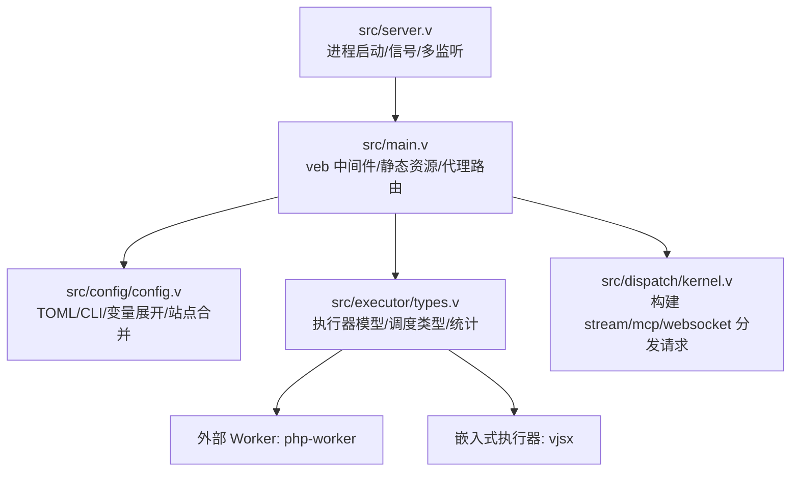
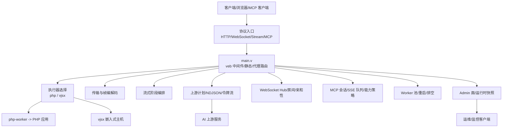
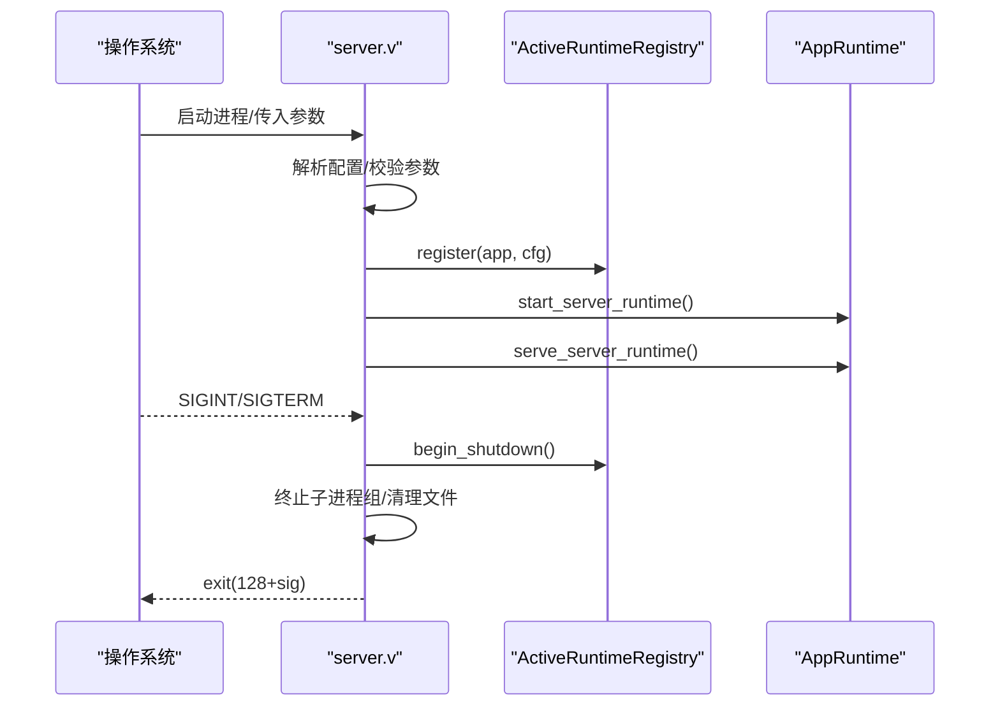
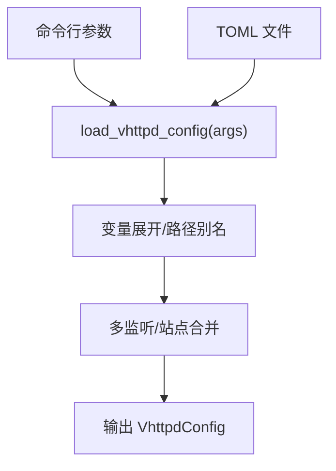
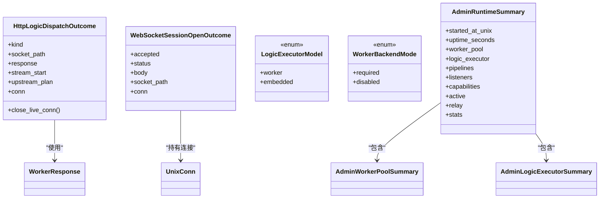
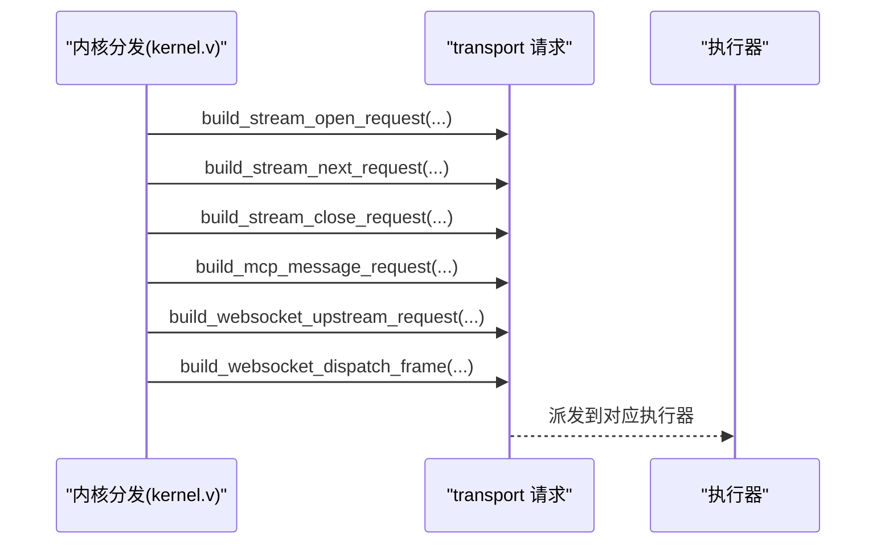
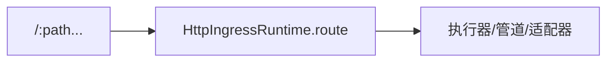
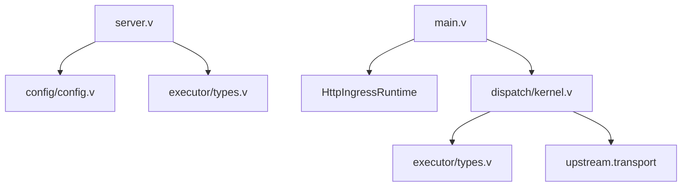

# 设计文档集合

<cite>
**本文引用的文件**   
- [README.md](file://README.md)
- [server.v](file://src/server.v)
- [main.v](file://src/main.v)
- [config.v](file://src/config/config.v)
- [types.v](file://src/executor/types.v)
- [kernel.v](file://src/dispatch/kernel.v)
</cite>

## 目录
1. [引言](#引言)
2. [项目结构](#项目结构)
3. [核心组件](#核心组件)
4. [架构总览](#架构总览)
5. [详细组件分析](#详细组件分析)
6. [依赖关系分析](#依赖关系分析)
7. [性能考量](#性能考量)
8. [故障排查指南](#故障排查指南)
9. [结论](#结论)
10. [附录](#附录)

## 引言
本设计文档面向 vhttpd 的架构与实现，聚焦其作为“传输运行时”的定位：统一承载 HTTP、WebSocket、流式响应（SSE/text）、MCP Streamable HTTP 以及上游 token 流等协议形态；通过外部 worker（如 php-worker）与嵌入式执行器（vjsx）运行应用逻辑；并提供管理面、可观测性与多监听器能力。文档从系统架构、组件关系、数据流、处理逻辑、集成点、错误处理与性能特性等维度展开，并辅以代码级图示帮助读者理解。

## 项目结构
仓库采用按功能域划分的模块化组织方式，核心源码位于 src 下，配置示例在 config，示例应用在 examples，设计文档在 design-docs，书籍文档在 book-src。关键入口与模块：
- 进程启动与生命周期：src/server.v
- 请求路由与中间件组合：src/main.v
- 配置加载与解析：src/config/config.v
- 执行器模型与调度类型：src/executor/types.v
- 内核分发构造器：src/dispatch/kernel.v

图表来源
- [server.v:1-120](file://src/server.v#L1-L120)
- [main.v:1-117](file://src/main.v#L1-L117)
- [config.v:1-120](file://src/config/config.v#L1-L120)
- [types.v:1-120](file://src/executor/types.v#L1-L120)
- [kernel.v:1-80](file://src/dispatch/kernel.v#L1-L80)

章节来源
- [README.md:1-120](file://README.md#L1-L120)
- [server.v:1-120](file://src/server.v#L1-L120)
- [main.v:1-117](file://src/main.v#L1-L117)
- [config.v:1-120](file://src/config/config.v#L1-L120)
- [types.v:1-120](file://src/executor/types.v#L1-L120)
- [kernel.v:1-80](file://src/dispatch/kernel.v#L1-L80)

## 核心组件
- 进程与生命周期
  - 全局活跃运行时注册表、单例/多监听模式选择、信号处理与优雅退出、PID/内部 socket 清理。
- 配置系统
  - TOML-first，支持 ${section.key} 与 ${env.NAME:-default} 变量展开；多监听与站点叠加；路径别名与默认值推导。
- 执行器模型
  - 统一抽象 LogicExecutorModel（worker/embedded），对外暴露 kind/provider/lifecycle/model 等元信息；PHP 与 vjsx 为内置实现。
- 内核分发
  - 将不同协议（stream、mcp、websocket_upstream、websocket_dispatch）转换为统一的 KernelDispatchEnvelope 与 DispatchContext，供上层编排。

章节来源
- [server.v:1-120](file://src/server.v#L1-L120)
- [config.v:420-520](file://src/config/config.v#L420-L520)
- [types.v:60-120](file://src/executor/types.v#L60-L120)
- [kernel.v:1-80](file://src/dispatch/kernel.v#L1-L80)

## 架构总览
vhttpd 以 veb 为 HTTP 事实来源，保持自身轻薄，专注传输、Worker 编排、流式与可观测性。整体分层如下：
- 协议层：HTTP/WebSocket/Stream/MCP
- 运行时层：Worker 池、Upstream 计划、WebSocket Hub、MCP 会话、Admin 面
- 执行器层：php-worker（外部进程）、vjsx（嵌入式）
- 外部生态：AI 上游（Ollama/OpenAI 等）、飞书长连接、数据库/缓存等

图表来源
- [README.md:84-126](file://README.md#L84-L126)
- [main.v:83-117](file://src/main.v#L83-L117)
- [server.v:276-319](file://src/server.v#L276-L319)

## 详细组件分析

### 进程与生命周期（server.v）
- 职责
  - 解析参数与配置，决定单实例或多监听模式
  - 初始化时区、信号处理、绑定端口、注册活跃运行时
  - 优雅关闭：终止子进程组、清理 PID/内部 socket
- 关键点
  - 锁层级规范与顺序约束，避免死锁
  - 多监听模式下每个 site 拥有独立运行时与执行器选择

图表来源
- [server.v:116-135](file://src/server.v#L116-L135)
- [server.v:276-319](file://src/server.v#L276-L319)

章节来源
- [server.v:1-120](file://src/server.v#L1-L120)
- [server.v:276-319](file://src/server.v#L276-L319)

### 配置系统（config.v）
- 职责
  - 加载 TOML 与 CLI 覆盖，变量展开，路径别名解析
  - 多监听与站点合并，Feishu/OpenAI/Provider/Executors 等复杂段解析
- 关键点
  - 变量展开支持 ${section.key} 与 ${env.NAME:-default}
  - 多监听：listeners.<id> -> sites.<id> 一对一映射，site 级覆盖全局

图表来源
- [config.v:428-482](file://src/config/config.v#L428-L482)
- [config.v:484-502](file://src/config/config.v#L484-L502)

章节来源
- [config.v:428-502](file://src/config/config.v#L428-L502)
- [config.v:504-546](file://src/config/config.v#L504-L546)

### 执行器模型与类型（executor/types.v）
- 职责
  - 定义 HTTP 分发结果、WebSocket 会话打开结果、执行器模型（worker/embedded）
  - 提供 Admin 统计与摘要结构体，便于管理面展示
- 关键点
  - HttpLogicDispatchKind/response/stream/upstream_plan 三种结果
  - LogicExecutorModel/WorkerBackendMode 区分外部 worker 与嵌入式执行器

图表来源
- [types.v:15-42](file://src/executor/types.v#L15-L42)
- [types.v:44-63](file://src/executor/types.v#L44-L63)
- [types.v:67-75](file://src/executor/types.v#L67-L75)
- [types.v:252-264](file://src/executor/types.v#L252-L264)

章节来源
- [types.v:1-120](file://src/executor/types.v#L1-L120)
- [types.v:252-264](file://src/executor/types.v#L252-L264)

### 内核分发构造器（dispatch/kernel.v）
- 职责
  - 将不同协议事件封装为统一的 transport 请求结构，供上层派发至执行器
- 关键点
  - stream open/next/close 三阶段
  - mcp message 携带 JSON-RPC 原始体与会话上下文
  - websocket_upstream 与 websocket_dispatch 两种模式

图表来源
- [kernel.v:30-77](file://src/dispatch/kernel.v#L30-L77)
- [kernel.v:79-98](file://src/dispatch/kernel.v#L79-L98)
- [kernel.v:100-146](file://src/dispatch/kernel.v#L100-L146)

章节来源
- [kernel.v:1-151](file://src/dispatch/kernel.v#L1-L151)

### 请求路由与中间件（main.v）
- 职责
  - 基于 veb.Middleware 组合中间件与静态资源处理器
  - 将通用路径交由 HttpIngressRuntime.route 进行协议识别与分发
- 关键点
  - 对 GET/POST/PUT/PATCH/DELETE/HEAD/OPTIONS 统一代理到路由层
  - 结合 request_id 与 trace_id 注入，便于追踪

图表来源
- [main.v:83-117](file://src/main.v#L83-L117)

章节来源
- [main.v:1-117](file://src/main.v#L1-L117)

## 依赖关系分析
- 模块耦合
  - server.v 负责进程生命周期与多监听编排，依赖 config 与 executor 选择
  - main.v 依赖 veb 中间件与 HttpIngressRuntime，向上承接所有 HTTP 方法
  - dispatch/kernel.v 仅依赖 upstream.transport 与 executor 类型，低耦合地构造分发请求
  - config/config.v 被多处消费，是配置事实来源
- 外部依赖
  - veb/http/urllib 作为 HTTP 事实来源
  - 外部 php-worker 进程、嵌入式 vjsx 主机、AI 上游服务、飞书长连接

图表来源
- [server.v:276-319](file://src/server.v#L276-L319)
- [main.v:83-117](file://src/main.v#L83-L117)
- [kernel.v:1-80](file://src/dispatch/kernel.v#L1-L80)
- [types.v:1-120](file://src/executor/types.v#L1-L120)
- [config.v:428-502](file://src/config/config.v#L428-L502)

章节来源
- [server.v:276-319](file://src/server.v#L276-L319)
- [main.v:83-117](file://src/main.v#L83-L117)
- [kernel.v:1-80](file://src/dispatch/kernel.v#L1-L80)
- [types.v:1-120](file://src/executor/types.v#L1-L120)
- [config.v:428-502](file://src/config/config.v#L428-L502)

## 性能考量
- 锁层级与并发安全
  - 明确 L0..L7 锁层级，禁止倒序获取，减少竞争与死锁风险
- Worker 池与队列
  - 通过 pool_size、queue_capacity、queue_timeout_ms 控制吞吐与背压
- 流式优化
  - 分阶段流式（open/next/close）降低内存占用，提升端到端延迟
- 嵌入式执行器
  - vjsx in-proc 模式避免跨进程开销，适合轻量快速迭代场景

[本节为通用指导，不直接分析具体文件]

## 故障排查指南
- 常见症状
  - 启动失败：检查 --config 路径、端口占用、证书路径
  - Worker 不可用：查看 worker 池状态、队列深度与超时
  - 流中断：核对 stream 阶段 open/next/close 是否完整
  - MCP 会话异常：检查 session TTL、pending 消息上限与采样策略
- 定位手段
  - 使用 Admin 面查看 runtime summary、worker stats、upstream 活动
  - 启用 event log 与 trace_id/request_id 关联日志
  - 利用 signal 处理与优雅退出观察子进程清理情况

章节来源
- [server.v:116-135](file://src/server.v#L116-L135)
- [types.v:95-146](file://src/executor/types.v#L95-L146)

## 结论
vhttpd 以 veb 为 HTTP 事实来源，围绕“传输运行时”定位，统一承载多种协议与执行模型，并通过执行器抽象、内核分发与配置系统形成清晰的分层与扩展点。配合 Admin 面与事件日志，具备生产可用的可观测性与运维能力。未来可在更多执行器与 Provider 上继续演进，同时保持与 veb 的紧密耦合以获得最佳性能与稳定性。

[本节为总结性内容，不直接分析具体文件]

## 附录
- 运行与部署
  - 参考 README 中的运行命令、TOML 配置、多监听示例与服务管理模板
- 示例与最佳实践
  - examples 目录下提供多场景示例与配置文件，便于快速上手与验证

章节来源
- [README.md:428-531](file://README.md#L428-L531)