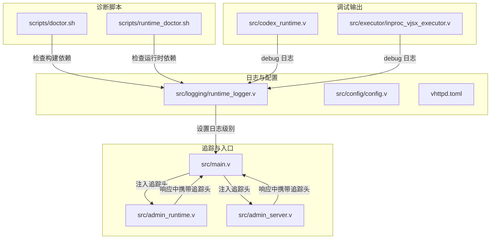
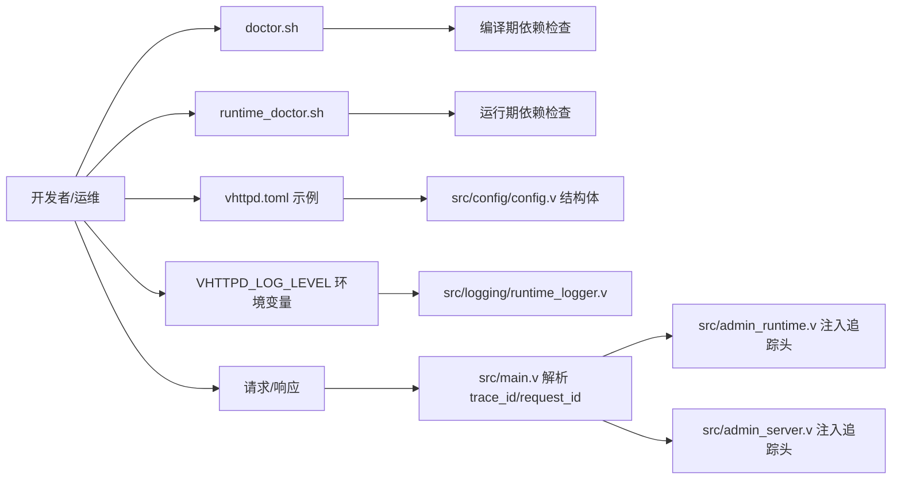
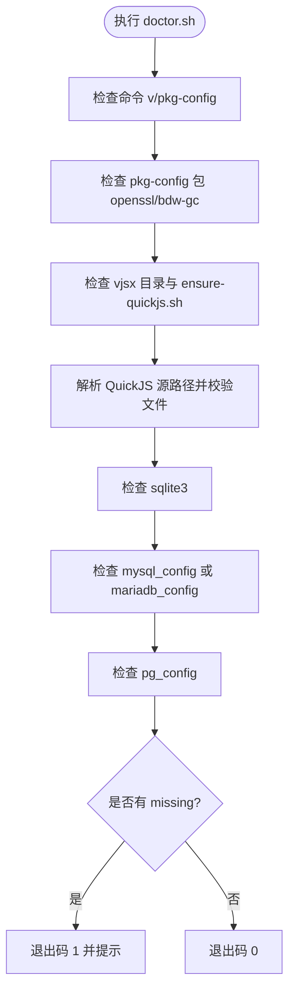
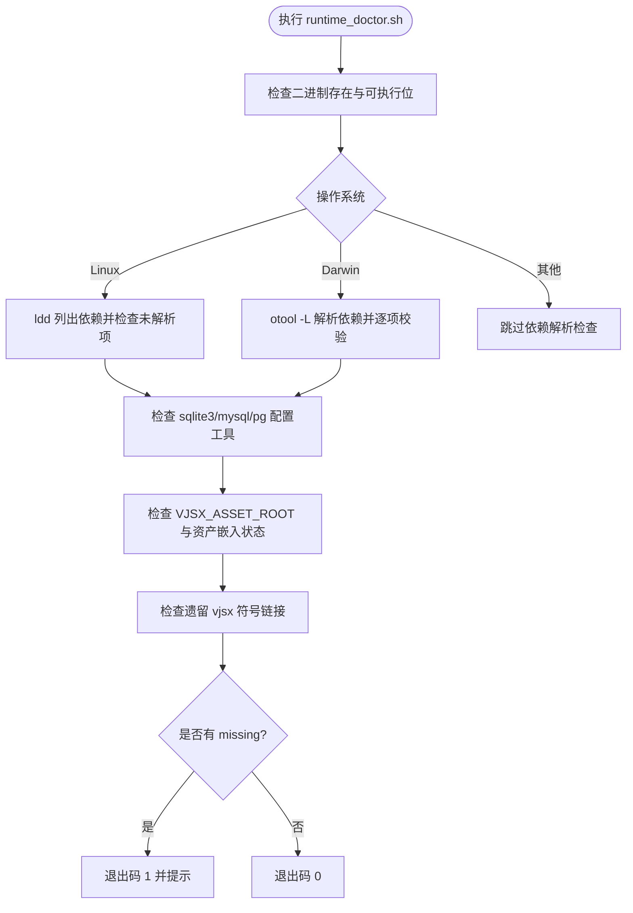
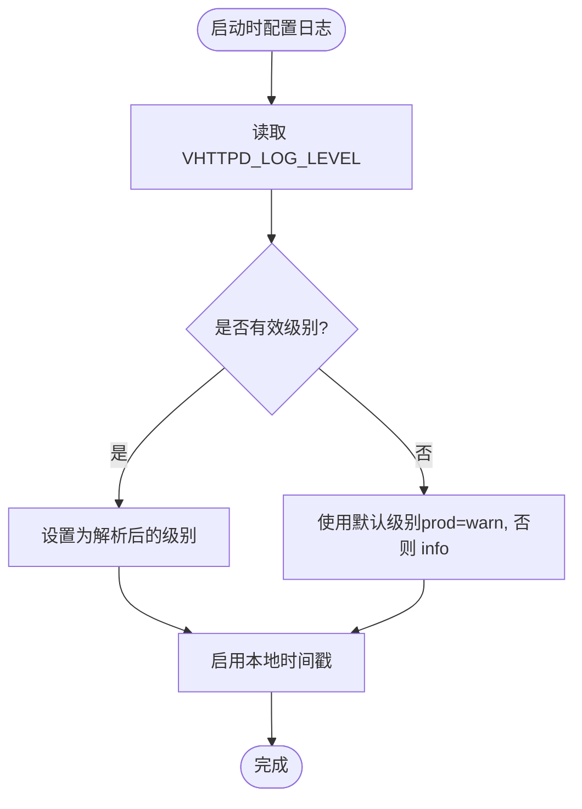
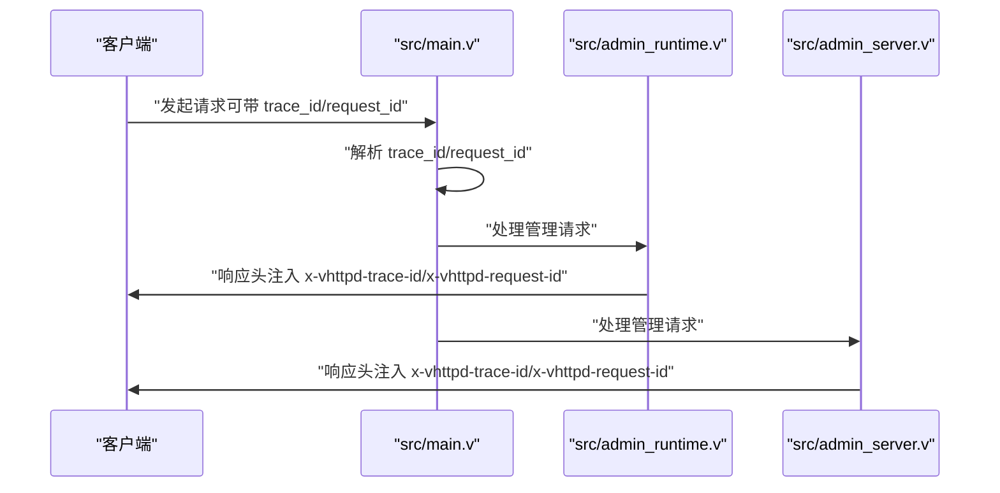
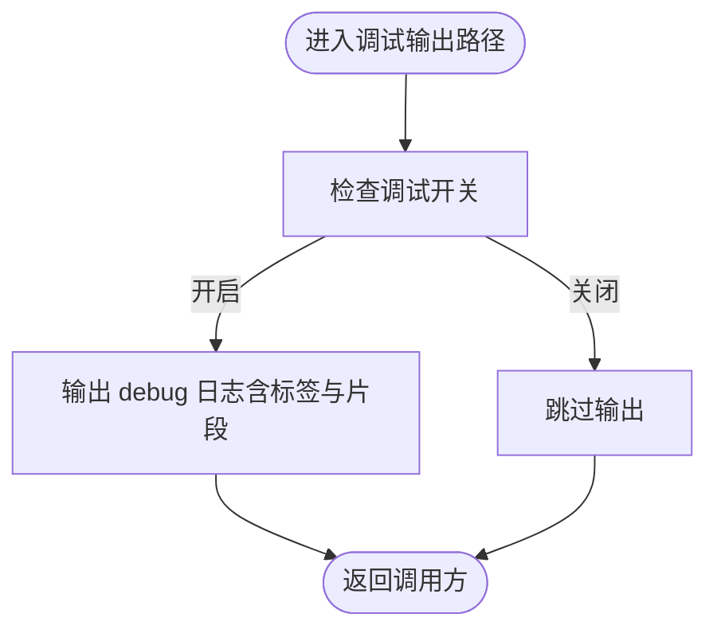
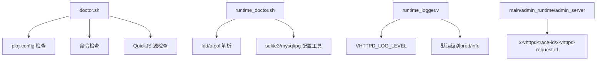

# 调试工具与技巧

<cite>
**本文引用的文件**
- [scripts/doctor.sh](file://scripts/doctor.sh)
- [scripts/runtime_doctor.sh](file://scripts/runtime_doctor.sh)
- [src/logging/runtime_logger.v](file://src/logging/runtime_logger.v)
- [src/config/config.v](file://src/config/config.v)
- [vhttpd.toml](file://vhttpd.toml)
- [src/main.v](file://src/main.v)
- [src/admin_runtime.v](file://src/admin_runtime.v)
- [src/admin_server.v](file://src/admin_server.v)
- [src/codex_runtime.v](file://src/codex_runtime.v)
- [src/executor/inproc_vjsx_executor.v](file://src/executor/inproc_vjsx_executor.v)
- [Makefile](file://Makefile)
- [README.md](file://README.md)
</cite>

## 目录
1. [简介](#简介)
2. [项目结构](#项目结构)
3. [核心组件](#核心组件)
4. [架构总览](#架构总览)
5. [详细组件分析](#详细组件分析)
6. [依赖关系分析](#依赖关系分析)
7. [性能考量](#性能考量)
8. [故障排查指南](#故障排查指南)
9. [结论](#结论)
10. [附录](#附录)

## 简介
本指南面向 vhttpd 的开发者与运维人员，系统性介绍内置诊断工具与调试技巧，涵盖以下主题：
- 内置诊断脚本 doctor.sh 与 runtime_doctor.sh 的功能、输出解读与使用建议
- 日志系统配置与级别控制（环境变量、默认行为）
- 调试模式与运行时追踪头（trace_id/request_id）机制
- 常见问题的调试方法：连接问题、性能问题、内存泄漏排查
- 使用 GDB、Valgrind 等外部工具进行深度调试的实践要点
- 断点设置、堆栈跟踪与内存分析的实用技巧

## 项目结构
vhttpd 提供两套内置诊断脚本与完善的日志/追踪基础设施：
- 构建期诊断：scripts/doctor.sh 检查编译依赖与 QuickJS 环境
- 运行期诊断：scripts/runtime_doctor.sh 检查二进制依赖解析与客户端库可用性
- 日志系统：src/logging/runtime_logger.v 提供日志级别解析与全局配置
- 配置体系：src/config/config.v 定义配置结构；vhttpd.toml 提供示例配置
- 追踪头：src/main.v、src/admin_runtime.v、src/admin_server.v 注入 x-vhttpd-trace-id/x-vhttpd-request-id
- 调试输出：src/codex_runtime.v、src/executor/inproc_vjsx_executor.v 输出 debug 级别日志

**图表来源**
- [scripts/doctor.sh:1-108](file://scripts/doctor.sh#L1-L108)
- [scripts/runtime_doctor.sh:1-126](file://scripts/runtime_doctor.sh#L1-L126)
- [src/logging/runtime_logger.v:1-40](file://src/logging/runtime_logger.v#L1-L40)
- [src/config/config.v:1-800](file://src/config/config.v#L1-L800)
- [vhttpd.toml:1-32](file://vhttpd.toml#L1-L32)
- [src/main.v:218-270](file://src/main.v#L218-L270)
- [src/admin_runtime.v:148-308](file://src/admin_runtime.v#L148-L308)
- [src/admin_server.v:61-75](file://src/admin_server.v#L61-L75)
- [src/codex_runtime.v:1071-1099](file://src/codex_runtime.v#L1071-L1099)
- [src/executor/inproc_vjsx_executor.v:560-562](file://src/executor/inproc_vjsx_executor.v#L560-L562)

**章节来源**
- [scripts/doctor.sh:1-108](file://scripts/doctor.sh#L1-L108)
- [scripts/runtime_doctor.sh:1-126](file://scripts/runtime_doctor.sh#L1-L126)
- [src/logging/runtime_logger.v:1-40](file://src/logging/runtime_logger.v#L1-L40)
- [src/config/config.v:1-800](file://src/config/config.v#L1-L800)
- [vhttpd.toml:1-32](file://vhttpd.toml#L1-L32)
- [src/main.v:218-270](file://src/main.v#L218-L270)
- [src/admin_runtime.v:148-308](file://src/admin_runtime.v#L148-L308)
- [src/admin_server.v:61-75](file://src/admin_server.v#L61-L75)
- [src/codex_runtime.v:1071-1099](file://src/codex_runtime.v#L1071-L1099)
- [src/executor/inproc_vjsx_executor.v:560-562](file://src/executor/inproc_vjsx_executor.v#L560-L562)

## 核心组件
- 诊断脚本
  - doctor.sh：检查编译期依赖（命令、pkg-config 包、QuickJS 源），用于本地开发环境自检
  - runtime_doctor.sh：检查二进制链接库解析、客户端库可用性、vjsx 资产嵌入状态等
- 日志系统
  - 支持通过环境变量 VHTTPD_LOG_LEVEL 设置日志级别，支持 debug/info/warn/error/fatal
  - 默认生产环境为 warn，非生产为 info
- 配置与示例
  - 配置结构定义在 src/config/config.v，示例配置在 vhttpd.toml
- 追踪头
  - 入口函数解析 trace_id/request_id，并在响应头中注入 x-vhttpd-trace-id/x-vhttpd-request-id
- 调试输出
  - Codex 与内联 vjsx 执行器在关键路径输出 debug 日志，便于定位问题

**章节来源**
- [scripts/doctor.sh:1-108](file://scripts/doctor.sh#L1-L108)
- [scripts/runtime_doctor.sh:1-126](file://scripts/runtime_doctor.sh#L1-L126)
- [src/logging/runtime_logger.v:6-39](file://src/logging/runtime_logger.v#L6-L39)
- [src/config/config.v:284-307](file://src/config/config.v#L284-L307)
- [vhttpd.toml:1-32](file://vhttpd.toml#L1-L32)
- [src/main.v:218-270](file://src/main.v#L218-L270)
- [src/admin_runtime.v:148-308](file://src/admin_runtime.v#L148-L308)
- [src/admin_server.v:61-75](file://src/admin_server.v#L61-L75)
- [src/codex_runtime.v:1071-1099](file://src/codex_runtime.v#L1071-L1099)
- [src/executor/inproc_vjsx_executor.v:560-562](file://src/executor/inproc_vjsx_executor.v#L560-L562)

## 架构总览
下图展示诊断脚本、日志系统、配置与追踪头之间的交互关系。

**图表来源**
- [scripts/doctor.sh:1-108](file://scripts/doctor.sh#L1-L108)
- [scripts/runtime_doctor.sh:1-126](file://scripts/runtime_doctor.sh#L1-L126)
- [src/logging/runtime_logger.v:25-39](file://src/logging/runtime_logger.v#L25-L39)
- [src/config/config.v:284-307](file://src/config/config.v#L284-L307)
- [vhttpd.toml:1-32](file://vhttpd.toml#L1-L32)
- [src/main.v:218-270](file://src/main.v#L218-L270)
- [src/admin_runtime.v:148-308](file://src/admin_runtime.v#L148-L308)
- [src/admin_server.v:61-75](file://src/admin_server.v#L61-L75)

## 详细组件分析

### doctor.sh：构建期诊断工具
- 功能概览
  - 检查必要命令：v、pkg-config
  - 检查 pkg-config 包：openssl、bdw-gc
  - 检查 vjsx 目录与 QuickJS 管理脚本是否存在
  - 尝试解析本地或托管 QuickJS 源路径并验证关键文件存在
  - 检查 sqlite3、mysql_config/mariadb_config、pg_config 可用性
- 输出解读
  - ok：表示该依赖已满足
  - warn：表示可选依赖缺失，可能影响部分功能
  - missing：表示必需依赖缺失，需安装后重试
- 使用建议
  - 在首次编译前运行，确保依赖齐全
  - 若提示缺少 mysql_config 或 pg_config，按需安装对应数据库客户端开发包

**图表来源**
- [scripts/doctor.sh:24-107](file://scripts/doctor.sh#L24-L107)

**章节来源**
- [scripts/doctor.sh:1-108](file://scripts/doctor.sh#L1-L108)

### runtime_doctor.sh：运行期诊断工具
- 功能概览
  - 校验二进制存在且可执行
  - Linux：使用 ldd 列出动态库并检测未解析项
  - macOS：使用 otool -L 解析依赖，对非系统路径逐一校验
  - 检查 sqlite3、mysql_config/mariadb_config、pg_config 可用性
  - 检查 VJSX_ASSET_ROOT 环境变量与 vjsx 资产嵌入状态
  - 提示遗留兼容符号链接（不再需要）
- 输出解读
  - ok：依赖已满足
  - warn：依赖缺失但不影响全部功能
  - missing：依赖缺失，可能导致运行失败
- 使用建议
  - 发布到新机器前先运行，确保运行时库完整
  - 若提示“未解析的链接库”，优先检查 LD_LIBRARY_PATH 或打包时的依赖捆绑

**图表来源**
- [scripts/runtime_doctor.sh:22-125](file://scripts/runtime_doctor.sh#L22-L125)

**章节来源**
- [scripts/runtime_doctor.sh:1-126](file://scripts/runtime_doctor.sh#L1-L126)

### 日志系统：级别与配置
- 级别解析
  - 支持名称：debug、info、warn、warning、error、fatal
  - 不区分大小写，空白字符会被清理
- 默认行为
  - 生产构建：默认 warn
  - 非生产构建：默认 info
- 环境变量
  - VHTTPD_LOG_LEVEL：覆盖默认级别
- 配置流程
  - 从环境变量解析级别（若无效则回退默认）
  - 设置本地时间戳与全局 logger

**图表来源**
- [src/logging/runtime_logger.v:13-39](file://src/logging/runtime_logger.v#L13-L39)

**章节来源**
- [src/logging/runtime_logger.v:1-40](file://src/logging/runtime_logger.v#L1-L40)

### 配置与示例：日志与运行参数
- 配置结构
  - VhttpdConfig、SiteConfig 等结构体定义了服务器、工作进程、插件、数据库、OpenAI、MCP、Feishu、Codex 等配置项
- 示例配置
  - vhttpd.toml 展示了 server、runtime、worker、feishu、codex 等常用项
- 关联构建开关
  - Makefile 中 WITH_DB、VPHP_V_GC、TLS 后端等会影响构建与运行特性

**章节来源**
- [src/config/config.v:284-307](file://src/config/config.v#L284-L307)
- [vhttpd.toml:1-32](file://vhttpd.toml#L1-L32)
- [Makefile:1-35](file://Makefile#L1-L35)

### 追踪头：trace_id/request_id 注入
- 解析逻辑
  - 优先查询 URL 参数中的 trace_id/request_id
  - 否则读取请求头 x-trace-id、x-request-id
  - 最后回退到上下文中的 request_id
  - 若仍为空，生成唯一标识
- 注入位置
  - 管理接口与后台服务在响应头中设置 x-vhttpd-trace-id 与 x-vhttpd-request-id
- 使用场景
  - 跨模块串联日志，快速定位请求链路与错误来源

**图表来源**
- [src/main.v:218-270](file://src/main.v#L218-L270)
- [src/admin_runtime.v:148-308](file://src/admin_runtime.v#L148-L308)
- [src/admin_server.v:61-75](file://src/admin_server.v#L61-L75)

**章节来源**
- [src/main.v:218-270](file://src/main.v#L218-L270)
- [src/admin_runtime.v:148-308](file://src/admin_runtime.v#L148-L308)
- [src/admin_server.v:61-75](file://src/admin_server.v#L61-L75)

### 调试输出：Codex 与内联 vjsx 执行器
- Codex 调试
  - 通过 codex_debug_enabled()/codex_debug_log() 在关键 RPC/帧/通知处输出 debug 日志
- 内联 vjsx 执行器
  - 在热身、队列、分发、回复等路径输出 debug 日志，便于观察调度与生命周期

**图表来源**
- [src/codex_runtime.v:1071-1099](file://src/codex_runtime.v#L1071-L1099)
- [src/executor/inproc_vjsx_executor.v:560-562](file://src/executor/inproc_vjsx_executor.v#L560-L562)

**章节来源**
- [src/codex_runtime.v:1071-1099](file://src/codex_runtime.v#L1071-L1099)
- [src/executor/inproc_vjsx_executor.v:560-562](file://src/executor/inproc_vjsx_executor.v#L560-L562)

## 依赖关系分析
- 构建期依赖
  - doctor.sh 依赖 pkg-config 与若干系统命令，用于检查 openssl、bdw-gc 以及 QuickJS 源
- 运行期依赖
  - runtime_doctor.sh 依赖 ldd/otool，用于解析二进制依赖；同时检查 sqlite3、mysql/pg 配置工具
- 日志与追踪
  - runtime_logger.v 与 main/admin_runtime/admin_server 协作，形成统一的日志级别与追踪头策略

**图表来源**
- [scripts/doctor.sh:24-107](file://scripts/doctor.sh#L24-L107)
- [scripts/runtime_doctor.sh:46-125](file://scripts/runtime_doctor.sh#L46-L125)
- [src/logging/runtime_logger.v:25-39](file://src/logging/runtime_logger.v#L25-L39)
- [src/main.v:218-270](file://src/main.v#L218-L270)
- [src/admin_runtime.v:148-308](file://src/admin_runtime.v#L148-L308)
- [src/admin_server.v:61-75](file://src/admin_server.v#L61-L75)

**章节来源**
- [scripts/doctor.sh:1-108](file://scripts/doctor.sh#L1-L108)
- [scripts/runtime_doctor.sh:1-126](file://scripts/runtime_doctor.sh#L1-L126)
- [src/logging/runtime_logger.v:1-40](file://src/logging/runtime_logger.v#L1-L40)
- [src/main.v:218-270](file://src/main.v#L218-L270)
- [src/admin_runtime.v:148-308](file://src/admin_runtime.v#L148-L308)
- [src/admin_server.v:61-75](file://src/admin_server.v#L61-L75)

## 性能考量
- 日志级别
  - 在高并发场景建议使用 info 或 warn，避免 debug 带来的额外开销
- 追踪头
  - 合理利用 x-vhttpd-trace-id 可减少跨模块日志检索成本
- 构建与运行参数
  - Makefile 中的 GC 选择、TLS 后端、WITH_DB 等会影响运行时性能与资源占用
- 数据库与网络
  - 如启用数据库，注意连接池大小与超时设置；网络上游异常会放大延迟

[本节为通用指导，不直接分析具体文件]

## 故障排查指南

### 连接问题
- 症状
  - 请求无响应或超时
- 排查步骤
  - 使用 runtime_doctor.sh 确认二进制依赖解析正常
  - 检查网络连通性与上游服务（如 Feishu、Codex、OpenAI 等）
  - 在响应头中查找 x-vhttpd-trace-id，结合日志定位问题模块
- 相关参考
  - [scripts/runtime_doctor.sh:46-87](file://scripts/runtime_doctor.sh#L46-L87)
  - [src/admin_runtime.v:148-308](file://src/admin_runtime.v#L148-L308)
  - [src/admin_server.v:61-75](file://src/admin_server.v#L61-L75)

**章节来源**
- [scripts/runtime_doctor.sh:46-87](file://scripts/runtime_doctor.sh#L46-L87)
- [src/admin_runtime.v:148-308](file://src/admin_runtime.v#L148-L308)
- [src/admin_server.v:61-75](file://src/admin_server.v#L61-L75)

### 性能问题
- 症状
  - 响应延迟升高、CPU 占用偏高
- 排查步骤
  - 降低日志级别至 info/warn，排除日志开销
  - 观察内联 vjsx 执行器与 Codex 调试日志，识别热点路径
  - 检查数据库连接池与超时设置
- 相关参考
  - [src/logging/runtime_logger.v:25-39](file://src/logging/runtime_logger.v#L25-L39)
  - [src/executor/inproc_vjsx_executor.v:560-562](file://src/executor/inproc_vjsx_executor.v#L560-L562)
  - [src/codex_runtime.v:1071-1099](file://src/codex_runtime.v#L1071-L1099)

**章节来源**
- [src/logging/runtime_logger.v:25-39](file://src/logging/runtime_logger.v#L25-L39)
- [src/executor/inproc_vjsx_executor.v:560-562](file://src/executor/inproc_vjsx_executor.v#L560-L562)
- [src/codex_runtime.v:1071-1099](file://src/codex_runtime.v#L1071-L1099)

### 内存泄漏排查
- 方法
  - 使用 Valgrind 检测内存泄漏与越界访问
  - 使用 GDB 获取崩溃堆栈与变量状态
- 实践要点
  - 在本地开发环境启用 Boehm GC 或禁用 GC（通过构建参数）以辅助定位
  - 结合日志与追踪头定位问题发生的时间窗口与模块
- 相关参考
  - [Makefile:7-16](file://Makefile#L7-L16)

**章节来源**
- [Makefile:7-16](file://Makefile#L7-L16)

### 外部调试工具使用
- GDB
  - 启动：gdb ./vhttpd
  - 断点：在关键函数（如入口、管理接口处理函数）设置断点
  - 堆栈：运行后崩溃时使用 bt 查看堆栈
- Valgrind
  - 启动：valgrind --leak-check=full --show-leak-kinds=all ./vhttpd
  - 输出：关注“definitely lost”、“indirectly lost”等指标
- 与内置日志配合
  - 在断点处打印关键变量，结合日志级别与追踪头进行交叉验证

[本节为通用指导，不直接分析具体文件]

## 结论
- doctor.sh 与 runtime_doctor.sh 是本地开发与部署前的“健康检查”关键工具
- 通过 VHTTPD_LOG_LEVEL 控制日志级别，结合 x-vhttpd-trace-id 实现端到端追踪
- 高并发场景建议谨慎使用 debug 级别日志，优先使用 info/warn
- 使用 GDB/Valgrind 等工具进行深度调试时，结合内置日志与追踪头可显著提升定位效率

[本节为总结性内容，不直接分析具体文件]

## 附录

### 常用命令速查
- 构建期诊断：./scripts/doctor.sh
- 运行期诊断：./scripts/runtime_doctor.sh
- 设置日志级别：export VHTTPD_LOG_LEVEL=debug/info/warn/error/fatal
- 启动服务：./vhttpd --config vhttpd.toml

**章节来源**
- [scripts/doctor.sh:1-108](file://scripts/doctor.sh#L1-L108)
- [scripts/runtime_doctor.sh:1-126](file://scripts/runtime_doctor.sh#L1-L126)
- [src/logging/runtime_logger.v:25-39](file://src/logging/runtime_logger.v#L25-L39)
- [vhttpd.toml:1-32](file://vhttpd.toml#L1-L32)