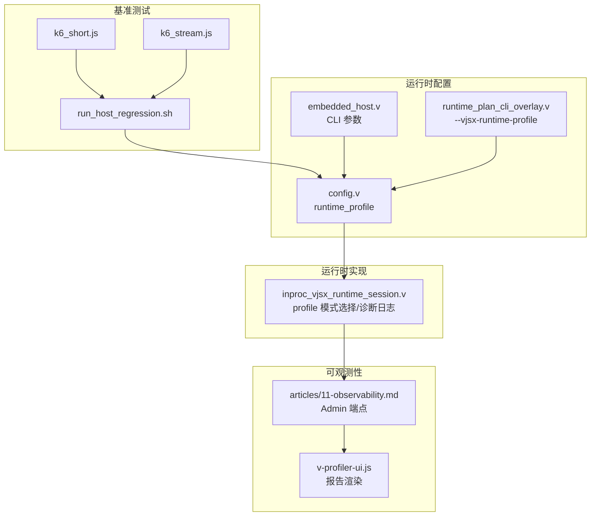
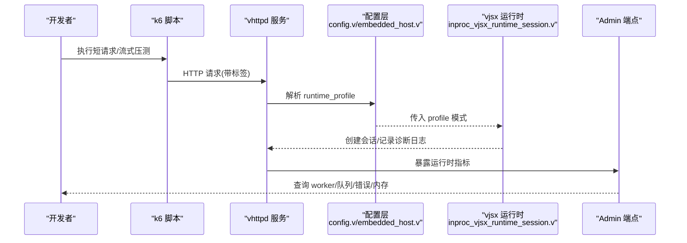
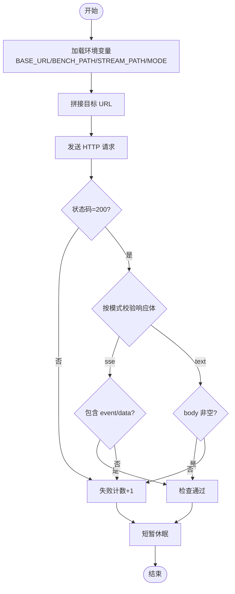
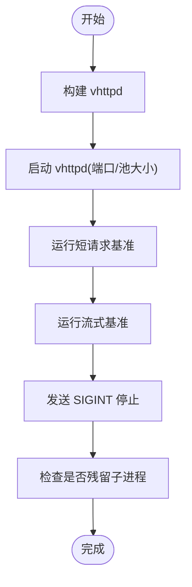
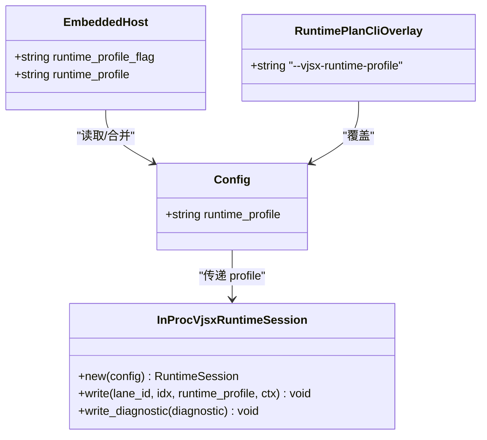
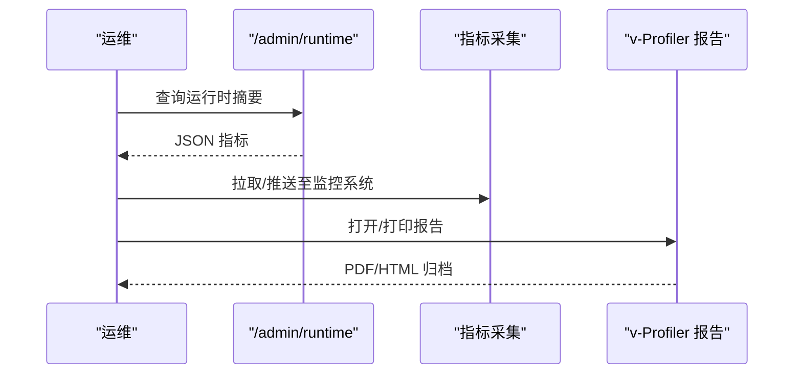
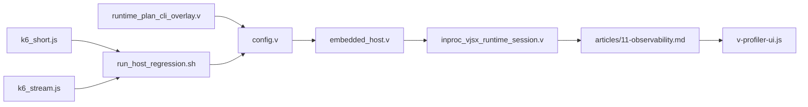

# 性能分析工具

<cite>
**本文引用的文件**   
- [bench/README.md](file://bench/README.md)
- [bench/k6_short.js](file://bench/k6_short.js)
- [bench/k6_stream.js](file://bench/k6_stream.js)
- [bench/run_host_regression.sh](file://bench/run_host_regression.sh)
- [tools/profile_codexbot_tests.sh](file://tools/profile_codexbot_tests.sh)
- [src/config/config.v](file://src/config/config.v)
- [src/config/embedded_host.v](file://src/config/embedded_host.v)
- [src/config/runtime_plan_cli_overlay.v](file://src/config/runtime_plan_cli_overlay.v)
- [src/executor/inproc_vjsx_runtime_session.v](file://src/executor/inproc_vjsx_runtime_session.v)
- [articles/11-observability.md](file://articles/11-observability.md)
- [php/package/wordpress/v-profiler/v-profiler-ui.js](file://php/package/wordpress/v-profiler/v-profiler-ui.js)
</cite>

## 目录
1. [简介](#简介)
2. [项目结构](#项目结构)
3. [核心组件](#核心组件)
4. [架构总览](#架构总览)
5. [详细组件分析](#详细组件分析)
6. [依赖关系分析](#依赖关系分析)
7. [性能考量](#性能考量)
8. [故障排查指南](#故障排查指南)
9. [结论](#结论)
10. [附录](#附录)

## 简介
本文件面向 vhttpd 的性能分析与优化，系统性介绍：
- 内置性能分析能力与使用方式（vjsx 运行时 profile、诊断日志）
- 外部工具集成（k6 基准测试、系统级 profiling 思路）
- 基准测试的编写与执行方法（短请求与流式场景）
- 性能瓶颈定位与优化的实战路径
- 可观测性指标在定位问题中的作用

## 项目结构
与性能分析直接相关的目录与文件：
- bench：k6 压测脚本与回归脚本，覆盖短请求与 SSE/text 流式场景
- tools：用于对特定测试集进行耗时统计的工具脚本
- src/config：配置项中包含 runtime_profile 字段，控制 vjsx 运行时的 profile 模式
- src/executor：vjsx 运行时会话创建与诊断日志输出
- articles：Admin Plane 监控端点说明，便于观察运行时状态
- php/package/wordpress/v-profiler：WordPress 插件侧 UI 渲染逻辑（报告展示）

图表来源
- [bench/k6_short.js:1-44](file://bench/k6_short.js#L1-L44)
- [bench/k6_stream.js:1-52](file://bench/k6_stream.js#L1-L52)
- [bench/run_host_regression.sh:1-158](file://bench/run_host_regression.sh#L1-L158)
- [src/config/config.v:70-104](file://src/config/config.v#L70-L104)
- [src/config/embedded_host.v:59-77](file://src/config/embedded_host.v#L59-L77)
- [src/config/runtime_plan_cli_overlay.v:199-216](file://src/config/runtime_plan_cli_overlay.v#L199-L216)
- [src/executor/inproc_vjsx_runtime_session.v:11-74](file://src/executor/inproc_vjsx_runtime_session.v#L11-L74)
- [articles/11-observability.md:1-75](file://articles/11-observability.md#L1-L75)
- [php/package/wordpress/v-profiler/v-profiler-ui.js:2224-2402](file://php/package/wordpress/v-profiler/v-profiler-ui.js#L2224-L2402)

章节来源
- [bench/README.md:1-158](file://bench/README.md#L1-L158)
- [bench/k6_short.js:1-44](file://bench/k6_short.js#L1-L44)
- [bench/k6_stream.js:1-52](file://bench/k6_stream.js#L1-L52)
- [bench/run_host_regression.sh:1-158](file://bench/run_host_regression.sh#L1-L158)
- [src/config/config.v:70-104](file://src/config/config.v#L70-L104)
- [src/config/embedded_host.v:59-77](file://src/config/embedded_host.v#L59-L77)
- [src/config/runtime_plan_cli_overlay.v:199-216](file://src/config/runtime_plan_cli_overlay.v#L199-L216)
- [src/executor/inproc_vjsx_runtime_session.v:11-74](file://src/executor/inproc_vjsx_runtime_session.v#L11-L74)
- [articles/11-observability.md:1-75](file://articles/11-observability.md#L1-L75)
- [php/package/wordpress/v-profiler/v-profiler-ui.js:2224-2402](file://php/package/wordpress/v-profiler/v-profiler-ui.js#L2224-L2402)

## 核心组件
- k6 基准测试套件
  - 短请求基准：定义 ramping-vus 场景、阈值（失败率、延迟分位）、检查项
  - 流式基准：支持 sse 与 text 两种模式，验证响应体包含事件或数据片段
  - 统一环境变量约定：VHTTPD_* 前缀，兼容旧名
- 主机回归脚本
  - 一键构建、启动、压测、清理进程，并校验无残留子进程
- vjsx 运行时 profile 配置
  - 通过 TOML 与 CLI 注入 runtime_profile，影响运行时会话创建与诊断日志
- Admin 可观测性
  - /admin/runtime 等端点暴露 worker 池、队列长度、错误计数、内存等关键指标
- WordPress v-Profiler UI
  - 生成“性能评估报告”页面，自动打印，便于归档对比

章节来源
- [bench/k6_short.js:1-44](file://bench/k6_short.js#L1-L44)
- [bench/k6_stream.js:1-52](file://bench/k6_stream.js#L1-L52)
- [bench/README.md:1-158](file://bench/README.md#L1-L158)
- [bench/run_host_regression.sh:1-158](file://bench/run_host_regression.sh#L1-L158)
- [src/config/config.v:70-104](file://src/config/config.v#L70-L104)
- [src/config/embedded_host.v:59-77](file://src/config/embedded_host.v#L59-L77)
- [src/config/runtime_plan_cli_overlay.v:199-216](file://src/config/runtime_plan_cli_overlay.v#L199-L216)
- [src/executor/inproc_vjsx_runtime_session.v:11-74](file://src/executor/inproc_vjsx_runtime_session.v#L11-L74)
- [articles/11-observability.md:1-75](file://articles/11-observability.md#L1-L75)
- [php/package/wordpress/v-profiler/v-profiler-ui.js:2224-2402](file://php/package/wordpress/v-profiler/v-profiler-ui.js#L2224-L2402)

## 架构总览
下图展示了从压测到运行时 profile 与可观测性的端到端链路。

图表来源
- [bench/k6_short.js:1-44](file://bench/k6_short.js#L1-L44)
- [bench/k6_stream.js:1-52](file://bench/k6_stream.js#L1-L52)
- [src/config/config.v:70-104](file://src/config/config.v#L70-L104)
- [src/config/embedded_host.v:59-77](file://src/config/embedded_host.v#L59-L77)
- [src/executor/inproc_vjsx_runtime_session.v:11-74](file://src/executor/inproc_vjsx_runtime_session.v#L11-L74)
- [articles/11-observability.md:1-75](file://articles/11-observability.md#L1-L75)

## 详细组件分析

### 组件A：k6 基准测试套件
- 短请求基准
  - 场景：ramping-vus，逐步加压后回落
  - 阈值：失败率、P95/P99 延迟、检查通过率
  - 标签：endpoint、profile，便于聚合分析
- 流式基准
  - 模式：sse 与 text
  - 断言：状态码 200、响应体包含事件或数据片段
  - 超时：较长超时以容纳长连接
- 变量约定
  - 统一使用 VHTTPD_* 前缀，兼容旧名

图表来源
- [bench/k6_short.js:1-44](file://bench/k6_short.js#L1-L44)
- [bench/k6_stream.js:1-52](file://bench/k6_stream.js#L1-L52)

章节来源
- [bench/k6_short.js:1-44](file://bench/k6_short.js#L1-L44)
- [bench/k6_stream.js:1-52](file://bench/k6_stream.js#L1-L52)
- [bench/README.md:1-158](file://bench/README.md#L1-L158)

### 组件B：主机回归脚本
- 功能
  - 构建 vhttpd
  - 启动服务（可配置端口、worker 池大小）
  - 执行短请求与流式 k6 压测
  - 发送 SIGINT 优雅停止
  - 校验无遗留 php-worker 进程
- 用法
  - 支持 RUN_K6=0 跳过压测仅验证生命周期
  - 支持 VHTTPD_* 统一命名

图表来源
- [bench/run_host_regression.sh:1-158](file://bench/run_host_regression.sh#L1-L158)

章节来源
- [bench/run_host_regression.sh:1-158](file://bench/run_host_regression.sh#L1-L158)

### 组件C：vjsx 运行时 profile 配置与诊断
- 配置入口
  - TOML：vjsx.runtime_profile、plugins.*.runtime_profile
  - CLI：--vjsx-runtime-profile
  - 嵌入式 Host：默认值与空值回退为 script
- 运行时行为
  - 根据 runtime_profile 选择不同会话创建路径
  - 写入诊断日志：包含 lane、idx、configured/inferred/expected、缺失模块列表、已加载模块列表
- 典型用途
  - 确认实际加载的运行时类型是否符合预期
  - 快速发现模块缺失或不匹配导致的性能退化

图表来源
- [src/config/config.v:70-104](file://src/config/config.v#L70-L104)
- [src/config/embedded_host.v:59-77](file://src/config/embedded_host.v#L59-L77)
- [src/config/runtime_plan_cli_overlay.v:199-216](file://src/config/runtime_plan_cli_overlay.v#L199-L216)
- [src/executor/inproc_vjsx_runtime_session.v:11-74](file://src/executor/inproc_vjsx_runtime_session.v#L11-L74)

章节来源
- [src/config/config.v:70-104](file://src/config/config.v#L70-L104)
- [src/config/embedded_host.v:59-77](file://src/config/embedded_host.v#L59-L77)
- [src/config/runtime_plan_cli_overlay.v:199-216](file://src/config/runtime_plan_cli_overlay.v#L199-L216)
- [src/executor/inproc_vjsx_runtime_session.v:11-74](file://src/executor/inproc_vjsx_runtime_session.v#L11-L74)

### 组件D：可观测性与报告
- Admin 端点
  - /admin/runtime 返回 worker 池、队列、错误计数、活跃上游、MCP 会话、内存等
  - 建议接入 Prometheus/Grafana 做长期趋势分析
- WordPress v-Profiler UI
  - 自动生成“性能评估报告”，包含时间、目标页、对比数据，支持打印导出

图表来源
- [articles/11-observability.md:1-75](file://articles/11-observability.md#L1-L75)
- [php/package/wordpress/v-profiler/v-profiler-ui.js:2224-2402](file://php/package/wordpress/v-profiler/v-profiler-ui.js#L2224-L2402)

章节来源
- [articles/11-observability.md:1-75](file://articles/11-observability.md#L1-L75)
- [php/package/wordpress/v-profiler/v-profiler-ui.js:2224-2402](file://php/package/wordpress/v-profiler/v-profiler-ui.js#L2224-L2402)

### 组件E：测试集耗时统计
- 工具脚本
  - 遍历指定测试文件集合，逐个执行并收集 real 时间
  - 输出排序后的耗时与结果，便于识别慢用例
- 适用场景
  - 回归阶段快速定位退化用例
  - 结合 CI 形成基线对比

章节来源
- [tools/profile_codexbot_tests.sh:1-40](file://tools/profile_codexbot_tests.sh#L1-L40)

## 依赖关系分析
- 配置到运行时
  - config.v 提供 runtime_profile 字段
  - embedded_host.v 提供 CLI 参数与默认值
  - runtime_plan_cli_overlay.v 提供 --vjsx-runtime-profile 覆盖
  - inproc_vjsx_runtime_session.v 依据 profile 创建会话并输出诊断日志
- 压测到服务
  - k6 脚本通过环境变量驱动目标地址与路径
  - run_host_regression.sh 串联构建、启动、压测、清理
- 可观测性
  - Admin 端点暴露运行时指标
  - v-Profiler UI 负责报告渲染与打印

图表来源
- [src/config/config.v:70-104](file://src/config/config.v#L70-L104)
- [src/config/embedded_host.v:59-77](file://src/config/embedded_host.v#L59-L77)
- [src/config/runtime_plan_cli_overlay.v:199-216](file://src/config/runtime_plan_cli_overlay.v#L199-L216)
- [src/executor/inproc_vjsx_runtime_session.v:11-74](file://src/executor/inproc_vjsx_runtime_session.v#L11-L74)
- [bench/k6_short.js:1-44](file://bench/k6_short.js#L1-L44)
- [bench/k6_stream.js:1-52](file://bench/k6_stream.js#L1-L52)
- [bench/run_host_regression.sh:1-158](file://bench/run_host_regression.sh#L1-L158)
- [articles/11-observability.md:1-75](file://articles/11-observability.md#L1-L75)
- [php/package/wordpress/v-profiler/v-profiler-ui.js:2224-2402](file://php/package/wordpress/v-profiler/v-profiler-ui.js#L2224-L2402)

## 性能考量
- 压测设计
  - 短请求关注吞吐与时延分位；流式关注传输开销与可扩展性
  - 使用分组矩阵（固定 tokens 变间隔、固定间隔变 tokens）隔离不同维度
- 运行时 profile
  - 通过 runtime_profile 确保加载正确的运行时类型，避免不必要的模块加载
  - 利用诊断日志中的 missing 列表快速定位缺失模块
- 可观测性
  - 关注 worker_available、worker_queue_length、http_requests_error、memory_mb 等指标
  - 将指标接入监控系统，建立告警阈值与趋势看板
- 回归与基线
  - 使用主机回归脚本作为门禁，防止性能退化进入主干
  - 定期保存基线结果，纳入文档或制品库

[本节为通用指导，不直接分析具体文件]

## 故障排查指南
- 常见症状与定位
  - 高失败率/高 P95：检查 k6 阈值与后端错误计数（Admin 端点）
  - 流式无数据：确认 STREAM_MODE 与路径参数一致，检查服务端流式处理
  - 运行时异常：查看 vjsx 诊断日志，核对 configured/inferred/expected 与 missing 列表
- 快速步骤
  - 使用 run_host_regression.sh 复现环境并跑通回归
  - 调整 VHTTPD_WORKER_POOL_SIZE 观察队列长度变化
  - 切换 runtime_profile 对比差异，结合诊断日志定位模块加载问题
  - 导出 v-Profiler 报告，归档对比

章节来源
- [bench/run_host_regression.sh:1-158](file://bench/run_host_regression.sh#L1-L158)
- [articles/11-observability.md:1-75](file://articles/11-observability.md#L1-L75)
- [src/executor/inproc_vjsx_runtime_session.v:11-74](file://src/executor/inproc_vjsx_runtime_session.v#L11-L74)

## 结论
- vhttpd 提供了从压测、运行时 profile 到可观测性的完整性能分析闭环
- 通过统一的变量约定与回归脚本，可稳定复现实验环境与基线
- 借助 Admin 端点与 v-Profiler 报告，既能宏观把握整体健康度，也能微观定位具体问题
- 建议在 CI 中常态化运行回归与基线对比，持续保障性能质量

[本节为总结性内容，不直接分析具体文件]

## 附录
- 常用命令与环境变量
  - 短请求基准：参考 k6_short.js 与 README 中的示例
  - 流式基准：参考 k6_stream.js 与 README 中的示例
  - 主机回归：参考 run_host_regression.sh 与 README 中的示例
  - 变量前缀：VHTTPD_BASE_URL、VHTTPD_BENCH_PATH、VHTTPD_STREAM_PATH、VHTTPD_STREAM_MODE、VHTTPD_WORKER_POOL_SIZE、VHTTPD_BENCH_RUN_K6、VHTTPD_HOST、VHTTPD_PORT
- 运行时 profile 开关
  - TOML：vjsx.runtime_profile、plugins.*.runtime_profile
  - CLI：--vjsx-runtime-profile
  - 默认值：script（空值时回退）

章节来源
- [bench/README.md:1-158](file://bench/README.md#L1-L158)
- [bench/k6_short.js:1-44](file://bench/k6_short.js#L1-L44)
- [bench/k6_stream.js:1-52](file://bench/k6_stream.js#L1-L52)
- [bench/run_host_regression.sh:1-158](file://bench/run_host_regression.sh#L1-L158)
- [src/config/config.v:70-104](file://src/config/config.v#L70-L104)
- [src/config/embedded_host.v:59-77](file://src/config/embedded_host.v#L59-L77)
- [src/config/runtime_plan_cli_overlay.v:199-216](file://src/config/runtime_plan_cli_overlay.v#L199-L216)