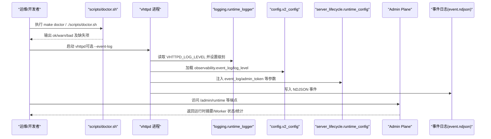
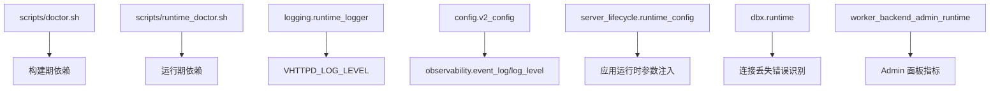
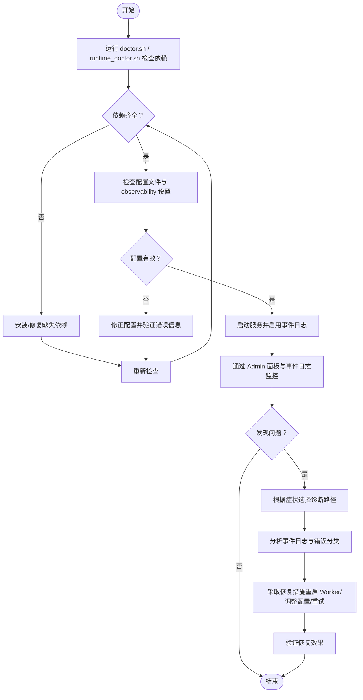

# 故障排除指南

<cite>
**本文引用的文件列表**
- [scripts/doctor.sh](file://scripts/doctor.sh)
- [scripts/runtime_doctor.sh](file://scripts/runtime_doctor.sh)
- [src/logging/runtime_logger.v](file://src/logging/runtime_logger.v)
- [src/config/v2_config.v](file://src/config/v2_config.v)
- [src/dbx/runtime.v](file://src/dbx/runtime.v)
- [src/server_lifecycle/runtime_config.v](file://src/server_lifecycle/runtime_config.v)
- [src/worker_backend_admin_runtime.v](file://src/worker_backend_admin_runtime.v)
- [examples/run_demo.sh](file://examples/run_demo.sh)
- [tests/e2e/config_acceptance_test.sh](file://tests/e2e/config_acceptance_test.sh)
- [Makefile](file://Makefile)
- [articles/11-observability.md](file://articles/11-observability.md)
</cite>

## 目录
1. [简介](#简介)
2. [项目结构](#项目结构)
3. [核心组件](#核心组件)
4. [架构总览](#架构总览)
5. [详细组件分析](#详细组件分析)
6. [依赖关系分析](#依赖关系分析)
7. [性能注意事项](#性能注意事项)
8. [故障排除流程](#故障排除流程)
9. [常见问题与解决方案](#常见问题与解决方案)
10. [日志分析方法](#日志分析方法)
11. [生产环境恢复与应急处理](#生产环境恢复与应急处理)
12. [问题报告模板与调试信息清单](#问题报告模板与调试信息清单)
13. [结论](#结论)

## 简介
本指南面向 vhttpd 的生产运维与研发人员，提供系统化的故障排除流程、常见问题诊断方法、日志分析与定位技巧，以及生产环境的恢复与应急处理步骤。文档同时给出环境检查工具 doctor.sh 的详细使用说明，并附带问题报告模板与调试信息收集清单，帮助快速定位和解决问题。

## 项目结构
围绕故障排除相关的关键脚本与源码模块如下：
- 环境与运行期健康检查脚本：scripts/doctor.sh、scripts/runtime_doctor.sh
- 运行时日志级别配置：src/logging/runtime_logger.v
- 运行时配置模型（V2）：src/config/v2_config.v
- 数据库连接错误分类与观测：src/dbx/runtime.v
- 服务器生命周期与可观测性参数注入：src/server_lifecycle/runtime_config.v
- Worker 管理平面指标采集：src/worker_backend_admin_runtime.v
- 示例启动与事件日志输出：examples/run_demo.sh
- E2E 配置验收测试（含失败断言与日志抓取）：tests/e2e/config_acceptance_test.sh
- 构建与命令入口（包含 doctor 目标）：Makefile
- 可观测性与 Admin Plane 使用文档：articles/11-observability.md

```mermaid
graph TB
A["scripts/doctor.sh"] --> B["构建与运行期依赖检查"]
C["scripts/runtime_doctor.sh"] --> D["运行期依赖与环境检查"]
E["src/logging/runtime_logger.v"] --> F["日志级别解析与生效"]
G["src/config/v2_config.v"] --> H["V2 配置模型<br/>observability.event_log/log_level"]
I["src/server_lifecycle/runtime_config.v"] --> J["Admin/EventLog 等参数注入"]
K["src/worker_backend_admin_runtime.v"] --> L["Worker 状态与内存指标"]
M["src/dbx/runtime.v"] --> N["数据库连接丢失错误识别"]
O["examples/run_demo.sh"] --> P["事件日志输出路径"]
Q["tests/e2e/config_acceptance_test.sh"] --> R["配置失败断言与日志抓取"]
S["Makefile"] --> T["make doctor 入口"]
U["articles/11-observability.md"] --> V["Admin 端点与事件日志用法"]
```

图表来源
- [scripts/doctor.sh:1-108](file://scripts/doctor.sh#L1-L108)
- [scripts/runtime_doctor.sh:89-125](file://scripts/runtime_doctor.sh#L89-L125)
- [src/logging/runtime_logger.v:1-42](file://src/logging/runtime_logger.v#L1-L42)
- [src/config/v2_config.v:59-72](file://src/config/v2_config.v#L59-L72)
- [src/server_lifecycle/runtime_config.v:146-171](file://src/server_lifecycle/runtime_config.v#L146-L171)
- [src/worker_backend_admin_runtime.v:1-40](file://src/worker_backend_admin_runtime.v#L1-L40)
- [src/dbx/runtime.v:179-235](file://src/dbx/runtime.v#L179-L235)
- [examples/run_demo.sh:158-174](file://examples/run_demo.sh#L158-L174)
- [tests/e2e/config_acceptance_test.sh:52-97](file://tests/e2e/config_acceptance_test.sh#L52-L97)
- [Makefile:121-123](file://Makefile#L121-L123)
- [articles/11-observability.md:1-75](file://articles/11-observability.md#L1-L75)

章节来源
- [scripts/doctor.sh:1-108](file://scripts/doctor.sh#L1-L108)
- [scripts/runtime_doctor.sh:89-125](file://scripts/runtime_doctor.sh#L89-L125)
- [src/logging/runtime_logger.v:1-42](file://src/logging/runtime_logger.v#L1-L42)
- [src/config/v2_config.v:59-72](file://src/config/v2_config.v#L59-L72)
- [src/server_lifecycle/runtime_config.v:146-171](file://src/server_lifecycle/runtime_config.v#L146-L171)
- [src/worker_backend_admin_runtime.v:1-40](file://src/worker_backend_admin_runtime.v#L1-L40)
- [src/dbx/runtime.v:179-235](file://src/dbx/runtime.v#L179-L235)
- [examples/run_demo.sh:158-174](file://examples/run_demo.sh#L158-L174)
- [tests/e2e/config_acceptance_test.sh:52-97](file://tests/e2e/config_acceptance_test.sh#L52-L97)
- [Makefile:121-123](file://Makefile#L121-L123)
- [articles/11-observability.md:1-75](file://articles/11-observability.md#L1-L75)

## 核心组件
- 环境检查工具
  - scripts/doctor.sh：检查构建期依赖（v、pkg-config、openssl、bdw-gc）、vjsx 模块路径、QuickJS 源、sqlite3、mysql_config/mariadb_config、pg_config 等，并输出 ok/warn/bad 状态码。
  - scripts/runtime_doctor.sh：检查运行期依赖（sqlite3、mysql_config/mariadb_config、pg_config），以及 vjsx 资源嵌入情况与兼容性符号链接提示。
- 日志与可观测性
  - src/logging/runtime_logger.v：支持通过环境变量 VHTTPD_LOG_LEVEL 设置日志级别，默认 prod 为 warn，开发为 info。
  - src/config/v2_config.v：定义 observability.event_log 与 log_level 字段，用于事件日志与日志级别配置。
  - articles/11-observability.md：Admin Plane 监控端点、事件日志格式与分析命令、Prometheus 集成建议等。
- 运行时配置与注入
  - src/server_lifecycle/runtime_config.v：将 event_log、admin_token、队列与超时等参数注入到应用运行时构建配置中。
- 数据库连接错误识别
  - src/dbx/runtime.v：is_connection_lost_error 函数识别常见“连接丢失”错误消息，便于上层进行重试或降级处理。
- Worker 管理平面指标
  - src/worker_backend_admin_runtime.v：暴露 worker 存活、RSS 内存、请求计数、重启次数等指标，供 admin 面板聚合展示。
- 示例与测试
  - examples/run_demo.sh：演示如何以 --event-log 输出事件日志，便于观察与排障。
  - tests/e2e/config_acceptance_test.sh：在配置失败场景下捕获退出码与日志片段，辅助验证错误信息是否清晰。

章节来源
- [scripts/doctor.sh:1-108](file://scripts/doctor.sh#L1-L108)
- [scripts/runtime_doctor.sh:89-125](file://scripts/runtime_doctor.sh#L89-L125)
- [src/logging/runtime_logger.v:1-42](file://src/logging/runtime_logger.v#L1-L42)
- [src/config/v2_config.v:59-72](file://src/config/v2_config.v#L59-L72)
- [src/server_lifecycle/runtime_config.v:146-171](file://src/server_lifecycle/runtime_config.v#L146-L171)
- [src/dbx/runtime.v:179-235](file://src/dbx/runtime.v#L179-L235)
- [src/worker_backend_admin_runtime.v:1-40](file://src/worker_backend_admin_runtime.v#L1-L40)
- [examples/run_demo.sh:158-174](file://examples/run_demo.sh#L158-L174)
- [tests/e2e/config_acceptance_test.sh:52-97](file://tests/e2e/config_acceptance_test.sh#L52-L97)
- [articles/11-observability.md:1-75](file://articles/11-observability.md#L1-L75)

## 架构总览
下图展示了从启动到可观测性输出的关键路径，包括环境检查、配置加载、事件日志写入与 Admin 面板访问。

图表来源
- [scripts/doctor.sh:1-108](file://scripts/doctor.sh#L1-L108)
- [src/logging/runtime_logger.v:1-42](file://src/logging/runtime_logger.v#L1-L42)
- [src/config/v2_config.v:59-72](file://src/config/v2_config.v#L59-L72)
- [src/server_lifecycle/runtime_config.v:146-171](file://src/server_lifecycle/runtime_config.v#L146-L171)
- [examples/run_demo.sh:158-174](file://examples/run_demo.sh#L158-L174)
- [articles/11-observability.md:1-75](file://articles/11-observability.md#L1-L75)

## 详细组件分析

### 环境检查工具 doctor.sh 使用说明
- 功能概述
  - 检查构建期依赖：v、pkg-config、openssl、bdw-gc
  - 检查 vjsx 模块路径与 QuickJS 源
  - 检查 sqlite3、mysql_config/mariadb_config、pg_config
  - 输出 ok/warn/bad 三类状态，并在存在缺失时返回非零退出码
- 使用方法
  - 直接执行：./scripts/doctor.sh
  - 通过 Makefile：make doctor
- 典型输出解读
  - ok：依赖可用
  - warn：可选依赖缺失（如 sqlite3、数据库客户端工具）
  - bad：必需依赖缺失（如 v、pkg-config、openssl、bdw-gc）
- 修复建议
  - 安装缺失的包管理器与库（参考 warn/bad 提示）
  - 若需启用数据库特性，安装对应 client 工具（mysql_config/mariadb_config/pg_config）
  - 如需内嵌 vjsx 运行时，确保 vjsx 模块路径与 QuickJS 源可用

章节来源
- [scripts/doctor.sh:1-108](file://scripts/doctor.sh#L1-L108)
- [Makefile:121-123](file://Makefile#L121-L123)

### 运行期检查工具 runtime_doctor.sh 使用说明
- 功能概述
  - 检查运行期依赖：sqlite3、mysql_config/mariadb_config、pg_config
  - 检查 vjsx 资源是否已嵌入（无需外部符号链接）
- 使用方法
  - 直接执行：./scripts/runtime_doctor.sh
- 典型输出解读
  - ok：运行期依赖就绪
  - warn：部分依赖缺失（可能影响特定工作流）
- 修复建议
  - 安装缺少的数据库客户端工具
  - 确认 vjsx 资源已正确嵌入，避免遗留符号链接

章节来源
- [scripts/runtime_doctor.sh:89-125](file://scripts/runtime_doctor.sh#L89-L125)

### 日志级别与事件日志
- 日志级别控制
  - 通过环境变量 VHTTPD_LOG_LEVEL 设置全局日志级别（debug/info/warn/error/fatal）
  - 默认行为：prod 模式 warn，开发模式 info
- 事件日志配置
  - 在 V2 配置中设置 observability.event_log 指定事件日志路径
  - 示例启动脚本支持 --event-log 参数输出事件日志
- 事件日志格式
  - NDJSON 单行 JSON，包含 ts、kind、path、status、duration_ms 等字段
  - 常用 kind：http.request、worker.request、upstream.connect、error 等
- 日志分析建议
  - 使用 jq 过滤与聚合，按 kind、path、duration_ms 筛选异常与慢请求
  - 结合 trace_id 追踪跨模块调用链

章节来源
- [src/logging/runtime_logger.v:1-42](file://src/logging/runtime_logger.v#L1-L42)
- [src/config/v2_config.v:59-72](file://src/config/v2_config.v#L59-L72)
- [examples/run_demo.sh:158-174](file://examples/run_demo.sh#L158-L174)
- [articles/11-observability.md:313-371](file://articles/11-observability.md#L313-L371)

### 配置模型与校验
- V2 配置模型
  - server、listeners、control、observability、resources、engines、adapters、transforms、policies、providers、pipelines、relays 等
  - observability.event_log/log_level 用于事件日志与日志级别
- 配置注入
  - server_lifecycle.runtime_config 将 event_log、admin_token、队列容量与超时等参数注入到应用运行时构建配置
- 配置错误诊断
  - E2E 测试在配置失败时捕获退出码与日志片段，验证错误信息是否清晰可读

章节来源
- [src/config/v2_config.v:1-318](file://src/config/v2_config.v#L1-L318)
- [src/server_lifecycle/runtime_config.v:146-171](file://src/server_lifecycle/runtime_config.v#L146-L171)
- [tests/e2e/config_acceptance_test.sh:52-97](file://tests/e2e/config_acceptance_test.sh#L52-L97)

### 数据库连接错误识别与处理
- 连接丢失错误识别
  - is_connection_lost_error 匹配常见 MySQL/MariaDB/PostgreSQL 连接丢失错误消息
- 观测与记录
  - note_query_observation 记录查询成功/失败、慢查询、最近查询快照等
- 处理建议
  - 对连接丢失错误进行重试或切换备用连接
  - 结合事件日志与 Admin 面板统计，观察失败率与慢查询趋势

章节来源
- [src/dbx/runtime.v:179-235](file://src/dbx/runtime.v#L179-L235)

### Worker 管理与指标
- Worker 状态
  - 暴露 worker id、pid、alive、rss_kb、draining、inflight_requests、served_requests、restart_count、next_retry_ts 等
- 内存指标
  - 通过 ps -o rss= 获取进程 RSS（KB），用于内存泄漏与增长排查
- 操作建议
  - 通过 Admin 面板查看 worker 状态与重启次数
  - 针对频繁重启的 worker，结合事件日志与错误分类定位根因

章节来源
- [src/worker_backend_admin_runtime.v:1-40](file://src/worker_backend_admin_runtime.v#L1-L40)
- [articles/11-observability.md:77-109](file://articles/11-observability.md#L77-L109)

## 依赖关系分析
- 构建期依赖
  - v、pkg-config、openssl、bdw-gc、sqlite3、mysql_config/mariadb_config、pg_config
- 运行期依赖
  - sqlite3、mysql_config/mariadb_config、pg_config（视功能启用情况）
- 内部依赖
  - logging.runtime_logger 受 VHTTPD_LOG_LEVEL 控制
  - config.v2_config 与 server_lifecycle.runtime_config 共同决定 observability 行为
  - dbx.runtime 提供连接错误识别与观测数据
  - worker_backend_admin_runtime 提供 worker 指标给 Admin 面板

图表来源
- [scripts/doctor.sh:1-108](file://scripts/doctor.sh#L1-L108)
- [scripts/runtime_doctor.sh:89-125](file://scripts/runtime_doctor.sh#L89-L125)
- [src/logging/runtime_logger.v:1-42](file://src/logging/runtime_logger.v#L1-L42)
- [src/config/v2_config.v:59-72](file://src/config/v2_config.v#L59-L72)
- [src/server_lifecycle/runtime_config.v:146-171](file://src/server_lifecycle/runtime_config.v#L146-L171)
- [src/dbx/runtime.v:179-235](file://src/dbx/runtime.v#L179-L235)
- [src/worker_backend_admin_runtime.v:1-40](file://src/worker_backend_admin_runtime.v#L1-L40)

章节来源
- [scripts/doctor.sh:1-108](file://scripts/doctor.sh#L1-L108)
- [scripts/runtime_doctor.sh:89-125](file://scripts/runtime_doctor.sh#L89-L125)
- [src/logging/runtime_logger.v:1-42](file://src/logging/runtime_logger.v#L1-L42)
- [src/config/v2_config.v:59-72](file://src/config/v2_config.v#L59-L72)
- [src/server_lifecycle/runtime_config.v:146-171](file://src/server_lifecycle/runtime_config.v#L146-L171)
- [src/dbx/runtime.v:179-235](file://src/dbx/runtime.v#L179-L235)
- [src/worker_backend_admin_runtime.v:1-40](file://src/worker_backend_admin_runtime.v#L1-L40)

## 性能注意事项
- 关注 Worker 队列长度与拒绝数：当 worker_available 接近 0 且 queue_length 持续增长时，考虑扩容或优化业务逻辑。
- 慢查询与上游延迟：结合事件日志中的 duration_ms 与 dbx 的慢查询统计，定位瓶颈。
- 内存增长：通过 Admin 面板的 worker RSS 指标与事件日志中的 worker.error 关联分析，排查内存泄漏。
- 上游连接稳定性：监控 upstream.connect/upstream.close 事件频率，结合网络与认证配置排查。

[本节为通用指导，不直接分析具体文件]

## 故障排除流程
以下流程图总结了从发现异常到定位与恢复的标准步骤：

[该图为概念流程，不映射具体源码文件]

## 常见问题与解决方案

### 启动失败
- 症状
  - 进程无法启动或立即退出
  - 端口占用、权限不足、配置语法错误
- 诊断步骤
  - 运行 make doctor 或 ./scripts/doctor.sh 检查构建期依赖
  - 运行 ./scripts/runtime_doctor.sh 检查运行期依赖
  - 检查 observability.event_log 是否存在并可写
  - 使用 E2E 测试中的 expect_vhttpd_config_failure 思路，捕获退出码与最后日志片段
- 解决建议
  - 安装缺失依赖（v、pkg-config、openssl、bdw-gc、sqlite3、数据库客户端工具）
  - 修正配置路径与权限，确保 event_log 目录可写
  - 根据错误信息逐项修复配置项

章节来源
- [scripts/doctor.sh:1-108](file://scripts/doctor.sh#L1-L108)
- [scripts/runtime_doctor.sh:89-125](file://scripts/runtime_doctor.sh#L89-L125)
- [tests/e2e/config_acceptance_test.sh:52-97](file://tests/e2e/config_acceptance_test.sh#L52-L97)

### 配置错误
- 症状
  - 启动时报错，或某些功能未生效
- 诊断步骤
  - 检查 V2 配置模型字段是否正确（observability.event_log/log_level、listeners、engines 等）
  - 通过 server_lifecycle.runtime_config 确认参数注入是否符合预期
  - 使用 E2E 测试用例验证配置失败时的错误信息清晰度
- 解决建议
  - 对照 V2 配置模型逐项核对
  - 确保 event_log 路径有效，log_level 取值合法（debug/info/warn/error/fatal）

章节来源
- [src/config/v2_config.v:1-318](file://src/config/v2_config.v#L1-L318)
- [src/server_lifecycle/runtime_config.v:146-171](file://src/server_lifecycle/runtime_config.v#L146-L171)
- [tests/e2e/config_acceptance_test.sh:52-97](file://tests/e2e/config_acceptance_test.sh#L52-L97)

### 性能问题
- 症状
  - 响应时间升高、CPU/内存占用高、队列积压
- 诊断步骤
  - 通过 Admin 面板查看 worker_available、queue_length、errors 等指标
  - 分析事件日志中的 http.request.duration_ms 与 worker.request.duration_ms
  - 结合 dbx 的慢查询统计与上游连接事件，定位瓶颈
- 解决建议
  - 调整引擎池大小与队列容量
  - 优化慢查询与上游调用
  - 针对内存增长，结合 worker RSS 指标与错误日志定位泄漏点

章节来源
- [src/worker_backend_admin_runtime.v:1-40](file://src/worker_backend_admin_runtime.v#L1-L40)
- [src/dbx/runtime.v:179-235](file://src/dbx/runtime.v#L179-L235)
- [articles/11-observability.md:112-140](file://articles/11-observability.md#L112-L140)

### 网络连接异常
- 症状
  - 上游连接频繁断开、重连、认证失败
- 诊断步骤
  - 查看 upstream.connect/upstream.close 事件与错误分类
  - 检查 Token 有效期与网络连通性
  - 使用 Admin 面板的上游连接状态端点
- 解决建议
  - 修复认证配置与网络策略
  - 增加重试与退避策略（结合错误分类）
  - 监控连接抖动并告警

章节来源
- [src/dbx/runtime.v:179-235](file://src/dbx/runtime.v#L179-L235)
- [articles/11-observability.md:145-170](file://articles/11-observability.md#L145-L170)

## 日志分析方法
- 事件日志格式
  - NDJSON 单行 JSON，包含 ts、kind、path、status、duration_ms 等字段
- 常用分析命令
  - 实时查看：tail -f events.ndjson | jq .
  - 统计错误：select(.kind == "error") | wc -l
  - 分析慢请求：select(.kind == "http.request" and .duration_ms > 100)
  - 分析上游连接：select(.kind | startswith("upstream"))
- 结合 Admin 面板
  - /admin/runtime 获取运行时摘要
  - /admin/workers 查看 Worker 状态与重启次数
  - /admin/stats 查看请求速率与延迟分位
- 日志轮转与归档
  - 配合 logrotate 定期切割与压缩，保留策略建议：实时 7 天、压缩 30 天、统计摘要 90 天

章节来源
- [articles/11-observability.md:313-371](file://articles/11-observability.md#L313-L371)
- [articles/11-observability.md:436-468](file://articles/11-observability.md#L436-L468)

## 生产环境恢复与应急处理
- 快速恢复
  - 重启单个 Worker：POST /admin/workers/restart
  - 重启所有 Worker：POST /admin/workers/restart/all
- 降级策略
  - 关闭非必要功能（如 vjsx 引擎、MCP/WebSocket 分发）
  - 降低并发与队列容量，避免雪崩
- 回滚与热修复
  - 基于版本化配置与灰度发布，逐步替换旧配置
  - 针对 panic 与静默错误，优先消除不可恢复崩溃风险
- 监控与告警
  - 配置 Prometheus 抓取 /admin/metrics（规划中）
  - 设置阈值告警：worker_available < 1、queue_length > 10、http_requests_error > 0

章节来源
- [articles/11-observability.md:375-405](file://articles/11-observability.md#L375-L405)
- [docs/refactor_0601.md:239-252](file://docs/refactor_0601.md#L239-L252)

## 问题报告模板与调试信息清单
- 问题报告模板
  - 标题：简述问题现象
  - 环境信息：操作系统、vhttpd 版本、依赖版本（v、openssl、bdw-gc、sqlite3、数据库客户端）
  - 配置摘要：observability.event_log、log_level、listeners、engines 关键项
  - 症状描述：错误信息、发生频率、影响范围
  - 复现步骤：最小化配置与操作步骤
  - 期望结果与实际结果
  - 附件：事件日志片段、Admin 面板截图、worker 状态
- 调试信息收集清单
  - 运行 doctor.sh 与 runtime_doctor.sh 的输出
  - 事件日志（events.ndjson）最近 1 小时片段
  - Admin 面板 /admin/runtime、/admin/workers、/admin/stats 的 JSON 输出
  - Worker 重启次数与 RSS 内存变化
  - 上游连接事件与错误分类统计
  - 慢查询与上游延迟分布

[本节为通用模板与清单，不直接分析具体文件]

## 结论
通过系统化的环境检查、配置校验、事件日志分析与 Admin 面板监控，可以高效定位与解决 vhttpd 在生产环境中的各类问题。建议在日常运维中常态化执行 doctor.sh 与 runtime_doctor.sh，结合事件日志与指标告警，建立完善的故障预防与快速恢复机制。

[本节为总结，不直接分析具体文件]