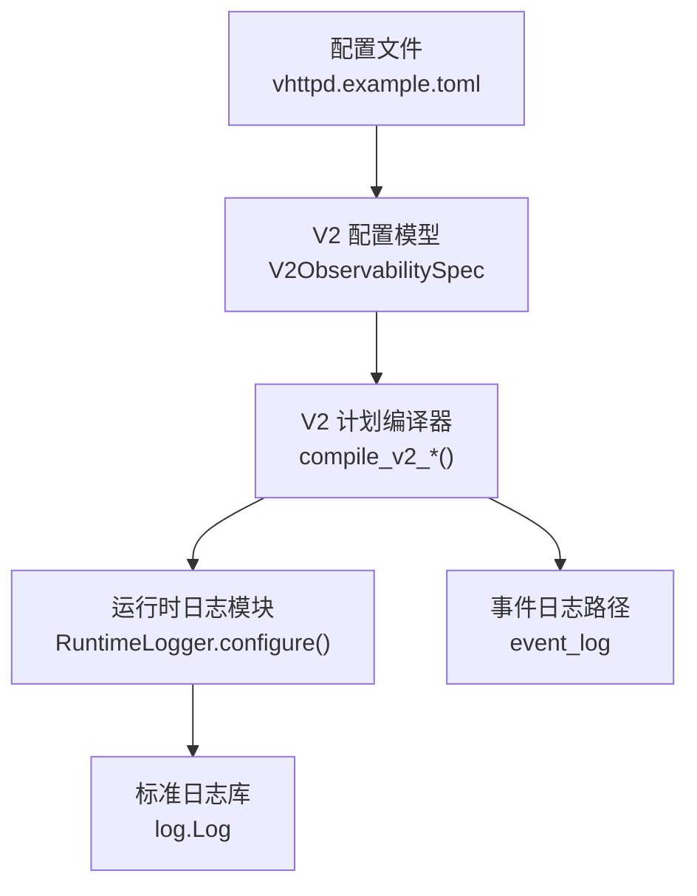
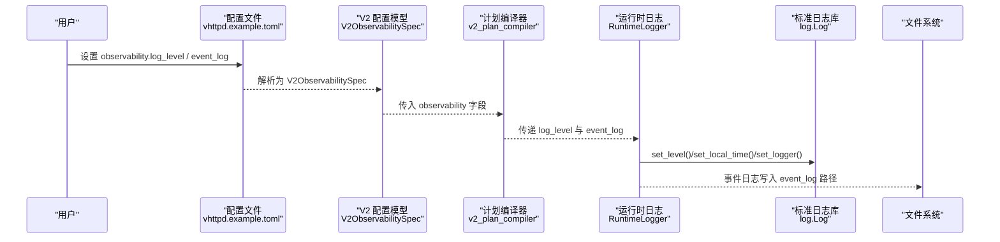
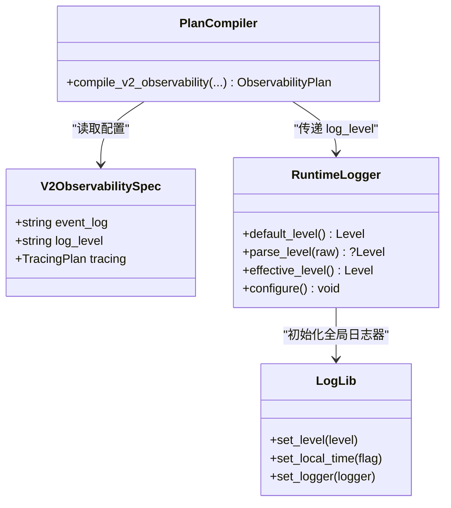

# 日志系统

<cite>
**本文引用的文件**
- [src/logging/runtime_logger.v](file://src/logging/runtime_logger.v)
- [src/config/v2_config.v](file://src/config/v2_config.v)
- [src/config/v2_plan_compiler.v](file://src/config/v2_plan_compiler.v)
- [config/vhttpd.example.toml](file://config/vhttpd.example.toml)
- [articles/11-observability.md](file://articles/11-observability.md)
- [tests/e2e/config_acceptance_test.sh](file://tests/e2e/config_acceptance_test.sh)
- [src/http_stats.v](file://src/http_stats.v)
- [admin/ui/app.js](file://admin/ui/app.js)
</cite>

## 目录
1. [简介](#简介)
2. [项目结构](#项目结构)
3. [核心组件](#核心组件)
4. [架构总览](#架构总览)
5. [详细组件分析](#详细组件分析)
6. [依赖关系分析](#依赖关系分析)
7. [性能考量](#性能考量)
8. [故障排查指南](#故障排查指南)
9. [结论](#结论)
10. [附录](#附录)

## 简介
本章节面向 VHTTPD 的日志系统，系统性说明日志级别配置、结构化输出格式、输出目标（控制台与事件日志文件）、过滤与查询最佳实践，以及性能监控指标采集与自定义日志记录器的扩展方法。文档同时给出架构图与流程图，帮助读者快速理解并落地使用。

## 项目结构
VHTTPD 的日志能力由“运行时日志初始化”和“可观测性计划编译”两部分组成：
- 运行时日志初始化负责解析日志级别、设置全局日志器（默认本地时间）。
- 可观测性计划编译将配置中的 observability 字段映射为运行期计划，包含 event_log 与 log_level 等。

图表来源
- [config/vhttpd.example.toml:1-67](file://config/vhttpd.example.toml#L1-L67)
- [src/config/v2_config.v:59-72](file://src/config/v2_config.v#L59-L72)
- [src/config/v2_plan_compiler.v:180-203](file://src/config/v2_plan_compiler.v#L180-L203)
- [src/logging/runtime_logger.v:36-41](file://src/logging/runtime_logger.v#L36-L41)

章节来源
- [config/vhttpd.example.toml:1-67](file://config/vhttpd.example.toml#L1-L67)
- [src/config/v2_config.v:59-72](file://src/config/v2_config.v#L59-L72)
- [src/config/v2_plan_compiler.v:180-203](file://src/config/v2_plan_compiler.v#L180-L203)
- [src/logging/runtime_logger.v:1-41](file://src/logging/runtime_logger.v#L1-L41)

## 核心组件
- 运行时日志模块
  - 提供默认日志级别（开发/生产不同）、环境变量覆盖、本地时间开关、全局日志器设置。
- 可观测性配置模型
  - 定义 observability.event_log、observability.log_level、tracing 等字段。
- 计划编译器
  - 将 V2 配置中的 observability 映射为运行期计划，供后续子系统消费。

章节来源
- [src/logging/runtime_logger.v:8-41](file://src/logging/runtime_logger.v#L8-L41)
- [src/config/v2_config.v:59-72](file://src/config/v2_config.v#L59-L72)
- [src/config/v2_plan_compiler.v:180-203](file://src/config/v2_plan_compiler.v#L180-L203)

## 架构总览
下图展示从配置到运行时日志器初始化的完整链路，以及事件日志文件的写入位置。

图表来源
- [config/vhttpd.example.toml:1-67](file://config/vhttpd.example.toml#L1-L67)
- [src/config/v2_config.v:59-72](file://src/config/v2_config.v#L59-L72)
- [src/config/v2_plan_compiler.v:180-203](file://src/config/v2_plan_compiler.v#L180-L203)
- [src/logging/runtime_logger.v:36-41](file://src/logging/runtime_logger.v#L36-L41)

## 详细组件分析

### 日志级别与生效策略
- 支持级别：debug、info、warn（含 warning 别名）、error、fatal。
- 优先级：
  - 环境变量 VHTTPD_LOG_LEVEL 优先；
  - 未设置时按构建模式选择默认值（prod 下 warn，否则 info）。
- 建议：
  - 开发环境使用 info/debug；
  - 生产环境使用 warn/error，结合事件日志进行问题定位。

章节来源
- [src/logging/runtime_logger.v:8-34](file://src/logging/runtime_logger.v#L8-L34)

### 结构化日志输出格式
- 当前实现通过标准日志库输出，启用本地时间。
- 未来规划中支持 JSON 结构化输出（NDJSON），可通过环境变量切换，并在 Admin UI 与示例日志中体现 NDJSON 形态。
- 建议在生产环境统一采用结构化格式，便于集中收集与分析。

章节来源
- [src/logging/runtime_logger.v:36-41](file://src/logging/runtime_logger.v#L36-L41)
- [articles/11-observability.md:406-468](file://articles/11-observability.md#L406-L468)
- [.ok/local/logs/server-current.jsonl:269-272](file://.ok/local/logs/server-current.jsonl#L269-L272)

### 日志输出目标
- 控制台：默认输出至标准输出，适合容器化场景直接采集。
- 事件日志文件：通过 observability.event_log 指定路径，以追加方式写入 NDJSON 事件流。
- 远程收集：推荐配合外部日志采集器（如 Filebeat/Fluent Bit）或日志轮转工具（logrotate）进行转发与归档。

章节来源
- [config/vhttpd.example.toml:1-67](file://config/vhttpd.example.toml#L1-L67)
- [src/config/v2_config.v:59-72](file://src/config/v2_config.v#L59-L72)
- [src/config/v2_plan_compiler.v:180-203](file://src/config/v2_plan_compiler.v#L180-L203)
- [articles/11-observability.md:406-468](file://articles/11-observability.md#L406-L468)

### 日志过滤与查询最佳实践
- 基于事件日志的 trace_id 进行跨服务追踪与聚合。
- 在 e2e 测试中验证了事件日志中包含关键业务事件与 trace_id 保留。
- 建议：
  - 为关键请求注入 trace_id；
  - 使用 grep/awk/jq 对 NDJSON 进行字段级过滤；
  - 结合时间窗口与错误级别筛选异常。

章节来源
- [tests/e2e/config_acceptance_test.sh:3203-3245](file://tests/e2e/config_acceptance_test.sh#L3203-L3245)
- [tests/e2e/config_acceptance_test.sh:759-784](file://tests/e2e/config_acceptance_test.sh#L759-L784)
- [tests/e2e/config_acceptance_test.sh:1084-1161](file://tests/e2e/config_acceptance_test.sh#L1084-L1161)

### 性能监控指标采集
- HTTP 统计计数器：requests_total、errors_total、timeouts_total、streams_total、admin_actions_total。
- Admin UI 展示部分指标（如 HTTP 请求数、错误率、运行时长等）。
- 建议：
  - 通过 Admin API 暴露 Prometheus 文本格式指标端点；
  - 在应用层埋点补充业务指标。

章节来源
- [src/http_stats.v:1-31](file://src/http_stats.v#L1-L31)
- [admin/ui/app.js:656-675](file://admin/ui/app.js#L656-L675)
- [articles/11-observability.md:406-468](file://articles/11-observability.md#L406-L468)

### 自定义日志记录器开发指南
- 目标：在不侵入现有代码的前提下，扩展日志输出目标（如远程收集）或格式化策略（如 JSON）。
- 步骤建议：
  - 复用 RuntimeLogger 的级别解析与默认策略；
  - 在 configure 阶段替换底层输出目标（例如对接第三方日志 SDK）；
  - 保持结构化字段稳定（ts、level、module、msg、trace_id 等）。
- 注意事项：
  - 避免在高吞吐路径中进行昂贵序列化；
  - 异步落盘或批量发送以降低延迟；
  - 保证线程安全与优雅关闭。

章节来源
- [src/logging/runtime_logger.v:8-41](file://src/logging/runtime_logger.v#L8-L41)

## 依赖关系分析
- 运行时日志模块依赖标准日志库与环境变量读取。
- 计划编译器依赖 V2 配置模型，并将 observability 字段透传到运行期计划。
- 事件日志路径由配置驱动，最终由运行时写入文件系统。

图表来源
- [src/config/v2_config.v:59-72](file://src/config/v2_config.v#L59-L72)
- [src/config/v2_plan_compiler.v:180-203](file://src/config/v2_plan_compiler.v#L180-L203)
- [src/logging/runtime_logger.v:36-41](file://src/logging/runtime_logger.v#L36-L41)

章节来源
- [src/config/v2_config.v:59-72](file://src/config/v2_config.v#L59-L72)
- [src/config/v2_plan_compiler.v:180-203](file://src/config/v2_plan_compiler.v#L180-L203)
- [src/logging/runtime_logger.v:1-41](file://src/logging/runtime_logger.v#L1-L41)

## 性能考量
- 日志级别控制：生产环境建议使用 warn/error，减少 I/O 压力。
- 结构化输出：NDJSON 单行格式利于高效解析与传输。
- 事件日志路径：合理划分目录与文件名，避免单文件过大。
- 指标采集：尽量使用增量计数器与低开销采样，避免阻塞主流程。

[本节为通用指导，不直接分析具体文件]

## 故障排查指南
- 确认日志级别是否被环境变量覆盖：检查 VHTTPD_LOG_LEVEL。
- 校验 event_log 路径权限与磁盘空间。
- 使用 trace_id 关联请求链路，定位上下游问题。
- 参考 e2e 测试中对事件日志关键字段的断言，确保关键事件已写入。

章节来源
- [src/logging/runtime_logger.v:27-34](file://src/logging/runtime_logger.v#L27-L34)
- [tests/e2e/config_acceptance_test.sh:3203-3245](file://tests/e2e/config_acceptance_test.sh#L3203-L3245)

## 结论
VHTTPD 的日志系统以“配置驱动 + 运行时初始化”为核心，提供灵活的日志级别控制与事件日志输出能力。结合结构化输出与 trace_id，可在复杂分布式环境中实现高效的日志过滤与问题定位。配合外部采集与轮转工具，可满足企业级运维需求。

[本节为总结性内容，不直接分析具体文件]

## 附录

### 配置项速查
- observability.log_level：字符串，支持 debug/info/warn/error/fatal。
- observability.event_log：字符串，事件日志文件路径（NDJSON）。
- observability.tracing.*：可选，用于链路追踪相关配置。

章节来源
- [src/config/v2_config.v:59-72](file://src/config/v2_config.v#L59-L72)
- [src/config/v2_plan_compiler.v:180-203](file://src/config/v2_plan_compiler.v#L180-L203)

### 环境变量
- VHTTPD_LOG_LEVEL：覆盖默认日志级别。

章节来源
- [src/logging/runtime_logger.v:27-34](file://src/logging/runtime_logger.v#L27-L34)