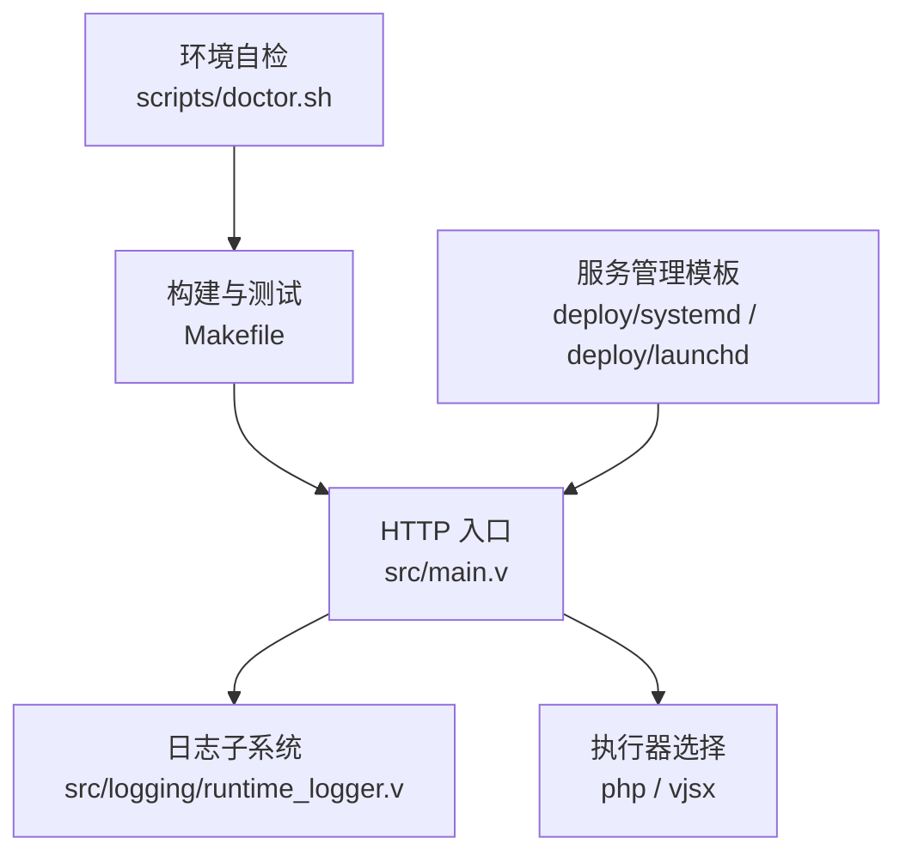
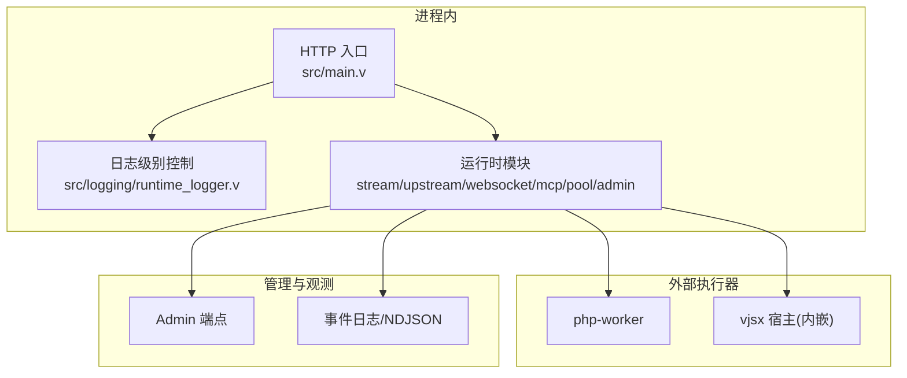
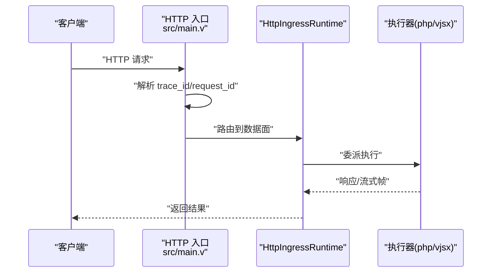
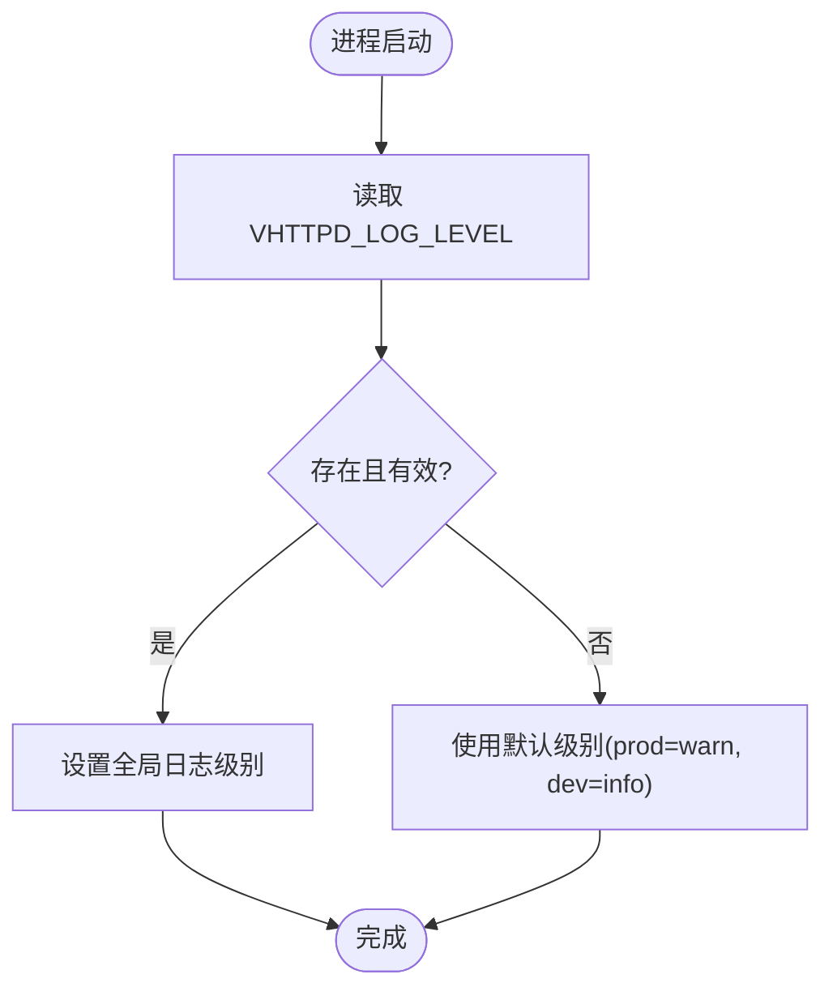
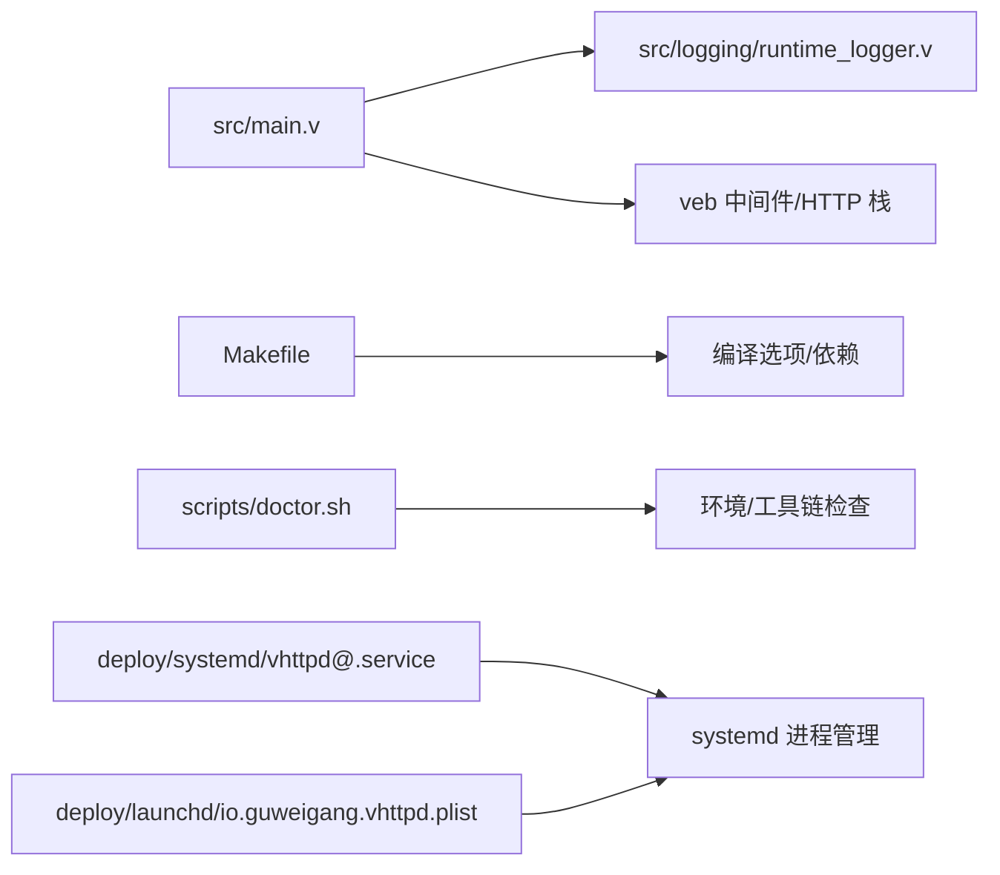

# 调试技巧和IDE集成

<cite>
**本文引用的文件**   
- [README.md](file://README.md)
- [Makefile](file://Makefile)
- [src/main.v](file://src/main.v)
- [src/logging/runtime_logger.v](file://src/logging/runtime_logger.v)
- [scripts/doctor.sh](file://scripts/doctor.sh)
- [deploy/systemd/vhttpd@.service](file://deploy/systemd/vhttpd@.service)
- [deploy/launchd/io.guweigang.vhttpd.plist](file://deploy/launchd/io.guweigang.vhttpd.plist)
</cite>

## 目录
1. [简介](#简介)
2. [项目结构](#项目结构)
3. [核心组件](#核心组件)
4. [架构总览](#架构总览)
5. [详细组件分析](#详细组件分析)
6. [依赖关系分析](#依赖关系分析)
7. [性能与可观测性](#性能与可观测性)
8. [故障排查指南](#故障排查指南)
9. [结论](#结论)
10. [附录](#附录)

## 简介
本指南面向 vhttpd 的开发者与运维人员，聚焦于本地与生产环境的调试技巧、IDE 集成方案、热重载与实时调试实践，以及常见问题的定位方法。内容覆盖：
- GDB/LLDB 等原生调试器的使用要点（断点、变量、调用栈）
- VS Code、CLion 等主流 IDE 的调试配置思路
- 基于 vjsx 内嵌运行时的热重载与增量构建
- 日志级别控制、事件追踪、管理端点诊断
- 死锁、内存泄漏、并发问题的排查路径
- 自动化脚本与配置文件模板的使用建议

## 项目结构
vhttpd 以 V 语言编写，HTTP 入口由 veb 提供，业务逻辑通过“执行器”模型解耦（php-worker、vjsx 等）。调试相关的关键位置包括：
- HTTP 路由与上下文：src/main.v
- 日志级别解析与全局初始化：src/logging/runtime_logger.v
- 构建与测试目标、环境变量开关：Makefile
- 环境自检脚本：scripts/doctor.sh
- 服务管理模板（systemd、launchd）：deploy/*

图表来源
- [src/main.v:1-117](file://src/main.v#L1-L117)
- [src/logging/runtime_logger.v:1-42](file://src/logging/runtime_logger.v#L1-L42)
- [Makefile:1-35](file://Makefile#L1-L35)
- [scripts/doctor.sh:1-108](file://scripts/doctor.sh#L1-L108)
- [deploy/systemd/vhttpd@.service](file://deploy/systemd/vhttpd@.service)
- [deploy/launchd/io.guweigang.vhttpd.plist](file://deploy/launchd/io.guweigang.vhttpd.plist)

章节来源
- [README.md](file://README.md)
- [src/main.v:1-117](file://src/main.v#L1-L117)
- [src/logging/runtime_logger.v:1-42](file://src/logging/runtime_logger.v#L1-L42)
- [Makefile:1-35](file://Makefile#L1-L35)
- [scripts/doctor.sh:1-108](file://scripts/doctor.sh#L1-L108)
- [deploy/systemd/vhttpd@.service](file://deploy/systemd/vhttpd@.service)
- [deploy/launchd/io.guweigang.vhttpd.plist](file://deploy/launchd/io.guweigang.vhttpd.plist)

## 核心组件
- HTTP 入口与请求上下文
  - 统一将 HTTP 请求路由到数据面运行时；支持 trace_id/request_id 注入与透传。
- 日志子系统
  - 通过环境变量控制全局日志级别，默认 prod 为 warn，开发为 info。
- 构建与测试
  - Makefile 暴露多种构建/测试目标，并控制 TLS 后端、GC、数据库编译开关等。
- 环境自检
  - doctor.sh 检查编译器、pkg-config、QuickJS 源码、数据库客户端工具链等。
- 服务管理
  - systemd/launchd 模板用于前台进程托管，便于配合调试器或系统日志采集。

章节来源
- [src/main.v:1-117](file://src/main.v#L1-L117)
- [src/logging/runtime_logger.v:1-42](file://src/logging/runtime_logger.v#L1-L42)
- [Makefile:1-35](file://Makefile#L1-L35)
- [scripts/doctor.sh:1-108](file://scripts/doctor.sh#L1-L108)
- [deploy/systemd/vhttpd@.service](file://deploy/systemd/vhttpd@.service)
- [deploy/launchd/io.guweigang.vhttpd.plist](file://deploy/launchd/io.guweigang.vhttpd.plist)

## 架构总览
下图展示 vhttpd 在调试视角下的关键交互：入口层、日志、执行器、外部 worker/host、管理端点与事件流。

图表来源
- [src/main.v:1-117](file://src/main.v#L1-L117)
- [src/logging/runtime_logger.v:1-42](file://src/logging/runtime_logger.v#L1-L42)
- [README.md](file://README.md)

## 详细组件分析

### 入口与请求追踪（src/main.v）
- 作用
  - 定义 App 结构体，组合 veb 中间件、静态资源处理与数据面运行时。
  - 实现通用 HTTP 方法路由，委托给 HttpIngressRuntime 进行分发。
  - 提供 trace_id/request_id 解析逻辑，优先从查询参数/请求头/veb.request_id 获取。
- 调试要点
  - 在入口函数设置断点，观察请求进入路径与 ID 生成策略。
  - 结合 Admin 端点与管理日志，确认请求链路是否被正确识别。

图表来源
- [src/main.v:83-116](file://src/main.v#L83-L116)

章节来源
- [src/main.v:1-117](file://src/main.v#L1-L117)

### 日志级别控制（src/logging/runtime_logger.v）
- 作用
  - 根据环境变量 VHTTPD_LOG_LEVEL 解析并设置全局日志级别。
  - 默认值：prod=warn，非 prod=info。
- 调试要点
  - 启动前设置环境变量，快速切换 debug/info/warn/error/fatal。
  - 结合系统日志管理器（systemd journal、launchd log）查看输出。

图表来源
- [src/logging/runtime_logger.v:8-34](file://src/logging/runtime_logger.v#L8-L34)

章节来源
- [src/logging/runtime_logger.v:1-42](file://src/logging/runtime_logger.v#L1-L42)

### 构建与测试（Makefile）
- 作用
  - 提供 deps-core/deps-vjsx/deps-db/deps-full 安装依赖。
  - 提供 test-fast/test-php/test-e2e 等测试目标。
  - 控制 TLS 后端、GC、数据库编译开关等。
- 调试要点
  - 使用 test-fast 快速验证核心逻辑。
  - 通过 WITH_DB、V_TLS_BACKEND、VPHP_V_GC 等变量调整构建特性，便于复现问题。

章节来源
- [Makefile:1-35](file://Makefile#L1-L35)
- [Makefile:104-198](file://Makefile#L104-L198)

### 环境自检（scripts/doctor.sh）
- 作用
  - 检查 v、pkg-config、openssl、bdw-gc、sqlite3、mysql_config/pg_config 等。
  - 校验 vjsx 模块与 QuickJS 源码可用性。
- 调试要点
  - 在本地或 CI 环境中先运行 doctor，确保构建与运行依赖完备。
  - 针对缺失项按提示安装或配置 pkg-config 路径。

章节来源
- [scripts/doctor.sh:1-108](file://scripts/doctor.sh#L1-L108)

### 服务管理模板（systemd/launchd）
- 作用
  - 提供前台进程托管模板，便于配合调试器或系统日志采集。
  - 支持实例化多配置运行（systemd @ 实例单元）。
- 调试要点
  - 在模板中设置 VHTTPD_LOG_LEVEL 与环境变量，便于集中收集日志。
  - 使用 systemctl/launchctl 启停进程，结合 journalctl/console 查看输出。

章节来源
- [deploy/systemd/vhttpd@.service](file://deploy/systemd/vhttpd@.service)
- [deploy/launchd/io.guweigang.vhttpd.plist](file://deploy/launchd/io.guweigang.vhttpd.plist)

## 依赖关系分析
- 入口依赖日志子系统与 veb 中间件体系。
- 构建系统通过 Makefile 聚合编译器、TLS 后端、GC、数据库客户端等依赖。
- 服务管理模板与操作系统进程管理器耦合，便于调试期与生产期的统一管控。

图表来源
- [src/main.v:1-117](file://src/main.v#L1-L117)
- [src/logging/runtime_logger.v:1-42](file://src/logging/runtime_logger.v#L1-L42)
- [Makefile:1-35](file://Makefile#L1-L35)
- [scripts/doctor.sh:1-108](file://scripts/doctor.sh#L1-L108)
- [deploy/systemd/vhttpd@.service](file://deploy/systemd/vhttpd@.service)
- [deploy/launchd/io.guweigang.vhttpd.plist](file://deploy/launchd/io.guweigang.vhttpd.plist)

## 性能与可观测性
- 日志级别
  - 通过 VHTTPD_LOG_LEVEL 控制全局级别，避免高负载下 debug 日志淹没。
- 事件追踪
  - 入口层记录 trace_id/request_id，有助于跨模块关联日志与事件。
- 管理端点
  - README 文档描述了 admin/gateway/callbacks/mcp 等端点用途，可用于运行时快照、活动监控与调试发送。

章节来源
- [src/logging/runtime_logger.v:1-42](file://src/logging/runtime_logger.v#L1-L42)
- [src/main.v:1-117](file://src/main.v#L1-L117)
- [README.md](file://README.md)

## 故障排查指南

### 常见问题与定位步骤
- 无法启动或端口占用
  - 检查服务模板中的监听地址与端口，确认未被其他进程占用。
  - 使用管理员端点查看运行时状态与错误信息。
- 日志无输出或级别不对
  - 确认 VHTTPD_LOG_LEVEL 已正确设置，并在系统日志中检索。
- 依赖缺失导致构建失败
  - 运行 scripts/doctor.sh 检查工具链与库，按提示修复。
- 请求未命中预期执行器
  - 核对入口路由与执行器选择逻辑，结合 trace_id/request_id 定位。

章节来源
- [scripts/doctor.sh:1-108](file://scripts/doctor.sh#L1-L108)
- [src/logging/runtime_logger.v:1-42](file://src/logging/runtime_logger.v#L1-L42)
- [src/main.v:1-117](file://src/main.v#L1-L117)
- [README.md](file://README.md)

### 死锁检测
- 使用 GDB/LLDB 附加进程，抓取线程堆栈，观察是否存在互斥等待环。
- 结合系统日志与事件日志，定位长时间阻塞的请求或上游连接。

### 内存泄漏排查
- 启用 Boehm GC 构建（Makefile 支持），对比不同构建配置的内存增长曲线。
- 在关键路径设置断点，观察对象生命周期与释放时机。

### 并发问题诊断
- 抓取多个线程/协程的调用栈，分析竞争条件与锁粒度。
- 利用 trace_id/request_id 串联同一请求的并发分支，缩小范围。

[本节为通用方法论，不直接分析具体文件]

## 结论
vhttpd 提供了清晰的入口与日志机制，配合 Makefile 的可控构建与 doctor 的环境自检，能够在开发与生产阶段高效定位问题。结合系统级进程管理与管理端点，可实现端到端的可观测性与可维护性。对于复杂场景（死锁、内存、并发），建议以调试器为核心，辅以日志与事件追踪，形成闭环的诊断流程。

[本节为总结性内容，不直接分析具体文件]

## 附录

### GDB/LLDB 实战要点
- 启动方式
  - 使用服务模板以前台模式运行，便于附加调试器。
- 常用命令
  - 断点：在入口与关键函数处设置断点。
  - 变量：查看请求上下文、trace_id/request_id。
  - 调用栈：分析阻塞与异常路径。
- 多线程
  - 列出所有线程，切换线程查看各自堆栈。

[本节为通用指导，不直接分析具体文件]

### VS Code 集成
- 使用 C/C++ 扩展，配置 launch.json 指向 vhttpd 二进制与符号文件。
- 设置工作区根目录与断点位置，结合环境变量 VHTTPD_LOG_LEVEL 控制输出。

[本节为通用指导，不直接分析具体文件]

### CLion 集成
- 创建本地运行配置，指定程序路径与工作目录。
- 在 main 与关键函数处设置断点，开启日志输出以便对照。

[本节为通用指导，不直接分析具体文件]

### 热重载与实时调试（vjsx 内嵌模式）
- 内嵌 vjsx 模式适合快速迭代，可通过构建产物缓存与增量编译提升效率。
- 结合 Admin 端点与事件日志，观察插件与钩子的热重载状态与诊断信息。

章节来源
- [README.md](file://README.md)

### 自动化调试脚本与配置模板
- 使用 scripts/doctor.sh 进行环境自检。
- 参考 deploy/systemd/vhttpd@.service 与 deploy/launchd/io.guweigang.vhttpd.plist 模板，配置环境变量与服务启停。

章节来源
- [scripts/doctor.sh:1-108](file://scripts/doctor.sh#L1-L108)
- [deploy/systemd/vhttpd@.service](file://deploy/systemd/vhttpd@.service)
- [deploy/launchd/io.guweigang.vhttpd.plist](file://deploy/launchd/io.guweigang.vhttpd.plist)