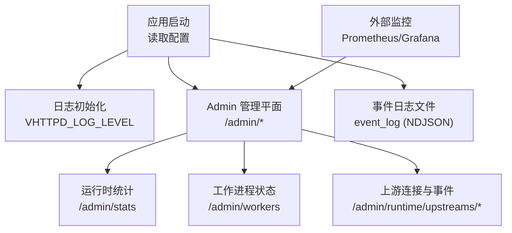
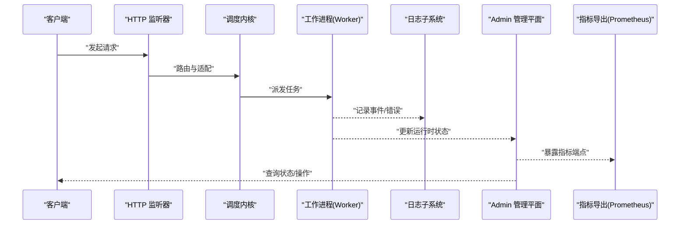
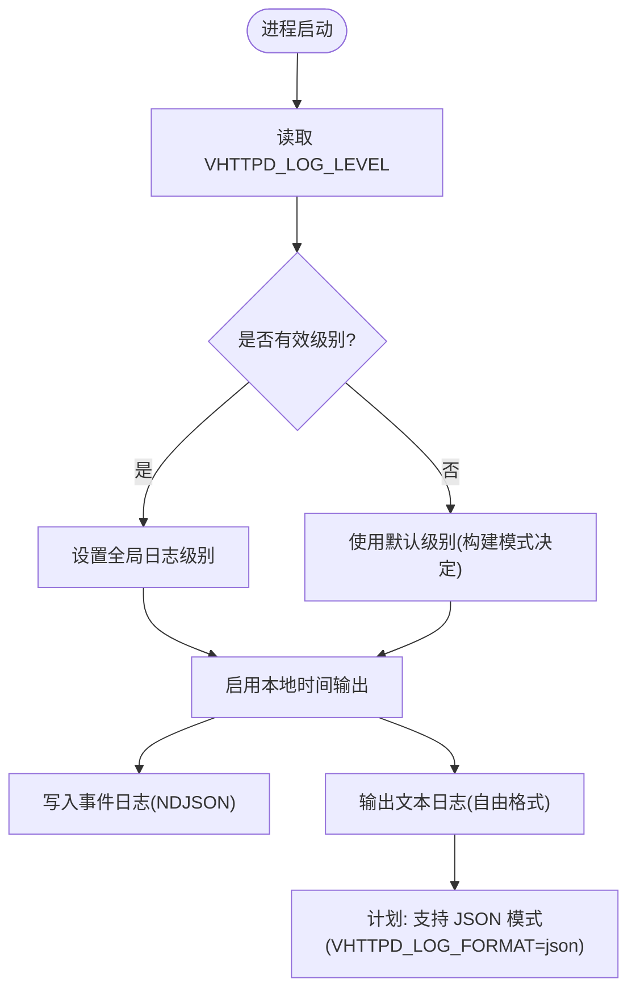
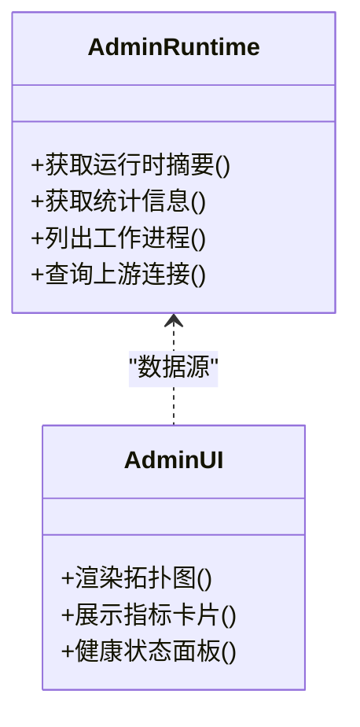
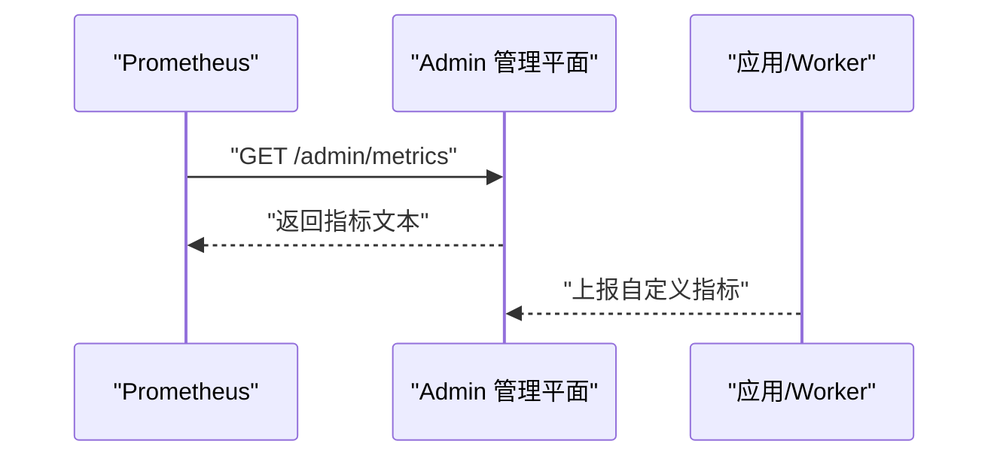
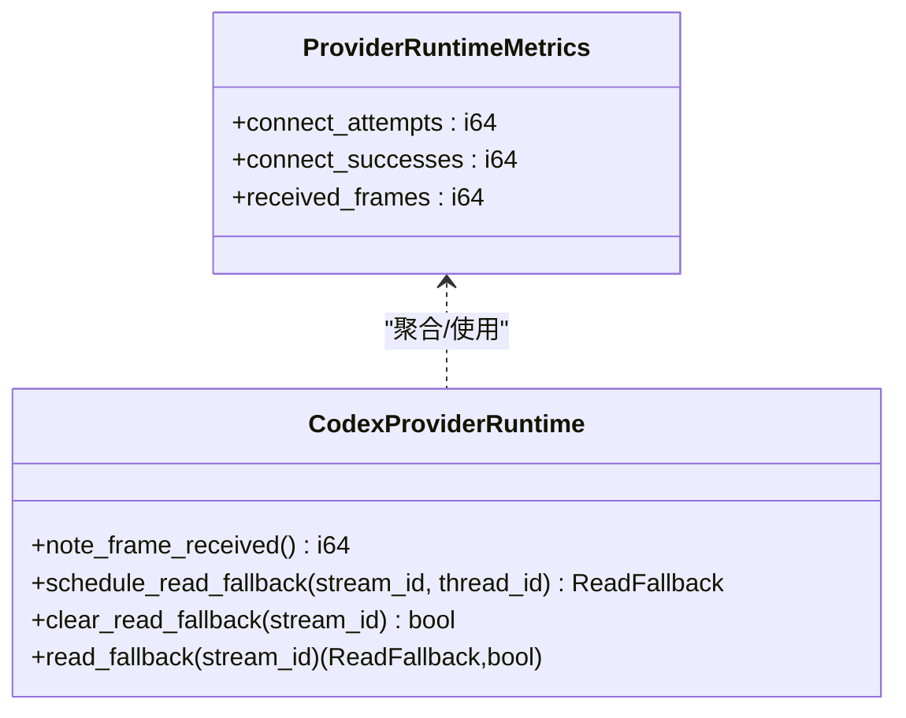
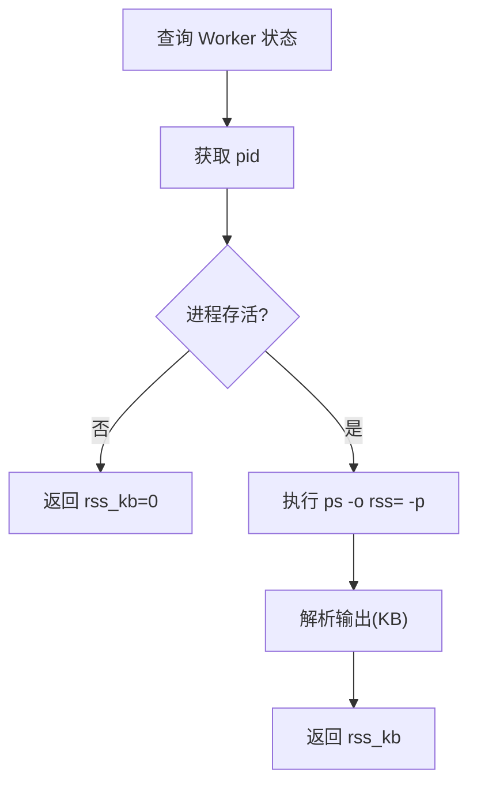
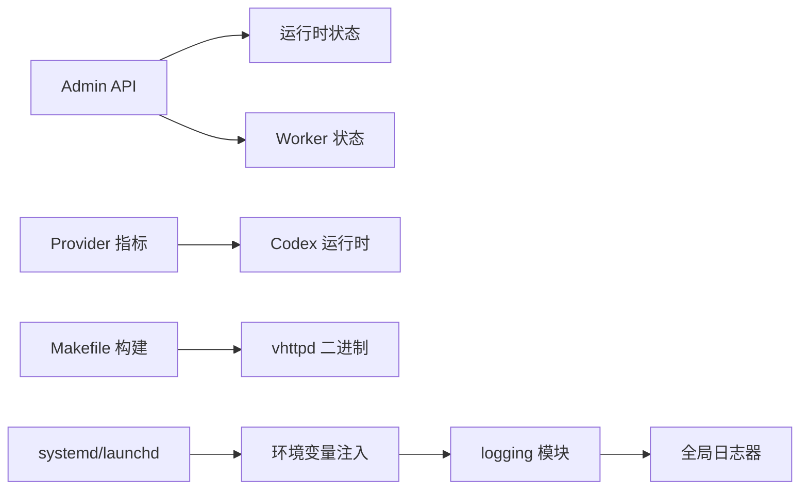

# 调试技巧和工具

<cite>
**本文引用的文件**   
- [src/logging/runtime_logger.v](file://src/logging/runtime_logger.v)
- [config/vhttpd.example.toml](file://config/vhttpd.example.toml)
- [articles/11-observability.md](file://articles/11-observability.md)
- [Makefile](file://Makefile)
- [deploy/systemd/vhttpd@.service](file://deploy/systemd/vhttpd@.service)
- [deploy/launchd/io.guweigang.vhttpd.plist](file://deploy/launchd/io.guweigang.vhttpd.plist)
- [.ok/local/logs/server-current.jsonl](file://.ok/local/logs/server-current.jsonl)
- [src/admin_state_runtime.v](file://src/admin_state_runtime.v)
- [admin/ui/app.js](file://admin/ui/app.js)
- [src/provider/runtime_dispatch.v](file://src/provider/runtime_dispatch.v)
- [src/upstream/provider/codex/runtime.v](file://src/upstream/provider/codex/runtime.v)
- [src/worker_backend_admin_runtime.v](file://src/worker_backend_admin_runtime.v)
- [README.md](file://README.md)
</cite>

## 目录
1. [简介](#简介)
2. [项目结构](#项目结构)
3. [核心组件](#核心组件)
4. [架构总览](#架构总览)
5. [详细组件分析](#详细组件分析)
6. [依赖关系分析](#依赖关系分析)
7. [性能与内存分析](#性能与内存分析)
8. [远程调试与热重载](#远程调试与热重载)
9. [常见问题诊断与排障](#常见问题诊断与排障)
10. [结论](#结论)
11. [附录：配置与最佳实践](#附录配置与最佳实践)

## 简介
本指南聚焦于 vhttpd 的调试技巧与工具链，覆盖日志系统、监控指标、结构化输出、性能分析与内存泄漏检测、远程调试与热重载、以及常见问题的诊断流程。文档同时提供可落地的配置建议与可视化方案，帮助开发者在本地与生产环境高效定位问题。

## 项目结构
围绕调试与可观测性，vhttpd 的关键位置包括：
- 日志级别与初始化：logging 模块负责解析环境变量并设置全局日志器
- 运行时配置：示例配置包含事件日志路径、Admin 管理平面端口等
- Admin 管理平面：提供运行时状态、指标、Worker 管理等端点
- 结构化日志样例：NDJSON 格式的事件与同步引擎日志
- 构建与运行：Makefile 提供多目标构建与测试入口，systemd/launchd 提供进程管理与环境变量注入

图表来源
- [src/logging/runtime_logger.v:1-42](file://src/logging/runtime_logger.v#L1-L42)
- [config/vhttpd.example.toml:1-67](file://config/vhttpd.example.toml#L1-L67)
- [articles/11-observability.md:1-769](file://articles/11-observability.md#L1-L769)

章节来源
- [src/logging/runtime_logger.v:1-42](file://src/logging/runtime_logger.v#L1-L42)
- [config/vhttpd.example.toml:1-67](file://config/vhttpd.example.toml#L1-L67)
- [articles/11-observability.md:1-769](file://articles/11-observability.md#L1-L769)

## 核心组件
- 日志级别控制
  - 通过环境变量 VHTTPD_LOG_LEVEL 控制全局日志级别（debug/info/warn/error/fatal），默认根据构建模式选择 warn 或 info
  - 支持按模块扩展的计划能力（见“计划与演进”）
- 事件日志与结构化输出
  - 事件日志以 NDJSON 写入 event_log 文件，便于集中采集与分析
  - 文本日志当前为自由格式；未来计划支持 JSON 模式（VHTTPD_LOG_FORMAT=json）
- Admin 管理平面
  - 提供 /admin/runtime、/admin/stats、/admin/workers、/admin/runtime/upstreams/* 等端点
  - 内置前端展示关键指标与拓扑图
- 指标与告警
  - 提供 Prometheus 集成方式与推荐告警规则
  - 支持自定义指标上报（PHP Worker 侧）

章节来源
- [src/logging/runtime_logger.v:1-42](file://src/logging/runtime_logger.v#L1-L42)
- [README.md:270](file://README.md#L270)
- [config/vhttpd.example.toml:1-67](file://config/vhttpd.example.toml#L1-L67)
- [articles/11-observability.md:1-769](file://articles/11-observability.md#L1-L769)

## 架构总览
下图展示了从请求进入、到执行、再到日志与指标输出的整体链路，以及 Admin 管理平面的作用。

图表来源
- [articles/11-observability.md:1-769](file://articles/11-observability.md#L1-L769)
- [src/admin_state_runtime.v:1-78](file://src/admin_state_runtime.v#L1-L78)
- [admin/ui/app.js:289-675](file://admin/ui/app.js#L289-L675)

## 详细组件分析

### 日志系统与结构化输出
- 日志级别解析与生效
  - 通过环境变量 VHTTPD_LOG_LEVEL 解析，未设置时根据构建模式选择默认级别
  - 初始化时将全局日志器设置为本地时间输出
- 事件日志（NDJSON）
  - 事件日志文件由配置项 files.event_log 指定
  - 样例日志包含 level、time、pid、hostname、name、trace_id、span_id、msg 等字段，便于关联追踪
- 结构化日志计划
  - 计划支持 VHTTPD_LOG_FORMAT=json，统一输出单行 JSON，去除 emoji，增加 ts、level、module、msg 等字段
  - 计划支持模块级日志级别覆盖（如 VHTTPD_LOG_LEVEL_codex=debug）

图表来源
- [src/logging/runtime_logger.v:1-42](file://src/logging/runtime_logger.v#L1-L42)
- [config/vhttpd.example.toml:1-67](file://config/vhttpd.example.toml#L1-L67)
- [docs/refactor_0601.md:366-379](file://docs/refactor_0601.md#L366-L379)

章节来源
- [src/logging/runtime_logger.v:1-42](file://src/logging/runtime_logger.v#L1-L42)
- [config/vhttpd.example.toml:1-67](file://config/vhttpd.example.toml#L1-L67)
- [.ok/local/logs/server-current.jsonl:27-31](file://.ok/local/logs/server-current.jsonl#L27-L31)
- [docs/refactor_0601.md:366-379](file://docs/refactor_0601.md#L366-L379)

### Admin 管理平面与监控端点
- 核心端点
  - /admin/runtime：运行时摘要（Worker 池、HTTP 请求、WebSocket、MCP 会话等）
  - /admin/stats：请求速率、延迟分位、错误分类
  - /admin/workers：各 Worker 状态、内存占用、重启计数
  - /admin/runtime/upstreams/websocket：上游连接状态与事件
- 认证与访问
  - 大多数端点需要 x-vhttpd-admin-token 头
- 前端可视化
  - admin/ui/app.js 渲染拓扑图、指标卡片与健康状态

图表来源
- [articles/11-observability.md:1-769](file://articles/11-observability.md#L1-L769)
- [admin/ui/app.js:289-675](file://admin/ui/app.js#L289-L675)
- [src/admin_state_runtime.v:1-78](file://src/admin_state_runtime.v#L1-L78)

章节来源
- [articles/11-observability.md:1-769](file://articles/11-observability.md#L1-L769)
- [admin/ui/app.js:289-675](file://admin/ui/app.js#L289-L675)
- [src/admin_state_runtime.v:1-78](file://src/admin_state_runtime.v#L1-L78)

### 指标收集与 Prometheus 集成
- 指标端点
  - 通过 /admin/metrics 暴露 Prometheus text format
- 自定义指标
  - PHP Worker 中可通过 SDK 上报增量、仪表盘、直方图等指标
- 推荐告警规则
  - 针对 Worker 池耗尽、队列积压、高错误率、上游断开、MCP 会话接近上限等场景

图表来源
- [articles/11-observability.md:406-468](file://articles/11-observability.md#L406-L468)

章节来源
- [articles/11-observability.md:406-468](file://articles/11-observability.md#L406-L468)

### 上游连接与 Provider 指标
- Codex Provider 指标聚合
  - 汇总 connect_attempts、connect_successes、received_frames 等
- 读回退机制
  - 维护 read_fallbacks 映射，记录流式读取的调度与清理

图表来源
- [src/provider/runtime_dispatch.v:229-270](file://src/provider/runtime_dispatch.v#L229-L270)
- [src/upstream/provider/codex/runtime.v:64-111](file://src/upstream/provider/codex/runtime.v#L64-L111)

章节来源
- [src/provider/runtime_dispatch.v:229-270](file://src/provider/runtime_dispatch.v#L229-L270)
- [src/upstream/provider/codex/runtime.v:64-111](file://src/upstream/provider/codex/runtime.v#L64-L111)

### Worker 管理与内存快照
- Worker 状态
  - 通过 Admin 端点查看 alive、pid、rss_kb、draining、inflight_requests、served_requests、restart_count 等
- RSS 获取
  - 调用 ps -o rss= -p <pid> 获取进程内存占用（KB）

图表来源
- [src/worker_backend_admin_runtime.v:1-40](file://src/worker_backend_admin_runtime.v#L1-L40)

章节来源
- [src/worker_backend_admin_runtime.v:1-40](file://src/worker_backend_admin_runtime.v#L1-L40)

## 依赖关系分析
- 日志子系统依赖
  - logging 模块依赖 log 与 os，用于解析环境变量与设置全局日志器
- Admin 与运行时
  - admin UI 依赖后端提供的运行时与统计接口
  - provider 指标聚合依赖具体 Provider 的状态视图
- 构建与部署
  - Makefile 提供构建选项与测试入口
  - systemd/launchd 提供进程管理与环境变量注入（如 VHTTPD_LOG_LEVEL）

图表来源
- [src/logging/runtime_logger.v:1-42](file://src/logging/runtime_logger.v#L1-L42)
- [admin/ui/app.js:289-675](file://admin/ui/app.js#L289-L675)
- [src/provider/runtime_dispatch.v:229-270](file://src/provider/runtime_dispatch.v#L229-L270)
- [Makefile:1-35](file://Makefile#L1-L35)
- [deploy/systemd/vhttpd@.service:12](file://deploy/systemd/vhttpd@.service#L12)
- [deploy/launchd/io.guweigang.vhttpd.plist:18](file://deploy/launchd/io.guweigang.vhttpd.plist#L18)

章节来源
- [src/logging/runtime_logger.v:1-42](file://src/logging/runtime_logger.v#L1-L42)
- [admin/ui/app.js:289-675](file://admin/ui/app.js#L289-L675)
- [src/provider/runtime_dispatch.v:229-270](file://src/provider/runtime_dispatch.v#L229-L270)
- [Makefile:1-35](file://Makefile#L1-L35)
- [deploy/systemd/vhttpd@.service:12](file://deploy/systemd/vhttpd@.service#L12)
- [deploy/launchd/io.guweigang.vhttpd.plist:18](file://deploy/launchd/io.guweigang.vhttpd.plist#L18)

## 性能与内存分析
- 性能分析工具链
  - perf：用于 CPU 热点与调用栈分析
  - Valgrind：用于内存泄漏与越界检测
  - 结合 Admin 指标与事件日志进行端到端定位
- 内存泄漏排查
  - 关注 Worker RSS 增长趋势（/admin/workers）
  - 结合事件日志中的 worker.error 与 upstream 错误
  - 合理设置 max_requests 定期重启 Worker，缓解长期运行的内存累积
- 基准回归
  - 使用 bench 脚本进行短请求与流式请求回归测试

章节来源
- [articles/11-observability.md:598-619](file://articles/11-observability.md#L598-L619)
- [config/vhttpd.example.toml:19-26](file://config/vhttpd.example.toml#L19-L26)
- [docs/MVP_1_0_PR_READY.md:81-104](file://docs/MVP_1_0_PR_READY.md#L81-L104)

## 远程调试与热重载
- 远程调试
  - 使用 GDB/LLDB 附加到 vhttpd 主进程或 Worker 子进程
  - 在 systemd/launchd 环境中确保符号表可用（非 strip 构建）
- 热重载
  - 利用 Admin 的运行时替换与重加载能力（如 relays 重加载）
  - 配合事件日志确认变更生效与回滚策略

章节来源
- [src/logic_executor_test.v:573-602](file://src/logic_executor_test.v#L573-L602)
- [deploy/systemd/vhttpd@.service:12](file://deploy/systemd/vhttpd@.service#L12)
- [deploy/launchd/io.guweigang.vhttpd.plist:18](file://deploy/launchd/io.guweigang.vhttpd.plist#L18)

## 常见问题诊断与排障
- Worker 无响应
  - 症状：请求堆积、响应缓慢
  - 步骤：查看 /admin/workers、事件日志 worker.error、必要时重启单个或全部 Worker
- 上游连接频繁断开
  - 症状：飞书/Ollama 不断重连
  - 步骤：查看 /admin/runtime/upstreams/websocket 与事件、测试上游连通性与 Token
- MCP 会话无法创建
  - 症状：MCP 客户端连接失败
  - 步骤：检查 /admin/runtime/mcp、Worker 繁忙情况、MCP 错误日志
- 内存持续增长
  - 症状：进程内存不断增长
  - 步骤：监控 /admin/runtime memory_mb 与 /admin/workers memory_mb，调整 max_requests 与池大小

章节来源
- [articles/11-observability.md:530-619](file://articles/11-observability.md#L530-L619)

## 结论
vhttpd 提供了完善的日志与监控能力：基于环境变量的日志级别控制、NDJSON 事件日志、Admin 管理平面与 Prometheus 集成，辅以推荐的告警规则与故障排查流程。在生产环境中，建议结合 perf/Valgrind 进行性能与内存分析，并通过 Admin 的热重载能力实现安全变更。

## 附录：配置与最佳实践
- 日志级别与环境变量
  - 设置 VHTTPD_LOG_LEVEL 控制全局级别；生产默认 warn，开发默认 info
  - 计划支持 VHTTPD_LOG_FORMAT=json 与模块级级别覆盖
- 事件日志路径
  - 在配置文件中设置 files.event_log 指向集中日志目录
- Admin 管理平面
  - 配置 [admin] 段 host/port/token，限制访问范围
- 进程管理与环境变量
  - systemd/launchd 中注入 VHTTPD_LOG_LEVEL，确保服务启动即具备正确日志级别
- 指标与告警
  - 配置 Prometheus 抓取 /admin/metrics，导入推荐告警规则

章节来源
- [README.md:270](file://README.md#L270)
- [config/vhttpd.example.toml:1-67](file://config/vhttpd.example.toml#L1-L67)
- [deploy/systemd/vhttpd@.service:12](file://deploy/systemd/vhttpd@.service#L12)
- [deploy/launchd/io.guweigang.vhttpd.plist:18](file://deploy/launchd/io.guweigang.vhttpd.plist#L18)
- [articles/11-observability.md:406-468](file://articles/11-observability.md#L406-L468)