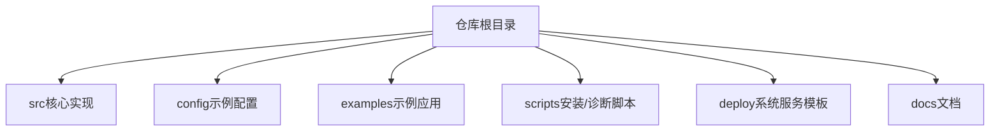
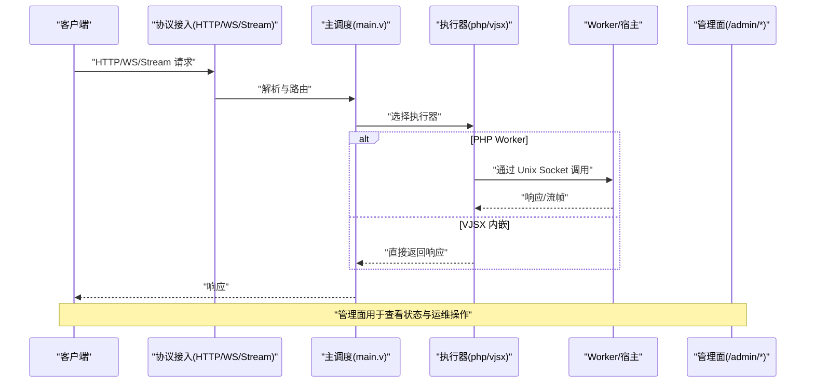
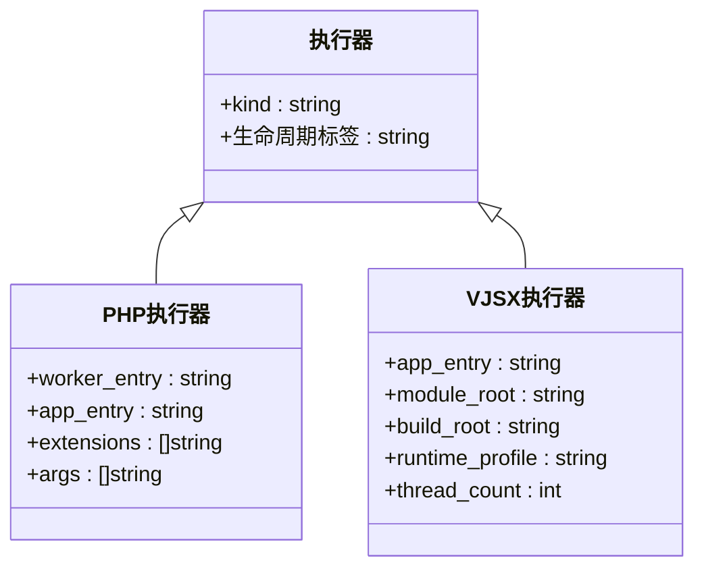
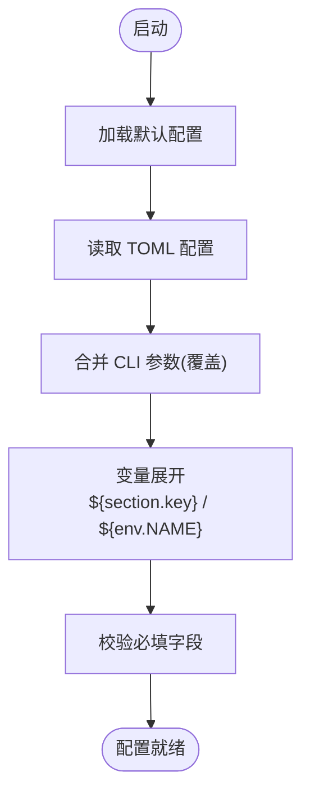
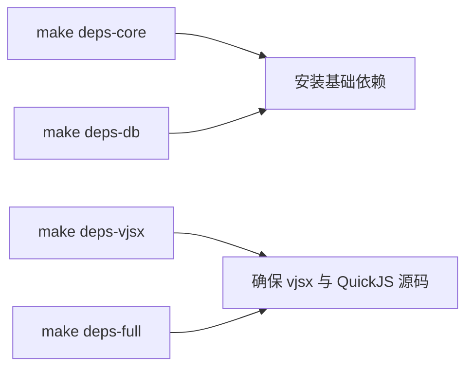

# 快速开始

<cite>
**本文引用的文件**   
- [README.md](file://README.md)
- [Makefile](file://Makefile)
- [v.mod](file://v.mod)
- [config/vhttpd.example.toml](file://config/vhttpd.example.toml)
- [config/vhttpd.vjsx.example.toml](file://config/vhttpd.vjsx.example.toml)
- [examples/hello-app.php](file://examples/hello-app.php)
- [examples/vjsx/hello-handler.mts](file://examples/vjsx/hello-handler.mts)
- [scripts/install_deps.sh](file://scripts/install_deps.sh)
- [scripts/doctor.sh](file://scripts/doctor.sh)
- [deploy/launchd/io.guweigang.vhttpd.plist](file://deploy/launchd/io.guweigang.vhttpd.plist)
- [src/config/config.v](file://src/config/config.v)
- [docs/EXECUTOR_MODES.md](file://docs/EXECUTOR_MODES.md)
- [docs/OVERVIEW.md](file://docs/OVERVIEW.md)
- [docs/failure_model.md](file://docs/failure_model.md)
</cite>

## 目录
1. [简介](#简介)
2. [项目结构](#项目结构)
3. [核心组件](#核心组件)
4. [架构总览](#架构总览)
5. [详细组件分析](#详细组件分析)
6. [依赖与构建](#依赖与构建)
7. [运行第一个应用](#运行第一个应用)
8. [环境变量与配置](#环境变量与配置)
9. [服务管理（Linux/macOS）](#服务管理linuxmacos)
10. [故障排除指南](#故障排除指南)
11. [常见问题解答](#常见问题解答)
12. [结论](#结论)

## 简介
本指南面向首次接触 vhttpd 的用户，帮助你在 Linux 或 macOS 上完成环境准备、依赖安装、编译构建，并分别以 PHP Worker 模式和 VJSX 模式启动你的第一个服务。文档同时覆盖 TOML 配置要点、常用环境变量、以及常见问题的定位方法。

## 项目结构
仓库采用“源码 + 示例 + 配置 + 脚本”的组织方式：
- src：vhttpd 核心实现（V 语言）
- config：官方示例 TOML 配置
- examples：PHP 与 VJSX 示例应用
- scripts：依赖安装与环境检查脚本
- deploy：systemd / launchd 模板
- docs：架构与模式说明文档

[本节为概览性描述，不直接分析具体文件]

## 核心组件
- HTTP/WS/Stream 接入层：负责协议终止、路由与分发
- 执行器模型：支持 php-worker（外部进程）与 vjsx（内嵌运行时）
- 工作进程池与队列：控制 worker 生命周期、并发与排队策略
- 管理面：提供运行时快照、worker 操作与诊断接口
- 配置加载：TOML + CLI 参数合并，支持变量展开与多站点

**章节来源**
- [README.md:84-126](file://README.md#L84-L126)
- [docs/OVERVIEW.md:127-295](file://docs/OVERVIEW.md#L127-L295)
- [src/config/config.v:394-482](file://src/config/config.v#L394-L482)

## 架构总览
下图展示了请求从客户端进入 vhttpd，到选择执行器（php 或 vjsx），再到返回响应的整体流程。

**图表来源**
- [README.md:84-126](file://README.md#L84-L126)
- [docs/OVERVIEW.md:127-295](file://docs/OVERVIEW.md#L127-L295)

**章节来源**
- [README.md:84-126](file://README.md#L84-L126)
- [docs/OVERVIEW.md:127-295](file://docs/OVERVIEW.md#L127-L295)

## 详细组件分析

### 执行器模式（PHP vs VJSX）
- PHP 模式：通过外部 php-worker 进程处理请求，适合已有 PHP 应用生态
- VJSX 模式：在 vhttpd 进程内嵌入 TypeScript/JavaScript 逻辑，无需 PHP 进程

**图表来源**
- [docs/EXECUTOR_MODES.md:25-104](file://docs/EXECUTOR_MODES.md#L25-L104)
- [config/vhttpd.example.toml:1-67](file://config/vhttpd.example.toml#L1-L67)
- [config/vhttpd.vjsx.example.toml:1-37](file://config/vhttpd.vjsx.example.toml#L1-L37)

**章节来源**
- [docs/EXECUTOR_MODES.md:25-104](file://docs/EXECUTOR_MODES.md#L25-L104)
- [config/vhttpd.example.toml:1-67](file://config/vhttpd.example.toml#L1-L67)
- [config/vhttpd.vjsx.example.toml:1-37](file://config/vhttpd.vjsx.example.toml#L1-L37)

### 配置加载与优先级
- 加载顺序：默认值 -> TOML 配置 -> CLI 参数（CLI 优先）
- 变量展开：支持 `${section.key}`、`${env.NAME}`、`${env.NAME:-default}`
- 多站点：同一进程可监听多个 host:port，每个站点独立 executor 与 app

**图表来源**
- [src/config/config.v:429-482](file://src/config/config.v#L429-L482)
- [README.md:437-518](file://README.md#L437-L518)

**章节来源**
- [src/config/config.v:429-482](file://src/config/config.v#L429-L482)
- [README.md:437-518](file://README.md#L437-L518)

## 依赖与构建

### 前置要求
- 操作系统：Linux 或 macOS
- 工具链：V 编译器、C 编译器、pkg-config、Git、curl、unzip
- 可选：Node.js（VJSX 模式需要 node 运行时）

### 安装依赖
- 基础依赖（含 OpenSSL、Boehm GC、SQLite/MySQL/PostgreSQL 开发包等）
- VJSX 依赖（拉取 vjsx 模块与受管 QuickJS 源码）
- DB 依赖（与 core 相同，便于显式表达意图）
- 全量依赖（core + vjsx）

**图表来源**
- [Makefile:109-122](file://Makefile#L109-L122)
- [scripts/install_deps.sh:117-135](file://scripts/install_deps.sh#L117-L135)

**章节来源**
- [README.md:210-254](file://README.md#L210-L254)
- [Makefile:109-122](file://Makefile#L109-L122)
- [scripts/install_deps.sh:117-135](file://scripts/install_deps.sh#L117-L135)

### 构建产物
- 开发构建：`make vhttpd`（默认启用 OpenSSL 与 DB 支持）
- 生产构建：`make prod` 或 `make build-prod`（开启 -prod，日志级别 warn）
- 关闭 DB 支持：`make build WITH_DB=0`

**章节来源**
- [README.md:256-271](file://README.md#L256-L271)
- [Makefile:96-107](file://Makefile#L96-L107)

### 环境自检
- 使用 `make doctor` 检查命令、pkg-config 条目与 vjsx QuickJS 源码是否就绪

**章节来源**
- [README.md:241-247](file://README.md#L241-L247)
- [scripts/doctor.sh:49-101](file://scripts/doctor.sh#L49-L101)

## 运行第一个应用

### 选项一：PHP Worker 模式
- 示例入口：examples/hello-app.php
- 示例配置：config/vhttpd.example.toml

步骤：
1. 准备依赖与构建（见“依赖与构建”）
2. 复制示例配置到本地，按需修改端口与路径
3. 启动服务：
   - 使用配置文件：`./vhttpd --config config/vhttpd.example.toml`
   - 或使用命令行参数（参考 README 中的示例）
4. 访问测试：
   - GET http://127.0.0.1:19881/hello/codex
   - GET http://127.0.0.1:19881/api/meta

提示：
- 若未安装 PHP 扩展或路径不正确，启动时会快速失败并提示缺失项
- 可通过 `[worker.env]` 注入环境变量供 PHP 侧读取

**章节来源**
- [examples/hello-app.php:1-49](file://examples/hello-app.php#L1-L49)
- [config/vhttpd.example.toml:1-67](file://config/vhttpd.example.toml#L1-L67)
- [README.md:428-531](file://README.md#L428-L531)

### 选项二：VJSX 内嵌模式
- 示例入口：examples/vjsx/hello-handler.mts
- 示例配置：config/vhttpd.vjsx.example.toml

步骤：
1. 准备依赖与构建（需 Node.js 运行时）
2. 使用 VJSX 示例配置启动：
   - `./vhttpd --config config/vhttpd.vjsx.example.toml`
3. 访问测试：
   - GET http://127.0.0.1:19882/hello?name=codex

提示：
- VJSX 模式下不会启动 PHP worker 套接字
- 可通过 CLI 参数直接指定入口与构建目录（参见 README 的 in-proc vjsx 部分）

**章节来源**
- [examples/vjsx/hello-handler.mts:1-16](file://examples/vjsx/hello-handler.mts#L1-L16)
- [config/vhttpd.vjsx.example.toml:1-37](file://config/vhttpd.vjsx.example.toml#L1-L37)
- [README.md:619-672](file://README.md#L619-L672)

## 环境变量与配置

### 关键环境变量
- VHTTPD_CONFIG：指定 TOML 配置文件路径（也可用 --config 或把 .toml 作为位置参数）
- VHTTPD_LOG_LEVEL：设置日志级别（debug|info|warn|error|fatal）
- VHTTPD_SOCKET_PREFIX：自定义 worker socket 前缀
- VJSX_ASSET_ROOT：覆盖内置 vjsx 运行时资源目录（开发调试用）

### 配置要点
- 变量展开：`${server.port}`、`${env.VHTTPD_SOCKET:-tmp/vslim_worker.sock}`
- 多站点：同一进程监听多个地址，每个站点独立 executor 与 app
- 路径别名：[paths].root 下相对路径解析；以 `/` 开头的保持绝对路径

**章节来源**
- [README.md:437-518](file://README.md#L437-L518)
- [README.md:533-617](file://README.md#L533-L617)
- [src/config/config.v:429-482](file://src/config/config.v#L429-L482)

## 服务管理（Linux/macOS）

### Linux（systemd）
- 使用实例单元 vhttpd@prod，映射到 /etc/vhttpd/prod.toml
- 典型步骤：创建目录、拷贝 service 模板与配置、重载 systemd、启用并启动

**章节来源**
- [README.md:376-410](file://README.md#L376-L410)

### macOS（launchd）
- 使用 LaunchAgents 模板，设置 EnvironmentVariables.VHTTPD_CONFIG 指向配置文件
- 典型步骤：拷贝 plist、替换环境变量、bootstrap 并 enable

**章节来源**
- [deploy/launchd/io.guweigang.vhttpd.plist:1-53](file://deploy/launchd/io.guweigang.vhttpd.plist#L1-L53)
- [README.md:392-410](file://README.md#L392-L410)

## 故障排除指南

### 启动阶段
- 缺少依赖：运行 `make doctor` 检查命令与 pkg-config 条目
- vjsx 构建问题：确认已执行 `make deps-vjsx`，并确保 QuickJS 源码可用
- 路径错误：检查 [paths] 与 [executor] 相关路径是否存在

**章节来源**
- [scripts/doctor.sh:49-101](file://scripts/doctor.sh#L49-L101)
- [README.md:241-254](file://README.md#L241-L254)

### 运行阶段
- 超时与队列：
  - connect/read/global 超时后返回 504，并附带结构化错误头
  - 队列满返回 503，等待超时返回 504
- 观察指标：
  - 通过 /admin/runtime 查看 worker_queue_* 与 stats 指标

**章节来源**
- [docs/failure_model.md:53-103](file://docs/failure_model.md#L53-L103)
- [docs/OVERVIEW.md:229-252](file://docs/OVERVIEW.md#L229-L252)

### 日志与事件
- 事件日志：通过 --event-log 输出 NDJSON 事件，便于追踪 trace_id 与耗时
- 日志级别：通过 VHTTPD_LOG_LEVEL 调整

**章节来源**
- [README.md:428-436](file://README.md#L428-L436)
- [README.md:271](file://README.md#L271)

## 常见问题解答

- Q：如何仅构建不带 DB 支持的版本？
  - A：使用 `make build WITH_DB=0`

- Q：如何在 macOS 上以 launchd 管理 vhttpd？
  - A：拷贝模板 plist，设置 VHTTPD_CONFIG，然后 bootstrap 与 enable

- Q：VJSX 模式是否需要 PHP？
  - A：不需要。VJSX 模式在 vhttpd 进程内运行，无需 PHP worker

- Q：如何切换执行器？
  - A：在 TOML 中设置 [executor].kind = "php" 或 "vjsx"，或通过 CLI 参数 --executor

- Q：如何查看运行时状态与 worker 信息？
  - A：访问 /admin/runtime、/admin/workers、/admin/stats

**章节来源**
- [README.md:271-277](file://README.md#L271-L277)
- [README.md:392-410](file://README.md#L392-L410)
- [docs/EXECUTOR_MODES.md:25-104](file://docs/EXECUTOR_MODES.md#L25-L104)
- [docs/OVERVIEW.md:199-228](file://docs/OVERVIEW.md#L199-L228)

## 结论
通过以上步骤，你可以在 Linux 或 macOS 上快速搭建 vhttpd，并以 PHP Worker 或 VJSX 模式运行你的第一个服务。建议在生产环境中结合 systemd/launchd 进行进程管理，并通过 /admin 面进行监控与排障。遇到异常时，优先使用 make doctor 与事件日志定位问题。