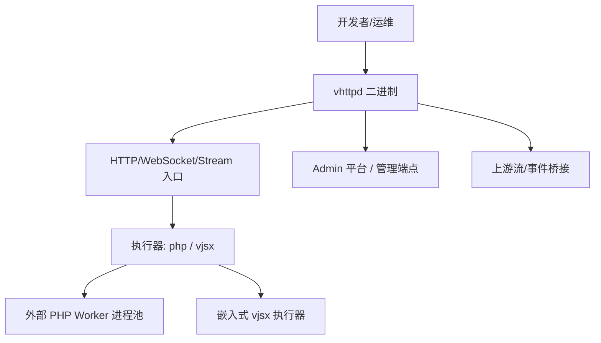
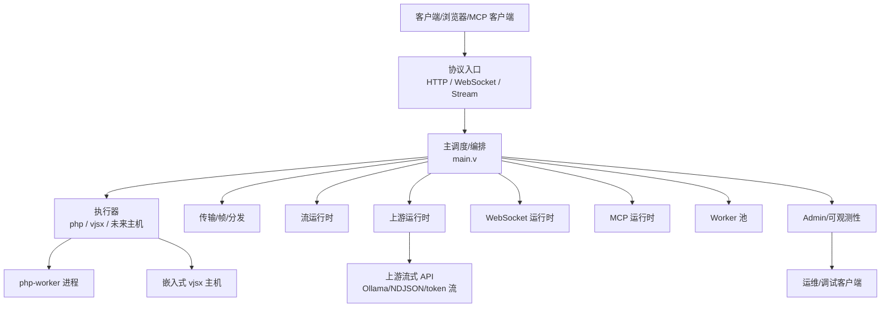
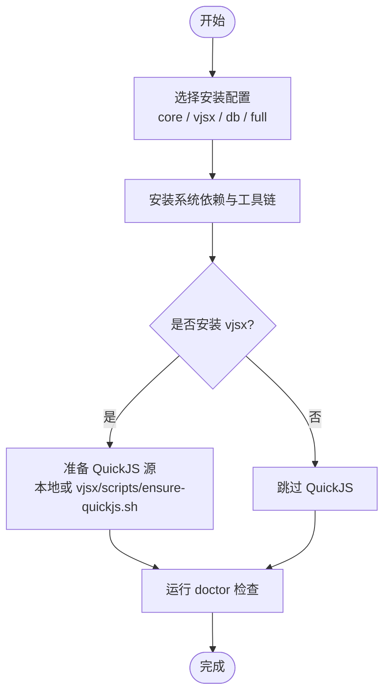
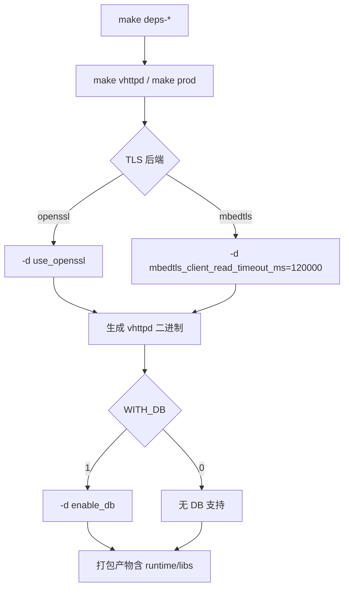
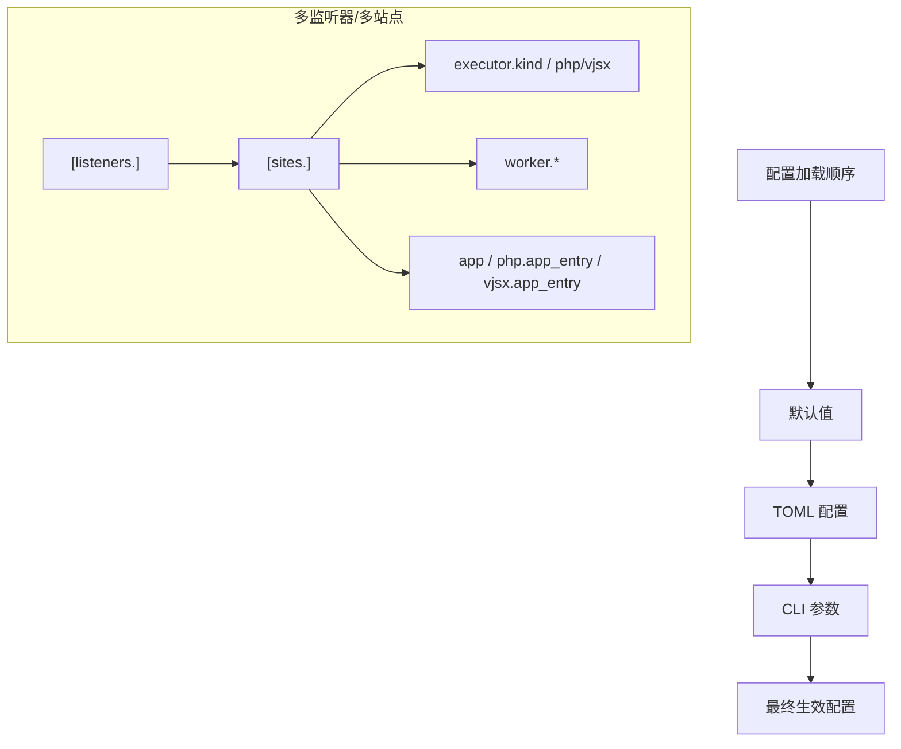
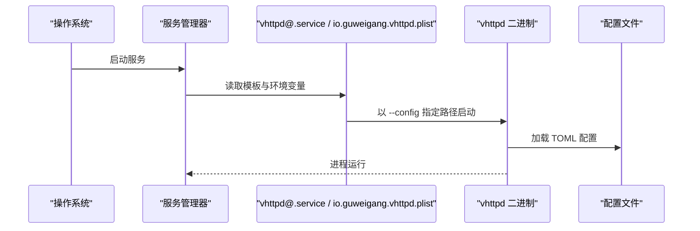
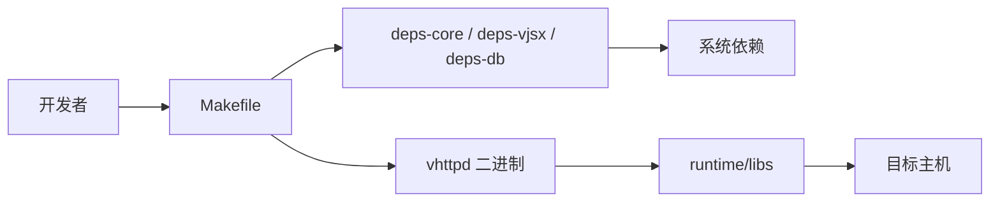
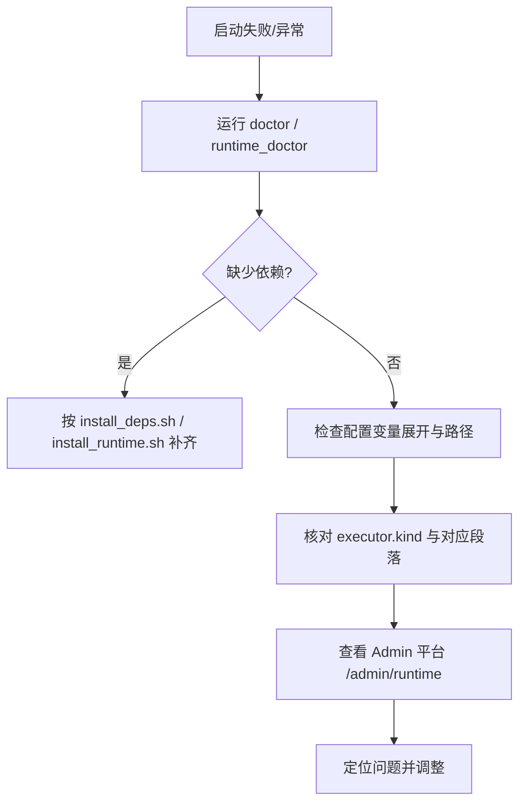

# 快速开始

<cite>
**本文引用的文件**
- [README.md](file://README.md)
- [Makefile](file://Makefile)
- [scripts/install_deps.sh](file://scripts/install_deps.sh)
- [scripts/install_runtime.sh](file://scripts/install_runtime.sh)
- [scripts/doctor.sh](file://scripts/doctor.sh)
- [deploy/systemd/vhttpd@.service](file://deploy/systemd/vhttpd@.service)
- [deploy/launchd/io.guweigang.vhttpd.plist](file://deploy/launchd/io.guweigang.vhttpd.plist)
- [config/vhttpd.example.toml](file://config/vhttpd.example.toml)
- [config/vhttpd.multi.example.toml](file://config/vhttpd.multi.example.toml)
- [config/vhttpd.vjsx.example.toml](file://config/vhttpd.vjsx.example.toml)
- [vhttpd.toml](file://vhttpd.toml)
- [articles/02-getting-started.md](file://articles/02-getting-started.md)
- [docs/SITE_CONFIG_DSL.md](file://docs/SITE_CONFIG_DSL.md)
- [docs/EXECUTOR_MODES.md](file://docs/EXECUTOR_MODES.md)
- [examples/hello-app.php](file://examples/hello-app.php)
</cite>

## 目录
1. [简介](#简介)
2. [项目结构](#项目结构)
3. [核心组件](#核心组件)
4. [架构总览](#架构总览)
5. [详细组件分析](#详细组件分析)
6. [依赖关系分析](#依赖关系分析)
7. [性能考虑](#性能考虑)
8. [故障排查指南](#故障排查指南)
9. [结论](#结论)
10. [附录](#附录)

## 简介
本指南面向初学者与高级用户，带你从零开始在本地或生产环境快速运行第一个 vhttpd 实例。内容覆盖：
- 环境要求与依赖安装（core、vjsx、db 三种配置）
- 本地编译与生产打包
- 配置文件格式与关键项说明，提供最小可用配置示例
- 服务管理（systemd 与 launchd）
- 多监听器模式设置
- 常见问题排查与验证步骤

## 项目结构
vhttpd 是基于 veb 的 HTTP 家族网关/运行时，支持 HTTP、WebSocket、流式协议，并提供上游流、外部 worker 编排、嵌入式 vjsx 执行、MCP 等能力。仓库提供了示例、配置模板、打包脚本与服务管理模板。

**章节来源**
- [README.md: 84-126:84-126](file://README.md#L84-L126)

## 核心组件
- 构建与依赖
  - Makefile 提供 deps-core、deps-vjsx、deps-db、deps-full、build、prod 等目标
  - scripts/install_deps.sh 安装系统依赖与 vjsx QuickJS 源
  - scripts/doctor.sh 检查构建前置条件
  - scripts/install_runtime.sh 安装打包产物到系统路径
- 配置系统
  - TOML 配置支持变量展开、分段合并与多站点/多监听器
  - 示例配置：vhttpd.example.toml（php）、vjsx.multi.example.toml（多站点）、vjsx.vjsx.example.toml（vjsx）
- 服务管理
  - systemd 单元模板（实例化）
  - launchd plist 模板（macOS）

**章节来源**
- [Makefile: 1-142:1-142](file://Makefile#L1-L142)
- [scripts/install_deps.sh: 1-138:1-138](file://scripts/install_deps.sh#L1-L138)
- [scripts/doctor.sh: 1-108:1-108](file://scripts/doctor.sh#L1-L108)
- [scripts/install_runtime.sh: 1-98:1-98](file://scripts/install_runtime.sh#L1-L98)
- [config/vhttpd.example.toml: 1-67:1-67](file://config/vhttpd.example.toml#L1-L67)
- [config/vhttpd.multi.example.toml: 1-73:1-73](file://config/vhttpd.multi.example.toml#L1-L73)
- [config/vhttpd.vjsx.example.toml: 1-37:1-37](file://config/vhttpd.vjsx.example.toml#L1-L37)
- [deploy/systemd/vhttpd@.service: 1-27:1-27](file://deploy/systemd/vhttpd@.service#L1-L27)
- [deploy/launchd/io.guweigang.vhttpd.plist: 1-54:1-54](file://deploy/launchd/io.guweigang.vhttpd.plist#L1-L54)

## 架构总览
vhttpd 将协议层（HTTP/WebSocket/Stream）与运行时（worker 编排、上游流、MCP、可观测性）解耦，通过可插拔执行器（php/vjsx）承载业务逻辑。

**图表来源**
- [README.md: 84-126:84-126](file://README.md#L84-L126)

**章节来源**
- [README.md: 84-126:84-126](file://README.md#L84-L126)

## 详细组件分析

### 环境要求与依赖安装
- 三种安装配置
  - core：基础构建依赖（OpenSSL、Boehm GC、pkg-config、数据库客户端开发包等）
  - vjsx：在 core 基础上准备 vjsx QuickJS 源（优先使用本地 ../quickjs，否则由 vjsx/scripts/ensure-quickjs.sh 准备）
  - db：数据库相关依赖（MySQL/MariaDB、PostgreSQL 客户端开发包）
  - full：包含上述全部
- 安装流程
  - 本地开发：make deps-core / deps-vjsx / deps-db / deps-full；make doctor 检查
  - 生产分发：scripts/install_runtime.sh 安装二进制与打包的运行时库；runtime_doctor.sh 自检

**图表来源**
- [scripts/install_deps.sh: 50-115:50-115](file://scripts/install_deps.sh#L50-L115)
- [scripts/doctor.sh: 24-101:24-101](file://scripts/doctor.sh#L24-L101)

**章节来源**
- [README.md: 210-271:210-271](file://README.md#L210-L271)
- [scripts/install_deps.sh: 1-138:1-138](file://scripts/install_deps.sh#L1-L138)
- [scripts/doctor.sh: 1-108:1-108](file://scripts/doctor.sh#L1-L108)
- [scripts/install_runtime.sh: 1-98:1-98](file://scripts/install_runtime.sh#L1-L98)

### 本地编译与生产打包
- 本地构建
  - make deps-core / deps-vjsx / deps-db / deps-full
  - make vhttpd（默认带 OpenSSL 与 DB 支持）
  - make prod/build-prod（启用 -prod，日志默认 warn）
- TLS 后端与 DB 开关
  - 默认使用 OpenSSL；如需 mbedtls，使用 V_TLS_BACKEND=mbedtls
  - WITH_DB=0 关闭 DB 支持
- 包装与分发
  - 打包产物包含 vhttpd、README、scripts/* 与 runtime/libs
  - RPATH/@loader_path 指向 runtime/libs，减少宿主缺失系统库的影响

**图表来源**
- [Makefile: 11-35:11-35](file://Makefile#L11-L35)
- [Makefile: 71-82:71-82](file://Makefile#L71-L82)
- [README.md: 256-271:256-271](file://README.md#L256-L271)

**章节来源**
- [Makefile: 1-142:1-142](file://Makefile#L1-L142)
- [README.md: 256-271:256-271](file://README.md#L256-L271)

### 配置文件格式与关键项
- 加载顺序与优先级
  - 默认值 → TOML 配置 → CLI 参数；CLI 总是覆盖配置
  - 字符串字段支持变量展开：${section.key}、${env.NAME}、${env.NAME:-default}
- 常用段落
  - [paths]：路径别名与 root 解析
  - [server]：host、port
  - [files]：pid_file、event_log
  - [runtime]：timezone
  - [worker]：autostart、pool_size、socket/socket_prefix、read_timeout_ms、queue_capacity、queue_timeout_ms、max_requests、restart_backoff_ms、restart_backoff_max_ms
  - [executor]：kind（php/vjsx）
  - [php]/[vjsx]：bin、worker_entry、app_entry、extensions、args、runtime_profile、thread_count、build_root、module_root 等
  - [admin]：host、port、token
  - [assets]：enabled、prefix、root、cache_control
  - [feishu]/[codex]：启用与参数
- 多监听器模式
  - 可选 [listeners.<id>] → [sites.<id>] 路由
  - 每个站点拥有独立 app 运行时与执行器选择
  - 若省略 [listeners]，将从 [sites.<id>].host/port 自动生成监听器
  - 站点层支持 app、worker.entry、executor 等简写与别名

**图表来源**
- [README.md: 437-617:437-617](file://README.md#L437-L617)
- [docs/SITE_CONFIG_DSL.md: 9-181:9-181](file://docs/SITE_CONFIG_DSL.md#L9-L181)

**章节来源**
- [README.md: 437-617:437-617](file://README.md#L437-L617)
- [docs/SITE_CONFIG_DSL.md: 1-182:1-182](file://docs/SITE_CONFIG_DSL.md#L1-L182)

### 最小可用配置示例
- PHP（core）示例
  - 参考：config/vhttpd.example.toml
  - 关键点：executor.kind=php；php.bin、php.worker_entry、php.app_entry、php.extensions；worker.autostart、worker.pool_size
- vjsx（in-proc）示例
  - 参考：config/vhttpd.vjsx.example.toml
  - 关键点：executor.kind=vjsx；vjsx.app_entry、vjsx.module_root、vjsx.runtime_profile、vjsx.thread_count
- 多监听器示例
  - 参考：config/vhttpd.multi.example.toml
  - 关键点：[sites.<id>] 定义 host/port/root/executor/app/php/vjsx 等；可省略 [listeners]

**章节来源**
- [config/vhttpd.example.toml: 1-67:1-67](file://config/vhttpd.example.toml#L1-L67)
- [config/vhttpd.vjsx.example.toml: 1-37:1-37](file://config/vhttpd.vjsx.example.toml#L1-L37)
- [config/vhttpd.multi.example.toml: 1-73:1-73](file://config/vhttpd.multi.example.toml#L1-L73)

### 服务管理（systemd 与 launchd）
- systemd（Linux）
  - 使用实例单元 vhttpd@.service，通过 /etc/vhttpd/%i.toml 加载配置
  - WorkingDirectory、ReadWritePaths、限制与保护选项已预设
  - 支持多实例（例如 vhttpd@prod、vhttpd@staging）
- launchd（macOS）
  - 通过 ~/Library/LaunchAgents 或 LaunchDaemons 管理
  - 通过 EnvironmentVariables.VHTTPD_CONFIG 指定配置路径
  - 支持多个标签副本，分别指向不同配置

**图表来源**
- [deploy/systemd/vhttpd@.service: 7-23:7-23](file://deploy/systemd/vhttpd@.service#L7-L23)
- [deploy/launchd/io.guweigang.vhttpd.plist: 8-21:8-21](file://deploy/launchd/io.guweigang.vhttpd.plist#L8-L21)

**章节来源**
- [README.md: 367-411:367-411](file://README.md#L367-L411)
- [deploy/systemd/vhttpd@.service: 1-27:1-27](file://deploy/systemd/vhttpd@.service#L1-L27)
- [deploy/launchd/io.guweigang.vhttpd.plist: 1-54:1-54](file://deploy/launchd/io.guweigang.vhttpd.plist#L1-L54)

### 多监听器模式设置
- 两种写法
  - 显式 [listeners.<id>] → [sites.<id>]；适合复杂路由
  - 省略 [listeners]，直接在 [sites.<id>] 写 host/port，vhttpd 自动合成监听器
- 站点层简写与别名
  - root = project_root
  - app = php.app_entry / vjsx.app_entry（根据 executor 推断）
  - worker.entry = php.worker_entry
  - vjsx.module_root 默认等于 site root
- 执行器选择
  - 简写：executor = "vjsx"/"php"
  - 展开：[sites.demo.executor] kind = "vjsx"/"php"

**章节来源**
- [README.md: 533-601:533-601](file://README.md#L533-L601)
- [docs/SITE_CONFIG_DSL.md: 91-181:91-181](file://docs/SITE_CONFIG_DSL.md#L91-L181)

### 执行器模式对比与切换
- PHP 模式
  - 通过 worker 池与 Unix Socket 与 php-worker 通信
  - 支持现有流/WS/MCP worker 路径
- vjsx 模式（嵌入式）
  - 无需 worker 进程；HTTP 与 websocket_upstream 分发可用
  - stream/websocket session worker 与 MCP 当前禁用
- 切换规则
  - 保持通用段不变，仅变更 [executor].kind
  - php 模式保留 [worker]，vjsx 模式保留 [vjsx]

**章节来源**
- [docs/EXECUTOR_MODES.md: 1-136:1-136](file://docs/EXECUTOR_MODES.md#L1-L136)

## 依赖关系分析
- 构建期依赖
  - OpenSSL、Boehm GC、pkg-config、SQLite/MySQL/PostgreSQL 客户端开发包
  - vjsx QuickJS 源（优先本地 ../quickjs，否则由 vjsx/scripts/ensure-quickjs.sh 准备）
- 运行期依赖
  - 打包产物自带 runtime/libs，二进制通过 RPATH/@loader_path 优先加载
  - 未安装系统库的机器可通过 scripts/install_runtime.sh 安装运行时库

**图表来源**
- [Makefile: 84-97:84-97](file://Makefile#L84-L97)
- [scripts/install_deps.sh: 50-84:50-84](file://scripts/install_deps.sh#L50-L84)
- [README.md: 298-347:298-347](file://README.md#L298-L347)

**章节来源**
- [Makefile: 84-97:84-97](file://Makefile#L84-L97)
- [scripts/install_deps.sh: 50-84:50-84](file://scripts/install_deps.sh#L50-L84)
- [README.md: 298-347:298-347](file://README.md#L298-L347)

## 性能考虑
- 生产构建默认日志级别为 warn，可通过 VHTTPD_LOG_LEVEL=debug|info|warn|error|fatal 调整
- vjsx 线程数（thread_count）影响并行处理能力
- worker 池大小（pool_size）与重启退避策略（restart_backoff_ms）影响稳定性与恢复速度
- 多监听器模式下，每个站点隔离运行时，避免相互干扰

**章节来源**
- [README.md: 268-271:268-271](file://README.md#L268-L271)
- [docs/EXECUTOR_MODES.md: 106-121:106-121](file://docs/EXECUTOR_MODES.md#L106-L121)

## 故障排查指南
- 构建前自检
  - make doctor：检查命令、pkg-config、OpenSSL、Boehm GC、QuickJS 源、MySQL/PG 客户端工具
- 运行时自检
  - install_runtime.sh 后运行 runtime_doctor.sh，确认二进制与运行时库状态
- 常见问题
  - vjsx 是否需要 Node.js：不需要，内置 QuickJS
  - vjsx 能处理高并发：通过 thread_count 提升
  - 停止 vhttpd：前台运行时按 Ctrl+C
- 验证步骤（以 vjsx 为例）
  - 使用 config/vhttpd.vjsx.example.toml 启动
  - curl 访问 /hello?name=... 验证响应
  - 访问 Admin 平台 /admin/runtime 查看运行时指标

**图表来源**
- [scripts/doctor.sh: 24-101:24-101](file://scripts/doctor.sh#L24-L101)
- [scripts/install_runtime.sh: 68-95:68-95](file://scripts/install_runtime.sh#L68-L95)
- [articles/02-getting-started.md: 84-113:84-113](file://articles/02-getting-started.md#L84-L113)

**章节来源**
- [scripts/doctor.sh: 1-108:1-108](file://scripts/doctor.sh#L1-L108)
- [scripts/install_runtime.sh: 1-98:1-98](file://scripts/install_runtime.sh#L1-L98)
- [articles/02-getting-started.md: 84-113:84-113](file://articles/02-getting-started.md#L84-L113)

## 结论
通过本指南，你可以：
- 选择合适的安装配置（core/vjsx/db/full）
- 在本地完成编译与生产打包
- 使用最小可用配置快速跑通 vjsx 或 PHP 场景
- 通过 systemd/launchd 管理服务
- 在多监听器模式下组织多个站点
- 借助 doctor/runtime_doctor 与 Admin 平台进行验证与排障

## 附录

### 快速起步清单（初学者）
- 安装依赖：make deps-core；make doctor
- 编译：make vhttpd
- 运行 vjsx 示例：./vhttpd --config config/vjsx.example.toml
- 验证：curl 访问 /hello
- 查看 Admin：curl -H 'x-vhttpd-admin-token: change-me' /admin/runtime

**章节来源**
- [articles/02-getting-started.md: 30-113:30-113](file://articles/02-getting-started.md#L30-L113)
- [config/vhttpd.vjsx.example.toml: 1-37:1-37](file://config/vhttpd.vjsx.example.toml#L1-L37)

### 高级用户优化建议
- 生产构建：make prod，设置 VHTTPD_LOG_LEVEL
- TLS 后端：V_TLS_BACKEND=openssl 或 mbedtls
- DB 支持：WITH_DB=1 或使用 deps-db
- 多监听器：利用 [sites.<id>] 简写与别名，减少重复配置
- vjsx 并发：提升 vjsx.thread_count
- systemd 多实例：vhttpd@prod、vhttpd@staging 并行运行

**章节来源**
- [Makefile: 11-35:11-35](file://Makefile#L11-L35)
- [README.md: 533-601:533-601](file://README.md#L533-L601)
- [docs/EXECUTOR_MODES.md: 106-121:106-121](file://docs/EXECUTOR_MODES.md#L106-L121)