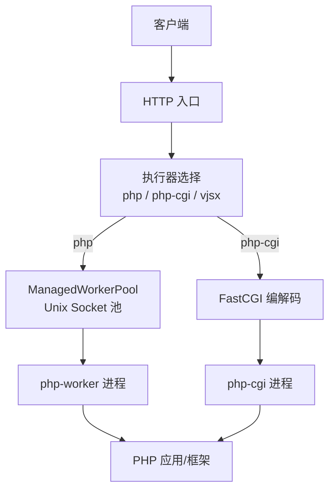
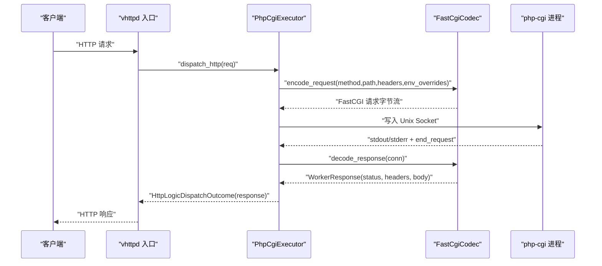
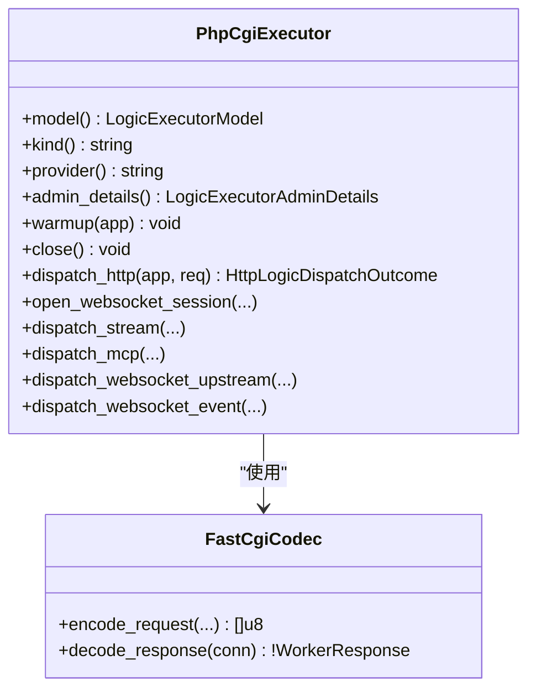
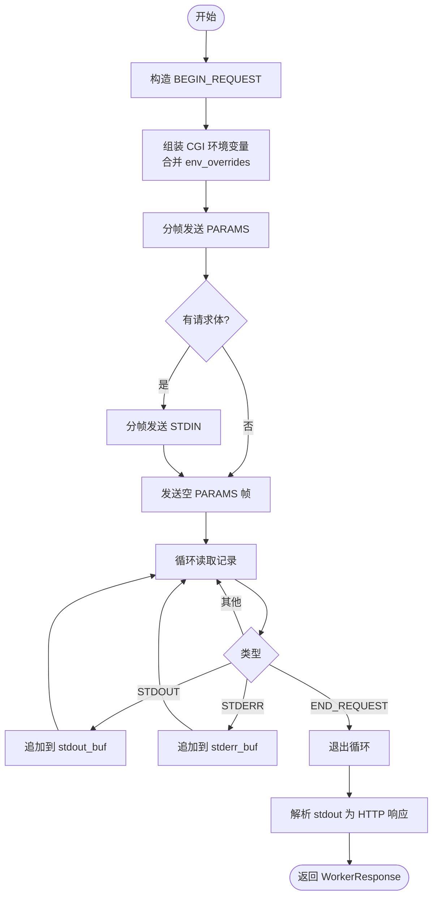
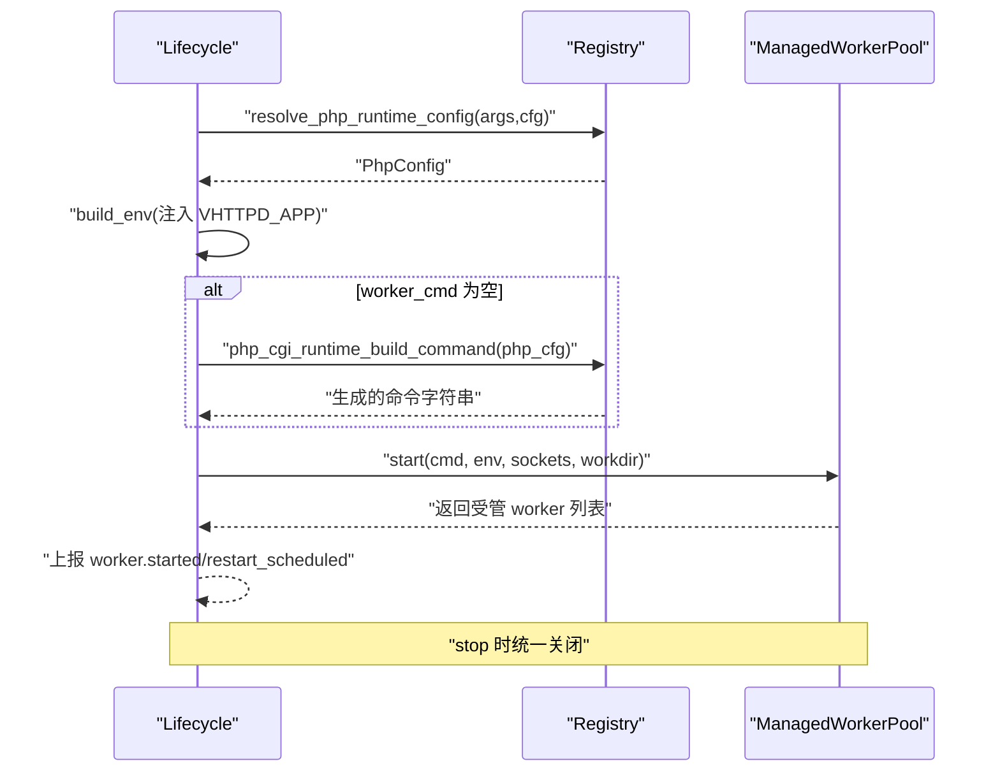
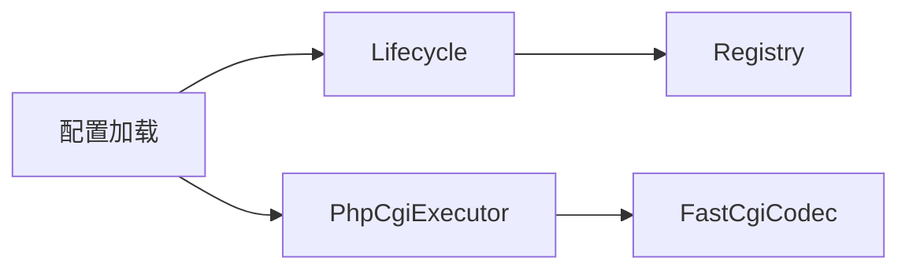

# PHP Worker 执行器

<cite>
**本文引用的文件列表**   
- [src/executor/php_cgi_executor.v](file://src/executor/php_cgi_executor.v)
- [src/upstream/transport/fastcgi.v](file://src/upstream/transport/fastcgi.v)
- [src/executor/lifecycle.v](file://src/executor/lifecycle.v)
- [src/executor/registry.v](file://src/executor/registry.v)
- [config/vhttpd.example.toml](file://config/vhttpd.example.toml)
- [examples/config/laravel.toml](file://examples/config/laravel.toml)
- [examples/config/wordpress.toml](file://examples/config/wordpress.toml)
- [README.md](file://README.md)
- [docs/EXECUTOR_MODES.md](file://docs/EXECUTOR_MODES.md)
- [articles/03-php-apps.md](file://articles/03-php-apps.md)
- [examples/wordpress/README.md](file://examples/wordpress/README.md)
</cite>

## 目录
1. [简介](#简介)
2. [项目结构](#项目结构)
3. [核心组件](#核心组件)
4. [架构总览](#架构总览)
5. [详细组件分析](#详细组件分析)
6. [依赖关系分析](#依赖关系分析)
7. [性能与调优](#性能与调优)
8. [故障排除指南](#故障排除指南)
9. [结论](#结论)
10. [附录：配置与环境变量](#附录配置与环境变量)

## 简介
本文件聚焦于 vhttpd 中的 PHP Worker 执行器，系统性阐述其工作原理、FastCGI 协议实现、进程间通信机制、Worker 池管理与生命周期管理，并给出配置项与环境变量的说明。同时提供 Laravel、WordPress 等框架的集成部署示例，以及错误处理、性能优化与故障排除方法。

vhttpd 将“请求逻辑”抽象为可插拔的执行器（executors），其中 PHP 执行器通过外部 php-worker 进程以 Unix Socket 进行通信；此外还提供 php-cgi 执行器，通过 FastCGI 协议直接调用系统 php-cgi 进程，适用于传统 CGI 场景（如 WordPress）。

## 项目结构
围绕 PHP Worker 执行器的关键代码与配置分布如下：
- 执行器实现与生命周期
  - src/executor/php_cgi_executor.v：php-cgi 执行器实现（HTTP 请求经 FastCGI 转发）
  - src/executor/lifecycle.v：PHP Worker 与 php-cgi 的生命周期准备与启动/停止
  - src/executor/registry.v：PHP 运行时命令构建与环境注入
- 传输层
  - src/upstream/transport/fastcgi.v：FastCGI 编解码与响应解析
- 配置与示例
  - config/vhttpd.example.toml：通用示例配置
  - examples/config/laravel.toml：Laravel 站点示例
  - examples/config/wordpress.toml：WordPress 站点示例
  - articles/03-php-apps.md：PHP 应用集成实战文档
  - examples/wordpress/README.md：WordPress 运行说明

图表来源
- [src/executor/php_cgi_executor.v:42-82](file://src/executor/php_cgi_executor.v#L42-L82)
- [src/upstream/transport/fastcgi.v:79-249](file://src/upstream/transport/fastcgi.v#L79-L249)
- [src/executor/lifecycle.v:97-134](file://src/executor/lifecycle.v#L97-L134)

章节来源
- [README.md:84-126](file://README.md#L84-L126)
- [docs/EXECUTOR_MODES.md:25-76](file://docs/EXECUTOR_MODES.md#L25-L76)

## 核心组件
- PhpCgiExecutor：对外暴露 HTTP 调度接口，内部通过 FastCGI 编码请求并发送至 php-cgi 进程，再解码响应返回给上层。
- FastCgiCodec：实现 FastCGI Record 的编码与解码，组装标准 CGI 环境变量，支持分帧发送参数与请求体，并解析 stdout/stderr 输出为 HTTP 响应。
- PHP Worker 生命周期：负责准备 worker 命令与环境变量、启动 ManagedWorkerPool、事件上报与优雅停止。
- Registry：根据配置生成 php-cgi 启动命令，注入扩展与参数，并将 VHTTPD_APP 注入到 worker 环境。

章节来源
- [src/executor/php_cgi_executor.v:1-118](file://src/executor/php_cgi_executor.v#L1-L118)
- [src/upstream/transport/fastcgi.v:1-386](file://src/upstream/transport/fastcgi.v#L1-L386)
- [src/executor/lifecycle.v:84-154](file://src/executor/lifecycle.v#L84-L154)
- [src/executor/registry.v:354-386](file://src/executor/registry.v#L354-L386)

## 架构总览
下图展示了从 HTTP 请求进入 vhttpd，到最终由 php-cgi 执行并返回响应的完整流程。

图表来源
- [src/executor/php_cgi_executor.v:42-82](file://src/executor/php_cgi_executor.v#L42-L82)
- [src/upstream/transport/fastcgi.v:79-249](file://src/upstream/transport/fastcgi.v#L79-L249)
- [src/upstream/transport/fastcgi.v:266-317](file://src/upstream/transport/fastcgi.v#L266-L317)

## 详细组件分析

### PhpCgiExecutor 组件
- 职责
  - 选择目标 socket（按 kind=php-cgi）
  - 设置读取超时
  - 获取该 kind 的环境覆盖（例如 VPHP_WP_ROOT、VHTTPD_INDEX 等）
  - 调用 FastCgiCodec 编码请求并写入连接
  - 解码响应并释放 socket
- 限制
  - 不支持 WebSocket、Stream、MCP 等高级能力（返回错误）

图表来源
- [src/executor/php_cgi_executor.v:1-118](file://src/executor/php_cgi_executor.v#L1-L118)
- [src/upstream/transport/fastcgi.v:76-317](file://src/upstream/transport/fastcgi.v#L76-L317)

章节来源
- [src/executor/php_cgi_executor.v:42-96](file://src/executor/php_cgi_executor.v#L42-L96)

### FastCgiCodec 组件
- 编码阶段
  - 构造 FCGI_BEGIN_REQUEST（responder 角色）
  - 组装标准 CGI 环境变量（REQUEST_METHOD、SCRIPT_FILENAME、DOCUMENT_ROOT、QUERY_STRING、HTTP_* 等）
  - 特殊处理 WordPress 场景：VPHP_WP_ROOT 存在时计算 SCRIPT_FILENAME 与 DOCUMENT_URI
  - 合并 env_overrides（过滤 HTTP_ 前缀与保留字段）
  - 分帧发送 FCGI_PARAMS（最大 65535 字节）
  - 分帧发送 FCGI_STDIN（请求体）
- 解码阶段
  - 循环读取记录头、内容、padding
  - 聚合 stdout/stderr
  - 遇到 FCGI_END_REQUEST 结束
  - 解析 stdout 为 HTTP 状态码、头部与 Body（兼容 \r\n\r\n 或 \n\n）

图表来源
- [src/upstream/transport/fastcgi.v:79-249](file://src/upstream/transport/fastcgi.v#L79-L249)
- [src/upstream/transport/fastcgi.v:266-317](file://src/upstream/transport/fastcgi.v#L266-L317)
- [src/upstream/transport/fastcgi.v:320-376](file://src/upstream/transport/fastcgi.v#L320-L376)

章节来源
- [src/upstream/transport/fastcgi.v:79-249](file://src/upstream/transport/fastcgi.v#L79-L249)
- [src/upstream/transport/fastcgi.v:266-317](file://src/upstream/transport/fastcgi.v#L266-L317)
- [src/upstream/transport/fastcgi.v:320-376](file://src/upstream/transport/fastcgi.v#L320-L376)

### Worker 池与生命周期
- 生命周期准备
  - 基于内置 spec 解析 PHP 运行时配置
  - 注入 worker 环境变量（包含 VHTTPD_APP）
  - 若未显式指定 worker_cmd，则自动生成（php-worker 或 php-cgi）
- 启动与停止
  - 根据 autostart 决定是否启动 ManagedWorkerPool
  - 启动后上报 worker.started 或 worker.restart_scheduled 事件
  - 停止时统一关闭所有受管 worker

图表来源
- [src/executor/lifecycle.v:84-154](file://src/executor/lifecycle.v#L84-L154)
- [src/executor/registry.v:354-386](file://src/executor/registry.v#L354-L386)

章节来源
- [src/executor/lifecycle.v:84-154](file://src/executor/lifecycle.v#L84-L154)
- [src/executor/registry.v:354-386](file://src/executor/registry.v#L354-L386)

## 依赖关系分析
- PhpCgiExecutor 依赖 transport.FastCgiCodec 完成请求/响应编解码
- Lifecycle 依赖 registry 提供的命令构建与环境注入
- 配置加载与路径/环境变量展开在配置模块中完成，影响 worker.cmd、worker.env、php.* 等字段

图表来源
- [src/executor/php_cgi_executor.v:42-82](file://src/executor/php_cgi_executor.v#L42-L82)
- [src/executor/lifecycle.v:84-154](file://src/executor/lifecycle.v#L84-L154)
- [src/executor/registry.v:354-386](file://src/executor/registry.v#L354-L386)

章节来源
- [src/executor/php_cgi_executor.v:1-118](file://src/executor/php_cgi_executor.v#L1-L118)
- [src/executor/lifecycle.v:1-179](file://src/executor/lifecycle.v#L1-L179)
- [src/executor/registry.v:354-386](file://src/executor/registry.v#L354-L386)

## 性能与调优
- Worker 池大小
  - 建议依据 CPU 核心数与 I/O 特性调整 pool_size
- 超时控制
  - read_timeout_ms 控制 worker 读取超时，普通请求与长流式请求应分别设置
- 队列容量与等待超时
  - queue_capacity、queue_timeout_ms 用于削峰填谷，避免瞬时峰值导致拒绝
- 定期重启
  - max_requests 配合 restart_backoff_ms/max 防止内存泄漏累积
- FastCGI 参数分帧
  - 大请求头/参数会被分帧发送，避免单帧过大导致的阻塞

章节来源
- [config/vhttpd.example.toml:19-26](file://config/vhttpd.example.toml#L19-L26)
- [docs/EXECUTOR_MODES.md:48-76](file://docs/EXECUTOR_MODES.md#L48-L76)
- [src/upstream/transport/fastcgi.v:194-216](file://src/upstream/transport/fastcgi.v#L194-L216)

## 故障排除指南
- 常见症状
  - Worker 池为空：启动后无可用 socket，会持续重试
  - 解码失败：FastCGI 响应格式异常或连接中断
  - 环境变量缺失：如 VPHP_WP_ROOT 未设置导致 WordPress 路径解析失败
- 排查步骤
  - 查看 admin/workers 与 events.ndjson 中的 worker.error 事件
  - 检查 php-cgi 是否可执行、扩展是否正确加载
  - 校验 VHTTPD_APP、VPHP_WP_ROOT、VHTTPD_INDEX 等关键环境变量
- 恢复操作
  - 重启单个或全部 worker
  - 调整 read_timeout_ms、pool_size、max_requests 等参数

章节来源
- [src/executor/lifecycle.v:104-130](file://src/executor/lifecycle.v#L104-L130)
- [src/executor/php_cgi_executor.v:69-76](file://src/executor/php_cgi_executor.v#L69-L76)
- [src/upstream/transport/fastcgi.v:311-317](file://src/upstream/transport/fastcgi.v#L311-L317)

## 结论
vhttpd 的 PHP Worker 执行器提供了两种模式：
- php-worker：通过 Unix Socket 与外部 php-worker 进程通信，适合 PSR-7 应用与自定义入口
- php-cgi：通过 FastCGI 协议直接驱动系统 php-cgi，适合传统 CGI 应用（如 WordPress）

两者共享统一的执行器抽象与生命周期管理，便于运维观测与扩展。结合合理的超时、队列与池化配置，可在保证稳定性的前提下获得良好的吞吐与延迟表现。

## 附录：配置与环境变量

### 通用示例配置
- 参考：[config/vhttpd.example.toml](file://config/vhttpd.example.toml)
- 关键字段
  - [server]：监听地址与端口
  - [files]：pid_file、event_log
  - [runtime]：timezone
  - [worker]：autostart、pool_size、socket/socket_prefix、read_timeout_ms、max_requests、restart_backoff_*
  - [executor]：kind = "php" 或 "php-cgi"
  - [php]：bin、worker_entry、app_entry、extensions、args
  - [worker.env]：向 worker 进程注入的环境变量

章节来源
- [config/vhttpd.example.toml:1-67](file://config/vhttpd.example.toml#L1-L67)

### Laravel 集成
- 配置文件：[examples/config/laravel.toml](file://examples/config/laravel.toml)
- 关键点
  - worker.cmd 指向 php-worker 入口
  - worker.env.VHTTPD_APP 指向 Laravel 应用入口 app.php
  - 使用 PSR-7 桥接模式，保持框架原生体验
- 实战说明：参见 [articles/03-php-apps.md](file://articles/03-php-apps.md)

章节来源
- [examples/config/laravel.toml:1-23](file://examples/config/laravel.toml#L1-L23)
- [articles/03-php-apps.md:51-160](file://articles/03-php-apps.md#L51-L160)

### WordPress 集成
- 配置文件：[examples/config/wordpress.toml](file://examples/config/wordpress.toml)
- 关键点
  - 使用 vphp-worker 作为 worker 入口
  - 设置 VHTTPD_APP 指向应用引导脚本
  - 设置 VPHP_WP_ROOT 指向 WordPress 根目录，以便正确解析 SCRIPT_FILENAME 与 DOCUMENT_URI
- 运行说明：参见 [examples/wordpress/README.md](file://examples/wordpress/README.md)

章节来源
- [examples/config/wordpress.toml:1-23](file://examples/config/wordpress.toml#L1-L23)
- [examples/wordpress/README.md:1-46](file://examples/wordpress/README.md#L1-L46)

### 环境变量与覆盖
- 常用环境变量
  - VHTTPD_APP：PHP 应用入口（由 registry 自动注入）
  - VPHP_WP_ROOT：WordPress 根目录（用于 FastCGI 参数计算）
  - VHTTPD_INDEX：首页文件名（默认 index.php）
  - VHTTPD_TRACE_ID、VHTTPD_REQUEST_ID：追踪与请求标识
- 行为说明
  - FastCGI 编码器会将 HTTP 头转换为 HTTP_* 环境变量
  - CONTENT_TYPE、CONTENT_LENGTH 不带 HTTP_ 前缀
  - env_overrides 会合并进 CGI 环境变量，但会过滤 HTTP_ 前缀与保留字段

章节来源
- [src/executor/registry.v:354-360](file://src/executor/registry.v#L354-L360)
- [src/upstream/transport/fastcgi.v:101-180](file://src/upstream/transport/fastcgi.v#L101-L180)