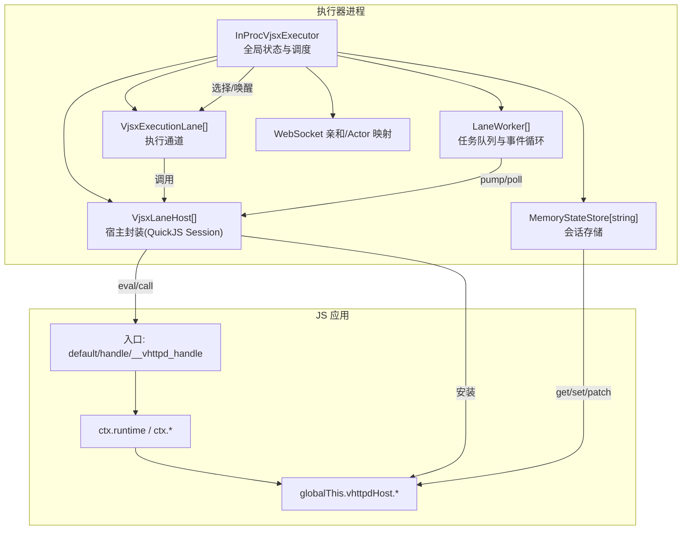
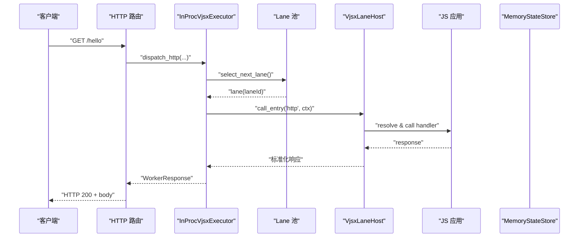
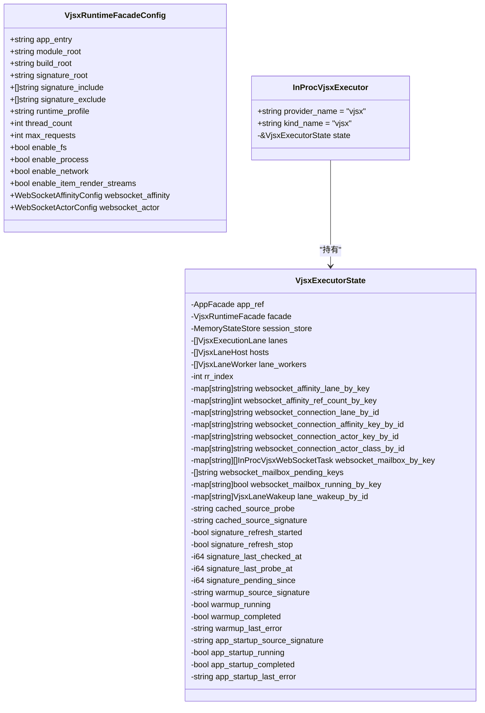
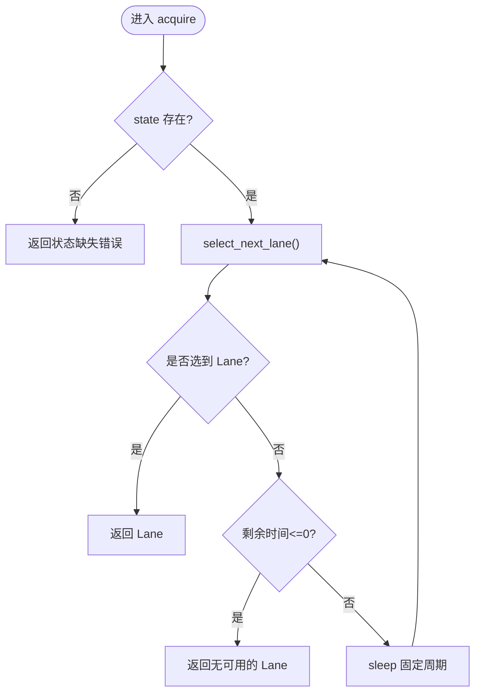
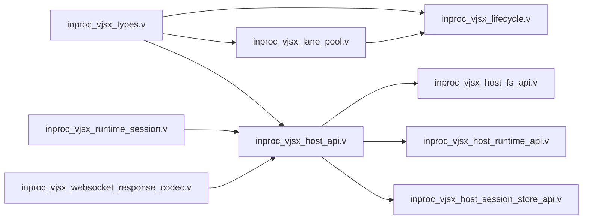

# VJSX 嵌入式执行器

<cite>
**本文引用的文件**
- [inproc_vjsx_types.v](file://src/executor/inproc_vjsx_types.v)
- [inproc_vjsx_lifecycle.v](file://src/executor/inproc_vjsx_lifecycle.v)
- [inproc_vjsx_lane_pool.v](file://src/executor/inproc_vjsx_lane_pool.v)
- [inproc_vjsx_runtime_session.v](file://src/executor/inproc_vjsx_runtime_session.v)
- [inproc_vjsx_host_api.v](file://src/executor/inproc_vjsx_host_api.v)
- [inproc_vjsx_host_runtime_api.v](file://src/executor/inproc_vjsx_host_runtime_api.v)
- [inproc_vjsx_host_fs_api.v](file://src/executor/inproc_vjsx_host_fs_api.v)
- [inproc_vjsx_host_session_store_api.v](file://src/executor/inproc_vjsx_host_session_store_api.v)
- [inproc_vjsx_websocket_response_codec.v](file://src/executor/inproc_vjsx_websocket_response_codec.v)
- [VJSX_FACADE_REFERENCE.md](file://docs/VJSX_FACADE_REFERENCE.md)
- [EXECUTOR_MODES.md](file://docs/EXECUTOR_MODES.md)
- [INPROC_VJSX_RUNBOOK.md](file://docs/INPROC_VJSX_RUNBOOK.md)
- [08-vjsx-intro.md](file://articles/08-vjsx-intro.md)
- [server_logic_test.v](file://src/server_logic_test.v)
</cite>

## 目录
1. [简介](#简介)
2. [项目结构](#项目结构)
3. [核心组件](#核心组件)
4. [架构总览](#架构总览)
5. [详细组件分析](#详细组件分析)
6. [依赖关系分析](#依赖关系分析)
7. [性能与资源管理](#性能与资源管理)
8. [安全与权限控制](#安全与权限控制)
9. [开发指南与最佳实践](#开发指南与最佳实践)
10. [故障排查](#故障排查)
11. [结论](#结论)

## 简介
本文件系统性阐述 vhttpd 内置的 VJSX 嵌入式执行器，覆盖其架构设计、执行环境、模块加载、线程模型、内存与资源管理、与宿主进程的通信机制、会话与状态持久化、以及面向应用的 Facade API。同时提供开发规范、调试技巧、性能优化建议与安全策略，并给出可运行的示例与最佳实践路径。

## 项目结构
VJSX 执行器位于 executor 模块内，围绕“Lane（执行通道）+ Host（宿主封装）+ Worker（任务派发）”组织：
- 类型与状态：定义执行器全局状态、Lane、Host、配置等核心数据结构
- 生命周期：构造执行器、初始化 Lane/Host、签名探测与热更新准备
- 运行时会话：基于 QuickJS 的 RuntimeSession 工厂，支持 script/node 两种运行画像
- 宿主 API：向 JS 侧暴露 emit/snapshot/sessionStore/config/httpFetch/bridgeDispatch/websocketDispatch 等能力
- 调度与池化：按 RR 选择可用 Lane，支持超时等待与显式 laneId 绑定
- WebSocket 编解码：将 JS 返回规范化为内部命令帧或上游响应

图表来源
- [inproc_vjsx_types.v:1-90](file://src/executor/inproc_vjsx_types.v#L1-L90)
- [inproc_vjsx_lifecycle.v:16-59](file://src/executor/inproc_vjsx_lifecycle.v#L16-L59)
- [inproc_vjsx_runtime_session.v:11-36](file://src/executor/inproc_vjsx_runtime_session.v#L11-L36)
- [inproc_vjsx_host_api.v:18-58](file://src/executor/inproc_vjsx_host_api.v#L18-L58)
- [inproc_vjsx_lane_pool.v:5-30](file://src/executor/inproc_vjsx_lane_pool.v#L5-L30)

章节来源
- [inproc_vjsx_types.v:1-90](file://src/executor/inproc_vjsx_types.v#L1-L90)
- [inproc_vjsx_lifecycle.v:16-59](file://src/executor/inproc_vjsx_lifecycle.v#L16-L59)
- [inproc_vjsx_runtime_session.v:11-36](file://src/executor/inproc_vjsx_runtime_session.v#L11-L36)
- [inproc_vjsx_host_api.v:18-58](file://src/executor/inproc_vjsx_host_api.v#L18-L58)
- [inproc_vjsx_lane_pool.v:5-30](file://src/executor/inproc_vjsx_lane_pool.v#L5-L30)

## 核心组件
- InProcVjsxExecutor 与 VjsxExecutorState：维护全局锁、Lane 列表、Host 列表、WebSocket 亲和/Actor 映射、签名探测与启动钩子状态等
- VjsxExecutionLane：单条执行通道，记录请求计数、健康度、脏标记、并发数、错误信息
- VjsxLaneHost：封装一个 QuickJS RuntimeSession 与可选 ScriptModule，负责入口解析、方法调用、上下文注入与资源释放
- MemoryStateStore[string]：进程内键值存储，用于跨请求/跨通道的轻量会话数据
- RuntimeSessionFactory：根据 runtime_profile 创建 script 或 node 模式的 RuntimeSession，并注入资产根与进程参数
- Host API：通过 HostApiConfig 安装到 JS 全局，提供 emit/snapshot/sessionStore/config/readTextFile/findCodexSessionPath/httpFetch/bridgeDispatch/websocketDispatch

章节来源
- [inproc_vjsx_types.v:44-90](file://src/executor/inproc_vjsx_types.v#L44-L90)
- [inproc_vjsx_runtime_session.v:11-36](file://src/executor/inproc_vjsx_runtime_session.v#L11-L36)
- [inproc_vjsx_host_api.v:18-58](file://src/executor/inproc_vjsx_host_api.v#L18-L58)
- [inproc_vjsx_host_session_store_api.v:7-136](file://src/executor/inproc_vjsx_host_session_store_api.v#L7-L136)

## 架构总览
VJSX 以“嵌入式模式”运行，无需外部 PHP worker；HTTP/WebSocket Upstream 由 vhttpd 直接分发至在进程内的 QuickJS 实例。

图表来源
- [inproc_vjsx_lane_pool.v:5-30](file://src/executor/inproc_vjsx_lane_pool.v#L5-L30)
- [inproc_vjsx_host_api.v:18-58](file://src/executor/inproc_vjsx_host_api.v#L18-L58)
- [inproc_vjsx_websocket_response_codec.v:23-50](file://src/executor/inproc_vjsx_websocket_response_codec.v#L23-L50)

章节来源
- [EXECUTOR_MODES.md:82-124](file://docs/EXECUTOR_MODES.md#L82-L124)
- [INPROC_VJSX_RUNBOOK.md:1-92](file://docs/INPROC_VJSX_RUNBOOK.md#L1-L92)

## 详细组件分析

### 执行器类型与状态
- VjsxRuntimeFacadeConfig：包含 app_entry/module_root/build_root/signature_*、runtime_profile/thread_count/max_requests、能力开关（fs/process/network）、WebSocket 亲和与 Actor 配置
- VjsxExecutorState：集中持有 AppFacade 引用、RuntimeFacade、会话存储、Lane/Host/Worker 列表、RR 索引、WebSocket 亲和/Actor 映射、邮箱与唤醒表、源码签名探测与启动钩子状态
- InProcVjsxExecutor：对外暴露 provider_name/kind_name，持有 state 指针

图表来源
- [inproc_vjsx_types.v:7-90](file://src/executor/inproc_vjsx_types.v#L7-L90)

章节来源
- [inproc_vjsx_types.v:7-90](file://src/executor/inproc_vjsx_types.v#L7-L90)

### 生命周期与初始化
- new_inproc_vjsx_executor：根据 thread_count 创建 Lane 与对应 Host/Worker；初始化签名探测与启动钩子状态；注册内存态会话存储
- remember_app：保存 AppFacade 引用，供 snapshot/emit 使用

章节来源
- [inproc_vjsx_lifecycle.v:16-59](file://src/executor/inproc_vjsx_lifecycle.v#L16-L59)

### 运行时会话与入口解析
- RuntimeSessionFactory：依据 runtime_profile 选择 script 或 node 模式，设置 fs_roots、process_args、asset_root
- VjsxLaneHost：封装 session/context，提供 call_handler/call_global/call_entry 等方法；入口解析优先模块导出（default/别名），回退到全局函数

章节来源
- [inproc_vjsx_runtime_session.v:11-36](file://src/executor/inproc_vjsx_runtime_session.v#L11-L36)
- [inproc_vjsx_host_api.v:18-58](file://src/executor/inproc_vjsx_host_api.v#L18-L58)

### 线程模型与 Lane 池
- select_next_lane：轮询选择 inflight=0 且 healthy/dirty 可用的 Lane，并增加 inflight
- acquire_next_lane/acquire_lane_by_id：带超时重试的 Lane 获取，避免忙等
- release_lane：处理完成后减少 inflight，并尝试调度待处理的 WebSocket 邮箱

图表来源
- [inproc_vjsx_lane_pool.v:83-124](file://src/executor/inproc_vjsx_lane_pool.v#L83-L124)

章节来源
- [inproc_vjsx_lane_pool.v:5-144](file://src/executor/inproc_vjsx_lane_pool.v#L5-L144)

### 宿主 API 与 JS Facade
- globalThis.vhttpdHost：统一宿主能力入口，包括 emit/snapshot/sessionStore/config/readTextFile/findCodexSessionPath/httpFetch/bridgeDispatch/websocketDispatch
- ctx.runtime：只读执行元数据与方法（now/log/warn/error/emit/snapshot/readTextFile/findCodexSessionPath/httpFetch/bridgeDispatch/websocketDispatch）
- 入口解析顺序：export default > export const handle > globalThis.__vhttpd_handle

章节来源
- [VJSX_FACADE_REFERENCE.md:1-280](file://docs/VJSX_FACADE_REFERENCE.md#L1-L280)
- [inproc_vjsx_host_api.v:18-58](file://src/executor/inproc_vjsx_host_api.v#L18-L58)

### 事件与快照
- emit：从 JS 侧触发结构化事件，自动附加 lane/request/trace/method/path/executor/provider 等维度
- snapshot：支持按 scope(kind=lane/all_lanes/other_lanes) 聚合应用/运行时快照，或返回当前应用 admin 快照

章节来源
- [inproc_vjsx_host_runtime_api.v:6-137](file://src/executor/inproc_vjsx_host_runtime_api.v#L6-L137)

### 文件系统与 Codex 会话定位
- readTextFile/findCodexSessionPath：受 enable_fs 开关保护，读取文本文件或查找 Codex 会话路径

章节来源
- [inproc_vjsx_host_fs_api.v:1-57](file://src/executor/inproc_vjsx_host_fs_api.v#L1-L57)

### 会话存储（进程内 KV）
- sessionStore：支持 get/set/patch/delete/exists/keys，namespace:key 全键，支持 TTL 与 CAS 操作，返回 JSON 编码的统一响应

章节来源
- [inproc_vjsx_host_session_store_api.v:7-136](file://src/executor/inproc_vjsx_host_session_store_api.v#L7-L136)

### WebSocket 编解码与上游
- websocket_upstream_from_js_value：将 JS 返回值规范化为内部 WorkerWebSocketUpstreamDispatchResponse，含 handled/commands/status/headers/body

章节来源
- [inproc_vjsx_websocket_response_codec.v:1-50](file://src/executor/inproc_vjsx_websocket_response_codec.v#L1-L50)

## 依赖关系分析
- 执行器对 vjsx 库的依赖：Context/RuntimeSession/ScriptModule 等
- 对 state_store 的依赖：进程内 KV 存储
- 对 upstream.transport 的依赖：WebSocket 上游命令与响应类型
- 对 config 的依赖：WebSocket 亲和/Actor 配置项

图表来源
- [inproc_vjsx_types.v:1-90](file://src/executor/inproc_vjsx_types.v#L1-L90)
- [inproc_vjsx_lifecycle.v:16-59](file://src/executor/inproc_vjsx_lifecycle.v#L16-L59)
- [inproc_vjsx_lane_pool.v:5-30](file://src/executor/inproc_vjsx_lane_pool.v#L5-L30)
- [inproc_vjsx_runtime_session.v:11-36](file://src/executor/inproc_vjsx_runtime_session.v#L11-L36)
- [inproc_vjsx_host_api.v:18-58](file://src/executor/inproc_vjsx_host_api.v#L18-L58)
- [inproc_vjsx_host_fs_api.v:1-57](file://src/executor/inproc_vjsx_host_fs_api.v#L1-L57)
- [inproc_vjsx_host_runtime_api.v:6-137](file://src/executor/inproc_vjsx_host_runtime_api.v#L6-L137)
- [inproc_vjsx_host_session_store_api.v:7-136](file://src/executor/inproc_vjsx_host_session_store_api.v#L7-L136)
- [inproc_vjsx_websocket_response_codec.v:1-50](file://src/executor/inproc_vjsx_websocket_response_codec.v#L1-L50)

章节来源
- [PROTOCOL_PIPELINE_IMPLEMENTATION_PLAN.md:1037-1113](file://docs/PROTOCOL_PIPELINE_IMPLEMENTATION_PLAN.md#L1037-L1113)

## 性能与资源管理
- 线程模型：thread_count 决定 Lane 数量；每个 Lane 对应一个 QuickJS RuntimeSession；RR 调度降低热点；inflight 计数防止过载
- 超时等待：acquire_next_lane 支持毫秒级轮询等待，避免忙等
- 资源释放：VjsxLaneHost.destroy 关闭 session/module_binding 并清理临时目录
- 构建缓存：transpile 产物写入系统临时目录，避免污染源码树
- 运行画像：script/node 两种 profile，便于诊断缺失模块与行为差异

章节来源
- [inproc_vjsx_lane_pool.v:83-124](file://src/executor/inproc_vjsx_lane_pool.v#L83-L124)
- [inproc_vjsx_runtime_session.v:11-36](file://src/executor/inproc_vjsx_runtime_session.v#L11-L36)
- [INPROC_VJSX_RUNBOOK.md:54-66](file://docs/INPROC_VJSX_RUNBOOK.md#L54-L66)

## 安全与权限控制
- 能力开关：enable_fs/enable_process/enable_network 控制 JS 侧能力面
- 文件系统访问：readTextFile/findCodexSessionPath 仅在 enable_fs=true 时生效
- 会话隔离：sessionStore 基于 namespace:key 命名空间隔离
- 输入校验：sessionStore 严格校验 namespace/key/op 字段，非法请求返回错误码
- 进程边界：vjsx 模式禁用 worker 自启动与 worker sockets，缩小攻击面

章节来源
- [inproc_vjsx_types.v:7-24](file://src/executor/inproc_vjsx_types.v#L7-L24)
- [inproc_vjsx_host_fs_api.v:1-57](file://src/executor/inproc_vjsx_host_fs_api.v#L1-L57)
- [inproc_vjsx_host_session_store_api.v:7-136](file://src/executor/inproc_vjsx_host_session_store_api.v#L7-L136)
- [EXECUTOR_MODES.md:115-124](file://docs/EXECUTOR_MODES.md#L115-L124)

## 开发指南与最佳实践
- 入口约定：优先使用 export default；其次 export const handle；最后 globalThis.__vhttpd_handle
- 请求上下文：使用 ctx.method/path/query/headers/body 及 helpers（queryParam/jsonBody/isJson 等）
- 响应构造：使用 ctx.json/text/html/send/reply 与语义化 helper（ok/created/noContent/badRequest/notFound/problem）
- 运行时能力：ctx.runtime.log/warn/error/emit/snapshot/httpFetch/bridgeDispatch/websocketDispatch
- 宿主能力：globalThis.vhttpdHost.sessionStore 进行跨请求/跨 Lane 的轻量状态共享
- 调试技巧：结合 Admin Plane 事件日志与 runtime.snapshot；使用 ctx.runtime.emit 输出结构化指标
- 性能优化：合理设置 thread_count；利用 sessionStore 做短 TTL 缓存；避免阻塞调用；按需启用网络/文件能力

章节来源
- [VJSX_FACADE_REFERENCE.md:1-280](file://docs/VJSX_FACADE_REFERENCE.md#L1-L280)
- [08-vjsx-intro.md:94-236](file://articles/08-vjsx-intro.md#L94-L236)
- [INPROC_VJSX_RUNBOOK.md:54-66](file://docs/INPROC_VJSX_RUNBOOK.md#L54-L66)

## 故障排查
- 无法找到入口：确认模块导出或全局函数名符合约定
- 无可用 Lane：检查 thread_count 与并发负载；关注 inflight 与 healthy/dirty 标记
- 会话读写失败：检查 namespace/key 是否为空；op 是否合法；TTL/CAS 条件是否满足
- 文件读取为空：确认 enable_fs 已开启且路径可达
- WebSocket 上游未处理：检查返回值规范化是否符合 expected shape

章节来源
- [inproc_vjsx_lane_pool.v:5-30](file://src/executor/inproc_vjsx_lane_pool.v#L5-L30)
- [inproc_vjsx_host_session_store_api.v:7-136](file://src/executor/inproc_vjsx_host_session_store_api.v#L7-L136)
- [inproc_vjsx_host_fs_api.v:1-57](file://src/executor/inproc_vjsx_host_fs_api.v#L1-L57)
- [inproc_vjsx_websocket_response_codec.v:23-50](file://src/executor/inproc_vjsx_websocket_response_codec.v#L23-L50)

## 结论
VJSX 嵌入式执行器以“Lane + Host + Worker”的清晰分层，提供了高性能、低耦合的 TS/JS 执行环境。通过严格的宿主 API 与能力开关，兼顾了易用性与安全性；配合进程内会话存储与结构化事件/快照，形成完整的开发与运维闭环。建议在网关/中间件/协议适配等“薄逻辑层”场景优先采用 vjsx，复杂业务则与 PHP 协同工作。