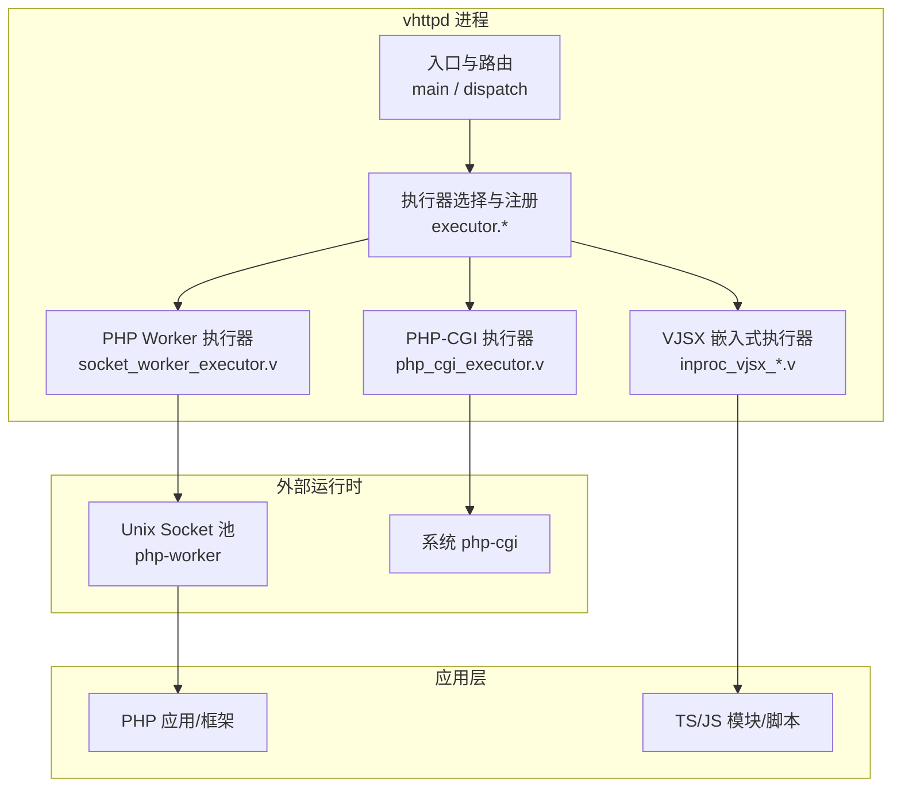
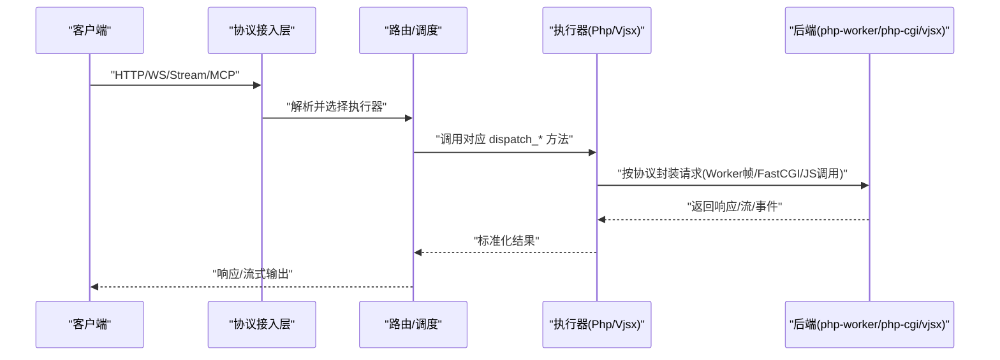
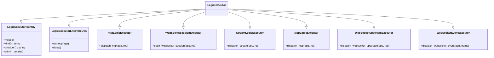
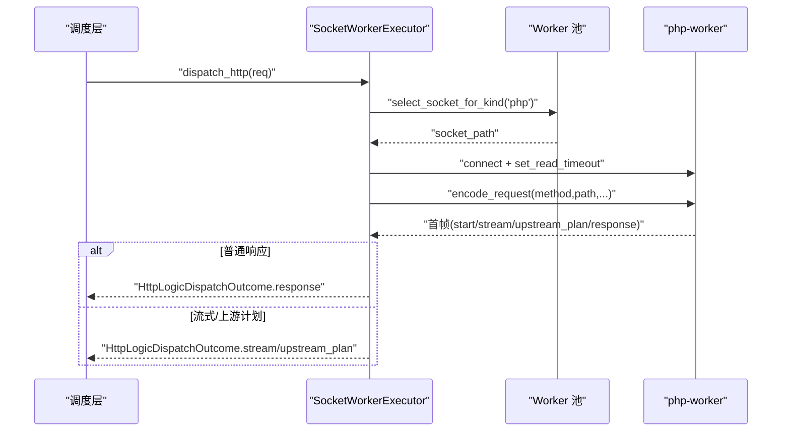
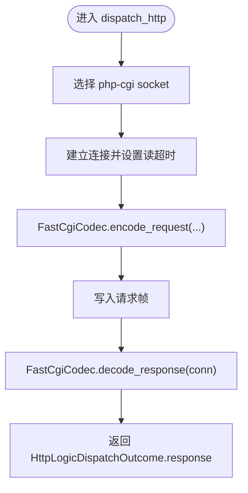
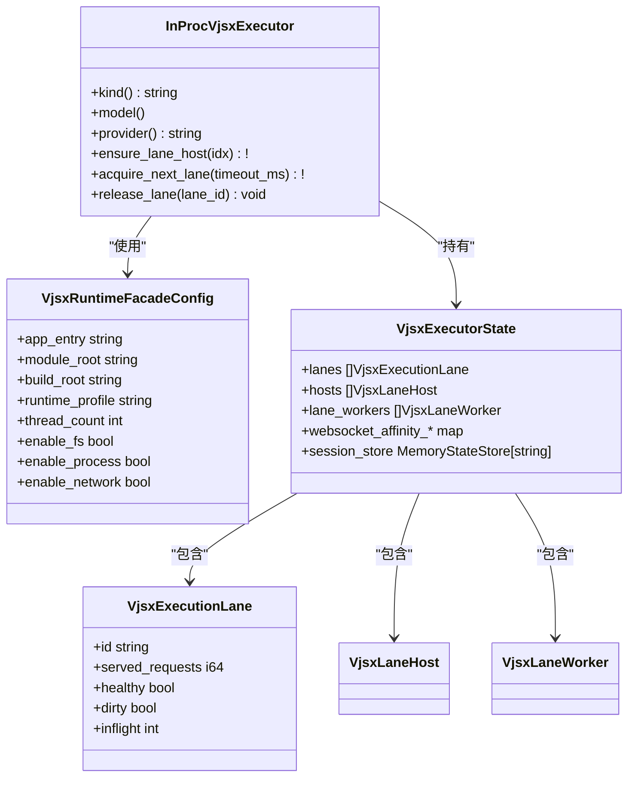
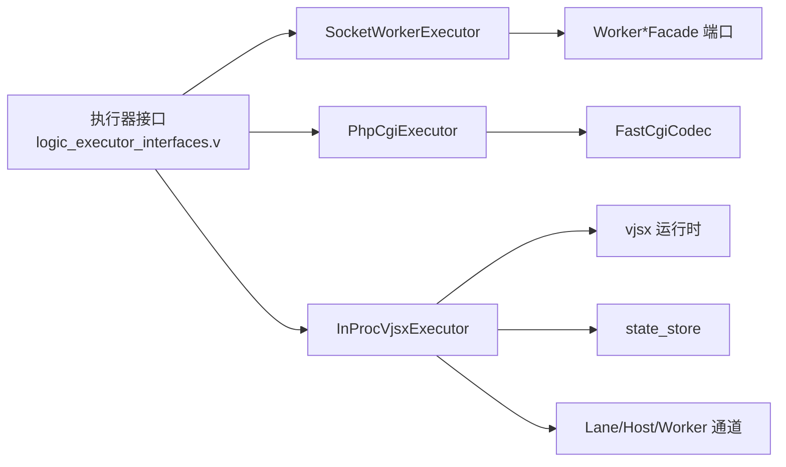

# 执行器开发

<cite>
**本文引用的文件**   
- [README.md](file://README.md)
- [EXECUTOR_MODES.md](file://docs/EXECUTOR_MODES.md)
- [OVERVIEW.md](file://docs/OVERVIEW.md)
- [transport_contract.md](file://docs/transport_contract.md)
- [logic_executor_interfaces.v](file://src/executor/logic_executor_interfaces.v)
- [socket_worker_executor.v](file://src/executor/socket_worker_executor.v)
- [php_cgi_executor.v](file://src/executor/php_cgi_executor.v)
- [inproc_vjsx_types.v](file://src/executor/inproc_vjsx_types.v)
- [inproc_vjsx_lifecycle.v](file://src/executor/inproc_vjsx_lifecycle.v)
- [inproc_vjsx_lane_pool.v](file://src/executor/inproc_vjsx_lane_pool.v)
- [inproc_vjsx_lane_worker_runtime.v](file://src/executor/inproc_vjsx_lane_worker_runtime.v)
- [inproc_vjsx_host_api.v](file://src/executor/inproc_vjsx_host_api.v)
- [app_facade_ports.v](file://src/executor/app_facade_ports.v)
- [config.v](file://src/config/config.v)
- [server_logic_test.v](file://src/server_logic_test.v)
</cite>

## 目录
1. [引言](#引言)
2. [项目结构](#项目结构)
3. [核心组件](#核心组件)
4. [架构总览](#架构总览)
5. [详细组件分析](#详细组件分析)
6. [依赖关系分析](#依赖关系分析)
7. [性能考虑](#性能考虑)
8. [故障排除指南](#故障排除指南)
9. [结论](#结论)
10. [附录](#附录)

## 引言
本指南面向希望扩展或自定义 VHTTPD 执行器的开发者，系统性阐述执行器接口、生命周期管理、错误处理与扩展机制；深入解析 PHP Worker 执行器（进程间通信、Worker 池、CGI 协议）与 VJSX 嵌入式执行器（TS/JS 执行、模块加载、线程模型、内存管理）；并提供自定义执行器的实现步骤、测试方法与部署建议，以及性能优化与排障要点。

## 项目结构
VHTTPD 将“请求逻辑”抽象为可插拔的执行器，当前内置两类：
- php：通过 Unix Socket 与外部 PHP Worker 通信
- vjsx：在进程内嵌入 QuickJS 运行 TypeScript/JavaScript

图表来源
- [README.md:84-126](file://README.md#L84-L126)
- [logic_executor_interfaces.v:1-51](file://src/executor/logic_executor_interfaces.v#L1-L51)
- [socket_worker_executor.v:1-157](file://src/executor/socket_worker_executor.v#L1-L157)
- [php_cgi_executor.v:1-118](file://src/executor/php_cgi_executor.v#L1-L118)
- [inproc_vjsx_types.v:1-90](file://src/executor/inproc_vjsx_types.v#L1-L90)

章节来源
- [README.md:84-126](file://README.md#L84-L126)
- [EXECUTOR_MODES.md:1-104](file://docs/EXECUTOR_MODES.md#L1-L104)

## 核心组件
- 执行器统一接口族
  - 身份与生命周期：LogicExecutorIdentity、LogicExecutorLifecycleOps
  - HTTP/WebSocket/Stream/MCP/WebSocket Upstream/Event 等能力接口
  - 组合接口 LogicExecutor 聚合上述能力
- 内置执行器
  - SocketWorkerExecutor：基于 Unix Socket 的 PHP Worker 执行器
  - PhpCgiExecutor：基于 FastCGI 的 PHP CGI 执行器
  - InProcVjsxExecutor：进程内 TS/JS 执行器（多 Lane/Host/Worker）
- 应用门面与后端端口
  - AppFacade 及 WorkerBackendConfigFacade/WorkerSocketFacade 等端口用于解耦执行器与底层资源

章节来源
- [logic_executor_interfaces.v:1-51](file://src/executor/logic_executor_interfaces.v#L1-L51)
- [app_facade_ports.v:1-38](file://src/executor/app_facade_ports.v#L1-L38)

## 架构总览
执行器是 vhttpd 的核心扩展点。HTTP/WebSocket/Stream/MCP 等协议入站后，由调度层根据配置选择具体执行器实例进行分发。执行器负责：
- 生命周期：warmup/close
- 协议适配：HTTP/WS/Stream/MCP 等
- 资源编排：Worker 池、Lane 池、事件循环、会话存储等

图表来源
- [README.md:84-126](file://README.md#L84-L126)
- [OVERVIEW.md:127-164](file://docs/OVERVIEW.md#L127-L164)
- [transport_contract.md](file://docs/transport_contract.md)

## 详细组件分析

### 执行器接口与生命周期
- 身份与元数据
  - model()/kind()/provider() 标识执行器类型与提供者
  - admin_details() 暴露给管理端查看
- 生命周期
  - warmup(mut app): 预热阶段，可初始化资源
  - close(): 优雅关闭
- 能力接口
  - HttpLogicExecutor.dispatch_http
  - WebSocketSessionExecutor.open_websocket_session
  - StreamLogicExecutor.dispatch_stream
  - McpLogicExecutor.dispatch_mcp
  - WebSocketUpstreamExecutor.dispatch_websocket_upstream
  - WebSocketEventExecutor.dispatch_websocket_event

图表来源
- [logic_executor_interfaces.v:1-51](file://src/executor/logic_executor_interfaces.v#L1-L51)

章节来源
- [logic_executor_interfaces.v:1-51](file://src/executor/logic_executor_interfaces.v#L1-L51)

### PHP Worker 执行器（SocketWorkerExecutor）
- 模型与定位
  - model=worker，kind="php"，provider="php-worker"
- 关键流程
  - HTTP：选择 socket -> 连接 -> 编码 WorkerHttpRequest -> 发送 -> 读取首帧 -> 判断是否 stream/upstream_plan/response -> 返回
  - WebSocket：选择队列中的 socket -> 发起握手 -> 接受/拒绝 -> 返回连接句柄
  - Stream/MCP/WebSocket Upstream/Event：委托到对应的 worker_dispatch_* 端口
- 错误处理
  - 连接失败/读写超时/解码失败均返回错误，确保 socket 释放与计数更新

图表来源
- [socket_worker_executor.v:43-95](file://src/executor/socket_worker_executor.v#L43-L95)
- [app_facade_ports.v:20-38](file://src/executor/app_facade_ports.v#L20-L38)

章节来源
- [socket_worker_executor.v:1-157](file://src/executor/socket_worker_executor.v#L1-L157)
- [app_facade_ports.v:1-38](file://src/executor/app_facade_ports.v#L1-L38)

### PHP-CGI 执行器（PhpCgiExecutor）
- 模型与定位
  - model=worker，kind="php-cgi"，provider="php-cgi"
- 关键流程
  - HTTP：选择 socket -> 连接 -> 使用 FastCgiCodec.encode_request 编码 -> 写入 -> decode_response 解码 -> 返回
  - 其他能力（WebSocket/Stream/MCP/Upstream/Event）：显式返回不支持
- 适用场景
  - 兼容传统 php-cgi 环境，无需额外 worker 进程

图表来源
- [php_cgi_executor.v:42-82](file://src/executor/php_cgi_executor.v#L42-L82)

章节来源
- [php_cgi_executor.v:1-118](file://src/executor/php_cgi_executor.v#L1-L118)

### VJSX 嵌入式执行器（InProcVjsxExecutor）
- 模型与定位
  - model=embedded，kind="vjsx"，provider="vjsx"
  - 无外部 worker，进程内运行 TS/JS
- 线程与 Lane 模型
  - 通过 thread_count 创建若干 ExecutionLane，每个 Lane 维护一个 Host（QuickJS Runtime Session）
  - 负载均衡采用轮询+健康检查，支持按 ID 亲和绑定
- 宿主 API 注入
  - 向 JS 上下文安装 vhttpdHost.emit/snapshot/sessionStore/config/httpFetch 等能力
- 启动与热更新
  - ensure_lane_host 负责按需初始化/重置 Host，检测 source_signature 变化触发重建
  - 支持模块模式与脚本模式两种入口，自动探测 http/websocket/websocket_upstream/plugin 导出
- 任务派发与邮箱
  - 每 Lane 有独立 worker 协程，处理 websocket 回调、快照、预热、亲和等任务
  - 通过 channel 与主状态同步，避免竞态

图表来源
- [inproc_vjsx_types.v:1-90](file://src/executor/inproc_vjsx_types.v#L1-L90)
- [inproc_vjsx_lifecycle.v:16-87](file://src/executor/inproc_vjsx_lifecycle.v#L16-L87)
- [inproc_vjsx_lane_pool.v:1-144](file://src/executor/inproc_vjsx_lane_pool.v#L1-L144)
- [inproc_vjsx_lane_worker_runtime.v:1-87](file://src/executor/inproc_vjsx_lane_worker_runtime.v#L1-L87)
- [inproc_vjsx_host_api.v:1-59](file://src/executor/inproc_vjsx_host_api.v#L1-L59)

章节来源
- [inproc_vjsx_types.v:1-90](file://src/executor/inproc_vjsx_types.v#L1-L90)
- [inproc_vjsx_lifecycle.v:1-193](file://src/executor/inproc_vjsx_lifecycle.v#L1-L193)
- [inproc_vjsx_lane_pool.v:1-144](file://src/executor/inproc_vjsx_lane_pool.v#L1-L144)
- [inproc_vjsx_lane_worker_runtime.v:1-87](file://src/executor/inproc_vjsx_lane_worker_runtime.v#L1-L87)
- [inproc_vjsx_host_api.v:1-59](file://src/executor/inproc_vjsx_host_api.v#L1-L59)

### 配置与站点级执行器选择
- 全局与站点级配置
  - SiteConfig 包含 executor、php、vjsx、worker 等字段，支持多站点独立执行器
  - ExecutorSpecConfig 对 executors 子项进行结构化描述
- 别名与归一化
  - 支持 'php-worker'/'php_worker' 归一化为 'php'，'none'/'disabled'/'noop' 归一化为 'none'
  - 测试覆盖 vjsx 选择与 worker_backend_mode=disabled 的行为

章节来源
- [config.v:343-392](file://src/config/config.v#L343-L392)
- [server_logic_test.v:1723-1750](file://src/server_logic_test.v#L1723-L1750)

## 依赖关系分析
- 执行器与后端端口
  - SocketWorkerExecutor 依赖 WorkerSocketFacade/WorkerBackendConfigFacade 完成 socket 选择、超时与 WS 握手
  - PhpCgiExecutor 依赖 transport.FastCgiCodec 完成协议编解码
- VJSX 执行器依赖
  - vjsx 运行时与 runtimejs 模块加载
  - state_store 提供内存会话存储
  - 内部 lane/host/worker 通道协调任务

图表来源
- [logic_executor_interfaces.v:1-51](file://src/executor/logic_executor_interfaces.v#L1-L51)
- [app_facade_ports.v:1-38](file://src/executor/app_facade_ports.v#L1-L38)
- [php_cgi_executor.v:1-118](file://src/executor/php_cgi_executor.v#L1-L118)
- [inproc_vjsx_types.v:1-90](file://src/executor/inproc_vjsx_types.v#L1-L90)

章节来源
- [app_facade_ports.v:1-38](file://src/executor/app_facade_ports.v#L1-L38)
- [php_cgi_executor.v:1-118](file://src/executor/php_cgi_executor.v#L1-L118)
- [inproc_vjsx_types.v:1-90](file://src/executor/inproc_vjsx_types.v#L1-L90)

## 性能考虑
- PHP Worker 模式
  - 合理设置 pool_size、read_timeout_ms、max_requests、restart_backoff_*，避免频繁重启与长连接阻塞
  - 利用 stream_dispatch 与 upstream_plan 降低长时请求占用 worker
- VJSX 模式
  - thread_count 决定并发 Lane 数，需结合 CPU 核数与任务 IO 特性调优
  - enable_fs/enable_process/enable_network 按需开启，减少沙箱开销
  - 使用 build_root 稳定构建产物便于缓存与调试
- 通用
  - 控制 queue_capacity/queue_timeout_ms 防止背压放大
  - 分离 admin 端口，避免管理流量影响业务

[本节为通用指导，不直接分析具体文件]

## 故障排除指南
- PHP Worker
  - 连接失败/读超时：检查 socket 路径、pool 生成规则、read_timeout_ms 与 worker 进程存活
  - 解码失败：核对 transport contract 版本与 worker 实现一致性
- PHP-CGI
  - 确认系统存在 php-cgi 且路径正确；仅支持 HTTP，WS/Stream/MCP 会返回不支持
- VJSX
  - 启动失败：检查 app_entry/module_root/build_root 与 TS/JS 入口导出函数是否存在
  - 热更新无效：确认 signature 计算与 dirty 标记逻辑，必要时强制 reset_lane_host
  - 任务堆积：观察 lane.inflight 与 mailbox 队列长度，适当增加 thread_count 或优化异步任务

章节来源
- [socket_worker_executor.v:43-95](file://src/executor/socket_worker_executor.v#L43-L95)
- [php_cgi_executor.v:84-118](file://src/executor/php_cgi_executor.v#L84-L118)
- [inproc_vjsx_lifecycle.v:8-34](file://src/executor/inproc_vjsx_lifecycle.v#L8-L34)
- [inproc_vjsx_lane_pool.v:83-124](file://src/executor/inproc_vjsx_lane_pool.v#L83-L124)

## 结论
VHTTPD 以统一的执行器接口屏蔽不同运行时的差异，既支持传统的 PHP Worker/CGI，也提供高性能的进程内 VJSX 执行。通过清晰的接口分层、Lane/Host/Worker 的线程模型与完善的端口抽象，开发者可以低成本地扩展新的执行器，并在生产环境中获得良好的可观测性与可运维性。

## 附录

### 自定义执行器开发指南
- 步骤
  1) 定义结构体并实现 LogicExecutor 所有接口（至少实现 HTTP 能力）
  2) 在 warmup 中初始化资源，在 close 中释放
  3) 若需要访问 Worker 池/配置，通过 app 门面提供的 Worker*Facade 端口
  4) 注册到执行器工厂（参考现有内置执行器）
- 测试方法
  - 使用 capability 接口断言满足要求（参考 executor_capability_interfaces_test.v 风格）
  - 针对 HTTP/WS/Stream/MCP 分别构造最小用例验证
- 部署步骤
  - 将新执行器编译进 vhttpd 二进制
  - 在 TOML 中配置 executor.kind 与相关参数
  - 使用 admin 端口校验执行器元信息与运行状态

章节来源
- [logic_executor_interfaces.v:1-51](file://src/executor/logic_executor_interfaces.v#L1-L51)
- [app_facade_ports.v:1-38](file://src/executor/app_facade_ports.v#L1-L38)
- [EXECUTOR_MODES.md:1-104](file://docs/EXECUTOR_MODES.md#L1-L104)