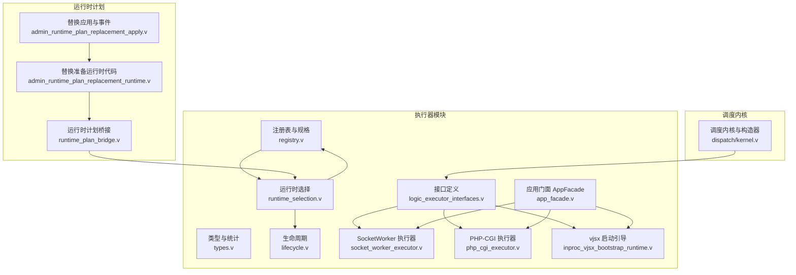
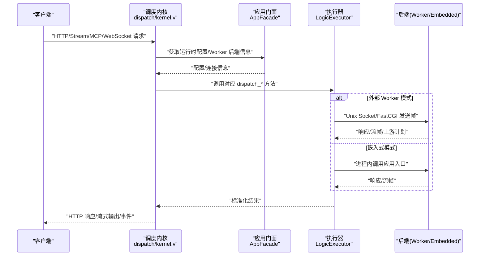
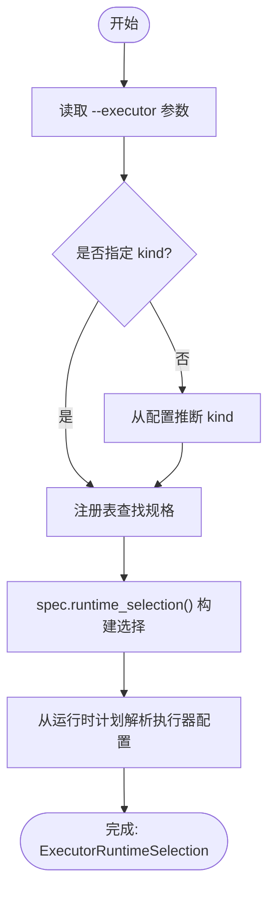
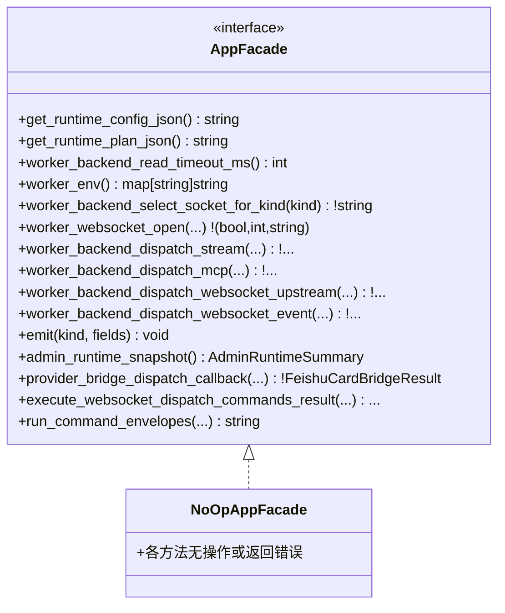
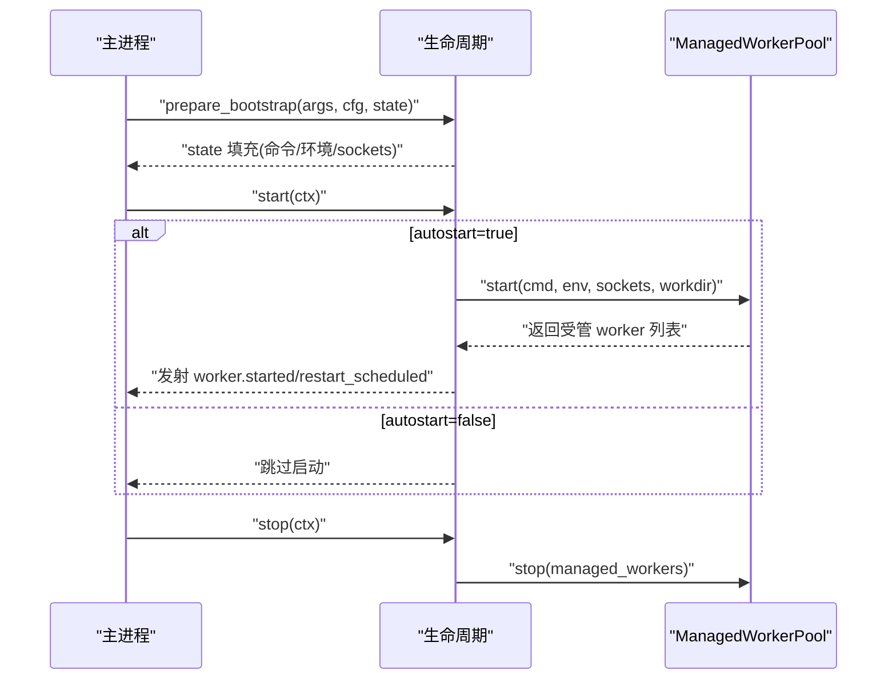
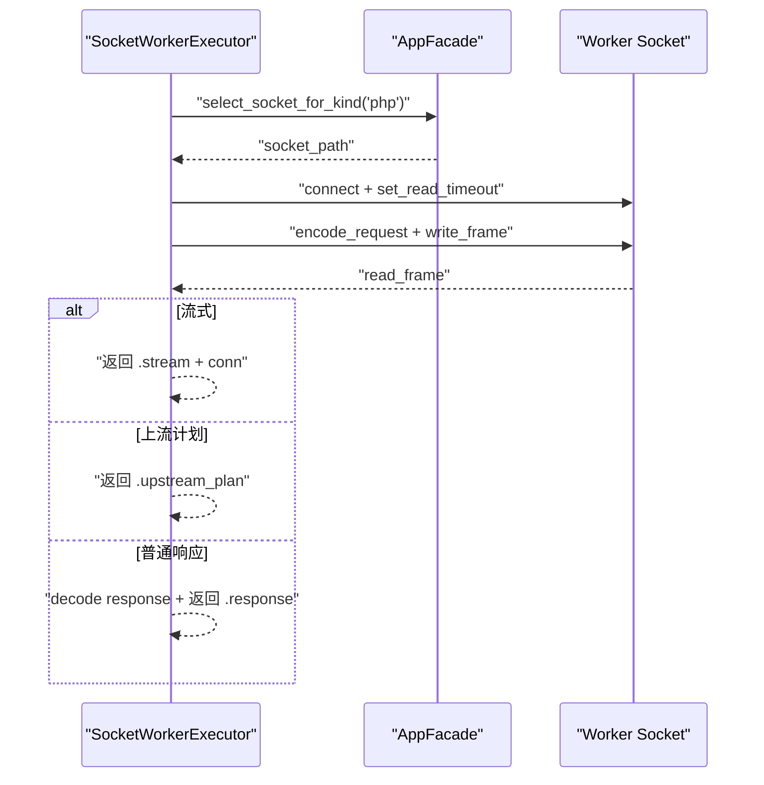
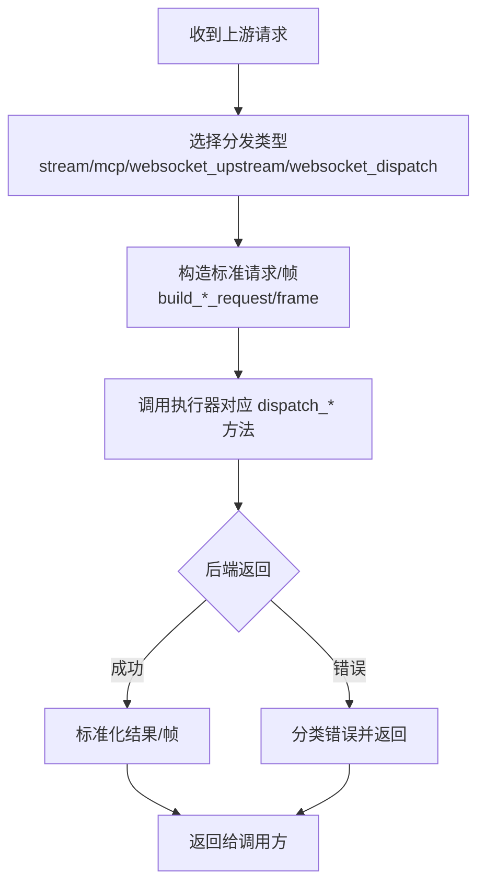
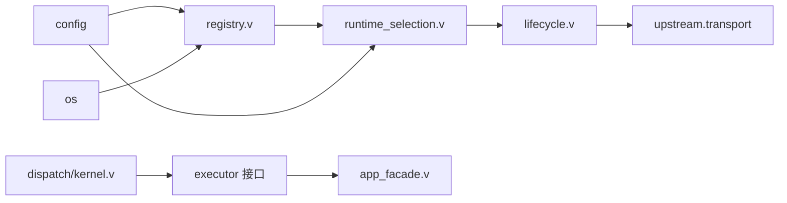

# 执行器架构设计

<cite>
**本文引用的文件**   
- [EXECUTOR_MODES.md](file://docs/EXECUTOR_MODES.md)
- [README.md](file://README.md)
- [PROTOCOL_PIPELINE_RELAY_ARCHITECTURE.md](file://docs/PROTOCOL_PIPELINE_RELAY_ARCHITECTURE.md)
- [14-future.md](file://articles/14-future.md)
- [logic_executor_interfaces.v](file://src/executor/logic_executor_interfaces.v)
- [types.v](file://src/executor/types.v)
- [registry.v](file://src/executor/registry.v)
- [runtime_selection.v](file://src/executor/runtime_selection.v)
- [lifecycle.v](file://src/executor/lifecycle.v)
- [socket_worker_executor.v](file://src/executor/socket_worker_executor.v)
- [php_cgi_executor.v](file://src/executor/php_cgi_executor.v)
- [inproc_vjsx_bootstrap_runtime.v](file://src/executor/inproc_vjsx_bootstrap_runtime.v)
- [kernel.v](file://src/dispatch/kernel.v)
- [app_facade.v](file://src/executor/app_facade.v)
- [admin_runtime_plan_replacement_runtime.v](file://src/admin_runtime_plan_replacement_runtime.v)
- [admin_runtime_plan_replacement_apply.v](file://src/admin_runtime_plan_replacement_apply.v)
- [runtime_plan_bridge.v](file://src/executor/runtime_plan_bridge.v)
</cite>

## 目录
1. [引言](#引言)
2. [项目结构](#项目结构)
3. [核心组件](#核心组件)
4. [架构总览](#架构总览)
5. [详细组件分析](#详细组件分析)
6. [依赖关系分析](#依赖关系分析)
7. [性能考量](#性能考量)
8. [故障排查指南](#故障排查指南)
9. [结论](#结论)
10. [附录](#附录)

## 引言
本文件聚焦 vhttpd 的执行器模式与架构，系统性阐述：
- 执行器选择算法与运行时计划编译
- 应用门面（AppFacade）模式
- 执行器与调度内核的交互机制、请求分发流程与响应处理管道
- 不同执行器模式的适用场景与性能特征
- 架构图与数据流图
- 扩展点设计与未来演进方向

vhttpd 将“请求逻辑”抽象为可插拔执行器，统一暴露 HTTP、WebSocket、Stream、MCP 等协议能力，并通过生命周期与工厂注册机制实现多执行器共存与动态切换。

## 项目结构
围绕执行器相关的关键目录与文件：
- src/executor：执行器接口、类型、内置执行器（PHP Worker、PHP-CGI、vjsx 嵌入式）、生命周期、运行时选择与注册表
- src/dispatch：调度内核与通用构造器（构建 Stream/MCP/WebSocket 分发包）
- docs/EXECUTOR_MODES.md：执行器模式说明与配置要点
- README.md：高层定位与设计原则
- admin_runtime_plan_replacement_*：运行时计划替换与热更新入口
- runtime_plan_bridge.v：从运行时计划解析执行器配置

图表来源
- [logic_executor_interfaces.v:1-51](file://src/executor/logic_executor_interfaces.v#L1-L51)
- [types.v:1-449](file://src/executor/types.v#L1-L449)
- [registry.v:1-387](file://src/executor/registry.v#L1-L387)
- [runtime_selection.v:1-31](file://src/executor/runtime_selection.v#L1-L31)
- [lifecycle.v:1-179](file://src/executor/lifecycle.v#L1-L179)
- [socket_worker_executor.v:1-157](file://src/executor/socket_worker_executor.v#L1-L157)
- [php_cgi_executor.v:1-118](file://src/executor/php_cgi_executor.v#L1-L118)
- [inproc_vjsx_bootstrap_runtime.v:1-42](file://src/executor/inproc_vjsx_bootstrap_runtime.v#L1-L42)
- [kernel.v:1-151](file://src/dispatch/kernel.v#L1-L151)
- [app_facade.v:1-241](file://src/executor/app_facade.v#L1-L241)
- [runtime_plan_bridge.v:1-18](file://src/executor/runtime_plan_bridge.v#L1-L18)
- [admin_runtime_plan_replacement_runtime.v:1-32](file://src/admin_runtime_plan_replacement_runtime.v#L1-L32)
- [admin_runtime_plan_replacement_apply.v:73-115](file://src/admin_runtime_plan_replacement_apply.v#L73-L115)

章节来源
- [EXECUTOR_MODES.md:1-136](file://docs/EXECUTOR_MODES.md#L1-L136)
- [README.md:1-82](file://README.md#L1-L82)

## 核心组件
- 执行器接口族：统一身份、生命周期与多种协议处理能力（HTTP、WebSocket 会话、Stream、MCP、WebSocket 上游/事件）。
- 类型与统计：执行器模型（worker/embedded）、后端模式（required/disabled）、管理面统计与调度上下文封装。
- 注册表与规格：内置执行器规格（kind、aliases、provider、model、worker_backend_mode、lifecycle、factory、config_surface），并提供配置解析与构建函数。
- 运行时选择：根据 CLI 参数或配置推断 kind，查找规格并返回 ExecutorRuntimeSelection（包含 executor、worker_backend_mode、lifecycle）。
- 生命周期：按执行器类型准备 bootstrap、启动/停止 worker 池或嵌入式宿主。
- 内置执行器：
  - SocketWorkerExecutor：通过 Unix Socket 与 PHP Worker 通信，支持 HTTP/Stream/WebSocket/MCP。
  - PhpCgiExecutor：基于 FastCGI 的 PHP 执行路径，仅支持 HTTP 响应。
  - vjsx 嵌入式：进程内执行 TypeScript/JavaScript 应用，具备 lane 并发与签名刷新等特性。
- 应用门面 AppFacade：为执行器提供运行时配置、Worker 后端访问、平台能力、Provider 桥接、命令执行等统一入口。
- 调度内核：提供 Stream/MCP/WebSocket 请求的标准化构造器，屏蔽底层差异。

章节来源
- [logic_executor_interfaces.v:1-51](file://src/executor/logic_executor_interfaces.v#L1-L51)
- [types.v:1-449](file://src/executor/types.v#L1-L449)
- [registry.v:1-387](file://src/executor/registry.v#L1-L387)
- [runtime_selection.v:1-31](file://src/executor/runtime_selection.v#L1-L31)
- [lifecycle.v:1-179](file://src/executor/lifecycle.v#L1-L179)
- [socket_worker_executor.v:1-157](file://src/executor/socket_worker_executor.v#L1-L157)
- [php_cgi_executor.v:1-118](file://src/executor/php_cgi_executor.v#L1-L118)
- [inproc_vjsx_bootstrap_runtime.v:1-42](file://src/executor/inproc_vjsx_bootstrap_runtime.v#L1-L42)
- [app_facade.v:1-241](file://src/executor/app_facade.v#L1-L241)
- [kernel.v:1-151](file://src/dispatch/kernel.v#L1-L151)

## 架构总览
vhttpd 以“协议无关的内核 + 可插拔执行器”为核心思想：
- 协议接入层（HTTP/WebSocket/Stream/MCP）将请求归一化为内部交换契约
- 调度内核负责路由到具体执行器
- 执行器根据模型（worker/embedded）选择后端（外部进程/进程内）
- 生命周期负责预热、启动、停止与资源回收
- 管理面与运行时计划支持热替换与诊断

图表来源
- [kernel.v:1-151](file://src/dispatch/kernel.v#L1-L151)
- [app_facade.v:1-241](file://src/executor/app_facade.v#L1-L241)
- [logic_executor_interfaces.v:1-51](file://src/executor/logic_executor_interfaces.v#L1-L51)
- [socket_worker_executor.v:1-157](file://src/executor/socket_worker_executor.v#L1-L157)
- [php_cgi_executor.v:1-118](file://src/executor/php_cgi_executor.v#L1-L118)
- [inproc_vjsx_bootstrap_runtime.v:1-42](file://src/executor/inproc_vjsx_bootstrap_runtime.v#L1-L42)

## 详细组件分析

### 执行器接口与类型
- 接口族：
  - LogicExecutorIdentity：标识（model、kind、provider、admin_details）
  - LogicExecutorLifecycleOps：warmup/close
  - HttpLogicExecutor：HTTP 分发
  - WebSocketSessionExecutor：WebSocket 会话打开
  - StreamLogicExecutor：Stream 分发
  - McpLogicExecutor：MCP 分发
  - WebSocketUpstreamExecutor/WebSocketEventExecutor：WebSocket 上游/事件分发
- 类型：
  - LogicExecutorModel：worker/embedded
  - WorkerBackendMode：required/disabled
  - Admin* 统计结构与 DispatchContext 封装

```mermaid
classDiagram
class LogicExecutorIdentity {
+model() LogicExecutorModel
+kind() string
+provider() string
+admin_details() LogicExecutorAdminDetails
}
class LogicExecutorLifecycleOps {
+warmup(app) !
+close() void
}
class HttpLogicExecutor {
+dispatch_http(app, req) !HttpLogicDispatchOutcome
}
class WebSocketSessionExecutor {
+open_websocket_session(app, req) !WebSocketSessionOpenOutcome
}
class StreamLogicExecutor {
+dispatch_stream(app, req) !transport.StreamDispatchResponse
}
class McpLogicExecutor {
+dispatch_mcp(app, req) !transport.WorkerMcpDispatchResponse
}
class WebSocketUpstreamExecutor {
+dispatch_websocket_upstream(app, req) !transport.WorkerWebSocketUpstreamDispatchResponse
}
class WebSocketEventExecutor {
+dispatch_websocket_event(app, frame) !transport.WorkerWebSocketDispatchResponse
}
class LogicExecutor {
}
LogicExecutor <|.. LogicExecutorIdentity
LogicExecutor <|.. LogicExecutorLifecycleOps
LogicExecutor <|.. HttpLogicExecutor
LogicExecutor <|.. WebSocketSessionExecutor
LogicExecutor <|.. StreamLogicExecutor
LogicExecutor <|.. McpLogicExecutor
LogicExecutor <|.. WebSocketUpstreamExecutor
LogicExecutor <|.. WebSocketEventExecutor
```

图表来源
- [logic_executor_interfaces.v:1-51](file://src/executor/logic_executor_interfaces.v#L1-L51)
- [types.v:1-449](file://src/executor/types.v#L1-L449)

章节来源
- [logic_executor_interfaces.v:1-51](file://src/executor/logic_executor_interfaces.v#L1-L51)
- [types.v:1-449](file://src/executor/types.v#L1-L449)

### 执行器选择算法与运行时计划编译
- 选择流程：
  - 优先读取 CLI 参数 --executor；否则依据配置推断（存在 php.* 或 vjsx.* 字段）
  - 通过注册表匹配 kind/aliases，得到 BuiltinLogicExecutorSpec
  - 调用 spec.runtime_selection 生成 ExecutorRuntimeSelection（含 executor、worker_backend_mode、lifecycle）
- 运行时计划编译：
  - 从 RuntimePlan 中选取 listener 回退 engine，结合策略注入 WebSocket 并发策略
  - 解析为 LogicExecutorRuntimePlan，供上层引擎构建使用
- 热替换：
  - 准备阶段加载新计划、计算哈希、构建引擎与路由
  - 应用阶段执行轻量替换、记录状态、发出事件

图表来源
- [runtime_selection.v:1-31](file://src/executor/runtime_selection.v#L1-L31)
- [registry.v:1-387](file://src/executor/registry.v#L1-L387)
- [runtime_plan_bridge.v:1-18](file://src/executor/runtime_plan_bridge.v#L1-L18)
- [admin_runtime_plan_replacement_runtime.v:1-32](file://src/admin_runtime_plan_replacement_runtime.v#L1-L32)
- [admin_runtime_plan_replacement_apply.v:73-115](file://src/admin_runtime_plan_replacement_apply.v#L73-L115)

章节来源
- [runtime_selection.v:1-31](file://src/executor/runtime_selection.v#L1-L31)
- [registry.v:1-387](file://src/executor/registry.v#L1-L387)
- [runtime_plan_bridge.v:1-18](file://src/executor/runtime_plan_bridge.v#L1-L18)
- [admin_runtime_plan_replacement_runtime.v:1-32](file://src/admin_runtime_plan_replacement_runtime.v#L1-L32)
- [admin_runtime_plan_replacement_apply.v:73-115](file://src/admin_runtime_plan_replacement_apply.v#L73-L115)

### 应用门面模式（AppFacade）
- 目的：为执行器提供统一的运行时访问点，避免直接耦合主进程状态
- 能力范围：
  - 运行时配置与计划 JSON 读取
  - Worker 后端配置（超时、环境、Socket 选择、队列回调）
  - Stream/MCP/WebSocket 分发端口
  - 平台能力与 Provider 桥接
  - 命令执行与事件发射
- NoOp 实现：作为默认值用于字段初始化，便于测试与空实现

图表来源
- [app_facade.v:1-241](file://src/executor/app_facade.v#L1-L241)

章节来源
- [app_facade.v:1-241](file://src/executor/app_facade.v#L1-L241)

### 生命周期与后端管理
- 生命周期对象由函数指针构成，避免循环依赖，同时捕获 App 上下文
- PHP Worker 生命周期：
  - prepare：解析 PHP 配置、构建环境变量与命令
  - start：按需启动 ManagedWorkerPool，发射 worker.started/restart_scheduled 事件
  - stop：停止所有受管 worker
- Embedded（vjsx）生命周期：
  - 不启动外部 worker，禁用 stream/websocket 分发模式
- Disabled 生命周期：
  - 完全禁用，worker 列表为空

图表来源
- [lifecycle.v:1-179](file://src/executor/lifecycle.v#L1-L179)

章节来源
- [lifecycle.v:1-179](file://src/executor/lifecycle.v#L1-L179)

### 内置执行器详解

#### SocketWorkerExecutor（PHP Worker）
- 模型：worker；后端模式：required
- HTTP 分发：
  - 选择 socket -> 建立连接 -> 编码请求帧 -> 读取首帧
  - 首帧为流则返回 .stream 并携带 conn；为上流计划则返回 .upstream_plan；否则解码为 .response
- WebSocket 会话：
  - 选择 socket -> 握手 -> 接受后返回 conn 与 socket_path
- 其他分发：
  - Stream/MCP/WebSocket 上游/事件均通过 AppFacade 提供的端口转发至后端

图表来源
- [socket_worker_executor.v:1-157](file://src/executor/socket_worker_executor.v#L1-L157)
- [app_facade.v:1-241](file://src/executor/app_facade.v#L1-L241)

章节来源
- [socket_worker_executor.v:1-157](file://src/executor/socket_worker_executor.v#L1-L157)

#### PhpCgiExecutor（FastCGI）
- 模型：worker；后端模式：required
- HTTP 分发：
  - 选择 socket -> 设置超时 -> 编码 FastCGI 请求 -> 解码响应
- 不支持 WebSocket/Stream/MCP/WebSocket 上游/事件，调用即报错

章节来源
- [php_cgi_executor.v:1-118](file://src/executor/php_cgi_executor.v#L1-L118)

#### vjsx 嵌入式执行器
- 模型：embedded；后端模式：disabled
- warmup：
  - 保存 AppFacade 引用 -> 初始化占位 -> 遍历 lane 进行预热
  - 确保 lanes 非空、app_entry 有效、启动签名刷新协程
- 行为：
  - 自动禁用 worker sockets 与 autostart
  - 当前作用域为 HTTP 分发与 websocket_upstream 分发

章节来源
- [inproc_vjsx_bootstrap_runtime.v:1-42](file://src/executor/inproc_vjsx_bootstrap_runtime.v#L1-L42)
- [EXECUTOR_MODES.md:82-125](file://docs/EXECUTOR_MODES.md#L82-L125)

### 调度内核与请求分发
- 提供标准化构造器：
  - Stream open/next/close
  - MCP message
  - WebSocket upstream 与 dispatch frame
- 错误分类：
  - transport_failure 将后端错误映射为 status 与 error_class
  - stream_failure 将 event='error' 转换为失败结构

图表来源
- [kernel.v:1-151](file://src/dispatch/kernel.v#L1-L151)

章节来源
- [kernel.v:1-151](file://src/dispatch/kernel.v#L1-L151)

## 依赖关系分析
- 低耦合高内聚：
  - 执行器通过接口与门面解耦，注册表集中管理规格与构建
  - 生命周期通过函数指针避免循环依赖
- 关键依赖链：
  - registry.v 依赖 config 与 os，提供配置解析与命令构建
  - runtime_selection.v 依赖 config 与 registry，决定最终执行器实例
  - lifecycle.v 依赖 upstream.transport 与 log，协调 worker 池
  - kernel.v 依赖 executor 与 upstream.transport，统一构造分发包
  - app_facade.v 聚合多个子门面，屏蔽底层细节

图表来源
- [registry.v:1-387](file://src/executor/registry.v#L1-L387)
- [runtime_selection.v:1-31](file://src/executor/runtime_selection.v#L1-L31)
- [lifecycle.v:1-179](file://src/executor/lifecycle.v#L1-L179)
- [kernel.v:1-151](file://src/dispatch/kernel.v#L1-L151)
- [app_facade.v:1-241](file://src/executor/app_facade.v#L1-L241)

章节来源
- [registry.v:1-387](file://src/executor/registry.v#L1-L387)
- [runtime_selection.v:1-31](file://src/executor/runtime_selection.v#L1-L31)
- [lifecycle.v:1-179](file://src/executor/lifecycle.v#L1-L179)
- [kernel.v:1-151](file://src/dispatch/kernel.v#L1-L151)
- [app_facade.v:1-241](file://src/executor/app_facade.v#L1-L241)

## 性能考量
- 外部 Worker 模式（PHP）：
  - 优点：隔离性强、易于横向扩展、适合长驻进程复用
  - 关注点：Socket 选择与连接复用、读超时、队列深度与拒绝策略
- 嵌入式模式（vjsx）：
  - 优点：零跨进程开销、低延迟、适合轻量逻辑与快速迭代
  - 关注点：lane 并发度、内存占用、签名刷新与热重载成本
- 通用优化建议：
  - 合理设置 pool_size、read_timeout_ms、max_requests
  - 启用观测指标（trace_id、exchange_id、pipeline_id）
  - 控制背压（body/frame/pending 上限）

[本节为通用指导，无需源码引用]

## 故障排查指南
- 常见错误与定位：
  - 未找到 worker_entry/app_entry/extensions：检查路径与权限
  - 无法连接 worker socket：确认 socket 前缀、池大小与进程存活
  - 解码失败：核对帧格式与超时设置
  - vjsx 缺少 lanes 或 app_entry：检查构建产物与入口配置
- 事件与日志：
  - worker.pool.empty / worker.started / worker.restart_scheduled
  - 运行时计划替换事件：draining、rejected、replaced
- 工具与入口：
  - 管理端查看执行器目录与运行时快照
  - 使用运行时计划预览与应用流程验证变更

章节来源
- [registry.v:290-323](file://src/executor/registry.v#L290-L323)
- [lifecycle.v:97-134](file://src/executor/lifecycle.v#L97-L134)
- [admin_runtime_plan_replacement_apply.v:73-115](file://src/admin_runtime_plan_replacement_apply.v#L73-L115)

## 结论
vhttpd 的执行器架构以“接口化 + 注册表 + 生命周期”为核心，实现了多执行器并存与统一调度。通过 AppFacade 屏蔽底层差异，调度内核提供标准化分发，配合运行时计划与热替换机制，形成可扩展、可观测、可演进的执行底座。未来可在保持统一表面的前提下引入更多宿主（如 lua），并以能力接口逐步细化职责边界。

[本节为总结性内容，无需源码引用]

## 附录

### 执行器模式对比与适用场景
- PHP Worker：
  - 适用：已有 PHP 生态、需要进程隔离与水平扩展
  - 性能：跨进程开销，但可通过池与连接复用优化
- vjsx 嵌入式：
  - 适用：轻量逻辑、快速原型、低延迟场景
  - 性能：进程内执行，延迟更低，需关注内存与并发

章节来源
- [EXECUTOR_MODES.md:25-125](file://docs/EXECUTOR_MODES.md#L25-L125)
- [README.md:33-43](file://README.md#L33-L43)

### 协议流水线与中继架构（概念）
- 目标：统一 Ingress -> Canonical Exchange -> Transforms -> Egress 的数据路径
- 中继：跨网络节点间以 Carrier/Channel/Agent 组织，保持流式、双向与会话语义

章节来源
- [PROTOCOL_PIPELINE_RELAY_ARCHITECTURE.md:1-500](file://docs/PROTOCOL_PIPELINE_RELAY_ARCHITECTURE.md#L1-L500)

### 未来演进方向
- 能力接口拆分：HTTP/stream/session/event/MCP/transform handler 细粒度注册
- 开发者体验：CLI 工具、VS Code 插件、基准测试与内存优化
- 生态建设：更多宿主与协议适配，完善可观测性与安全策略

章节来源
- [14-future.md:1-102](file://articles/14-future.md#L1-L102)