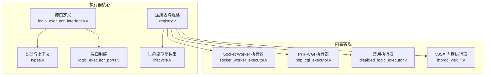
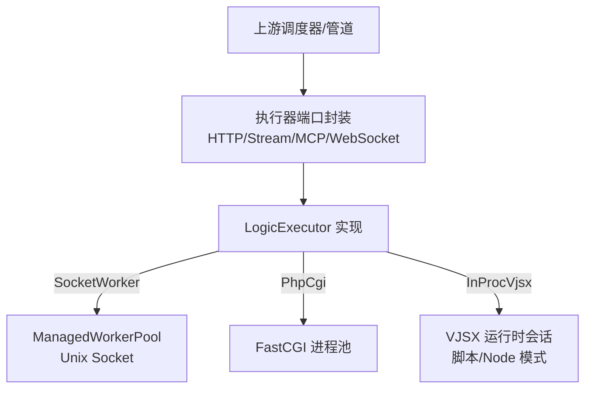
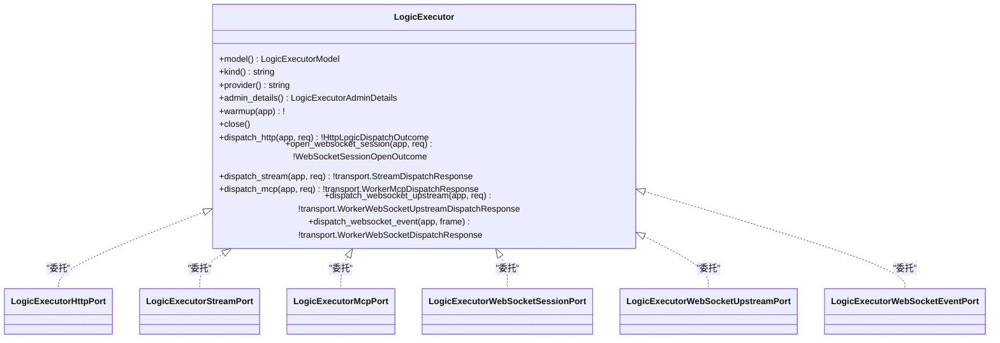
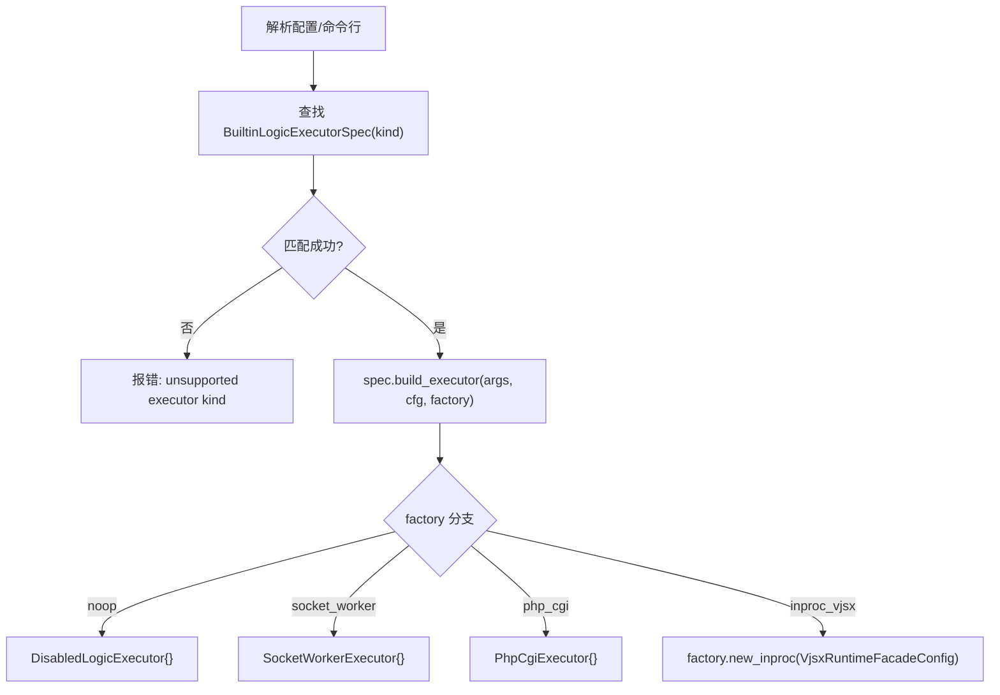
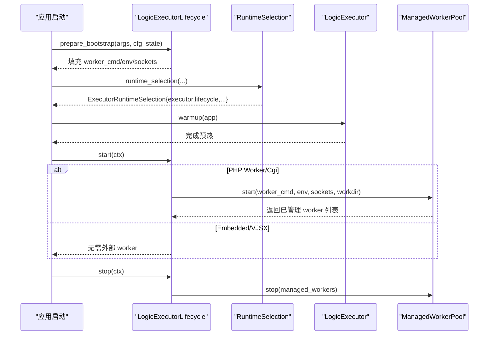
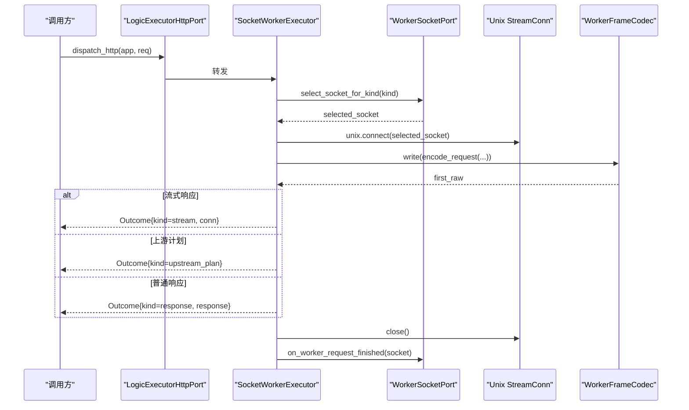
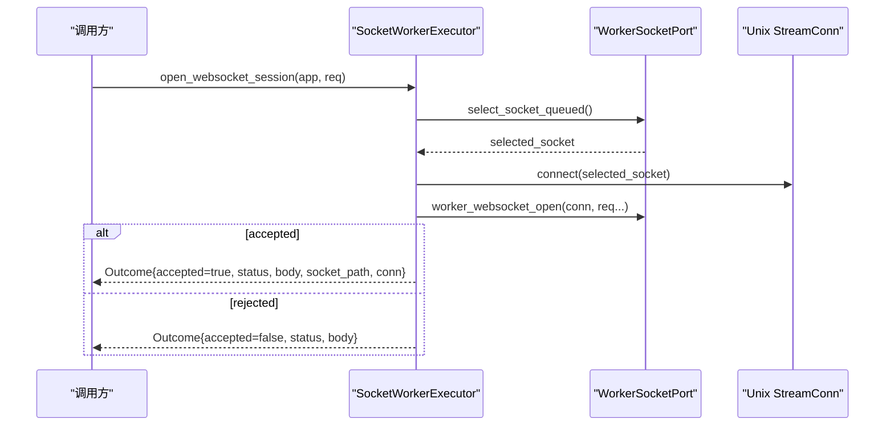
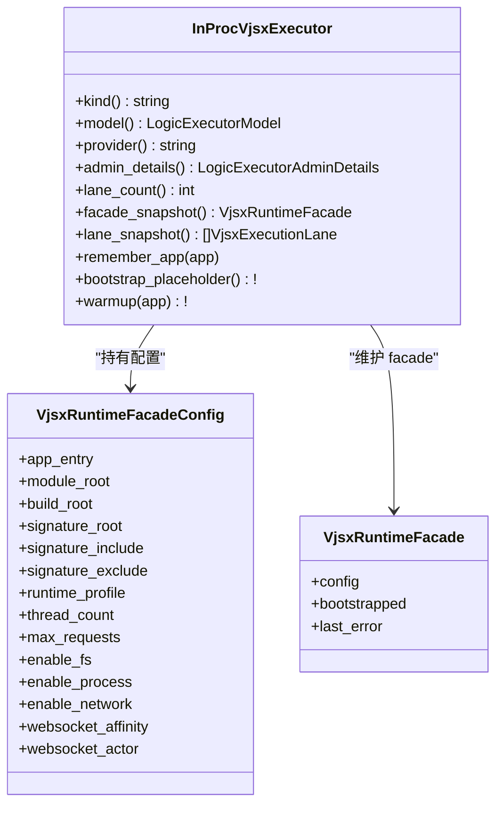
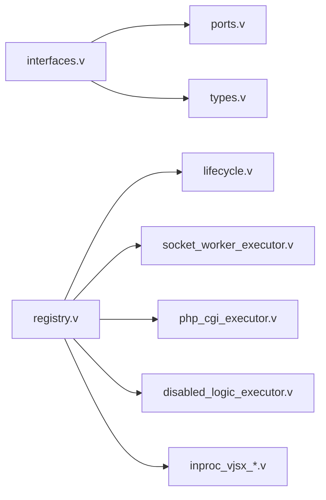

# 自定义执行器开发

<cite>
**本文引用的文件**   
- [src/executor/logic_executor_interfaces.v](file://src/executor/logic_executor_interfaces.v)
- [src/executor/logic_executor_ports.v](file://src/executor/logic_executor_ports.v)
- [src/executor/types.v](file://src/executor/types.v)
- [src/executor/registry.v](file://src/executor/registry.v)
- [src/executor/lifecycle.v](file://src/executor/lifecycle.v)
- [src/executor/disabled_logic_executor.v](file://src/executor/disabled_logic_executor.v)
- [src/executor/socket_worker_executor.v](file://src/executor/socket_worker_executor.v)
- [src/executor/php_cgi_executor.v](file://src/executor/php_cgi_executor.v)
- [src/executor/inproc_vjsx_lifecycle.v](file://src/executor/inproc_vjsx_lifecycle.v)
- [src/executor/inproc_vjsx_bootstrap_runtime.v](file://src/executor/inproc_vjsx_bootstrap_runtime.v)
- [src/executor/inproc_vjsx_types.v](file://src/executor/inproc_vjsx_types.v)
- [src/executor/inproc_vjsx_runtime_session.v](file://src/executor/inproc_vjsx_runtime_session.v)
</cite>

## 目录
1. [简介](#简介)
2. [项目结构](#项目结构)
3. [核心组件](#核心组件)
4. [架构总览](#架构总览)
5. [详细组件分析](#详细组件分析)
6. [依赖关系分析](#依赖关系分析)
7. [性能与资源管理](#性能与资源管理)
8. [故障排查指南](#故障排查指南)
9. [结论](#结论)
10. [附录：开发流程与模板](#附录开发流程与模板)

## 简介
本指南面向希望为 vhttpd 扩展“逻辑执行器”的开发者。内容覆盖执行器接口定义、抽象基类与端口封装、注册机制、生命周期管理、错误处理与日志记录，并提供从实现到测试验证与部署发布的完整流程。同时涵盖配置项、参数传递、资源管理等高级特性，并给出可复用的代码模板路径，帮助快速创建自定义执行器。

## 项目结构
围绕“执行器”的核心源码位于 src/executor 目录，关键文件职责如下：
- 接口与类型定义：logic_executor_interfaces.v、types.v
- 端口封装（按协议分派）：logic_executor_ports.v
- 内置执行器与注册表：registry.v、lifecycle.v
- 具体执行器实现：socket_worker_executor.v、php_cgi_executor.v、disabled_logic_executor.v
- 内嵌 VJSX 执行器：inproc_vjsx_*.v

图表来源
- [src/executor/logic_executor_interfaces.v:1-51](file://src/executor/logic_executor_interfaces.v#L1-L51)
- [src/executor/types.v:1-449](file://src/executor/types.v#L1-L449)
- [src/executor/logic_executor_ports.v:1-104](file://src/executor/logic_executor_ports.v#L1-L104)
- [src/executor/registry.v:1-387](file://src/executor/registry.v#L1-L387)
- [src/executor/lifecycle.v:1-179](file://src/executor/lifecycle.v#L1-L179)
- [src/executor/socket_worker_executor.v:1-157](file://src/executor/socket_worker_executor.v#L1-L157)
- [src/executor/php_cgi_executor.v:1-118](file://src/executor/php_cgi_executor.v#L1-L118)
- [src/executor/disabled_logic_executor.v:1-81](file://src/executor/disabled_logic_executor.v#L1-L81)
- [src/executor/inproc_vjsx_lifecycle.v:1-155](file://src/executor/inproc_vjsx_lifecycle.v#L1-L155)

章节来源
- [src/executor/logic_executor_interfaces.v:1-51](file://src/executor/logic_executor_interfaces.v#L1-L51)
- [src/executor/types.v:1-449](file://src/executor/types.v#L1-L449)
- [src/executor/logic_executor_ports.v:1-104](file://src/executor/logic_executor_ports.v#L1-L104)
- [src/executor/registry.v:1-387](file://src/executor/registry.v#L1-L387)
- [src/executor/lifecycle.v:1-179](file://src/executor/lifecycle.v#L1-L179)
- [src/executor/socket_worker_executor.v:1-157](file://src/executor/socket_worker_executor.v#L1-L157)
- [src/executor/php_cgi_executor.v:1-118](file://src/executor/php_cgi_executor.v#L1-L118)
- [src/executor/disabled_logic_executor.v:1-81](file://src/executor/disabled_logic_executor.v#L1-L81)
- [src/executor/inproc_vjsx_lifecycle.v:1-155](file://src/executor/inproc_vjsx_lifecycle.v#L1-L155)

## 核心组件
- LogicExecutor 接口族
  - 身份与模型：model()、kind()、provider()、admin_details()
  - 生命周期：warmup(app)、close()
  - 协议分发：dispatch_http()、open_websocket_session()、dispatch_stream()、dispatch_mcp()、dispatch_websocket_upstream()、dispatch_websocket_event()
- 端口封装（按协议拆分）
  - LogicExecutorHttpPort / StreamPort / McpPort / WebSocketSessionPort / WebSocketUpstreamPort / WebSocketEventPort
  - 作用：将统一接口拆分为按协议访问的“端口”，便于组合与测试
- 类型与上下文
  - HttpLogicDispatchRequest/Outcome、WebSocketSessionOpenRequest/Outcome
  - DispatchContext、KernelDispatchEnvelope 等用于跨层传递请求上下文
- 注册表与规格
  - BuiltinLogicExecutorSpec：描述 kind、aliases、provider、model、worker_backend_mode、lifecycle、factory、config_surface
  - runtime_selection()/build_executor()：根据配置构建执行器实例
  - ExecutorFactory：解耦构造回调，避免循环依赖
- 生命周期
  - LogicExecutorLifecycle：以函数指针形式提供 prepare_bootstrap/start/stop，避免循环导入
  - 内置：disabled、php_worker_host、php_cgi_host、embedded_host

章节来源
- [src/executor/logic_executor_interfaces.v:1-51](file://src/executor/logic_executor_interfaces.v#L1-L51)
- [src/executor/logic_executor_ports.v:1-104](file://src/executor/logic_executor_ports.v#L1-L104)
- [src/executor/types.v:1-449](file://src/executor/types.v#L1-L449)
- [src/executor/registry.v:1-387](file://src/executor/registry.v#L1-L387)
- [src/executor/lifecycle.v:1-179](file://src/executor/lifecycle.v#L1-L179)

## 架构总览
下图展示了执行器在系统内的位置与交互：上层通过端口选择调用对应分发方法；执行器内部可能连接外部 worker（Unix Socket/FastCGI）或内嵌运行期（VJSX）。

图表来源
- [src/executor/logic_executor_ports.v:1-104](file://src/executor/logic_executor_ports.v#L1-L104)
- [src/executor/socket_worker_executor.v:1-157](file://src/executor/socket_worker_executor.v#L1-L157)
- [src/executor/php_cgi_executor.v:1-118](file://src/executor/php_cgi_executor.v#L1-L118)
- [src/executor/inproc_vjsx_runtime_session.v:1-75](file://src/executor/inproc_vjsx_runtime_session.v#L1-L75)

## 详细组件分析

### 接口与类型
- LogicExecutor 接口聚合了身份、生命周期与各协议分发方法，是自定义执行器的唯一契约。
- 各协议分发方法的输入输出均基于 types.v 中定义的请求/响应/上下文结构体，确保跨模块一致。
- 端口封装将统一接口按协议切分，方便按需组合与替换。

图表来源
- [src/executor/logic_executor_interfaces.v:1-51](file://src/executor/logic_executor_interfaces.v#L1-L51)
- [src/executor/logic_executor_ports.v:1-104](file://src/executor/logic_executor_ports.v#L1-L104)

章节来源
- [src/executor/logic_executor_interfaces.v:1-51](file://src/executor/logic_executor_interfaces.v#L1-L51)
- [src/executor/logic_executor_ports.v:1-104](file://src/executor/logic_executor_ports.v#L1-L104)
- [src/executor/types.v:1-449](file://src/executor/types.v#L1-L449)

### 注册机制与工厂
- 内置执行器规格由 registry.v 集中维护，包含 kind、别名、provider、model、worker_backend_mode、lifecycle、factory、config_surface。
- build_executor() 依据 factory 分支返回不同实现；runtime_selection() 组装执行器与生命周期。
- ExecutorFactory 注入 new_inproc 回调，避免与主模块循环依赖。

图表来源
- [src/executor/registry.v:1-387](file://src/executor/registry.v#L1-L387)

章节来源
- [src/executor/registry.v:1-387](file://src/executor/registry.v#L1-L387)

### 生命周期管理
- LogicExecutorLifecycle 以函数指针组织 prepare_bootstrap/start/stop，避免循环导入。
- 内置生命周期：
  - disabled：不启动任何后端
  - php_worker_host/php_cgi_host：准备命令与环境，启动 ManagedWorkerPool，并在停止时回收
  - embedded_host：无外部 worker，仅做占位
- InProcVjsxExecutor 额外提供 warmup 阶段，逐 lane 预热，并维护签名刷新与探针缓存。

图表来源
- [src/executor/lifecycle.v:1-179](file://src/executor/lifecycle.v#L1-L179)
- [src/executor/registry.v:1-387](file://src/executor/registry.v#L1-L387)
- [src/executor/inproc_vjsx_bootstrap_runtime.v:1-42](file://src/executor/inproc_vjsx_bootstrap_runtime.v#L1-L42)

章节来源
- [src/executor/lifecycle.v:1-179](file://src/executor/lifecycle.v#L1-L179)
- [src/executor/registry.v:1-387](file://src/executor/registry.v#L1-L387)
- [src/executor/inproc_vjsx_bootstrap_runtime.v:1-42](file://src/executor/inproc_vjsx_bootstrap_runtime.v#L1-L42)

### HTTP 分发流程（Socket Worker）
- 选择目标 socket -> 建立连接 -> 编码请求帧 -> 读取首帧 -> 判断响应/流/上游计划 -> 释放连接与统计。

图表来源
- [src/executor/socket_worker_executor.v:1-157](file://src/executor/socket_worker_executor.v#L1-L157)
- [src/executor/types.v:1-449](file://src/executor/types.v#L1-L449)

章节来源
- [src/executor/socket_worker_executor.v:1-157](file://src/executor/socket_worker_executor.v#L1-L157)
- [src/executor/types.v:1-449](file://src/executor/types.v#L1-L449)

### WebSocket 会话打开（Socket Worker）
- 选择队列中的 socket -> 握手 -> 接受则返回 socket_path 与连接句柄，否则返回拒绝状态。

图表来源
- [src/executor/socket_worker_executor.v:1-157](file://src/executor/socket_worker_executor.v#L1-L157)

章节来源
- [src/executor/socket_worker_executor.v:1-157](file://src/executor/socket_worker_executor.v#L1-L157)

### PHP-CGI 执行器
- 使用 FastCGI 编解码器与独立环境覆盖，仅支持 HTTP 响应，不支持 WebSocket/流/MCP。

章节来源
- [src/executor/php_cgi_executor.v:1-118](file://src/executor/php_cgi_executor.v#L1-L118)

### 禁用执行器
- 所有分发方法直接返回“禁用”错误，用于关闭逻辑执行能力或占位。

章节来源
- [src/executor/disabled_logic_executor.v:1-81](file://src/executor/disabled_logic_executor.v#L1-L81)

### VJSX 内嵌执行器
- 通过 new_inproc_vjsx_executor(config) 创建，内部维护 lanes、hosts、worker 任务通道、亲和性与邮箱等状态。
- warmup 阶段遍历 lanes 进行预热，并启动签名刷新后台任务。
- 运行时会话支持 script/node 两种 profile，并通过诊断回调输出缺失模块等信息。

图表来源
- [src/executor/inproc_vjsx_lifecycle.v:1-155](file://src/executor/inproc_vjsx_lifecycle.v#L1-L155)
- [src/executor/inproc_vjsx_types.v:1-90](file://src/executor/inproc_vjsx_types.v#L1-90)
- [src/executor/inproc_vjsx_bootstrap_runtime.v:1-42](file://src/executor/inproc_vjsx_bootstrap_runtime.v#L1-42)
- [src/executor/inproc_vjsx_runtime_session.v:1-75](file://src/executor/inproc_vjsx_runtime_session.v#L1-75)

章节来源
- [src/executor/inproc_vjsx_lifecycle.v:1-155](file://src/executor/inproc_vjsx_lifecycle.v#L1-L155)
- [src/executor/inproc_vjsx_types.v:1-90](file://src/executor/inproc_vjsx_types.v#L1-90)
- [src/executor/inproc_vjsx_bootstrap_runtime.v:1-42](file://src/executor/inproc_vjsx_bootstrap_runtime.v#L1-42)
- [src/executor/inproc_vjsx_runtime_session.v:1-75](file://src/executor/inproc_vjsx_runtime_session.v#L1-75)

## 依赖关系分析
- 低耦合：接口与实现分离，端口封装进一步降低耦合度。
- 注册表集中管理内置执行器，通过工厂回调注入构造逻辑，避免循环依赖。
- 生命周期以函数指针承载，避免与主模块循环引用。

图表来源
- [src/executor/logic_executor_interfaces.v:1-51](file://src/executor/logic_executor_interfaces.v#L1-L51)
- [src/executor/logic_executor_ports.v:1-104](file://src/executor/logic_executor_ports.v#L1-L104)
- [src/executor/types.v:1-449](file://src/executor/types.v#L1-L449)
- [src/executor/registry.v:1-387](file://src/executor/registry.v#L1-L387)
- [src/executor/lifecycle.v:1-179](file://src/executor/lifecycle.v#L1-L179)
- [src/executor/socket_worker_executor.v:1-157](file://src/executor/socket_worker_executor.v#L1-L157)
- [src/executor/php_cgi_executor.v:1-118](file://src/executor/php_cgi_executor.v#L1-L118)
- [src/executor/disabled_logic_executor.v:1-81](file://src/executor/disabled_logic_executor.v#L1-L81)
- [src/executor/inproc_vjsx_lifecycle.v:1-155](file://src/executor/inproc_vjsx_lifecycle.v#L1-L155)

章节来源
- [src/executor/registry.v:1-387](file://src/executor/registry.v#L1-L387)
- [src/executor/lifecycle.v:1-179](file://src/executor/lifecycle.v#L1-L179)

## 性能与资源管理
- 超时控制：SocketWorkerExecutor 在连接上设置读超时，防止阻塞。
- 连接复用与释放：每次请求完成后显式关闭连接并通知端口统计。
- 工作池管理：PHP Worker/Cgi 通过 ManagedWorkerPool 启动/停止，空池时发出事件告警。
- 内嵌执行器线程数：VJSX 通过 thread_count 控制 lane 数量，影响并发能力。
- 资源开关：VJSX 支持 enable_fs/enable_process/enable_network 等能力开关，减少攻击面与开销。

章节来源
- [src/executor/socket_worker_executor.v:1-157](file://src/executor/socket_worker_executor.v#L1-L157)
- [src/executor/lifecycle.v:1-179](file://src/executor/lifecycle.v#L1-L179)
- [src/executor/inproc_vjsx_types.v:1-90](file://src/executor/inproc_vjsx_types.v#L1-90)

## 故障排查指南
- 常见错误码与提示
  - logic_executor_disabled：禁用执行器被调用
  - inproc_vjsx_executor_missing_app_entry：未配置 app_entry
  - inproc_vjsx_executor_no_lanes：未创建 lane
  - transport_error: decode worker response failed：下游响应解码失败
  - php-cgi executor does not support ...：功能不受支持
- 定位建议
  - 检查注册表是否匹配期望的 kind/alias
  - 确认生命周期 prepare_bootstrap 是否正确生成 worker_cmd/env/sockets
  - 查看端口封装是否按协议正确转发
  - 对 VJSX 执行器，关注 warmup 与签名刷新日志

章节来源
- [src/executor/disabled_logic_executor.v:1-81](file://src/executor/disabled_logic_executor.v#L1-L81)
- [src/executor/inproc_vjsx_bootstrap_runtime.v:1-42](file://src/executor/inproc_vjsx_bootstrap_runtime.v#L1-42)
- [src/executor/socket_worker_executor.v:1-157](file://src/executor/socket_worker_executor.v#L1-L157)
- [src/executor/php_cgi_executor.v:1-118](file://src/executor/php_cgi_executor.v#L1-L118)

## 结论
通过统一的 LogicExecutor 接口与端口封装，结合注册表与生命周期函数集，vhttpd 提供了可扩展的执行器体系。开发者可按需实现 HTTP/流/MCP/WebSocket 等协议的分发逻辑，并通过工厂与生命周期钩子完成资源管理与初始化。配合完善的类型定义与错误语义，可实现高内聚、低耦合的可插拔执行器生态。

## 附录：开发流程与模板

### 从零开始创建自定义执行器
- 步骤概览
  1) 定义实现：实现 LogicExecutor 接口（参考 socket_worker_executor.v/php_cgi_executor.v）
  2) 注册规格：在 registry.v 中添加 BuiltinLogicExecutorSpec（kind/aliases/provider/model/factory/config_surface）
  3) 生命周期：如需外部进程/资源，补充 lifecycle.v 中的生命周期函数（prepare_bootstrap/start/stop）
  4) 配置解析：在 spec 中暴露 config_surface，并在 resolve_* 方法中映射 CLI/配置文件
  5) 工厂注入：在 ExecutorFactory 中注入 new_inproc 或其他构造回调
  6) 单元测试：针对端口封装与分发逻辑编写用例（参考现有测试风格）
  7) 集成验证：通过 admin 快照与运行时事件观察执行器行为
  8) 发布：更新文档与示例配置，纳入内置执行器清单

- 代码模板路径（请对照实际文件结构与行号）
  - 接口实现模板：[src/executor/socket_worker_executor.v:1-157](file://src/executor/socket_worker_executor.v#L1-L157)
  - 轻量实现模板（禁用型）：[src/executor/disabled_logic_executor.v:1-81](file://src/executor/disabled_logic_executor.v#L1-L81)
  - 注册表新增条目：[src/executor/registry.v:65-128](file://src/executor/registry.v#L65-L128)
  - 生命周期函数集：[src/executor/lifecycle.v:57-179](file://src/executor/lifecycle.v#L57-L179)
  - 端口封装参考：[src/executor/logic_executor_ports.v:1-104](file://src/executor/logic_executor_ports.v#L1-L104)
  - 类型与上下文参考：[src/executor/types.v:1-449](file://src/executor/types.v#L1-L449)
  - VJSX 内嵌执行器参考：[src/executor/inproc_vjsx_lifecycle.v:1-155](file://src/executor/inproc_vjsx_lifecycle.v#L1-L155)

- 配置与参数传递要点
  - 通过 config_surface 暴露 CLI 标志名，并在 resolve_* 中合并默认值与用户覆盖
  - 对外部进程：使用 php_worker_runtime_build_command/php_cgi_runtime_build_command 生成命令，并使用 php_worker_runtime_build_env 注入环境变量
  - 对内嵌执行器：使用 VjsxRuntimeFacadeConfig 传递 app_entry/module_root/build_root/signature_root/thread_count 等

- 资源管理与错误处理
  - 显式关闭连接与释放端口计数
  - 在生命周期 start/stop 中管理外部进程池
  - 使用明确错误消息，便于监控与排障

- 测试与验证
  - 单测：覆盖端口转发、编解码、错误分支
  - 集成：启动后通过 admin 快照校验 kind/provider/model/config_surface
  - 压测：验证超时、吞吐与内存占用