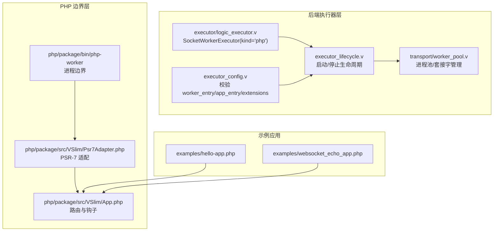
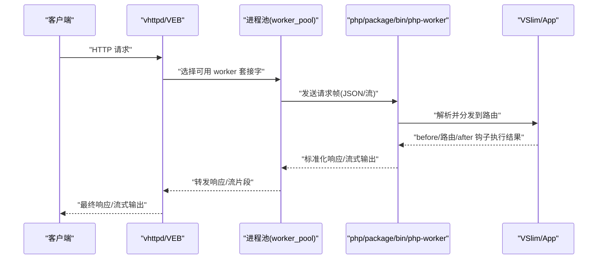
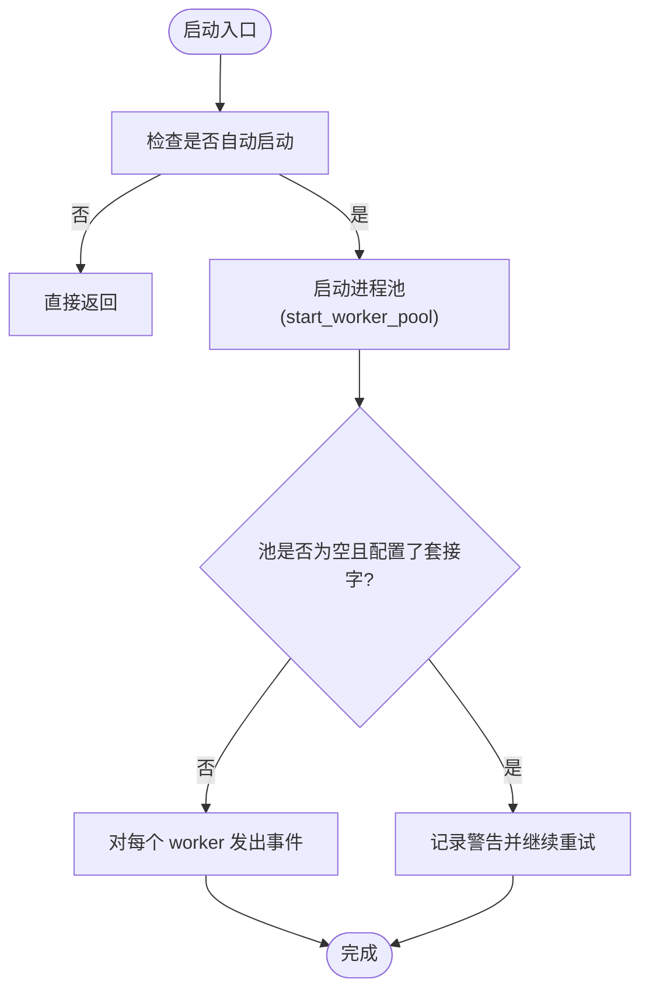
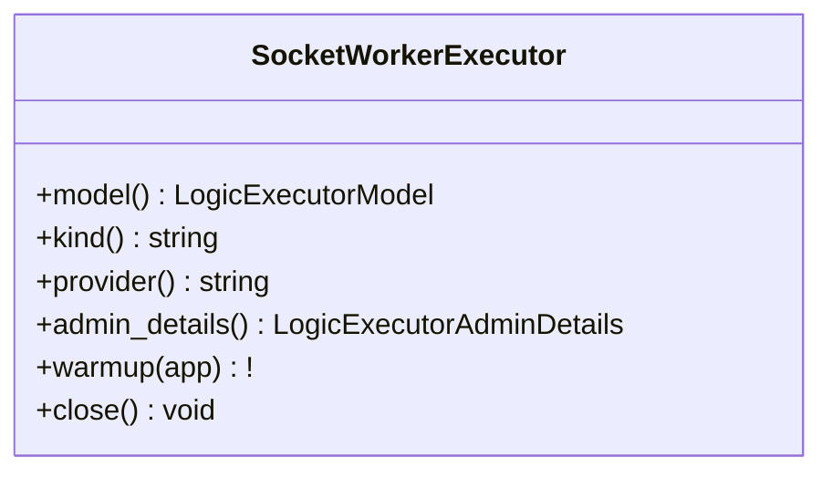
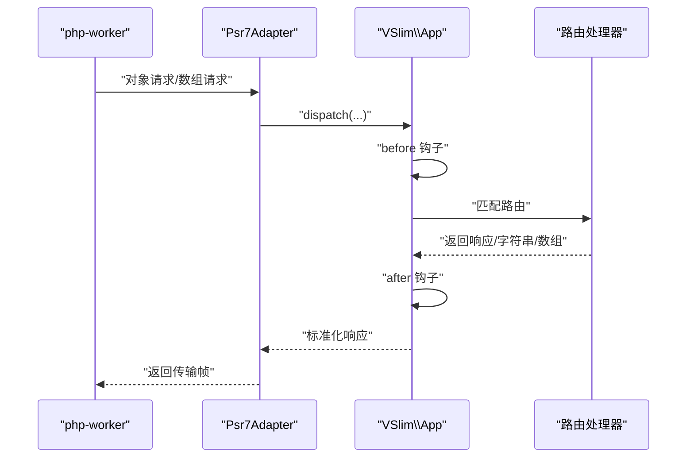
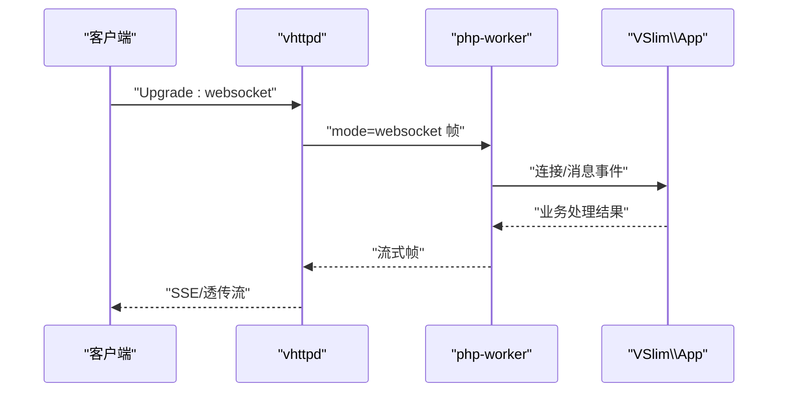
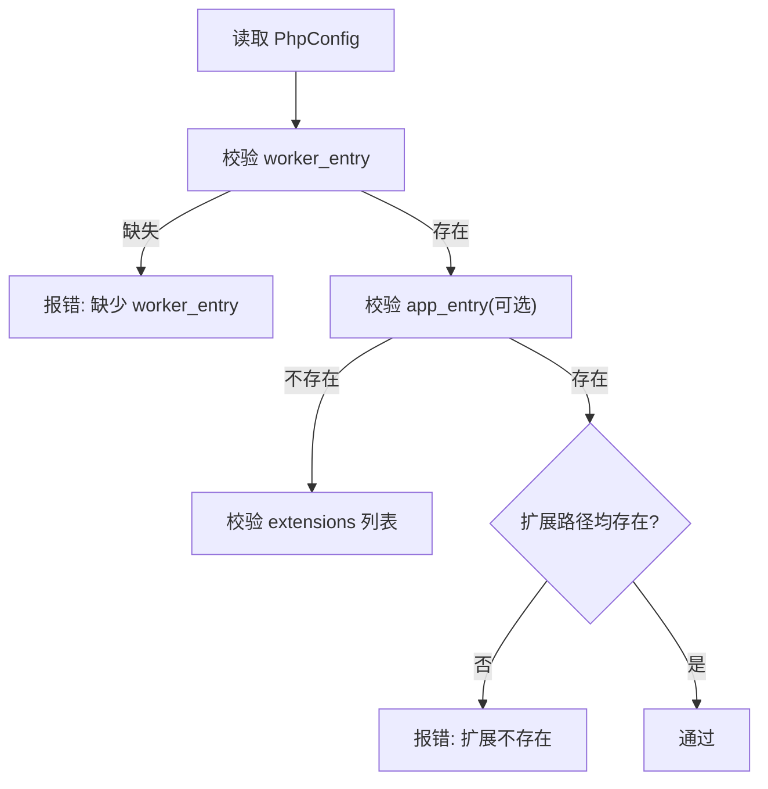
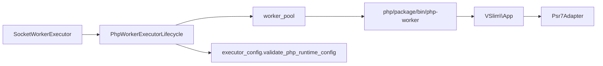

# PHP Worker 执行器

<cite>
**本文引用的文件**
- [README.md](file://README.md)
- [executor_lifecycle.v](file://src/executor_lifecycle.v)
- [logic_executor.v](file://src/executor/logic_executor.v)
- [executor_config.v](file://src/executor_config.v)
- [worker_pool.v](file://src/transport/worker_pool.v)
- [config.v](file://src/config/config.v)
- [hello-app.php](file://examples/hello-app.php)
- [websocket_echo_app.php](file://examples/websocket_echo_app.php)
- [php-worker](file://php/package/bin/php-worker)
- [Psr7Adapter.php](file://php/package/src/VSlim/Psr7Adapter.php)
- [App.php](file://php/package/src/VSlim/App.php)
</cite>

## 目录
1. [简介](#简介)
2. [项目结构](#项目结构)
3. [核心组件](#核心组件)
4. [架构总览](#架构总览)
5. [详细组件分析](#详细组件分析)
6. [依赖关系分析](#依赖关系分析)
7. [性能考量](#性能考量)
8. [故障排除指南](#故障排除指南)
9. [结论](#结论)
10. [附录](#附录)

## 简介
本文件系统性阐述 vhttpd 的 PHP Worker 执行器：从进程启动与进程池管理、到与 vhttpd 的集成方式（请求路由、参数传递、响应处理）、再到生命周期管理（初始化、请求处理循环、优雅关闭）。同时给出 PHP 应用开发模式（框架集成、中间件支持、错误处理）、配置项、性能调优与故障排除建议，并提供可运行示例与最佳实践。

## 项目结构
围绕 PHP Worker 执行器的关键目录与文件：
- 后端执行器与生命周期：src/executor_*、src/transport/worker_pool.v
- PHP 运行时与框架桥接：php/package/src/VHttpd/*、php/package/src/VSlim/*
- 示例应用：examples/*.php
- 配置与验证：src/config/config.v、src/executor_config.v

**图表来源**
- [executor_lifecycle.v:69-113](file://src/executor_lifecycle.v#L69-L113)
- [logic_executor.v:101-134](file://src/executor/logic_executor.v#L101-L134)
- [executor_config.v:22-43](file://src/executor_config.v#L22-L43)
- [worker_pool.v](file://src/transport/worker_pool.v)
- [Psr7Adapter.php](file://php/package/src/VSlim/Psr7Adapter.php)
- [App.php](file://php/package/src/VSlim/App.php)
- [hello-app.php](file://examples/hello-app.php)
- [websocket_echo_app.php](file://examples/websocket_echo_app.php)

**章节来源**
- [README.md:1416-1819](file://README.md#L1416-L1819)
- [executor_lifecycle.v:69-113](file://src/executor_lifecycle.v#L69-L113)
- [logic_executor.v:101-134](file://src/executor/logic_executor.v#L101-L134)
- [executor_config.v:22-43](file://src/executor_config.v#L22-L43)
- [worker_pool.v](file://src/transport/worker_pool.v)

## 核心组件
- 执行器类型与标识
  - SocketWorkerExecutor 提供 kind='php' 与 provider='php-worker'，用于声明该执行器为基于套接字的 PHP 工作者模型。
- 生命周期管理
  - 启动：根据配置命令、环境变量、套接字列表与工作目录启动进程池；若池为空但配置了套接字，记录警告并持续重试。
  - 停止：优雅关闭所有已管理的工作者进程。
- 配置校验
  - 校验 worker_entry 是否存在；可选 app_entry 存在性；扩展路径存在性。
- 进程池与套接字
  - 使用 transport 层的 worker_pool 负责进程生命周期与套接字通信。

**章节来源**
- [logic_executor.v:101-134](file://src/executor/logic_executor.v#L101-L134)
- [executor_lifecycle.v:69-113](file://src/executor_lifecycle.v#L69-L113)
- [executor_config.v:22-43](file://src/executor_config.v#L22-L43)
- [worker_pool.v](file://src/transport/worker_pool.v)

## 架构总览
PHP Worker 执行器的整体数据流与职责划分如下：

**图表来源**
- [README.md:1428-1445](file://README.md#L1428-L1445)
- [worker_pool.v](file://src/transport/worker_pool.v)
- [Psr7Adapter.php](file://php/package/src/VSlim/Psr7Adapter.php)
- [App.php](file://php/package/src/VSlim/App.php)

## 详细组件分析

### 组件一：生命周期与进程池管理
- 启动流程
  - 若未启用自动启动则直接返回；否则调用 transport.start_worker_pool，传入命令、环境、套接字数组与工作目录。
  - 如果池中无进程但配置了套接字，发出“空池”告警事件并持续重试。
  - 对每个已启动的 worker 发出“worker.started”或“worker.restart_scheduled”事件。
- 停止流程
  - 调用 transport.stop_worker_pool 关闭所有已管理的 worker。
- 进程池职责
  - 负责进程创建、存活检测、重启调度与套接字管理。

**图表来源**
- [executor_lifecycle.v:69-113](file://src/executor_lifecycle.v#L69-L113)

**章节来源**
- [executor_lifecycle.v:69-113](file://src/executor_lifecycle.v#L69-L113)
- [worker_pool.v](file://src/transport/worker_pool.v)

### 组件二：执行器类型与提供商标识
- SocketWorkerExecutor 暴露：
  - model(): worker
  - kind(): "php"
  - provider(): "php-worker"
  - admin_details(): 用于管理界面展示的元信息
- warmup/close：当前为空实现，便于后续扩展。

**图表来源**
- [logic_executor.v:101-134](file://src/executor/logic_executor.v#L101-L134)

**章节来源**
- [logic_executor.v:101-134](file://src/executor/logic_executor.v#L101-L134)

### 组件三：PHP 应用与 VSlim 框架集成
- 边界进程
  - php/package/bin/php-worker 作为 PHP 工作者进程边界，负责加载用户引导文件并返回 VSlim\App。
- PSR-7 适配
  - VSlim/Psr7Adapter.php 将 PSR-7 风格请求转换为 VSlim 内部格式，或将 VSlim 响应标准化为传输帧。
- VSlim\App
  - 提供路由注册、before/after 钩子、命名路由、重定向等能力，形成完整的请求生命周期。
- 生命周期语义
  - before 钩子 -> 匹配组 before -> 路由处理器 -> app after -> 匹配组 after
  - 支持短路返回、异常冒泡至边界、非法返回值归一化为 500 错误。

**图表来源**
- [README.md:1651-1819](file://README.md#L1651-L1819)
- [Psr7Adapter.php](file://php/package/src/VSlim/Psr7Adapter.php)
- [App.php](file://php/package/src/VSlim/App.php)

**章节来源**
- [README.md:1651-1819](file://README.md#L1651-L1819)

### 组件四：WebSocket 与流式传输
- WebSocket 支持
  - vhttpd 检测 Upgrade: websocket 并复用 V 的 net.websocket 实现进行握手与帧处理。
  - 通过 mode=websocket 的帧将事件桥接到 php-worker。
- 流式传输
  - php-worker 支持流帧：
    - stream_type=sse：以真实 SSE 通过 veb.sse 转发
    - stream_type=text 或其他：透传模式，逐块向客户端发送（不缓冲/聚合）
  - 适用于 AI/token 流式工作负载。

**图表来源**
- [README.md:1447-1460](file://README.md#L1447-L1460)

**章节来源**
- [README.md:1438-1460](file://README.md#L1438-L1460)

### 组件五：配置与校验
- 必填项与校验规则
  - worker_entry 必须存在
  - app_entry 可选，若提供则必须存在
  - extensions 中的扩展路径必须存在
- 配置来源
  - config.PhpConfig 与 executor_config.validate_php_runtime_config

**图表来源**
- [executor_config.v:22-43](file://src/executor_config.v#L22-L43)

**章节来源**
- [executor_config.v:22-43](file://src/executor_config.v#L22-L43)
- [config.v](file://src/config/config.v)

## 依赖关系分析
- 执行器层依赖 transport 层的 worker_pool 进行进程与套接字管理。
- PHP 边界层依赖 VSlim 框架完成路由与钩子逻辑。
- 配置层提供运行时校验，确保 worker_entry、app_entry、extensions 的有效性。

**图表来源**
- [logic_executor.v:101-134](file://src/executor/logic_executor.v#L101-L134)
- [executor_lifecycle.v:69-113](file://src/executor_lifecycle.v#L69-L113)
- [executor_config.v:22-43](file://src/executor_config.v#L22-L43)
- [worker_pool.v](file://src/transport/worker_pool.v)
- [Psr7Adapter.php](file://php/package/src/VSlim/Psr7Adapter.php)
- [App.php](file://php/package/src/VSlim/App.php)

**章节来源**
- [logic_executor.v:101-134](file://src/executor/logic_executor.v#L101-L134)
- [executor_lifecycle.v:69-113](file://src/executor_lifecycle.v#L69-L113)
- [executor_config.v:22-43](file://src/executor_config.v#L22-L43)
- [worker_pool.v](file://src/transport/worker_pool.v)

## 性能考量
- 进程池规模与并发
  - 合理设置 worker 数量以匹配 CPU 与 I/O 特性；结合请求特征（CPU 密集 vs I/O 密集）调整。
- 套接字与负载均衡
  - 使用 vhttpd 的套接字选择策略进行请求分发；确保 worker 健康与存活检测有效。
- 流式传输优化
  - SSE/透传模式下减少缓冲，降低延迟；控制帧大小与频率，避免拥塞。
- VSlim 钩子与路由
  - 在 before/after 中避免阻塞操作；将耗时任务下沉至上游或异步队列。
- 配置与扩展
  - 精简 extensions，仅保留必要模块；确保 worker_entry/app_entry 路径正确，减少启动失败与重试成本。

## 故障排除指南
- worker 池为空但配置了套接字
  - 现象：启动后池为空，记录警告并持续重试。
  - 排查：确认 worker_entry 存在且可执行；检查命令、环境变量、工作目录；查看重启调度与日志。
- 启动失败与重启调度
  - 现象：部分 worker 未存活，触发重启调度事件。
  - 排查：检查进程退出码、资源限制、依赖库；定位具体 worker 的 socket_path 与 restart_count。
- 配置错误
  - 现象：启动前校验失败，提示缺少 worker_entry、app_entry 或扩展不存在。
  - 排查：核对配置文件与路径；使用绝对路径；确认权限。
- WebSocket/流式异常
  - 现象：升级失败或流中断。
  - 排查：确认 Upgrade 头；检查 php-worker 的 websocket 模式帧处理；验证流类型与客户端兼容性。

**章节来源**
- [executor_lifecycle.v:69-113](file://src/executor_lifecycle.v#L69-L113)
- [executor_config.v:22-43](file://src/executor_config.v#L22-L43)
- [README.md:1438-1460](file://README.md#L1438-L1460)

## 结论
PHP Worker 执行器通过清晰的边界进程与 VSlim 框架集成，实现了与 vhttpd 的高效协作。其生命周期管理、进程池与套接字调度、以及对 WebSocket/流式传输的支持，共同构成了稳定、可扩展的 PHP 应用运行时。配合严格的配置校验与可观测事件，开发者可以快速构建高性能、可维护的 PHP 应用。

## 附录

### A. 开发模式与最佳实践
- 框架集成
  - 引导函数返回 VSlim\App；利用路由与钩子组织业务逻辑。
- 中间件支持
  - 使用 before/after 钩子实现认证、限流、日志等横切关注点。
- 错误处理
  - 在钩子或处理器中抛出异常将冒泡至边界；保持返回值符合约定（响应对象/数组/字符串），避免非法返回导致 500 归一化。
- 示例参考
  - 最小示例：examples/hello-app.php
  - WebSocket 示例：examples/websocket_echo_app.php

**章节来源**
- [README.md:1651-1819](file://README.md#L1651-L1819)
- [hello-app.php](file://examples/hello-app.php)
- [websocket_echo_app.php](file://examples/websocket_echo_app.php)

### B. 配置选项与环境变量
- 关键配置项
  - worker_entry：PHP 工作者入口脚本路径（必填）
  - app_entry：应用引导脚本路径（可选）
  - extensions：PHP 扩展路径列表（可选）
- 环境变量
  - 可通过环境变量向 php-worker 注入运行时参数（如 VHTTPD_APP 指向示例应用）。

**章节来源**
- [executor_config.v:22-43](file://src/executor_config.v#L22-L43)
- [README.md:1774-1778](file://README.md#L1774-L1778)