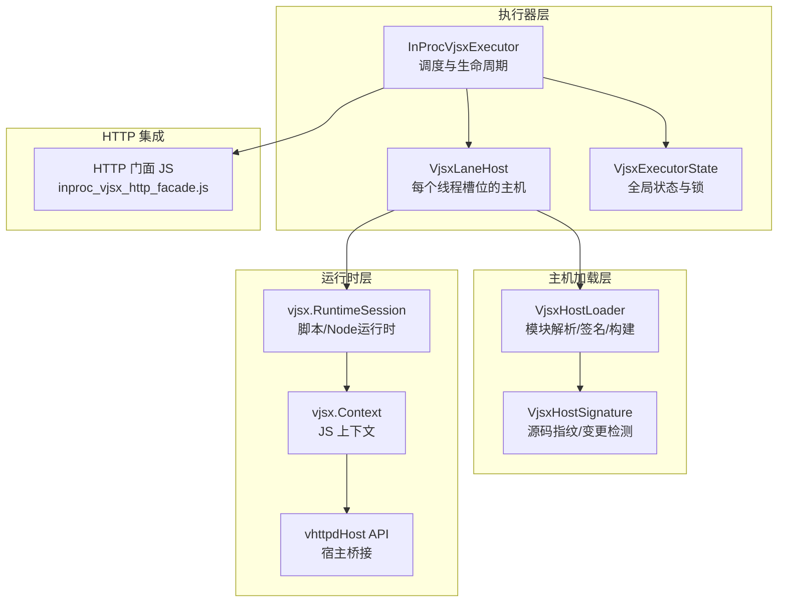
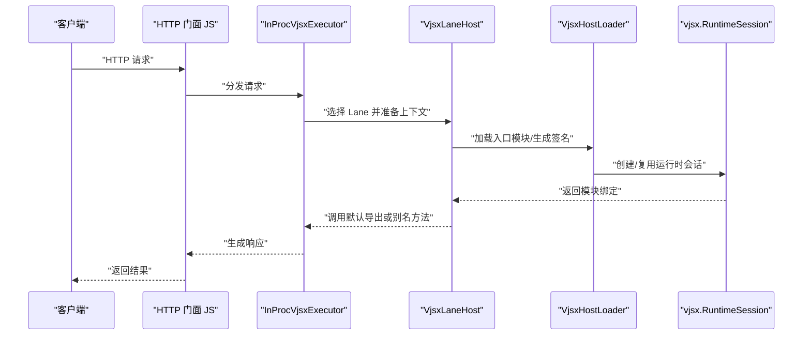
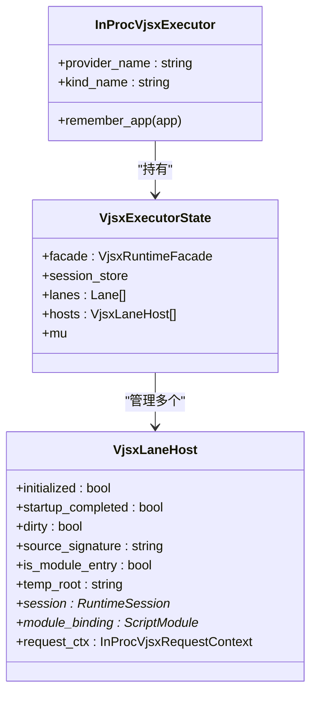
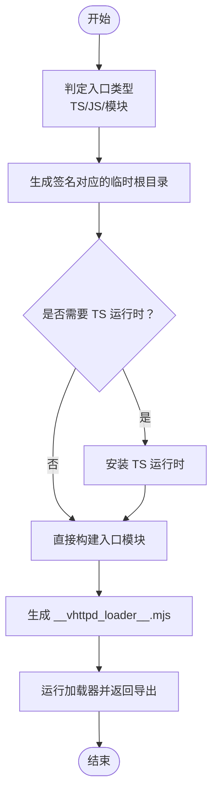
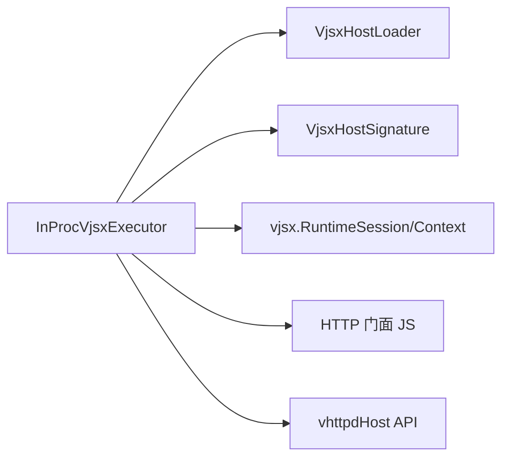

# VJSX 内嵌执行器

<cite>
**本文引用的文件**
- [inproc_vjsx_executor.v](file://src/executor/inproc_vjsx_executor.v)
- [vjsx_host_loader.v](file://src/executor/vjsx_host_loader.v)
- [inproc_vjsx_http_facade.js](file://src/inproc_vjsx_http_facade.js)
- [vjsx_host_signature.v](file://src/executor/vjsx_host_signature.v)
- [executor_spec.v](file://src/executor_spec.v)
- [plugin_runtime.v](file://src/plugin_runtime.v)
- [vjsx_runtime_config.v](file://src/config/runtime_config.v)
- [vjsx_runtime_config_test.v](file://src/inproc_vjsx_executor_test.v)
- [vjsx_runtime_config_example.toml](file://config/vhttpd.vjsx.example.toml)
</cite>

## 目录
1. [引言](#引言)
2. [项目结构](#项目结构)
3. [核心组件](#核心组件)
4. [架构总览](#架构总览)
5. [详细组件分析](#详细组件分析)
6. [依赖关系分析](#依赖关系分析)
7. [性能考虑](#性能考虑)
8. [故障排查指南](#故障排查指南)
9. [结论](#结论)
10. [附录](#附录)

## 引言
本技术文档围绕 vhttpd 的 VJSX 内嵌执行器展开，系统性阐述其在 V 环境中的实现原理与工程化实践。内容涵盖：
- JavaScript/TypeScript 编译与运行时环境管理（含脚本与 Node 风格运行时）
- 运行时签名与源码变更感知，确保热重建与一致性
- VJSX 主机加载器的模块解析、依赖注入与运行时签名验证
- 与 HTTP 门面的集成方式，以及在 V 环境中执行前端应用的完整链路
- 开发模式：组件架构、状态管理与事件处理
- 配置项、性能优化策略与调试技巧
- 完整示例与最佳实践

## 项目结构
VJSX 内嵌执行器位于 src/executor 目录，配合运行时配置、插件桥接与示例应用共同构成端到端能力：
- 执行器与调度：src/executor/inproc_vjsx_executor.v
- 主机加载器与签名：src/executor/vjsx_host_loader.v、src/executor/vjsx_host_signature.v
- HTTP 门面 JS 源：src/inproc_vjsx_http_facade.js
- 配置解析与桥接：src/executor_spec.v、src/plugin_runtime.v、src/config/runtime_config.v
- 示例与测试：examples/vjsx、config/vhttpd.vjsx.example.toml、相关测试文件

图表来源
- [inproc_vjsx_executor.v:179-2754](file://src/executor/inproc_vjsx_executor.v#L179-L2754)
- [vjsx_host_loader.v:1-107](file://src/executor/vjsx_host_loader.v#L1-L107)
- [vjsx_host_signature.v](file://src/executor/vjsx_host_signature.v)

章节来源
- [inproc_vjsx_executor.v:179-2754](file://src/executor/inproc_vjsx_executor.v#L179-L2754)
- [vjsx_host_loader.v:1-107](file://src/executor/vjsx_host_loader.v#L1-L107)

## 核心组件
- InProcVjsxExecutor：内嵌执行器主体，负责多线程槽位（Lane）管理、请求分发、生命周期控制与资源回收。
- VjsxLaneHost：每个执行槽位对应的主机实例，维护运行时会话、模块绑定、临时根目录与请求上下文。
- VjsxHostLoader：负责入口文件探测、类型判定、TS/JS 模块编译、临时根目录隔离与加载器注入。
- VjsxHostSignature：基于源码指纹与依赖图的签名生成，用于判断是否需要重建主机。
- vjsx.RuntimeSession：运行时会话，支持 script 与 node 两种运行时配置。
- vhttpdHost API：向 JS 运行时暴露的宿主能力，如 emit、snapshot、config、httpFetch、bridgeDispatch、websocketDispatch 等。

章节来源
- [inproc_vjsx_executor.v:153-2754](file://src/executor/inproc_vjsx_executor.v#L153-L2754)
- [vjsx_host_loader.v:1-107](file://src/executor/vjsx_host_loader.v#L1-L107)
- [vjsx_host_signature.v](file://src/executor/vjsx_host_signature.v)

## 架构总览
VJSX 内嵌执行器采用“多槽位 + 运行时会话”的架构设计，每个线程对应一个 Lane，每个 Lane 维护一个独立的 vjsx.RuntimeSession 与模块绑定。执行器通过宿主 API 将 V 环境的能力注入 JS 运行时，并通过 HTTP 门面将 HTTP 请求映射到 JS 入口模块。

图表来源
- [inproc_vjsx_executor.v:2342-2351](file://src/executor/inproc_vjsx_executor.v#L2342-L2351)
- [inproc_vjsx_executor.v:3155-3197](file://src/executor/inproc_vjsx_executor.v#L3155-L3197)
- [vjsx_host_loader.v:89-107](file://src/executor/vjsx_host_loader.v#L89-L107)

## 详细组件分析

### 执行器与调度（InProcVjsxExecutor）
- 多槽位管理：根据配置创建多个 Lane，每个 Lane 对应一个 VjsxLaneHost，内部维护会话、模块绑定与请求上下文。
- 生命周期：初始化阶段安装 HTTP 门面与宿主 API；运行期按需重建主机以适配源码变更；关闭时释放会话与通道。
- 调度策略：基于线程 ID 选择 Lane，保证请求在固定槽位内完成，避免跨线程共享状态带来的竞态。
- 关键函数与职责
  - 新建执行器与线程池：[new_inproc_vjsx_executor(...):441-475](file://src/executor/inproc_vjsx_executor.v#L441-L475)
  - 创建运行时会话（script/node）：[inproc_vjsx_new_runtime_session_ptr(...):3291-3316](file://src/executor/inproc_vjsx_executor.v#L3291-L3316)
  - 安装 HTTP 门面与宿主 API：[install_inproc_http_facade(...):2342-2351](file://src/executor/inproc_vjsx_executor.v#L2342-L2351)、[install_inproc_host_api(...):2937-2946](file://src/executor/inproc_vjsx_executor.v#L2937-L2946)
  - 调用模块入口（默认导出/别名方法）：[call_module_entry(...):3155-3197](file://src/executor/inproc_vjsx_executor.v#L3155-L3197)

图表来源
- [inproc_vjsx_executor.v:158-185](file://src/executor/inproc_vjsx_executor.v#L158-L185)
- [inproc_vjsx_executor.v:179-185](file://src/executor/inproc_vjsx_executor.v#L179-L185)

章节来源
- [inproc_vjsx_executor.v:441-475](file://src/executor/inproc_vjsx_executor.v#L441-L475)
- [inproc_vjsx_executor.v:3291-3316](file://src/executor/inproc_vjsx_executor.v#L3291-L3316)
- [inproc_vjsx_executor.v:2342-2351](file://src/executor/inproc_vjsx_executor.v#L2342-L2351)
- [inproc_vjsx_executor.v:2937-2946](file://src/executor/inproc_vjsx_executor.v#L2937-L2946)
- [inproc_vjsx_executor.v:3155-3197](file://src/executor/inproc_vjsx_executor.v#L3155-L3197)

### 主机加载器（VjsxHostLoader）
- 入口类型判定：区分 TypeScript 文件与 JS 模块（mjs/cjs/mts/cts），决定是否安装 TS 运行时与模块构建。
- 临时根目录：为每次签名生成独立的临时根目录，隔离模块缓存与构建产物，避免并发冲突。
- 加载器注入：生成一个 __vhttpd_loader__.mjs，将入口模块的导出挂载到 globalThis，供宿主统一访问。
- 关键函数
  - 判定入口是否作为模块运行：[vjsx_entry_runs_as_module(...):13-25](file://src/executor/vjsx_host_loader.v#L13-L25)
  - 计算文件系统根目录：[vjsx_fs_roots(...):27-37](file://src/executor/vjsx_host_loader.v#L27-L37)
  - 加载入口并返回模块导出：[load_inproc_vjsx_entry(...):89-107](file://src/executor/vjsx_host_loader.v#L89-L107)

图表来源
- [vjsx_host_loader.v:13-25](file://src/executor/vjsx_host_loader.v#L13-L25)
- [vjsx_host_loader.v:89-107](file://src/executor/vjsx_host_loader.v#L89-L107)

章节来源
- [vjsx_host_loader.v:13-25](file://src/executor/vjsx_host_loader.v#L13-L25)
- [vjsx_host_loader.v:27-37](file://src/executor/vjsx_host_loader.v#L27-L37)
- [vjsx_host_loader.v:89-107](file://src/executor/vjsx_host_loader.v#L89-L107)

### 运行时签名与重建（VjsxHostSignature）
- 签名生成：基于入口文件与依赖图生成稳定指纹，用于判断是否需要重建主机。
- 变更检测：当签名变化时，触发主机重建，确保 JS 运行时与最新源码保持一致。
- 测试验证：提供针对 MJS 依赖变更与辅助模块变更的重建测试，覆盖多种场景。
- 关键点
  - 签名生成与比较：[vjsx_source_signature_for_config(...):471-475](file://src/executor/inproc_vjsx_executor.v#L471-L475)
  - 重建触发条件：[ensure_lane_host(...):2100-2150](file://src/executor/inproc_vjsx_executor.v#L2100-L2150)
  - 测试用例：[test_inproc_vjsx_executor_rebuilds_lane_host_when_source_signature_changes(...):992-1031](file://src/inproc_vjsx_executor_test.v#L992-L1031)、[test_inproc_vjsx_executor_rebuilds_lane_host_when_mjs_dependency_changes_without_size_change(...):1047-1086](file://src/inproc_vjsx_executor_test.v#L1047-L1086)

章节来源
- [inproc_vjsx_executor.v:471-475](file://src/executor/inproc_vjsx_executor.v#L471-L475)
- [inproc_vjsx_executor_test.v:992-1031](file://src/inproc_vjsx_executor_test.v#L992-L1031)
- [inproc_vjsx_executor_test.v:1047-1086](file://src/inproc_vjsx_executor_test.v#L1047-L1086)

### HTTP 门面集成（inproc_vjsx_http_facade.js）
- 作用：在 JS 运行时中注入 HTTP 门面，将 HTTP 请求转换为 JS 可消费的上下文对象，再交由入口模块处理。
- 集成方式：执行器启动时通过 eval 将门面源码注入 JS 上下文，随后在请求到达时进行参数转换与回调调用。
- 关键点
  - 注入门面：[install_inproc_http_facade(...):2342-2351](file://src/executor/inproc_vjsx_executor.v#L2342-L2351)
  - 门面源码：[inproc_vjsx_http_facade.js](file://src/inproc_vjsx_http_facade.js)

章节来源
- [inproc_vjsx_executor.v:2342-2351](file://src/executor/inproc_vjsx_executor.v#L2342-L2351)
- [inproc_vjsx_http_facade.js](file://src/inproc_vjsx_http_facade.js)

### 宿主 API 与能力边界（vhttpdHost）
- 能力清单：emit（事件上报）、snapshot（运行时/应用快照聚合）、config（运行时配置查询）、httpFetch（受限网络访问）、bridgeDispatch、websocketDispatch、sessionStore、readTextFile、findCodexSessionPath 等。
- 权限控制：部分能力受配置开关限制（如 enable_network、enable_fs），未启用时返回安全的空值或错误提示。
- 关键点
  - 宿主对象装配：[install_inproc_host_api(...):2937-2946](file://src/executor/inproc_vjsx_executor.v#L2937-L2946)
  - 各能力实现：emit/snapshot/config/httpFetch 等分别在 [inproc_vjsx_executor.v:2353-2484](file://src/executor/inproc_vjsx_executor.v#L2353-L2484) 中定义

章节来源
- [inproc_vjsx_executor.v:2937-2946](file://src/executor/inproc_vjsx_executor.v#L2937-L2946)
- [inproc_vjsx_executor.v:2353-2484](file://src/executor/inproc_vjsx_executor.v#L2353-L2484)

### 配置解析与插件桥接
- 嵌入式运行时配置解析：从 VhttpdConfig 中提取 VJSX 相关字段，形成 VjsxRuntimeFacadeConfig。
- 插件侧桥接：插件配置通过 plugin_runtime.v 转换为嵌入式执行器可识别的配置。
- 关键点
  - 配置解析：[resolve_embedded_host_runtime_config(...):158-185](file://src/executor_spec.v#L158-L185)
  - 插件配置桥接：[vjsx_plugin_runtime_config(...):16-48](file://src/plugin_runtime.v#L16-L48)
  - 示例配置：[vhttpd.vjsx.example.toml](file://config/vhttpd.vjsx.example.toml)

章节来源
- [executor_spec.v:158-185](file://src/executor_spec.v#L158-L185)
- [plugin_runtime.v:16-48](file://src/plugin_runtime.v#L16-L48)
- [vjsx_runtime_config_example.toml](file://config/vhttpd.vjsx.example.toml)

## 依赖关系分析
- 执行器对加载器与签名模块存在直接依赖，确保每次请求前能正确加载与重建主机。
- 运行时会话与上下文由 vjsx 提供，执行器通过 HostValueBuilder 将 V 能力注入 JS。
- HTTP 门面与宿主 API 在执行器启动阶段一次性安装，后续请求复用。

图表来源
- [inproc_vjsx_executor.v:179-2754](file://src/executor/inproc_vjsx_executor.v#L179-L2754)
- [vjsx_host_loader.v:1-107](file://src/executor/vjsx_host_loader.v#L1-L107)
- [vjsx_host_signature.v](file://src/executor/vjsx_host_signature.v)

章节来源
- [inproc_vjsx_executor.v:179-2754](file://src/executor/inproc_vjsx_executor.v#L179-L2754)
- [vjsx_host_loader.v:1-107](file://src/executor/vjsx_host_loader.v#L1-L107)

## 性能考虑
- 线程槽位与亲和：通过 thread_count 控制 Lane 数量，减少跨线程切换开销；任务通道设置合理容量以平衡吞吐与内存占用。
- 运行时选择：script 适合轻量脚本，node 适合需要 Node 生态的模块；按需选择以降低启动与运行成本。
- 热重建策略：仅在签名变化时重建主机，避免频繁重启；临时根目录隔离可减少缓存污染。
- 能力开关：按需开启 enable_network/enable_fs，避免不必要的系统调用与权限检查。
- 快照聚合：聚合多槽位运行时快照，减少重复采样与序列化开销。

## 故障排查指南
- 签名未更新导致的“旧代码”问题：确认签名生成逻辑与文件变更检测是否生效，参考测试用例验证重建行为。
- 模块导入失败：检查入口类型判定与临时根目录隔离是否正确，确保 __vhttpd_loader__.mjs 正常生成与加载。
- 网络/文件能力不可用：检查 enable_network/enable_fs 是否开启，宿主 API 返回的错误信息可帮助定位。
- 事件上报无效：确认 vhttpdHost.emit 的参数格式与事件类型规范化逻辑。
- 配置不生效：核对配置解析链路与插件桥接逻辑，确保最终传入执行器的配置正确。

章节来源
- [inproc_vjsx_executor_test.v:992-1031](file://src/inproc_vjsx_executor_test.v#L992-L1031)
- [inproc_vjsx_executor_test.v:1047-1086](file://src/inproc_vjsx_executor_test.v#L1047-L1086)
- [vjsx_host_loader.v:89-107](file://src/executor/vjsx_host_loader.v#L89-L107)
- [inproc_vjsx_executor.v:2711-2754](file://src/executor/inproc_vjsx_executor.v#L2711-L2754)

## 结论
VJSX 内嵌执行器通过“多槽位 + 运行时会话 + 签名重建 + 宿主 API 注入”的组合，实现了在 V 环境中稳定、可控且高性能地执行前端应用。其模块化的设计便于扩展与维护，同时提供了完善的权限控制与可观测性接口，满足生产级部署与运维需求。

## 附录
- 示例应用：examples/vjsx 下包含多个演示应用，可作为开发与调试的起点。
- 配置参考：config/vhttpd.vjsx.example.toml 提供典型配置项说明与示例。
- 最佳实践：
  - 使用 TypeScript 并启用严格模式，提升类型安全与可维护性。
  - 合理划分模块边界，避免单入口过大导致重建成本高。
  - 仅在必要时开启网络/文件能力，遵循最小权限原则。
  - 利用快照与事件上报进行运行时观测，及时发现异常。