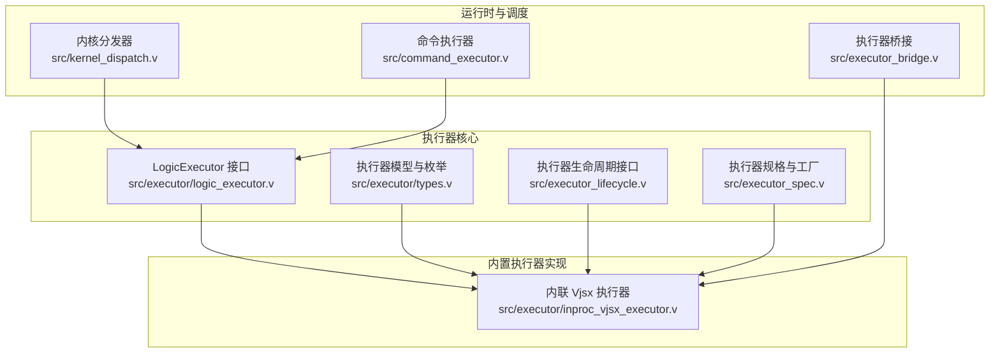
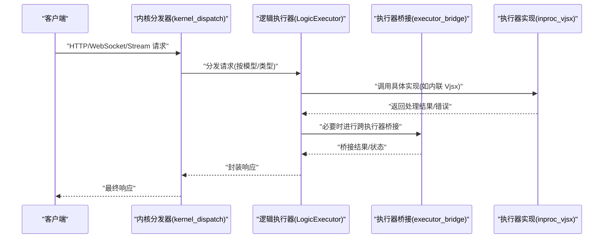
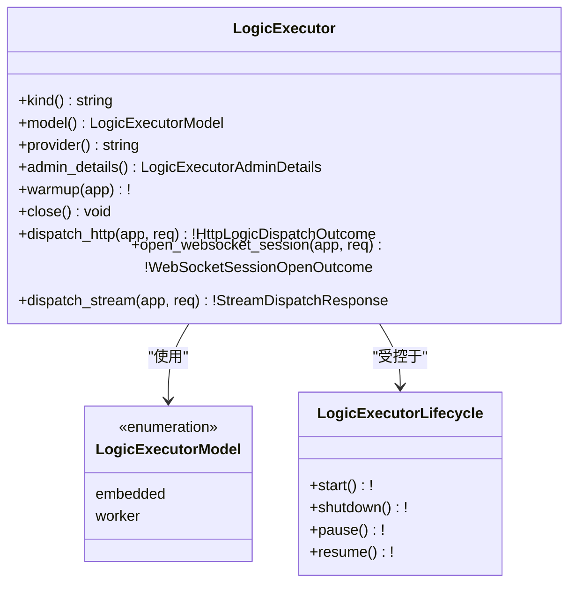
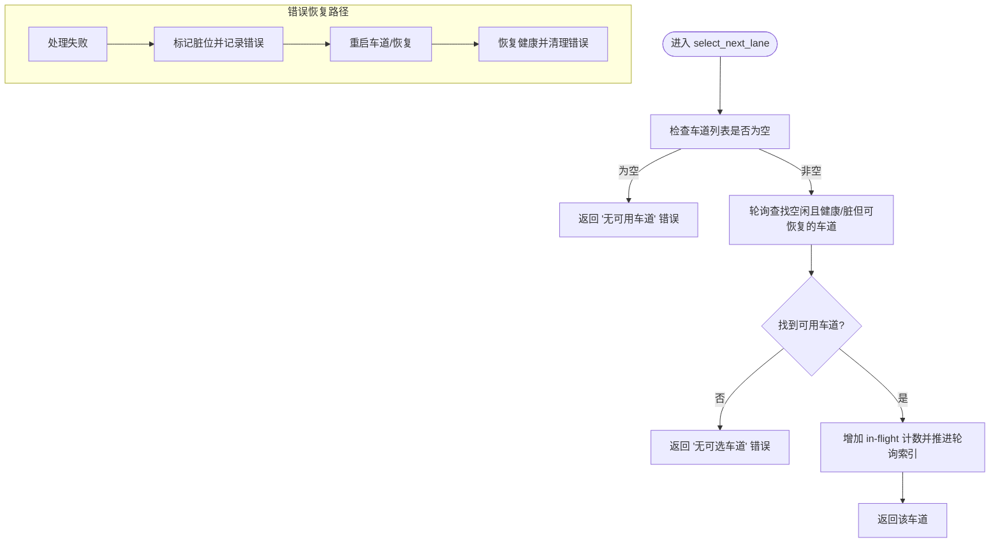
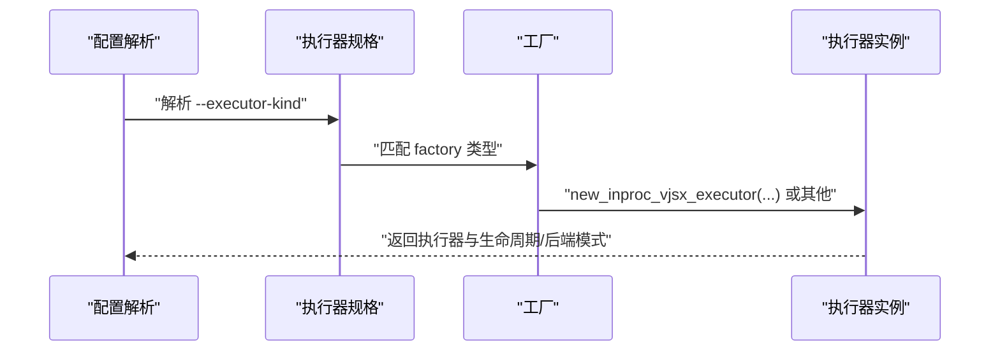
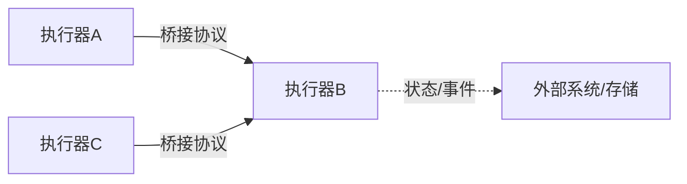
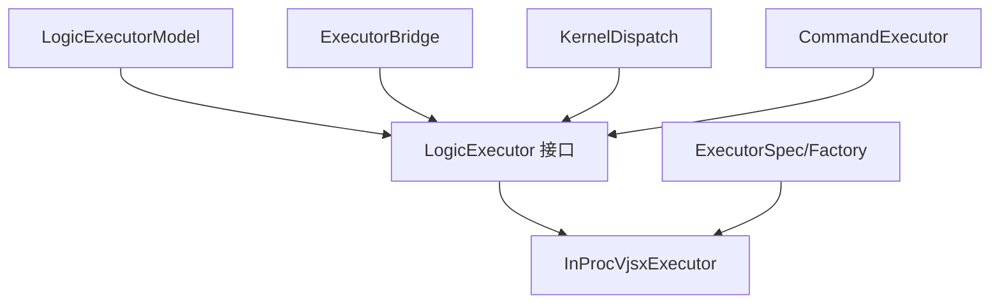

# 执行器类型与架构

<cite>
**本文引用的文件**
- [src/executor/logic_executor.v](file://src/executor/logic_executor.v)
- [src/executor/types.v](file://src/executor/types.v)
- [src/executor/inproc_vjsx_executor.v](file://src/executor/inproc_vjsx_executor.v)
- [src/executor_spec.v](file://src/executor_spec.v)
- [src/executor_lifecycle.v](file://src/executor_lifecycle.v)
- [src/executor/bridge.v](file://src/executor_bridge.v)
- [src/kernel_dispatch.v](file://src/kernel_dispatch.v)
- [src/command_executor.v](file://src/command_executor.v)
- [src/server_logic_test.v](file://src/server_logic_test.v)
- [src/logic_executor_test.v](file://src/logic_executor_test.v)
- [src/inproc_vjsx_executor_test.v](file://src/inproc_vjsx_executor_test.v)
</cite>

## 目录
1. [简介](#简介)
2. [项目结构](#项目结构)
3. [核心组件](#核心组件)
4. [架构总览](#架构总览)
5. [详细组件分析](#详细组件分析)
6. [依赖关系分析](#依赖关系分析)
7. [性能考量](#性能考量)
8. [故障排查指南](#故障排查指南)
9. [结论](#结论)
10. [附录](#附录)

## 简介
本文件面向 vhttpd 的执行器系统，系统性阐述执行器类型、架构设计与运行时行为，重点覆盖以下主题：
- 执行器接口规范与生命周期管理
- 不同执行器类型的职责分工与协作机制
- 逻辑执行器的设计原理（请求处理、错误处理、状态恢复）
- 执行器桥接机制与跨执行器数据交换
- 执行器选择策略与最佳实践

## 项目结构
执行器相关代码主要位于 src/executor 及其周边模块中，围绕“接口定义—实现—生命周期—配置—桥接—调度”形成闭环。

**图表来源**
- [src/executor/logic_executor.v:1-120](file://src/executor/logic_executor.v#L1-L120)
- [src/executor/types.v:60-120](file://src/executor/types.v#L60-L120)
- [src/executor/inproc_vjsx_executor.v:170-250](file://src/executor/inproc_vjsx_executor.v#L170-L250)
- [src/executor_spec.v:220-263](file://src/executor_spec.v#L220-L263)
- [src/executor_bridge.v:1-200](file://src/executor_bridge.v#L1-L200)
- [src/kernel_dispatch.v:1-200](file://src/kernel_dispatch.v#L1-L200)
- [src/command_executor.v:1-200](file://src/command_executor.v#L1-L200)

**章节来源**
- [src/executor/logic_executor.v:1-120](file://src/executor/logic_executor.v#L1-L120)
- [src/executor/types.v:60-120](file://src/executor/types.v#L60-L120)
- [src/executor/inproc_vjsx_executor.v:170-250](file://src/executor/inproc_vjsx_executor.v#L170-L250)
- [src/executor_spec.v:220-263](file://src/executor_spec.v#L220-L263)

## 核心组件
- 执行器接口：统一抽象 HTTP/WebSocket/流式等请求分发能力，以及生命周期管理方法。
- 执行器模型：区分嵌入式与工作线程型两类模型，决定资源占用与隔离策略。
- 内置执行器：内联 Vjsx 执行器作为默认逻辑执行器，支持多车道并发与健康检查。
- 执行器规格与工厂：描述可选执行器种类、别名、生命周期、后端模式与配置表面。
- 桥接与调度：在内核层将请求路由到具体执行器，并在执行器间进行必要的状态/数据交换。

**章节来源**
- [src/executor/logic_executor.v:1-120](file://src/executor/logic_executor.v#L1-L120)
- [src/executor/types.v:60-120](file://src/executor/types.v#L60-L120)
- [src/executor/inproc_vjsx_executor.v:441-520](file://src/executor/inproc_vjsx_executor.v#L441-L520)
- [src/executor_spec.v:27-48](file://src/executor_spec.v#L27-L48)

## 架构总览
下图展示从内核到执行器再到桥接的整体调用链路与职责边界：

**图表来源**
- [src/kernel_dispatch.v:1-200](file://src/kernel_dispatch.v#L1-L200)
- [src/executor/logic_executor.v:1-120](file://src/executor/logic_executor.v#L1-L120)
- [src/executor/inproc_vjsx_executor.v:907-932](file://src/executor/inproc_vjsx_executor.v#L907-L932)
- [src/executor_bridge.v:1-200](file://src/executor_bridge.v#L1-L200)

## 详细组件分析

### 执行器接口与生命周期
- 接口职责
  - 提供 HTTP、WebSocket、流式等分发入口，返回标准化结果或错误。
  - 提供 warmup/close 生命周期钩子，用于预热与资源回收。
  - 提供 admin_details 以暴露执行器元信息（类型、提供商、模型、配置摘要）。
- 生命周期接口
  - 定义执行器生命周期阶段与切换条件，确保在不同宿主模式（嵌入/工作线程）下正确初始化与关闭。

**图表来源**
- [src/executor/logic_executor.v:1-120](file://src/executor/logic_executor.v#L1-L120)
- [src/executor/types.v:60-120](file://src/executor/types.v#L60-L120)
- [src/executor_lifecycle.v:1-60](file://src/executor_lifecycle.v#L1-L60)

**章节来源**
- [src/executor/logic_executor.v:1-120](file://src/executor/logic_executor.v#L1-L120)
- [src/executor/types.v:60-120](file://src/executor/types.v#L60-L120)
- [src/executor_lifecycle.v:1-60](file://src/executor_lifecycle.v#L1-L60)

### 内联 Vjsx 执行器（InProc Vjsx Executor）
- 设计理念
  - 多车道并发：每个车道独立承载一次请求处理，轮询选择空闲健康车道，避免争用。
  - 健康与脏位管理：车道出现错误时标记为“脏”，需重启后恢复；正常处理后清理状态。
  - 轮询与亲和：支持轮询索引推进与亲和任务队列，保证负载均衡与低抖动。
- 关键流程
  - 选择可用车道：优先挑选空闲且健康的车道；若无可选则报错。
  - 分配与释放：分配成功后增加 in-flight 计数；处理完成后释放并更新状态。
  - 错误恢复：记录最后错误，重启后恢复健康；支持幂等重试与状态清理。
- 并发与通道
  - 每个车道维护多个任务通道（WebSocket、快照、预热、泵任务、亲和、停止），保障异步解耦与背压控制。

**图表来源**
- [src/executor/inproc_vjsx_executor.v:907-932](file://src/executor/inproc_vjsx_executor.v#L907-L932)
- [src/executor/inproc_vjsx_executor.v:1628-1669](file://src/executor/inproc_vjsx_executor.v#L1628-L1669)

**章节来源**
- [src/executor/inproc_vjsx_executor.v:441-520](file://src/executor/inproc_vjsx_executor.v#L441-L520)
- [src/executor/inproc_vjsx_executor.v:907-932](file://src/executor/inproc_vjsx_executor.v#L907-L932)
- [src/executor/inproc_vjsx_executor.v:1628-1669](file://src/executor/inproc_vjsx_executor.v#L1628-L1669)

### 执行器规格与工厂
- 规格描述
  - 包含 kind、provider、逻辑模型、后端模式、生命周期、配置表面等字段。
  - 配置表面定义 CLI 标志与配置段落，便于用户选择与定制。
- 工厂与选择
  - 根据 kind 查找规格，调用对应工厂构建执行器实例。
  - 返回执行器与后端模式、生命周期信息，供上层编排。

**图表来源**
- [src/executor_spec.v:27-48](file://src/executor_spec.v#L27-L48)
- [src/executor_spec.v:224-244](file://src/executor_spec.v#L224-L244)

**章节来源**
- [src/executor_spec.v:27-48](file://src/executor_spec.v#L27-L48)
- [src/executor_spec.v:224-244](file://src/executor_spec.v#L224-L244)

### 执行器桥接机制
- 目标
  - 在不同执行器之间传递状态、事件或数据，实现跨域协作。
- 实现要点
  - 通过桥接模块对执行器进行统一抽象与适配。
  - 在内核层或业务层触发桥接动作，确保一致性与可观测性。
- 典型场景
  - 状态同步：将一个执行器的内部状态映射到另一个执行器上下文。
  - 数据交换：在执行器间转发请求或通知，保持事务语义。

**图表来源**
- [src/executor_bridge.v:1-200](file://src/executor_bridge.v#L1-L200)

**章节来源**
- [src/executor_bridge.v:1-200](file://src/executor_bridge.v#L1-L200)

### 请求处理与错误处理
- 请求处理
  - 内核根据请求类型与执行器模型选择合适分发路径。
  - 执行器实现负责解析请求、调用处理器、生成响应。
- 错误处理
  - 统一错误返回格式，包含错误码、消息与上下文。
  - 对于内联 Vjsx 执行器，错误会标记车道状态并触发恢复流程。
- 性能优化
  - 多车道并发与轮询选择降低热点争用。
  - 通道容量与背压控制避免阻塞传播。
  - 快照与泵任务分离，提升 I/O 密集场景吞吐。

**章节来源**
- [src/kernel_dispatch.v:1-200](file://src/kernel_dispatch.v#L1-L200)
- [src/executor/inproc_vjsx_executor.v:907-932](file://src/executor/inproc_vjsx_executor.v#L907-L932)

## 依赖关系分析
- 组件耦合
  - 执行器实现依赖接口与模型定义，确保替换与扩展灵活。
  - 规格与工厂解耦了选择逻辑与构建细节，便于新增执行器类型。
  - 桥接模块作为横切关注点，被内核与执行器共同依赖。
- 外部依赖
  - 配置系统提供 CLI 标志与配置段落解析。
  - 状态存储与通道用于跨线程/进程通信与持久化。

**图表来源**
- [src/executor/logic_executor.v:1-120](file://src/executor/logic_executor.v#L1-L120)
- [src/executor/types.v:60-120](file://src/executor/types.v#L60-L120)
- [src/executor_spec.v:224-244](file://src/executor_spec.v#L224-L244)
- [src/executor_bridge.v:1-200](file://src/executor_bridge.v#L1-L200)
- [src/kernel_dispatch.v:1-200](file://src/kernel_dispatch.v#L1-L200)
- [src/command_executor.v:1-200](file://src/command_executor.v#L1-L200)

**章节来源**
- [src/executor/logic_executor.v:1-120](file://src/executor/logic_executor.v#L1-L120)
- [src/executor/types.v:60-120](file://src/executor/types.v#L60-L120)
- [src/executor_spec.v:224-244](file://src/executor_spec.v#L224-L244)
- [src/executor_bridge.v:1-200](file://src/executor_bridge.v#L1-L200)
- [src/kernel_dispatch.v:1-200](file://src/kernel_dispatch.v#L1-L200)
- [src/command_executor.v:1-200](file://src/command_executor.v#L1-L200)

## 性能考量
- 并发模型
  - 多车道并发与轮询选择降低热点争用，适合高 QPS 场景。
  - 通道容量与背压控制避免阻塞传播，提升稳定性。
- 资源管理
  - 健康检查与脏位机制确保异常快速隔离与恢复。
  - 预热与延迟唤醒减少冷启动开销。
- I/O 优化
  - 泵任务与快照分离，提升 I/O 密集场景吞吐。
  - WebSocket 任务通道容量合理设置，避免内存膨胀。

## 故障排查指南
- 常见错误与定位
  - “无可用车道”：检查车道数量与健康状态，确认是否存在长时间占用或异常。
  - “会话缺失”：确认执行器已正确初始化与预热，避免在未就绪状态下接收请求。
  - “处理失败”：查看车道最后错误日志，结合恢复流程验证重启是否成功。
- 测试用例参考
  - 身份与车道引导测试：验证执行器身份、提供方、车道数与配置概览。
  - 无车道时的显式错误：确保在未配置车道时返回明确错误。
  - 错误后的恢复与健康重建：验证脏位清理与健康恢复。
  - 车道等待与释放：验证多线程场景下的等待与释放行为。

**章节来源**
- [src/inproc_vjsx_executor_test.v:179-208](file://src/inproc_vjsx_executor_test.v#L179-L208)
- [src/inproc_vjsx_executor_test.v:1141-1162](file://src/inproc_vjsx_executor_test.v#L1141-L1162)
- [src/inproc_vjsx_executor_test.v:1169-1187](file://src/inproc_vjsx_executor_test.v#L1169-L1187)

## 结论
vhttpd 的执行器体系以统一接口为核心，通过模型与生命周期抽象实现灵活编排；内联 Vjsx 执行器提供高性能、可恢复的多车道并发处理能力；规格与工厂机制使执行器选择与配置清晰可控；桥接模块打通跨执行器协作。结合本文的架构视图、流程图与最佳实践，开发者可据此为不同场景选择合适的执行器类型并进行稳健的工程化落地。

## 附录
- 执行器选择策略
  - 低延迟与高并发：优先内联 Vjsx 执行器（嵌入式模型）。
  - 资源隔离与强隔离：选择工作线程型执行器（worker 模型）。
  - 配置与运维：通过规格配置表面统一 CLI 与配置段落，便于运维与审计。
- 最佳实践
  - 合理设置车道数量，结合压测结果调整。
  - 使用预热与延迟唤醒，降低冷启动风险。
  - 建立健康检查与自动恢复策略，保障线上稳定性。
  - 明确错误分类与恢复路径，完善可观测性与告警。