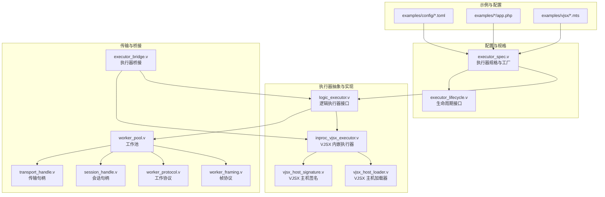
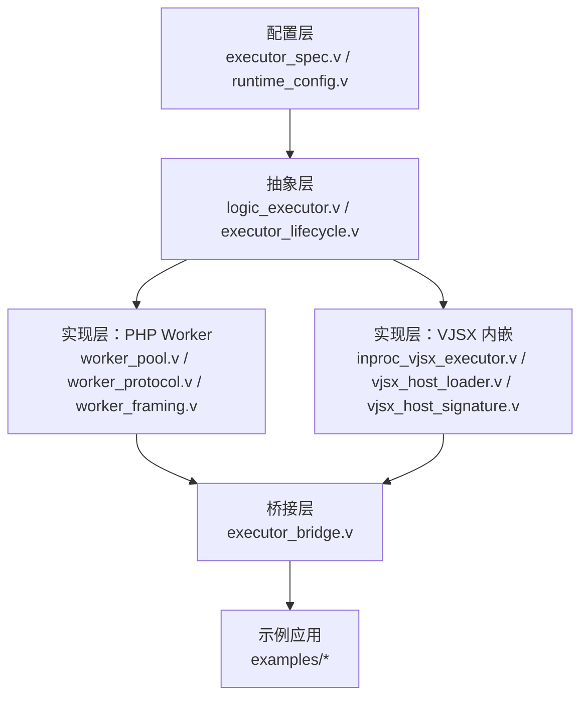
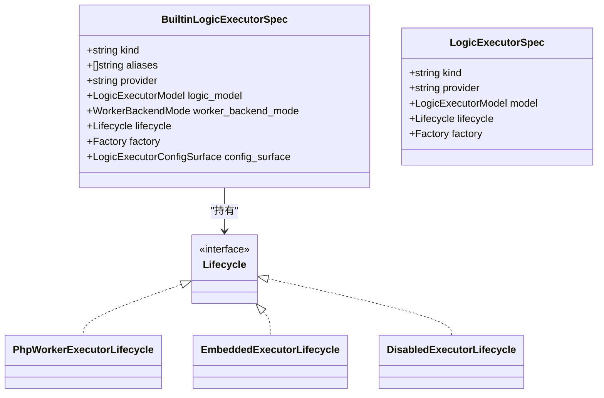
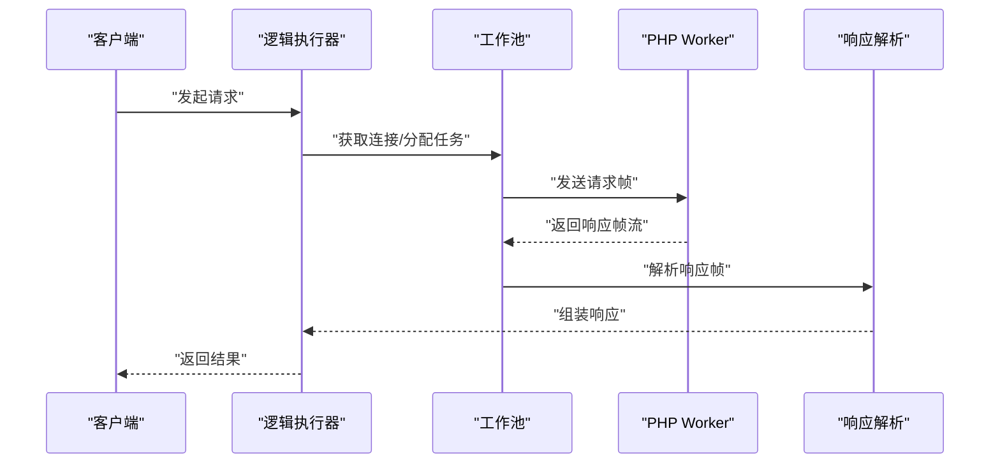
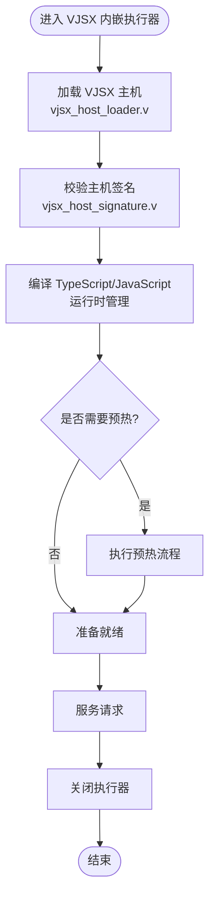
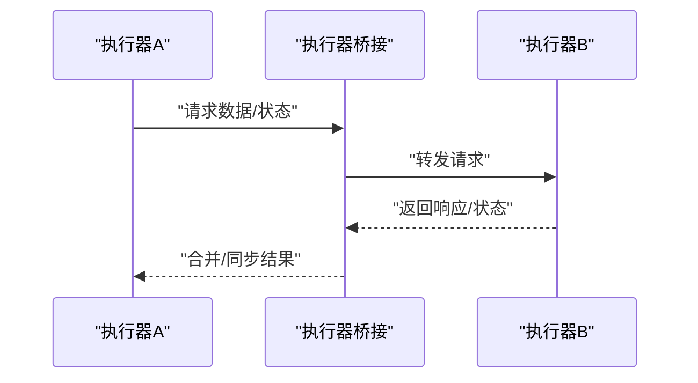
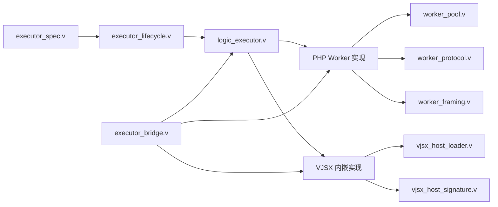

# 执行器系统

<cite>
**本文引用的文件**
- [src/executor/logic_executor.v](file://src/executor/logic_executor.v)
- [src/executor/inproc_vjsx_executor.v](file://src/executor/inproc_vjsx_executor.v)
- [src/executor/types.v](file://src/executor/types.v)
- [src/executor/vjsx_host_loader.v](file://src/executor/vjsx_host_loader.v)
- [src/executor/vjsx_host_signature.v](file://src/executor/vjsx_host_signature.v)
- [src/executor_spec.v](file://src/executor_spec.v)
- [src/executor_lifecycle.v](file://src/executor_lifecycle.v)
- [src/executor_bridge.v](file://src/executor_bridge.v)
- [src/transport/worker_pool.v](file://src/transport/worker_pool.v)
- [src/transport/worker_protocol.v](file://src/transport/worker_protocol.v)
- [src/transport/session_handle.v](file://src/transport/session_handle.v)
- [src/transport/transport_handle.v](file://src/transport/transport_handle.v)
- [src/transport/worker_framing.v](file://src/transport/worker_framing.v)
- [src/app_runtime_builder.v](file://src/app_runtime_builder.v)
- [src/multi_server_runtime_orchestrator.v](file://src/multi_server_runtime_orchestrator.v)
- [src/server_runtime_orchestrator.v](file://src/server_runtime_orchestrator.v)
- [src/server_runtime_config.v](file://src/server_runtime_config.v)
- [src/config/runtime_config.v](file://src/config/runtime_config.v)
- [src/jsonutils/json_utils.v](file://src/jsonutils/json_utils.v)
- [docs/EXECUTOR_MODES.md](file://docs/EXECUTOR_MODES.md)
- [docs/INPROC_VJSX_RUNBOOK.md](file://docs/INPROC_VJSX_RUNBOOK.md)
- [examples/vjsx/openai-executor-app.mts](file://examples/vjsx/openai-executor-app.mts)
- [examples/vjsx/bot-entry.mts](file://examples/vjsx/bot-entry.mts)
- [examples/vjsx/hello-handler.mts](file://examples/vjsx/hello-handler.mts)
- [examples/config/hello.toml](file://examples/config/hello.toml)
- [examples/config/laravel.toml](file://examples/config/laravel.toml)
- [examples/config/symfony.toml](file://examples/config/symfony.toml)
- [examples/laravel/app.php](file://examples/laravel/app.php)
- [examples/symfony/app.php](file://examples/symfony/app.php)
- [examples/feishu_cb-app-ts/app.mts](file://examples/feishu_cb-app-ts/app.mts)
- [examples/feishu_cb-app-ts/local.example.toml](file://examples/feishu_cb-app-ts/local.example.toml)
- [examples/feishu_cb-app-ts/remote.example.toml](file://examples/feishu_cb-app-ts/remote.example.toml)
- [php/package/src/VHttpd/PhpWorker/Worker.php](file://php/package/src/VHttpd/PhpWorker/Worker.php)
- [php/package/src/VHttpd/PhpWorker/Protocol.php](file://php/package/src/VHttpd/PhpWorker/Protocol.php)
- [php/package/src/VHttpd/PhpWorker/Request.php](file://php/package/src/VHttpd/PhpWorker/Request.php)
- [php/package/src/VHttpd/PhpWorker/Response.php](file://php/package/src/VHttpd/PhpWorker/Response.php)
- [php/package/src/VHttpd/PhpWorker/Stream.php](file://php/package/src/VHttpd/PhpWorker/Stream.php)
- [php/package/src/VHttpd/PhpWorker/StreamFrame.php](file://php/package/src/VHttpd/PhpWorker/StreamFrame.php)
- [php/package/src/VHttpd/PhpWorker/StreamHandler.php](file://php/package/src/VHttpd/PhpWorker/StreamHandler.php)
- [php/package/src/VHttpd/PhpWorker/StreamResponse.php](file://php/package/src/VHttpd/PhpWorker/StreamResponse.php)
- [php/package/src/VHttpd/PhpWorker/StreamResponseBuilder.php](file://php/package/src/VHttpd/PhpWorker/StreamResponseBuilder.php)
- [php/package/src/VHttpd/PhpWorker/StreamResponseParser.php](file://php/package/src/VHttpd/PhpWorker/StreamResponseParser.php)
- [php/package/src/VHttpd/PhpWorker/StreamResponseWriter.php](file://php/package/src/VHttpd/PhpWorker/StreamResponseWriter.php)
- [php/package/src/VHttpd/PhpWorker/StreamResponseReader.php](file://php/package/src/VHttpd/PhpWorker/StreamResponseReader.php)
- [php/package/src/VHttpd/PhpWorker/StreamResponseFrame.php](file://php/package/src/VHttpd/PhpWorker/StreamResponseFrame.php)
- [php/package/src/VHttpd/PhpWorker/StreamResponseFrameReader.php](file://php/package/src/VHttpd/PhpWorker/StreamResponseFrameReader.php)
- [php/package/src/VHttpd/PhpWorker/StreamResponseFrameWriter.php](file://php/package/src/VHttpd/PhpWorker/StreamResponseFrameWriter.php)
- [php/package/src/VHttpd/PhpWorker/StreamResponseFrameParser.php](file://php/package/src/VHttpd/PhpWorker/StreamResponseFrameParser.php)
- [php/package/src/VHttpd/PhpWorker/StreamResponseFrameBuilder.php](file://php/package/src/VHttpd/PhpWorker/StreamResponseFrameBuilder.php)
- [php/package/src/VHttpd/PhpWorker/StreamResponseFrameWriter.php](file://php/package/src/VHttpd/PhpWorker/StreamResponseFrameWriter.php)
- [php/package/src/VHttpd/PhpWorker/StreamResponseFrameReader.php](file://php/package/src/VHttpd/PhpWorker/StreamResponseFrameReader.php)
- [php/package/src/VHttpd/PhpWorker/StreamResponseFrameParser.php](file://php/package/src/VHttpd/PhpWorker/StreamResponseFrameParser.php)
- [php/package/src/VHttpd/PhpWorker/StreamResponseFrameBuilder.php](file://php/package/src/VHttpd/PhpWorker/StreamResponseFrameBuilder.php)
- [php/package/src/VHttpd/PhpWorker/StreamResponseFrameWriter.php](file://php/package/src/VHttpd/PhpWorker/StreamResponseFrameWriter.php)
- [php/package/src/VHttpd/PhpWorker/StreamResponseFrameReader.php](file://php/package/src/VHttpd/PhpWorker/StreamResponseFrameReader.php)
- [php/package/src/VHttpd/PhpWorker/StreamResponseFrameParser.php](file://php/package/src/VHttpd/PhpWorker/StreamResponseFrameParser.php)
- [php/package/src/VHttpd/PhpWorker/StreamResponseFrameBuilder.php](file://php/package/src/VHttpd/PhpWorker/StreamResponseFrameBuilder.php)
- [php/package/src/VHttpd/PhpWorker/StreamResponseFrameWriter.php](file://php/package/src/VHttpd/PhpWorker/StreamResponseFrameWriter.php)
- [php/package/src/VHttpd/PhpWorker/StreamResponseFrameReader.php](file://php/package/src/VHttpd/PhpWorker/StreamResponseFrameReader.php)
- [php/package/src/VHttpd/PhpWorker/StreamResponseFrameParser.php](file://php/package/src/VHttpd/PhpWorker/StreamResponseFrameParser.php)
- [php/package/src/VHttpd/PhpWorker/StreamResponseFrameBuilder.php](file://php/package/src/VHttpd/PhpWorker/StreamResponseFrameBuilder.php)
- [php/package/src/VHttpd/PhpWorker/StreamResponseFrameWriter.php](file://php/package/src/VHttpd/PhpWorker/StreamResponseFrameWriter.php)
- [php/package/src/VHttpd/PhpWorker/StreamResponseFrameReader.php](file://php/package/src/VHttpd/PhpWorker/StreamResponseFrameReader.php)
- [php/package/src/VHttpd/PhpWorker/StreamResponseFrameParser.php](file://php/package/src/VHttpd/PhpWorker/StreamResponseFrameParser.php)
- [php/package/src/VHttpd/PhpWorker/StreamResponseFrameBuilder.php](file://php/package/src/VHttpd/PhpWorker/StreamResponseFrameBuilder.php)
- [php/package/src/VHttpd/PhpWorker/StreamResponseFrameWriter.php](file://php/package/src/VHttpd/PhpWorker/StreamResponseFrameWriter.php)
- [php/package/src/VHttpd/PhpWorker/StreamResponseFrameReader.php](file://php/package/src/VHttpd/PhpWorker/StreamResponseFrameReader.php)
- [php/package/src/VHttpd/PhpWorker/StreamResponseFrameParser.php](file://php/package/src/VHttpd/PhpWorker/StreamResponseFrameParser.php)
- [php/package/src/VHttpd/PhpWorker/StreamResponseFrameBuilder.php](file://php/package/src/VHttpd/PhpWorker/StreamResponseFrameBuilder.php)
- [php/package/src/VHttpd/PhpWorker/StreamResponseFrameWriter.php](file://php/package/src/VHttpd/PhpWorker/StreamResponseFrameWriter.php)
- [php/package/src/VHttpd/PhpWorker/StreamResponseFrameReader.php](file://php/package/src/VHttpd/PhpWorker/StreamResponseFrameReader.php)
- [php/package/src/VHttpd/PhpWorker/StreamResponseFrameParser.php](file://php/package/src/VHttpd/PhpWorker/StreamResponseFrameParser.php)
- [php/package/src/VHttpd/PhpWorker/StreamResponseFrameBuilder.php](file://php/package/src/VHttpd/PhpWorker/StreamResponseFrameBuilder.php)
- [php/package/src/VHttpd/PhpWorker/StreamResponseFrameWriter.php](file://php/package/src/VHttpd/PhpWorker/StreamResponseFrameWriter.php)
- [php/package......](file://php/package/src/VHttpd/PhpWorker/StreamResponseFrameWriter.php)
</cite>

## 目录
1. [简介](#简介)
2. [项目结构](#项目结构)
3. [核心组件](#核心组件)
4. [架构总览](#架构总览)
5. [详细组件分析](#详细组件分析)
6. [依赖关系分析](#依赖关系分析)
7. [性能考量](#性能考量)
8. [故障排查指南](#故障排查指南)
9. [结论](#结论)
10. [附录](#附录)

## 简介
本文件面向 vhttpd 执行器系统，系统性阐述执行器架构设计理念与实现差异，重点覆盖三类执行器：逻辑执行器（抽象层）、PHP Worker 执行器（外部进程模型）与 VJSX 内嵌执行器（进程内模型）。文档同时解析执行器桥接机制、跨执行器数据交换与状态同步方式，并提供自定义执行器开发指南、选择策略与最佳实践。

## 项目结构
执行器系统由“配置与规格”“执行器抽象与实现”“传输与桥接”“示例与配置”四大部分组成：
- 配置与规格：定义执行器种类、提供者、生命周期与工厂方法，决定运行模式与后端要求。
- 执行器抽象与实现：提供逻辑执行器接口、内置执行器（PHP Worker、VJSX 内嵌）的具体实现。
- 传输与桥接：负责进程间通信、帧协议、会话与传输句柄，以及执行器间的桥接通道。
- 示例与配置：提供 PHP/Laravel/Symfony 应用与 VJSX 应用示例及对应配置文件。

图表来源
- [src/executor_spec.v](file://src/executor_spec.v)
- [src/executor_lifecycle.v](file://src/executor_lifecycle.v)
- [src/executor/logic_executor.v](file://src/executor/logic_executor.v)
- [src/executor/inproc_vjsx_executor.v](file://src/executor/inproc_vjsx_executor.v)
- [src/executor/vjsx_host_loader.v](file://src/executor/vjsx_host_loader.v)
- [src/executor/vjsx_host_signature.v](file://src/executor/vjsx_host_signature.v)
- [src/transport/worker_pool.v](file://src/transport/worker_pool.v)
- [src/transport/worker_framing.v](file://src/transport/worker_framing.v)
- [src/transport/worker_protocol.v](file://src/transport/worker_protocol.v)
- [src/transport/session_handle.v](file://src/transport/session_handle.v)
- [src/transport/transport_handle.v](file://src/transport/transport_handle.v)
- [src/executor_bridge.v](file://src/executor_bridge.v)
- [examples/config/hello.toml](file://examples/config/hello.toml)
- [examples/laravel/app.php](file://examples/laravel/app.php)
- [examples/symfony/app.php](file://examples/symfony/app.php)
- [examples/vjsx/openai-executor-app.mts](file://examples/vjsx/openai-executor-app.mts)

章节来源
- [src/executor_spec.v](file://src/executor_spec.v)
- [src/executor/logic_executor.v](file://src/executor/logic_executor.v)
- [src/executor/inproc_vjsx_executor.v](file://src/executor/inproc_vjsx_executor.v)
- [src/executor/vjsx_host_loader.v](file://src/executor/vjsx_host_loader.v)
- [src/executor/vjsx_host_signature.v](file://src/executor/vjsx_host_signature.v)
- [src/executor_bridge.v](file://src/executor_bridge.v)
- [src/transport/worker_pool.v](file://src/transport/worker_pool.v)
- [src/transport/worker_framing.v](file://src/transport/worker_framing.v)
- [src/transport/worker_protocol.v](file://src/transport/worker_protocol.v)
- [src/transport/session_handle.v](file://src/transport/session_handle.v)
- [src/transport/transport_handle.v](file://src/transport/transport_handle.v)
- [examples/config/hello.toml](file://examples/config/hello.toml)
- [examples/laravel/app.php](file://examples/laravel/app.php)
- [examples/symfony/app.php](file://examples/symfony/app.php)
- [examples/vjsx/openai-executor-app.mts](file://examples/vjsx/openai-executor-app.mts)

## 核心组件
- 执行器规格与工厂：通过内置规格定义“逻辑执行器种类/提供者/模型/后端模式/生命周期/工厂/配置表面”，统一管理执行器注册与选择。
- 逻辑执行器接口：抽象出执行器的模型、种类、提供者、管理员详情、预热与关闭等通用能力。
- PHP Worker 执行器：以外部进程模型运行，依赖工作池与协议栈完成请求/响应与流式处理。
- VJSX 内嵌执行器：在进程内运行，通过主机加载器与签名管理运行时，支持编译与运行时管理。
- 执行器桥接：在不同执行器之间建立数据交换与状态同步通道，确保跨执行器协作。

章节来源
- [src/executor_spec.v](file://src/executor_spec.v)
- [src/executor/logic_executor.v](file://src/executor/logic_executor.v)
- [src/executor/inproc_vjsx_executor.v](file://src/executor/inproc_vjsx_executor.v)
- [src/executor/vjsx_host_loader.v](file://src/executor/vjsx_host_loader.v)
- [src/executor/vjsx_host_signature.v](file://src/executor/vjsx_host_signature.v)
- [src/executor_bridge.v](file://src/executor_bridge.v)

## 架构总览
下图展示执行器系统在“配置—抽象—实现—传输—桥接”的整体架构，以及与示例应用的集成路径。

图表来源
- [src/executor_spec.v](file://src/executor_spec.v)
- [src/executor_lifecycle.v](file://src/executor_lifecycle.v)
- [src/executor/logic_executor.v](file://src/executor/logic_executor.v)
- [src/executor/inproc_vjsx_executor.v](file://src/executor/inproc_vjsx_executor.v)
- [src/executor/vjsx_host_loader.v](file://src/executor/vjsx_host_loader.v)
- [src/executor/vjsx_host_signature.v](file://src/executor/vjsx_host_signature.v)
- [src/executor_bridge.v](file://src/executor_bridge.v)
- [src/transport/worker_pool.v](file://src/transport/worker_pool.v)
- [src/transport/worker_protocol.v](file://src/transport/worker_protocol.v)
- [src/transport/worker_framing.v](file://src/transport/worker_framing.v)
- [examples/config/hello.toml](file://examples/config/hello.toml)
- [examples/laravel/app.php](file://examples/laravel/app.php)
- [examples/symfony/app.php](file://examples/symfony/app.php)
- [examples/vjsx/openai-executor-app.mts](file://examples/vjsx/openai-executor-app.mts)

## 详细组件分析

### 逻辑执行器与规格体系
- 规格定义：内置规格涵盖“禁用/无执行器”“PHP Worker 执行器”“VJSX 内嵌执行器”，明确种类、别名、提供者、逻辑模型、后端模式、生命周期、工厂与配置表面。
- 工厂与选择：根据配置选择具体工厂，生成相应执行器实例；提供者与种类用于标识与路由。
- 生命周期：不同执行器可实现不同的生命周期策略（如禁用、PHP Worker、内嵌），影响启动、预热、关闭流程。

图表来源
- [src/executor_spec.v](file://src/executor_spec.v)
- [src/executor_lifecycle.v](file://src/executor_lifecycle.v)

章节来源
- [src/executor_spec.v](file://src/executor_spec.v)
- [src/executor_lifecycle.v](file://src/executor_lifecycle.v)

### PHP Worker 执行器
- 模型与提供者：逻辑模型为 worker，提供者为 php-worker，需外部进程后端。
- 进程启动：通过工作池与协议栈初始化，建立与 PHP Worker 的双向通信。
- 请求处理：接收请求，按帧协议封装，发送至 PHP Worker；支持流式响应。
- 响应返回：从 PHP Worker 接收响应帧，解析并回传给调用方。
- 关闭与预热：提供空实现或按需实现预热与关闭逻辑。

图表来源
- [src/executor/logic_executor.v](file://src/executor/logic_executor.v)
- [src/transport/worker_pool.v](file://src/transport/worker_pool.v)
- [src/transport/worker_protocol.v](file://src/transport/worker_protocol.v)
- [src/transport/worker_framing.v](file://src/transport/worker_framing.v)

章节来源
- [src/executor/logic_executor.v](file://src/executor/logic_executor.v)
- [src/transport/worker_pool.v](file://src/transport/worker_pool.v)
- [src/transport/worker_protocol.v](file://src/transport/worker_protocol.v)
- [src/transport/worker_framing.v](file://src/transport/worker_framing.v)

### VJSX 内嵌执行器
- 运行模型：逻辑模型为 embedded，无需外部进程后端，直接在进程内运行。
- 主机加载与签名：通过主机加载器与签名管理运行时，确保模块加载与版本一致性。
- 编译与运行时：支持 TypeScript/JavaScript 编译与运行时管理，具备内存控制能力。
- 预热与关闭：提供预热以加载必要模块，关闭时释放资源。

图表来源
- [src/executor/inproc_vjsx_executor.v](file://src/executor/inproc_vjsx_executor.v)
- [src/executor/vjsx_host_loader.v](file://src/executor/vjsx_host_loader.v)
- [src/executor/vjsx_host_signature.v](file://src/executor/vjsx_host_signature.v)

章节来源
- [src/executor/inproc_vjsx_executor.v](file://src/executor/inproc_vjsx_executor.v)
- [src/executor/vjsx_host_loader.v](file://src/executor/vjsx_host_loader.v)
- [src/executor/vjsx_host_signature.v](file://src/executor/vjsx_host_signature.v)

### 执行器桥接机制
- 数据交换：桥接层在不同执行器之间建立通道，协调请求/响应与状态同步。
- 状态同步：通过桥接通道维护跨执行器的状态一致性，避免竞态与不一致。
- 路由与转发：根据执行器种类与提供者，将请求路由到目标执行器并转发响应。

图表来源
- [src/executor_bridge.v](file://src/executor_bridge.v)

章节来源
- [src/executor_bridge.v](file://src/executor_bridge.v)

### 自定义执行器开发指南
- 接口规范：实现生命周期接口，定义逻辑模型、种类、提供者、管理员详情、预热与关闭。
- 工厂与注册：在规格中注册新执行器，指定工厂与配置表面，确保可被配置选择。
- 传输适配：如为 worker 模型，需实现工作池与协议栈适配；如为 embedded 模型，需实现主机加载与签名。
- 性能优化：合理设置线程/进程数、启用预热、优化编译与运行时管理、控制内存使用。

章节来源
- [src/executor_spec.v](file://src/executor_spec.v)
- [src/executor_lifecycle.v](file://src/executor_lifecycle.v)
- [src/executor/types.v](file://src/executor/types.v)

### 执行器选择策略与最佳实践
- 选择策略：根据应用类型与性能需求选择执行器。PHP Worker 适合传统 PHP/Laravel/Symfony 应用；VJSX 内嵌适合需要低延迟与强一致性的场景。
- 最佳实践：优先启用预热、合理配置线程/进程数、使用桥接实现跨执行器协作、关注内存与编译开销。

章节来源
- [docs/EXECUTOR_MODES.md](file://docs/EXECUTOR_MODES.md)
- [docs/INPROC_VJSX_RUNBOOK.md](file://docs/INPROC_VJSX_RUNBOOK.md)
- [src/executor_spec.v](file://src/executor_spec.v)

## 依赖关系分析
- 组件耦合：执行器规格与生命周期解耦，通过工厂与配置驱动具体实现；传输层与执行器层通过桥接解耦。
- 外部依赖：PHP Worker 执行器依赖工作池与协议栈；VJSX 内嵌执行器依赖主机加载器与签名。
- 可能的循环依赖：通过桥接与抽象层避免直接循环依赖。

图表来源
- [src/executor_spec.v](file://src/executor_spec.v)
- [src/executor_lifecycle.v](file://src/executor_lifecycle.v)
- [src/executor/logic_executor.v](file://src/executor/logic_executor.v)
- [src/executor/inproc_vjsx_executor.v](file://src/executor/inproc_vjsx_executor.v)
- [src/executor/vjsx_host_loader.v](file://src/executor/vjsx_host_loader.v)
- [src/executor/vjsx_host_signature.v](file://src/executor/vjsx_host_signature.v)
- [src/executor_bridge.v](file://src/executor_bridge.v)
- [src/transport/worker_pool.v](file://src/transport/worker_pool.v)
- [src/transport/worker_protocol.v](file://src/transport/worker_protocol.v)
- [src/transport/worker_framing.v](file://src/transport/worker_framing.v)

章节来源
- [src/executor_spec.v](file://src/executor_spec.v)
- [src/executor_lifecycle.v](file://src/executor_lifecycle.v)
- [src/executor/logic_executor.v](file://src/executor/logic_executor.v)
- [src/executor/inproc_vjsx_executor.v](file://src/executor/inproc_vjsx_executor.v)
- [src/executor/vjsx_host_loader.v](file://src/executor/vjsx_host_loader.v)
- [src/executor/vjsx_host_signature.v](file://src/executor/vjsx_host_signature.v)
- [src/executor_bridge.v](file://src/executor_bridge.v)
- [src/transport/worker_pool.v](file://src/transport/worker_pool.v)
- [src/transport/worker_protocol.v](file://src/transport/worker_protocol.v)
- [src/transport/worker_framing.v](file://src/transport/worker_framing.v)

## 性能考量
- 线程/进程数：根据 CPU 与 I/O 特性调整工作池大小，避免过度并发导致上下文切换开销。
- 预热策略：对 PHP Worker 执行器启用预热以减少首请求延迟；对 VJSX 内嵌执行器预热主机与模块。
- 编译与运行时：VJSX 内嵌执行器需关注编译时间与运行时内存峰值，合理设置垃圾回收与内存上限。
- 流式处理：利用工作协议与帧协议优化流式响应，降低网络往返与缓冲区占用。

## 故障排查指南
- 执行器未正确启动：检查规格注册、工厂选择与配置表面；确认生命周期实现与预热流程。
- 通信异常：核对工作池连接、协议帧格式与解析器；检查会话与传输句柄状态。
- VJSX 主机问题：验证主机加载器与签名一致性；确认模块根目录与入口配置。
- 跨执行器协作：检查桥接通道配置与状态同步逻辑，避免竞态与死锁。

章节来源
- [src/executor_spec.v](file://src/executor_spec.v)
- [src/executor_lifecycle.v](file://src/executor_lifecycle.v)
- [src/executor_bridge.v](file://src/executor_bridge.v)
- [src/transport/worker_pool.v](file://src/transport/worker_pool.v)
- [src/transport/worker_protocol.v](file://src/transport/worker_protocol.v)
- [src/transport/worker_framing.v](file://src/transport/worker_framing.v)
- [src/executor/vjsx_host_loader.v](file://src/executor/vjsx_host_loader.v)
- [src/executor/vjsx_host_signature.v](file://src/executor/vjsx_host_signature.v)

## 结论
vhttpd 执行器系统通过“规格—抽象—实现—传输—桥接”的分层设计，实现了对 PHP Worker 与 VJSX 内嵌执行器的统一管理与高效协作。借助桥接机制与生命周期策略，系统在可扩展性、性能与一致性方面取得平衡。结合示例与配置，用户可快速选择与定制执行器，满足多样化应用场景。

## 附录
- 示例应用与配置
  - PHP/Laravel/Symfony 应用示例与配置文件，便于对照理解执行器选择与参数配置。
  - VJSX 应用示例与入口文件，展示内嵌执行器的使用方式。
- 运行时配置
  - 运行时配置模块提供统一的配置读取与校验能力，确保执行器参数生效。

章节来源
- [examples/config/hello.toml](file://examples/config/hello.toml)
- [examples/config/laravel.toml](file://examples/config/laravel.toml)
- [examples/config/symfony.toml](file://examples/config/symfony.toml)
- [examples/laravel/app.php](file://examples/laravel/app.php)
- [examples/symfony/app.php](file://examples/symfony/app.php)
- [examples/vjsx/openai-executor-app.mts](file://examples/vjsx/openai-executor-app.mts)
- [src/config/runtime_config.v](file://src/config/runtime_config.v)