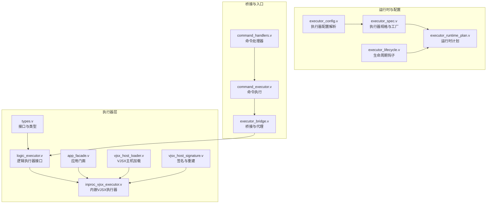
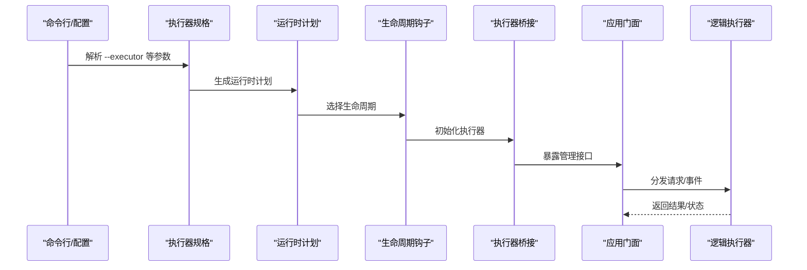
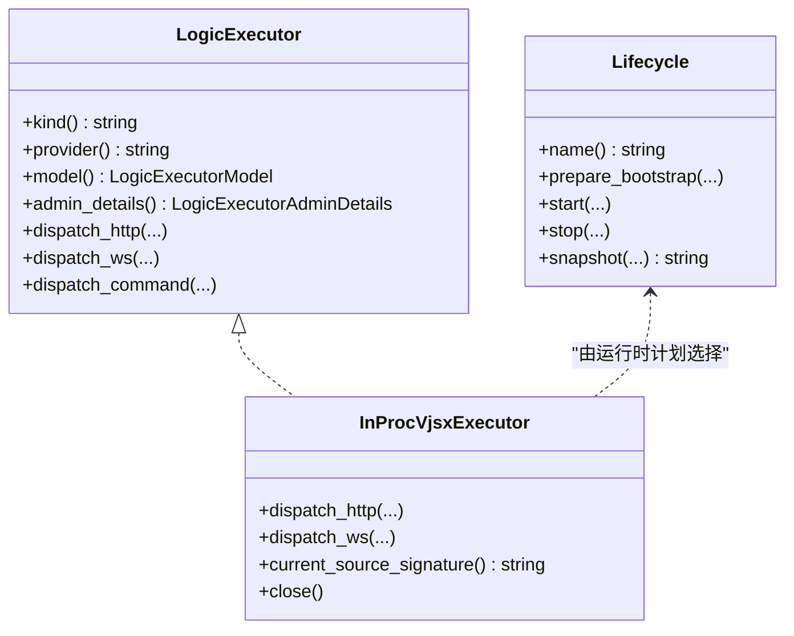
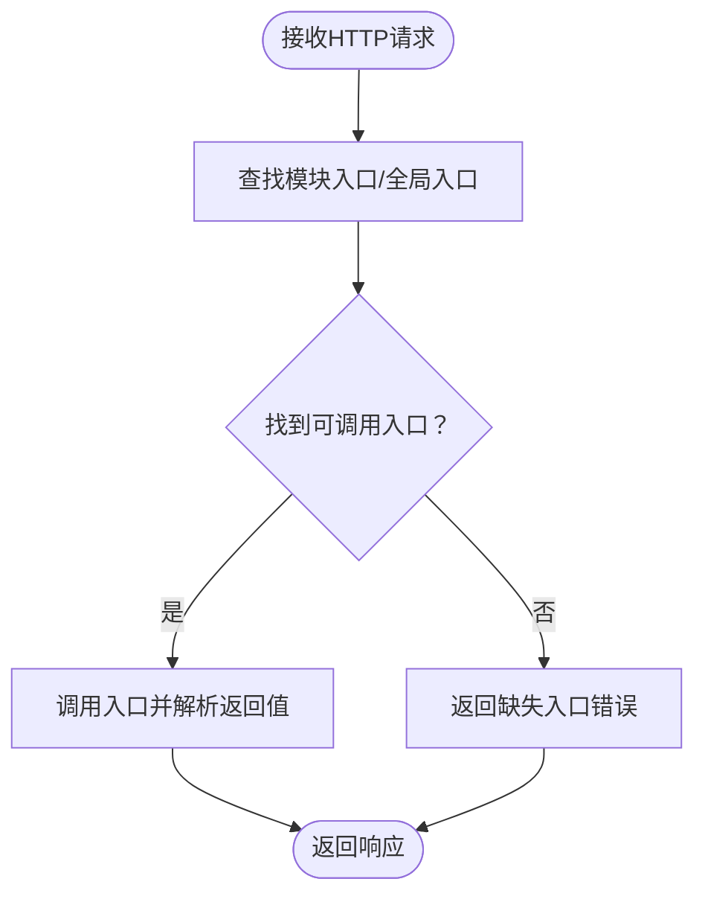

# 自定义执行器开发

<cite>
**本文引用的文件**
- [src/executor/types.v](file://src/executor/types.v)
- [src/executor/logic_executor.v](file://src/executor/logic_executor.v)
- [src/executor/inproc_vjsx_executor.v](file://src/executor/inproc_vjsx_executor.v)
- [src/executor/app_facade.v](file://src/executor/app_facade.v)
- [src/executor/vjsx_host_loader.v](file://src/executor/vjsx_host_loader.v)
- [src/executor/vjsx_host_signature.v](file://src/executor/vjsx_host_signature.v)
- [src/executor_config.v](file://src/executor_config.v)
- [src/executor_lifecycle.v](file://src/executor_lifecycle.v)
- [src/executor_runtime_plan.v](file://src/executor_runtime_plan.v)
- [src/executor_spec.v](file://src/executor_spec.v)
- [src/executor_bridge.v](file://src/executor_bridge.v)
- [src/command_executor.v](file://src/command_executor.v)
- [src/command_handlers.v](file://src/command_handlers.v)
- [src/multi_server_runtime_config.v](file://src/multi_server_runtime_config.v)
- [src/server_runtime_config.v](file://src/server_runtime_config.v)
- [src/admin_runtime.v](file://src/admin_runtime.v)
- [src/admin_server.v](file://src/admin_server.v)
- [src/admin_workers.v](file://src/admin_workers.v)
- [src/jsonutils/json_utils.v](file://src/jsonutils/json_utils.v)
- [src/jsonutils/json_utils_test.v](file://src/jsonutils/json_utils_test.v)
- [examples/config/hello.toml](file://examples/config/hello.toml)
- [examples/hello-app.php](file://examples/hello-app.php)
- [examples/vjsx/openai-executor-app.mts](file://examples/vjsx/openai-executor-app.mts)
- [examples/vjsx/api-demo-handler.mts](file://examples/vjsx/api-demo-handler.mts)
- [examples/vjsx/hello-handler.mts](file://examples/vjsx/hello-handler.mts)
- [config/vhttpd.example.toml](file://config/vhttpd.example.toml)
- [config/vhttpd.multi.example.toml](file://config/vhttpd.multi.example.toml)
- [config/vhttpd.vjsx.example.toml](file://config/vhttpd.vjsx.example.toml)
</cite>

## 目录
1. [简介](#简介)
2. [项目结构](#项目结构)
3. [核心组件](#核心组件)
4. [架构总览](#架构总览)
5. [详细组件分析](#详细组件分析)
6. [依赖关系分析](#依赖关系分析)
7. [性能考量](#性能考量)
8. [故障排查指南](#故障排查指南)
9. [结论](#结论)
10. [附录](#附录)

## 简介
本指南面向希望为 vhttpd 开发“自定义执行器”的工程师，系统阐述执行器接口规范与实现要求、注册与配置流程、测试策略、监控与调试技术以及最佳实践。vhttpd 提供多种内置执行器（如 none、php、vjsx），并通过统一的执行器抽象对外暴露能力，支持嵌入式模型与工作线程后端两种运行模式，并通过生命周期钩子与运行时计划进行编排。

## 项目结构
围绕执行器开发的关键目录与文件：
- 执行器接口与类型：src/executor/*.v
- 执行器桥接与门面：src/executor_bridge.v、src/executor/app_facade.v
- 运行时计划与生命周期：src/executor_runtime_plan.v、src/executor_lifecycle.v
- 配置解析与规格：src/executor_config.v、src/executor_spec.v
- 示例与配置：examples/*、config/*.toml

图表来源
- [src/executor/types.v](file://src/executor/types.v)
- [src/executor/logic_executor.v](file://src/executor/logic_executor.v)
- [src/executor/inproc_vjsx_executor.v](file://src/executor/inproc_vjsx_executor.v)
- [src/executor/app_facade.v](file://src/executor/app_facade.v)
- [src/executor/vjsx_host_loader.v](file://src/executor/vjsx_host_loader.v)
- [src/executor/vjsx_host_signature.v](file://src/executor/vjsx_host_signature.v)
- [src/executor_config.v](file://src/executor_config.v)
- [src/executor_spec.v](file://src/executor_spec.v)
- [src/executor_runtime_plan.v](file://src/executor_runtime_plan.v)
- [src/executor_lifecycle.v](file://src/executor_lifecycle.v)
- [src/executor_bridge.v](file://src/executor_bridge.v)
- [src/command_executor.v](file://src/command_executor.v)
- [src/command_handlers.v](file://src/command_handlers.v)

章节来源
- [src/executor/types.v](file://src/executor/types.v)
- [src/executor_spec.v](file://src/executor_spec.v)
- [src/executor_runtime_plan.v](file://src/executor_runtime_plan.v)
- [src/executor_lifecycle.v](file://src/executor_lifecycle.v)
- [src/executor_config.v](file://src/executor_config.v)

## 核心组件
- 执行器接口与模型
  - 逻辑执行器接口定义了执行器的生命周期、模型类型、提供商标识与管理细节等能力。
  - 执行器模型区分“嵌入式”与“工作线程”，用于决定是否需要后端套接字或进程。
- 内嵌VJSX执行器
  - 基于 VJSX 的内嵌执行器，支持多车道（线程）隔离、模块入口解析、源码签名变更触发重建等特性。
- 应用门面与桥接
  - 桥接层将执行器能力暴露给上层应用，提供事件发射、运行时快照、命令执行等统一接口。
- 规格与工厂
  - 执行器规格描述了支持的种类、别名、提供商、生命周期、工作线程后端模式与配置表面（flags）。
  - 工厂根据规格与参数构建具体执行器实例。
- 运行时计划与生命周期
  - 运行时计划负责解析命令行与配置，确定执行器种类、生命周期与后端模式；生命周期钩子提供启动/停止等扩展点。

章节来源
- [src/executor/types.v](file://src/executor/types.v)
- [src/executor/logic_executor.v](file://src/executor/logic_executor.v)
- [src/executor/inproc_vjsx_executor.v](file://src/executor/inproc_vjsx_executor.v)
- [src/executor/app_facade.v](file://src/executor/app_facade.v)
- [src/executor/vjsx_host_loader.v](file://src/executor/vjsx_host_loader.v)
- [src/executor/vjsx_host_signature.v](file://src/executor/vjsx_host_signature.v)
- [src/executor_spec.v](file://src/executor_spec.v)
- [src/executor_runtime_plan.v](file://src/executor_runtime_plan.v)
- [src/executor_lifecycle.v](file://src/executor_lifecycle.v)
- [src/executor_bridge.v](file://src/executor_bridge.v)

## 架构总览
下图展示执行器在 vhttpd 中的总体交互：配置解析生成运行时计划，选择执行器与生命周期，桥接层将执行器能力暴露给应用与命令处理链路。

图表来源
- [src/executor_spec.v](file://src/executor_spec.v)
- [src/executor_runtime_plan.v](file://src/executor_runtime_plan.v)
- [src/executor_lifecycle.v](file://src/executor_lifecycle.v)
- [src/executor_bridge.v](file://src/executor_bridge.v)
- [src/executor/app_facade.v](file://src/executor/app_facade.v)

## 详细组件分析

### 执行器接口与生命周期
- 接口职责
  - 提供执行器种类、提供商、模型类型、管理详情等元信息。
  - 支持 HTTP/WebSocket 请求分发、流式输出、命令执行等能力。
- 生命周期钩子
  - 启动/停止：在应用启动与关闭阶段调用，用于资源分配与回收。
  - 快照：导出运行时状态，便于管理端查看。
- 典型实现
  - 内嵌VJSX执行器实现了模块入口解析、默认导出与别名方法调用、源码签名变化触发重建等。

图表来源
- [src/executor/logic_executor.v](file://src/executor/logic_executor.v)
- [src/executor/inproc_vjsx_executor.v](file://src/executor/inproc_vjsx_executor.v)
- [src/executor_lifecycle.v](file://src/executor_lifecycle.v)

章节来源
- [src/executor/types.v](file://src/executor/types.v)
- [src/executor/logic_executor.v](file://src/executor/logic_executor.v)
- [src/executor_lifecycle.v](file://src/executor_lifecycle.v)

### 内嵌VJSX执行器
- 多车道与模块入口
  - 支持多车道隔离，每车道维护独立的 VJSX 会话与模块绑定。
  - 入口查找优先尝试模块导出，再回退到全局命名空间，支持默认导出与别名方法。
- 源码签名与重建
  - 基于源文件签名判断是否需要重建车道主机，避免重复编译。
- 关键流程

图表来源
- [src/executor/inproc_vjsx_executor.v](file://src/executor/inproc_vjsx_executor.v)

章节来源
- [src/executor/inproc_vjsx_executor.v](file://src/executor/inproc_vjsx_executor.v)
- [src/executor/vjsx_host_loader.v](file://src/executor/vjsx_host_loader.v)
- [src/executor/vjsx_host_signature.v](file://src/executor/vjsx_host_signature.v)

### 执行器规格与工厂
- 规格定义
  - 包含执行器种类、别名、提供商、生命周期、模型、工作线程后端模式与配置表面（flags）。
- 工厂构建
  - 根据规格与参数构建具体执行器实例，例如内嵌VJSX执行器。
- 管理端快照
  - 将规格转换为管理端可见的快照，包含种类、提供商、生命周期、模型、后端模式与配置表面。

章节来源
- [src/executor_spec.v](file://src/executor_spec.v)

### 运行时计划与生命周期
- 运行时计划
  - 解析命令行与配置，确定执行器种类、生命周期、后端模式、工作线程套接字与环境变量等。
- 生命周期
  - 在启动前准备、启动、停止与快照阶段提供扩展点，确保资源正确管理。

章节来源
- [src/executor_runtime_plan.v](file://src/executor_runtime_plan.v)
- [src/executor_lifecycle.v](file://src/executor_lifecycle.v)

### 桥接与应用门面
- 桥接职责
  - 将执行器能力代理到应用，提供事件发射、运行时快照、WebSocket命令执行等。
- 门面能力
  - 对外暴露执行器种类、模型、提供商与管理详情，便于上层逻辑使用。

章节来源
- [src/executor_bridge.v](file://src/executor_bridge.v)
- [src/executor/app_facade.v](file://src/executor/app_facade.v)

### 配置与注册
- 配置文件格式
  - 使用 TOML 格式，支持单机与多实例配置，包含执行器种类、入口文件、线程数、签名根等。
- 参数验证与运行时初始化
  - 通过执行器规格与运行时计划进行参数校验与初始化，确保执行器与生命周期匹配。
- 注册流程
  - 规格解析 → 运行时计划 → 生命周期钩子 → 桥接代理 → 应用门面。

章节来源
- [src/executor_config.v](file://src/executor_config.v)
- [src/executor_spec.v](file://src/executor_spec.v)
- [src/executor_runtime_plan.v](file://src/executor_runtime_plan.v)
- [config/vhttpd.example.toml](file://config/vhttpd.example.toml)
- [config/vhttpd.multi.example.toml](file://config/vhttpd.multi.example.toml)
- [config/vhttpd.vjsx.example.toml](file://config/vhttpd.vjsx.example.toml)

### 完整开发示例

#### Hello 执行器（PHP）
- 目标：实现一个最小可用的 PHP 执行器，处理 HTTP 请求并返回文本。
- 步骤
  - 编写 PHP 应用入口文件，实现请求处理逻辑。
  - 在配置中指定执行器为 php，并设置 worker 入口与环境变量。
  - 启动服务，验证请求被路由到 PHP 执行器。
- 参考
  - 示例应用入口：[examples/hello-app.php](file://examples/hello-app.php)
  - 示例配置：[examples/config/hello.toml](file://examples/config/hello.toml)

章节来源
- [examples/hello-app.php](file://examples/hello-app.php)
- [examples/config/hello.toml](file://examples/config/hello.toml)

#### VJSX 执行器（API 演示）
- 目标：实现一个基于 VJSX 的内嵌执行器，提供 API 路由与响应。
- 步骤
  - 编写 VJSX 处理器，导出默认函数或具名方法。
  - 在配置中指定执行器为 vjsx，并设置入口、模块根、签名根与线程数。
  - 启动服务，验证请求被路由到内嵌 VJSX 执行器。
- 参考
  - 示例入口：[examples/vjsx/api-demo-handler.mts](file://examples/vjsx/api-demo-handler.mts)
  - 示例入口（Hello）：[examples/vjsx/hello-handler.mts](file://examples/vjsx/hello-handler.mts)
  - 示例入口（OpenAI 执行器）：[examples/vjsx/openai-executor-app.mts](file://examples/vjsx/openai-executor-app.mts)
  - VJSX 示例配置：[config/vhttpd.vjsx.example.toml](file://config/vhttpd.vjsx.example.toml)

章节来源
- [examples/vjsx/api-demo-handler.mts](file://examples/vjsx/api-demo-handler.mts)
- [examples/vjsx/hello-handler.mts](file://examples/vjsx/hello-handler.mts)
- [examples/vjsx/openai-executor-app.mts](file://examples/vjsx/openai-executor-app.mts)
- [config/vhttpd.vjsx.example.toml](file://config/vhttpd.vjsx.example.toml)

### 测试策略
- 单元测试
  - 针对执行器接口与类型进行断言，验证种类、提供商、模型与管理详情。
  - 参考：[src/jsonutils/json_utils_test.v](file://src/jsonutils/json_utils_test.v)
- 集成测试
  - 验证执行器在完整运行时中的行为，包括请求分发、生命周期钩子与桥接代理。
  - 参考：[src/executor_runtime_plan.v](file://src/executor_runtime_plan.v)、[src/executor_lifecycle.v](file://src/executor_lifecycle.v)
- 性能测试
  - 结合基准脚本与负载测试工具，评估执行器在高并发下的吞吐与延迟。
  - 参考：[bench/k6_short.js](file://bench/k6_short.js)、[bench/k6_stream.js](file://bench/k6_stream.js)

章节来源
- [src/jsonutils/json_utils_test.v](file://src/jsonutils/json_utils_test.v)
- [src/executor_runtime_plan.v](file://src/executor_runtime_plan.v)
- [src/executor_lifecycle.v](file://src/executor_lifecycle.v)
- [bench/k6_short.js](file://bench/k6_short.js)
- [bench/k6_stream.js](file://bench/k6_stream.js)

### 监控与调试
- 日志与事件
  - 通过桥接层的事件发射机制，向管理端上报执行器状态与事件摘要。
- 运行时快照
  - 应用门面提供运行时快照，包含执行器种类、生命周期、模型与提供商等信息。
- 故障诊断
  - 利用生命周期钩子的快照能力与执行器入口解析失败的错误提示定位问题。

章节来源
- [src/executor_bridge.v](file://src/executor_bridge.v)
- [src/executor/app_facade.v](file://src/executor/app_facade.v)
- [src/executor/inproc_vjsx_executor.v](file://src/executor/inproc_vjsx_executor.v)

### 最佳实践
- 错误处理
  - 明确区分执行器内部错误与入口缺失错误，提供清晰的错误消息以便诊断。
- 资源管理
  - 在生命周期钩子中正确释放资源，避免内存泄漏；对于内嵌执行器，注意车道主机的重建与销毁。
- 安全考虑
  - 限制文件系统访问权限，仅在必要时启用；严格校验入口文件与签名，防止未授权代码注入。

章节来源
- [src/executor/inproc_vjsx_executor.v](file://src/executor/inproc_vjsx_executor.v)
- [src/executor_lifecycle.v](file://src/executor_lifecycle.v)

## 依赖关系分析
- 组件耦合
  - 执行器接口与具体实现解耦，通过规格与工厂进行装配。
  - 桥接层与应用门面提供统一代理，降低上层对底层实现的感知。
- 外部依赖
  - VJSX 引擎与 Node 运行时（按配置选择）作为内嵌执行器的运行时基础。
- 循环依赖
  - 通过桥接与门面避免直接循环引用，保持控制流单向。

图表来源
- [src/executor_spec.v](file://src/executor_spec.v)
- [src/executor_bridge.v](file://src/executor_bridge.v)
- [src/executor/app_facade.v](file://src/executor/app_facade.v)

章节来源
- [src/executor_spec.v](file://src/executor_spec.v)
- [src/executor_bridge.v](file://src/executor_bridge.v)
- [src/executor/app_facade.v](file://src/executor/app_facade.v)

## 性能考量
- 多车道隔离
  - 通过多车道减少上下文切换开销，提升并发处理能力。
- 源码签名重建
  - 仅在签名变化时重建车道主机，避免不必要的编译成本。
- 后端模式选择
  - 嵌入式适合轻量场景，工作线程后端适合重负载场景；根据实际需求选择合适的模型与后端模式。

章节来源
- [src/executor/inproc_vjsx_executor.v](file://src/executor/inproc_vjsx_executor.v)
- [src/executor_runtime_plan.v](file://src/executor_runtime_plan.v)

## 故障排查指南
- 常见问题
  - 入口缺失：检查模块导出与别名方法是否存在。
  - 线程数与签名根配置不一致：核对配置文件与 flags 是否匹配。
  - 生命周期钩子未触发：确认运行时计划是否正确选择了生命周期。
- 定位手段
  - 查看运行时快照与事件日志，结合错误消息定位问题。

章节来源
- [src/executor/inproc_vjsx_executor.v](file://src/executor/inproc_vjsx_executor.v)
- [src/executor_runtime_plan.v](file://src/executor_runtime_plan.v)
- [src/executor_lifecycle.v](file://src/executor_lifecycle.v)

## 结论
通过统一的执行器接口、灵活的规格与工厂、完善的生命周期与运行时计划，vhttpd 为开发者提供了可插拔的执行器体系。遵循本文档的接口规范、配置流程、测试策略与最佳实践，即可快速开发并稳定运行自定义执行器。

## 附录
- 管理端接口
  - 获取执行器规格快照与运行时摘要，便于运维与可观测性。
- 命令与调度
  - 命令执行器与处理器链路确保请求在执行器与后端之间正确流转。

章节来源
- [src/admin_runtime.v](file://src/admin_runtime.v)
- [src/admin_server.v](file://src/admin_server.v)
- [src/admin_workers.v](file://src/admin_workers.v)
- [src/command_executor.v](file://src/command_executor.v)
- [src/command_handlers.v](file://src/command_handlers.v)