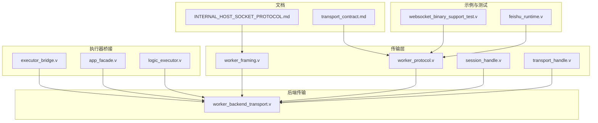
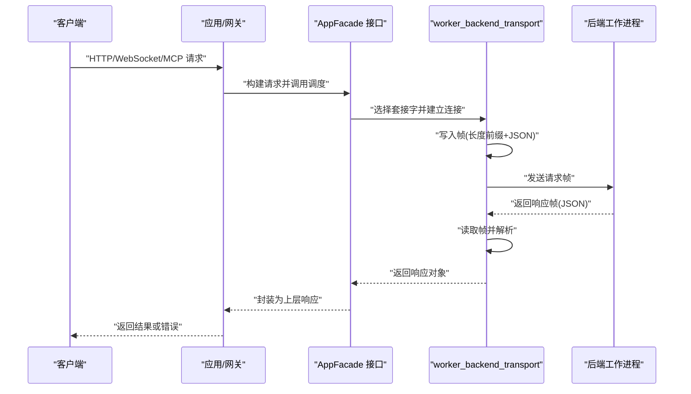
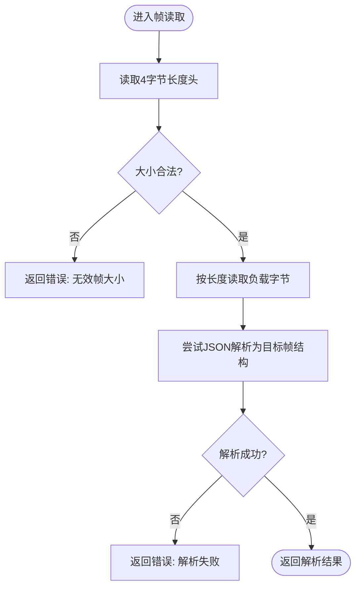
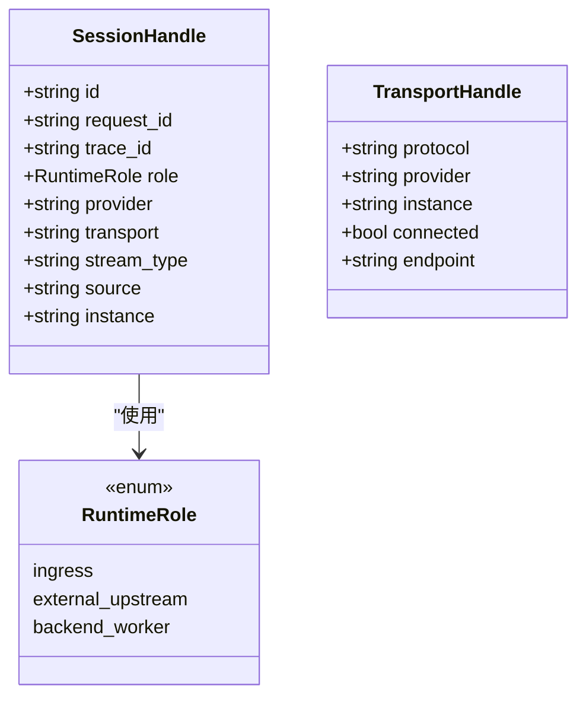
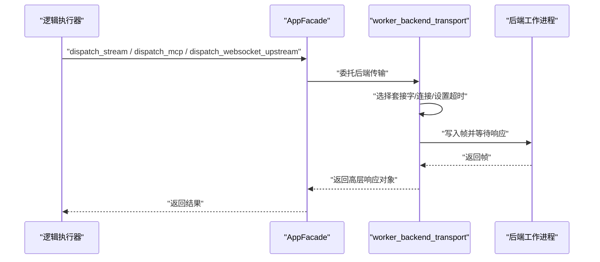
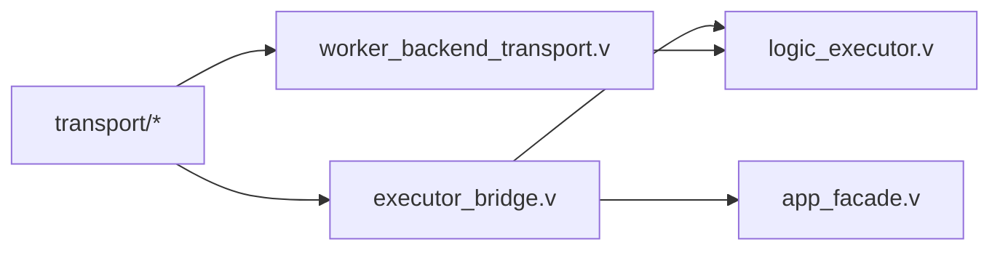

# 协议扩展开发

<cite>
**本文引用的文件**
- [INTERNAL_HOST_SOCKET_PROTOCOL.md](file://docs/INTERNAL_HOST_SOCKET_PROTOCOL.md)
- [worker_protocol.v](file://src/transport/worker_protocol.v)
- [worker_framing.v](file://src/transport/worker_framing.v)
- [session_handle.v](file://src/transport/session_handle.v)
- [transport_handle.v](file://src/transport/transport_handle.v)
- [worker_backend_transport.v](file://src/worker_backend_transport.v)
- [executor_bridge.v](file://src/executor_bridge.v)
- [logic_executor.v](file://src/executor/logic_executor.v)
- [app_facade.v](file://src/executor/app_facade.v)
- [feishu_runtime.v](file://src/feishu_runtime.v)
- [websocket_binary_support_test.v](file://src/websocket_binary_support_test.v)
- [transport_contract.md](file://docs/transport_contract.md)
- [TODO_REFACTOR.md](file://TODO_REFACTOR.md)
</cite>

## 目录
1. [引言](#引言)
2. [项目结构](#项目结构)
3. [核心组件](#核心组件)
4. [架构总览](#架构总览)
5. [详细组件分析](#详细组件分析)
6. [依赖关系分析](#依赖关系分析)
7. [性能考量](#性能考量)
8. [故障排查指南](#故障排查指南)
9. [结论](#结论)
10. [附录](#附录)

## 引言
本文件面向“协议扩展开发”的目标，系统化阐述 vhttpd 内部主机套接字协议的设计原理与扩展方法，覆盖协议帧格式、消息编码与解码机制；给出新增传输协议的完整实现路径（握手、数据帧结构、错误处理）；说明协议与执行器系统的集成方式（请求路由、响应转发、状态同步）；并提供兼容性与版本管理建议、调试与测试方法，帮助开发者在不破坏现有系统的情况下完成新协议的无缝集成。

## 项目结构
围绕协议扩展的核心目录与文件如下：
- 文档：内部主机套接字协议规范、传输契约文档
- 传输层：协议结构体、帧编解码、会话与传输句柄
- 执行器桥接：应用门面接口与实现，统一调度后端工作进程
- 后端传输：基于 Unix 域套接字的帧读写、请求分发与响应解析
- 示例与测试：WebSocket 负载支持、二进制帧处理等

图表来源
- [worker_protocol.v:1-272](file://src/transport/worker_protocol.v#L1-L272)
- [worker_framing.v:1-173](file://src/transport/worker_framing.v#L1-L173)
- [session_handle.v:1-90](file://src/transport/session_handle.v#L1-L90)
- [transport_handle.v:1-21](file://src/transport/transport_handle.v#L1-L21)
- [worker_backend_transport.v:1-371](file://src/worker_backend_transport.v#L1-L371)
- [executor_bridge.v:1-153](file://src/executor_bridge.v#L1-L153)
- [app_facade.v:1-22](file://src/executor/app_facade.v#L1-L22)
- [logic_executor.v:186-236](file://src/executor/logic_executor.v#L186-L236)
- [websocket_binary_support_test.v:1-61](file://src/websocket_binary_support_test.v#L1-L61)
- [feishu_runtime.v:997-1033](file://src/feishu_runtime.v#L997-L1033)
- [INTERNAL_HOST_SOCKET_PROTOCOL.md:1-105](file://docs/INTERNAL_HOST_SOCKET_PROTOCOL.md#L1-L105)
- [transport_contract.md](file://docs/transport_contract.md)

章节来源
- [worker_protocol.v:1-272](file://src/transport/worker_protocol.v#L1-L272)
- [worker_framing.v:1-173](file://src/transport/worker_framing.v#L1-L173)
- [session_handle.v:1-90](file://src/transport/session_handle.v#L1-L90)
- [transport_handle.v:1-21](file://src/transport/transport_handle.v#L1-L21)
- [worker_backend_transport.v:1-371](file://src/worker_backend_transport.v#L1-L371)
- [executor_bridge.v:1-153](file://src/executor_bridge.v#L1-L153)
- [app_facade.v:1-22](file://src/executor/app_facade.v#L1-L22)
- [logic_executor.v:186-236](file://src/executor/logic_executor.v#L186-L236)
- [websocket_binary_support_test.v:1-61](file://src/websocket_binary_support_test.v#L1-L61)
- [feishu_runtime.v:997-1033](file://src/feishu_runtime.v#L997-L1033)
- [INTERNAL_HOST_SOCKET_PROTOCOL.md:1-105](file://docs/INTERNAL_HOST_SOCKET_PROTOCOL.md#L1-L105)
- [transport_contract.md](file://docs/transport_contract.md)

## 核心组件
- 协议结构体与消息模型：定义 Worker 请求/响应、流式帧、WebSocket/MCP 消息、上游计划等结构，用于序列化与反序列化。
- 帧编解码与 URL/HTTP 辅助：提供长度前缀的帧读写、查询参数解析、头部与 Cookie 提取、服务器信息映射等。
- 会话与传输句柄：抽象运行时角色、会话上下文、传输类型与实例标识，便于路由与追踪。
- 执行器桥接与应用门面：通过 AppFacade 统一暴露后端调度能力，避免直接实现接口带来的编译问题。
- 后端传输：封装 Unix 套接字连接、重试、超时设置、帧发送与响应读取，并对错误进行分类。

章节来源
- [worker_protocol.v:1-272](file://src/transport/worker_protocol.v#L1-L272)
- [worker_framing.v:1-173](file://src/transport/worker_framing.v#L1-L173)
- [session_handle.v:1-90](file://src/transport/session_handle.v#L1-L90)
- [transport_handle.v:1-21](file://src/transport/transport_handle.v#L1-L21)
- [executor_bridge.v:1-153](file://src/executor_bridge.v#L1-L153)
- [app_facade.v:1-22](file://src/executor/app_facade.v#L1-L22)
- [worker_backend_transport.v:1-371](file://src/worker_backend_transport.v#L1-L371)

## 架构总览
下图展示从上层请求到后端工作进程的协议交互流程，涵盖帧格式、握手与错误处理：

图表来源
- [worker_backend_transport.v:149-161](file://src/worker_backend_transport.v#L149-L161)
- [worker_backend_transport.v:168-180](file://src/worker_backend_transport.v#L168-L180)
- [worker_backend_transport.v:187-202](file://src/worker_backend_transport.v#L187-L202)
- [executor_bridge.v:65-83](file://src/executor_bridge.v#L65-L83)
- [app_facade.v:18-22](file://src/executor/app_facade.v#L18-L22)

## 详细组件分析

### 协议帧格式与消息编码/解码
- 帧格式：每个帧由 4 字节大端长度前缀 + 紧随其后的精确长度字节负载组成；读取时进行大小校验，防止异常帧导致内存越界。
- 编码：HTTP 请求被标准化为目标路径、查询参数、头部、Cookie、服务器信息等字段，封装为 WorkerRequestPayload 并 JSON 序列化。
- 解码：根据模式/事件识别不同帧类型（如流式开始、上游计划），并解析为对应结构体。
- 错误处理：对无效帧大小、EOF、超时、队列满/超时等情况进行分类，返回语义化的状态码与错误类别。

图表来源
- [worker_framing.v:36-44](file://src/transport/worker_framing.v#L36-L44)
- [worker_framing.v:157-172](file://src/transport/worker_framing.v#L157-L172)
- [worker_backend_transport.v:38-46](file://src/worker_backend_transport.v#L38-L46)
- [worker_backend_transport.v:96-99](file://src/worker_backend_transport.v#L96-L99)

章节来源
- [worker_framing.v:10-44](file://src/transport/worker_framing.v#L10-L44)
- [worker_framing.v:157-172](file://src/transport/worker_framing.v#L157-L172)
- [worker_backend_transport.v:96-99](file://src/worker_backend_transport.v#L96-L99)
- [worker_backend_transport.v:298-313](file://src/worker_backend_transport.v#L298-L313)

### 会话与传输句柄
- 会话句柄：承载请求 ID、跟踪 ID、角色（入口/外部上游/后端工作进程）、提供者、传输类型、流类型、来源、实例等，用于跨模块传递与追踪。
- 传输句柄：抽象协议、提供者、实例、连接状态与端点，便于统一管理多种传输通道。

图表来源
- [session_handle.v:10-21](file://src/transport/session_handle.v#L10-L21)
- [session_handle.v:4-8](file://src/transport/session_handle.v#L4-L8)
- [transport_handle.v:3-10](file://src/transport/transport_handle.v#L3-L10)

章节来源
- [session_handle.v:1-90](file://src/transport/session_handle.v#L1-L90)
- [transport_handle.v:1-21](file://src/transport/transport_handle.v#L1-L21)

### 执行器系统集成
- AppFacade 接口：统一暴露运行时配置、后端套接字选择、请求生命周期钩子、各类协议分发方法。
- 执行器代理：逻辑执行器通过 AppFacade 将请求路由至 worker_backend_transport，再经 Unix 套接字与后端通信。
- 结果封装：后端响应被解析为高层结构，再由执行器或桥接层转换为上层可消费的结果。

图表来源
- [app_facade.v:8-22](file://src/executor/app_facade.v#L8-L22)
- [executor_bridge.v:65-83](file://src/executor_bridge.v#L65-L83)
- [logic_executor.v:216-229](file://src/executor/logic_executor.v#L216-L229)
- [worker_backend_transport.v:149-161](file://src/worker_backend_transport.v#L149-L161)

章节来源
- [app_facade.v:1-22](file://src/executor/app_facade.v#L1-L22)
- [executor_bridge.v:1-153](file://src/executor_bridge.v#L1-L153)
- [logic_executor.v:186-236](file://src/executor/logic_executor.v#L186-L236)
- [worker_backend_transport.v:149-202](file://src/worker_backend_transport.v#L149-L202)

### 新增传输协议的实现指南
- 协议定义
  - 在 worker_protocol.v 中新增协议专用结构体（参考现有 WorkerStreamFrame、WorkerMcpDispatchRequest 等），明确字段含义与默认值。
  - 若涉及多帧交互，定义帧枚举与起始帧识别函数（参考 try_decode_stream_start、try_decode_upstream_plan）。
- 消息处理器
  - 在 worker_backend_transport.v 中新增对应的分发函数，遵循现有模式：选择套接字 -> 连接 -> 设置超时 -> 写帧 -> 读帧 -> 解析 -> 返回高层响应。
  - 对于 WebSocket/MCP/上游命令等场景，复用现有读写辅助函数（read_frame/write_frame、read_worker_websocket_frame 等）。
- 连接管理
  - 使用 worker_backend_connect_selected 与重试逻辑，结合 read_timeout_ms 控制超时。
  - 对连接失败、队列满/超时、超时等错误进行分类与上报（参考 classify_worker_error）。
- 请求路由与状态同步
  - 通过 SessionHandle 抽象请求上下文，确保 trace_id/request_id 一致传递。
  - 在执行器桥接层（executor_bridge.v）中新增方法，将高层调用映射到新的后端分发函数。
- 兼容性与版本管理
  - 采用“模式/事件”字段区分协议版本与功能集，保持向后兼容的默认行为。
  - 对新增字段采用可选策略，避免破坏旧客户端；在文档中明确版本演进与弃用策略。

章节来源
- [worker_protocol.v:1-272](file://src/transport/worker_protocol.v#L1-L272)
- [worker_backend_transport.v:120-147](file://src/worker_backend_transport.v#L120-L147)
- [worker_backend_transport.v:298-313](file://src/worker_backend_transport.v#L298-L313)
- [executor_bridge.v:65-83](file://src/executor_bridge.v#L65-L83)
- [session_handle.v:37-71](file://src/transport/session_handle.v#L37-L71)

### 主机套接字协议（内部）设计要点
- 帧格式：4 字节长度前缀 + JSON 负载；首帧包含 mode/method/path/query/body 等字段。
- 模式：vhttpd_admin（只读查询）、vhttpd_gateway（主动网关操作）。
- 特殊场景：二进制上传采用两帧（JSON 头 + 原始字节），需严格校验 content_length 与实际大小一致。
- 响应：单帧 JSON，包含 status/headers/body/error 等字段。

章节来源
- [INTERNAL_HOST_SOCKET_PROTOCOL.md:12-105](file://docs/INTERNAL_HOST_SOCKET_PROTOCOL.md#L12-L105)

### 二进制与 WebSocket 支持示例
- WebSocket 负载支持：文本帧与二进制帧分别处理，二进制帧以 Base64 编码传输；控制帧（如 ping）不支持。
- 上游命令与结果归一化：前端 JS 层对结果进行标准化，保证 accepted/closed/commands/affinity_key/error 等字段存在且类型正确。

章节来源
- [websocket_binary_support_test.v:1-61](file://src/websocket_binary_support_test.v#L1-L61)
- [inproc_vjsx_http_facade.js:1759-1846](file://src/inproc_vjsx_http_facade.js#L1759-L1846)

## 依赖关系分析
- 模块内聚与耦合
  - 传输层（transport）集中了协议结构与编解码，降低跨模块重复实现。
  - 执行器桥接（executor_bridge）通过接口隔离，避免主模块直接实现复杂接口导致的编译问题。
- 外部依赖
  - Unix 域套接字、JSON 编解码、HTTP/URL 工具、时间与字符串构建器等标准库。
- 循环依赖规避
  - 通过 AppFacade 接口与包装器模式，避免主模块与执行器模块之间的直接循环导入。

图表来源
- [worker_protocol.v:1-272](file://src/transport/worker_protocol.v#L1-L272)
- [worker_framing.v:1-173](file://src/transport/worker_framing.v#L1-L173)
- [worker_backend_transport.v:1-371](file://src/worker_backend_transport.v#L1-L371)
- [executor_bridge.v:1-153](file://src/executor_bridge.v#L1-L153)
- [app_facade.v:1-22](file://src/executor/app_facade.v#L1-L22)
- [logic_executor.v:186-236](file://src/executor/logic_executor.v#L186-L236)

章节来源
- [TODO_REFACTOR.md:9-21](file://TODO_REFACTOR.md#L9-L21)

## 性能考量
- 帧大小限制：读取时对帧大小进行上限检查，防止过大帧导致内存压力。
- 连接重试与超时：连接失败与读取超时采用指数退避与固定间隔重试，避免瞬时抖动放大。
- 流式输出：HTTP/1.1 分块传输与 SSE 输出路径，减少一次性缓冲开销。
- 队列与背压：对工作进程队列满/超时进行快速失败与错误分类，避免级联阻塞。

章节来源
- [worker_framing.v:40-44](file://src/transport/worker_framing.v#L40-L44)
- [worker_backend_transport.v:101-147](file://src/worker_backend_transport.v#L101-L147)
- [worker_backend_transport.v:229-278](file://src/worker_backend_transport.v#L229-L278)
- [worker_backend_transport.v:298-313](file://src/worker_backend_transport.v#L298-L313)

## 故障排查指南
- 常见错误分类
  - 工作池耗尽：返回 503，错误类别 worker_pool_exhausted。
  - 队列满/超时：返回 503/504，错误类别 worker_queue_full/worker_queue_timeout。
  - 超时：返回 504，错误类别 timeout。
  - 其他传输错误：返回 502，错误类别 transport_error。
- 定位手段
  - 查看日志中的 worker-transport 输出，确认帧发送/接收是否成功。
  - 校验帧大小与 JSON 结构，确保模式/事件字段正确。
  - 对于 WebSocket，确认 opcode 与 payload 类型匹配（文本/二进制）。
- 单元测试参考
  - WebSocket 负载支持测试：验证文本帧、二进制帧与控制帧的行为。
  - Feishu 运行时协议：验证编码字段顺序与变长整数编码。

章节来源
- [worker_backend_transport.v:298-313](file://src/worker_backend_transport.v#L298-L313)
- [websocket_binary_support_test.v:1-61](file://src/websocket_binary_support_test.v#L1-L61)
- [feishu_runtime.v:997-1033](file://src/feishu_runtime.v#L997-L1033)

## 结论
通过统一的帧格式、清晰的消息模型与严格的错误分类，vhttpd 的传输层为协议扩展提供了坚实基础。借助 AppFacade 与执行器桥接，新增协议可以平滑接入现有调度与生命周期管理。遵循本文的扩展步骤与最佳实践，可在保证兼容性的前提下，快速实现新协议并与执行器系统深度集成。

## 附录
- 协议兼容性与版本管理建议
  - 使用“模式/事件/版本”字段组合表达协议能力，逐步引入新字段并保持默认兼容。
  - 对废弃字段与行为制定明确的弃用时间表并在文档中标注。
- 调试与测试清单
  - 帧大小边界测试：0、1、最大允许值、超过上限。
  - 多帧协议：两阶段请求（JSON 头 + 原始字节）的完整性校验。
  - 错误路径：队列满、连接失败、超时、解析失败的分类与返回码。
  - WebSocket：文本/二进制帧、控制帧拒绝、opcode 正规化。